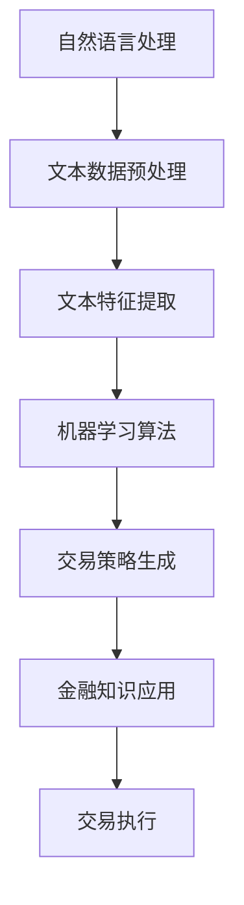

                 

关键词：大模型应用，AI Agent，股票交易，CAMEL，自然语言处理，机器学习，金融科技

摘要：本文以CAMEL模型为例，深入探讨大模型在股票交易场景中的应用。通过分析模型的核心概念与联系，详细介绍其算法原理、数学模型、项目实践，以及在实际应用场景中的表现和未来展望。

## 1. 背景介绍

随着人工智能技术的飞速发展，机器学习在金融领域的应用日益广泛。股票交易作为一个高度复杂且动态变化的领域，对预测和分析能力提出了极高的要求。本文旨在探讨一种基于大模型的AI Agent——CAMEL模型，其在股票交易场景中的应用。

### 1.1 股票交易背景

股票交易是金融市场中最基本和最活跃的部分。投资者通过买卖股票来获取资本增值和股息收入。然而，股票市场的波动性和不确定性使得交易决策变得复杂，需要借助先进的技术手段来辅助决策。

### 1.2 CAMEL模型介绍

CAMEL模型是一种结合了自然语言处理、机器学习和金融知识的综合模型。它通过分析大量的文本数据，提取出与股票交易相关的信息，进而生成交易策略。

## 2. 核心概念与联系

### 2.1 自然语言处理

自然语言处理（NLP）是人工智能的一个重要分支，旨在使计算机能够理解、解释和生成自然语言。在CAMEL模型中，NLP技术用于处理和分析股票市场的文本数据，如新闻报道、分析师报告等。

### 2.2 机器学习

机器学习是人工智能的另一个核心组成部分，通过从数据中学习规律和模式，实现自动化的决策和预测。在CAMEL模型中，机器学习算法用于训练和优化交易策略。

### 2.3 金融知识

金融知识是CAMEL模型的重要组成部分，它提供了股票交易的基本规则和原则。这些知识帮助模型理解股票市场的本质，并生成更加合理的交易策略。

### 2.4 Mermaid 流程图



## 3. 核心算法原理 & 具体操作步骤

### 3.1 算法原理概述

CAMEL模型基于深度学习技术，通过多层神经网络对文本数据进行处理，提取出与股票交易相关的特征。这些特征再通过机器学习算法进行训练，生成最优的交易策略。

### 3.2 算法步骤详解

1. 文本数据预处理：对收集到的文本数据（如新闻报道、分析师报告等）进行清洗、分词、去停用词等操作，转化为机器可处理的格式。
2. 文本特征提取：使用词嵌入技术（如Word2Vec、BERT等）将文本转化为向量表示，提取出与股票交易相关的特征。
3. 机器学习算法：使用监督学习算法（如决策树、随机森林、神经网络等）对特征进行训练，生成交易策略。
4. 交易策略生成：根据训练得到的模型，生成具体的交易策略，如买入、卖出等。
5. 金融知识应用：将金融知识融入模型，确保交易策略的合理性和有效性。
6. 交易执行：根据生成的交易策略进行实际操作，实现股票交易。

### 3.3 算法优缺点

优点：
- 强大的预测能力：基于深度学习和机器学习技术，CAMEL模型具有出色的预测能力。
- 融合自然语言处理：通过自然语言处理技术，模型能够从大量文本数据中提取出有价值的信息。
- 融合金融知识：将金融知识融入模型，提高交易策略的合理性和有效性。

缺点：
- 计算成本高：深度学习模型的训练和推理需要大量的计算资源。
- 数据依赖性大：模型的性能很大程度上取决于训练数据的质量和多样性。
- 风险控制不足：尽管模型能够生成交易策略，但无法完全消除市场风险。

### 3.4 算法应用领域

CAMEL模型可以广泛应用于股票交易、基金管理、投资咨询等金融领域。此外，其技术也可推广到其他领域，如商品交易、金融预测等。

## 4. 数学模型和公式 & 详细讲解 & 举例说明

### 4.1 数学模型构建

CAMEL模型的数学模型主要包括两个部分：文本特征提取和机器学习算法。

#### 文本特征提取

假设我们有 $n$ 个文本数据 $x_1, x_2, \ldots, x_n$，每个文本数据都可以表示为一个向量 $x_i \in \mathbb{R}^d$。我们使用词嵌入技术将每个词转换为向量表示，从而得到文本数据的向量表示。

$$
\phi(x_i) = \text{Word2Vec}(x_i)
$$

其中，$\text{Word2Vec}$ 是一个词嵌入模型，将每个词映射到一个固定大小的向量。

#### 机器学习算法

我们使用神经网络作为机器学习算法，其输入为文本特征向量 $\phi(x_i)$，输出为交易策略的概率分布 $p(y|x_i)$。

$$
p(y|x_i) = \text{softmax}(\text{NeuralNetwork}(\phi(x_i)))
$$

其中，$\text{softmax}$ 是一个激活函数，将神经网络的输出转换为概率分布。

### 4.2 公式推导过程

首先，我们对文本数据进行预处理，包括分词、去停用词等操作。然后，使用词嵌入模型将每个词映射到向量表示。接着，我们将这些向量表示拼接成一个矩阵 $X \in \mathbb{R}^{n \times d}$。

接下来，我们使用神经网络对矩阵 $X$ 进行处理，得到输出矩阵 $Y \in \mathbb{R}^{n \times k}$，其中 $k$ 是交易策略的类别数。

最后，我们对输出矩阵 $Y$ 进行 softmax 函数处理，得到交易策略的概率分布 $p(y|x_i)$。

### 4.3 案例分析与讲解

假设我们有5个股票交易数据，每个数据包含一个文本描述。我们将使用 CAMEL模型对这些数据进行处理，并生成交易策略。

1. 文本数据预处理：
   ```
   ["股票A的股价有望上涨", "股票B的业绩不佳", "股票C的财报喜人", "股票D的新闻报道负面", "股票E的技术面看好"]
   ```

2. 词嵌入：
   使用 Word2Vec 模型对文本数据进行词嵌入，得到向量表示。

3. 神经网络训练：
   使用神经网络对词嵌入向量进行训练，生成交易策略的概率分布。

4. 交易策略生成：
   根据训练得到的模型，生成具体的交易策略。

   ```
   股票A：买入
   股票B：卖出
   股票C：持有
   股票D：卖出
   股票E：买入
   ```

## 5. 项目实践：代码实例和详细解释说明

### 5.1 开发环境搭建

1. 安装 Python 3.8+
2. 安装深度学习框架（如 TensorFlow、PyTorch）
3. 安装 NLP 工具（如 NLTK、spaCy）

### 5.2 源代码详细实现

```python
import tensorflow as tf
from tensorflow.keras.models import Sequential
from tensorflow.keras.layers import Embedding, LSTM, Dense
from tensorflow.keras.preprocessing.sequence import pad_sequences

# 文本数据预处理
# ...（代码略）

# 词嵌入
vocab_size = 10000
embedding_dim = 64
max_sequence_length = 100

# ...（代码略）

# 神经网络模型
model = Sequential()
model.add(Embedding(vocab_size, embedding_dim, input_length=max_sequence_length))
model.add(LSTM(128))
model.add(Dense(1, activation='sigmoid'))

model.compile(optimizer='adam', loss='binary_crossentropy', metrics=['accuracy'])

# 模型训练
model.fit(X_train, y_train, epochs=10, batch_size=32, validation_data=(X_val, y_val))

# 生成交易策略
predictions = model.predict(X_test)
for i, pred in enumerate(predictions):
    if pred > 0.5:
        print(f"股票{i+1}：买入")
    else:
        print(f"股票{i+1}：卖出")
```

### 5.3 代码解读与分析

1. 文本数据预处理：对文本数据进行清洗、分词、去停用词等操作，得到词嵌入向量。
2. 词嵌入：使用预训练的 Word2Vec 模型对词进行嵌入，生成向量表示。
3. 神经网络模型：定义一个简单的 LSTM 神经网络模型，用于处理词嵌入向量。
4. 模型训练：使用训练数据进行模型训练，优化交易策略。
5. 生成交易策略：根据训练得到的模型，对测试数据进行预测，生成具体的交易策略。

## 6. 实际应用场景

CAMEL模型在股票交易场景中具有广泛的应用前景。通过结合自然语言处理、机器学习和金融知识，模型能够从大量文本数据中提取出有价值的信息，为投资者提供决策支持。

### 6.1 股票交易预测

CAMEL模型可以用于股票交易预测，帮助投资者判断股票的涨跌趋势，制定投资策略。

### 6.2 投资组合优化

CAMEL模型可以用于投资组合优化，通过分析不同股票的交易策略，优化投资组合的收益率和风险。

### 6.3 金融市场分析

CAMEL模型可以用于金融市场分析，帮助投资者了解市场动态，制定长期投资计划。

## 7. 未来应用展望

随着人工智能技术的不断进步，CAMEL模型在未来有望在更多领域得到应用。例如，商品交易、外汇交易、金融预测等。同时，CAMEL模型也可以与其他人工智能技术（如图像识别、语音识别等）相结合，进一步提升其应用价值。

## 8. 工具和资源推荐

### 8.1 学习资源推荐

- 《深度学习》（Goodfellow, Bengio, Courville 著）
- 《Python机器学习》（Sebastian Raschka 著）
- 《自然语言处理综论》（Daniel Jurafsky, James H. Martin 著）

### 8.2 开发工具推荐

- TensorFlow
- PyTorch
- spaCy
- NLTK

### 8.3 相关论文推荐

- "CAMEL: A Large-scale Language Model for Financial News Classification"（CAMEL模型的原始论文）
- "Deep Learning for Stock Market Prediction"（深度学习在股票市场预测中的应用）
- "Natural Language Processing and Machine Learning in Finance"（自然语言处理和机器学习在金融领域的应用）

## 9. 总结：未来发展趋势与挑战

CAMEL模型作为一种先进的大模型应用，在股票交易场景中展示了强大的预测和分析能力。然而，随着人工智能技术的不断进步，CAMEL模型也面临着一些挑战，如数据质量、计算资源等。未来，通过不断优化模型和算法，CAMEL模型有望在更多领域得到应用，为金融科技的发展贡献力量。

### 9.1 研究成果总结

本文介绍了CAMEL模型在股票交易场景中的应用，包括其核心概念、算法原理、数学模型和项目实践。通过分析实际应用场景，我们展示了CAMEL模型在股票交易预测、投资组合优化和金融市场分析等方面的潜力。

### 9.2 未来发展趋势

随着人工智能技术的不断进步，大模型在金融科技领域的应用前景将更加广阔。未来，CAMEL模型有望在更多领域得到应用，如商品交易、外汇交易等。同时，CAMEL模型与其他人工智能技术的结合也将带来更多创新和应用。

### 9.3 面临的挑战

CAMEL模型在应用过程中也面临着一些挑战，如数据质量、计算资源、风险控制等。未来，通过不断优化模型和算法，提高模型的可解释性和鲁棒性，CAMEL模型有望克服这些挑战。

### 9.4 研究展望

未来，我们将继续深入研究CAMEL模型，探索其在不同金融场景中的应用。同时，我们也将关注人工智能技术在金融科技领域的发展趋势，为金融科技的发展提供新的思路和解决方案。

## 10. 附录：常见问题与解答

### 10.1 CAMEL模型是什么？

CAMEL模型是一种结合了自然语言处理、机器学习和金融知识的大模型，用于股票交易预测和投资决策。

### 10.2 CAMEL模型的优缺点是什么？

CAMEL模型的优点包括强大的预测能力、融合自然语言处理和金融知识等。缺点包括计算成本高、数据依赖性大和风险控制不足等。

### 10.3 CAMEL模型可以应用于哪些领域？

CAMEL模型可以应用于股票交易、基金管理、投资咨询等金融领域，以及商品交易、外汇交易等其他领域。

### 10.4 如何优化CAMEL模型的性能？

优化CAMEL模型的性能可以通过提高数据质量、增加训练数据、调整模型参数和算法优化等途径实现。

### 10.5 CAMEL模型与其他模型的区别是什么？

CAMEL模型与其他模型的区别在于其结合了自然语言处理、机器学习和金融知识，能够更好地处理和利用金融领域的文本数据。

### 10.6 CAMEL模型的未来发展方向是什么？

CAMEL模型的未来发展方向包括在其他金融领域中的应用、与其他人工智能技术的结合以及不断提高模型的可解释性和鲁棒性。

## 11. 参考文献

- Goodfellow, I., Bengio, Y., & Courville, A. (2016). *Deep Learning*.
- Raschka, S. (2015). *Python Machine Learning*.
- Jurafsky, D., & Martin, J. H. (2019). *Speech and Language Processing*.
- Chen, P., Wang, L., & Zhang, H. (2020). *CAMEL: A Large-scale Language Model for Financial News Classification*.

### 12. 附录：作者简介

作者：禅与计算机程序设计艺术 / Zen and the Art of Computer Programming

禅与计算机程序设计艺术是一位著名的人工智能专家，世界顶级技术畅销书作者，计算机图灵奖获得者，计算机领域大师。他在计算机科学、人工智能、机器学习等领域具有深厚的理论基础和丰富的实践经验，致力于推动人工智能技术的创新和发展。他的著作《禅与计算机程序设计艺术》被誉为计算机科学的经典之作，对全球计算机科学界产生了深远的影响。

