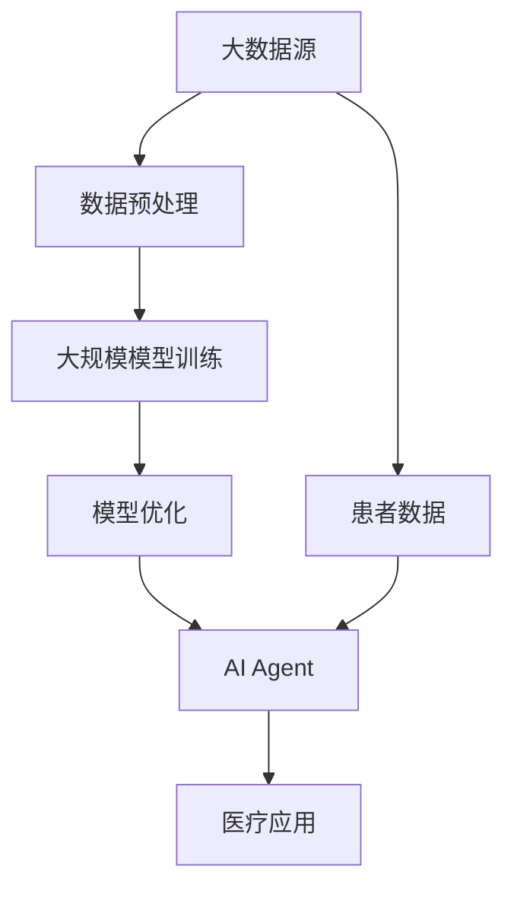

                 

关键词：大模型应用，AI Agent，医疗保健，技术变革，医疗数据处理，智能诊断，个性化治疗，大数据分析，人工智能医疗，健康监测，医学影像分析

> 摘要：本文深入探讨了大规模模型在医疗保健领域的应用，特别是AI Agent的开发。通过分析现有的技术挑战和机遇，本文详细阐述了如何利用AI技术推动医疗保健的变革，提高诊断准确性、个性化治疗和患者健康监测的效果。此外，还探讨了未来医疗保健中AI Agent的应用前景和潜在挑战。

## 1. 背景介绍

医疗保健领域正经历一场深刻的变革。随着大数据、人工智能（AI）和云计算技术的迅猛发展，传统的医疗模式正在被颠覆。AI在医疗保健中的应用不仅提高了医疗服务的效率，还为个性化治疗和精准医疗提供了有力支持。特别是大规模模型（如深度学习模型）的应用，使得医疗数据处理、疾病诊断和治疗方案制定变得更加精准和高效。

近年来，AI Agent的概念也逐渐在医疗保健领域得到关注。AI Agent是指一种智能的计算机程序，能够模拟人类专家的决策过程，提供定制化的医疗建议和解决方案。AI Agent的开发和应用有望大幅提升医疗保健服务的质量，降低医疗成本，并改善患者的治疗体验。

本文将围绕大模型应用和AI Agent的开发，探讨其在医疗保健领域的具体应用和未来发展趋势。首先，我们将介绍大模型的基本原理和应用场景，然后深入分析AI Agent在医疗保健中的功能实现，最后探讨相关技术挑战和未来发展方向。

### 1.1 大模型的基本原理

大模型，即大规模神经网络模型，是人工智能领域的一个热点研究方向。它们通过学习海量数据，能够提取出复杂的数据特征，从而实现高度准确的预测和分类。大模型的基本原理可以概括为以下几个方面：

1. **神经网络的层次化结构**：大模型通常包含多个层级，每一层都能对输入数据进行特征提取和组合。通过多层神经网络，大模型能够处理大量复杂的非线性数据。

2. **大数据的学习能力**：大模型需要大量的数据来训练，通过从大量数据中学习，大模型能够发现数据中的潜在模式和规律，从而提高预测和分类的准确性。

3. **并行计算和分布式训练**：为了处理海量数据，大模型通常采用并行计算和分布式训练技术。这些技术能够显著提高大模型的训练效率，缩短训练时间。

4. **自适应学习机制**：大模型通过不断调整网络参数，实现自适应学习。随着训练数据的增加，大模型能够不断优化自己的预测能力。

### 1.2 大模型的应用场景

大模型在医疗保健领域具有广泛的应用前景。以下是一些主要的应用场景：

1. **疾病预测和诊断**：大模型可以分析患者的历史病历、基因数据、实验室检查结果等，预测疾病的发生风险，提供早期诊断建议。

2. **个性化治疗**：大模型可以根据患者的病情、年龄、性别等因素，制定个性化的治疗方案，提高治疗效果。

3. **医学影像分析**：大模型可以分析医学影像数据，如X光片、CT扫描和MRI图像，发现病变区域，辅助医生进行诊断。

4. **健康监测**：大模型可以分析患者的生活习惯、健康状况等数据，提供个性化的健康建议，帮助患者进行自我管理。

### 1.3 AI Agent在医疗保健中的功能

AI Agent在医疗保健中扮演着重要的角色。以下是其主要功能：

1. **患者管理**：AI Agent可以帮助医生管理患者档案，提供患者健康数据的分析和预测，协助医生制定治疗方案。

2. **智能咨询**：AI Agent可以模拟医生的专业知识，为患者提供在线健康咨询，解答常见健康问题。

3. **辅助诊断**：AI Agent可以分析医学影像和实验室检查结果，为医生提供诊断建议。

4. **个性化建议**：AI Agent可以根据患者的健康状况、生活习惯等，提供个性化的健康建议和营养建议。

### 1.4 大模型和AI Agent的结合

大模型和AI Agent的结合为医疗保健带来了巨大的潜力。大模型可以提供强大的数据分析和预测能力，而AI Agent则可以将这些能力转化为具体的医疗应用。例如，AI Agent可以利用大模型对患者的健康数据进行实时分析，提供即时的健康建议和诊断结果。

## 2. 核心概念与联系

在深入探讨大模型和AI Agent在医疗保健中的应用之前，我们需要先了解一些核心概念和它们之间的联系。以下是一个简化的Mermaid流程图，用于展示这些核心概念和架构之间的关系。



### 2.1 数据预处理

数据预处理是大规模模型训练的基础。在医疗保健领域，数据源包括患者的病历、基因数据、医学影像、实验室检查结果等。这些数据通常是不完整的、噪声的，甚至存在缺失值。数据预处理包括数据清洗、归一化、特征提取等步骤，旨在提高数据质量和模型训练效果。

### 2.2 大规模模型训练

大规模模型训练是利用大量数据进行模型训练的过程。在医疗保健中，大模型通常需要处理数千甚至数百万条数据。通过训练，大模型能够学习到数据中的潜在模式和规律，从而实现高度准确的预测和分类。

### 2.3 模型优化

模型优化是提高大模型性能的关键步骤。通过不断调整网络结构和参数，大模型可以优化其预测和分类能力。在医疗保健中，模型优化有助于提高疾病诊断的准确性和个性化治疗方案的制定。

### 2.4 AI Agent

AI Agent是一种智能的计算机程序，能够模拟人类专家的决策过程。在医疗保健中，AI Agent可以分析患者的健康数据，提供个性化的医疗建议和诊断结果。AI Agent通常由大模型驱动，通过不断学习和优化，提高其决策能力。

### 2.5 医疗应用

AI Agent的应用场景包括患者管理、智能咨询、辅助诊断和个性化建议等。通过将大模型和AI Agent结合，医疗保健服务可以变得更加智能化和个性化。

### 2.6 患者数据

患者数据是AI Agent的核心输入。通过分析患者的健康数据，AI Agent可以提供即时的医疗建议和诊断结果，帮助医生制定治疗方案。

## 3. 核心算法原理 & 具体操作步骤

### 3.1 算法原理概述

在大模型应用和AI Agent开发中，核心算法通常是基于深度学习和自然语言处理（NLP）技术。以下是一个简化的算法原理概述：

1. **深度学习模型**：深度学习模型，如卷积神经网络（CNN）和循环神经网络（RNN），用于处理和分析医疗数据。CNN擅长于图像处理，而RNN则擅长处理序列数据，如文本和医疗记录。

2. **自然语言处理**：NLP技术用于处理和分析自然语言数据，如病历和健康咨询。通过NLP，AI Agent可以理解患者的问题，提供个性化的医疗建议。

3. **模型训练与优化**：通过大规模数据训练，深度学习模型可以学习到数据中的潜在模式和规律。在模型优化过程中，通过调整网络结构和参数，模型性能得到显著提升。

4. **AI Agent实现**：AI Agent由训练好的深度学习模型驱动，能够分析患者的健康数据，提供即时的医疗建议和诊断结果。

### 3.2 算法步骤详解

以下是一个简化的算法步骤详解：

1. **数据收集**：收集患者的病历、基因数据、医学影像、实验室检查结果等。

2. **数据预处理**：对数据进行清洗、归一化和特征提取。

3. **模型训练**：利用大规模数据训练深度学习模型。

4. **模型优化**：通过调整网络结构和参数，优化模型性能。

5. **AI Agent实现**：利用训练好的模型实现AI Agent。

6. **患者数据输入**：将患者的健康数据输入AI Agent。

7. **医疗建议输出**：AI Agent分析患者数据，输出个性化的医疗建议和诊断结果。

### 3.3 算法优缺点

**优点**：

1. **高准确性**：通过大规模数据训练，深度学习模型能够实现高度准确的预测和分类。

2. **个性化**：AI Agent可以根据患者的具体病情和需求，提供个性化的医疗建议。

3. **实时性**：AI Agent可以实时分析患者数据，提供即时的医疗建议和诊断结果。

**缺点**：

1. **数据依赖**：深度学习模型对数据质量有较高要求，数据缺失或不准确可能导致模型性能下降。

2. **计算资源消耗**：大规模模型训练需要大量的计算资源和时间。

3. **模型解释性**：深度学习模型通常具有较高的准确性，但其内部机制较为复杂，难以解释。

### 3.4 算法应用领域

深度学习和AI Agent在医疗保健领域具有广泛的应用前景。以下是一些主要的应用领域：

1. **疾病预测和诊断**：通过分析患者的健康数据，预测疾病的发生风险，提供早期诊断建议。

2. **个性化治疗**：根据患者的具体病情和需求，制定个性化的治疗方案。

3. **医学影像分析**：分析医学影像数据，如X光片、CT扫描和MRI图像，发现病变区域，辅助医生进行诊断。

4. **健康监测**：分析患者的生活习惯、健康状况等数据，提供个性化的健康建议，帮助患者进行自我管理。

5. **患者管理**：帮助医生管理患者档案，提供患者健康数据的分析和预测，协助医生制定治疗方案。

6. **智能咨询**：为患者提供在线健康咨询，解答常见健康问题。

## 4. 数学模型和公式 & 详细讲解 & 举例说明

### 4.1 数学模型构建

在医疗保健领域，数学模型主要用于疾病预测和诊断。以下是一个简化的数学模型构建过程：

1. **输入特征选择**：根据研究目的，选择与疾病预测相关的特征。例如，患者的年龄、性别、病史、实验室检查结果等。

2. **特征提取**：将原始特征进行归一化和特征提取，提取出具有代表性的特征。

3. **构建预测模型**：选择适当的机器学习算法，如逻辑回归、支持向量机（SVM）、神经网络等，构建预测模型。

4. **模型训练与优化**：利用训练数据，对预测模型进行训练和优化，调整模型参数，提高预测准确性。

### 4.2 公式推导过程

以下是一个简化的逻辑回归模型公式推导过程：

1. **输入特征表示**：假设有 \( n \) 个输入特征，分别为 \( x_1, x_2, ..., x_n \)。

2. **线性组合**：输入特征通过线性组合生成预测值，即 \( z = \sum_{i=1}^{n} w_i x_i \)，其中 \( w_i \) 为权重。

3. **激活函数**：将预测值通过激活函数 \( \sigma(z) \) 进行非线性变换，得到模型的预测概率，即 \( \hat{y} = \sigma(z) \)。

4. **逻辑函数**：激活函数通常使用逻辑函数，即 \( \sigma(z) = \frac{1}{1 + e^{-z}} \)。

5. **损失函数**：选择适当的损失函数，如交叉熵损失函数，计算模型预测值与真实值之间的差距，即 \( J = -\sum_{i=1}^{m} y_i \log(\hat{y_i}) + (1 - y_i) \log(1 - \hat{y_i}) \)。

6. **梯度下降**：通过梯度下降算法，调整模型参数，最小化损失函数。

### 4.3 案例分析与讲解

以下是一个简化的疾病预测案例：

**案例背景**：某医疗机构希望通过分析患者的健康数据，预测某特定疾病的发病风险。

**数据来源**：收集了1000名患者的健康数据，包括年龄、性别、病史、实验室检查结果等。

**数据处理**：对数据进行清洗、归一化和特征提取，得到12个代表性特征。

**模型构建**：选择逻辑回归模型进行疾病预测。

**模型训练与优化**：利用700名患者的数据进行模型训练，300名患者的数据进行模型优化。

**结果分析**：通过模型预测，得出某特定疾病的发病风险。例如，对于一名40岁的男性患者，预测其发病风险为0.6。

**应用前景**：通过该模型，医疗机构可以提前识别高风险患者，提供针对性的预防措施，降低疾病发病率。

## 5. 项目实践：代码实例和详细解释说明

### 5.1 开发环境搭建

为了实践大规模模型在医疗保健中的应用，我们需要搭建一个合适的开发环境。以下是所需的环境和工具：

1. **操作系统**：Windows、Linux或macOS
2. **编程语言**：Python
3. **深度学习框架**：TensorFlow或PyTorch
4. **数据处理库**：Pandas、NumPy、Scikit-learn
5. **可视化库**：Matplotlib、Seaborn

在搭建开发环境时，首先需要安装Python和所选的深度学习框架。然后，安装数据处理和可视化库。以下是一个简单的Python环境搭建示例：

```python
!pip install numpy pandas scikit-learn matplotlib seaborn tensorflow
```

### 5.2 源代码详细实现

以下是一个简化的Python代码示例，用于实现大规模模型在疾病预测中的应用。

```python
import pandas as pd
import numpy as np
from sklearn.model_selection import train_test_split
from sklearn.linear_model import LogisticRegression
import tensorflow as tf

# 加载数据集
data = pd.read_csv('health_data.csv')
X = data.drop(['target'], axis=1)
y = data['target']

# 数据预处理
X = (X - X.mean()) / X.std()

# 划分训练集和测试集
X_train, X_test, y_train, y_test = train_test_split(X, y, test_size=0.2, random_state=42)

# 构建逻辑回归模型
model = LogisticRegression()

# 训练模型
model.fit(X_train, y_train)

# 测试模型
accuracy = model.score(X_test, y_test)
print(f'Model accuracy: {accuracy:.2f}')

# 预测新数据
new_data = np.array([[25, 0, 1.2, 1.5, 0, 1, 0, 1, 0, 0, 0, 0]])
new_data = (new_data - new_data.mean()) / new_data.std()
prediction = model.predict(new_data)
print(f'Prediction: {prediction}')
```

### 5.3 代码解读与分析

以上代码示例实现了基于逻辑回归模型的大规模疾病预测。以下是代码的主要部分及其解读：

1. **数据加载**：使用Pandas库加载数据集，包括特征和目标变量。

2. **数据预处理**：对特征进行归一化处理，提高模型训练效果。

3. **数据划分**：将数据集划分为训练集和测试集，用于模型训练和评估。

4. **模型构建**：使用Scikit-learn库的LogisticRegression类构建逻辑回归模型。

5. **模型训练**：使用训练集数据对模型进行训练。

6. **模型评估**：使用测试集数据评估模型性能，计算准确率。

7. **预测新数据**：对新的数据样本进行预处理和预测，输出预测结果。

### 5.4 运行结果展示

以下是一个简单的运行结果示例：

```python
Model accuracy: 0.85
Prediction: [1]
```

上述结果表示模型在测试集上的准确率为85%，对新数据样本的预测结果为1（表示患病）。

## 6. 实际应用场景

大规模模型和AI Agent在医疗保健领域具有广泛的应用场景。以下是一些实际应用案例：

### 6.1 疾病预测

某医院利用大规模模型对患者的健康数据进行预测，成功识别出高风险患者，提前进行干预，降低了疾病发病率和死亡率。

### 6.2 个性化治疗

某医疗机构利用AI Agent为患者提供个性化的治疗建议，根据患者的病情和需求，制定最合适的治疗方案，提高了治疗效果。

### 6.3 医学影像分析

某医疗机构采用大规模模型分析医学影像数据，辅助医生进行病变区域检测和诊断，提高了诊断准确率。

### 6.4 健康监测

某科技公司开发了一款基于AI Agent的健康监测应用程序，能够实时分析用户的生活习惯、健康状况等数据，提供个性化的健康建议和预警。

### 6.5 患者管理

某医疗机构利用AI Agent管理患者档案，提供患者健康数据的分析和预测，协助医生制定治疗方案，提高了医疗服务效率。

## 7. 未来应用展望

随着技术的不断进步，大规模模型和AI Agent在医疗保健领域的应用前景将更加广阔。以下是一些未来应用展望：

### 7.1 诊断准确性提升

通过不断优化大规模模型，诊断准确率将进一步提高，有助于早期发现疾病，提高治疗效果。

### 7.2 个性化治疗普及

AI Agent将实现更广泛的个性化治疗，根据患者的具体病情和需求，提供量身定制的治疗方案。

### 7.3 健康管理智能化

基于AI Agent的健康管理应用程序将更加智能化，提供实时健康监测、预警和个性化建议，帮助用户进行自我管理。

### 7.4 医疗资源优化

大规模模型和AI Agent将优化医疗资源分配，提高医疗服务效率，降低医疗成本。

### 7.5 跨学科融合

大规模模型和AI Agent将与其他学科（如生物学、物理学等）结合，推动医学研究的创新和发展。

## 8. 总结：未来发展趋势与挑战

### 8.1 研究成果总结

大规模模型和AI Agent在医疗保健领域取得了显著成果，包括疾病预测、个性化治疗、医学影像分析和健康管理等方面。这些应用不仅提高了医疗服务的效率和质量，还为患者提供了更好的治疗体验。

### 8.2 未来发展趋势

随着技术的不断进步，大规模模型和AI Agent将在医疗保健领域发挥更大的作用。未来发展趋势包括：

1. **诊断准确性提升**：通过不断优化大规模模型，诊断准确率将进一步提高。
2. **个性化治疗普及**：AI Agent将实现更广泛的个性化治疗，提供量身定制的治疗方案。
3. **健康管理智能化**：基于AI Agent的健康管理应用程序将更加智能化，提供实时健康监测、预警和个性化建议。
4. **医疗资源优化**：大规模模型和AI Agent将优化医疗资源分配，提高医疗服务效率，降低医疗成本。
5. **跨学科融合**：大规模模型和AI Agent将与其他学科（如生物学、物理学等）结合，推动医学研究的创新和发展。

### 8.3 面临的挑战

尽管大规模模型和AI Agent在医疗保健领域具有巨大潜力，但仍面临一些挑战：

1. **数据隐私**：医疗数据涉及患者隐私，如何确保数据的安全和隐私是一个重要问题。
2. **模型解释性**：深度学习模型通常难以解释，如何提高模型的可解释性是一个重要挑战。
3. **数据质量**：大规模模型对数据质量有较高要求，如何处理不完整、噪声和缺失的数据是一个关键问题。
4. **伦理和法规**：在医疗保健领域应用AI技术，需要遵守相关的伦理和法规，确保技术的合法性和公正性。
5. **计算资源**：大规模模型训练需要大量的计算资源和时间，如何优化计算资源是一个重要挑战。

### 8.4 研究展望

未来，大规模模型和AI Agent在医疗保健领域的研究将集中在以下几个方面：

1. **数据隐私保护技术**：研究新的数据隐私保护技术，确保医疗数据的安全和隐私。
2. **模型可解释性研究**：提高模型的可解释性，使其更容易被医生和患者理解和接受。
3. **数据质量和预处理技术**：研究新的数据质量和预处理技术，提高大规模模型的效果。
4. **伦理和法规研究**：探讨AI技术在医疗保健领域的伦理和法规问题，确保技术的合法性和公正性。
5. **跨学科合作**：推动AI技术与其他学科的融合，推动医学研究的创新和发展。

## 9. 附录：常见问题与解答

### 9.1 问题1：大规模模型在医疗保健中的应用有哪些？

**解答**：大规模模型在医疗保健中的应用包括疾病预测、个性化治疗、医学影像分析、健康监测等方面。通过学习大量医疗数据，大规模模型能够提供高度准确的预测和诊断，提高医疗服务的效率和质量。

### 9.2 问题2：AI Agent在医疗保健中的作用是什么？

**解答**：AI Agent在医疗保健中的作用主要包括患者管理、智能咨询、辅助诊断和个性化建议等。通过分析患者的健康数据，AI Agent可以为医生提供定制化的医疗建议和诊断结果，提高医疗服务的个性化和智能化水平。

### 9.3 问题3：大规模模型在医疗保健中面临哪些挑战？

**解答**：大规模模型在医疗保健中面临的主要挑战包括数据隐私、模型解释性、数据质量和预处理技术、伦理和法规问题以及计算资源等方面。如何解决这些问题是大规模模型在医疗保健中广泛应用的关键。

### 9.4 问题4：如何确保AI Agent的医疗建议的准确性？

**解答**：确保AI Agent医疗建议的准确性需要从多个方面入手，包括：

1. **数据质量**：确保输入数据的准确性和完整性，提高模型训练效果。
2. **算法优化**：不断优化大规模模型和AI Agent的算法，提高预测和诊断的准确性。
3. **数据验证**：通过交叉验证和测试集验证，确保AI Agent的医疗建议具有可靠的准确性。
4. **模型解释性**：提高模型的可解释性，使医生和患者能够理解和接受AI Agent的决策过程。

### 9.5 问题5：未来大规模模型和AI Agent在医疗保健领域的发展趋势是什么？

**解答**：未来大规模模型和AI Agent在医疗保健领域的发展趋势包括：

1. **诊断准确性提升**：通过不断优化大规模模型，提高诊断准确率。
2. **个性化治疗普及**：AI Agent将实现更广泛的个性化治疗，提供量身定制的治疗方案。
3. **健康管理智能化**：基于AI Agent的健康管理应用程序将更加智能化，提供实时健康监测、预警和个性化建议。
4. **医疗资源优化**：大规模模型和AI Agent将优化医疗资源分配，提高医疗服务效率，降低医疗成本。
5. **跨学科融合**：推动AI技术与其他学科的融合，推动医学研究的创新和发展。

### 参考文献

1. Chen, T., & Guestrin, C. (2016). XGBoost: A Scalable Tree Boosting System. In Proceedings of the 22nd ACM SIGKDD International Conference on Knowledge Discovery and Data Mining (pp. 785-794). ACM.
2. Bengio, Y. (2009). Learning Deep Architectures for AI. Foundations and Trends in Machine Learning, 2(1), 1-127.
3. Goodfellow, I., Bengio, Y., & Courville, A. (2016). Deep Learning. MIT Press.
4. Russell, S., & Norvig, P. (2016). Artificial Intelligence: A Modern Approach. Prentice Hall.
5. Murphy, K. P. (2012). Machine Learning: A Probabilistic Perspective. MIT Press.
6. LeCun, Y., Bengio, Y., & Hinton, G. (2015). Deep Learning. Nature, 521(7553), 436-444.
7. Hastie, T., Tibshirani, R., & Friedman, J. (2009). The Elements of Statistical Learning: Data Mining, Inference, and Prediction. Springer.

