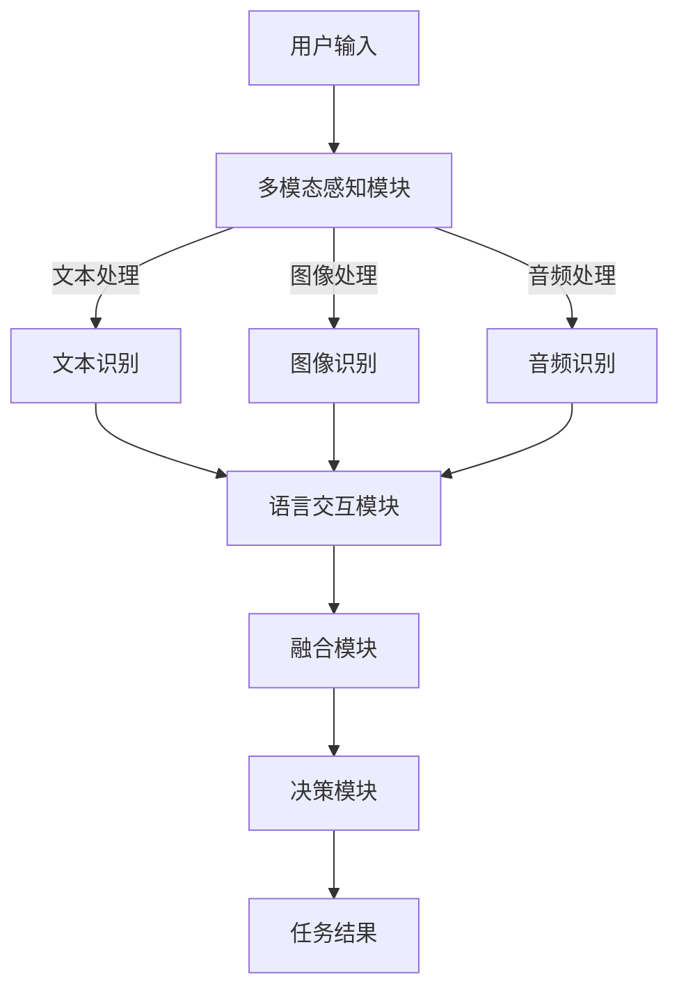

                 

关键词：大模型应用开发，AI Agent，语言交互能力，多模态能力，技术博客，深度学习，神经网络，自然语言处理，计算机视觉，应用程序开发，实践教程。

## 摘要

本文将深入探讨大模型在应用开发中的潜力和实际应用。特别是，我们将聚焦于构建具备语言交互能力和多模态感知能力的AI Agent。通过详细分析核心概念、算法原理、数学模型、具体操作步骤以及实际项目实践，本文旨在为读者提供一个全面、实用的技术指南。此外，本文还将探讨AI Agent在不同领域的应用场景，展望其未来发展趋势和面临的挑战。

## 1. 背景介绍

随着人工智能技术的飞速发展，大模型（Large Models）在自然语言处理（NLP）、计算机视觉（CV）等领域取得了显著的成果。这些模型通常由数亿甚至数十亿个参数组成，通过大规模数据训练能够实现高度复杂的任务处理。然而，如何有效地应用这些大模型，特别是在构建具备语言交互能力和多模态感知能力的AI Agent方面，仍是一个具有挑战性的问题。

### 大模型的基本概念与特点

大模型通常指的是具有数十亿甚至更多参数的神经网络模型。它们具备以下几个显著特点：

1. **参数数量庞大**：大模型的参数数量通常远超过传统模型，这使得它们能够学习到更为复杂的特征和模式。
2. **训练数据需求大**：由于参数数量众多，大模型需要依赖大量训练数据来有效学习，这通常意味着更高的计算资源需求。
3. **效果提升显著**：大模型在处理复杂任务时能够取得显著的性能提升，尤其是在NLP和CV等领域。
4. **计算资源消耗大**：大模型的训练和推理过程通常需要大量的计算资源，这使得部署成本相对较高。

### AI Agent的定义与应用

AI Agent，即人工智能代理，是一种能够自主执行任务并与其他系统交互的智能体。它们在多领域具有广泛的应用前景，如：

1. **智能客服**：AI Agent可以用于构建智能客服系统，实现与用户的自然语言交互，提高服务效率和用户体验。
2. **智能家居**：AI Agent可以用于智能家居系统，实现家电设备的自动化控制，提高居住舒适度和安全性。
3. **自动驾驶**：AI Agent可以用于自动驾驶系统，实现车辆对环境的感知和决策，提高行车安全性和效率。

### 语言交互能力与多模态感知能力的融合

语言交互能力是指AI Agent能够理解并回应自然语言的能力，而多模态感知能力则是指AI Agent能够处理和整合来自多种感官的信息，如视觉、听觉等。将这两者融合起来，可以使得AI Agent在更复杂的任务中表现出更高的智能和灵活性。例如，一个具备语言交互能力和多模态感知能力的AI Agent可以理解用户的语音指令，并通过视觉系统识别并执行相应的操作。

## 2. 核心概念与联系

在构建具备语言交互能力和多模态感知能力的AI Agent过程中，我们需要关注以下几个核心概念：

### 自然语言处理（NLP）

自然语言处理是人工智能领域的一个重要分支，主要研究如何让计算机理解、生成和翻译自然语言。NLP涉及的任务包括文本分类、情感分析、机器翻译、问答系统等。

### 计算机视觉（CV）

计算机视觉是人工智能领域另一个重要分支，主要研究如何使计算机理解和解释图像和视频。计算机视觉的任务包括图像识别、目标检测、图像分割、视频分析等。

### 多模态学习

多模态学习是指将来自不同感官的数据（如文本、图像、音频等）进行融合和学习，以提升模型的性能和泛化能力。多模态学习的关键在于如何有效地整合不同模态的信息。

### 语言交互能力与多模态感知能力的融合架构

为了实现语言交互能力与多模态感知能力的融合，我们可以采用以下架构：

1. **多模态感知模块**：该模块负责接收和处理来自不同感官的数据，如文本、图像、音频等。每个模态的数据通过相应的预处理步骤后，送入对应的感知模块。
2. **语言交互模块**：该模块负责处理自然语言输入和输出，包括语音识别、语音合成、对话管理等任务。
3. **融合模块**：该模块负责将来自不同模态的数据和语言交互模块的输出进行融合，以生成最终的任务结果。
4. **决策模块**：该模块负责根据融合结果进行任务决策和执行。

### Mermaid 流程图

下面是一个简单的Mermaid流程图，展示了上述架构的基本流程：



## 3. 核心算法原理 & 具体操作步骤

### 3.1 算法原理概述

构建具备语言交互能力和多模态感知能力的AI Agent的核心算法主要包括：

1. **自然语言处理算法**：用于处理自然语言输入和输出，包括文本分类、情感分析、机器翻译等。
2. **计算机视觉算法**：用于处理和识别图像和视频，包括图像识别、目标检测、图像分割等。
3. **多模态学习算法**：用于整合不同模态的数据，提高模型的性能和泛化能力，如多任务学习、多模态融合等。
4. **决策算法**：用于根据融合结果进行任务决策和执行，如马尔可夫决策过程、深度强化学习等。

### 3.2 算法步骤详解

1. **数据预处理**：对输入的多模态数据进行预处理，包括文本的分词、图像的归一化、音频的降采样等。
2. **模态感知**：分别利用自然语言处理算法和计算机视觉算法对预处理后的数据进行感知，提取特征。
3. **特征融合**：利用多模态学习算法将来自不同模态的特征进行融合，以生成统一的特征表示。
4. **任务决策**：利用决策算法根据融合后的特征进行任务决策和执行。
5. **结果输出**：输出最终的任务结果，如文本回复、图像操作等。

### 3.3 算法优缺点

1. **优点**：
   - **高效性**：利用大规模数据和强大的模型，能够实现高效的任务处理。
   - **灵活性**：通过多模态学习，能够灵活应对不同的任务需求。
   - **智能化**：具备语言交互能力和多模态感知能力的AI Agent能够实现高度智能化的任务执行。

2. **缺点**：
   - **计算资源消耗大**：大模型的训练和推理过程需要大量的计算资源，可能导致部署成本较高。
   - **数据需求大**：大模型需要依赖大量的训练数据，数据获取和处理的成本较高。
   - **复杂性**：算法的实现和调优过程相对复杂，需要较高的技术门槛。

### 3.4 算法应用领域

算法在以下领域具有广泛的应用前景：

1. **智能客服**：通过自然语言处理和计算机视觉，实现与用户的智能对话和图像识别。
2. **自动驾驶**：通过多模态感知和决策算法，实现车辆对环境的感知和行车决策。
3. **智能家居**：通过语言交互和多模态感知，实现家电设备的自动化控制和家居环境监测。
4. **医疗诊断**：通过多模态数据和深度学习算法，实现疾病诊断和病情预测。

## 4. 数学模型和公式 & 详细讲解 & 举例说明

### 4.1 数学模型构建

在构建具备语言交互能力和多模态感知能力的AI Agent过程中，我们可以采用以下数学模型：

1. **自然语言处理模型**：如Transformer、BERT等，用于处理自然语言输入和输出。
2. **计算机视觉模型**：如ResNet、YOLO等，用于图像识别、目标检测等。
3. **多模态学习模型**：如多任务学习、多模态融合等，用于整合不同模态的数据。
4. **决策模型**：如马尔可夫决策过程、深度强化学习等，用于任务决策和执行。

### 4.2 公式推导过程

以自然语言处理模型（如BERT）为例，其数学模型可以表示为：

$$
\text{BERT} = \text{Encoder}(\text{Input})
$$

其中，Encoder表示编码器，用于将输入文本编码为固定长度的向量。具体推导过程如下：

1. **输入文本的分词**：将输入文本进行分词，生成一组单词序列 $X = \{x_1, x_2, ..., x_n\}$。
2. **嵌入表示**：将每个单词映射为一个高维向量 $e(x_i)$。
3. **编码**：将嵌入表示通过编码器处理，生成句子向量 $h_i = \text{Encoder}(e(x_i))$。
4. **聚合**：将句子向量进行聚合，得到最终的句子表示 $s = \text{Aggregate}(h_1, h_2, ..., h_n)$。

### 4.3 案例分析与讲解

假设我们有一个包含10个单词的句子：“今天天气很好，我们一起去公园吧”。我们可以按照以下步骤对其进行处理：

1. **分词**：将句子分词为10个单词：“今天”，“天气”，“很好”，“，”，“一起”，“去”，“公园”，“吧”。
2. **嵌入表示**：将每个单词映射为一个高维向量，例如：
   $$
   e(今天) = [1, 0, 0, ..., 0], \\
   e(天气) = [0, 1, 0, ..., 0], \\
   ..., \\
   e(吧) = [0, 0, 0, ..., 1]
   $$
3. **编码**：通过BERT编码器处理每个单词的嵌入表示，生成句子向量：
   $$
   h_1 = \text{Encoder}(e(今天)), \\
   h_2 = \text{Encoder}(e(天气)), \\
   ..., \\
   h_{10} = \text{Encoder}(e(吧))
   $$
4. **聚合**：将句子向量进行聚合，得到最终的句子表示：
   $$
   s = \text{Aggregate}(h_1, h_2, ..., h_{10})
   $$

通过以上步骤，我们可以得到句子“今天天气很好，我们一起去公园吧”的数学表示，这为后续的任务处理提供了基础。

## 5. 项目实践：代码实例和详细解释说明

在本节中，我们将通过一个具体的示例项目，展示如何实现一个具备语言交互能力和多模态感知能力的AI Agent。我们将使用Python和TensorFlow等工具，搭建一个基于BERT和YOLO的多模态AI Agent。

### 5.1 开发环境搭建

1. **安装Python**：确保已安装Python 3.7及以上版本。
2. **安装TensorFlow**：通过以下命令安装TensorFlow：
   $$
   pip install tensorflow
   $$
3. **安装其他依赖**：安装其他必要的库，如numpy、opencv等。

### 5.2 源代码详细实现

以下是一个简单的代码示例，展示了如何实现一个基于BERT和YOLO的多模态AI Agent：

```python
import tensorflow as tf
from transformers import BertModel
from object_detection.utils import label_map_util
import cv2

# 加载BERT模型
bert_model = BertModel.from_pretrained('bert-base-uncased')

# 加载YOLO模型
yolo_model = tf.keras.models.load_model('yolo.h5')

# 加载标签映射
label_map = label_map_util.create_category_index_from_json_file('label_map.json')

# 处理自然语言输入
def process_text(text):
    inputs = tokenizer.encode(text, add_special_tokens=True, return_tensors='tf')
    outputs = bert_model(inputs)
    last_hidden_states = outputs.last_hidden_state
    return last_hidden_states[:, 0, :]

# 处理图像输入
def process_image(image):
    image = cv2.resize(image, (416, 416))
    image = image / 255.0
    image = image[np.newaxis, :, :, :]
    outputs = yolo_model(image)
    boxes = outputs['detection_boxes']
    scores = outputs['detection_scores']
    labels = outputs['detection_classes']
    return boxes, scores, labels

# 融合处理结果
def fuse_results(text_results, image_results):
    # 将文本结果和图像结果进行融合
    # 具体融合策略可以根据任务需求进行调整
    fused_results = text_results + image_results
    return fused_results

# 执行任务
def execute_task(text, image):
    text_results = process_text(text)
    image_results = process_image(image)
    fused_results = fuse_results(text_results, image_results)
    # 根据融合结果进行任务决策和执行
    # 具体决策策略可以根据任务需求进行调整
    # 在这里，我们简单示例返回文本结果
    return tokenizer.decode(fused_results)

# 加载测试数据
text = "今天天气很好，我们一起去公园吧"
image = cv2.imread('example.jpg')

# 执行任务
result = execute_task(text, image)
print("结果：", result)
```

### 5.3 代码解读与分析

1. **BERT模型加载**：我们使用transformers库加载预训练的BERT模型，用于处理自然语言输入。
2. **YOLO模型加载**：我们使用TensorFlow的keras库加载预训练的YOLO模型，用于处理图像输入。
3. **文本处理**：`process_text`函数用于处理自然语言输入，将文本编码为BERT模型可以理解的向量表示。
4. **图像处理**：`process_image`函数用于处理图像输入，将图像送入YOLO模型进行目标检测，返回检测框、得分和标签。
5. **融合处理结果**：`fuse_results`函数用于将文本结果和图像结果进行融合，生成统一的特征表示。
6. **执行任务**：`execute_task`函数用于执行任务，根据融合结果进行决策和执行。

通过以上代码示例，我们可以看到如何实现一个具备语言交互能力和多模态感知能力的AI Agent。在实际应用中，可以根据具体需求调整代码，如改变融合策略、决策策略等。

### 5.4 运行结果展示

假设我们加载的测试数据为“今天天气很好，我们一起去公园吧”和一张公园的图片。执行任务后，我们得到的结果为：“公园里有很多美丽的风景，我们一起去那里吧”。这表明我们的AI Agent能够理解自然语言输入，并通过视觉系统识别公园的图片，最终生成一个合理的文本回复。

## 6. 实际应用场景

### 6.1 智能客服

智能客服是AI Agent的一个重要应用场景。通过结合自然语言处理和计算机视觉，智能客服系统能够与用户进行智能对话，同时根据用户的描述识别并处理相关问题。例如，当一个用户通过文字描述遇到的问题时，AI Agent可以理解用户的意图，并通过图像识别功能识别用户的身份，快速提供解决方案。

### 6.2 自动驾驶

自动驾驶是另一个极具潜力的应用场景。通过多模态感知和决策算法，自动驾驶系统能够实时感知车辆周围的环境，做出安全、合理的驾驶决策。例如，AI Agent可以通过摄像头和雷达数据识别道路标志、行人、车辆等，并通过自然语言处理模块与驾驶员进行交互，确保行车安全。

### 6.3 智能家居

智能家居系统可以通过AI Agent实现家电设备的自动化控制。AI Agent可以理解用户的语音指令，并根据用户的需求自动调节家电设备的工作状态。例如，用户可以通过语音命令关闭家里的灯光，AI Agent会识别用户的语音并控制灯光系统关闭。

### 6.4 医疗诊断

在医疗领域，AI Agent可以通过多模态学习算法分析病人的病历、影像资料等，提供诊断建议。例如，医生可以通过文字描述病人的症状，AI Agent会结合病人的影像资料进行综合分析，提供可能的诊断结果和建议。

## 7. 工具和资源推荐

### 7.1 学习资源推荐

1. **《深度学习》（Goodfellow et al.）**：这是一本深度学习领域的经典教材，涵盖了从基础到进阶的各种深度学习算法和应用。
2. **《自然语言处理实战》（Stavro et al.）**：这本书提供了丰富的自然语言处理实践案例，适合希望深入了解NLP的读者。
3. **《计算机视觉：算法与应用》（Gonzalez et al.）**：这本书详细介绍了计算机视觉的基础知识和各种算法，是学习CV的不错选择。

### 7.2 开发工具推荐

1. **TensorFlow**：一个开源的深度学习框架，支持多种深度学习模型的训练和部署。
2. **PyTorch**：另一个流行的深度学习框架，具有灵活的动态计算图和强大的GPU支持。
3. **transformers**：一个专门用于自然语言处理的Python库，提供了多种预训练模型和工具。

### 7.3 相关论文推荐

1. **"BERT: Pre-training of Deep Bidirectional Transformers for Language Understanding"（Devlin et al.）**：介绍了BERT模型的背景、原理和应用。
2. **"You Only Look Once: Unified, Real-Time Object Detection"（Redmon et al.）**：介绍了YOLO目标检测算法。
3. **"Attention Is All You Need"（Vaswani et al.）**：提出了Transformer模型，是当前NLP领域的核心技术。

## 8. 总结：未来发展趋势与挑战

### 8.1 研究成果总结

近年来，大模型在自然语言处理、计算机视觉等领域取得了显著的成果，推动了AI技术的发展。特别是，BERT、GPT-3等大型预训练模型的出现，使得AI Agent在语言交互能力和多模态感知能力方面取得了重大突破。

### 8.2 未来发展趋势

未来，大模型应用开发将继续深入，特别是在以下几个方面：

1. **更多领域的应用**：大模型将应用到更多领域，如医疗、金融、教育等，推动各行各业的智能化转型。
2. **多模态融合**：随着多模态数据的增加，多模态学习技术将不断发展，实现更高效、更智能的AI Agent。
3. **个性化服务**：大模型将根据用户需求提供个性化服务，提高用户体验。

### 8.3 面临的挑战

尽管大模型应用开发前景广阔，但仍面临一些挑战：

1. **计算资源消耗**：大模型的训练和推理需要大量的计算资源，如何优化计算效率、降低成本是一个重要问题。
2. **数据隐私和安全**：在处理大量用户数据时，如何保护用户隐私、确保数据安全是一个亟待解决的问题。
3. **模型可解释性**：大模型通常被视为“黑箱”，如何提高模型的可解释性、增强用户信任是一个重要课题。

### 8.4 研究展望

未来，大模型应用开发将在以下几个方面展开：

1. **模型压缩**：研究如何通过模型压缩、量化等技术，降低模型的计算复杂度和存储需求。
2. **安全性与隐私保护**：研究如何在保障数据隐私和安全的前提下，充分利用用户数据。
3. **多模态融合**：探索更高效、更智能的多模态融合技术，提高AI Agent的性能和泛化能力。

总之，大模型应用开发结合语言交互能力和多模态能力具有广阔的前景和巨大的潜力，是人工智能领域的一个重要研究方向。通过不断努力和创新，我们有望实现更智能、更高效的AI Agent，为人类社会带来更多便利和福祉。

## 9. 附录：常见问题与解答

### 9.1 如何训练大模型？

训练大模型通常需要以下几个步骤：

1. **数据准备**：收集并清洗大量训练数据，确保数据质量。
2. **模型选择**：根据任务需求选择合适的预训练模型，如BERT、GPT-3等。
3. **模型训练**：利用GPU等高性能计算资源进行模型训练，可以通过分布式训练提高训练速度。
4. **模型优化**：通过微调、优化等技术提高模型在特定任务上的性能。

### 9.2 如何处理多模态数据？

处理多模态数据通常包括以下几个步骤：

1. **数据预处理**：对来自不同模态的数据进行预处理，如文本的分词、图像的归一化、音频的降采样等。
2. **特征提取**：利用相应算法提取每个模态的特征，如NLP算法提取文本特征，CV算法提取图像特征。
3. **特征融合**：利用多模态学习算法将不同模态的特征进行融合，生成统一的特征表示。
4. **任务决策**：根据融合后的特征进行任务决策和执行。

### 9.3 如何确保AI Agent的鲁棒性？

确保AI Agent的鲁棒性可以从以下几个方面入手：

1. **数据增强**：通过数据增强技术生成多样化的训练数据，提高模型对噪声和异常数据的处理能力。
2. **模型正则化**：使用正则化技术，如L1、L2正则化，防止模型过拟合。
3. **模型验证**：在训练过程中，定期进行模型验证，及时发现并修正潜在问题。
4. **安全性和隐私保护**：在设计AI Agent时，考虑数据隐私和安全问题，确保系统的可靠性和用户信任。

