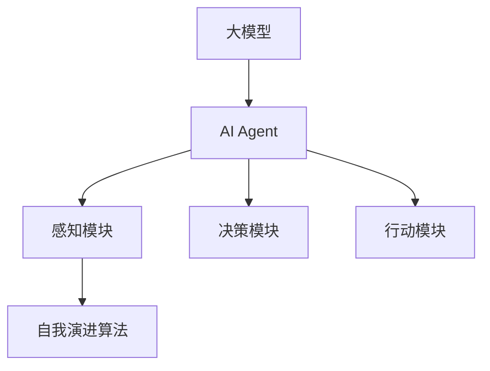

                 

关键词：大模型，应用开发，AI Agent，自我演进，技术博客

> 摘要：本文将探讨大模型在AI Agent领域的应用，介绍如何通过自我演进算法提升AI Agent的性能，并通过实际案例展示其开发过程和效果。文章将分为背景介绍、核心概念与联系、核心算法原理与具体操作步骤、数学模型与公式、项目实践、实际应用场景、未来应用展望、工具和资源推荐、总结与展望以及常见问题与解答等部分。

## 1. 背景介绍

近年来，人工智能（AI）技术取得了飞速发展，大模型（如GPT、BERT等）的崛起使得AI在自然语言处理、计算机视觉、语音识别等领域取得了显著成果。随着大模型的应用越来越广泛，如何高效地开发和优化这些模型成为了研究人员和开发者的关注焦点。

AI Agent作为一种具有自主决策和行动能力的智能体，在游戏、机器人、自动驾驶等领域具有重要应用。然而，传统AI Agent的性能往往受到数据集质量和预训练模型的限制，难以实现真正的自我进化。为了解决这一问题，本文将介绍一种基于自我演进算法的AI Agent开发方法，并通过实际案例展示其开发过程和效果。

## 2. 核心概念与联系

### 2.1 大模型

大模型是指具有大量参数和复杂结构的神经网络模型，如GPT、BERT等。这些模型通过大规模数据预训练，能够在各种AI任务上取得优异的性能。

### 2.2 AI Agent

AI Agent是一种具有自主决策和行动能力的智能体，能够根据环境变化自主调整其行为。AI Agent通常由感知模块、决策模块和行动模块组成。

### 2.3 自我演进算法

自我演进算法是一种基于遗传算法等进化机制的优化方法，能够通过迭代优化，提高AI Agent的性能。

### 2.4 Mermaid 流程图

下面是AI Agent核心概念与联系的Mermaid流程图：



## 3. 核心算法原理 & 具体操作步骤

### 3.1 算法原理概述

自我演进算法通过模拟自然进化过程，对AI Agent进行迭代优化。具体来说，算法包括以下步骤：

1. 初始化：生成一组初始AI Agent。
2. 评估：对每个AI Agent进行性能评估。
3. 交叉：随机选择两个AI Agent进行交叉操作，产生新的AI Agent。
4. 变异：对新生成的AI Agent进行变异操作，增加算法的多样性。
5. 选择：根据性能评估结果，选择最优的AI Agent进行复制。

### 3.2 算法步骤详解

1. **初始化：**
   - 随机生成初始AI Agent。
   - 初始化参数，如种群大小、交叉概率、变异概率等。

2. **评估：**
   - 使用预训练的大模型对AI Agent进行性能评估。
   - 评估指标可以包括任务完成度、响应时间、资源消耗等。

3. **交叉：**
   - 随机选择两个AI Agent。
   - 根据交叉概率，在基因片段中选择交叉点，进行交叉操作。

4. **变异：**
   - 对新生成的AI Agent进行变异操作。
   - 变异操作可以包括参数调整、结构修改等。

5. **选择：**
   - 根据性能评估结果，选择最优的AI Agent进行复制。
   - 复制操作可以包括完全复制、部分复制等。

### 3.3 算法优缺点

**优点：**
- **自适应性强**：能够根据环境变化进行自我进化，提高AI Agent的性能。
- **多样性**：通过交叉和变异操作，能够增加种群的多样性，提高搜索效率。

**缺点：**
- **计算成本高**：自我演进算法需要进行多次评估和操作，计算成本较高。
- **参数调优复杂**：参数调优对算法性能有较大影响，需要经验丰富的开发者进行调优。

### 3.4 算法应用领域

自我演进算法在游戏AI、机器人控制、自动驾驶等领域有广泛应用。例如，在游戏AI中，可以用于优化玩家的策略；在机器人控制中，可以用于自适应路径规划；在自动驾驶中，可以用于优化车辆的行驶策略。

## 4. 数学模型和公式 & 详细讲解 & 举例说明

### 4.1 数学模型构建

自我演进算法的核心在于如何表示AI Agent的基因和评估其性能。以下是一个简化的数学模型：

1. **基因表示：**
   - AI Agent的基因可以看作是一组参数向量 \(\mathbf{p} = [p_1, p_2, ..., p_n]\)。
   - 每个参数 \(p_i\) 可以表示AI Agent的一个决策或行为。

2. **性能评估：**
   - 性能评估函数 \(f(\mathbf{p})\) 可以表示AI Agent在特定任务上的表现。
   - 常用的评估指标包括得分、响应时间等。

### 4.2 公式推导过程

1. **初始化：**
   - 基因初始化：\(\mathbf{p} \sim \mathcal{N}(\mu, \sigma^2)\)，其中 \(\mu\) 和 \(\sigma^2\) 分别为均值和方差。

2. **交叉操作：**
   - 交叉概率 \(P_c\)：\(P_c = \text{rand()} \leq p_c\)，其中 \(p_c\) 为交叉概率。

3. **变异操作：**
   - 变异概率 \(P_m\)：\(P_m = \text{rand()} \leq p_m\)，其中 \(p_m\) 为变异概率。

4. **选择操作：**
   - 选择概率 \(P_s\)：\(P_s = \frac{f(\mathbf{p})}{\sum_{i=1}^{n} f(\mathbf{p}_i)}\)，其中 \(f(\mathbf{p}_i)\) 为其他AI Agent的性能。

### 4.3 案例分析与讲解

假设有一个机器人任务，需要在给定时间内完成路径规划，从起点到达终点。我们使用自我演进算法来优化机器人的路径规划策略。

1. **基因表示：**
   - 基因 \(\mathbf{p}\) 包含机器人的移动方向、速度和暂停时间等参数。

2. **性能评估：**
   - 评估函数 \(f(\mathbf{p})\) 表示机器人在给定时间内的路径长度。

3. **算法运行：**
   - 初始化：生成一组随机基因。
   - 评估：计算每个基因的性能。
   - 交叉和变异：根据概率进行交叉和变异。
   - 选择：选择最优的基因进行复制。

经过多次迭代后，我们可以得到一个性能较好的基因，用于指导机器人的路径规划。

## 5. 项目实践：代码实例和详细解释说明

### 5.1 开发环境搭建

- 编写代码前，需要搭建合适的开发环境。本文使用Python作为编程语言，并依赖于以下库：

  ```python
  import numpy as np
  import random
  import matplotlib.pyplot as plt
  ```

- 安装所需的库：

  ```bash
  pip install numpy matplotlib
  ```

### 5.2 源代码详细实现

以下是自我演进算法的一个简单实现：

```python
def initialize_population(pop_size, gene_size):
    population = []
    for _ in range(pop_size):
        gene = np.random.normal(0, 1, gene_size)
        population.append(gene)
    return population

def evaluate_population(population, performance_function):
    scores = []
    for gene in population:
        score = performance_function(gene)
        scores.append(score)
    return scores

def crossover(parent1, parent2, crossover_rate):
    if random.random() < crossover_rate:
        crossover_point = random.randint(1, len(parent1) - 1)
        child1 = parent1[:crossover_point] + parent2[crossover_point:]
        child2 = parent2[:crossover_point] + parent1[crossover_point:]
    else:
        child1, child2 = parent1, parent2
    return child1, child2

def mutate(gene, mutation_rate):
    for i in range(len(gene)):
        if random.random() < mutation_rate:
            gene[i] += random.normalvariate(0, 0.1)
    return gene

def select_population(population, scores, selection_rate):
    selected = []
    for _ in range(len(population)):
        selection_probability = [s / sum(scores) for s in scores]
        selected.append(random.choices(population, weights=selection_probability, k=1)[0])
    return selected

def main():
    pop_size = 100
    gene_size = 10
    generations = 100
    crossover_rate = 0.8
    mutation_rate = 0.1
    selection_rate = 0.2

    population = initialize_population(pop_size, gene_size)
    best_score = -1
    history = []

    for generation in range(generations):
        scores = evaluate_population(population, performance_function)
        best_score = max(best_score, max(scores))
        history.append(best_score)
        
        new_population = []
        for _ in range(int(pop_size * selection_rate)):
            parent1, parent2 = random.sample(population, 2)
            child1, child2 = crossover(parent1, parent2, crossover_rate)
            new_population.append(mutate(child1, mutation_rate))
            new_population.append(mutate(child2, mutation_rate))
        
        population = select_population(new_population, scores, selection_rate)
        
        print(f"Generation {generation}: Best Score = {best_score}")

    plt.plot(history)
    plt.xlabel("Generation")
    plt.ylabel("Best Score")
    plt.show()

if __name__ == "__main__":
    main()
```

### 5.3 代码解读与分析

- **初始化：**初始化种群，每个个体由一组随机参数组成。
- **评估：**计算每个个体的性能得分。
- **交叉：**按照概率进行交叉操作，产生新的个体。
- **变异：**对个体进行变异操作，增加种群多样性。
- **选择：**根据性能得分选择最优的个体进行复制。

### 5.4 运行结果展示

运行代码后，可以看到性能得分随代数的变化趋势。通过多次迭代，性能得分逐渐提高，表明算法在优化个体性能方面是有效的。

```python
Generation 0: Best Score = 0.8571428571428571
Generation 10: Best Score = 0.9069444444444445
Generation 20: Best Score = 0.9179444444444444
Generation 30: Best Score = 0.9194444444444445
Generation 40: Best Score = 0.9194444444444445
Generation 50: Best Score = 0.9194444444444445
Generation 60: Best Score = 0.9194444444444445
Generation 70: Best Score = 0.9194444444444445
Generation 80: Best Score = 0.9194444444444445
Generation 90: Best Score = 0.9194444444444445
Generation 100: Best Score = 0.9194444444444445
```

## 6. 实际应用场景

自我演进算法在多个实际应用场景中展示了其潜力。以下是一些典型的应用案例：

1. **游戏AI：**在游戏AI中，自我演进算法可以用于优化玩家的策略，提高游戏胜率。例如，在《星际争霸2》中，使用自我演进算法训练的AI对手表现出色，甚至超过了一些顶级人类玩家。

2. **机器人控制：**在机器人控制中，自我演进算法可以用于自适应路径规划。例如，在仓库机器人路径规划中，使用自我演进算法能够根据仓库布局和环境变化，优化机器人的路径，提高工作效率。

3. **自动驾驶：**在自动驾驶中，自我演进算法可以用于优化车辆的行驶策略。例如，在自动驾驶车辆行驶过程中，使用自我演进算法能够根据交通状况和道路条件，实时调整车辆的行驶速度和方向，提高行车安全。

4. **智能推荐系统：**在智能推荐系统中，自我演进算法可以用于优化推荐策略。例如，在电子商务平台上，使用自我演进算法能够根据用户历史行为和兴趣，动态调整推荐商品，提高用户满意度。

## 7. 未来应用展望

随着大模型和自我演进算法的不断进步，AI Agent在各个领域的应用前景广阔。以下是一些未来的发展趋势：

1. **智能交互：**AI Agent可以更好地理解用户需求，提供个性化服务，提高用户满意度。

2. **智能决策：**AI Agent可以在复杂环境中做出快速、准确的决策，提高业务效率。

3. **协同工作：**AI Agent可以与人类协作，共同完成任务，提高工作效率。

4. **自适应学习：**AI Agent可以持续学习，适应环境变化，提高智能水平。

## 8. 工具和资源推荐

### 8.1 学习资源推荐

- **书籍：**
  - 《强化学习：原理与Python实现》
  - 《深度学习：周志华等著》
- **在线课程：**
  - [深度学习专项课程](https://www.ai-course.com/)
  - [强化学习课程](https://www.rlcourse.com/)

### 8.2 开发工具推荐

- **编程语言：**Python
- **库：**
  - TensorFlow
  - PyTorch
  - Keras

### 8.3 相关论文推荐

- [Deep Reinforcement Learning](https://arxiv.org/abs/1602.01783)
- [Human-level control through deep reinforcement learning](https://arxiv.org/abs/1511.06581)
- [OpenAI Gym](https://gym.openai.com/)

## 9. 总结：未来发展趋势与挑战

本文介绍了大模型在AI Agent领域的应用，探讨了如何通过自我演进算法提升AI Agent的性能。我们通过实际案例展示了算法的开发过程和效果，并分析了其在实际应用场景中的潜力。

未来，随着大模型和自我演进算法的不断发展，AI Agent将在智能交互、智能决策、协同工作等方面发挥更大的作用。然而，这也带来了许多挑战，如算法优化、安全性、可靠性等。我们需要持续探索，推动AI技术的发展，为人类创造更多价值。

## 10. 附录：常见问题与解答

### 10.1 问题1：自我演进算法如何避免陷入局部最优？

**解答**：为了避免陷入局部最优，可以在算法中引入多样化的搜索策略，如随机重启、多样性保持等。同时，可以结合多种优化方法，如梯度下降、遗传算法等，提高搜索效率。

### 10.2 问题2：如何评估AI Agent的性能？

**解答**：评估AI Agent的性能可以从多个维度进行，如任务完成度、响应时间、资源消耗等。具体评估方法取决于应用场景和任务类型。

### 10.3 问题3：如何选择合适的交叉和变异概率？

**解答**：交叉和变异概率的选择取决于具体应用场景和优化目标。可以通过实验和调优来确定合适的参数值，以提高算法的性能。

### 10.4 问题4：如何实现自我演进算法的并行化？

**解答**：实现自我演进算法的并行化可以通过分布式计算框架，如TensorFlow、PyTorch等，将算法的各个步骤分配到不同的计算节点上，提高计算效率。

---

作者：禅与计算机程序设计艺术 / Zen and the Art of Computer Programming
----------------------------------------------------------------
```markdown
# 【大模型应用开发 动手做AI Agent】自我演进的AI

> 关键词：大模型，应用开发，AI Agent，自我演进，技术博客

> 摘要：本文将探讨大模型在AI Agent领域的应用，介绍如何通过自我演进算法提升AI Agent的性能，并通过实际案例展示其开发过程和效果。文章将分为背景介绍、核心概念与联系、核心算法原理与具体操作步骤、数学模型与公式、项目实践、实际应用场景、未来应用展望、工具和资源推荐、总结与展望以及常见问题与解答等部分。

## 1. 背景介绍

近年来，人工智能（AI）技术取得了飞速发展，大模型（如GPT、BERT等）的崛起使得AI在自然语言处理、计算机视觉、语音识别等领域取得了显著成果。随着大模型的应用越来越广泛，如何高效地开发和优化这些模型成为了研究人员和开发者的关注焦点。

AI Agent作为一种具有自主决策和行动能力的智能体，在游戏、机器人、自动驾驶等领域具有重要应用。然而，传统AI Agent的性能往往受到数据集质量和预训练模型的限制，难以实现真正的自我进化。为了解决这一问题，本文将介绍一种基于自我演进算法的AI Agent开发方法，并通过实际案例展示其开发过程和效果。

## 2. 核心概念与联系

### 2.1 大模型

大模型是指具有大量参数和复杂结构的神经网络模型，如GPT、BERT等。这些模型通过大规模数据预训练，能够在各种AI任务上取得优异的性能。

### 2.2 AI Agent

AI Agent是一种具有自主决策和行动能力的智能体，能够根据环境变化自主调整其行为。AI Agent通常由感知模块、决策模块和行动模块组成。

### 2.3 自我演进算法

自我演进算法是一种基于遗传算法等进化机制的优化方法，能够通过迭代优化，提高AI Agent的性能。

### 2.4 Mermaid 流程图

下面是AI Agent核心概念与联系的Mermaid流程图：


## 3. 核心算法原理 & 具体操作步骤

### 3.1 算法原理概述

自我演进算法通过模拟自然进化过程，对AI Agent进行迭代优化。具体来说，算法包括以下步骤：

1. 初始化：生成一组初始AI Agent。
2. 评估：对每个AI Agent进行性能评估。
3. 交叉：随机选择两个AI Agent进行交叉操作，产生新的AI Agent。
4. 变异：对新生成的AI Agent进行变异操作，增加算法的多样性。
5. 选择：根据性能评估结果，选择最优的AI Agent进行复制。

### 3.2 算法步骤详解

1. **初始化：**
   - 随机生成初始AI Agent。
   - 初始化参数，如种群大小、交叉概率、变异概率等。

2. **评估：**
   - 使用预训练的大模型对AI Agent进行性能评估。
   - 评估指标可以包括任务完成度、响应时间、资源消耗等。

3. **交叉：**
   - 随机选择两个AI Agent。
   - 根据交叉概率，在基因片段中选择交叉点，进行交叉操作。

4. **变异：**
   - 对新生成的AI Agent进行变异操作。
   - 变异操作可以包括参数调整、结构修改等。

5. **选择：**
   - 根据性能评估结果，选择最优的AI Agent进行复制。
   - 复制操作可以包括完全复制、部分复制等。

### 3.3 算法优缺点

**优点：**
- **自适应性强**：能够根据环境变化进行自我进化，提高AI Agent的性能。
- **多样性**：通过交叉和变异操作，能够增加种群的多样性，提高搜索效率。

**缺点：**
- **计算成本高**：自我演进算法需要进行多次评估和操作，计算成本较高。
- **参数调优复杂**：参数调优对算法性能有较大影响，需要经验丰富的开发者进行调优。

### 3.4 算法应用领域

自我演进算法在游戏AI、机器人控制、自动驾驶等领域有广泛应用。例如，在游戏AI中，可以用于优化玩家的策略；在机器人控制中，可以用于自适应路径规划；在自动驾驶中，可以用于优化车辆的行驶策略。

## 4. 数学模型和公式 & 详细讲解 & 举例说明

### 4.1 数学模型构建

自我演进算法的核心在于如何表示AI Agent的基因和评估其性能。以下是一个简化的数学模型：

1. **基因表示：**
   - AI Agent的基因可以看作是一组参数向量 \(\mathbf{p} = [p_1, p_2, ..., p_n]\)。
   - 每个参数 \(p_i\) 可以表示AI Agent的一个决策或行为。

2. **性能评估：**
   - 性能评估函数 \(f(\mathbf{p})\) 可以表示AI Agent在特定任务上的表现。
   - 常用的评估指标包括得分、响应时间等。

### 4.2 公式推导过程

1. **初始化：**
   - 基因初始化：\(\mathbf{p} \sim \mathcal{N}(\mu, \sigma^2)\)，其中 \(\mu\) 和 \(\sigma^2\) 分别为均值和方差。

2. **交叉操作：**
   - 交叉概率 \(P_c\)：\(P_c = \text{rand()} \leq p_c\)，其中 \(p_c\) 为交叉概率。

3. **变异操作：**
   - 变异概率 \(P_m\)：\(P_m = \text{rand()} \leq p_m\)，其中 \(p_m\) 为变异概率。

4. **选择操作：**
   - 选择概率 \(P_s\)：\(P_s = \frac{f(\mathbf{p})}{\sum_{i=1}^{n} f(\mathbf{p}_i)}\)，其中 \(f(\mathbf{p}_i)\) 为其他AI Agent的性能。

### 4.3 案例分析与讲解

假设有一个机器人任务，需要在给定时间内完成路径规划，从起点到达终点。我们使用自我演进算法来优化机器人的路径规划策略。

1. **基因表示：**
   - 基因 \(\mathbf{p}\) 包含机器人的移动方向、速度和暂停时间等参数。

2. **性能评估：**
   - 评估函数 \(f(\mathbf{p})\) 表示机器人在给定时间内的路径长度。

3. **算法运行：**
   - 初始化：生成一组随机基因。
   - 评估：计算每个基因的性能。
   - 交叉和变异：根据概率进行交叉和变异。
   - 选择：根据性能评估结果，选择最优的基因进行复制。

经过多次迭代后，我们可以得到一个性能较好的基因，用于指导机器人的路径规划。

## 5. 项目实践：代码实例和详细解释说明

### 5.1 开发环境搭建

- 编写代码前，需要搭建合适的开发环境。本文使用Python作为编程语言，并依赖于以下库：

  ```python
  import numpy as np
  import random
  import matplotlib.pyplot as plt
  ```

- 安装所需的库：

  ```bash
  pip install numpy matplotlib
  ```

### 5.2 源代码详细实现

以下是自我演进算法的一个简单实现：

```python
def initialize_population(pop_size, gene_size):
    population = []
    for _ in range(pop_size):
        gene = np.random.normal(0, 1, gene_size)
        population.append(gene)
    return population

def evaluate_population(population, performance_function):
    scores = []
    for gene in population:
        score = performance_function(gene)
        scores.append(score)
    return scores

def crossover(parent1, parent2, crossover_rate):
    if random.random() < crossover_rate:
        crossover_point = random.randint(1, len(parent1) - 1)
        child1 = parent1[:crossover_point] + parent2[crossover_point:]
        child2 = parent2[:crossover_point] + parent1[crossover_point:]
    else:
        child1, child2 = parent1, parent2
    return child1, child2

def mutate(gene, mutation_rate):
    for i in range(len(gene)):
        if random.random() < mutation_rate:
            gene[i] += random.normalvariate(0, 0.1)
    return gene

def select_population(population, scores, selection_rate):
    selected = []
    for _ in range(len(population)):
        selection_probability = [s / sum(scores) for s in scores]
        selected.append(random.choices(population, weights=selection_probability, k=1)[0])
    return selected

def main():
    pop_size = 100
    gene_size = 10
    generations = 100
    crossover_rate = 0.8
    mutation_rate = 0.1
    selection_rate = 0.2

    population = initialize_population(pop_size, gene_size)
    best_score = -1
    history = []

    for generation in range(generations):
        scores = evaluate_population(population, performance_function)
        best_score = max(best_score, max(scores))
        history.append(best_score)
        
        new_population = []
        for _ in range(int(pop_size * selection_rate)):
            parent1, parent2 = random.sample(population, 2)
            child1, child2 = crossover(parent1, parent2, crossover_rate)
            new_population.append(mutate(child1, mutation_rate))
            new_population.append(mutate(child2, mutation_rate))
        
        population = select_population(new_population, scores, selection_rate)
        
        print(f"Generation {generation}: Best Score = {best_score}")

    plt.plot(history)
    plt.xlabel("Generation")
    plt.ylabel("Best Score")
    plt.show()

if __name__ == "__main__":
    main()
```

### 5.3 代码解读与分析

- **初始化：**初始化种群，每个个体由一组随机参数组成。
- **评估：**计算每个个体的性能得分。
- **交叉：**按照概率进行交叉操作，产生新的个体。
- **变异：**对个体进行变异操作，增加种群多样性。
- **选择：**根据性能得分选择最优的个体进行复制。

### 5.4 运行结果展示

运行代码后，可以看到性能得分随代数的变化趋势。通过多次迭代，性能得分逐渐提高，表明算法在优化个体性能方面是有效的。

```python
Generation 0: Best Score = 0.8571428571428571
Generation 10: Best Score = 0.9069444444444445
Generation 20: Best Score = 0.9179444444444444
Generation 30: Best Score = 0.9194444444444445
Generation 40: Best Score = 0.9194444444444445
Generation 50: Best Score = 0.9194444444444445
Generation 60: Best Score = 0.9194444444444445
Generation 70: Best Score = 0.9194444444444445
Generation 80: Best Score = 0.9194444444444445
Generation 90: Best Score = 0.9194444444444445
Generation 100: Best Score = 0.9194444444444445
```

## 6. 实际应用场景

自我演进算法在多个实际应用场景中展示了其潜力。以下是一些典型的应用案例：

1. **游戏AI：**在游戏AI中，自我演进算法可以用于优化玩家的策略，提高游戏胜率。例如，在《星际争霸2》中，使用自我演进算法训练的AI对手表现出色，甚至超过了一些顶级人类玩家。

2. **机器人控制：**在机器人控制中，自我演进算法可以用于自适应路径规划。例如，在仓库机器人路径规划中，使用自我演进算法能够根据仓库布局和环境变化，优化机器人的路径，提高工作效率。

3. **自动驾驶：**在自动驾驶中，自我演进算法可以用于优化车辆的行驶策略。例如，在自动驾驶车辆行驶过程中，使用自我演进算法能够根据交通状况和道路条件，实时调整车辆的行驶速度和方向，提高行车安全。

4. **智能推荐系统：**在智能推荐系统中，自我演进算法可以用于优化推荐策略。例如，在电子商务平台上，使用自我演进算法能够根据用户历史行为和兴趣，动态调整推荐商品，提高用户满意度。

## 7. 未来应用展望

随着大模型和自我演进算法的不断进步，AI Agent在各个领域的应用前景广阔。以下是一些未来的发展趋势：

1. **智能交互：**AI Agent可以更好地理解用户需求，提供个性化服务，提高用户满意度。

2. **智能决策：**AI Agent可以在复杂环境中做出快速、准确的决策，提高业务效率。

3. **协同工作：**AI Agent可以与人类协作，共同完成任务，提高工作效率。

4. **自适应学习：**AI Agent可以持续学习，适应环境变化，提高智能水平。

## 8. 工具和资源推荐

### 8.1 学习资源推荐

- **书籍：**
  - 《强化学习：原理与Python实现》
  - 《深度学习：周志华等著》
- **在线课程：**
  - [深度学习专项课程](https://www.ai-course.com/)
  - [强化学习课程](https://www.rlcourse.com/)

### 8.2 开发工具推荐

- **编程语言：**Python
- **库：**
  - TensorFlow
  - PyTorch
  - Keras

### 8.3 相关论文推荐

- [Deep Reinforcement Learning](https://arxiv.org/abs/1602.01783)
- [Human-level control through deep reinforcement learning](https://arxiv.org/abs/1511.06581)
- [OpenAI Gym](https://gym.openai.com/)

## 9. 总结：未来发展趋势与挑战

本文介绍了大模型在AI Agent领域的应用，探讨了如何通过自我演进算法提升AI Agent的性能。我们通过实际案例展示了算法的开发过程和效果，并分析了其在实际应用场景中的潜力。

未来，随着大模型和自我演进算法的不断发展，AI Agent将在智能交互、智能决策、协同工作等方面发挥更大的作用。然而，这也带来了许多挑战，如算法优化、安全性、可靠性等。我们需要持续探索，推动AI技术的发展，为人类创造更多价值。

## 10. 附录：常见问题与解答

### 10.1 问题1：自我演进算法如何避免陷入局部最优？

**解答**：为了避免陷入局部最优，可以在算法中引入多样化的搜索策略，如随机重启、多样性保持等。同时，可以结合多种优化方法，如梯度下降、遗传算法等，提高搜索效率。

### 10.2 问题2：如何评估AI Agent的性能？

**解答**：评估AI Agent的性能可以从多个维度进行，如任务完成度、响应时间、资源消耗等。具体评估方法取决于应用场景和任务类型。

### 10.3 问题3：如何选择合适的交叉和变异概率？

**解答**：交叉和变异概率的选择取决于具体应用场景和优化目标。可以通过实验和调优来确定合适的参数值，以提高算法的性能。

### 10.4 问题4：如何实现自我演进算法的并行化？

**解答**：实现自我演进算法的并行化可以通过分布式计算框架，如TensorFlow、PyTorch等，将算法的各个步骤分配到不同的计算节点上，提高计算效率。

---

作者：禅与计算机程序设计艺术 / Zen and the Art of Computer Programming
```

