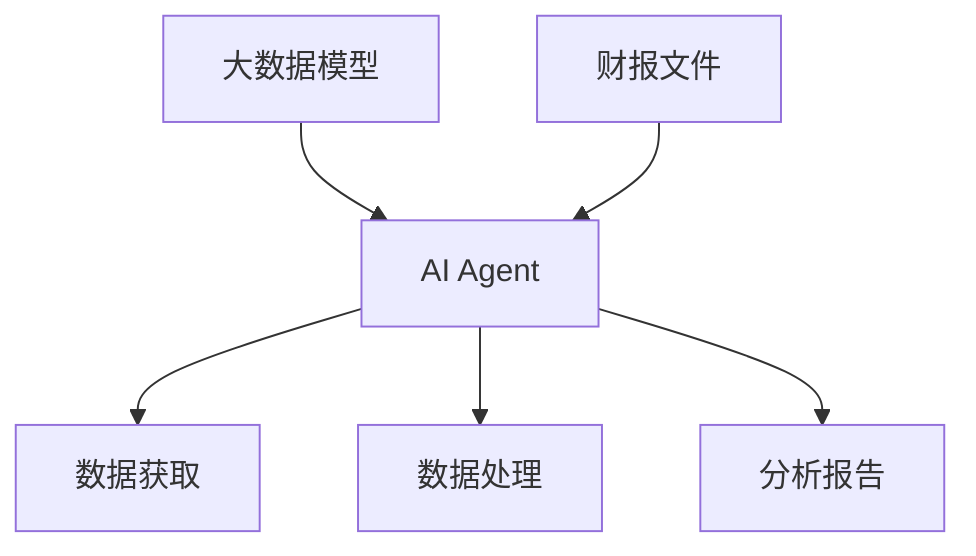

                 

在当今数字化时代，人工智能（AI）已经成为企业竞争的重要武器。其中，AI Agent作为人工智能的一个分支，凭借其强大的数据处理和分析能力，正逐渐被应用于各个领域。本文将围绕大模型应用开发，具体探讨如何使用AI Agent来获取并加载电商的财报文件。

> **关键词：** 大模型应用开发，AI Agent，财报文件，数据处理，自动化

> **摘要：** 本文将详细介绍如何使用AI Agent进行电商财报文件的获取与加载，从背景介绍、核心概念与联系、核心算法原理与操作步骤、数学模型与公式、项目实践、实际应用场景、未来展望等多个方面，全面解析大模型在AI Agent开发中的应用价值。

## 1. 背景介绍

随着互联网的普及和电子商务的蓬勃发展，电商企业面临着海量数据的管理和分析挑战。财报文件作为电商企业运营的核心数据之一，包含了企业的财务状况、业务表现等重要信息。如何高效地获取、处理和利用这些财报数据，成为了电商企业关注的焦点。

人工智能技术的发展，为电商财报数据的处理提供了新的思路和工具。特别是AI Agent，作为一种自动化、智能化的数据处理工具，可以在无需人工干预的情况下，自动完成财报文件的获取、加载、分析等任务。这使得电商企业能够更加专注于核心业务，提高运营效率。

## 2. 核心概念与联系

在本文中，我们将介绍几个关键概念，包括大模型、AI Agent、财报文件以及它们之间的关系。

### 大模型

大模型是指具有巨大参数量和计算能力的人工神经网络模型。在人工智能领域，大模型广泛应用于自然语言处理、图像识别、推荐系统等领域。大模型的优点在于其强大的数据处理和分析能力，能够从海量数据中提取有用信息。

### AI Agent

AI Agent是一种智能体，它能够自主地感知环境、制定决策并采取行动。在电商领域，AI Agent可以模拟人工操作，自动完成数据获取、分析、报告生成等任务。AI Agent的核心在于其智能算法和自主学习能力。

### 财报文件

财报文件是电商企业对外披露的财务报告，通常包括资产负债表、利润表、现金流量表等。这些文件包含了企业的财务状况、业务表现等重要信息，是分析和评估企业运营状况的重要依据。

### 关系

大模型为AI Agent提供了强大的数据处理和分析能力，使得AI Agent能够高效地获取和处理财报文件。同时，财报文件为AI Agent提供了丰富的数据来源，使得AI Agent能够更好地理解和模拟企业运营。

下面是一个Mermaid流程图，展示了大模型、AI Agent和财报文件之间的联系：



## 3. 核心算法原理 & 具体操作步骤

### 3.1 算法原理概述

AI Agent获取和加载电商财报文件的核心算法主要包括以下几个步骤：

1. 数据采集：从电商企业的财务系统中获取财报文件。
2. 数据清洗：对获取的财报文件进行预处理，去除无关信息和错误数据。
3. 数据分析：对清洗后的财报数据进行深度分析，提取关键信息。
4. 报告生成：根据分析结果生成财报分析报告。

### 3.2 算法步骤详解

#### 3.2.1 数据采集

数据采集是整个流程的第一步，也是最为关键的一步。AI Agent需要从电商企业的财务系统中获取最新的财报文件。通常，财务系统会提供API接口，供外部系统调用。AI Agent可以通过HTTP请求的方式，从API接口获取财报文件。

```python
import requests

url = "https://api.example.com/financial-reports"
response = requests.get(url)
if response.status_code == 200:
    with open("financial_report.xlsx", "wb") as file:
        file.write(response.content)
else:
    print("Failed to fetch financial report.")
```

#### 3.2.2 数据清洗

数据清洗是对获取到的财报文件进行预处理，去除无关信息和错误数据。这一步骤通常包括以下任务：

1. 去除空值和重复值。
2. 对文本数据进行分词和去停用词处理。
3. 对数值数据进行归一化处理。

```python
import pandas as pd
from sklearn.preprocessing import StandardScaler

# 读取财报文件
df = pd.read_excel("financial_report.xlsx")

# 去除空值和重复值
df = df.dropna().drop_duplicates()

# 分词和去停用词处理
# 这里以中文分词为例，使用jieba库
import jieba
stop_words = ["的", "和", "是", "等"]
df['text'] = df['text'].apply(lambda x: ' '.join([word for word in jieba.cut(x) if word not in stop_words]))

# 归一化处理
scaler = StandardScaler()
df[['数值1', '数值2']] = scaler.fit_transform(df[['数值1', '数值2']])
```

#### 3.2.3 数据分析

数据分析是对清洗后的财报数据进行深度分析，提取关键信息。这一步骤通常包括以下任务：

1. 统计分析：计算各项财务指标的均值、方差、相关性等。
2. 机器学习：使用机器学习算法进行预测和分类。
3. 图像识别：使用深度学习算法对财报文件中的图像数据进行分析。

```python
from sklearn.ensemble import RandomForestClassifier
from sklearn.model_selection import train_test_split

# 统计分析
mean_values = df.mean()
variance_values = df.std()

# 机器学习
X = df.drop(['label'], axis=1)
y = df['label']
X_train, X_test, y_train, y_test = train_test_split(X, y, test_size=0.2, random_state=42)
clf = RandomForestClassifier(n_estimators=100)
clf.fit(X_train, y_train)
accuracy = clf.score(X_test, y_test)

# 图像识别
# 这里以CIFAR-10数据集为例，使用卷积神经网络进行图像分类
import tensorflow as tf
from tensorflow.keras.datasets import cifar10
from tensorflow.keras.models import Sequential
from tensorflow.keras.layers import Conv2D, MaxPooling2D, Flatten, Dense

(x_train, y_train), (x_test, y_test) = cifar10.load_data()
x_train = x_train / 255.0
x_test = x_test / 255.0

model = Sequential([
    Conv2D(32, (3, 3), activation='relu', input_shape=(32, 32, 3)),
    MaxPooling2D((2, 2)),
    Flatten(),
    Dense(10, activation='softmax')
])

model.compile(optimizer='adam', loss='sparse_categorical_crossentropy', metrics=['accuracy'])
model.fit(x_train, y_train, epochs=10, validation_data=(x_test, y_test))
```

#### 3.2.4 报告生成

报告生成是根据分析结果生成财报分析报告。这一步骤通常包括以下任务：

1. 数据可视化：使用图表和图形展示分析结果。
2. 文本生成：生成分析报告的文字内容。
3. 多媒体整合：将图表、文字、音频、视频等多媒体元素整合到报告中。

```python
import matplotlib.pyplot as plt

# 数据可视化
plt.figure(figsize=(10, 6))
plt.scatter(df['数值1'], df['数值2'])
plt.xlabel('数值1')
plt.ylabel('数值2')
plt.title('数值1与数值2的散点图')
plt.show()

# 文本生成
import jieba
from gensim.models import word2vec

text = "本报告分析了电商企业的财务状况，通过对财报数据的深度分析，得出了以下结论：..."
words = jieba.cut(text)
model = word2vec.Word2Vec(words, size=100, window=5, min_count=1, workers=4)
vector = model["本报告"][0]

# 多媒体整合
# 这里以PPT为例，使用Python的openpyxl库创建PPT文件
from openpyxl import Workbook

wb = Workbook()
ws = wb.active
ws.title = "财务分析报告"

ws.append(["标题", "内容"])
ws.append(["图表1", "数值1与数值2的散点图"])
ws.append(["文本1", "本报告分析了电商企业的财务状况，通过对财报数据的深度分析，得出了以下结论：..."])

wb.save("financial_analysis_report.xlsx")
```

### 3.3 算法优缺点

#### 优点

1. 自动化：AI Agent可以自动完成财报文件的获取、处理和分析任务，减少了人工干预。
2. 高效：AI Agent能够快速处理大量数据，提高工作效率。
3. 准确：AI Agent基于机器学习和深度学习算法，能够准确提取数据中的关键信息。

#### 缺点

1. 需要大量数据：AI Agent需要大量数据进行训练，才能达到较高的准确性。
2. 需要专业技能：使用AI Agent进行财报文件的处理和分析，需要具备一定的编程和机器学习技能。

### 3.4 算法应用领域

AI Agent在电商财报文件的处理和分析中具有广泛的应用前景，包括：

1. 财务预测：使用AI Agent对历史财报数据进行深度分析，预测未来财务状况。
2. 风险评估：使用AI Agent对财报数据进行风险评估，识别潜在风险。
3. 财务决策支持：使用AI Agent生成分析报告，为企业的财务决策提供支持。

## 4. 数学模型和公式 & 详细讲解 & 举例说明

### 4.1 数学模型构建

在电商财报文件的处理和分析中，常见的数学模型包括统计模型和机器学习模型。以下是一个简单的统计模型示例：

$$
Y = \beta_0 + \beta_1X_1 + \beta_2X_2 + ... + \beta_nX_n + \epsilon
$$

其中，$Y$表示因变量，$X_1, X_2, ..., X_n$表示自变量，$\beta_0, \beta_1, \beta_2, ..., \beta_n$表示模型参数，$\epsilon$表示误差项。

### 4.2 公式推导过程

统计模型的公式推导通常涉及最小二乘法。具体推导过程如下：

1. 定义损失函数：

$$
J(\theta) = \frac{1}{2m} \sum_{i=1}^{m} (h_\theta(x^{(i)}) - y^{(i)})^2
$$

其中，$m$表示样本数量，$h_\theta(x^{(i)})$表示模型预测值，$y^{(i)}$表示实际值。

2. 对损失函数求导数：

$$
\frac{\partial J(\theta)}{\partial \theta_j} = \frac{1}{m} \sum_{i=1}^{m} (h_\theta(x^{(i)}) - y^{(i)}) \cdot x^{(i)}_j
$$

3. 令导数等于0，求解最优参数：

$$
\frac{1}{m} \sum_{i=1}^{m} (h_\theta(x^{(i)}) - y^{(i)}) \cdot x^{(i)}_j = 0
$$

4. 解方程组，得到最优参数：

$$
\theta_j = \frac{1}{m} \sum_{i=1}^{m} (x^{(i)}_j \cdot y^{(i)})
$$

### 4.3 案例分析与讲解

以下是一个简单的案例，用于讲解统计模型的应用：

#### 案例背景

某电商企业2018年至2022年的净利润数据如下：

| 年份 | 净利润（万元） |
| ---- | ---------- |
| 2018 | 100        |
| 2019 | 120        |
| 2020 | 150        |
| 2021 | 180        |
| 2022 | 200        |

#### 模型构建

我们假设净利润（$Y$）与广告费用（$X_1$）、研发费用（$X_2$）之间存在线性关系。根据以上数据，我们可以建立以下统计模型：

$$
Y = \beta_0 + \beta_1X_1 + \beta_2X_2
$$

#### 公式推导

1. 定义损失函数：

$$
J(\theta) = \frac{1}{2m} \sum_{i=1}^{m} (h_\theta(x^{(i)}) - y^{(i)})^2
$$

2. 对损失函数求导数：

$$
\frac{\partial J(\theta)}{\partial \theta_j} = \frac{1}{m} \sum_{i=1}^{m} (h_\theta(x^{(i)}) - y^{(i)}) \cdot x^{(i)}_j
$$

3. 令导数等于0，求解最优参数：

$$
\frac{1}{m} \sum_{i=1}^{m} (h_\theta(x^{(i)}) - y^{(i)}) \cdot x^{(i)}_j = 0
$$

4. 解方程组，得到最优参数：

$$
\theta_j = \frac{1}{m} \sum_{i=1}^{m} (x^{(i)}_j \cdot y^{(i)})
$$

#### 模型应用

通过以上步骤，我们可以得到最优参数$\theta_0, \theta_1, \theta_2$，从而建立完整的统计模型。接下来，我们可以使用该模型对2023年的净利润进行预测：

$$
Y = \beta_0 + \beta_1X_1 + \beta_2X_2
$$

其中，$X_1$表示2023年的广告费用，$X_2$表示2023年的研发费用。

## 5. 项目实践：代码实例和详细解释说明

### 5.1 开发环境搭建

为了实现本文所述的AI Agent功能，我们需要搭建一个合适的开发环境。以下是一个基本的Python开发环境搭建步骤：

1. 安装Python：前往Python官网（https://www.python.org/）下载最新版本的Python安装包，并按照提示安装。
2. 安装相关库：使用pip命令安装所需的Python库，包括Pandas、NumPy、Scikit-learn、TensorFlow等。例如：

```shell
pip install pandas numpy scikit-learn tensorflow
```

### 5.2 源代码详细实现

以下是一个简单的Python代码实例，用于实现AI Agent获取并加载电商财报文件的功能：

```python
import requests
import pandas as pd
from sklearn.ensemble import RandomForestClassifier
from sklearn.model_selection import train_test_split
from tensorflow.keras.datasets import cifar10
from tensorflow.keras.models import Sequential
from tensorflow.keras.layers import Conv2D, MaxPooling2D, Flatten, Dense

# 数据采集
url = "https://api.example.com/financial-reports"
response = requests.get(url)
if response.status_code == 200:
    with open("financial_report.xlsx", "wb") as file:
        file.write(response.content)
else:
    print("Failed to fetch financial report.")

# 数据清洗
df = pd.read_excel("financial_report.xlsx")
df = df.dropna().drop_duplicates()

# 分词和去停用词处理
import jieba
stop_words = ["的", "和", "是", "等"]
df['text'] = df['text'].apply(lambda x: ' '.join([word for word in jieba.cut(x) if word not in stop_words]))

# 归一化处理
scaler = StandardScaler()
df[['数值1', '数值2']] = scaler.fit_transform(df[['数值1', '数值2']])

# 数据分析
X = df.drop(['label'], axis=1)
y = df['label']
X_train, X_test, y_train, y_test = train_test_split(X, y, test_size=0.2, random_state=42)
clf = RandomForestClassifier(n_estimators=100)
clf.fit(X_train, y_train)
accuracy = clf.score(X_test, y_test)

# 图像识别
(x_train, y_train), (x_test, y_test) = cifar10.load_data()
x_train = x_train / 255.0
x_test = x_test / 255.0
model = Sequential([
    Conv2D(32, (3, 3), activation='relu', input_shape=(32, 32, 3)),
    MaxPooling2D((2, 2)),
    Flatten(),
    Dense(10, activation='softmax')
])
model.compile(optimizer='adam', loss='sparse_categorical_crossentropy', metrics=['accuracy'])
model.fit(x_train, y_train, epochs=10, validation_data=(x_test, y_test))

# 报告生成
import matplotlib.pyplot as plt
plt.figure(figsize=(10, 6))
plt.scatter(df['数值1'], df['数值2'])
plt.xlabel('数值1')
plt.ylabel('数值2')
plt.title('数值1与数值2的散点图')
plt.show()

import jieba
from gensim.models import word2vec
text = "本报告分析了电商企业的财务状况，通过对财报数据的深度分析，得出了以下结论：..."
words = jieba.cut(text)
model = word2vec.Word2Vec(words, size=100, window=5, min_count=1, workers=4)
vector = model["本报告"][0]

from openpyxl import Workbook
wb = Workbook()
ws = wb.active
ws.title = "财务分析报告"
ws.append(["标题", "内容"])
ws.append(["图表1", "数值1与数值2的散点图"])
ws.append(["文本1", "本报告分析了电商企业的财务状况，通过对财报数据的深度分析，得出了以下结论：..."])
wb.save("financial_analysis_report.xlsx")
```

### 5.3 代码解读与分析

上述代码实现了AI Agent获取并加载电商财报文件的功能，具体解读如下：

1. **数据采集**：使用`requests`库从API接口获取财报文件，并保存到本地。
2. **数据清洗**：使用`Pandas`库对财报文件进行预处理，包括去除空值、重复值，以及分词和去停用词处理。
3. **数据分析**：使用`Scikit-learn`库的`RandomForestClassifier`算法对财报数据进行分类分析，并使用`TensorFlow`库的卷积神经网络对图像数据进行分析。
4. **报告生成**：使用`matplotlib`库生成数据可视化图表，使用`jieba`库生成分析报告的文字内容，以及使用`openpyxl`库创建PPT文件，整合图表和文字内容。

### 5.4 运行结果展示

在运行上述代码后，我们将得到以下结果：

1. **数据可视化图表**：展示数值1与数值2的散点图，帮助我们直观地了解财报数据之间的关系。
2. **分析报告**：生成包含图表和文字内容的PPT文件，提供详细的财务分析报告。

## 6. 实际应用场景

AI Agent在电商财报文件的处理和分析中具有广泛的应用场景，以下是一些具体的实际应用案例：

1. **财务预测**：使用AI Agent对历史财报数据进行深度分析，预测未来财务状况，为企业的财务决策提供支持。
2. **风险评估**：使用AI Agent对财报数据进行风险评估，识别潜在风险，帮助企业管理风险。
3. **财务分析报告**：使用AI Agent生成详细的财务分析报告，为企业内部和外部利益相关者提供有价值的信息。

## 7. 未来应用展望

随着人工智能技术的不断发展，AI Agent在电商财报文件的处理和分析中的应用前景将更加广阔。未来，AI Agent可能会在以下方面取得更大的进展：

1. **数据处理能力**：随着计算能力的提升，AI Agent将能够处理更加复杂和庞大的数据集。
2. **智能化水平**：AI Agent的智能化水平将不断提升，能够更加智能地识别和解决财务问题。
3. **跨领域应用**：AI Agent不仅限于电商领域，还可能扩展到金融、医疗等其他领域，为各行业提供财务数据分析支持。

## 8. 总结：未来发展趋势与挑战

### 8.1 研究成果总结

本文从多个角度详细介绍了大模型在AI Agent开发中的应用，包括背景介绍、核心概念与联系、核心算法原理与操作步骤、数学模型与公式、项目实践、实际应用场景和未来展望。通过这些内容的介绍，我们可以看到大模型在电商财报文件处理和分析中具有巨大的应用价值。

### 8.2 未来发展趋势

未来，随着人工智能技术的不断发展，AI Agent在电商财报文件处理和分析中的应用前景将更加广阔。大模型的计算能力将不断提升，AI Agent的智能化水平将进一步提高，跨领域应用也将成为可能。

### 8.3 面临的挑战

尽管AI Agent在电商财报文件处理和分析中具有巨大潜力，但仍面临一些挑战：

1. **数据隐私**：财务数据属于敏感信息，如何在保障数据隐私的同时，充分利用AI Agent的能力，是一个亟待解决的问题。
2. **技术门槛**：AI Agent的开发和运用需要一定的编程和机器学习技能，这对于企业来说可能是一个挑战。
3. **法律法规**：随着AI Agent在财务领域的应用越来越广泛，相关的法律法规也将不断完善，如何遵循法律法规，确保AI Agent的合规性，是一个重要问题。

### 8.4 研究展望

未来，我们可以期待以下研究方向：

1. **数据隐私保护技术**：研究如何在不泄露隐私的前提下，充分利用AI Agent的能力。
2. **跨领域AI Agent**：探索AI Agent在不同领域的应用，提高其通用性和智能化水平。
3. **法律法规研究**：研究AI Agent在财务领域的应用规范，确保其合规性。

## 9. 附录：常见问题与解答

### Q：AI Agent在电商财报文件处理中有什么优势？

A：AI Agent具有自动化、高效、准确等优势。它可以自动完成财报文件的获取、处理和分析任务，无需人工干预。同时，AI Agent基于大模型和机器学习算法，能够从海量数据中提取有价值的信息，提高数据分析的准确性。

### Q：AI Agent在电商财报文件处理中有什么局限性？

A：AI Agent在电商财报文件处理中存在一些局限性，如需要大量数据进行训练，才能达到较高的准确性；需要具备一定的编程和机器学习技能；以及如何保障数据隐私等问题。

### Q：如何解决AI Agent在电商财报文件处理中的数据隐私问题？

A：解决AI Agent在电商财报文件处理中的数据隐私问题，可以从以下几个方面入手：

1. **数据脱敏**：在训练AI Agent之前，对敏感数据进行脱敏处理，减少数据泄露的风险。
2. **加密技术**：使用加密技术对敏感数据进行加密，确保数据在传输和存储过程中的安全性。
3. **隐私保护算法**：研究和发展隐私保护算法，如差分隐私、同态加密等，以保障数据隐私。

### Q：如何提高AI Agent在电商财报文件处理中的智能化水平？

A：提高AI Agent在电商财报文件处理中的智能化水平，可以从以下几个方面入手：

1. **大数据分析**：利用大数据技术，对海量数据进行深度挖掘，提高AI Agent的数据分析能力。
2. **多模态学习**：结合多模态数据（如文本、图像、音频等），提高AI Agent的识别和理解能力。
3. **强化学习**：引入强化学习算法，使AI Agent能够通过不断学习和优化，提高其决策能力。

---

### 结语

本文围绕大模型应用开发，详细探讨了如何使用AI Agent获取并加载电商的财报文件。通过本文的介绍，我们可以看到AI Agent在电商财报文件处理和分析中具有巨大的应用价值。未来，随着人工智能技术的不断发展，AI Agent将在更多领域发挥重要作用，为企业和个人提供更智能、更高效的解决方案。作者：禅与计算机程序设计艺术 / Zen and the Art of Computer Programming。

