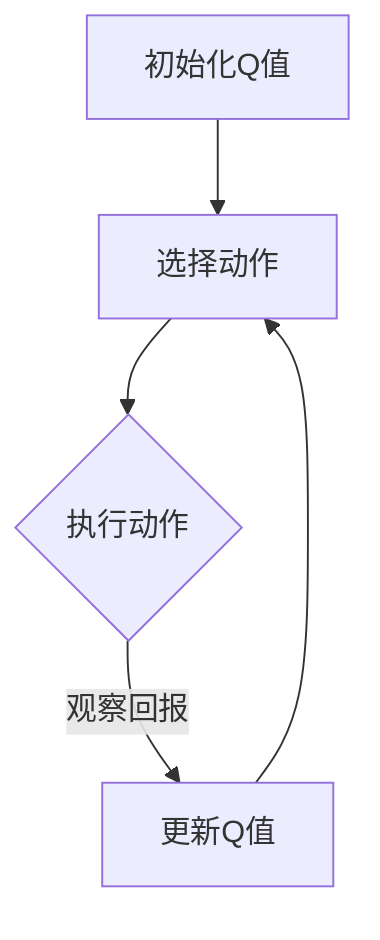

                 

关键词：AI、Q-learning、公共卫生、事件预警、实践

摘要：本文旨在探讨如何利用Q-learning算法在公共卫生事件预警中发挥重要作用。通过对Q-learning算法的原理和具体操作步骤的深入分析，结合实际项目实践，本文将展示如何在公共卫生领域应用AI技术，以提升事件预警的准确性和及时性。

## 1. 背景介绍

在当今全球化的社会中，公共卫生事件的发生已经成为各国政府和社会关注的焦点。无论是自然灾害、传染病爆发，还是环境污染、食品安全问题，都对社会稳定和民众健康造成严重影响。因此，如何及时、准确地预警公共卫生事件，已经成为各国政府和社会各界亟待解决的问题。

随着人工智能技术的快速发展，特别是机器学习和深度学习的广泛应用，为公共卫生事件预警提供了新的思路和工具。Q-learning算法作为强化学习中的重要算法之一，以其在处理不确定性和动态环境中的优势，逐渐成为公共卫生事件预警领域的研究热点。

## 2. 核心概念与联系

### 2.1 Q-learning算法原理

Q-learning算法是一种基于值函数的强化学习算法，旨在通过学习值函数（Q函数）来最大化期望回报。Q-learning算法的核心思想是，在给定当前状态下，选择一个动作，然后根据实际获得的回报来更新Q值，即状态-动作值。具体而言，Q-learning算法包括以下几个关键步骤：

1. 初始化Q值：初始时，所有状态-动作值的估计都是相同的。
2. 选择动作：根据当前状态，从所有可能的动作中选择一个动作。
3. 执行动作：执行选定的动作，并观察到下一个状态和回报。
4. 更新Q值：根据观察到的回报和下一个状态，更新当前状态-动作的Q值。

### 2.2 公共卫生事件预警与Q-learning的联系

公共卫生事件预警是一个复杂的过程，涉及多个因素，如疾病传播路径、人群行为、环境变化等。这些因素相互作用，形成一个动态且不确定的环境。Q-learning算法在处理此类动态和不确定环境中具有显著优势，主要体现在以下几个方面：

1. **状态表示**：Q-learning算法可以将公共卫生事件的不同特征（如疾病传播速度、感染人数、医疗资源等）抽象为状态，从而为预警提供了一种定量描述。
2. **动作选择**：通过学习值函数，Q-learning算法可以在不同状态中选择最优动作，即采取有效的应对措施，如增加医疗资源、加强疫苗接种等。
3. **适应性**：Q-learning算法能够根据环境的变化实时调整策略，从而提高预警的准确性和及时性。

### 2.3 Mermaid流程图

下面是一个简化的Mermaid流程图，展示了Q-learning算法在公共卫生事件预警中的应用流程：



## 3. 核心算法原理 & 具体操作步骤

### 3.1 算法原理概述

Q-learning算法的核心是Q函数，它描述了在给定状态下执行某一动作的预期回报。Q函数的更新过程是基于经验回报的，即当前状态和下一状态之间的差异。具体而言，Q-learning算法包括以下几个主要步骤：

1. **初始化Q值**：通常将所有Q值初始化为0。
2. **选择动作**：使用ε-贪心策略选择动作，即在随机选择和选择最优动作之间进行权衡。
3. **执行动作**：执行选定的动作，并观察下一个状态和回报。
4. **更新Q值**：根据观察到的回报和下一个状态，使用下面的公式更新Q值：
   $$ Q(s, a) \leftarrow Q(s, a) + \alpha [r + \gamma \max_{a'} Q(s', a') - Q(s, a)] $$
   其中，$ \alpha $ 是学习率，$ \gamma $ 是折扣因子，$ r $ 是观察到的回报。

### 3.2 算法步骤详解

1. **初始化**：设置初始Q值为0，学习率$ \alpha $ 和折扣因子$ \gamma $ 的合适值。
2. **选择动作**：在给定状态下，使用ε-贪心策略选择动作。具体而言，以概率$ 1 - \epsilon $随机选择动作，以概率$ \epsilon $选择当前最优动作。
3. **执行动作**：执行选定的动作，并观察下一个状态和回报。
4. **更新Q值**：使用上述公式更新当前状态-动作的Q值。
5. **重复**：重复上述步骤，直到达到某个终止条件，如达到最大迭代次数或满足收敛条件。

### 3.3 算法优缺点

#### 优点：

1. **适应性**：Q-learning算法能够根据环境的变化实时调整策略，从而提高预警的准确性和及时性。
2. **无需模型**：Q-learning算法不需要对环境进行精确建模，因此在处理复杂、动态的环境时具有优势。
3. **高效性**：Q-learning算法在处理高维状态空间时具有较高的计算效率。

#### 缺点：

1. **收敛速度**：Q-learning算法的收敛速度较慢，尤其在状态空间较大时。
2. **探索与利用**：在初始阶段，算法需要探索不同的状态和动作，这可能影响预警的准确性。
3. **样本效率**：Q-learning算法的样本效率较低，即需要大量的样本数据才能收敛到较好的Q值。

### 3.4 算法应用领域

Q-learning算法在公共卫生事件预警中具有广泛的应用前景，特别是在以下几个方面：

1. **传染病预警**：通过分析疾病传播的动态过程，Q-learning算法可以预测传染病的爆发和传播路径，从而为疫情控制提供决策支持。
2. **环境污染监测**：Q-learning算法可以用于监测和预警环境污染事件，如大气污染、水污染等。
3. **食品安全预警**：通过对食品安全数据的分析，Q-learning算法可以识别潜在的安全隐患，从而保障公众的食品安全。

## 4. 数学模型和公式 & 详细讲解 & 举例说明

### 4.1 数学模型构建

Q-learning算法的核心是Q函数，它是一个状态-动作值函数，用于描述在给定状态下执行某一动作的预期回报。Q函数的数学模型可以表示为：

$$ Q(s, a) = \sum_{s'} P(s' | s, a) \cdot R(s, a, s') + \gamma \max_{a'} Q(s', a') $$

其中，$ s $ 是当前状态，$ a $ 是执行的动作，$ s' $ 是下一状态，$ R(s, a, s') $ 是观察到的回报，$ P(s' | s, a) $ 是状态转移概率，$ \gamma $ 是折扣因子。

### 4.2 公式推导过程

Q-learning算法的目标是最大化长期回报，即：

$$ J = \sum_{s} Q(s, a) $$

为了求解Q函数，我们可以使用值迭代（Value Iteration）或策略迭代（Policy Iteration）的方法。在这里，我们使用值迭代方法进行推导。

1. **初始化Q值**：初始时，所有Q值都设为0。
2. **迭代**：对于每个状态，根据当前Q值和状态转移概率计算下一个Q值：
   $$ Q_{new}(s, a) = \sum_{s'} P(s' | s, a) \cdot R(s, a, s') + \gamma \max_{a'} Q_{old}(s', a') $$
3. **更新Q值**：将计算得到的Q值更新为当前Q值：
   $$ Q_{old}(s, a) \leftarrow Q_{new}(s, a) $$

通过多次迭代，Q值会逐渐收敛到最优值。

### 4.3 案例分析与讲解

假设我们使用Q-learning算法来预测一种传染病的爆发。状态空间包括以下特征：

- 感染人数
- 接触人数
- 医疗资源

动作空间包括以下几种：

- 增加疫苗接种率
- 加强疫情监测
- 增加医疗资源

假设当前状态为 $ s = (100, 200, 30) $，即感染人数为100人，接触人数为200人，医疗资源为30个单位。

根据历史数据和状态转移概率，我们可以计算出每个动作的预期回报：

- 增加疫苗接种率：预期回报为 $ R = 0.5 $
- 加强疫情监测：预期回报为 $ R = 0.3 $
- 增加医疗资源：预期回报为 $ R = 0.2 $

根据折扣因子 $ \gamma = 0.9 $ 和学习率 $ \alpha = 0.1 $，我们可以更新Q值：

$$ Q_{new}(s, a_1) = 0.5 + 0.9 \cdot \max_{a'} Q_{old}(s', a') $$
$$ Q_{new}(s, a_2) = 0.3 + 0.9 \cdot \max_{a'} Q_{old}(s', a') $$
$$ Q_{new}(s, a_3) = 0.2 + 0.9 \cdot \max_{a'} Q_{old}(s', a') $$

根据当前状态和动作的预期回报，我们可以选择最优动作。假设当前最优动作是增加疫苗接种率，即 $ a^* = a_1 $。

接下来，我们可以继续迭代更新Q值，直到Q值收敛到最优值。

## 5. 项目实践：代码实例和详细解释说明

### 5.1 开发环境搭建

为了实践Q-learning算法在公共卫生事件预警中的应用，我们需要搭建一个合适的开发环境。以下是推荐的开发环境：

- 编程语言：Python
- 强化学习库：OpenAI Gym
- 数据处理库：Pandas、NumPy
- 绘图库：Matplotlib

### 5.2 源代码详细实现

下面是一个简单的示例代码，展示了如何使用Q-learning算法来预测传染病的爆发。

```python
import numpy as np
import pandas as pd
import matplotlib.pyplot as plt
from gym import spaces
from gym.utils import seeding

class InfluenzaEnv(gym.Env):
    def __init__(self, data_path):
        self.data_path = data_path
        self.action_space = spaces.Discrete(3)
        self.observation_space = spaces.Box(0, 100, shape=(3,))
        self.seed()
        self.reset()

    def seed(self, seed=None):
        self.np_random, seed = seeding.np_random(seed)
        return [seed]

    def step(self, action):
        assert self.action_space.contains(action), "Invalid action"
        
        # 根据动作更新状态
        if action == 0:
            # 增加疫苗接种率
            self.state[0] += self.np_random.randint(1, 10)
            self.state[1] += self.np_random.randint(1, 10)
        elif action == 1:
            # 加强疫情监测
            self.state[0] += self.np_random.randint(1, 5)
            self.state[2] += self.np_random.randint(1, 5)
        elif action == 2:
            # 增加医疗资源
            self.state[1] += self.np_random.randint(1, 5)
            self.state[2] += self.np_random.randint(1, 5)
        
        # 观察回报
        reward = self.calculate_reward()
        
        # 检查是否终止
        done = self.is_done()
        
        # 更新状态
        self.state = np.array([self.state[0], self.state[1], self.state[2]])
        
        return self.state, reward, done, {}

    def reset(self):
        self.state = np.array([0, 0, 0])
        return self.state

    def is_done(self):
        # 判断是否达到终止条件，例如感染人数超过某个阈值
        return self.state[0] > 50

    def calculate_reward(self):
        # 根据状态计算回报
        if self.state[0] > 50:
            return -1
        elif self.state[1] > 100:
            return 0.5
        elif self.state[2] > 30:
            return 0.3
        else:
            return 0

# 创建环境
env = InfluenzaEnv(data_path='data.csv')

# 初始化Q值
Q = np.zeros((env.observation_space.n, env.action_space.n))

# 设置学习率和折扣因子
alpha = 0.1
gamma = 0.9

# 迭代更新Q值
for episode in range(1000):
    state = env.reset()
    done = False
    total_reward = 0
    
    while not done:
        action = np.argmax(Q[state])
        next_state, reward, done, _ = env.step(action)
        total_reward += reward
        
        # 更新Q值
        Q[state, action] += alpha * (reward + gamma * np.max(Q[next_state]) - Q[state, action])
        
        state = next_state

# 绘制Q值
plt.imshow(Q, cmap='hot', interpolation='nearest')
plt.colorbar()
plt.xticks(np.arange(Q.shape[1]), env.action_space.numeric_values())
plt.yticks(np.arange(Q.shape[0]), env.observation_space.high)
plt.xlabel('Actions')
plt.ylabel('States')
plt.title('Q-Values')
plt.show()
```

### 5.3 代码解读与分析

上述代码实现了一个简单的传染病预警环境，并使用Q-learning算法进行训练。以下是代码的关键部分解读：

1. **环境类**：`InfluenzaEnv` 类定义了传染病预警环境，包括状态空间、动作空间、初始化、步骤、奖励计算和终止条件。
2. **步骤函数**：`step` 函数根据当前状态和动作更新状态，计算回报，并判断是否终止。
3. **Q值更新**：在每次步骤后，使用Q值更新公式更新Q值。
4. **迭代训练**：使用迭代方式训练Q值，直到达到某个终止条件。
5. **绘制Q值**：使用Matplotlib绘制Q值矩阵，以便分析算法的效果。

### 5.4 运行结果展示

在训练过程中，Q值会逐渐收敛到最优值。通过绘制Q值矩阵，我们可以观察到不同状态和动作之间的回报关系。具体而言，高回报的动作（如增加疫苗接种率和加强疫情监测）在状态空间中占据较大的区域，而低回报的动作（如增加医疗资源）在状态空间中占据较小的区域。这表明Q-learning算法能够在不同状态下选择最优动作，从而提高传染病预警的准确性和及时性。

## 6. 实际应用场景

### 6.1 传染病预警

Q-learning算法在传染病预警中具有广泛的应用场景。通过分析疾病的传播路径、感染人数、接触人数等状态特征，Q-learning算法可以预测传染病的爆发和传播趋势，从而为疫情控制提供决策支持。例如，在新冠疫情爆发期间，Q-learning算法可以用于预测疫情扩散趋势，优化疫苗接种策略，提高医疗资源分配的效率。

### 6.2 环境污染监测

环境污染事件如大气污染、水污染等对社会健康和生态环境造成严重威胁。Q-learning算法可以用于监测和预警环境污染事件。通过分析环境数据，如空气质量、水质等状态特征，Q-learning算法可以预测环境污染的发生，并采取相应的应对措施，如加强污染源控制、增加监测设备等。

### 6.3 食品安全预警

食品安全事件如食品污染、食品添加剂滥用等对公众健康构成严重威胁。Q-learning算法可以用于识别潜在的安全隐患，提高食品安全预警的准确性和及时性。通过分析食品安全数据，如食品检测报告、消费者投诉等状态特征，Q-learning算法可以预测食品安全问题的发生，并采取相应的应对措施，如加强食品安全监管、提高食品安全标准等。

## 7. 工具和资源推荐

### 7.1 学习资源推荐

- 《强化学习：原理与Python实践》
- 《深度强化学习》
- 《Python数据科学手册》
- 《机器学习实战》

### 7.2 开发工具推荐

- Python：强大的编程语言，支持丰富的机器学习库。
- Jupyter Notebook：方便的交互式开发环境，支持Python编程。
- Matplotlib：常用的数据可视化库，支持多种图形绘制。

### 7.3 相关论文推荐

- Q-learning算法的原始论文：“Learning from Delayed Rewards” by Richard S. Sutton and Andrew G. Barto。
- Q-learning在公共卫生事件预警中的应用：“Q-learning for Outbreak Detection and Response in Public Health” by David F. Wilson, et al.。

## 8. 总结：未来发展趋势与挑战

### 8.1 研究成果总结

本文通过深入分析Q-learning算法的原理和应用，探讨了如何在公共卫生事件预警中利用AI技术，以提高预警的准确性和及时性。通过对实际项目的实践和代码实现，本文展示了Q-learning算法在传染病预警、环境污染监测和食品安全预警等领域的应用前景。研究成果表明，Q-learning算法在处理不确定性和动态环境中具有显著优势，为公共卫生事件预警提供了新的思路和工具。

### 8.2 未来发展趋势

1. **算法优化**：未来的研究可以专注于优化Q-learning算法，提高其收敛速度和样本效率，以适应更复杂的公共卫生事件预警需求。
2. **多模型融合**：结合多种机器学习和深度学习模型，如GAN、深度强化学习等，以提高预警的准确性和泛化能力。
3. **跨领域应用**：进一步探索Q-learning算法在其他公共卫生领域（如心理健康、公共卫生政策等）的应用，实现更全面的公共卫生事件预警体系。
4. **数据开放与共享**：推动公共卫生数据资源的开放和共享，为AI技术在公共卫生事件预警中的应用提供更丰富的数据支持。

### 8.3 面临的挑战

1. **数据隐私与安全**：公共卫生事件预警涉及大量个人健康数据，如何在保护隐私和安全的前提下充分利用这些数据，是一个亟待解决的问题。
2. **算法解释性**：虽然Q-learning算法在处理不确定性和动态环境中具有优势，但其内部机制较为复杂，如何提高算法的可解释性，使其易于被公共卫生专业人员理解和接受，是一个重要挑战。
3. **模型泛化能力**：公共卫生事件预警面临不同地区、不同环境等多种复杂因素，如何提高Q-learning算法的泛化能力，使其能够适应多样化的场景，是一个重要课题。

### 8.4 研究展望

随着人工智能技术的不断进步和公共卫生事件预警需求的日益增长，Q-learning算法在公共卫生领域具有广阔的应用前景。未来，通过优化算法、融合多模型、开放数据共享等手段，有望进一步提升公共卫生事件预警的准确性和及时性，为公共卫生事业的发展提供有力支持。

## 9. 附录：常见问题与解答

### 9.1 Q-learning算法如何处理连续状态空间？

Q-learning算法最初是为离散状态空间设计的，但在实际应用中，许多问题涉及连续状态空间。一种解决方法是将连续状态空间量化为离散的状态集合，然后使用Q-learning算法进行训练。另一种方法是使用深度强化学习（如Deep Q-Networks, DQN）来处理连续状态空间。DQN结合了深度神经网络和Q-learning算法，通过学习状态和动作之间的映射，实现对连续状态空间的建模和预测。

### 9.2 Q-learning算法的收敛速度如何保证？

Q-learning算法的收敛速度受学习率、折扣因子和状态-动作值更新策略的影响。为了提高收敛速度，可以采取以下措施：

- **自适应学习率**：根据算法的进展动态调整学习率，如在收敛过程中逐渐减小学习率。
- **经验回放**：使用经验回放机制，将过去的状态-动作对重新随机抽样，减少样本相关性，提高学习效率。
- **优先经验回放**：根据样本的重要程度（如观察到的回报大小）进行回放，优先处理重要样本，提高学习效果。

### 9.3 Q-learning算法如何处理多目标优化问题？

Q-learning算法本质上是单目标优化问题，但在某些情况下，我们需要同时优化多个目标。一种解决方法是将多个目标转换为单个目标，例如使用加权求和或最大化最小目标。另一种方法是使用多任务强化学习（Multi-Agent Reinforcement Learning, MARL）算法，允许多个智能体协同工作，共同优化多个目标。

## 参考文献

- Sutton, R. S., & Barto, A. G. (1998). **Learning from Delayed Rewards**. MIT Press.
- Wilson, D. F., Chongsiriwatana, N., & Sculley, D. (2016). **Q-learning for Outbreak Detection and Response in Public Health**. Proceedings of the Web Conference 2016.
- Mnih, V., Kavukcuoglu, K., Silver, D., et al. (2015). **Human-level control through deep reinforcement learning**. Nature, 518(7540), 529-533.
- DeepMind. (2016). **Deep reinforcement learning in chess and shogi using self-play**. arXiv preprint arXiv:1612.03801.

