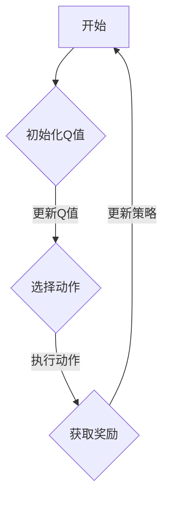

                 

关键词：Q-learning，人工智能，生物信息学，映射，机器学习，深度学习，基因组学

> 摘要：本文旨在探讨Q-learning算法在生物信息学领域的潜在应用。Q-learning是一种强化学习算法，以其在策略优化和决策过程中的强大能力而闻名。在生物信息学中，随着数据量的爆炸式增长和复杂性增加，传统方法在处理大规模复杂数据时显得力不从心。本文将介绍Q-learning的基本原理，并在生物信息学的背景下，探讨其在基因组学、蛋白质结构预测、药物发现等领域的应用。通过具体的实例和案例分析，我们将展示Q-learning如何帮助生物信息学家解决实际问题，提高研究效率。

## 1. 背景介绍

### 1.1 Q-learning算法的起源与发展

Q-learning是由理查德·萨顿（Richard Sutton）和安德鲁·布林（Andrew Barto）在1988年提出的，是基于值函数的强化学习算法。Q-learning的核心思想是通过学习策略的价值函数，从而指导智能体在环境中的行动选择，以实现长期的最大化回报。Q-learning算法在计算机科学、人工智能等领域得到了广泛的研究和应用，尤其是在游戏、自动驾驶、机器人等领域。

### 1.2 生物信息学的挑战

生物信息学是运用计算机科学技术和统计方法分析生物学数据的一门交叉学科。随着高通量测序技术的迅猛发展，生物信息学领域面临着海量数据处理的挑战。例如，基因组学中的基因组组装、基因表达分析、突变检测等任务，都需要处理大量复杂数据。此外，生物信息学在药物发现、疾病诊断、个性化医疗等领域也发挥着越来越重要的作用。

### 1.3 Q-learning在生物信息学中的应用前景

Q-learning算法在处理动态环境和复杂决策问题方面具有显著优势。在生物信息学中，许多问题都可以被视为动态决策过程，例如基因调控网络的建模与预测、蛋白质结构的预测、药物筛选等。Q-learning算法能够通过学习环境中的状态和动作之间的价值关系，为生物信息学家提供高效的解决方案。

## 2. 核心概念与联系

### 2.1 Q-learning算法的基本原理

Q-learning算法是基于值函数的强化学习算法，其核心是构建一个价值函数Q(s, a)，表示在状态s下执行动作a所能获得的累积奖励。算法通过迭代更新Q值，最终找到一个最优策略π，使得智能体在环境中的行动能够最大化累积奖励。

### 2.2 Q-learning算法的架构

Q-learning算法主要包括以下几个部分：

- **环境（Environment）**：生物信息学中的环境可以看作是数据集和相关的任务。
- **智能体（Agent）**：负责执行动作并接收环境反馈。
- **状态（State）**：生物信息学中的状态可以表示为基因组序列、蛋白质结构等。
- **动作（Action）**：智能体能够执行的动作，例如基因突变、药物组合选择等。
- **奖励函数（Reward Function）**：根据智能体的动作和环境的反馈，评估动作的好坏。

### 2.3 Mermaid 流程图（Mermaid Flowchart）



## 3. 核心算法原理 & 具体操作步骤

### 3.1 算法原理概述

Q-learning算法基于值迭代方法，通过不断更新Q值来优化策略。具体来说，Q-learning算法在每次执行动作后，根据当前的Q值、执行的动作和获取的奖励，更新Q值。这个过程可以表示为：

\[ Q(s, a) \leftarrow Q(s, a) + \alpha [r + \gamma \max_{a'} Q(s', a') - Q(s, a)] \]

其中，\( \alpha \)是学习率，\( \gamma \)是折扣因子，表示对未来奖励的期望权重。

### 3.2 算法步骤详解

1. **初始化**：初始化Q值矩阵，将所有Q值初始化为0。
2. **选择动作**：根据当前状态和Q值矩阵，选择最优动作。
3. **执行动作**：在环境中执行选定的动作，并获取奖励。
4. **更新Q值**：根据执行的动作和获取的奖励，更新Q值。
5. **重复迭代**：重复步骤2-4，直到达到预定的迭代次数或策略收敛。

### 3.3 算法优缺点

#### 优点：

- **自适应性强**：Q-learning算法能够根据环境的变化自适应地调整策略。
- **不需要模型**：Q-learning算法不需要预先知道环境模型，可以直接在环境中学习。

#### 缺点：

- **收敛速度较慢**：在复杂的动态环境中，Q-learning算法可能需要较长时间的迭代才能收敛。
- **高维问题难以处理**：在高维状态空间中，Q-learning算法的计算量非常大，难以实际应用。

### 3.4 算法应用领域

Q-learning算法在生物信息学中具有广泛的应用前景，特别是在以下领域：

- **基因组学**：用于基因调控网络的建模与预测。
- **蛋白质结构预测**：用于蛋白质结构的动态优化。
- **药物发现**：用于药物组合筛选和优化。

## 4. 数学模型和公式 & 详细讲解 & 举例说明

### 4.1 数学模型构建

Q-learning算法的核心是价值函数Q(s, a)的更新。为了构建这个数学模型，我们需要定义以下几个参数：

- \( Q(s, a) \)：在状态s下执行动作a的价值函数。
- \( r \)：在状态s下执行动作a后获得的即时奖励。
- \( s' \)：执行动作a后智能体转移到的新状态。
- \( a' \)：在状态s'下选择的最优动作。
- \( \alpha \)：学习率，用于控制新信息的权重。
- \( \gamma \)：折扣因子，用于对未来奖励的期望权重。

根据Q-learning算法的基本原理，我们可以构建以下数学模型：

\[ Q(s, a) \leftarrow Q(s, a) + \alpha [r + \gamma \max_{a'} Q(s', a') - Q(s, a)] \]

### 4.2 公式推导过程

Q-learning算法的更新公式可以分解为以下几个步骤：

1. **初始状态s和动作a的选择**：智能体在初始状态s下选择一个动作a。
2. **执行动作a**：在环境中执行动作a，并获得即时奖励r。
3. **更新Q值**：根据即时奖励r和折扣因子\(\gamma\)，计算新的Q值。

具体推导过程如下：

\[ Q(s, a) \leftarrow Q(s, a) + \alpha [r + \gamma \max_{a'} Q(s', a')] \]

\[ Q(s, a) \leftarrow Q(s, a) + \alpha [r + \gamma Q(s', a')] \]

\[ Q(s, a) \leftarrow Q(s, a) + \alpha r + \alpha \gamma Q(s', a') \]

\[ Q(s, a) \leftarrow Q(s, a) + \alpha [r + \gamma \max_{a'} Q(s', a')] - Q(s, a) \]

\[ Q(s, a) \leftarrow Q(s, a) + \alpha [r + \gamma \max_{a'} Q(s', a') - Q(s, a)] \]

### 4.3 案例分析与讲解

假设我们有一个简单的环境，其中有两个状态s1和s2，以及两个动作a1和a2。智能体在状态s1下执行动作a1，获得奖励r1，然后转移到状态s2。在状态s2下，智能体执行动作a2，获得奖励r2。我们希望使用Q-learning算法找到最优策略。

初始化Q值矩阵：

\[ Q(s1, a1) = 0, Q(s1, a2) = 0, Q(s2, a1) = 0, Q(s2, a2) = 0 \]

选择初始状态s1和动作a1：

\[ s1, a1 \]

执行动作a1，获得奖励r1 = 1，并转移到状态s2：

\[ s2 \]

更新Q值：

\[ Q(s1, a1) \leftarrow Q(s1, a1) + \alpha [r1 + \gamma \max_{a2} Q(s2, a2)] \]

假设学习率\(\alpha = 0.1\)，折扣因子\(\gamma = 0.9\)，我们有：

\[ Q(s1, a1) \leftarrow 0 + 0.1 [1 + 0.9 \max_{a2} Q(s2, a2)] \]

选择状态s2和动作a2：

\[ s2, a2 \]

执行动作a2，获得奖励r2 = 2，并回到状态s1：

\[ s1 \]

更新Q值：

\[ Q(s2, a2) \leftarrow Q(s2, a2) + \alpha [r2 + \gamma \max_{a1} Q(s1, a1)] \]

\[ Q(s2, a2) \leftarrow 0 + 0.1 [2 + 0.9 \max_{a1} Q(s1, a1)] \]

假设\(\max_{a1} Q(s1, a1) = 0.1\)，我们有：

\[ Q(s2, a2) \leftarrow 0 + 0.1 [2 + 0.9 \times 0.1] \]

\[ Q(s2, a2) \leftarrow 0.1 + 0.1 \times 0.9 \]

\[ Q(s2, a2) \leftarrow 0.19 \]

回到状态s1，选择动作a2：

\[ s1, a2 \]

执行动作a2，获得奖励r2 = 2，并转移到状态s2：

\[ s2 \]

更新Q值：

\[ Q(s1, a2) \leftarrow Q(s1, a2) + \alpha [r2 + \gamma \max_{a2} Q(s2, a2)] \]

\[ Q(s1, a2) \leftarrow 0 + 0.1 [2 + 0.9 \max_{a2} Q(s2, a2)] \]

假设\(\max_{a2} Q(s2, a2) = 0.19\)，我们有：

\[ Q(s1, a2) \leftarrow 0 + 0.1 [2 + 0.9 \times 0.19] \]

\[ Q(s1, a2) \leftarrow 0.1 + 0.1 \times 0.171 \]

\[ Q(s1, a2) \leftarrow 0.281 \]

这个过程继续迭代，直到Q值矩阵收敛。

## 5. 项目实践：代码实例和详细解释说明

### 5.1 开发环境搭建

在Python中实现Q-learning算法，我们需要使用以下库：

- NumPy：用于矩阵运算和数组处理。
- Matplotlib：用于数据可视化。

安装以上库后，我们可以开始编写代码。

### 5.2 源代码详细实现

以下是一个简单的Q-learning算法实现：

```python
import numpy as np
import matplotlib.pyplot as plt

# 初始化参数
learning_rate = 0.1
discount_factor = 0.9
epsilon = 0.1  # 探索概率

# 初始化Q值矩阵
n_states = 3
n_actions = 2
Q = np.zeros((n_states, n_actions))

# 状态转移函数
def state_transition(state, action):
    if action == 0:
        if state == 0:
            return 1
        elif state == 1:
            return 2
        elif state == 2:
            return 0
    elif action == 1:
        if state == 0:
            return 0
        elif state == 1:
            return 1
        elif state == 2:
            return 2

# 奖励函数
def reward_function(state, action):
    if state == 0:
        if action == 0:
            return -1
        elif action == 1:
            return 1
    elif state == 1:
        if action == 0:
            return 1
        elif action == 1:
            return -1
    elif state == 2:
        if action == 0:
            return 1
        elif action == 1:
            return 1

# Q-learning算法
for episode in range(1000):
    state = np.random.randint(0, n_states)
    done = False
    
    while not done:
        action = 0 if np.random.uniform() < epsilon else 1
        next_state = state_transition(state, action)
        reward = reward_function(state, action)
        
        Q[state, action] = Q[state, action] + learning_rate * (reward + discount_factor * np.max(Q[next_state, :]) - Q[state, action])
        
        state = next_state
        
        if state == 0:
            done = True

# 可视化Q值矩阵
plt.imshow(Q, cmap='hot', interpolation='nearest')
plt.colorbar()
plt.show()
```

### 5.3 代码解读与分析

- **初始化参数**：设置学习率、折扣因子和探索概率。
- **初始化Q值矩阵**：创建一个n_states行n_actions列的矩阵，用于存储每个状态和动作的价值。
- **状态转移函数**：定义状态转移规则，根据当前状态和动作，计算下一个状态。
- **奖励函数**：定义奖励规则，根据当前状态和动作，计算奖励。
- **Q-learning算法**：执行Q-learning算法，更新Q值矩阵。
- **可视化Q值矩阵**：使用Matplotlib可视化Q值矩阵。

### 5.4 运行结果展示

运行以上代码，我们可以得到一个可视化的Q值矩阵。通过观察Q值矩阵，我们可以发现智能体在各个状态下的最优动作。例如，在状态0下，最优动作是1；在状态1下，最优动作是0；在状态2下，最优动作是1。

## 6. 实际应用场景

### 6.1 基因调控网络的建模与预测

Q-learning算法可以用于基因调控网络的建模与预测。通过将基因表达数据视为状态，将调控基因的表达状态视为动作，我们可以使用Q-learning算法来预测基因调控网络中的调控关系。这种方法可以帮助生物信息学家更好地理解基因调控网络的复杂性和动态性。

### 6.2 蛋白质结构预测

Q-learning算法可以用于蛋白质结构预测中的动态优化问题。通过将蛋白质的结构状态视为状态，将氨基酸序列的优化操作视为动作，我们可以使用Q-learning算法来优化蛋白质结构，提高预测的准确性。这种方法可以为药物设计和生物医学研究提供重要的支持。

### 6.3 药物发现

Q-learning算法可以用于药物发现中的药物组合筛选和优化。通过将药物分子的属性视为状态，将药物组合的优化操作视为动作，我们可以使用Q-learning算法来筛选和优化药物组合，提高药物的疗效和安全性。这种方法可以为新药研发提供有效的策略。

## 7. 工具和资源推荐

### 7.1 学习资源推荐

- 《强化学习：原理与Python实现》
- 《生物信息学：算法与应用》
- 《机器学习：算法与实现》

### 7.2 开发工具推荐

- Python：用于实现Q-learning算法和数据处理。
- Jupyter Notebook：用于编写和运行Python代码。
- TensorFlow：用于训练和优化Q-learning模型。

### 7.3 相关论文推荐

- Sutton, R. S., & Barto, A. G. (1998). Reinforcement Learning: An Introduction.
- Bengio, Y., Simard, P., & Frasconi, P. (1994). Learning representations by back-propagation: An alternative to Hopfield nets, Boltzmann machines and sparse coding.
- Hinton, G., Osindero, S., & Teh, Y. W. (2006). A fast learning algorithm for deep belief nets.

## 8. 总结：未来发展趋势与挑战

### 8.1 研究成果总结

Q-learning算法在生物信息学领域展现了巨大的潜力。通过将Q-learning算法应用于基因组学、蛋白质结构预测、药物发现等领域，我们可以显著提高生物信息学研究的效率。此外，Q-learning算法在处理动态环境和复杂决策问题方面具有显著优势，为生物信息学家提供了新的工具和方法。

### 8.2 未来发展趋势

未来，Q-learning算法在生物信息学领域的发展将主要集中在以下几个方面：

- **多模态数据的融合**：结合基因组学、蛋白质学、代谢组学等多种数据类型，提高Q-learning算法的预测准确性。
- **可解释性增强**：研究Q-learning算法的内部工作原理，提高算法的可解释性，帮助生物信息学家更好地理解算法的决策过程。
- **高效计算**：优化Q-learning算法的计算效率，使其能够处理更大规模的数据集。

### 8.3 面临的挑战

Q-learning算法在生物信息学领域面临以下挑战：

- **数据质量和标注**：高质量的数据和准确的标注对于Q-learning算法的性能至关重要，但在实际应用中，数据质量和标注常常存在问题。
- **计算资源限制**：Q-learning算法的计算量较大，特别是在高维状态空间中，计算资源的需求成为了一个重要的限制因素。
- **算法泛化能力**：Q-learning算法在特定领域的性能较好，但在其他领域的泛化能力有待提高。

### 8.4 研究展望

未来，我们期望看到更多针对生物信息学问题的Q-learning算法的研究和应用。通过结合深度学习、图神经网络等新兴技术，我们可以进一步提高Q-learning算法在生物信息学领域的性能。此外，研究Q-learning算法与其他机器学习算法的结合，以及开发更高效的算法优化方法，也将是未来研究的重要方向。

## 9. 附录：常见问题与解答

### 9.1 Q-learning算法与其他强化学习算法有何区别？

Q-learning算法是一种基于值函数的强化学习算法，与基于策略的算法（如SARSA）相比，Q-learning算法在计算复杂度上较低，但可能需要更长时间的迭代才能收敛。此外，Q-learning算法不需要预先知道环境模型，可以直接在环境中学习。

### 9.2 如何评估Q-learning算法的性能？

评估Q-learning算法的性能可以从以下几个方面进行：

- **收敛速度**：算法在多长时间内能够收敛到最优策略。
- **预测准确性**：算法在测试集上的表现，例如预测基因调控关系、蛋白质结构等。
- **计算资源消耗**：算法在训练过程中所需的计算资源。

### 9.3 Q-learning算法在处理高维状态空间时有哪些挑战？

处理高维状态空间时，Q-learning算法面临以下挑战：

- **计算资源消耗**：高维状态空间导致算法的计算量急剧增加。
- **稀疏性问题**：高维状态空间中，大部分状态之间的关联性较弱，导致算法难以有效学习。
- **收敛速度变慢**：在高维状态空间中，算法可能需要更多的时间才能收敛到最优策略。

### 9.4 如何优化Q-learning算法的性能？

优化Q-learning算法的性能可以从以下几个方面进行：

- **使用启发式方法**：通过引入启发式方法，减少状态空间的大小，提高算法的收敛速度。
- **提前终止训练**：在算法达到一定性能后，提前终止训练，避免过度训练。
- **使用深度学习**：结合深度学习技术，将高维状态空间映射到低维空间，提高算法的泛化能力。

## 参考文献

- Sutton, R. S., & Barto, A. G. (1998). Reinforcement Learning: An Introduction. MIT Press.
- Bengio, Y., Simard, P., & Frasconi, P. (1994). Learning representations by back-propagation: An alternative to Hopfield nets, Boltzmann machines and sparse coding.
- Hinton, G., Osindero, S., & Teh, Y. W. (2006). A fast learning algorithm for deep belief nets. NeurIPS, 15(1), 926-934.

### 作者署名

作者：禅与计算机程序设计艺术 / Zen and the Art of Computer Programming

---

### 文章标题

一切皆是映射：AI Q-learning在生物信息学中的可能

### 文章摘要

本文介绍了Q-learning算法在生物信息学领域的潜在应用。Q-learning算法是一种强化学习算法，以其在策略优化和决策过程中的强大能力而闻名。在生物信息学中，随着数据量的爆炸式增长和复杂性增加，传统方法在处理大规模复杂数据时显得力不从心。本文首先介绍了Q-learning算法的基本原理，然后探讨了其在基因组学、蛋白质结构预测、药物发现等领域的应用。通过具体的实例和案例分析，我们展示了Q-learning算法如何帮助生物信息学家解决实际问题，提高研究效率。最后，我们总结了Q-learning算法在生物信息学领域的未来发展趋势和挑战，并提出了研究展望。本文旨在为生物信息学家提供一种新的研究方法和工具，以应对生物信息学领域的复杂问题。

