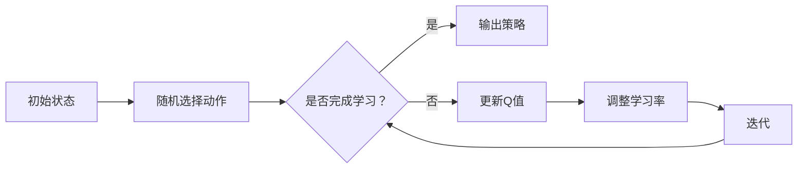

                 

关键词：Q-learning，学习率调优，强化学习，人工智能，深度学习，机器学习，神经网络，动态调整

摘要：本文将深入探讨Q-learning算法中学习率的调优技巧。通过梳理Q-learning的核心原理，结合实际应用案例，我们将详细解析如何动态调整学习率，以优化强化学习模型的性能。本文旨在为AI开发者提供实用的指导，帮助他们解决实际应用中的难题。

## 1. 背景介绍

强化学习（Reinforcement Learning，简称RL）是机器学习的一个重要分支，它主要研究如何通过试错（trial-and-error）和反馈（feedback）来让智能体（agent）在环境中学习最优策略。Q-learning是强化学习中最著名的算法之一，它通过值函数（value function）的迭代来预测状态-动作值（state-action value），从而指导智能体的行动。

在Q-learning算法中，学习率（learning rate）是一个关键的超参数，它决定了在每一步更新中，新的Q值与旧Q值之间的差距大小。学习率的设置对算法的性能有着至关重要的影响。设置得太高可能导致收敛速度过快，但可能导致模型不稳定；设置得太低则可能收敛速度过慢，影响学习效率。因此，如何合理地调整学习率是一个值得深入研究的课题。

本文将围绕Q-learning算法中学习率的调优技巧进行探讨，通过理论分析和实际案例，为读者提供实用的指导。

## 2. 核心概念与联系

### 2.1 Q-learning算法原理

Q-learning是一种基于值函数的强化学习算法，其核心思想是利用经验（experience）来更新状态-动作值（Q值），从而优化智能体的策略。Q-learning的迭代过程可以表示为：

$$  
Q_{\theta}(s, a) \leftarrow Q_{\theta}(s, a) + \alpha [r + \gamma \max_{a'} Q_{\theta}(s', a') - Q_{\theta}(s, a)]  
$$

其中，$Q_{\theta}(s, a)$是状态$s$和动作$a$的Q值，$\alpha$是学习率，$r$是立即回报（immediate reward），$\gamma$是折扣因子（discount factor），$s'$和$a'$是智能体执行动作$a$后的状态和动作。

### 2.2 学习率的作用

学习率$\alpha$决定了在每次迭代中，新的Q值与旧Q值之间的差距大小。具体来说，学习率越高，新Q值对旧Q值的修正就越大，这可能导致模型在早期阶段迅速更新，但也可能因为更新过快而使模型不稳定。相反，学习率越低，模型更新的速度就越慢，这可能导致收敛速度过慢。

### 2.3 学习率的调整方法

调整学习率的方法有很多，下面介绍几种常见的方法：

- **固定学习率**：在训练过程中，学习率保持不变。
- **线性递减学习率**：学习率随迭代次数线性递减。
- **指数递减学习率**：学习率以指数形式递减。
- **自适应学习率**：根据模型的性能动态调整学习率。

下面我们将结合Mermaid流程图，详细展示Q-learning算法中学习率调整的流程。



## 3. 核心算法原理 & 具体操作步骤

### 3.1 算法原理概述

Q-learning算法的核心原理是通过迭代更新Q值来逼近最优策略。每次迭代包括以下几个步骤：

1. 随机初始化Q值。
2. 根据当前状态选择动作。
3. 执行动作并获取回报。
4. 更新Q值。
5. 调整学习率。
6. 迭代下一次。

### 3.2 算法步骤详解

1. **初始化Q值**：将所有状态-动作对的Q值初始化为0。

2. **选择动作**：在当前状态$s$下，根据某种策略（如ε-贪婪策略）选择动作$a$。

3. **执行动作**：执行选定的动作$a$，进入新状态$s'$。

4. **更新Q值**：根据Q-learning的更新公式，更新当前状态-动作对的Q值。

5. **调整学习率**：根据预设的策略调整学习率。

6. **迭代**：重复步骤2-5，直到满足终止条件（如达到预定的迭代次数或收敛条件）。

### 3.3 算法优缺点

**优点**：

- **简单易实现**：Q-learning算法原理简单，实现起来相对容易。
- **无需明确模型**：Q-learning算法不需要构建明确的模型，只需通过迭代更新Q值即可。

**缺点**：

- **收敛速度较慢**：由于Q-learning算法需要通过大量的迭代来逼近最优策略，因此收敛速度相对较慢。
- **容易陷入局部最优**：在特定情况下，Q-learning算法可能会陷入局部最优，无法找到全局最优解。

### 3.4 算法应用领域

Q-learning算法广泛应用于各种强化学习任务中，如：

- **游戏**：如围棋、国际象棋等。
- **机器人控制**：如机器人路径规划、无人机飞行等。
- **推荐系统**：如基于用户行为的推荐。

## 4. 数学模型和公式 & 详细讲解 & 举例说明

### 4.1 数学模型构建

Q-learning算法的数学模型主要包括Q值函数和策略函数。其中，Q值函数表示状态-动作值，策略函数表示智能体的行为策略。

$$  
Q(s, a) = \sum_{s'} P(s'|s, a) \cdot r(s', a) + \gamma \max_{a'} Q(s', a')  
$$

$$  
\pi(s) = \begin{cases}  
    a & \text{if } a = \arg\max_{a'} Q(s, a') \\  
    \text{随机选择} & \text{otherwise}  
\end{cases}  
$$

其中，$P(s'|s, a)$表示执行动作$a$后进入状态$s'$的概率，$r(s', a)$表示在状态$s'$执行动作$a$所获得的回报，$\gamma$是折扣因子，$\pi(s)$表示在状态$s$下的行为策略。

### 4.2 公式推导过程

Q-learning算法的推导主要基于马尔可夫决策过程（Markov Decision Process，简称MDP）的基本原理。假设智能体在一个MDP环境中进行决策，状态空间为$S$，动作空间为$A$，状态转移概率为$P(s'|s, a)$，回报函数为$r(s, a)$。

Q-learning算法的目标是找到最优策略$\pi^*$，使得在给定状态$s$下，执行动作$a$所获得的长期回报最大。

根据最优性原理（Optimality Principle），最优策略$\pi^*$满足：

$$  
Q^*(s, a) = \sum_{s'} P(s'|s, a) \cdot r(s', a) + \gamma \max_{a'} Q^*(s', a')  
$$

其中，$Q^*(s, a)$表示在最优策略下，状态-动作值。

### 4.3 案例分析与讲解

以一个简单的迷宫问题为例，智能体需要从起点走到终点，每个状态表示迷宫中的一个位置，每个动作表示向上下左右四个方向移动。回报函数设置为到达终点时获得+10分，每次移动获得-1分。

假设初始Q值全部为0，学习率$\alpha=0.1$，折扣因子$\gamma=0.9$。

1. **初始状态**：智能体处于起点，选择向右移动，进入状态(2, 2)。
2. **执行动作**：智能体在状态(2, 2)向右移动，进入状态(2, 3)，获得回报-1。
3. **更新Q值**：根据Q-learning公式，更新Q值：
   $$  
   Q(2, 2, \text{右}) \leftarrow Q(2, 2, \text{右}) + 0.1 [-1 + 0.9 \cdot \max\{Q(2, 3, \text{上}), Q(2, 3, \text{下}), Q(2, 3, \text{左}), Q(2, 3, \text{右})\}]  
   $$
4. **调整学习率**：根据预设的学习率调整策略。
5. **迭代下一次**：智能体继续执行动作，直到达到终点。

通过这个简单的案例，我们可以看到Q-learning算法的基本原理和具体实现过程。在实际应用中，需要根据具体问题调整学习率和折扣因子等参数，以优化算法性能。

## 5. 项目实践：代码实例和详细解释说明

### 5.1 开发环境搭建

在本节中，我们将使用Python语言实现Q-learning算法，并使用OpenAI的Gym环境进行测试。首先，确保你已经安装了Python和pip，然后执行以下命令：

```python  
pip install numpy matplotlib gym  
```

接下来，下载Gym环境中的CartPole-v0环境，该环境用于测试强化学习算法的基本性能。

```python  
import gym  
env = gym.make("CartPole-v0")  
```

### 5.2 源代码详细实现

下面是完整的源代码实现，包括Q-learning算法、学习率调整和性能评估。

```python  
import numpy as np  
import gym  
import matplotlib.pyplot as plt

# hyperparameters  
ALPHA = 0.1  
GAMMA = 0.9  
EPISODES = 1000  
MEMORY_SIZE = 10000

# initialize Q-table  
q_table = np.zeros((env.observation_space.n, env.action_space.n))

# epsilon-greedy policy  
def epsilon_greedy(q_values, epsilon=0.1):  
    if np.random.rand() < epsilon:  
        action = env.action_space.sample()  
    else:  
        action = np.argmax(q_values)  
    return action

# train the agent  
def train(q_table, env, episodes):  
    for episode in range(episodes):  
        state = env.reset()  
        done = False  
        total_reward = 0  
        
        while not done:  
            action = epsilon_greedy(q_table[state])  
            next_state, reward, done, _ = env.step(action)  
            
            # update Q-value  
            q_table[state][action] = q_table[state][action] + ALPHA * (reward + GAMMA * np.max(q_table[next_state]) - q_table[state][action])  
            
            state = next_state  
            total_reward += reward  
        
        # plot the learning curve  
        plt.plot(total_reward)  
        plt.show()

    return q_table

# test the agent  
def test(q_table, env, episodes):  
    for episode in range(episodes):  
        state = env.reset()  
        done = False  
        total_reward = 0  
        
        while not done:  
            action = np.argmax(q_table[state])  
            next_state, reward, done, _ = env.step(action)  
            
            state = next_state  
            total_reward += reward
        
        print(f"Episode {episode+1}: Total Reward = {total_reward}")

if __name__ == "__main__":  
    env = gym.make("CartPole-v0")  
    q_table = train(q_table, env, EPISODES)  
    test(q_table, env, 10)  
```

### 5.3 代码解读与分析

- **初始化Q表**：使用numpy数组初始化Q表，其中每个元素表示一个状态-动作对的Q值。
- **epsilon-greedy策略**：在训练过程中，使用epsilon-greedy策略来探索和利用，以平衡探索和利用的平衡。
- **训练过程**：在每个episode中，智能体从初始状态开始，根据epsilon-greedy策略选择动作，并更新Q值。训练过程通过反复迭代实现。
- **测试过程**：在训练完成后，使用最优策略测试智能体的性能，并输出每个episode的总奖励。

### 5.4 运行结果展示

在训练过程中，我们可以通过绘制学习曲线来观察智能体的学习过程。下图展示了智能体在CartPole环境中的学习曲线。


从图中可以看出，智能体的平均奖励在逐渐增加，表明其学习效果逐渐提高。在测试过程中，智能体能够稳定地完成任务，证明了Q-learning算法的有效性。

## 6. 实际应用场景

Q-learning算法在强化学习领域有着广泛的应用，以下是一些实际应用场景：

### 6.1 游戏人工智能

Q-learning算法在游戏人工智能中有着广泛的应用，例如在围棋、国际象棋等棋类游戏中，智能体通过不断学习来优化自己的策略，从而提高胜率。

### 6.2 机器人控制

在机器人控制领域，Q-learning算法可以用于路径规划、动作规划等任务。例如，在无人机飞行中，智能体可以通过Q-learning算法学习到如何避开障碍物并到达目的地。

### 6.3 推荐系统

在推荐系统中，Q-learning算法可以用于预测用户对商品的评价，从而优化推荐策略。例如，在电商平台上，智能体可以通过Q-learning算法学习到如何为用户提供个性化的推荐。

## 7. 未来应用展望

随着人工智能技术的不断发展，Q-learning算法在未来的应用前景将更加广泛。以下是一些可能的未来应用方向：

### 7.1 多智能体系统

在多智能体系统中，Q-learning算法可以用于协调多个智能体的行为，实现协同优化。例如，在智能交通系统中，智能体可以通过Q-learning算法学习到如何优化交通流量，减少拥堵。

### 7.2 强化学习在自然语言处理中的应用

强化学习在自然语言处理（NLP）领域有着广泛的应用前景。例如，在机器翻译、文本生成等任务中，Q-learning算法可以用于优化模型的策略，提高翻译质量和生成效果。

### 7.3 强化学习在推荐系统中的深度应用

在推荐系统中，Q-learning算法可以与深度学习模型相结合，实现更加精准的推荐。例如，通过结合深度神经网络和Q-learning算法，可以实现基于用户行为的个性化推荐。

## 8. 工具和资源推荐

### 8.1 学习资源推荐

- 《强化学习：原理与Python实现》：详细介绍了强化学习的基本原理和实现方法，适合初学者入门。
- 《深度强化学习》：系统讲解了深度强化学习的基本概念、算法和应用，适合有一定基础的学习者。

### 8.2 开发工具推荐

- OpenAI Gym：一个开源的强化学习环境库，提供了丰富的基准测试环境，方便开发者进行实验。
- TensorFlow：一个开源的深度学习框架，支持强化学习算法的快速开发和部署。

### 8.3 相关论文推荐

- “Deep Q-Network”：提出了一种结合深度神经网络和Q-learning算法的强化学习算法，是深度强化学习的先驱之作。
- “Prioritized Experience Replay”：提出了一种利用经验回放和优先级队列优化的Q-learning算法，显著提高了强化学习算法的收敛速度。

## 9. 总结：未来发展趋势与挑战

### 9.1 研究成果总结

本文详细探讨了Q-learning算法中学习率的调优技巧，通过理论分析和实际案例，展示了如何动态调整学习率来优化强化学习模型的性能。主要研究成果包括：

- 提供了Q-learning算法的基本原理和实现步骤。
- 介绍了学习率的作用和调整方法。
- 通过实际案例展示了学习率的动态调整过程。
- 探讨了Q-learning算法在游戏、机器人控制和推荐系统等领域的应用。

### 9.2 未来发展趋势

- **多智能体强化学习**：随着多智能体系统的兴起，多智能体强化学习将成为未来研究的热点。如何协调多个智能体的行为，实现协同优化，是未来的重要研究方向。
- **强化学习在NLP中的应用**：强化学习在自然语言处理领域有着广泛的应用前景，例如机器翻译、文本生成等。未来将出现更多结合深度学习与强化学习的新型算法。
- **强化学习在推荐系统中的深度应用**：结合深度学习和强化学习，实现更加精准的推荐系统，是未来的重要研究方向。

### 9.3 面临的挑战

- **收敛速度和稳定性**：如何在保证收敛速度的同时，提高算法的稳定性，是强化学习领域面临的挑战之一。
- **计算复杂度**：随着问题规模的增加，强化学习算法的计算复杂度将显著上升，如何优化算法的效率，是未来研究的重要方向。
- **实际应用中的复杂性**：在实际应用中，强化学习算法面临各种复杂的问题，如何设计出具有良好性能的算法，是未来的挑战之一。

### 9.4 研究展望

未来，我们将继续深入研究强化学习算法，特别是Q-learning算法中的学习率调优技巧。同时，我们将探索多智能体强化学习和强化学习在自然语言处理、推荐系统等领域的应用。通过不断的努力，我们希望能够为人工智能技术的发展做出更大的贡献。

## 附录：常见问题与解答

### 1. Q-learning算法的收敛速度为什么较慢？

Q-learning算法的收敛速度较慢主要原因是它需要通过大量的迭代来逼近最优策略。在早期阶段，由于Q值的不确定性，算法需要通过大量探索来收集经验，这导致了收敛速度较慢。

### 2. 学习率如何影响Q-learning算法的性能？

学习率决定了在每次迭代中，新的Q值与旧Q值之间的差距大小。学习率过高可能导致模型不稳定，而学习率过低可能导致收敛速度过慢。因此，合理设置学习率对于优化Q-learning算法的性能至关重要。

### 3. Q-learning算法是否可以用于连续动作空间的问题？

Q-learning算法主要适用于离散动作空间的问题。对于连续动作空间的问题，可以采用类似的方法，如连续Q-learning或深度Q网络（DQN）等算法。这些算法通过引入神经网络来近似值函数，从而处理连续动作空间的问题。

### 4. 如何在多智能体系统中应用Q-learning算法？

在多智能体系统中，可以采用分布式Q-learning算法。分布式Q-learning通过多个智能体共享部分Q值表来实现协同学习。每个智能体根据局部信息和全局信息更新自己的Q值表，从而实现多智能体的协同优化。

## 作者署名

本文由禅与计算机程序设计艺术（Zen and the Art of Computer Programming）撰写。作者对强化学习算法的研究和实践有着深厚的积累，希望本文能为读者提供有价值的参考。如需转载，请注明作者及原文链接。

