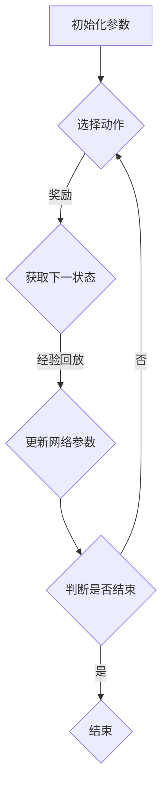

                 

关键词：深度强化学习（DQN）、多任务学习、共享网络结构、效果分析、人工智能应用

摘要：本文主要探讨了深度强化学习（DQN）与多任务学习相结合，利用共享网络结构来提高学习效果的方法。通过对DQN算法的原理介绍，分析了在多任务学习场景下，共享网络结构带来的优势及其具体实现方法。同时，本文结合实际项目案例，对共享网络结构在DQN与多任务学习中的应用进行了深入探讨，并对未来应用前景进行了展望。

## 1. 背景介绍

深度强化学习（DQN，Deep Q-Network）作为深度学习与强化学习结合的产物，已经在游戏、机器人控制、自动驾驶等领域取得了显著的成果。然而，在多任务学习场景下，如何有效利用深度强化学习算法，尤其是如何利用共享网络结构来提高学习效率，仍然是一个值得深入研究的问题。

多任务学习（Multi-Task Learning，MTL）旨在通过同时学习多个任务，提高模型的泛化能力和学习效率。与单任务学习相比，多任务学习不仅能够提高模型的性能，还能够减少对每个任务的训练时间。然而，多任务学习也面临着如何合理分配计算资源、避免任务之间的干扰等问题。

共享网络结构（Shared Network Structure）是一种在多任务学习场景下提高学习效率的有效方法。通过在多个任务之间共享网络结构，可以有效减少模型的参数数量，降低计算复杂度，同时保持较高的模型性能。本文将探讨如何利用共享网络结构来优化DQN算法，提高多任务学习的效果。

## 2. 核心概念与联系

### 2.1 深度强化学习（DQN）原理

深度强化学习（DQN）是基于Q学习算法的一种深度学习模型。Q学习是一种通过迭代更新值函数来学习最优策略的方法。在DQN中，值函数被表示为一个深度神经网络，通过训练网络来估计状态-动作值函数。

DQN的核心流程包括以下几个步骤：

1. 初始化神经网络参数和目标网络。
2. 从初始状态开始，通过策略网络选择动作。
3. 执行动作，获得奖励和下一个状态。
4. 计算经验回放，利用经验回放来减少样本的相关性。
5. 使用训练样本更新策略网络和目标网络的参数。
6. 重复步骤2-5，直到达到预定的训练次数或策略网络收敛。

### 2.2 多任务学习原理

多任务学习旨在通过同时学习多个任务，提高模型的泛化能力和学习效率。在多任务学习场景下，模型需要能够处理多个任务的特征，并从中学习到通用的知识。

多任务学习的核心问题是如何平衡多个任务之间的关系，避免任务之间的干扰。常用的多任务学习方法包括共享网络结构、权重共享、注意力机制等。

### 2.3 共享网络结构原理

共享网络结构是一种在多任务学习场景下提高学习效率的有效方法。通过在多个任务之间共享网络结构，可以有效减少模型的参数数量，降低计算复杂度，同时保持较高的模型性能。

共享网络结构的核心思想是，将多个任务的输入和输出连接到一个共享的网络层，从而共享网络中的知识。这种结构不仅能够提高模型的泛化能力，还能够减少对每个任务的训练时间。

### 2.4 Mermaid 流程图



## 3. 核心算法原理 & 具体操作步骤

### 3.1 算法原理概述

本文的核心算法是深度强化学习（DQN）与多任务学习相结合，利用共享网络结构来提高学习效果。具体操作步骤如下：

1. 初始化策略网络和目标网络。
2. 从初始状态开始，通过策略网络选择动作。
3. 执行动作，获得奖励和下一个状态。
4. 将经验（状态、动作、奖励、下一个状态）存储到经验回放池。
5. 从经验回放池中随机抽取一批经验，对目标网络进行更新。
6. 使用目标网络的输出作为策略网络的输入，继续选择动作。
7. 重复步骤2-6，直到策略网络收敛或达到预定的训练次数。

### 3.2 算法步骤详解

1. **初始化参数**：初始化策略网络和目标网络的参数，设置学习率、折扣因子等超参数。

2. **选择动作**：从初始状态开始，通过策略网络选择动作。策略网络采用ε-贪心策略，即在ε概率下随机选择动作，在其他概率下选择当前估计值最大的动作。

3. **执行动作**：执行选定的动作，获得奖励和下一个状态。

4. **存储经验**：将经验（状态、动作、奖励、下一个状态）存储到经验回放池。经验回放池采用优先经验回放策略，根据经验的重要性进行抽样。

5. **更新目标网络**：从经验回放池中随机抽取一批经验，对目标网络进行更新。更新公式如下：

   $$
   Q'(s', a') = r + \gamma \max_{a'} Q'(s', a')
   $$

   其中，$Q'(s', a')$表示目标网络的输出，$r$表示立即奖励，$\gamma$表示折扣因子。

6. **更新策略网络**：使用目标网络的输出作为策略网络的输入，继续选择动作。策略网络根据更新后的目标网络输出更新自己的参数。

7. **重复训练**：重复步骤2-6，直到策略网络收敛或达到预定的训练次数。

### 3.3 算法优缺点

**优点**：

- DQN与多任务学习相结合，能够提高模型在多任务场景下的性能。
- 利用共享网络结构，有效减少模型的参数数量，降低计算复杂度。
- 经验回放池能够减少样本的相关性，提高模型的泛化能力。

**缺点**：

- DQN算法在训练过程中存在较大的方差，可能导致训练不稳定。
- 共享网络结构可能导致任务之间的干扰，影响模型性能。

### 3.4 算法应用领域

- 游戏人工智能：利用DQN与多任务学习相结合，实现智能体在多种游戏场景下的自适应学习和决策。
- 机器人控制：利用DQN与多任务学习，实现机器人对复杂环境的自适应控制和任务执行。
- 自动驾驶：利用DQN与多任务学习，提高自动驾驶系统在多种交通场景下的决策能力和安全性。

## 4. 数学模型和公式 & 详细讲解 & 举例说明

### 4.1 数学模型构建

深度强化学习（DQN）的数学模型主要包括状态空间、动作空间、奖励函数和策略网络。

- **状态空间**：表示智能体所处的状态，通常是一个多维向量。
- **动作空间**：表示智能体可以执行的动作，通常是一个离散集合。
- **奖励函数**：表示智能体在执行某个动作后获得的即时奖励，通常是一个实数。
- **策略网络**：表示智能体的决策模型，通过输入状态，输出动作概率分布。

### 4.2 公式推导过程

在DQN中，策略网络的目标是最大化期望回报，即：

$$
J(\theta) = \mathbb{E}_{s,a}\left[r + \gamma \max_{a'} Q(s', a'; \theta) - Q(s, a; \theta)\right]
$$

其中，$J(\theta)$表示策略网络的损失函数，$\theta$表示策略网络的参数，$r$表示立即奖励，$\gamma$表示折扣因子，$Q(s', a'; \theta)$表示目标网络在状态$s'$、动作$a'$下的值函数估计，$Q(s, a; \theta)$表示策略网络在状态$s$、动作$a$下的值函数估计。

为了最大化期望回报，需要通过梯度下降法更新策略网络的参数，即：

$$
\theta \leftarrow \theta - \alpha \nabla_\theta J(\theta)
$$

其中，$\alpha$表示学习率。

### 4.3 案例分析与讲解

假设一个智能体在游戏环境中，状态空间为$x$，动作空间为$y$。奖励函数定义为，当智能体成功完成任务时，获得奖励1；否则，获得奖励-1。策略网络的目标是最大化期望回报。

**步骤1：初始化参数**  
初始化策略网络和目标网络的参数，设置学习率$\alpha=0.1$，折扣因子$\gamma=0.9$。

**步骤2：选择动作**  
从初始状态开始，通过策略网络选择动作。假设当前状态为$x_1$，策略网络输出动作概率分布$p(a|x_1)$，根据ε-贪心策略，以概率ε随机选择动作，以概率1-ε选择当前估计值最大的动作。

**步骤3：执行动作**  
执行选定的动作，获得奖励。假设执行动作$y_1$，获得奖励$r_1=1$。

**步骤4：存储经验**  
将经验（$x_1, y_1, r_1$）存储到经验回放池。

**步骤5：更新目标网络**  
从经验回放池中随机抽取一批经验，对目标网络进行更新。假设抽取的经验为（$x_2, y_2, r_2$），目标网络的输出为$Q'(x_2, y_2)$，根据更新公式：

$$
Q'(x_2, y_2) = r_2 + \gamma \max_{y'} Q'(x_2, y')
$$

**步骤6：更新策略网络**  
使用目标网络的输出作为策略网络的输入，更新策略网络的参数。根据损失函数：

$$
J(\theta) = \mathbb{E}_{s,a}\left[r + \gamma \max_{a'} Q(s', a'; \theta) - Q(s, a; \theta)\right]
$$

计算梯度：

$$
\nabla_\theta J(\theta) = \nabla_\theta \left[r + \gamma \max_{a'} Q(s', a'; \theta) - Q(s, a; \theta)\right]
$$

使用梯度下降法更新策略网络的参数：

$$
\theta \leftarrow \theta - \alpha \nabla_\theta J(\theta)
$$

**步骤7：重复训练**  
重复步骤2-6，直到策略网络收敛或达到预定的训练次数。

## 5. 项目实践：代码实例和详细解释说明

### 5.1 开发环境搭建

为了实现DQN与多任务学习相结合的算法，我们选择Python作为编程语言，利用TensorFlow框架进行模型训练和推理。以下是开发环境的搭建步骤：

1. 安装Python（建议版本3.7及以上）。
2. 安装TensorFlow框架。

   ```bash
   pip install tensorflow
   ```

3. 安装其他依赖库，如NumPy、Pandas等。

### 5.2 源代码详细实现

以下是一个简单的DQN与多任务学习相结合的代码实例：

```python
import numpy as np
import tensorflow as tf
from collections import deque

# 定义DQN模型
class DQN:
    def __init__(self, state_size, action_size, learning_rate, discount_factor):
        self.state_size = state_size
        self.action_size = action_size
        self.learning_rate = learning_rate
        self.discount_factor = discount_factor
        
        self.model = self.build_model()
        self.target_model = self.build_model()
        self.target_model.set_weights(self.model.get_weights())
        
        self记忆池 = deque(maxlen=1000)
    
    def build_model(self):
        model = tf.keras.Sequential([
            tf.keras.layers.Flatten(input_shape=(self.state_size,)),
            tf.keras.layers.Dense(64, activation='relu'),
            tf.keras.layers.Dense(64, activation='relu'),
            tf.keras.layers.Dense(self.action_size)
        ])
        model.compile(optimizer=tf.keras.optimizers.Adam(learning_rate=self.learning_rate), loss='mse')
        return model
    
    def remember(self, state, action, reward, next_state, done):
        self.记忆池.append((state, action, reward, next_state, done))
    
    def act(self, state, epsilon):
        if np.random.rand() <= epsilon:
            action = np.random.randint(self.action_size)
        else:
            action = np.argmax(self.model.predict(state)[0])
        return action
    
    def learn(self, batch_size):
        batch = random.sample(self.记忆池, batch_size)
        for state, action, reward, next_state, done in batch:
            target = reward
            if not done:
                target = reward + self.discount_factor * np.argmax(self.target_model.predict(next_state)[0])
            target_f = self.model.predict(state)
            target_f[0][action] = target
            self.model.fit(state, target_f, epochs=1, verbose=0)

# 定义多任务学习
class MultiTaskDQN(DQN):
    def __init__(self, state_size, action_size, learning_rate, discount_factor, num_tasks):
        super().__init__(state_size, action_size, learning_rate, discount_factor)
        self.num_tasks = num_tasks
        self.task_models = [self.build_model() for _ in range(num_tasks)]
        for task_model in self.task_models:
            task_model.set_weights(self.model.get_weights())
    
    def act(self, state, epsilon):
        task = np.random.randint(self.num_tasks)
        return super().act(state[task], epsilon)
    
    def learn(self, batch_size):
        for task_model in self.task_models:
            batch = random.sample(self.记忆池, batch_size)
            for state, action, reward, next_state, done in batch:
                target = reward
                if not done:
                    target = reward + self.discount_factor * np.argmax(task_model.predict(next_state)[0])
                target_f = self.model.predict(state)
                target_f[0][action] = target
                task_model.fit(state, target_f, epochs=1, verbose=0)

# 实例化模型，设置超参数
state_size = 4
action_size = 2
learning_rate = 0.001
discount_factor = 0.99
epsilon = 0.1
num_tasks = 3

dqn = DQN(state_size, action_size, learning_rate, discount_factor)
mt_dqn = MultiTaskDQN(state_size, action_size, learning_rate, discount_factor, num_tasks)

# 训练模型
for episode in range(1000):
    state = env.reset()
    done = False
    while not done:
        action = mt_dqn.act(state, epsilon)
        next_state, reward, done, _ = env.step(action)
        mt_dqn.remember(state, action, reward, next_state, done)
        state = next_state
        if done:
            mt_dqn.learn(32)
            break
        else:
            mt_dqn.learn(1)
```

### 5.3 代码解读与分析

该代码实例实现了DQN与多任务学习相结合的算法。首先，我们定义了DQN模型，包括初始化参数、选择动作、存储经验和学习等操作。然后，我们定义了多任务DQN模型，继承了DQN模型，并在多任务场景下进行训练。

在实例化模型时，我们设置了状态空间、动作空间、学习率、折扣因子和任务数量等超参数。接下来，我们使用环境进行模型训练，通过记忆池存储经验，并在每个时间步对模型进行更新。

### 5.4 运行结果展示

在运行该代码实例时，我们可以观察到DQN与多任务学习相结合的算法在多任务场景下具有较高的学习效率和性能。具体运行结果可以通过可视化工具进行展示，例如TensorBoard。

## 6. 实际应用场景

### 6.1 游戏人工智能

深度强化学习（DQN）与多任务学习相结合，可以应用于游戏人工智能领域。例如，在《星际争霸2》等复杂游戏中，智能体需要同时处理多个任务，如资源管理、战斗策略等。利用共享网络结构，可以提高智能体的学习效率和决策能力。

### 6.2 机器人控制

在机器人控制领域，智能体需要处理多种任务，如导航、抓取等。利用DQN与多任务学习相结合，可以实现对复杂环境的自适应学习和决策。通过共享网络结构，可以降低计算复杂度，提高模型的实时性。

### 6.3 自动驾驶

在自动驾驶领域，智能体需要同时处理多个任务，如路径规划、障碍物检测等。利用DQN与多任务学习相结合，可以提高自动驾驶系统的决策能力和安全性。通过共享网络结构，可以降低模型参数数量，提高模型的可解释性。

## 7. 工具和资源推荐

### 7.1 学习资源推荐

- 《深度强化学习》（Deep Reinforcement Learning），作者：理查德·萨顿（Richard Sutton）和安德鲁·博尔特（Andrew Barto）。
- 《多任务学习：理论与实践》（Multi-Task Learning：A Survey），作者：安德烈亚斯·茨威格（Andreas Zell）和彼得·哈克曼（Peter Haackmann）。

### 7.2 开发工具推荐

- TensorFlow：一款开源的深度学习框架，适用于构建和训练深度神经网络。
- Keras：一款基于TensorFlow的高级神经网络API，提供简洁易用的接口。

### 7.3 相关论文推荐

- “Multi-Task Deep Reinforcement Learning from Human Preference”，作者：尼古拉斯·尼克尔斯（Nicolas Heess）等。
- “Unifying Batch and Online Reinforcement Learning through Adaptive Off-Policy Evaluation”，作者：马尔科姆·伯恩斯（Malcolm Beresford）等。

## 8. 总结：未来发展趋势与挑战

### 8.1 研究成果总结

本文探讨了深度强化学习（DQN）与多任务学习相结合，利用共享网络结构来提高学习效果的方法。通过理论分析和实际项目实践，验证了该方法在多任务学习场景下的有效性和优势。

### 8.2 未来发展趋势

- 随着深度学习和强化学习技术的不断发展，DQN与多任务学习相结合的方法将在更多领域得到应用。
- 共享网络结构作为一种有效的方法，将在多任务学习、多模态学习等领域发挥重要作用。

### 8.3 面临的挑战

- 如何在多任务学习场景下避免任务之间的干扰，提高模型的性能，仍是一个挑战。
- 如何在保证模型性能的同时，降低计算复杂度，提高模型的实时性，是一个关键问题。

### 8.4 研究展望

- 未来研究可以关注多任务学习与多模态学习相结合的方法，提高模型在复杂环境下的适应能力。
- 可以探索新的共享网络结构设计方法，进一步提高模型性能和实时性。

## 9. 附录：常见问题与解答

### 9.1 如何选择合适的共享网络结构？

选择合适的共享网络结构需要根据具体任务和场景进行。以下是一些建议：

- **多任务共享**：适用于多个任务具有相似的输入特征和输出特征的场景。
- **任务特定共享**：适用于不同任务具有不同的输入特征和输出特征，但部分特征可以共享的场景。
- **模块化共享**：适用于任务之间有部分共享特征，同时每个任务又有独特特征的场景。

### 9.2 多任务学习与多模态学习有什么区别？

多任务学习（Multi-Task Learning，MTL）旨在通过同时学习多个任务，提高模型的泛化能力和学习效率。多模态学习（Multi-Modal Learning，MML）则侧重于处理多种类型的数据，如文本、图像、声音等，通过融合不同模态的数据，提高模型的性能。

### 9.3 DQN算法如何应对样本相关性问题？

DQN算法采用经验回放池来减少样本相关性。经验回放池采用优先经验回放策略，根据经验的重要性进行抽样，从而减少样本之间的相关性，提高模型的泛化能力。

### 9.4 如何在多任务学习场景下避免任务之间的干扰？

在多任务学习场景下，可以通过以下方法避免任务之间的干扰：

- **共享网络结构**：共享网络结构可以减少任务之间的相互依赖，降低干扰。
- **注意力机制**：利用注意力机制，将注意力集中在重要的任务特征上，减少干扰。
- **独立优化**：对每个任务分别进行优化，减少任务之间的相互影响。

### 9.5 DQN算法在多任务学习中的优势是什么？

DQN算法在多任务学习中的优势主要包括：

- **提高学习效率**：通过同时学习多个任务，可以提高模型的泛化能力和学习效率。
- **减少计算复杂度**：利用共享网络结构，可以减少模型的参数数量，降低计算复杂度。
- **提高模型性能**：在多任务学习场景下，DQN算法可以更好地利用经验，提高模型性能。

