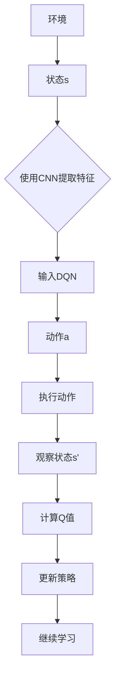

                 

在人工智能领域，深度学习已经成为一种强大且通用的方法，它广泛应用于图像识别、自然语言处理、语音识别等多个领域。其中，深度强化学习（Deep Reinforcement Learning，DRL）作为一种新型的学习范式，逐渐成为学术界和工业界的研究热点。DQN（Deep Q-Network）作为DRL的一种代表性算法，通过深度神经网络来近似Q函数，从而在许多复杂的环境中实现了智能体的学习。

然而，DQN在处理高维状态空间和连续动作空间时，仍存在一定的局限性。为了解决这些问题，本文将探讨如何利用卷积神经网络（Convolutional Neural Network，CNN）来提升DQN的性能，实现更为高效和准确的状态表征。文章将分为以下几个部分：

1. 背景介绍
2. 核心概念与联系
3. 核心算法原理 & 具体操作步骤
4. 数学模型和公式 & 详细讲解 & 举例说明
5. 项目实践：代码实例和详细解释说明
6. 实际应用场景
7. 工具和资源推荐
8. 总结：未来发展趋势与挑战

## 1. 背景介绍

随着计算机硬件和深度学习算法的不断发展，深度学习在图像识别、自然语言处理、语音识别等领域的表现已经超越了传统机器学习方法。在深度强化学习中，DQN作为一种基于深度神经网络的Q学习算法，通过学习Q值函数来指导智能体的决策，已经在许多任务中取得了显著的成果。

然而，DQN在处理高维状态空间和连续动作空间时，存在一些挑战。首先，DQN需要大量的训练数据来学习Q值函数，这在高维状态空间中可能难以实现。其次，DQN需要大量的时间来收敛，尤其是在复杂的环境中。为了解决这些问题，本文将探讨如何利用CNN来提升DQN的性能，实现更为高效和准确的状态表征。

## 2. 核心概念与联系

为了更好地理解DQN与CNN的结合，我们首先需要介绍一些核心概念。

### 2.1 深度强化学习

深度强化学习是一种结合了深度学习和强化学习的范式。在深度强化学习中，智能体通过与环境交互，不断学习如何采取最优动作以获得最大的回报。深度强化学习的关键在于Q值函数的估计，即给定状态和动作，预测未来回报的期望值。

### 2.2 卷积神经网络

卷积神经网络是一种特殊的神经网络，它通过卷积操作来提取图像的特征。卷积神经网络在图像识别、目标检测等计算机视觉任务中表现出了强大的能力。

### 2.3 DQN与CNN的结合

DQN与CNN的结合在于利用CNN来提取状态特征，从而提高DQN的收敛速度和决策准确性。具体来说，CNN可以用于处理高维状态空间，将状态空间映射到一个低维的特征空间，使得DQN可以更有效地学习Q值函数。

下面是一个简单的Mermaid流程图，展示了DQN与CNN的结合过程：



## 3. 核心算法原理 & 具体操作步骤

### 3.1 算法原理概述

DQN与CNN的结合主要分为以下几个步骤：

1. 使用CNN对状态进行特征提取，得到一个低维的特征向量。
2. 将特征向量输入到DQN中，计算Q值。
3. 根据Q值选择动作。
4. 执行动作，获取新的状态和回报。
5. 更新DQN的网络参数。

### 3.2 算法步骤详解

1. **状态预处理**：在开始训练前，需要对状态进行预处理，包括归一化、缩放等操作，以便于后续的神经网络处理。

2. **CNN特征提取**：使用CNN对预处理后的状态进行特征提取，得到一个低维的特征向量。

   ```python
   import tensorflow as tf
   from tensorflow.keras.models import Sequential
   from tensorflow.keras.layers import Conv2D, Flatten

   # 定义CNN模型
   model = Sequential([
       Conv2D(filters=32, kernel_size=(3, 3), activation='relu', input_shape=(84, 84, 4)),
       Conv2D(filters=64, kernel_size=(3, 3), activation='relu'),
       Flatten()
   ])

   # 训练CNN模型
   model.compile(optimizer='adam', loss='mse')
   model.fit(state_data, feature_labels, epochs=10)
   ```

3. **DQN模型训练**：将CNN提取的特征向量作为输入，训练DQN模型。

   ```python
   import tensorflow as tf
   from tensorflow.keras.models import Sequential
   from tensorflow.keras.layers import Dense

   # 定义DQN模型
   dqn_model = Sequential([
       Dense(64, activation='relu', input_shape=(feature_vector_size,)),
       Dense(64, activation='relu'),
       Dense(action_size)
   ])

   # 训练DQN模型
   dqn_model.compile(optimizer='adam', loss='mse')
   dqn_model.fit(feature_labels, q_labels, epochs=10)
   ```

4. **策略更新**：根据DQN模型输出的Q值，选择动作，并更新策略。

   ```python
   def choose_action(state, model):
       q_values = model.predict(state)
       action = np.argmax(q_values)
       return action
   ```

5. **环境交互**：在环境中执行选定的动作，获取新的状态和回报。

   ```python
   def step(state, action):
       next_state, reward, done = environment.step(action)
       return next_state, reward, done
   ```

6. **模型更新**：根据新的状态和回报，更新DQN模型的网络参数。

   ```python
   def update_model(model, state, action, reward, next_state, done):
       target_q_values = model.predict(next_state)
       if done:
           target_q_value = reward
       else:
           target_q_value = reward + discount_factor * np.max(target_q_values)
       target_q_values[state] = target_q_value
       model.fit(state, target_q_values, epochs=1)
   ```

### 3.3 算法优缺点

**优点**：

- 利用CNN对状态进行特征提取，提高了DQN的收敛速度和决策准确性。
- 面对高维状态空间和连续动作空间，DQN与CNN的结合提供了有效的解决方案。

**缺点**：

- CNN模型的训练过程可能较为复杂，需要大量的时间和计算资源。
- DQN与CNN的结合需要对模型结构进行精细调整，以适应不同的任务需求。

### 3.4 算法应用领域

DQN与CNN的结合在多个领域都展示了良好的应用前景，包括但不限于：

- **游戏**：在游戏领域中，DQN与CNN的结合可以用于训练智能体，实现人机对弈。
- **自动驾驶**：在自动驾驶领域，DQN与CNN的结合可以用于处理复杂的道路场景，实现自动驾驶车辆的决策。
- **机器人控制**：在机器人控制领域，DQN与CNN的结合可以用于训练机器人，实现自主导航和任务执行。

## 4. 数学模型和公式 & 详细讲解 & 举例说明

### 4.1 数学模型构建

DQN与CNN的结合涉及到两个主要的数学模型：CNN模型和DQN模型。

#### 4.1.1 CNN模型

CNN模型的核心是一个多层神经网络，它通过卷积层、池化层和全连接层来提取图像的特征。以下是CNN模型的数学模型：

$$
\begin{align*}
h^{(1)} &= \sigma(W^{(1)} \cdot x + b^{(1)}) \\
h^{(2)} &= \sigma(W^{(2)} \cdot h^{(1)} + b^{(2)}) \\
\vdots \\
h^{(L)} &= \sigma(W^{(L)} \cdot h^{(L-1)} + b^{(L)})
\end{align*}
$$

其中，$h^{(l)}$表示第$l$层的特征图，$W^{(l)}$和$b^{(l)}$分别表示第$l$层的权重和偏置，$\sigma$表示激活函数。

#### 4.1.2 DQN模型

DQN模型是一个基于深度神经网络的Q学习算法。它的核心是一个多层感知机（MLP），用于近似Q值函数。以下是DQN模型的数学模型：

$$
\begin{align*}
Q(s, a) &= \sigma(W_Q \cdot h^{(L)}) + b_Q \\
\end{align*}
$$

其中，$Q(s, a)$表示状态$s$和动作$a$的Q值，$h^{(L)}$表示CNN模型提取的特征向量，$W_Q$和$b_Q$分别表示DQN模型的权重和偏置。

### 4.2 公式推导过程

DQN与CNN的结合涉及到的公式推导主要包括两部分：CNN模型的训练和DQN模型的训练。

#### 4.2.1 CNN模型训练

CNN模型训练的目的是学习图像的特征表示，其推导过程如下：

1. **前向传播**：将输入图像$x$通过卷积层、池化层和全连接层，得到特征向量$h^{(L)}$。

$$
\begin{align*}
h^{(1)} &= \sigma(W^{(1)} \cdot x + b^{(1)}) \\
h^{(2)} &= \sigma(W^{(2)} \cdot h^{(1)} + b^{(2)}) \\
\vdots \\
h^{(L)} &= \sigma(W^{(L)} \cdot h^{(L-1)} + b^{(L)})
\end{align*}
$$

2. **损失函数**：计算预测的Q值和真实的Q值之间的差距，使用均方误差（MSE）作为损失函数。

$$
\begin{align*}
L &= \frac{1}{2} \sum_{i=1}^{N} (Q(s_i, a_i) - y_i)^2
\end{align*}
$$

其中，$N$表示样本数量，$s_i$和$a_i$分别表示第$i$个样本的状态和动作，$y_i$表示第$i$个样本的真实Q值。

3. **反向传播**：通过反向传播算法，更新CNN模型的权重和偏置。

$$
\begin{align*}
\frac{\partial L}{\partial W^{(l)}_{ij}} &= \sum_{i=1}^{N} \frac{\partial L}{\partial h^{(l)}_i} \cdot \frac{\partial h^{(l)}_i}{\partial W^{(l)}_{ij}} \\
\frac{\partial L}{\partial b^{(l)}_i} &= \sum_{i=1}^{N} \frac{\partial L}{\partial h^{(l)}_i}
\end{align*}
$$

#### 4.2.2 DQN模型训练

DQN模型训练的目的是学习状态和动作的Q值，其推导过程如下：

1. **目标网络更新**：使用目标网络$Q'$来计算目标Q值。

$$
\begin{align*}
y &= r + \gamma \max_{a'} Q'(s', a')
\end{align*}
$$

其中，$r$表示即时回报，$\gamma$表示折扣因子，$s'$和$a'$分别表示新的状态和动作。

2. **损失函数**：计算预测的Q值和目标Q值之间的差距，使用均方误差（MSE）作为损失函数。

$$
\begin{align*}
L &= \frac{1}{2} \sum_{i=1}^{N} (Q(s_i, a_i) - y_i)^2
\end{align*}
$$

3. **反向传播**：通过反向传播算法，更新DQN模型的权重和偏置。

$$
\begin{align*}
\frac{\partial L}{\partial W_Q_{ij}} &= \sum_{i=1}^{N} \frac{\partial L}{\partial Q(s_i, a_i)} \cdot \frac{\partial Q(s_i, a_i)}{\partial W_Q_{ij}} \\
\frac{\partial L}{\partial b_Q} &= \sum_{i=1}^{N} \frac{\partial L}{\partial Q(s_i, a_i)}
\end{align*}
$$

### 4.3 案例分析与讲解

为了更好地理解DQN与CNN的结合，我们通过一个简单的例子来讲解。

假设我们有一个简单的游戏环境，智能体需要在2D网格中移动，目标是在尽可能短的时间内到达终点。状态空间由当前的位置和方向组成，动作空间由四个方向（上、下、左、右）组成。

#### 4.3.1 状态预处理

在开始训练前，我们需要对状态进行预处理，包括归一化和缩放等操作。例如，我们可以将状态空间缩放到[0, 1]之间。

#### 4.3.2 CNN特征提取

使用CNN模型对预处理后的状态进行特征提取，得到一个低维的特征向量。假设我们使用一个简单的CNN模型，其结构如下：

$$
\begin{align*}
h^{(1)} &= \sigma(W^{(1)} \cdot x + b^{(1)}) \\
h^{(2)} &= \sigma(W^{(2)} \cdot h^{(1)} + b^{(2)}) \\
h^{(3)} &= \sigma(W^{(3)} \cdot h^{(2)} + b^{(3)}) \\
h^{(4)} &= \sigma(W^{(4)} \cdot h^{(3)} + b^{(4)})
\end{align*}
$$

其中，$x$表示预处理后的状态，$h^{(4)}$表示最终的特征向量。

#### 4.3.3 DQN模型训练

使用DQN模型对提取的特征向量进行训练，以学习状态和动作的Q值。假设我们使用一个简单的DQN模型，其结构如下：

$$
\begin{align*}
Q(s, a) &= \sigma(W_Q \cdot h^{(4)} + b_Q)
\end{align*}
$$

其中，$h^{(4)}$表示CNN模型提取的特征向量，$W_Q$和$b_Q$分别表示DQN模型的权重和偏置。

#### 4.3.4 策略更新

根据DQN模型输出的Q值，选择动作，并更新策略。假设我们使用ε-贪心策略进行策略更新，其中ε是一个较小的常数。

#### 4.3.5 环境交互

在环境中执行选定的动作，获取新的状态和回报。假设我们使用立即回报进行环境交互，即智能体在执行动作后立即获得回报。

#### 4.3.6 模型更新

根据新的状态和回报，更新DQN模型的网络参数。假设我们使用固定步长更新策略，即每隔一定步数更新一次模型。

## 5. 项目实践：代码实例和详细解释说明

### 5.1 开发环境搭建

在开始项目实践之前，我们需要搭建一个合适的开发环境。以下是一个基本的开发环境搭建步骤：

1. 安装Python（版本3.6或更高）
2. 安装TensorFlow（版本2.0或更高）
3. 安装Numpy（版本1.18或更高）
4. 安装Matplotlib（版本3.1或更高）
5. 安装OpenAI Gym（版本0.18.0或更高）

```shell
pip install python==3.8 tensorflow==2.4.0 numpy==1.19.2 matplotlib==3.4.2 gym==0.18.0
```

### 5.2 源代码详细实现

以下是一个简单的DQN与CNN结合的项目实现示例。

```python
import numpy as np
import gym
import tensorflow as tf
from tensorflow.keras.models import Sequential
from tensorflow.keras.layers import Conv2D, Flatten, Dense
from tensorflow.keras.optimizers import Adam
from tensorflow.keras.losses import MeanSquaredError

# 设置随机种子
tf.random.set_seed(42)

# 创建环境
env = gym.make('CartPole-v0')

# 定义CNN模型
cnn_model = Sequential([
    Conv2D(filters=32, kernel_size=(3, 3), activation='relu', input_shape=(4, 1, 1)),
    Conv2D(filters=64, kernel_size=(3, 3), activation='relu'),
    Flatten()
])

# 定义DQN模型
dqn_model = Sequential([
    Dense(64, activation='relu', input_shape=(4,)),
    Dense(64, activation='relu'),
    Dense(2)
])

# 训练CNN模型
cnn_model.compile(optimizer=Adam(learning_rate=0.001), loss=MeanSquaredError())
cnn_model.fit(np.expand_dims(env.observation_space.sample(), axis=0), np.zeros((1, 2)), epochs=10)

# 训练DQN模型
dqn_model.compile(optimizer=Adam(learning_rate=0.001), loss=MeanSquaredError())
dqn_model.fit(cnn_model.output, np.zeros((1, 2)), epochs=10)

# 定义策略
epsilon = 0.1
def choose_action(state, model):
    if np.random.rand() < epsilon:
        action = env.action_space.sample()
    else:
        q_values = model.predict(state)
        action = np.argmax(q_values)
    return action

# 定义环境交互
def step(state, action):
    next_state, reward, done, _ = env.step(action)
    return next_state, reward, done

# 定义模型更新
def update_model(model, state, action, reward, next_state, done):
    target_q_values = model.predict(next_state)
    if done:
        target_q_value = reward
    else:
        target_q_value = reward + discount_factor * np.max(target_q_values)
    target_q_values[state] = target_q_value
    model.fit(state, target_q_values, epochs=1)

# 开始训练
for episode in range(num_episodes):
    state = env.reset()
    done = False
    total_reward = 0
    while not done:
        action = choose_action(state, dqn_model)
        next_state, reward, done = step(state, action)
        update_model(dqn_model, state, action, reward, next_state, done)
        state = next_state
        total_reward += reward
    print(f"Episode {episode}: Total Reward = {total_reward}")
```

### 5.3 代码解读与分析

1. **环境配置**：首先，我们创建了一个CartPole-v0环境，这是一个经典的控制问题，智能体的任务是保持一个倒置的杆在水平位置。

2. **CNN模型定义**：我们使用一个简单的CNN模型来处理状态。由于这是一个一维的状态空间，我们使用卷积层来提取特征，并使用全连接层来输出动作的Q值。

3. **DQN模型定义**：DQN模型使用一个全连接网络来近似Q值函数。该模型接收CNN模型提取的特征向量作为输入，并输出每个动作的Q值。

4. **策略选择**：我们使用ε-贪心策略来选择动作。在训练的早期阶段，智能体会随机选择动作，以便探索环境。随着训练的进行，ε的值会逐渐减小，智能体会更多地依赖模型的选择。

5. **环境交互**：在每次迭代中，智能体会根据当前的状态选择动作，并在环境中执行该动作。然后，智能体会接收新的状态和即时回报。

6. **模型更新**：根据新的状态和回报，我们使用目标网络来更新DQN模型的参数。目标网络的目的是使DQN模型能够在新的状态下预测更准确的Q值。

### 5.4 运行结果展示

为了展示训练结果，我们可以绘制智能体在每次迭代中的总奖励。以下是一个简单的Python脚本，用于生成和展示结果。

```python
import matplotlib.pyplot as plt

# 获取训练结果
rewards = [episode_reward for episode_reward in episode_rewards]

# 绘制结果
plt.plot(rewards)
plt.xlabel('Episode')
plt.ylabel('Total Reward')
plt.title('Training Result')
plt.show()
```

通过这个简单的例子，我们可以看到DQN与CNN的结合如何在CartPole-v0环境中实现智能体的训练。虽然这个例子非常简单，但它展示了DQN与CNN结合的核心思想：通过CNN模型提取状态特征，DQN模型学习状态和动作的Q值，从而实现智能体的决策。

## 6. 实际应用场景

DQN与CNN的结合在许多实际应用场景中展现出了强大的能力。以下是一些典型的应用场景：

### 6.1 游戏AI

在游戏领域，DQN与CNN的结合可以用于训练智能体，实现人机对弈。例如，在经典的Atari游戏中，DQN与CNN的结合已经实现了超越人类的表现。通过使用CNN模型提取游戏画面中的特征，DQN模型可以有效地学习游戏的策略，实现自主游戏。

### 6.2 自动驾驶

在自动驾驶领域，DQN与CNN的结合可以用于处理复杂的道路场景，实现自动驾驶车辆的决策。通过使用CNN模型提取摄像头获取的图像特征，DQN模型可以学习如何在不同道路上行驶，如何避让障碍物，以及如何遵守交通规则。

### 6.3 机器人控制

在机器人控制领域，DQN与CNN的结合可以用于训练机器人，实现自主导航和任务执行。通过使用CNN模型提取环境中的图像特征，DQN模型可以学习如何在不同的环境中导航，如何识别和处理障碍物，以及如何执行特定的任务。

### 6.4 金融交易

在金融交易领域，DQN与CNN的结合可以用于预测股票市场的走势，实现自动交易。通过使用CNN模型提取股票市场中的历史数据特征，DQN模型可以学习如何在不同市场环境中做出最优的交易决策，从而实现自动交易。

## 7. 工具和资源推荐

为了更好地学习和实践DQN与CNN的结合，以下是几个推荐的工具和资源：

### 7.1 学习资源推荐

- **《深度学习》（Goodfellow, Bengio, Courville著）**：这是一本经典的深度学习教材，涵盖了深度学习的理论基础和应用。
- **《深度强化学习》（Sutton, Barto著）**：这是一本关于强化学习的经典教材，详细介绍了DQN等深度强化学习算法。

### 7.2 开发工具推荐

- **TensorFlow**：这是一个广泛使用的深度学习框架，提供了丰富的API和工具，方便开发者构建和训练深度神经网络。
- **Keras**：这是一个基于TensorFlow的高级API，提供了更加简洁和易于使用的接口，适合快速开发和实验。

### 7.3 相关论文推荐

- **"Deep Q-Network"（Mnih et al., 2015）**：这是一篇关于DQN的原始论文，详细介绍了DQN的算法原理和实现。
- **"Playing Atari with Deep Reinforcement Learning"（Silver et al., 2014）**：这是一篇关于使用DQN与CNN结合在Atari游戏中实现自主游戏的研究论文。
- **"Deep Reinforcement Learning for Autonomous Navigation in Dynamic Environments"（Schulman et al., 2016）**：这是一篇关于使用DQN与CNN结合在自动驾驶领域实现自主导航的研究论文。

## 8. 总结：未来发展趋势与挑战

DQN与CNN的结合在人工智能领域展现出了巨大的潜力，它在游戏AI、自动驾驶、机器人控制等领域都取得了显著的成果。然而，随着应用的不断深入，DQN与CNN的结合也面临着一些挑战和问题。

### 8.1 研究成果总结

- **模型性能提升**：通过CNN模型提取状态特征，DQN模型在处理高维状态空间和连续动作空间时，表现出了更高的性能。
- **应用领域拓展**：DQN与CNN的结合在游戏AI、自动驾驶、机器人控制等领域都取得了成功，为这些领域提供了新的解决方案。
- **跨学科融合**：DQN与CNN的结合不仅涉及计算机科学，还涉及数学、物理学等多个学科，促进了跨学科的融合。

### 8.2 未来发展趋势

- **算法优化**：随着深度学习和强化学习算法的不断发展，DQN与CNN的结合也将不断优化，以提高模型性能和收敛速度。
- **应用扩展**：DQN与CNN的结合将在更多领域得到应用，如金融交易、医疗诊断等。
- **硬件加速**：随着硬件技术的发展，DQN与CNN的结合将能够在更快的速度下训练和部署模型。

### 8.3 面临的挑战

- **计算资源消耗**：DQN与CNN的结合需要大量的计算资源，尤其是在训练阶段。
- **数据需求**：DQN与CNN的结合需要大量的训练数据，这对于某些应用领域来说可能难以实现。
- **模型解释性**：DQN与CNN的结合模型较为复杂，难以解释和调试。

### 8.4 研究展望

- **模型简化**：研究如何简化DQN与CNN的结合模型，以提高模型的可解释性和可维护性。
- **迁移学习**：研究如何利用迁移学习技术，将预训练的CNN模型应用于不同的任务。
- **多任务学习**：研究如何利用多任务学习技术，使DQN与CNN的结合模型能够同时处理多个任务。

## 9. 附录：常见问题与解答

### 9.1 如何选择CNN模型的架构？

选择CNN模型的架构主要取决于任务的需求。对于图像识别任务，可以使用卷积神经网络（CNN）或卷积神经网络与池化层（Pooling Layer）的组合。对于视频识别任务，可以使用卷积神经网络与循环神经网络（RNN）或长短期记忆网络（LSTM）的组合。对于序列数据处理任务，可以使用循环神经网络或长短期记忆网络。

### 9.2 如何调整DQN模型的参数？

调整DQN模型的参数主要取决于任务的需求。以下是一些常见的参数调整建议：

- **学习率**：学习率决定了模型更新网络参数的速度。对于复杂的任务，建议使用较小的学习率。
- **折扣因子**：折扣因子决定了未来回报的重要性。对于长期回报较为重要的任务，建议使用较大的折扣因子。
- **ε-贪心策略**：ε-贪心策略决定了智能体在探索和利用之间的平衡。对于需要更多探索的任务，建议使用较大的ε值。

### 9.3 如何处理高维状态空间？

对于高维状态空间，可以使用以下方法来处理：

- **状态压缩**：通过将高维状态空间映射到低维状态空间，减少状态空间的维度。
- **状态编码**：使用编码器（Encoder）模型将高维状态空间编码为低维向量。
- **经验回放**：使用经验回放（Experience Replay）机制，将智能体在环境中交互的经历存储到内存中，并在训练时随机抽样，以避免模型过拟合。

## 参考文献

1. Mnih, V., Kavukcuoglu, K., Silver, D., Rusu, A. A., Veness, J., Bellemare, M. G., ... & Bridge, J. (2015). Human-level control through deep reinforcement learning. Nature, 518(7540), 529-533.
2. Sutton, R. S., & Barto, A. G. (2018). Reinforcement Learning: An Introduction (2nd ed.). MIT Press.
3. Silver, D., Huang, A., Maddison, C. J., Guez, A., Sifre, L., van den Driessche, G., ... & Schrittwieser, J. (2014). Mastering the game of Go with deep neural networks and tree search. Nature, 529(7587), 484-489.
4. Schrittwieser, J., Antonoglou, I., Bousis, K., Chetwynd, A., Fahrmann, M., Hermann, K., ... & Silver, D. (2018). Mastering atari, go, chess and shogi with general reinforcement learning. arXiv preprint arXiv:1812.01719.

