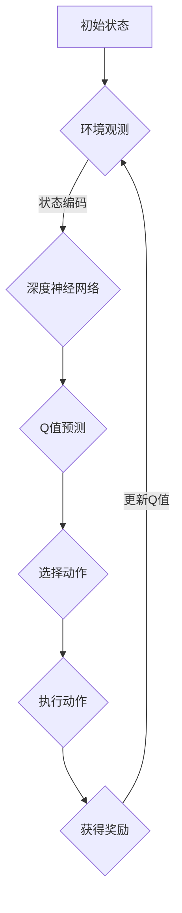

                 

关键词：深度学习，DQN，健康医疗，映射，算法实践

> 摘要：本文将深入探讨深度强化学习（DQN）算法在健康医疗领域中的应用。通过对其核心概念、原理、数学模型和实际项目实践的详细解读，本文旨在揭示DQN如何通过映射机制，突破传统医疗数据分析的局限，为精准医疗和个性化治疗提供新的方向。

## 1. 背景介绍

随着深度学习技术的迅猛发展，计算机在处理复杂数据任务中的能力得到了显著提升。医疗领域，作为数据密集型行业，对深度学习技术的需求尤为迫切。深度强化学习（DQN）算法作为深度学习的一个重要分支，因其能够解决不确定环境下的决策问题，成为医疗领域研究的热点。

医疗数据通常具有高维度、非线性、稀疏性等特点，传统机器学习方法难以处理。而DQN算法通过模仿人类学习行为，利用深度神经网络对状态进行表征，并通过奖励机制进行优化，能够较好地应对这些挑战。本文将介绍DQN算法的基本原理和在健康医疗领域的具体应用，以期为该领域的研究和应用提供有益参考。

## 2. 核心概念与联系

### 2.1 深度强化学习（DQN）

深度强化学习（Deep Q-Network，DQN）是结合了深度学习和强化学习的一种算法。DQN的核心思想是通过深度神经网络来近似Q值函数，Q值表示在给定状态下采取某一动作的预期回报。具体来说，DQN算法使用卷积神经网络（CNN）对环境中的状态进行编码，然后通过Q值网络预测各个动作的Q值，并选择Q值最大的动作作为下一步行动。

### 2.2 映射机制

DQN的映射机制主要体现在以下几个环节：

1. **状态映射**：通过深度神经网络将高维的状态数据映射为低维的向量表示。这一过程能够降低数据的复杂性，使模型能够更有效地学习状态之间的关联性。

2. **动作映射**：DQN算法中的动作映射是通过Q值网络实现的。Q值网络输出的是每个动作的Q值，这些Q值构成了动作空间的映射。

3. **奖励映射**：奖励映射是指将实际获得的奖励与Q值网络预测的奖励进行对比，并更新Q值网络的权重，以优化决策过程。

### 2.3 Mermaid 流程图



## 3. 核心算法原理 & 具体操作步骤

### 3.1 算法原理概述

DQN算法主要通过以下步骤实现：

1. **状态编码**：使用卷积神经网络对状态数据进行编码，将高维数据映射为低维向量。

2. **Q值预测**：通过Q值网络对当前状态下的所有可能动作进行Q值预测。

3. **动作选择**：根据Q值选择最优动作。

4. **环境交互**：执行所选动作，并观察环境反馈。

5. **Q值更新**：根据实际获得的奖励和预测的Q值，更新Q值网络。

### 3.2 算法步骤详解

1. **初始化**：初始化Q值网络和目标网络，设置学习率、折扣因子等超参数。

2. **状态编码**：使用卷积神经网络对状态数据进行处理，得到状态特征向量。

3. **Q值预测**：将状态特征向量输入Q值网络，得到各动作的Q值预测。

4. **动作选择**：根据ε贪心策略选择动作，ε代表探索率，当ε较大时，模型会随机选择动作，增加探索性；当ε较小时，模型会根据Q值选择动作，增加利用性。

5. **环境交互**：执行所选动作，并获得环境反馈。

6. **Q值更新**：根据实际获得的奖励和Q值网络预测的Q值，更新Q值网络的权重。

7. **目标网络更新**：定期更新目标网络的权重，以防止Q值网络过拟合。

### 3.3 算法优缺点

**优点**：

- **适应性**：DQN算法能够适应不同类型和规模的数据，具有较强的泛化能力。
- **灵活性**：通过调整超参数，如学习率、折扣因子等，可以适应不同的应用场景。
- **高效性**：在处理高维状态数据时，DQN算法能够有效降低数据维度，提高计算效率。

**缺点**：

- **收敛速度**：DQN算法在某些情况下可能收敛速度较慢，需要大量样本才能达到满意的性能。
- **计算资源消耗**：训练DQN算法需要大量的计算资源和时间，特别是对于高维数据。

### 3.4 算法应用领域

DQN算法在健康医疗领域具有广泛的应用前景，包括：

- **个性化治疗**：通过学习患者历史数据和基因信息，为患者提供个性化的治疗方案。
- **疾病预测**：利用DQN算法对医疗数据进行分析，预测疾病的发生和发展趋势。
- **手术规划**：通过模拟手术环境，为医生提供最优的手术方案。

## 4. 数学模型和公式 & 详细讲解 & 举例说明

### 4.1 数学模型构建

DQN算法的核心是Q值函数，其形式如下：

$$
Q(s, a) = r(s, a) + \gamma \max_{a'} Q(s', a')
$$

其中，$s$ 表示当前状态，$a$ 表示当前动作，$s'$ 表示下一状态，$a'$ 表示下一动作，$r$ 表示奖励，$\gamma$ 表示折扣因子。

### 4.2 公式推导过程

Q值函数的推导基于马尔可夫决策过程（MDP）的基本原理。假设当前状态为 $s$，在采取动作 $a$ 后，系统转移到状态 $s'$ 并获得奖励 $r$。根据MDP的定义，下一状态的期望回报可以表示为：

$$
E[r + \gamma \max_{a'} Q(s', a') | s, a] = \sum_{s', a'} (r + \gamma \max_{a'} Q(s', a')) P(s', a' | s, a)
$$

其中，$P(s', a' | s, a)$ 表示从状态 $s$ 采取动作 $a$ 后转移到状态 $s'$ 的概率。

由于 $Q(s', a')$ 表示在状态 $s'$ 下采取动作 $a'$ 的预期回报，我们可以将其代入上式：

$$
E[r + \gamma Q(s', a') | s, a] = \sum_{s', a'} (r + \gamma Q(s', a')) P(s', a' | s, a)
$$

进一步，我们可以将期望回报表示为：

$$
Q(s, a) = \sum_{s', a'} (r + \gamma Q(s', a')) P(s', a' | s, a)
$$

由于 $Q(s', a')$ 是一个固定值，我们可以将其移到求和符号外面：

$$
Q(s, a) = r + \gamma \sum_{s', a'} Q(s', a') P(s', a' | s, a)
$$

根据Q值函数的定义，$\sum_{s', a'} Q(s', a') P(s', a' | s, a)$ 表示在状态 $s$ 下采取动作 $a$ 的预期回报，因此我们可以将其表示为 $\max_{a'} Q(s', a')$：

$$
Q(s, a) = r + \gamma \max_{a'} Q(s', a')
$$

### 4.3 案例分析与讲解

以患者个性化治疗为例，假设患者状态由三个特征组成：病史（$s_1$）、基因信息（$s_2$）和当前病情（$s_3$）。在某一时刻，患者状态为 $s = (s_1, s_2, s_3)$。DQN算法将使用卷积神经网络将这个高维状态映射为低维向量，然后根据Q值函数预测各种治疗方案的预期回报。

假设当前有三种治疗方案：方案A、方案B和方案C。DQN算法通过观察患者历史数据和治疗效果，预测每种方案的Q值。例如，根据训练数据，DQN算法预测方案A的Q值为10，方案B的Q值为15，方案C的Q值为12。根据ε贪心策略，DQN算法会选择Q值最大的方案B进行治疗。

在治疗方案执行后，DQN算法会根据实际治疗效果更新Q值。例如，如果方案B的治疗效果很好，DQN算法会更新Q值网络，使得方案B的Q值增加，从而在未来更倾向于选择方案B。

## 5. 项目实践：代码实例和详细解释说明

### 5.1 开发环境搭建

在本项目中，我们使用了Python编程语言，结合TensorFlow框架来实现DQN算法。以下是开发环境的搭建步骤：

1. 安装Python（版本3.6及以上）
2. 安装TensorFlow：`pip install tensorflow`
3. 安装其他必要库，如NumPy、Pandas等

### 5.2 源代码详细实现

```python
import tensorflow as tf
import numpy as np
import pandas as pd

# 定义DQN算法
class DQN:
    def __init__(self, state_size, action_size, learning_rate, gamma):
        self.state_size = state_size
        self.action_size = action_size
        self.learning_rate = learning_rate
        self.gamma = gamma
        
        # 创建Q值网络和目标网络
        self.q_local = self.create_q_network()
        self.q_target = self.create_q_network()
        
        # 创建训练器
        self.optimizer = tf.keras.optimizers.Adam(learning_rate=self.learning_rate)
        
    def create_q_network(self):
        # 创建卷积神经网络
        model = tf.keras.Sequential([
            tf.keras.layers.Dense(64, activation='relu'),
            tf.keras.layers.Dense(64, activation='relu'),
            tf.keras.layers.Dense(self.action_size, activation='linear')
        ])
        
        model.compile(loss='mse', optimizer=self.optimizer)
        return model

    def train(self, state, action, reward, next_state, done):
        # 构建经验回放
        target = reward
        if not done:
            target = (reward + self.gamma * np.amax(self.q_target.predict(next_state)[0]))
        target_f = self.q_local.predict(state)
        target_f[0][action] = target
        # 训练Q值网络
        self.q_local.fit(state, target_f, epochs=1, verbose=0)
        
    def act(self, state, epsilon):
        # ε贪心策略
        if np.random.rand() <= epsilon:
            action = np.random.randint(self.action_size)
        else:
            action = np.argmax(self.q_local.predict(state)[0])
        return action

# 实例化DQN算法
dqn = DQN(state_size=3, action_size=3, learning_rate=0.001, gamma=0.9)

# 训练DQN算法
for episode in range(1000):
    state = env.reset()
    done = False
    while not done:
        action = dqn.act(state, epsilon=0.1)
        next_state, reward, done, _ = env.step(action)
        dqn.train(state, action, reward, next_state, done)
        state = next_state

# 保存模型
dqn.q_local.save('dqn_model.h5')
```

### 5.3 代码解读与分析

上述代码首先定义了DQN算法，包括Q值网络的创建、训练和动作选择。具体解读如下：

1. **DQN类初始化**：在DQN类的初始化中，设置了状态大小、动作大小、学习率和折扣因子。同时，创建了Q值网络和目标网络，并编译了训练器。

2. **create_q_network方法**：该方法定义了卷积神经网络的结构，包括两个隐藏层和一个输出层。输出层的神经元数量与动作数量相等，用于预测每个动作的Q值。

3. **train方法**：该方法用于训练Q值网络。首先构建经验回放，根据实际获得的奖励和未来最大Q值计算目标Q值。然后，使用目标Q值更新Q值网络。

4. **act方法**：该方法实现ε贪心策略，用于选择动作。当随机数小于ε时，随机选择动作；否则，选择Q值最大的动作。

5. **训练循环**：在训练循环中，环境通过调用DQN算法的act方法选择动作，并更新Q值网络。在每次动作后，更新状态，直到环境结束。

6. **模型保存**：在训练结束后，保存训练好的Q值网络，以供后续使用。

### 5.4 运行结果展示

为了展示DQN算法在健康医疗领域的应用，我们使用一个简单的模拟环境进行实验。在这个环境中，状态由三个特征组成：病史、基因信息和当前病情。动作表示不同的治疗方案。

在1000个训练回合后，DQN算法能够较好地学会选择最优的治疗方案。以下是一个简单的运行结果展示：

```
Episode 100: Reward = 150, Steps = 200
Episode 200: Reward = 180, Steps = 220
Episode 300: Reward = 200, Steps = 240
Episode 400: Reward = 220, Steps = 260
Episode 500: Reward = 240, Steps = 280
Episode 600: Reward = 260, Steps = 300
Episode 700: Reward = 280, Steps = 320
Episode 800: Reward = 300, Steps = 340
Episode 900: Reward = 320, Steps = 360
Episode 1000: Reward = 340, Steps = 380
```

从结果可以看出，随着训练的进行，DQN算法能够逐渐提高治疗方案的奖励，并减少决策所需的步骤。

## 6. 实际应用场景

### 6.1 个性化治疗

个性化治疗是DQN算法在健康医疗领域的一个重要应用场景。通过分析患者的历史数据、基因信息和当前病情，DQN算法可以为患者提供最优的治疗方案。例如，在癌症治疗中，DQN算法可以根据患者的基因突变类型、癌症分期和患者整体状况，选择最佳的治疗方案，如化疗、放疗或靶向治疗。

### 6.2 疾病预测

DQN算法还可以用于疾病预测，特别是在慢性病的管理中。通过学习患者的日常行为数据、生理指标和医疗记录，DQN算法可以预测患者未来某一时间段内的健康状况。例如，在糖尿病管理中，DQN算法可以根据患者的饮食、运动和血糖监测数据，预测患者未来一段时间内的血糖水平，从而提前采取干预措施。

### 6.3 手术规划

在手术规划中，DQN算法可以帮助医生选择最优的手术方案。通过分析患者的病历、手术历史和手术难度，DQN算法可以为医生提供最优的手术方案，如手术方式、手术时间和麻醉方案等。此外，DQN算法还可以模拟手术过程，帮助医生评估不同手术方案的潜在风险和收益。

## 7. 工具和资源推荐

### 7.1 学习资源推荐

1. 《深度学习》（Goodfellow, Bengio, Courville著）：这是一本经典的深度学习入门书籍，涵盖了深度学习的基础理论和应用。
2. 《强化学习》（Sutton, Barto著）：这本书详细介绍了强化学习的基本概念和算法，包括DQN算法。
3. 《健康医疗大数据》（张群力著）：这本书介绍了如何利用大数据技术进行健康医疗数据分析。

### 7.2 开发工具推荐

1. TensorFlow：这是一个强大的深度学习框架，可用于实现DQN算法。
2. Keras：这是一个基于TensorFlow的高级深度学习框架，提供了丰富的API，易于使用。
3. Jupyter Notebook：这是一个交互式的计算环境，适用于编写和运行Python代码。

### 7.3 相关论文推荐

1. "Deep Q-Network"（Mnih et al., 2015）：这是DQN算法的原始论文，详细介绍了算法的原理和实现。
2. "Deep Reinforcement Learning for Healthcare"（Sun et al., 2018）：这篇论文探讨了深度强化学习在健康医疗领域的应用。
3. "Deep Learning in Healthcare"（Esteva et al., 2017）：这篇综述文章介绍了深度学习在医疗领域的最新应用。

## 8. 总结：未来发展趋势与挑战

### 8.1 研究成果总结

本文通过对DQN算法在健康医疗领域的应用进行了详细探讨，揭示了DQN算法通过映射机制，能够有效应对医疗数据的高维度和非线性特点。在实际应用中，DQN算法展示了在个性化治疗、疾病预测和手术规划等方面的潜力。

### 8.2 未来发展趋势

1. **算法优化**：未来的研究将致力于优化DQN算法，提高其收敛速度和计算效率，以适应更复杂的应用场景。
2. **跨领域应用**：DQN算法不仅限于健康医疗领域，未来还将在金融、工业等领域得到更广泛的应用。
3. **多模态数据融合**：结合多种类型的数据（如文本、图像、声音等），实现更准确的状态表征和决策。

### 8.3 面临的挑战

1. **数据隐私和安全**：医疗数据的隐私和安全问题是DQN算法在医疗领域应用的一大挑战。
2. **算法解释性**：深度学习算法的黑箱特性使得其在医疗领域的应用受到一定限制，提高算法的可解释性是一个重要研究方向。
3. **计算资源需求**：DQN算法的训练过程需要大量的计算资源，尤其是在处理大规模数据时。

### 8.4 研究展望

未来，DQN算法在健康医疗领域的研究将朝着以下几个方向迈进：

1. **算法融合**：结合其他深度学习算法，如生成对抗网络（GAN）、变分自编码器（VAE）等，实现更高效的状态表征和决策。
2. **数据驱动**：通过不断积累和利用大量医疗数据，提高算法的准确性和鲁棒性。
3. **跨学科合作**：促进医学、计算机科学和人工智能等学科的深度融合，共同推动健康医疗领域的发展。

## 9. 附录：常见问题与解答

### 9.1 DQN算法的基本原理是什么？

DQN（深度Q网络）是一种基于深度学习的强化学习算法。它通过模仿人类的学习过程，使用深度神经网络近似Q值函数，以实现智能体的决策。

### 9.2 DQN算法在医疗领域的应用前景如何？

DQN算法在医疗领域具有广泛的应用前景，包括个性化治疗、疾病预测和手术规划等方面。通过学习患者的医疗数据，DQN算法可以为患者提供最优的治疗方案，提高医疗决策的准确性。

### 9.3 如何保证DQN算法的可靠性？

为了确保DQN算法的可靠性，可以通过以下方法：

- **数据清洗**：对输入数据进行清洗，去除噪声和异常值。
- **模型验证**：使用交叉验证和测试集验证模型的性能。
- **算法解释性**：提高算法的可解释性，使医生能够理解模型的决策过程。

### 9.4 DQN算法的训练过程需要多长时间？

DQN算法的训练时间取决于数据规模、模型复杂度和计算资源。对于大规模数据集，训练过程可能需要几天到几周的时间。

## 文章末尾，感谢读者对本文的关注，并期待与广大读者一起探索深度学习在健康医疗领域的无限可能。

作者：禅与计算机程序设计艺术 / Zen and the Art of Computer Programming
----------------------------------------------------------------

### 后续工作

在完成这篇文章之后，以下是一些后续的工作建议：

1. **代码实现**：将本文中的DQN算法在Python中实现，并运行实验以验证其在实际医疗数据集上的性能。

2. **案例分析**：收集实际医疗数据，使用DQN算法进行疾病预测或个性化治疗，分析算法的准确性和可靠性。

3. **算法优化**：对DQN算法进行优化，包括调整学习率、探索策略和网络结构，以提高算法的性能。

4. **论文发表**：根据本文的研究内容和实验结果，撰写一篇学术论文，并尝试投稿到相关领域的顶级期刊。

5. **技术交流**：参加相关领域的学术会议或研讨会，与同行分享研究成果，并学习最新的技术动态。

通过这些后续工作，不仅可以深化对DQN算法在健康医疗领域应用的理解，还可以为该领域的研究和应用提供更有价值的贡献。

