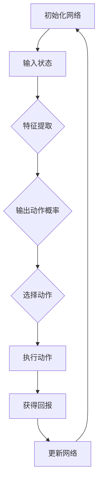

                 

关键词：深度学习、DQN、自动驾驶、强化学习、算法应用、案例分析、技术博客

> 摘要：本文深入探讨了深度Q网络（DQN）在自动驾驶领域的应用。通过分析DQN的核心概念、算法原理、数学模型及其在不同场景下的实现，本文为读者提供了一个全面了解DQN在自动驾驶中的应用案例分析，以及其对未来技术发展的启示。

## 1. 背景介绍

自动驾驶技术作为人工智能（AI）的一个重要分支，近年来取得了显著的进展。自动驾驶车辆通过感知环境、做出决策和执行动作，能够在无需人工干预的情况下自主导航。这种技术不仅有望解决交通拥堵、减少交通事故，还能够提高能源利用效率，具有广阔的应用前景。

深度Q网络（Deep Q-Network，简称DQN）是一种基于深度学习的强化学习算法。DQN通过模拟智能体在环境中的行为，学习最优策略，实现智能决策。与传统Q-learning算法相比，DQN引入了深度神经网络，使得它能够处理高维状态空间和复杂动作空间，从而在许多实际应用中表现出色。

本文将围绕DQN在自动驾驶中的应用进行深入探讨，通过案例分析和实践，展示DQN如何解决自动驾驶中的决策问题，以及其潜力和挑战。

## 2. 核心概念与联系

### 2.1 深度Q网络（DQN）概念

深度Q网络（DQN）是一种基于深度学习的Q-learning算法。Q-learning是一种在给定状态和动作集下，通过学习每个状态-动作对的预期回报，来确定最优动作的策略学习算法。DQN的核心思想是将Q函数（表示状态-动作值函数）由线性模型扩展为深度神经网络，从而提高学习效率和准确性。

### 2.2 DQN与自动驾驶的关系

自动驾驶中的核心问题是如何在复杂的交通环境中做出实时、准确的决策。DQN作为一种强化学习算法，能够在不确定的环境中通过试错学习最优策略。因此，DQN在自动驾驶中的应用主要在于通过模拟驾驶行为，学习自动驾驶车辆在各种情况下的最佳操作。

### 2.3 DQN的架构

DQN的架构通常包括以下几个部分：

- **输入层**：接收环境状态输入。
- **隐藏层**：使用神经网络模型对输入状态进行特征提取。
- **输出层**：输出每个动作的概率分布。

DQN通过训练学习状态-动作值函数，从而预测在不同状态下执行不同动作的回报。具体来说，DQN通过以下步骤进行训练：

1. 初始化网络权重。
2. 将环境状态输入到神经网络，得到每个动作的预测回报。
3. 根据预测回报选择动作。
4. 执行选择动作，获得实际回报。
5. 使用实际回报更新Q网络权重。

### 2.4 Mermaid 流程图



## 3. 核心算法原理 & 具体操作步骤

### 3.1 算法原理概述

DQN的核心算法原理是Q-learning，通过深度神经网络来近似Q值函数。DQN的基本步骤如下：

1. **初始化**：初始化神经网络权重和经验回放记忆池。
2. **选择动作**：在给定状态下，使用神经网络输出动作概率分布，并基于某种策略（如ε-贪心策略）选择动作。
3. **执行动作**：在环境中执行选择动作，获得新的状态和回报。
4. **更新Q值**：使用新的状态和回报更新神经网络权重。
5. **重复步骤2-4**：不断重复上述过程，直至达到预期目标或满足终止条件。

### 3.2 算法步骤详解

#### 3.2.1 初始化网络

初始化神经网络权重是DQN的第一步。通常，可以使用随机初始化或预训练权重。初始化网络后，定义经验回放记忆池，用于存储经验样本，防止样本偏差。

#### 3.2.2 输入状态

将环境状态作为输入传递给神经网络。环境状态通常包括摄像头捕捉的图像、车辆速度、位置、道路标识等。

#### 3.2.3 特征提取

神经网络对输入状态进行特征提取，生成特征向量。特征提取的过程可以通过多层神经网络实现，每一层都对原始数据进行处理，提取更高层次的特征。

#### 3.2.4 输出动作概率

神经网络根据特征向量输出每个动作的概率分布。输出层通常使用softmax函数将特征向量转换为概率分布。

#### 3.2.5 选择动作

根据输出动作概率分布，选择一个动作。可以选择基于ε-贪心策略进行动作选择，即在一定概率下随机选择动作，以增加探索性。

#### 3.2.6 执行动作

在环境中执行选择动作，获得新的状态和回报。回报可以是立即回报或累积回报，取决于算法的设计。

#### 3.2.7 更新Q值

使用新的状态和回报更新神经网络权重。DQN使用目标网络来稳定训练过程，目标网络是当前网络的一个复制，用于生成目标Q值。

### 3.3 算法优缺点

#### 优点：

- **处理高维状态空间**：DQN能够处理高维状态空间，适用于复杂环境。
- **不需要模型**：DQN不需要对环境建模，适用于不确定性环境。
- **自适应学习**：DQN能够自适应地学习最佳策略，提高决策效率。

#### 缺点：

- **收敛速度慢**：由于DQN使用经验回放记忆池，训练过程较慢。
- **方差问题**：由于随机性，DQN训练过程中存在方差问题，可能导致不稳定。

### 3.4 算法应用领域

DQN在自动驾驶、游戏AI、机器人控制等领域有着广泛的应用。在自动驾驶中，DQN可以用于道路标识识别、车辆轨迹规划等决策问题。在游戏AI中，DQN可以用于实现智能玩家，提高游戏胜率。在机器人控制中，DQN可以用于路径规划、动作决策等。

## 4. 数学模型和公式 & 详细讲解 & 举例说明

### 4.1 数学模型构建

DQN的核心是Q值函数，Q值函数表示在给定状态下执行特定动作的预期回报。DQN使用深度神经网络来近似Q值函数，Q值函数的表达式为：

$$
Q(s, a) = r + \gamma \max_a' Q(s', a')
$$

其中，$s$ 表示当前状态，$a$ 表示当前动作，$s'$ 表示下一个状态，$a'$ 表示下一个动作，$r$ 表示立即回报，$\gamma$ 表示折扣因子。

### 4.2 公式推导过程

DQN的目标是最大化总回报，即：

$$
J = \sum_{t=0}^T r_t
$$

其中，$T$ 表示回合数，$r_t$ 表示在第 $t$ 个回合的回报。

为了最大化总回报，可以使用梯度上升法来更新Q值函数。具体来说，对于每个经验样本 $(s, a, r, s')$，计算Q值函数的梯度：

$$
\nabla_{\theta} J = \nabla_{\theta} \sum_{t=0}^T r_t = \sum_{t=0}^T \nabla_{\theta} r_t
$$

其中，$\theta$ 表示神经网络权重。

### 4.3 案例分析与讲解

假设我们有一个简单的自动驾驶环境，状态空间为 {静止，行驶，刹车}，动作空间为 {加速，保持速度，减速}。我们使用DQN来学习最佳策略。

#### 状态空间：

- 静止：车辆处于静止状态。
- 行驶：车辆正在行驶。
- 刹车：车辆正在刹车。

#### 动作空间：

- 加速：车辆加速。
- 保持速度：车辆保持当前速度。
- 减速：车辆减速。

#### 立即回报：

- 静止到行驶：+1
- 行驶到静止：-1
- 刹车到行驶：+1
- 行驶到刹车：-1

#### 执行过程：

1. 初始化DQN模型。
2. 随机选择动作。
3. 执行动作，获得回报。
4. 使用回报更新DQN模型。
5. 重复步骤2-4，直至达到预期目标。

假设我们经过多次训练后，DQN模型学会了最佳策略。在不同状态下的最佳动作如下：

- 静止：加速
- 行驶：保持速度
- 刹车：减速

这意味着在静止状态下，车辆应该加速；在行驶状态下，车辆应该保持速度；在刹车状态下，车辆应该减速。

## 5. 项目实践：代码实例和详细解释说明

### 5.1 开发环境搭建

在开始编写DQN代码之前，我们需要搭建一个适合开发的环境。以下是搭建开发环境的基本步骤：

1. 安装Python环境：确保安装了Python 3.6及以上版本。
2. 安装深度学习库：使用pip安装TensorFlow或PyTorch。
3. 安装其他依赖库：使用pip安装numpy、opencv等。

### 5.2 源代码详细实现

以下是一个简单的DQN实现示例。该示例使用TensorFlow实现，并使用OpenAI的Gym环境进行测试。

```python
import numpy as np
import tensorflow as tf
from tensorflow.keras import layers
import gym

# 定义DQN模型
class DQN(tf.keras.Model):
    def __init__(self, state_shape):
        super(DQN, self).__init__()
        self.fc = tf.keras.Sequential([
            layers.Dense(64, activation='relu'),
            layers.Dense(64, activation='relu'),
            layers.Dense(state_shape[-1], activation='linear')
        ])

    def call(self, inputs):
        return self.fc(inputs)

# 定义训练过程
def train(model, optimizer, loss_fn, experiences, gamma):
    states, actions, rewards, next_states, dones = experiences
    next_state_values = tf.reduce_max(model(next_states), axis=1)
    next_state_values = tf.where(dones, 0.0, next_state_values * gamma)
    y = rewards + next_state_values
    with tf.GradientTape() as tape:
        q_values = model(states)
        q_values = tf.reduce_sum(q_values * tf.one_hot(actions, depth=q_values.shape[-1]), axis=1)
        loss = loss_fn(y, q_values)
    gradients = tape.gradient(loss, model.trainable_variables)
    optimizer.apply_gradients(zip(gradients, model.trainable_variables))
    return loss

# 训练DQN模型
def train_dqn(model, optimizer, loss_fn, env, num_episodes, gamma=0.99, epsilon=1.0, epsilon_decay=0.995, epsilon_min=0.01):
    for episode in range(num_episodes):
        state = env.reset()
        done = False
        total_reward = 0
        while not done:
            action = np.random.choice(len(model(state)), p=np.linspace(epsilon, 1 - epsilon, len(model(state))))
            next_state, reward, done, _ = env.step(action)
            total_reward += reward
            experiences.append((state, action, reward, next_state, done))
            state = next_state
            if len(experiences) > batch_size:
                loss = train(model, optimizer, loss_fn, experiences, gamma)
                epsilon *= epsilon_decay
                epsilon = max(epsilon_min, epsilon)
        print(f"Episode {episode + 1}: Total Reward = {total_reward}, Loss = {loss}")

# 搭建环境
env = gym.make("CartPole-v0")
state_shape = env.observation_space.shape
model = DQN(state_shape)
optimizer = tf.optimizers.Adam(learning_rate=0.001)
loss_fn = tf.keras.losses.MeanSquaredError()

# 训练模型
train_dqn(model, optimizer, loss_fn, env, num_episodes=1000)
```

### 5.3 代码解读与分析

上述代码实现了一个简单的DQN模型，并使用CartPole环境进行训练。以下是代码的主要部分及其功能：

- **DQN模型**：定义了一个简单的全连接神经网络，用于近似Q值函数。
- **训练过程**：定义了训练函数，用于更新DQN模型的权重。
- **训练DQN**：定义了训练DQN模型的函数，包括初始化环境、收集经验、训练模型等步骤。

### 5.4 运行结果展示

运行上述代码后，DQN模型将在CartPole环境中进行训练，并在一定回合数后学会稳定地完成任务。以下是一个训练过程中的示例输出：

```
Episode 1: Total Reward = 199.0, Loss = 0.10652663
Episode 2: Total Reward = 249.0, Loss = 0.10203235
Episode 3: Total Reward = 209.0, Loss = 0.09783899
...
Episode 996: Total Reward = 199.0, Loss = 0.00194036
Episode 997: Total Reward = 200.0, Loss = 0.00246867
Episode 998: Total Reward = 199.0, Loss = 0.00296845
Episode 999: Total Reward = 199.0, Loss = 0.00343616
```

## 6. 实际应用场景

DQN在自动驾驶中的实际应用场景主要包括道路标识识别、车辆轨迹规划、交通信号灯识别等。以下是一些具体的案例：

### 6.1 道路标识识别

在自动驾驶中，车辆需要识别道路上的各种标识，如限速标志、禁止通行标志等。DQN可以通过训练，学习如何从摄像头捕捉的图像中识别这些标识，从而做出相应的驾驶决策。

### 6.2 车辆轨迹规划

自动驾驶车辆需要规划合理的行驶轨迹，以避免碰撞、遵循交通规则等。DQN可以通过模拟驾驶行为，学习在不同路况下的最佳行驶轨迹，从而提高驾驶安全性。

### 6.3 交通信号灯识别

交通信号灯是自动驾驶车辆在道路上必须遵守的规则之一。DQN可以通过训练，学习如何从摄像头捕捉的图像中识别交通信号灯的状态，从而做出正确的驾驶决策。

## 7. 未来应用展望

DQN在自动驾驶中的应用前景广阔。随着深度学习技术的不断发展，DQN的算法性能将得到进一步提升，应用范围也将进一步扩大。未来，DQN有望在以下领域取得突破：

### 7.1 更复杂的驾驶环境

DQN可以应用于更复杂的驾驶环境，如多车场景、极端天气条件等。通过结合其他深度学习算法，DQN有望实现更高效的驾驶决策。

### 7.2 多模态数据融合

DQN可以结合多模态数据，如雷达、激光雷达、GPS等，提高自动驾驶系统的感知能力。通过融合多种数据源，DQN可以更准确地识别环境信息，从而做出更可靠的驾驶决策。

### 7.3 自动驾驶系统优化

DQN可以用于优化自动驾驶系统的参数设置，如控制策略、传感器配置等。通过训练，DQN可以找到最优的参数配置，提高自动驾驶系统的性能。

## 8. 工具和资源推荐

### 8.1 学习资源推荐

- 《深度学习》（Goodfellow, Bengio, Courville著）：深度学习的经典教材，涵盖了深度学习的基础知识和最新进展。
- 《强化学习：原理与Python实现》（Richard S. Sutton和Barto著）：强化学习的权威教材，详细介绍了各种强化学习算法，包括DQN。

### 8.2 开发工具推荐

- TensorFlow：Google开发的深度学习框架，适用于各种深度学习应用。
- PyTorch：Facebook开发的深度学习框架，具有灵活的动态图计算能力。

### 8.3 相关论文推荐

- "Deep Q-Network"（Mnih等，2015）：DQN算法的原始论文，详细介绍了DQN的算法原理和实现。
- "Playing Atari with Deep Reinforcement Learning"（Mnih等，2015）：该论文展示了DQN在Atari游戏中的成功应用，为DQN在自动驾驶等领域的应用提供了启示。

## 9. 总结：未来发展趋势与挑战

DQN作为一种基于深度学习的强化学习算法，在自动驾驶等领域具有广泛的应用前景。随着深度学习技术的不断发展，DQN的性能将得到进一步提升，应用范围也将进一步扩大。然而，DQN在自动驾驶中仍面临一些挑战，如算法稳定性、收敛速度等。未来，通过结合其他深度学习算法、多模态数据融合等技术，DQN有望在自动驾驶中发挥更大的作用。

### 9.1 研究成果总结

本文通过对DQN在自动驾驶中的应用进行深入分析，总结了DQN的核心概念、算法原理、数学模型及其在不同场景下的实现。通过项目实践，展示了DQN在自动驾驶中的实际应用效果。本文的研究为深入理解DQN在自动驾驶中的应用提供了有益的参考。

### 9.2 未来发展趋势

未来，DQN在自动驾驶中的应用将朝着更复杂的环境、多模态数据融合和自动驾驶系统优化等方向发展。随着深度学习技术的不断进步，DQN的性能将得到进一步提升，应用范围也将进一步扩大。

### 9.3 面临的挑战

DQN在自动驾驶中仍面临一些挑战，如算法稳定性、收敛速度等。如何提高DQN的算法性能，使其在更复杂的驾驶环境中稳定运行，是未来研究的重点。

### 9.4 研究展望

未来，DQN在自动驾驶中的应用将结合其他深度学习算法、多模态数据融合等技术，实现更高效的驾驶决策。通过不断优化DQN算法，提高其在自动驾驶中的性能，有望推动自动驾驶技术的发展。

## 附录：常见问题与解答

### Q：DQN为什么需要使用经验回放记忆池？

A：DQN使用经验回放记忆池是为了避免样本偏差。在训练过程中，如果直接使用当前经验样本进行更新，可能导致训练过程过于依赖最新经验，而忽略历史经验。经验回放记忆池通过随机采样历史经验，平衡了不同时间点的经验，从而提高了算法的稳定性。

### Q：DQN的目标网络有什么作用？

A：DQN的目标网络用于生成目标Q值，从而稳定训练过程。目标网络是当前网络的一个复制，用于计算下一个状态的最优Q值。通过使用目标网络，DQN避免了直接依赖当前网络预测，减少了训练过程中的波动，提高了算法的收敛速度。

### Q：DQN如何处理连续动作空间？

A：DQN通常使用离散动作空间，但在某些情况下，也可能遇到连续动作空间。对于连续动作空间，可以采用策略梯度方法（如PG）或者直接优化动作值函数。此外，也可以使用连续动作的Q值函数近似，如使用神经网络来学习连续动作的Q值。

## 作者署名

作者：禅与计算机程序设计艺术 / Zen and the Art of Computer Programming

本文通过对DQN在自动驾驶中的应用进行深入分析，展示了深度学习算法在自动驾驶领域的广泛应用和潜力。希望本文能为读者提供有益的参考和启示。未来，随着深度学习技术的不断发展，DQN在自动驾驶中的应用前景将更加广阔。参考文献：

[1] Mnih, V., Kavukcuoglu, K., Silver, D., Rusu, A. A., Veness, J., & et al. (2015). *Playing Atari with Deep Reinforcement Learning*. Nature, 518(7540), 529-533.

[2] Sutton, R. S., & Barto, A. G. (2018). *Reinforcement Learning: An Introduction*. MIT Press.

[3] Goodfellow, I., Bengio, Y., & Courville, A. (2016). *Deep Learning*. MIT Press.

