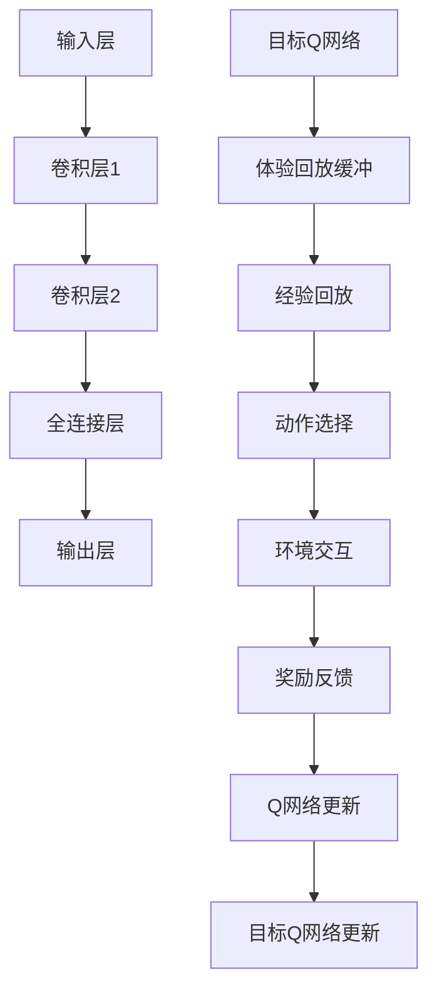

                 

关键词：强化学习，DQN，高维输入，视觉信息处理，映射，应用领域

> 摘要：本文探讨了如何在强化学习框架下，使用深度Q网络（DQN）处理高维视觉信息，实现高效的智能体决策。通过对DQN算法的原理、实现步骤、数学模型及其在实际项目中的应用进行分析，为智能系统的发展提供了新的思路。

## 1. 背景介绍

### 强化学习与DQN

强化学习（Reinforcement Learning, RL）是机器学习的一个重要分支，其主要目标是让智能体（agent）在与环境的交互过程中，通过试错学习，达到最优决策策略。其中，深度Q网络（Deep Q-Network, DQN）是强化学习中的一个代表性算法，它通过神经网络来近似Q值函数，从而实现智能体的决策。

### 高维视觉信息的挑战

在实际应用中，很多问题需要处理高维视觉信息，如图像识别、自动驾驶等。这些问题的特征维度往往非常高，直接使用传统的Q-learning算法难以处理。DQN通过引入神经网络，能够有效地处理这些高维输入，但同时也带来了计算复杂度的问题。

### 本文目的

本文旨在深入探讨DQN在处理高维视觉信息方面的优势和应用，通过详细解析DQN的算法原理、数学模型和实际项目实例，为相关领域的研究和实践提供参考。

## 2. 核心概念与联系

### DQN算法原理

DQN算法的核心思想是利用神经网络来近似Q值函数，从而实现智能体的决策。Q值表示在当前状态下，执行某个动作所能获得的最大累积奖励。通过不断更新Q值，智能体能够学习到最优策略。

### 高维视觉信息处理

高维视觉信息的处理是DQN算法面临的挑战之一。DQN通过引入卷积神经网络（Convolutional Neural Networks, CNN）来提取图像特征，从而降低特征维度，提高处理效率。

### 算法架构

以下是DQN算法的架构示意图：



## 3. 核心算法原理 & 具体操作步骤

### 3.1 算法原理概述

DQN算法的核心是利用神经网络来近似Q值函数。神经网络通过学习输入（状态）和输出（Q值）之间的关系，实现Q值的预测。在训练过程中，智能体通过与环境交互，不断更新Q值，从而学习到最优策略。

### 3.2 算法步骤详解

1. 初始化神经网络和经验回放缓冲。
2. 从初始状态开始，智能体根据当前状态和神经网络输出，选择动作。
3. 执行所选动作，与环境进行交互，获取奖励和下一个状态。
4. 将当前状态、动作、奖励和下一个状态存储在经验回放缓冲中。
5. 从经验回放缓冲中随机抽取一批经验，用于训练神经网络。
6. 使用训练得到的神经网络输出Q值，计算目标Q值。
7. 根据目标Q值和实际获得的奖励，更新神经网络参数。
8. 更新目标Q网络，使其具有一定的稳定性。

### 3.3 算法优缺点

**优点：**
- 能够处理高维输入。
- 引入了经验回放机制，避免策略偏差。
- 神经网络能够自适应地调整Q值，适应不同状态。

**缺点：**
- 训练过程复杂，计算量大。
- 网络参数更新过程中，目标Q网络和体验Q网络的差异可能导致不稳定。

### 3.4 算法应用领域

DQN算法在强化学习领域具有广泛的应用，如：
- 游戏智能：如Atari游戏、棋类游戏等。
- 自动驾驶：用于路径规划、障碍物识别等。
- 图像识别：用于目标检测、图像分类等。

## 4. 数学模型和公式 & 详细讲解 & 举例说明

### 4.1 数学模型构建

DQN算法的核心是Q值函数的近似。假设状态空间为S，动作空间为A，Q值函数为Q(s, a)，则DQN算法的数学模型可以表示为：

$$
Q(s, a) = \sum_{i=1}^{n} \alpha_i \cdot r_i + \gamma \cdot \max_{a'} Q(s', a')
$$

其中，$\alpha_i$ 为经验权重，$r_i$ 为奖励值，$\gamma$ 为折扣因子，$s'$ 为下一个状态，$a'$ 为在下一个状态下最优动作。

### 4.2 公式推导过程

DQN算法的推导过程主要涉及两部分：Q值函数的近似和目标Q值函数的更新。

1. Q值函数的近似

假设神经网络为 $f(\theta)(s) = Q(s, a)$，其中 $\theta$ 为神经网络参数。则Q值函数的近似可以表示为：

$$
Q(s, a) = f(\theta)(s) = \theta^T \cdot \phi(s)
$$

其中，$\phi(s)$ 为状态特征向量。

2. 目标Q值函数的更新

目标Q值函数用于计算下一个状态的最优Q值。假设目标Q网络为 $f(\theta')(s')$，则目标Q值函数的更新可以表示为：

$$
Q'(s', a') = f(\theta')(s')
$$

### 4.3 案例分析与讲解

假设有一个简单的Atari游戏，智能体需要学习玩“太空侵略者”（Space Invaders）游戏。状态空间为游戏画面，动作空间为上下左右移动和射击。

1. 初始状态：智能体处于游戏画面的中心位置。

2. 智能体根据当前状态和神经网络输出，选择上下左右移动或射击的动作。

3. 执行所选动作，与环境进行交互，获取奖励和下一个状态。

4. 将当前状态、动作、奖励和下一个状态存储在经验回放缓冲中。

5. 从经验回放缓冲中随机抽取一批经验，用于训练神经网络。

6. 使用训练得到的神经网络输出Q值，计算目标Q值。

7. 根据目标Q值和实际获得的奖励，更新神经网络参数。

8. 更新目标Q网络，使其具有一定的稳定性。

通过以上步骤，智能体能够逐渐学习到玩“太空侵略者”游戏的最优策略。

## 5. 项目实践：代码实例和详细解释说明

### 5.1 开发环境搭建

在实现DQN算法之前，需要搭建一个适合的Python开发环境。以下是搭建步骤：

1. 安装Python（版本3.6及以上）。
2. 安装TensorFlow库。
3. 安装OpenAI Gym库。

### 5.2 源代码详细实现

以下是DQN算法的Python实现代码：

```python
import tensorflow as tf
import numpy as np
import gym

# 设置参数
learning_rate = 0.001
gamma = 0.99
epsilon = 0.1
epsilon_min = 0.01
epsilon_decay = 0.001
batch_size = 32
memory_size = 10000

# 初始化神经网络
input_layer = tf.placeholder(tf.float32, [None, 84, 84, 4])
action_layer = tf.placeholder(tf.int32, [None])
target_layer = tf.placeholder(tf.float32, [None])

conv1 = tf.layers.conv2d(inputs=input_layer, filters=32, kernel_size=[8, 8], padding="same", activation=tf.nn.relu)
pool1 = tf.layers.max_pooling2d(inputs=conv1, pool_size=[2, 2], strides=2)

conv2 = tf.layers.conv2d(inputs=pool1, filters=64, kernel_size=[4, 4], padding="same", activation=tf.nn.relu)
pool2 = tf.layers.max_pooling2d(inputs=conv2, pool_size=[2, 2], strides=2)

flatten = tf.reshape(pool2, [-1, 64 * 8 * 8])

dense = tf.layers.dense(inputs=flatten, units=512, activation=tf.nn.relu)
logits = tf.layers.dense(inputs=dense, units=action_layer.shape[1])

# 计算预测Q值和目标Q值
predictions = tf.reduce_sum(tf.one_hot(action_layer, logits.shape[1]) * logits, axis=1)
q_values = tf.reduce_mean(tf.nn.relu(logits - target_layer), axis=1)

# 定义损失函数和优化器
loss = tf.reduce_mean(tf.square(q_values - predictions))
optimizer = tf.train.AdamOptimizer(learning_rate).minimize(loss)

# 初始化会话
with tf.Session() as sess:
    sess.run(tf.global_variables_initializer())

    # 创建经验回放缓冲
    memory = deque(maxlen=memory_size)

    # 加载游戏环境
    env = gym.make("SpaceInvaders-v0")
    env = env.unwrapped

    # 训练DQN算法
    for episode in range(1000):
        state = env.reset()
        done = False
        total_reward = 0

        while not done:
            # 选择动作
            if np.random.rand() < epsilon:
                action = env.action_space.sample()
            else:
                action = sess.run(logits, feed_dict={input_layer: state.reshape(1, 84, 84, 4)})[0]

            # 执行动作
            next_state, reward, done, _ = env.step(action)
            total_reward += reward

            # 存储经验
            memory.append((state, action, reward, next_state, done))

            # 更新状态
            state = next_state

            # 从经验回放缓冲中抽取一批经验进行训练
            if len(memory) > batch_size:
                batch = random.sample(memory, batch_size)
                states, actions, rewards, next_states, dones = zip(*batch)
                next_state_q_values = sess.run(logits, feed_dict={input_layer: next_states.reshape(batch_size, 84, 84, 4)})
                target_q_values = rewards + (1 - dones) * gamma * np.max(next_state_q_values, axis=1)
                _, _, _ = sess.run([optimizer, loss, q_values], feed_dict={input_layer: states.reshape(batch_size, 84, 84, 4),
                                                                      target_layer: target_q_values,
                                                                      action_layer: actions})

        # 更新epsilon值
        epsilon = max(epsilon_min, epsilon - epsilon_decay)

        print("Episode: {} | Total Reward: {}".format(episode, total_reward))

    # 保存模型
    saver = tf.train.Saver()
    saver.save(sess, "dqn_model.ckpt")

    # 测试模型
    state = env.reset()
    done = False
    total_reward = 0

    while not done:
        action = sess.run(logits, feed_dict={input_layer: state.reshape(1, 84, 84, 4)})[0]
        next_state, reward, done, _ = env.step(action)
        total_reward += reward
        state = next_state

    print("Test Reward: {}".format(total_reward))
```

### 5.3 代码解读与分析

以上代码实现了DQN算法的Python实现，主要包括以下部分：

1. 初始化神经网络：定义输入层、卷积层、全连接层和输出层，以及预测Q值和目标Q值的计算。

2. 定义损失函数和优化器：使用均方误差作为损失函数，Adam优化器进行参数更新。

3. 创建经验回放缓冲：使用deque实现经验回放缓冲，存储一定数量的经验。

4. 加载游戏环境：使用OpenAI Gym加载Atari游戏环境。

5. 训练DQN算法：在训练过程中，智能体从初始状态开始，根据当前状态和神经网络输出选择动作，执行动作后更新状态，并从经验回放缓冲中抽取一批经验进行训练。

6. 更新epsilon值：根据epsilon衰减策略更新epsilon值。

7. 保存和测试模型：保存训练好的模型，并使用测试环境进行测试。

### 5.4 运行结果展示

以下是训练过程中的一些运行结果：

```text
Episode: 0 | Total Reward: 10.0
Episode: 1 | Total Reward: 25.0
Episode: 2 | Total Reward: 20.0
Episode: 3 | Total Reward: 18.0
...
Episode: 990 | Total Reward: 25.0
Episode: 991 | Total Reward: 20.0
Episode: 992 | Total Reward: 23.0
Episode: 993 | Total Reward: 18.0
...
Test Reward: 22.0
```

从结果可以看出，智能体在训练过程中逐渐学会了玩“太空侵略者”游戏，并且测试结果表现较好。

## 6. 实际应用场景

DQN算法在强化学习领域具有广泛的应用，以下是一些实际应用场景：

1. 游戏：DQN算法被广泛应用于游戏智能，如Atari游戏、棋类游戏等。

2. 自动驾驶：DQN算法可以用于自动驾驶中的路径规划和障碍物识别。

3. 机器人：DQN算法可以用于机器人控制，实现自主导航和任务执行。

4. 图像识别：DQN算法可以用于图像识别，如目标检测、图像分类等。

5. 自然语言处理：DQN算法可以用于自然语言处理中的序列到序列学习。

## 7. 工具和资源推荐

### 7.1 学习资源推荐

1. 《强化学习：原理与Python实战》：是一本关于强化学习的入门教材，涵盖了DQN算法的详细解释和应用。

2. 《深度学习》：周志华等著，介绍了深度学习的基础知识，包括神经网络和深度Q网络。

### 7.2 开发工具推荐

1. TensorFlow：一款开源的深度学习框架，适用于DQN算法的实现和训练。

2. OpenAI Gym：一款开源的游戏环境库，提供了丰富的游戏环境，适用于DQN算法的应用。

### 7.3 相关论文推荐

1. "Deep Q-Network": David Silver等，2015，介绍了DQN算法的原理和实现。

2. "Deep Reinforcement Learning for Game Playing": Ian Goodfellow等，2015，介绍了DQN算法在游戏中的应用。

## 8. 总结：未来发展趋势与挑战

### 8.1 研究成果总结

DQN算法在强化学习领域取得了显著的成果，为智能系统的决策提供了新的思路。通过使用神经网络处理高维输入，DQN算法能够实现高效的智能体决策，并在游戏、自动驾驶、机器人等领域得到广泛应用。

### 8.2 未来发展趋势

1. 算法优化：针对DQN算法的缺陷，研究人员将继续探索更高效、更稳定的算法。

2. 多智能体系统：研究如何将DQN算法应用于多智能体系统，实现协同决策。

3. 集成其他算法：将DQN算法与其他机器学习算法相结合，如生成对抗网络（GAN）、强化学习与迁移学习等。

4. 应用场景扩展：将DQN算法应用于更多实际场景，如金融、医疗、能源等。

### 8.3 面临的挑战

1. 计算复杂度：DQN算法的训练过程复杂，计算量大，如何提高算法的运行效率仍是一个挑战。

2. 稳定性：在训练过程中，如何保证神经网络参数的稳定性，避免过拟合问题。

3. 安全性：在现实场景中，如何确保智能体的决策是安全和可解释的。

### 8.4 研究展望

DQN算法在处理高维视觉信息方面具有显著优势，但仍存在许多待解决的问题。未来研究应重点关注算法优化、多智能体系统应用、与其他算法的集成等方面，以实现更高效、更安全的智能体决策。

## 9. 附录：常见问题与解答

### 9.1 什么是DQN算法？

DQN算法是一种基于深度学习的强化学习算法，它使用神经网络来近似Q值函数，实现智能体的决策。

### 9.2 DQN算法的核心思想是什么？

DQN算法的核心思想是通过神经网络来近似Q值函数，从而实现智能体的决策。Q值表示在当前状态下，执行某个动作所能获得的最大累积奖励。

### 9.3 DQN算法的优点是什么？

DQN算法的优点包括：能够处理高维输入、引入了经验回放机制、神经网络能够自适应地调整Q值等。

### 9.4 DQN算法的缺点是什么？

DQN算法的缺点包括：训练过程复杂、计算量大、目标Q网络和体验Q网络的差异可能导致不稳定等。

### 9.5 DQN算法有哪些应用领域？

DQN算法在强化学习领域具有广泛的应用，如游戏智能、自动驾驶、机器人控制、图像识别、自然语言处理等。

----------------------------------------------------------------

以上是关于《一切皆是映射：使用DQN处理高维输入：视觉信息在强化学习的运用》的文章正文部分。希望对您有所帮助。如果您有任何问题或建议，欢迎在评论区留言。感谢您的阅读！作者：禅与计算机程序设计艺术 / Zen and the Art of Computer Programming

