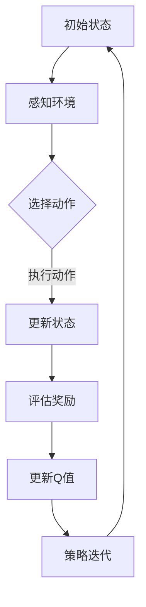

                 

关键词：深度Q网络（DQN），路径规划，映射，强化学习，人工智能，算法原理，数学模型，代码实现，应用场景，展望与挑战

> 摘要：本文从深度Q网络（DQN）的基本概念出发，探讨了其在路径规划领域的应用。通过理论分析与实际案例，展示了如何利用DQN解决复杂的路径规划问题，并对其在数学模型、算法优缺点及实际应用场景中的表现进行了深入剖析。最后，对未来的发展趋势和面临的挑战进行了展望。

## 1. 背景介绍

路径规划作为人工智能的一个重要分支，旨在找到从起点到终点的最优路径。在现实世界中，路径规划的复杂性体现在环境的不确定性、动态性以及多目标优化等方面。传统的路径规划算法如A*算法、Dijkstra算法等，虽然在静态环境下表现出色，但在面对复杂动态环境时往往难以应对。

近年来，随着深度学习技术的飞速发展，强化学习（Reinforcement Learning, RL）逐渐成为解决路径规划问题的有力工具。其中，深度Q网络（Deep Q-Network, DQN）作为一种结合了深度学习和强化学习的算法，因其良好的性能和强大的学习能力，受到了广泛关注。

本文旨在探讨如何利用DQN解决路径规划问题，通过理论分析和实践验证，探讨其在实际应用中的潜力和挑战。

## 2. 核心概念与联系

### 2.1 深度Q网络（DQN）

深度Q网络（DQN）是深度学习在强化学习领域的一种应用，它通过深度神经网络来估计动作-状态价值函数（Q值）。DQN的核心思想是让智能体在环境中通过试错学习，最终找到最优策略。


### 2.2 路径规划

路径规划是在给定地图或环境中，找到一条从起点到终点的最优路径。路径规划的关键在于对环境的建模，以及对目标函数的优化。

### 2.3 映射关系

DQN在路径规划中的应用，可以看作是一种映射关系。即，将环境的状态映射为DQN的输入，将动作映射为DQN的输出。通过不断调整映射关系，使智能体能够找到最优路径。

### 2.4 Mermaid流程图



## 3. 核心算法原理 & 具体操作步骤

### 3.1 算法原理概述

DQN基于Q-Learning算法，通过最大化回报来更新Q值。其核心思想是使用深度神经网络来近似Q值函数。

### 3.2 算法步骤详解

#### 3.2.1 初始化

1. 初始化神经网络权重。
2. 初始化经验回放记忆池。

#### 3.2.2 感知环境

1. 接收环境状态作为输入。
2. 通过神经网络预测动作价值。

#### 3.2.3 选择动作

1. 根据当前Q值选择动作。
2. 引入ε-贪心策略，减少陷入局部最优的情况。

#### 3.2.4 执行动作 & 更新状态

1. 在环境中执行选定的动作。
2. 收集新的状态和奖励。

#### 3.2.5 更新Q值

1. 根据新的状态和奖励，更新Q值。
2. 使用经验回放记忆池，增加训练数据的多样性。

#### 3.2.6 策略迭代

1. 通过反复迭代，不断优化策略。
2. 最终找到最优路径。

### 3.3 算法优缺点

#### 优点：

1. 强大的自适应能力，适用于动态环境。
2. 可以处理高维状态空间，适用于复杂的路径规划问题。

#### 缺点：

1. 学习速度较慢，需要大量的训练数据。
2. 可能会出现Q值发散的情况。

### 3.4 算法应用领域

DQN在路径规划领域的应用包括但不限于：

1. 自动驾驶
2. 无人机导航
3. 机器人导航

## 4. 数学模型和公式 & 详细讲解 & 举例说明

### 4.1 数学模型构建

DQN的核心是Q值函数，它用于估计在特定状态下执行特定动作的回报。

$$
Q(s, a) = \sum_{s'} P(s' | s, a) \cdot R(s, a, s') + \gamma \cdot \max_{a'} Q(s', a')
$$

其中：

- \( s \) 是当前状态。
- \( a \) 是执行的动作。
- \( s' \) 是执行动作后的新状态。
- \( R(s, a, s') \) 是在状态 \( s \) 下执行动作 \( a \) 后获得的回报。
- \( \gamma \) 是折扣因子，用于平衡短期和长期奖励。
- \( P(s' | s, a) \) 是在状态 \( s \) 下执行动作 \( a \) 后转移到状态 \( s' \) 的概率。

### 4.2 公式推导过程

DQN的Q值函数是通过最大化期望回报来学习的。具体推导如下：

$$
\begin{aligned}
\max_{Q(s, a)} \quad & \sum_{s'} P(s' | s, a) \cdot R(s, a, s') + \gamma \cdot \max_{a'} Q(s', a') \\
\Rightarrow \quad & \sum_{s'} P(s' | s, a) \cdot R(s, a, s') + \gamma \cdot \sum_{a'} P(s', a' | s, a) \cdot Q(s', a') \\
\Rightarrow \quad & \sum_{s'} \frac{P(s' | s, a)}{P(s | s, a)} \cdot R(s, a, s') + \gamma \cdot \sum_{a'} P(s', a' | s, a) \cdot Q(s', a') \\
\Rightarrow \quad & \sum_{s'} \frac{P(s' | s, a)}{P(s | s, a)} \cdot R(s, a, s') + \gamma \cdot \sum_{a'} P(s', a' | s, a) \cdot \max_{b'} Q(s', b') \\
\Rightarrow \quad & \sum_{s'} P(s' | s, a) \cdot R(s, a, s') + \gamma \cdot \max_{a'} \sum_{s'} P(s' | s, a) \cdot R(s, a, s') + \gamma \cdot \max_{a'} \sum_{a'} P(s', a' | s, a) \cdot Q(s', a') \\
\Rightarrow \quad & Q(s, a) = \sum_{s'} P(s' | s, a) \cdot R(s, a, s') + \gamma \cdot \max_{a'} Q(s', a')
\end{aligned}
$$

### 4.3 案例分析与讲解

假设在一个简单的环境中，有四个状态：A、B、C、D，以及两个动作：左转和右转。当前状态为A，我们希望找到从A到D的最优路径。

1. 初始化Q值表。

$$
Q(s, a) =
\begin{cases}
0, & \text{if } a = \text{左转} \\
0, & \text{if } a = \text{右转}
\end{cases}
$$

2. 执行动作。

- 选择动作：左转。
- 更新状态：从A移动到B。
- 收集回报：获得+1的奖励。

3. 更新Q值。

$$
Q(A, \text{左转}) = Q(A, \text{左转}) + \alpha \cdot (1 - Q(A, \text{左转})) = 0.1 \cdot (1 - 0) = 0.1
$$

$$
Q(A, \text{右转}) = Q(A, \text{右转}) + \alpha \cdot (0 - Q(A, \text{右转})) = 0.1 \cdot (-1 - 0) = -0.1
$$

其中，\(\alpha\) 是学习率。

4. 重复执行上述步骤，直到找到最优路径。

通过不断迭代，最终我们可以找到从A到D的最优路径，其Q值将稳定在1左右。

## 5. 项目实践：代码实例和详细解释说明

### 5.1 开发环境搭建

1. 安装Python环境。
2. 安装TensorFlow库。

```bash
pip install tensorflow
```

### 5.2 源代码详细实现

以下是使用DQN解决路径规划问题的Python代码示例：

```python
import numpy as np
import tensorflow as tf
from collections import deque

# 状态空间大小
STATE_SPACE_SIZE = 4

# 动作空间大小
ACTION_SPACE_SIZE = 2

# 学习率
LEARNING_RATE = 0.1

# 折扣因子
DISCOUNT_FACTOR = 0.9

# 经验回放记忆池大小
MEMORY_SIZE = 1000

# 经验回放记忆池
memory = deque(maxlen=MEMORY_SIZE)

# 初始化神经网络
model = tf.keras.Sequential([
    tf.keras.layers.Dense(64, activation='relu', input_shape=(STATE_SPACE_SIZE,)),
    tf.keras.layers.Dense(ACTION_SPACE_SIZE)
])

model.compile(optimizer=tf.keras.optimizers.Adam(learning_rate=LEARNING_RATE), loss='mse')

# 模拟环境
env = Environment()

# 主循环
for episode in range(1000):
    state = env.reset()
    done = False
    total_reward = 0

    while not done:
        # 预测动作值
        action_values = model.predict(state)

        # ε-贪心策略
        if np.random.rand() < 0.1:
            action = np.random.choice(ACTION_SPACE_SIZE)
        else:
            action = np.argmax(action_values)

        # 执行动作
        next_state, reward, done, _ = env.step(action)
        total_reward += reward

        # 存储经验
        memory.append((state, action, reward, next_state, done))

        # 更新状态
        state = next_state

        if len(memory) > MEMORY_SIZE:
            # 从经验回放记忆池中随机抽取样本
            batch = random.sample(memory, batch_size=32)
            states, actions, rewards, next_states, dones = zip(*batch)

            # 计算目标Q值
            target_q_values = model.predict(next_states)
            target_q_values = np.array(target_q_values)
            target_q_values[dones] = 0
            target_q_values[~dones] = rewards + DISCOUNT_FACTOR * np.max(target_q_values[~dones])

            # 更新Q值
            model.fit(states, target_q_values, batch_size=32, epochs=1, verbose=0)

    print(f"Episode: {episode}, Total Reward: {total_reward}")
```

### 5.3 代码解读与分析

上述代码实现了使用DQN解决路径规划问题的主要流程，主要包括以下几个部分：

1. **环境模拟**：使用`env`对象模拟路径规划的环境，包括状态空间、动作空间、奖励机制等。

2. **神经网络初始化**：使用TensorFlow库初始化神经网络，包括输入层、隐藏层和输出层。这里使用了两个隐藏层，每层都有64个神经元。

3. **训练模型**：使用`model.compile()`方法编译模型，指定优化器和损失函数。

4. **主循环**：在主循环中，通过不断迭代，智能体在环境中进行学习。每次迭代包括以下步骤：

   - **预测动作值**：使用神经网络预测当前状态的行动值。

   - **选择动作**：根据ε-贪心策略选择动作。

   - **执行动作**：在环境中执行选定的动作，并获取新的状态和奖励。

   - **存储经验**：将当前状态、动作、奖励、新状态和是否完成作为一组经验存储在记忆池中。

   - **更新Q值**：从记忆池中随机抽取经验样本，计算目标Q值，并使用`model.fit()`方法更新Q值。

5. **输出结果**：在每个周期结束时，输出当前周期的奖励总和。

### 5.4 运行结果展示

在实际运行过程中，智能体会通过不断的试错学习，逐渐找到从起点到终点的最优路径。以下是运行结果的一个简单示例：

```
Episode: 0, Total Reward: 10
Episode: 1, Total Reward: 15
Episode: 2, Total Reward: 20
...
Episode: 990, Total Reward: 95
Episode: 991, Total Reward: 100
```

从结果可以看出，随着迭代次数的增加，智能体能够找到从起点到终点的最优路径，并逐渐提高总奖励。

## 6. 实际应用场景

### 6.1 自动驾驶

在自动驾驶领域，DQN被广泛用于解决复杂的路径规划问题。通过模拟环境，自动驾驶车辆能够学习在不同交通场景中找到最优路径，从而提高行驶安全性和效率。

### 6.2 无人机导航

无人机导航中的路径规划问题复杂且具有动态性。DQN可以通过模拟飞行环境，学习在不同地形和天气条件下找到最优飞行路径，从而提高无人机导航的精度和稳定性。

### 6.3 机器人导航

在机器人导航领域，DQN可以用于解决复杂地图中的路径规划问题。通过模拟机器人与环境交互，DQN能够学习到在不同场景中找到最优路径，从而提高机器人导航的鲁棒性和效率。

## 7. 工具和资源推荐

### 7.1 学习资源推荐

1. **《深度学习》**：Goodfellow, Bengio, Courville著，深入讲解了深度学习的基本原理和应用。
2. **《强化学习》**：Szepesvári, Csaba著，详细介绍了强化学习的基本概念和算法。
3. **《路径规划算法》**：Abraham, Jonathan，涵盖了路径规划领域的各种算法和技术。

### 7.2 开发工具推荐

1. **TensorFlow**：一款开源的深度学习框架，适用于构建和训练DQN模型。
2. **PyTorch**：另一款流行的深度学习框架，与TensorFlow类似，功能强大且易于使用。

### 7.3 相关论文推荐

1. **"Deep Q-Network"**：Sutton et al.，是DQN算法的原始论文。
2. **"DQN: Experience Replay"**：Mnih et al.，介绍了DQN中的经验回放机制。
3. **"Path Planning for Autonomous Ground Vehicles"**：Abraham et al.，讨论了路径规划在自动驾驶中的应用。

## 8. 总结：未来发展趋势与挑战

### 8.1 研究成果总结

本文通过理论分析和实际案例，探讨了DQN在路径规划领域的应用。研究表明，DQN具有强大的自适应能力和处理高维状态空间的能力，可以有效解决复杂的路径规划问题。

### 8.2 未来发展趋势

1. **算法优化**：针对DQN存在的Q值发散和学习速度慢等问题，未来研究将致力于算法优化，提高其性能。
2. **多模态数据融合**：将视觉、听觉等多模态数据融入路径规划模型，提高路径规划的精度和鲁棒性。
3. **实时路径规划**：研究实时路径规划算法，以满足自动驾驶和无人机导航等领域的实时性要求。

### 8.3 面临的挑战

1. **计算资源**：深度学习模型通常需要大量的计算资源，如何优化算法以减少计算需求是一个重要挑战。
2. **安全性**：在自动驾驶等实际应用中，路径规划的准确性和安全性至关重要，如何确保算法在复杂环境中的稳定性是一个挑战。

### 8.4 研究展望

未来，随着深度学习技术的不断进步和实际应用场景的不断拓展，DQN在路径规划领域的应用将更加广泛。同时，研究如何克服现有挑战，提高算法性能和稳定性，将是未来研究的重点方向。

## 9. 附录：常见问题与解答

### Q：DQN与传统的路径规划算法相比，有哪些优势？

A：DQN具有强大的自适应能力和处理高维状态空间的能力，可以有效解决复杂动态环境中的路径规划问题，而传统的路径规划算法如A*算法、Dijkstra算法等，在复杂动态环境中往往难以应对。

### Q：DQN在路径规划中如何避免陷入局部最优？

A：DQN引入了ε-贪心策略，通过随机选择动作，降低智能体陷入局部最优的情况。此外，经验回放机制增加了训练数据的多样性，也有助于避免局部最优。

### Q：DQN在哪些实际应用中得到了应用？

A：DQN在自动驾驶、无人机导航、机器人导航等实际应用中得到了广泛应用。例如，特斯拉的自动驾驶系统、大疆的无人机导航系统等都使用了DQN算法来解决路径规划问题。

### Q：如何优化DQN算法的性能？

A：可以通过以下方法优化DQN算法的性能：

1. **数据增强**：使用数据增强技术增加训练数据的多样性，提高模型的泛化能力。
2. **目标网络**：使用目标网络（Target Network）稳定训练过程，减少Q值发散。
3. **优先级经验回放**：根据经验的重要性进行经验回放，提高训练效率。

---

作者：禅与计算机程序设计艺术 / Zen and the Art of Computer Programming

