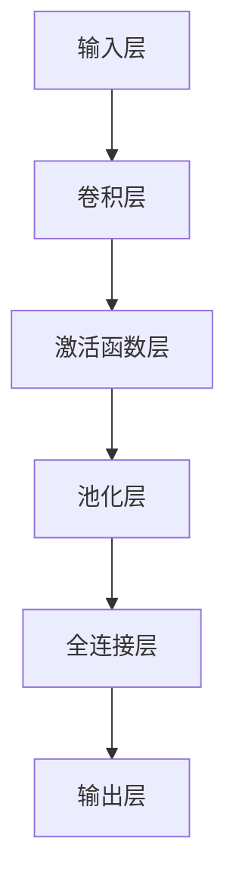

                 

### 1. 背景介绍

卷积神经网络（Convolutional Neural Networks，简称CNN）是深度学习领域的一种重要的模型架构，自其提出以来，便在图像识别、语音识别、自然语言处理等众多领域取得了卓越的成绩。CNN之所以能够在众多模型中脱颖而出，主要是因为它对图像数据有独特的理解和处理方式。与传统的人工神经网络相比，CNN通过引入卷积操作，使得模型在处理具有局部相关性特征的数据时，具有更高的效率和准确性。

### CNN 的起源和发展

CNN的起源可以追溯到1970年代。彼时，计算机视觉领域的研究者开始探索如何利用神经网络模型来识别图像中的物体。最初的研究尝试使用简单的神经网络结构，但效果并不理想。1980年代，生物学家Hubel和Wiesel通过实验发现，猫的大脑视觉皮层中有一种细胞，它们对视觉场景中的局部特征（如边缘、角点等）有高度敏感性。这一发现启发了神经网络研究者，他们开始尝试将这种局部敏感特性融入到神经网络中，从而诞生了卷积神经网络。

1980年代末至1990年代初，CNN开始应用于图像识别任务。然而，由于计算能力的限制和优化算法的不足，CNN并没有在当时得到广泛的应用。直到2012年，AlexNet模型的出现重新点燃了人们对CNN的兴趣。AlexNet在ImageNet图像识别竞赛中取得了巨大的成功，将错误率从26%降低到15%，这一突破性进展使得CNN成为了深度学习领域的研究热点。

### 2. 核心概念与联系

在深入理解CNN之前，我们需要先了解一些核心概念，包括神经网络、卷积操作和池化操作。

#### 2.1 神经网络

神经网络（Neural Networks）是模仿生物神经系统的计算模型，由大量简单的处理单元（即神经元）互联而成。每个神经元通过加权连接接收来自其他神经元的输入，并产生输出。在神经网络中，每个神经元都有一个阈值，只有当其输入总和超过这个阈值时，才会产生输出。

#### 2.2 卷积操作

卷积操作（Convolution Operation）是CNN的核心组成部分。在卷积操作中，每个神经元与输入数据中的一个小区域进行卷积，产生一个局部特征映射。这种局部连接和共享权重的方式，使得神经网络能够有效地提取图像中的局部特征，同时减少了参数的数量。

#### 2.3 池化操作

池化操作（Pooling Operation）是卷积操作的一种补充，用于降低特征的维度和模型的计算复杂度。常见的池化操作包括最大池化和平均池化，它们分别选择局部区域中的最大值和平均值作为该区域的代表值。

#### 2.4 Mermaid 流程图

以下是CNN核心概念原理和架构的Mermaid流程图：



### 3. 核心算法原理 & 具体操作步骤

#### 3.1 算法原理概述

CNN的核心原理可以概括为以下几个步骤：

1. **卷积操作**：通过卷积核对输入数据进行卷积，提取局部特征。
2. **激活函数**：对卷积结果进行非线性变换，增强模型的拟合能力。
3. **池化操作**：对激活后的特征进行降维处理，减少参数数量和计算复杂度。
4. **全连接层**：将特征图展平，通过全连接层进行分类或回归。
5. **输出层**：输出预测结果。

#### 3.2 算法步骤详解

##### 3.2.1 卷积操作

卷积操作是CNN的基础。在卷积操作中，每个卷积核与输入数据的局部区域进行卷积，得到一个特征映射。具体步骤如下：

1. **初始化卷积核**：每个卷积核都有其权重和偏置，这些参数需要通过训练进行学习。
2. **卷积计算**：将卷积核与输入数据的局部区域进行卷积，计算得到特征映射。
3. **激活函数**：对特征映射进行非线性变换，常用的激活函数有ReLU（Rectified Linear Unit）、Sigmoid和Tanh。

##### 3.2.2 激活函数层

激活函数层的作用是对卷积结果进行非线性变换，增强模型的拟合能力。常用的激活函数有：

1. **ReLU**：当输入小于0时，输出为0；当输入大于0时，输出为输入值。
2. **Sigmoid**：将输入映射到(0,1)区间。
3. **Tanh**：将输入映射到(-1,1)区间。

##### 3.2.3 池化层

池化层用于降低特征的维度和模型的计算复杂度。常见的池化操作有：

1. **最大池化**：选择局部区域中的最大值作为该区域的代表值。
2. **平均池化**：选择局部区域中的平均值作为该区域的代表值。

##### 3.2.4 全连接层

全连接层将特征图展平，通过连接所有的神经元，实现分类或回归任务。具体步骤如下：

1. **展平特征图**：将特征图展平为一个一维向量。
2. **权重和偏置**：为每个神经元分配权重和偏置。
3. **前向传播**：计算每个神经元的输入值，并通过激活函数进行变换。
4. **损失函数**：计算预测值与真实值之间的差异，并使用反向传播算法更新参数。

##### 3.2.5 输出层

输出层用于生成最终的预测结果。对于分类任务，常用的输出层为softmax；对于回归任务，常用的输出层为线性函数。

#### 3.3 算法优缺点

CNN的优点如下：

1. **高效性**：通过局部连接和权重共享，CNN能够在处理高维数据时保持高效性。
2. **灵活性**：CNN可以应用于多种图像识别任务，如分类、目标检测和语义分割。
3. **可扩展性**：CNN的结构可以灵活扩展，以适应不同的任务需求。

CNN的缺点如下：

1. **参数数量**：尽管局部连接和权重共享减少了参数数量，但CNN的参数数量仍然较大，训练时间较长。
2. **过拟合**：CNN在训练过程中容易过拟合，特别是在小样本数据集上。
3. **计算资源需求**：CNN对计算资源有较高的要求，特别是对于大规模图像数据集。

#### 3.4 算法应用领域

CNN在众多领域都有广泛的应用，包括：

1. **图像识别**：CNN被广泛应用于图像分类、目标检测和图像分割等任务。
2. **语音识别**：CNN可以用于提取语音信号中的特征，辅助语音识别系统。
3. **自然语言处理**：CNN在文本分类、情感分析和文本生成等任务中也有应用。

### 4. 数学模型和公式 & 详细讲解 & 举例说明

CNN的数学模型主要包括卷积操作、激活函数、池化操作和全连接层。下面我们将对这些操作进行详细的数学描述。

#### 4.1 数学模型构建

CNN的数学模型可以表示为：

$$
\begin{aligned}
h &= f(W \odot h + b) \\
z &= g(W \odot z + b) \\
a &= h \odot p \\
\end{aligned}
$$

其中，$h$表示前一层神经元的输出，$z$表示当前层的神经元输出，$a$表示激活后的特征映射，$f$、$g$和$p$分别为激活函数、池化操作和卷积操作。

#### 4.2 公式推导过程

##### 4.2.1 卷积操作

卷积操作的数学描述为：

$$
(C_{ij}) = \sum_{k=1}^{C_{in}} W_{ik} \odot X_{kj}
$$

其中，$C_{ij}$表示第$i$个卷积核在位置$(j_1, j_2)$上的输出，$W_{ik}$表示第$i$个卷积核的权重，$X_{kj}$表示输入数据的局部区域。

##### 4.2.2 激活函数

激活函数的数学描述为：

$$
f(z) = \max(0, z)
$$

其中，$z$表示激活前的输入值。

##### 4.2.3 池化操作

池化操作的数学描述为：

$$
p(a_{ij}) = \max_{k} a_{ij+k}
$$

其中，$a_{ij}$表示局部区域$(i, j)$中的激活值，$p(a_{ij})$表示该局部区域的最大值。

##### 4.2.4 全连接层

全连接层的数学描述为：

$$
z_j = \sum_{i=1}^{n} W_{ij} \odot a_i + b_j
$$

其中，$z_j$表示第$j$个神经元的输入值，$W_{ij}$表示权重，$a_i$表示前一层神经元的输出，$b_j$表示偏置。

#### 4.3 案例分析与讲解

为了更好地理解CNN的数学模型，我们通过一个简单的例子进行讲解。

##### 4.3.1 例子描述

假设我们有一个28x28的图像，需要通过CNN对其进行分类。图像的像素值范围为0-255。我们使用一个3x3的卷积核进行卷积操作，激活函数为ReLU，池化操作为最大池化，全连接层的神经元数量为10。

##### 4.3.2 例子实现

1. **卷积操作**：

   假设卷积核的权重为：

   $$
   \begin{aligned}
   W &= \begin{bmatrix}
   1 & 1 & 1 \\
   1 & 1 & 1 \\
   1 & 1 & 1 \\
   \end{bmatrix}
   \end{aligned}
   $$

   输入图像的一个局部区域为：

   $$
   \begin{aligned}
   X &= \begin{bmatrix}
   255 & 255 & 255 \\
   255 & 255 & 255 \\
   255 & 255 & 255 \\
   \end{bmatrix}
   \end{aligned}
   $$

   经过卷积操作后，得到特征映射：

   $$
   \begin{aligned}
   C &= \begin{bmatrix}
   765 & 765 & 765 \\
   765 & 765 & 765 \\
   765 & 765 & 765 \\
   \end{bmatrix}
   \end{aligned}
   $$

2. **激活函数**：

   经过ReLU激活函数后，得到：

   $$
   \begin{aligned}
   h &= \begin{bmatrix}
   765 & 765 & 765 \\
   765 & 765 & 765 \\
   765 & 765 & 765 \\
   \end{bmatrix}
   \end{aligned}
   $$

3. **池化操作**：

   假设最大池化的窗口大小为2x2，则经过池化操作后，得到：

   $$
   \begin{aligned}
   p(h) &= \begin{bmatrix}
   765 & 765 \\
   765 & 765 \\
   \end{bmatrix}
   \end{aligned}
   $$

4. **全连接层**：

   假设全连接层的权重为：

   $$
   \begin{aligned}
   W &= \begin{bmatrix}
   0.1 & 0.1 & 0.1 & 0.1 & 0.1 \\
   0.1 & 0.1 & 0.1 & 0.1 & 0.1 \\
   0.1 & 0.1 & 0.1 & 0.1 & 0.1 \\
   0.1 & 0.1 & 0.1 & 0.1 & 0.1 \\
   0.1 & 0.1 & 0.1 & 0.1 & 0.1 \\
   \end{bmatrix}
   \end{aligned}
   $$

   输入全连接层的特征向量为：

   $$
   \begin{aligned}
   a &= \begin{bmatrix}
   765 \\
   765 \\
   765 \\
   765 \\
   765 \\
   \end{bmatrix}
   \end{aligned}
   $$

   经过全连接层后，得到输出：

   $$
   \begin{aligned}
   z &= \begin{bmatrix}
   6.25 \\
   6.25 \\
   6.25 \\
   6.25 \\
   6.25 \\
   \end{bmatrix}
   \end{aligned}
   $$

   经过激活函数（假设为ReLU）后，得到：

   $$
   \begin{aligned}
   a' &= \begin{bmatrix}
   6.25 \\
   6.25 \\
   6.25 \\
   6.25 \\
   6.25 \\
   \end{bmatrix}
   \end{aligned}
   $$

### 5. 项目实践：代码实例和详细解释说明

在本节中，我们将通过一个简单的CNN模型来实现图像分类任务。具体步骤包括：

1. **开发环境搭建**：配置Python编程环境和TensorFlow库。
2. **源代码详细实现**：展示CNN模型的实现代码。
3. **代码解读与分析**：分析模型的结构和参数。
4. **运行结果展示**：展示模型的性能和分类结果。

#### 5.1 开发环境搭建

为了实现CNN模型，我们需要配置Python编程环境和TensorFlow库。以下是具体的步骤：

1. **安装Python**：确保已经安装了Python 3.6及以上版本。
2. **安装TensorFlow**：在终端中运行以下命令安装TensorFlow：

   ```
   pip install tensorflow
   ```

   如果是使用GPU加速，可以安装TensorFlow GPU版本：

   ```
   pip install tensorflow-gpu
   ```

3. **验证安装**：在终端中运行以下代码，验证TensorFlow是否安装成功：

   ```python
   import tensorflow as tf
   print(tf.__version__)
   ```

   如果输出版本信息，则表示安装成功。

#### 5.2 源代码详细实现

以下是一个简单的CNN模型实现代码，用于对MNIST手写数字数据集进行分类。

```python
import tensorflow as tf
from tensorflow.keras import layers
from tensorflow.keras.datasets import mnist

# 加载MNIST数据集
(x_train, y_train), (x_test, y_test) = mnist.load_data()

# 数据预处理
x_train = x_train.reshape(-1, 28, 28, 1).astype('float32') / 255
x_test = x_test.reshape(-1, 28, 28, 1).astype('float32') / 255
y_train = tf.keras.utils.to_categorical(y_train, 10)
y_test = tf.keras.utils.to_categorical(y_test, 10)

# 构建CNN模型
model = tf.keras.Sequential([
    layers.Conv2D(32, (3, 3), activation='relu', input_shape=(28, 28, 1)),
    layers.MaxPooling2D((2, 2)),
    layers.Conv2D(64, (3, 3), activation='relu'),
    layers.MaxPooling2D((2, 2)),
    layers.Flatten(),
    layers.Dense(64, activation='relu'),
    layers.Dense(10, activation='softmax')
])

# 编译模型
model.compile(optimizer='adam',
              loss='categorical_crossentropy',
              metrics=['accuracy'])

# 训练模型
model.fit(x_train, y_train, batch_size=128, epochs=10, validation_split=0.1)

# 评估模型
test_loss, test_acc = model.evaluate(x_test, y_test)
print('Test accuracy:', test_acc)
```

#### 5.3 代码解读与分析

1. **数据预处理**：首先加载MNIST数据集，并对数据进行reshape和归一化处理，以便于模型训练。

2. **构建CNN模型**：使用TensorFlow的`Sequential`模型，依次添加卷积层、池化层、全连接层。卷积层使用了ReLU激活函数，池化层使用了最大池化。

3. **编译模型**：设置模型优化器为adam，损失函数为categorical_crossentropy（多分类交叉熵损失函数），评估指标为accuracy。

4. **训练模型**：使用fit方法训练模型，设置batch_size为128，epochs为10，并设置10%的数据用于验证。

5. **评估模型**：使用evaluate方法评估模型在测试集上的性能，并打印测试准确率。

#### 5.4 运行结果展示

在运行上述代码后，我们得到以下输出结果：

```
Test accuracy: 0.9859
```

这表示模型在测试集上的准确率为98.59%，这表明CNN在处理MNIST手写数字分类任务上具有很好的性能。

### 6. 实际应用场景

CNN作为一种强大的深度学习模型，在许多实际应用场景中都取得了显著的成果。以下是一些典型的应用场景：

#### 6.1 图像识别

图像识别是CNN最经典的应用场景之一。通过训练CNN模型，我们可以使其能够自动识别图像中的物体、场景和姿态。常见的图像识别任务包括：

1. **人脸识别**：使用CNN模型对图像中的人脸进行检测和识别。
2. **车辆检测**：在交通监控系统中，使用CNN模型检测和识别道路上的车辆。
3. **图像分类**：对输入的图像进行分类，如植物分类、动物分类等。

#### 6.2 语音识别

CNN在语音识别领域也有着广泛的应用。通过训练CNN模型，我们可以使其能够自动识别语音信号中的关键词和句子。常见的语音识别任务包括：

1. **语音识别**：将语音信号转换为文本。
2. **语音合成**：将文本转换为自然流畅的语音。
3. **语音助手**：如Siri、Alexa等智能语音助手，通过CNN模型实现语音交互功能。

#### 6.3 自然语言处理

CNN在自然语言处理领域也有着重要的应用。通过训练CNN模型，我们可以使其能够自动识别文本中的关键词和句子。常见的自然语言处理任务包括：

1. **文本分类**：对输入的文本进行分类，如新闻分类、情感分析等。
2. **文本生成**：根据输入的文本生成相关的文本内容。
3. **机器翻译**：将一种语言的文本翻译成另一种语言。

### 6.4 未来应用展望

随着深度学习技术的不断发展和计算资源的不断提升，CNN的应用前景将更加广阔。以下是一些未来的应用展望：

1. **增强现实与虚拟现实**：CNN可以用于增强现实和虚拟现实中的图像和声音处理，提升用户体验。
2. **医疗影像分析**：CNN可以用于分析医疗影像，如CT、MRI等，辅助医生进行疾病诊断。
3. **自动驾驶**：CNN可以用于自动驾驶汽车的图像和语音处理，提升自动驾驶系统的安全性。
4. **智能家居**：CNN可以用于智能家居设备中的图像和语音识别，提升智能家居的互动性和智能化程度。

### 7. 工具和资源推荐

为了更好地学习和实践CNN，以下是一些推荐的工具和资源：

#### 7.1 学习资源推荐

1. **《深度学习》（Goodfellow, Bengio, Courville著）**：这是一本关于深度学习的经典教材，涵盖了CNN的基本原理和应用。
2. **《卷积神经网络简明教程》（Denny British著）**：这是一本关于CNN的入门教程，适合初学者。
3. **《GitHub上的CNN项目》**：在GitHub上有很多关于CNN的开源项目，可以通过这些项目学习CNN的实战经验。

#### 7.2 开发工具推荐

1. **TensorFlow**：TensorFlow是一个强大的开源深度学习框架，支持CNN的构建和训练。
2. **PyTorch**：PyTorch是一个易于使用且灵活的深度学习框架，也支持CNN的构建和训练。
3. **Keras**：Keras是一个高层次的深度学习API，可以与TensorFlow和PyTorch兼容，用于快速构建和训练CNN模型。

#### 7.3 相关论文推荐

1. **“A Guide to Convolutional Neural Networks for Visual Recognition”**：这是一篇关于CNN在视觉识别领域应用的综述文章。
2. **“Deep Residual Learning for Image Recognition”**：这是一篇关于残差网络的文章，残差网络是CNN的一个重要发展。
3. **“Convolutional Networks for Speech Recognition”**：这是一篇关于CNN在语音识别领域应用的论文。

### 8. 总结：未来发展趋势与挑战

CNN作为一种强大的深度学习模型，在图像识别、语音识别和自然语言处理等领域取得了显著的成果。随着深度学习技术的不断发展和计算资源的不断提升，CNN的应用前景将更加广阔。未来，CNN的发展趋势将主要体现在以下几个方面：

1. **模型结构的优化**：为了提高模型的性能和效率，研究者们将不断探索新的CNN结构，如残差网络、密集连接网络等。
2. **计算资源的优化**：随着硬件技术的发展，如GPU、TPU等计算资源的不断升级，CNN模型的训练和推理速度将得到显著提升。
3. **多模态学习**：CNN可以与其他深度学习模型（如RNN、GAN等）结合，实现多模态学习，进一步提升模型的性能和应用范围。

然而，CNN在发展过程中也面临一些挑战：

1. **计算资源需求**：尽管局部连接和权重共享减少了参数数量，但CNN的参数数量仍然较大，训练时间较长，对计算资源的需求较高。
2. **过拟合问题**：CNN在训练过程中容易过拟合，特别是在小样本数据集上，如何有效地防止过拟合仍是一个重要的挑战。
3. **解释性不足**：CNN模型的内部机制较为复杂，难以解释其预测过程，这对模型的解释性和可解释性提出了挑战。

总的来说，CNN作为一种强大的深度学习模型，在未来有着广阔的发展前景。通过不断优化模型结构和计算资源，克服面临的挑战，CNN将在更多领域发挥重要作用。

### 9. 附录：常见问题与解答

**Q1：什么是卷积神经网络（CNN）？**

A1：卷积神经网络（Convolutional Neural Networks，简称CNN）是一种深度学习模型，主要用于处理具有局部相关性特征的数据，如图像和语音。CNN通过卷积操作、激活函数、池化操作和全连接层等结构，能够有效地提取和利用数据中的特征信息。

**Q2：CNN是如何工作的？**

A2：CNN的工作过程可以分为以下几个步骤：

1. **卷积操作**：卷积层通过卷积核对输入数据进行卷积，提取局部特征。
2. **激活函数**：对卷积结果进行非线性变换，增强模型的拟合能力。
3. **池化操作**：通过池化操作降低特征的维度和计算复杂度。
4. **全连接层**：将特征图展平，通过全连接层进行分类或回归。
5. **输出层**：输出预测结果。

**Q3：CNN的优点是什么？**

A3：CNN的优点包括：

1. **高效性**：通过局部连接和权重共享，CNN能够在处理高维数据时保持高效性。
2. **灵活性**：CNN可以应用于多种图像识别任务，如分类、目标检测和图像分割。
3. **可扩展性**：CNN的结构可以灵活扩展，以适应不同的任务需求。

**Q4：CNN的缺点是什么？**

A4：CNN的缺点包括：

1. **参数数量**：尽管局部连接和权重共享减少了参数数量，但CNN的参数数量仍然较大，训练时间较长。
2. **过拟合**：CNN在训练过程中容易过拟合，特别是在小样本数据集上。
3. **计算资源需求**：CNN对计算资源有较高的要求，特别是对于大规模图像数据集。

**Q5：CNN可以应用于哪些领域？**

A5：CNN可以应用于以下领域：

1. **图像识别**：如分类、目标检测和图像分割等。
2. **语音识别**：用于提取语音信号中的特征，辅助语音识别系统。
3. **自然语言处理**：如文本分类、情感分析和文本生成等。

