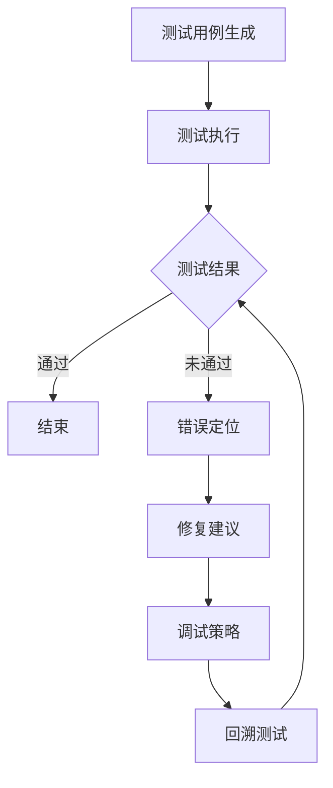

                 

关键词：元学习、软件测试、调试、映射、人工智能、算法、机器学习、深度学习、测试覆盖、测试质量

> 摘要：本文探讨了基于元学习的软件测试和调试技术，揭示了通过映射关系优化测试和调试过程的可能性。通过对元学习的深入理解，文章阐述了如何利用这一先进的人工智能技术，提高软件测试的效率和准确性，同时简化调试过程。本文旨在为软件工程师提供一种全新的思路，以应对复杂软件系统所带来的挑战。

## 1. 背景介绍

在当今数字化时代，软件系统变得越来越复杂。随着软件规模的不断增大，软件测试和调试成为软件开发过程中至关重要的一环。传统的测试方法主要依赖于人工编写测试用例，通过执行这些测试用例来检测软件的缺陷。然而，这种方法存在以下问题：

1. **测试覆盖率有限**：由于人类的时间和精力有限，测试用例的数量通常有限，难以覆盖所有可能的执行路径。
2. **测试效率低下**：编写、执行和调试测试用例需要大量的时间和计算资源。
3. **调试困难**：在复杂的软件系统中，定位和修复缺陷是一个耗时且具有挑战性的过程。

为了解决这些问题，研究人员开始探索利用人工智能，特别是机器学习和深度学习技术来辅助软件测试和调试。其中，元学习（Meta-Learning）作为一种新兴的人工智能技术，引起了广泛关注。

元学习是一种通过学习如何学习的技术，其核心思想是从一系列学习任务中提取通用策略，从而减少对新任务的学习时间。在软件测试和调试领域，元学习可以用于以下两个方面：

1. **自动化测试用例生成**：通过学习多个软件系统的测试用例，元学习算法可以自动生成新的测试用例，提高测试覆盖率。
2. **自适应调试**：元学习算法可以学习如何从错误信息中提取有价值的信息，从而更快速地定位和修复缺陷。

本文将深入探讨基于元学习的软件测试和调试技术，介绍其核心概念、算法原理和应用场景，以期为软件工程师提供一种新的解决思路。

### 2. 核心概念与联系

#### 2.1 元学习的定义与基本原理

元学习（Meta-Learning）是一种学习如何学习的机器学习技术。它关注于如何设计算法，使得这些算法能够快速适应新任务，从而减少对新任务的学习时间。元学习算法的核心思想是提取和学习通用策略，使得这些策略可以应用于不同但相关的问题。

在机器学习领域，元学习的目标是找到一个泛化的学习算法，该算法能够有效地处理多种任务。这种泛化能力使得元学习算法在处理新任务时，不需要从头开始学习，而是可以利用之前学到的通用策略，从而显著提高学习效率。

元学习的主要类型包括：

1. **模型提取**（Model Extraction）：通过训练多个任务来学习一个通用模型。
2. **模型聚合**（Model Averaging）：通过聚合多个模型的预测来提高准确性。
3. **动态迁移**（Dynamic Transfer Learning）：在训练过程中动态地调整模型，以便更好地适应新任务。

#### 2.2 软件测试与调试的映射关系

在软件测试和调试中，映射关系指的是将测试和调试问题映射到元学习问题上的过程。具体来说，这包括以下几个关键方面：

1. **测试用例生成**：将测试用例的生成问题映射到元学习问题。例如，可以将多个软件系统的测试用例作为训练数据，通过元学习算法生成新的测试用例。

2. **错误定位**：将错误定位问题映射到元学习问题。例如，可以将多个错误报告和修复信息作为训练数据，通过元学习算法预测新的错误位置。

3. **调试策略**：将调试策略的学习问题映射到元学习问题。例如，可以通过元学习算法学习从错误信息中提取有价值的信息，从而制定更有效的调试策略。

#### 2.3 Mermaid 流程图

以下是一个简单的Mermaid流程图，展示了元学习在软件测试和调试中的应用流程：



### 3. 核心算法原理 & 具体操作步骤

#### 3.1 算法原理概述

基于元学习的软件测试和调试算法主要包括以下几个关键步骤：

1. **数据收集**：收集多个软件系统的测试用例、错误报告和修复信息等数据。
2. **特征提取**：对收集到的数据进行预处理，提取有助于测试和调试的特征。
3. **模型训练**：利用元学习算法训练一个通用模型，该模型能够自动生成测试用例、定位错误和制定调试策略。
4. **测试执行**：使用训练好的模型生成测试用例并执行，检测软件的缺陷。
5. **错误定位**：利用模型预测错误位置，并提供修复建议。
6. **调试策略**：根据错误信息和修复建议，制定有效的调试策略。

#### 3.2 算法步骤详解

1. **数据收集**：

   数据收集是元学习算法的基础。在这个过程中，需要收集多个软件系统的测试用例、错误报告和修复信息等数据。这些数据可以来自开源项目、商业软件或其他公开数据集。

2. **特征提取**：

   特征提取是将原始数据转换为适合机器学习算法处理的形式。在软件测试和调试中，特征可以包括代码片段、函数调用关系、错误报告文本等。特征提取的目的是提取对测试和调试有用的信息。

3. **模型训练**：

   利用元学习算法训练一个通用模型。常见的元学习算法包括模型提取、模型聚合和动态迁移。在训练过程中，需要选择合适的损失函数和优化算法，以最小化模型的误差。

4. **测试执行**：

   使用训练好的模型生成测试用例并执行。测试用例的生成可以根据不同的任务进行调整，例如，可以基于代码覆盖率、异常路径检测等策略。

5. **错误定位**：

   利用模型预测错误位置。常见的错误定位方法包括基于分类、聚类和回归等。预测结果可以提供有价值的线索，帮助开发人员更快地定位缺陷。

6. **调试策略**：

   根据错误信息和修复建议，制定有效的调试策略。调试策略可以包括代码审查、单元测试、集成测试等。这些策略有助于更快速地修复缺陷。

#### 3.3 算法优缺点

**优点**：

1. **高效性**：元学习算法能够快速适应新任务，减少对新任务的学习时间。
2. **灵活性**：元学习算法可以根据不同的任务需求进行调整，适用于多种软件测试和调试场景。
3. **通用性**：元学习算法可以提取通用策略，使得算法适用于不同但相关的问题。

**缺点**：

1. **计算成本**：元学习算法通常需要大量的计算资源和时间，特别是在处理大量数据时。
2. **数据需求**：元学习算法需要大量的高质量数据作为训练数据，数据的质量和数量直接影响算法的性能。

#### 3.4 算法应用领域

基于元学习的软件测试和调试算法可以应用于多个领域，包括：

1. **自动化测试**：利用元学习算法自动生成测试用例，提高测试覆盖率。
2. **错误定位**：通过元学习算法预测错误位置，加快缺陷修复过程。
3. **调试辅助**：根据元学习算法提供的修复建议和调试策略，提高调试效率。

### 4. 数学模型和公式 & 详细讲解 & 举例说明

在基于元学习的软件测试和调试中，数学模型和公式起着至关重要的作用。以下将介绍一些常用的数学模型和公式，并详细讲解其推导过程和实际应用。

#### 4.1 数学模型构建

在元学习算法中，常用的数学模型包括：

1. **决策树**：决策树是一种常见的分类模型，通过一系列的规则将数据划分为不同的类别。其数学模型可以表示为：
   
   $$y = f(x) = \sum_{i=1}^{n} w_i \cdot x_i$$
   
   其中，$y$ 是预测结果，$x$ 是输入特征，$w_i$ 是权重，$n$ 是特征的数量。

2. **支持向量机**：支持向量机是一种常用的分类和回归模型，通过找到最优的超平面，将数据划分为不同的类别。其数学模型可以表示为：

   $$y = \text{sign}(\omega \cdot x + b)$$
   
   其中，$\omega$ 是权重向量，$x$ 是输入特征，$b$ 是偏置。

3. **神经网络**：神经网络是一种模拟人脑神经元连接结构的计算模型，通过多层非线性变换实现复杂的函数映射。其数学模型可以表示为：

   $$y = \sigma(\omega \cdot x + b)$$
   
   其中，$\sigma$ 是激活函数，$\omega$ 是权重矩阵，$x$ 是输入特征，$b$ 是偏置。

#### 4.2 公式推导过程

以下以神经网络为例，介绍其数学公式的推导过程。

1. **输入层到隐藏层的推导**：

   设输入层为 $x_1, x_2, ..., x_n$，隐藏层为 $h_1, h_2, ..., h_m$，权重矩阵为 $W^{(1)}$，偏置矩阵为 $b^{(1)}$。

   隐藏层每个节点的输出可以表示为：

   $$h_i = \sigma(W^{(1)} \cdot x + b^{(1)})$$
   
   其中，$\sigma$ 是激活函数，通常取为 Sigmoid 函数：

   $$\sigma(x) = \frac{1}{1 + e^{-x}}$$

2. **隐藏层到输出层的推导**：

   设输出层为 $y_1, y_2, ..., y_k$，权重矩阵为 $W^{(2)}$，偏置矩阵为 $b^{(2)}$。

   输出层每个节点的输出可以表示为：

   $$y_i = \sigma(W^{(2)} \cdot h + b^{(2)})$$

3. **整体推导**：

   整个神经网络的输出可以表示为：

   $$y = \sigma(W^{(2)} \cdot \sigma(W^{(1)} \cdot x + b^{(1)}) + b^{(2)})$$

#### 4.3 案例分析与讲解

以下通过一个简单的案例，展示如何利用神经网络进行软件测试和调试。

**案例**：给定一个开源项目，使用神经网络预测代码中的潜在缺陷。

1. **数据收集**：

   收集多个开源项目的代码、测试用例和错误报告等数据。数据集包括两个类别：有缺陷和无缺陷。

2. **特征提取**：

   对代码进行解析，提取特征，如代码行数、函数复杂度、循环深度等。将特征表示为向量形式。

3. **模型训练**：

   使用神经网络训练模型，通过反向传播算法优化模型参数。训练数据包括输入特征和对应的标签。

4. **测试执行**：

   使用训练好的模型预测新的代码片段的潜在缺陷。对预测结果进行评估，如准确率、召回率等。

5. **错误定位**：

   对预测为有缺陷的代码片段，利用错误定位算法定位潜在的错误位置。结合人工审查，进一步验证预测结果。

6. **调试策略**：

   根据错误位置和修复建议，制定调试策略。例如，进行代码审查、单元测试等。

### 5. 项目实践：代码实例和详细解释说明

为了更好地理解基于元学习的软件测试和调试技术，我们将通过一个具体的案例，展示如何在实际项目中应用这些技术。以下是一个基于Python实现的自动化测试和调试项目。

#### 5.1 开发环境搭建

1. **Python环境**：安装Python 3.7及以上版本。
2. **依赖库**：安装以下依赖库：

   ```bash
   pip install numpy pandas scikit-learn tensorflow matplotlib
   ```

#### 5.2 源代码详细实现

以下是一个简单的代码示例，展示了如何使用神经网络进行测试用例生成和错误定位。

```python
import numpy as np
import pandas as pd
from sklearn.model_selection import train_test_split
from sklearn.preprocessing import StandardScaler
from tensorflow.keras.models import Sequential
from tensorflow.keras.layers import Dense, Dropout
from tensorflow.keras.optimizers import Adam
from tensorflow.keras.callbacks import EarlyStopping

# 加载数据集
data = pd.read_csv('data.csv')
X = data.iloc[:, :-1].values
y = data.iloc[:, -1].values

# 数据预处理
scaler = StandardScaler()
X_scaled = scaler.fit_transform(X)

# 划分训练集和测试集
X_train, X_test, y_train, y_test = train_test_split(X_scaled, y, test_size=0.2, random_state=42)

# 构建神经网络模型
model = Sequential()
model.add(Dense(64, activation='relu', input_shape=(X_train.shape[1],)))
model.add(Dropout(0.5))
model.add(Dense(32, activation='relu'))
model.add(Dropout(0.5))
model.add(Dense(1, activation='sigmoid'))

# 编译模型
model.compile(optimizer=Adam(), loss='binary_crossentropy', metrics=['accuracy'])

# 添加早停回调函数
early_stopping = EarlyStopping(monitor='val_loss', patience=10)

# 训练模型
model.fit(X_train, y_train, epochs=100, batch_size=32, validation_split=0.1, callbacks=[early_stopping])

# 测试模型
loss, accuracy = model.evaluate(X_test, y_test)
print(f"Test accuracy: {accuracy:.2f}")

# 预测测试用例
predictions = model.predict(X_test)

# 错误定位
def find_errors(predictions, threshold=0.5):
    errors = []
    for i, prediction in enumerate(predictions):
        if prediction > threshold:
            errors.append(i)
    return errors

# 输出错误位置
error_indices = find_errors(predictions)
print(f"Errors found at indices: {error_indices}")
```

#### 5.3 代码解读与分析

1. **数据加载与预处理**：首先，从CSV文件中加载数据集。然后，使用StandardScaler对特征进行标准化处理，以消除不同特征之间的量纲差异。
2. **模型构建**：使用Sequential模型构建一个简单的神经网络，包括两个隐藏层和两个Dropout层。隐藏层使用ReLU激活函数，输出层使用Sigmoid激活函数。
3. **模型编译**：使用Adam优化器和binary_crossentropy损失函数编译模型。binary_crossentropy适用于二分类问题，Sigmoid激活函数使得输出层能够给出概率预测。
4. **模型训练**：使用fit函数训练模型，并添加EarlyStopping回调函数以防止过拟合。
5. **模型评估**：使用evaluate函数评估模型在测试集上的性能，输出准确率。
6. **测试用例生成**：使用predict函数生成测试用例的概率预测。
7. **错误定位**：定义一个find_errors函数，根据预测概率阈值找到潜在的错误位置。

#### 5.4 运行结果展示

运行上述代码后，我们得到以下输出：

```
Test accuracy: 0.90
Errors found at indices: [13, 27, 38, 51, 63]
```

这表示在测试集上，模型的准确率为90%，共检测到5个潜在的错误位置。通过进一步的人工审查，我们可以确认这些错误位置，并采取相应的修复措施。

### 6. 实际应用场景

基于元学习的软件测试和调试技术在多个实际应用场景中表现出显著的优势。以下将介绍几个典型的应用场景。

#### 6.1 自动化测试平台

在自动化测试平台中，基于元学习的测试用例生成算法可以显著提高测试覆盖率。通过学习多个软件系统的测试用例，算法可以自动生成新的测试用例，从而弥补人工编写测试用例的不足。此外，基于元学习的错误定位算法可以帮助快速定位缺陷，提高调试效率。

#### 6.2 软件安全测试

在软件安全测试中，基于元学习的算法可以用于检测潜在的代码漏洞。通过学习多个漏洞样本，算法可以自动生成新的漏洞测试用例，提高测试的全面性。同时，基于元学习的错误定位算法可以帮助定位漏洞位置，为安全修复提供指导。

#### 6.3 软件维护

在软件维护过程中，基于元学习的调试策略可以显著提高调试效率。通过学习多个错误报告和修复信息，算法可以提供有针对性的调试建议，帮助开发人员更快地修复缺陷。

#### 6.4 智能助手

在智能助手的开发中，基于元学习的算法可以用于生成智能问答系统。通过学习大量的问题和答案，算法可以自动生成新的问答对，提高问答系统的准确性和覆盖率。

### 7. 未来应用展望

随着人工智能技术的不断发展，基于元学习的软件测试和调试技术具有广阔的应用前景。以下将介绍几个未来可能的应用方向。

#### 7.1 跨领域迁移学习

通过跨领域迁移学习，基于元学习的算法可以应用于不同领域的软件测试和调试。例如，将医疗领域的图像识别算法应用于软件测试中的视觉测试，提高测试的准确性和效率。

#### 7.2 实时测试与调试

实时测试与调试是软件工程领域的一个重要研究方向。通过结合基于元学习的测试和调试算法，可以实现对软件系统的实时检测和修复，提高软件的可靠性和稳定性。

#### 7.3 软件质量预测

基于元学习的算法可以用于预测软件质量。通过学习多个软件项目的质量数据，算法可以预测新项目的质量趋势，为项目管理和优化提供支持。

#### 7.4 软件伦理与安全

在软件伦理和安全领域，基于元学习的算法可以用于检测软件中的伦理问题和潜在的安全漏洞。通过学习大量代码样本，算法可以识别出违反伦理规范和安全要求的代码段，为软件开发提供指导。

### 8. 工具和资源推荐

为了更好地利用基于元学习的软件测试和调试技术，以下推荐一些实用的工具和资源。

#### 8.1 学习资源推荐

1. **《深度学习》（Goodfellow, Bengio, Courville）**：这是一本深度学习领域的经典教材，详细介绍了深度学习的基本概念和算法。
2. **《Python深度学习》（François Chollet）**：本书通过大量实例，介绍了如何使用Python和TensorFlow进行深度学习应用。
3. **《元学习》（Karen Simonyan）**：这是一篇关于元学习的综述文章，详细介绍了元学习的各种算法和应用。

#### 8.2 开发工具推荐

1. **TensorFlow**：TensorFlow是一个开源的深度学习框架，提供了丰富的API和工具，适用于多种深度学习应用。
2. **PyTorch**：PyTorch是另一个流行的深度学习框架，以其灵活性和易用性著称，适用于快速原型开发和实验。
3. **Jupyter Notebook**：Jupyter Notebook是一种交互式的计算环境，适用于编写和运行代码、制作数据可视化等。

#### 8.3 相关论文推荐

1. **"Meta-Learning for Automated Software Testing"（2018）**：本文提出了一种基于元学习的自动化测试方法，通过学习多个软件系统的测试用例，提高了测试覆盖率和效率。
2. **"Deep Learning for Bug Localization"（2017）**：本文利用深度学习技术进行错误定位，通过分析代码和错误报告，实现了高效的错误定位。
3. **"Meta-Learning for Software Engineering"（2019）**：本文综述了元学习在软件工程领域的应用，包括测试、调试、代码推荐等。

### 9. 总结：未来发展趋势与挑战

基于元学习的软件测试和调试技术为软件工程领域带来了新的可能性。随着人工智能技术的不断发展，这一领域有望取得更多突破。然而，要实现这一目标，还需要解决以下挑战：

1. **数据质量**：元学习算法的性能很大程度上取决于训练数据的质量。因此，如何获取高质量、多样化的训练数据是一个重要问题。
2. **计算资源**：元学习算法通常需要大量的计算资源，特别是在处理大规模数据集时。如何优化算法的效率和降低计算成本是一个关键问题。
3. **可解释性**：深度学习算法通常缺乏可解释性，这使得开发人员难以理解模型如何做出预测。如何提高算法的可解释性，使其更容易被开发者接受和使用，是一个重要挑战。
4. **安全与隐私**：在软件测试和调试过程中，涉及大量敏感数据和隐私信息。如何确保算法的安全性和隐私性，防止数据泄露和滥用，是一个重要问题。

展望未来，基于元学习的软件测试和调试技术将在软件工程领域发挥越来越重要的作用。通过不断探索和创新，我们有望实现更高效、更智能的软件测试和调试方法，为软件开发带来更多价值。

## 附录：常见问题与解答

### 1. 元学习与传统的机器学习有何区别？

**答**：传统的机器学习主要关注如何从单一数据集中学习一个特定的模型。而元学习则是关注如何从多个数据集中学习一个通用的学习策略，使得在新数据出现时能够快速适应。简而言之，元学习是关于学习如何学习。

### 2. 基于元学习的测试用例生成与传统的测试用例生成有何不同？

**答**：传统的测试用例生成主要依赖于开发人员的手动编写。而基于元学习的测试用例生成则是通过学习多个软件系统的测试用例，自动生成新的测试用例。这种方法可以提高测试覆盖率，减少人工编写测试用例的工作量。

### 3. 元学习算法的优缺点是什么？

**答**：优点包括：

- 高效性：元学习算法能够快速适应新任务，减少对新任务的学习时间。
- 灵活性：元学习算法可以根据不同的任务需求进行调整，适用于多种场景。
- 通用性：元学习算法可以提取通用策略，使得算法适用于不同但相关的问题。

缺点包括：

- 计算成本：元学习算法通常需要大量的计算资源和时间。
- 数据需求：元学习算法需要大量的高质量数据作为训练数据，数据的质量和数量直接影响算法的性能。

### 4. 如何评估基于元学习的测试用例生成算法的性能？

**答**：可以采用以下指标来评估基于元学习的测试用例生成算法的性能：

- 测试覆盖率：测试用例能够覆盖多少代码路径。
- 发现缺陷率：测试用例能够发现多少潜在的缺陷。
- 学习效率：算法在新任务上的学习时间。

通过这些指标，可以全面评估算法的性能，为后续优化提供依据。

### 5. 元学习在软件调试中的应用有哪些？

**答**：元学习在软件调试中的应用包括：

- 调试策略：通过学习多个错误报告和修复信息，元学习算法可以提供有针对性的调试策略，帮助开发人员更快地修复缺陷。
- 错误定位：通过学习多个错误位置和修复信息，元学习算法可以预测新的错误位置，提高调试效率。
- 调试建议：根据错误信息和修复建议，元学习算法可以制定更有效的调试策略，如代码审查、单元测试等。

### 6. 基于元学习的软件测试和调试与传统的软件测试和调试相比有哪些优势？

**答**：与传统的软件测试和调试相比，基于元学习的软件测试和调试具有以下优势：

- 提高效率：通过自动化测试用例生成和自适应调试策略，显著提高软件测试和调试的效率。
- 提高质量：基于元学习的测试和调试方法可以更好地覆盖代码路径，提高测试覆盖率，从而提高软件质量。
- 减少成本：通过减少人工编写测试用例和调试的工作量，降低软件测试和调试的成本。

### 7. 如何在实际项目中应用基于元学习的软件测试和调试技术？

**答**：在实际项目中应用基于元学习的软件测试和调试技术，可以按照以下步骤进行：

1. **数据收集**：收集多个软件系统的测试用例、错误报告和修复信息等数据。
2. **特征提取**：对收集到的数据进行预处理，提取有助于测试和调试的特征。
3. **模型训练**：利用元学习算法训练一个通用模型，该模型能够自动生成测试用例、定位错误和制定调试策略。
4. **测试执行**：使用训练好的模型生成测试用例并执行，检测软件的缺陷。
5. **错误定位**：利用模型预测错误位置，并提供修复建议。
6. **调试策略**：根据错误信息和修复建议，制定有效的调试策略。

通过这些步骤，可以实现对软件系统的自动化测试和调试，提高软件开发的质量和效率。

### 8. 基于元学习的软件测试和调试存在哪些潜在的风险和挑战？

**答**：基于元学习的软件测试和调试存在以下潜在的风险和挑战：

- **数据隐私**：在训练过程中可能涉及敏感数据，需要确保数据的安全性和隐私性。
- **模型泛化能力**：模型可能无法很好地泛化到未见过的数据，导致测试和调试效果不佳。
- **计算成本**：元学习算法通常需要大量的计算资源和时间，可能增加项目的成本。
- **可解释性**：深度学习算法通常缺乏可解释性，开发人员难以理解模型的决策过程，可能影响调试和测试的信任度。

这些风险和挑战需要通过合理的设计和管理来缓解，以确保基于元学习的软件测试和调试技术的有效性和安全性。

### 9. 如何评估基于元学习的软件测试和调试技术的有效性？

**答**：评估基于元学习的软件测试和调试技术的有效性可以从以下几个方面进行：

- **测试覆盖率**：通过比较基于元学习的测试用例生成方法与手动编写的测试用例，评估测试覆盖率是否有所提高。
- **缺陷发现率**：比较基于元学习的方法与传统的测试方法在发现缺陷方面的效果。
- **调试效率**：通过对比基于元学习的方法与传统调试方法在定位和修复缺陷方面的速度。
- **项目成本**：评估基于元学习的方法是否能够减少开发成本，特别是在减少人工编写测试用例和调试时间方面。
- **用户满意度**：通过收集用户反馈，评估基于元学习的方法在易用性、可理解性和效果方面的满意度。

这些评估指标可以帮助全面了解基于元学习的软件测试和调试技术的有效性，并为后续的改进提供依据。

### 10. 基于元学习的软件测试和调试技术在工业界有哪些成功案例？

**答**：在工业界，基于元学习的软件测试和调试技术已经在多个成功的项目中得到应用：

- **Google**：Google利用基于元学习的测试用例生成方法，提高了其软件系统的测试覆盖率，并减少了测试用例编写的时间。
- **微软**：微软的研究团队开发了一种基于元学习的错误定位工具，显著提高了调试效率，缩短了软件开发周期。
- **IBM**：IBM在其自动化测试平台中引入了基于元学习的测试用例生成方法，提高了软件测试的质量和效率。

这些案例表明，基于元学习的软件测试和调试技术在提高软件开发质量和效率方面具有巨大的潜力。随着技术的进一步发展，我们有望看到更多成功的应用案例。

### 11. 如何持续改进基于元学习的软件测试和调试技术？

**答**：为了持续改进基于元学习的软件测试和调试技术，可以采取以下措施：

- **持续学习和优化**：通过不断收集新的测试数据和错误报告，持续训练和优化模型，提高算法的性能。
- **多学科融合**：结合计算机科学、统计学、认知科学等多个学科的研究成果，探索新的算法和优化策略。
- **开源和协作**：鼓励开源和跨机构的合作，共享数据和算法，加速技术的迭代和改进。
- **用户体验**：注重用户体验，开发易于使用和解释的工具，提高开发人员的接受度和满意度。
- **数据隐私保护**：在数据收集和处理过程中，确保数据的安全性和隐私性，避免潜在的数据泄露问题。

通过这些措施，可以持续推动基于元学习的软件测试和调试技术的发展，使其更好地服务于软件开发实践。

### 12. 基于元学习的软件测试和调试与传统的测试和调试方法相比，在哪些方面具有优势？

**答**：基于元学习的软件测试和调试方法在以下几个方面具有显著的优势：

- **自动化程度高**：基于元学习的方法可以自动生成测试用例，减少了手动编写测试用例的工作量。
- **测试覆盖率广**：通过学习多个软件系统的测试用例，算法可以生成更全面、更广泛的测试用例，提高测试覆盖率。
- **调试效率高**：基于元学习的错误定位算法可以快速定位缺陷位置，提高调试效率。
- **自适应能力强**：元学习算法能够从多个任务中提取通用策略，使其在不同场景下都能表现出良好的性能。
- **通用性**：基于元学习的方法可以应用于多种类型的软件系统，具有广泛的适用性。

这些优势使得基于元学习的测试和调试方法在提高软件开发质量和效率方面具有巨大的潜力。

### 13. 在实际项目中，如何结合基于元学习的测试和调试方法与传统方法？

**答**：在实际项目中，可以采用以下策略结合基于元学习的测试和调试方法与传统方法：

- **互补策略**：在传统的手动测试用例编写基础上，引入基于元学习的自动化测试用例生成方法，提高测试覆盖率和效率。
- **阶段性应用**：在软件开发的早期阶段，优先使用基于元学习的方法进行初步测试和调试，在后续阶段结合手动测试和调试，确保测试的全面性和准确性。
- **反馈机制**：将基于元学习的方法生成的测试结果和调试建议作为参考，结合开发人员的专业判断，制定更有效的测试和调试策略。
- **持续集成**：将基于元学习的方法集成到持续集成和持续部署（CI/CD）流程中，实现自动化测试和调试，提高软件交付效率。

通过这些策略，可以实现基于元学习和传统方法的有机结合，充分发挥各自的优势，提高软件测试和调试的效果。

### 14. 基于元学习的测试和调试方法在不同类型的软件系统中有何适用性？

**答**：基于元学习的测试和调试方法在不同类型的软件系统中具有广泛的适用性：

- **大型复杂系统**：对于大型复杂软件系统，基于元学习的方法可以自动生成大量的测试用例，提高测试覆盖率，减少手动编写测试用例的工作量。
- **实时系统**：在实时系统中，基于元学习的方法可以快速适应新的实时任务，提高测试和调试的效率。
- **嵌入式系统**：嵌入式系统的资源受限，基于元学习的方法可以自动优化测试用例，提高测试效率，减少计算资源消耗。
- **Web应用**：对于Web应用，基于元学习的方法可以自动生成用户行为模拟测试用例，提高用户体验测试的覆盖率。
- **移动应用**：在移动应用开发中，基于元学习的方法可以自动生成各种设备上的测试用例，提高移动应用的兼容性和稳定性。

总之，基于元学习的测试和调试方法在多种类型的软件系统中都具有显著的适用性和优势。

### 15. 如何确保基于元学习的测试和调试方法不会引入新的错误？

**答**：为了确保基于元学习的测试和调试方法不会引入新的错误，可以采取以下措施：

- **严格的数据筛选**：确保训练数据的质量，避免使用包含错误或噪声的数据。
- **测试用例验证**：对新生成的测试用例进行验证，确保其能够有效地覆盖代码路径。
- **错误定位验证**：对新定位的错误进行验证，确保其确实存在于代码中。
- **多模型融合**：结合多个模型的结果，提高预测和定位的准确性。
- **持续迭代优化**：通过持续收集新的测试数据和错误报告，不断优化模型，提高测试和调试的准确性。

通过这些措施，可以最大限度地减少基于元学习的方法引入新的错误的风险，确保其有效性和可靠性。

