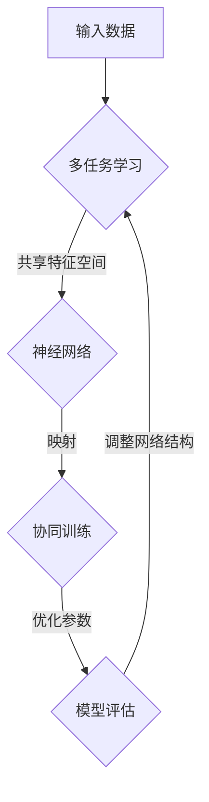

                 

关键词：多任务学习，神经网络，协同训练，映射，AI算法，深度学习，性能优化

> 摘要：本文深入探讨了多任务学习与神经网络的协同训练机制，揭示了它们在提高模型性能和泛化能力方面的巨大潜力。通过引入映射的概念，本文详细分析了多任务学习在神经网络中的应用，阐述了其核心算法原理、数学模型、具体操作步骤，并展示了在实际应用中的成功案例。最后，本文对未来的发展趋势与挑战进行了展望，为读者提供了全面的技术指南和资源推荐。

## 1. 背景介绍

在当今快速发展的信息技术时代，人工智能（AI）已经成为推动科技进步的重要力量。作为AI的核心组成部分，深度学习在图像识别、自然语言处理、语音识别等领域取得了显著的成果。然而，传统单任务学习模型在面对复杂、多变的实际问题时，往往表现出一定的局限性。为了克服这一挑战，多任务学习（Multi-Task Learning, MTL）应运而生。

多任务学习旨在同时训练多个相关任务，利用任务之间的共享信息，提高模型的整体性能和泛化能力。与单任务学习相比，多任务学习不仅可以提高任务的准确率，还可以减少模型参数，降低计算成本。近年来，随着神经网络技术的不断成熟，多任务学习与神经网络的协同训练（Co-Training）成为了一个研究热点。

多任务学习与神经网络的协同训练不仅有助于解决单任务学习模型在复杂场景下的局限性，还可以为实际应用提供更高效、更智能的解决方案。本文将从映射的角度出发，深入探讨多任务学习与神经网络的协同训练机制，为读者提供一扇了解这一前沿技术的窗口。

## 2. 核心概念与联系

### 2.1 多任务学习

多任务学习是一种训练多个相关任务的机器学习技术，其核心思想是共享模型参数，利用任务之间的共享信息，提高模型的整体性能和泛化能力。在多任务学习框架中，多个任务可以同时训练，从而实现资源共享和协同优化。

多任务学习的关键在于如何设计共享参数和任务权重，以充分利用任务之间的相关性。常见的多任务学习策略包括基于模型的共享（Model-Based Sharing）、基于特征的共享（Feature-Based Sharing）和基于任务的共享（Task-Based Sharing）。

### 2.2 神经网络

神经网络是一种模仿人脑结构和功能的计算模型，通过多层神经元节点之间的加权连接，实现对输入数据的处理和预测。神经网络的核心优势在于其强大的表达能力和自适应学习能力，使得它在许多领域（如图像识别、自然语言处理、语音识别等）取得了显著的成果。

在多任务学习场景中，神经网络可以作为底层计算单元，实现多个任务的共同训练。通过调整网络结构和参数，可以优化模型在各个任务上的表现。

### 2.3 多任务学习与神经网络的协同训练

多任务学习与神经网络的协同训练是一种结合多任务学习和神经网络优势的训练方法，旨在通过任务之间的信息共享和协同优化，提高模型的整体性能和泛化能力。

在多任务学习与神经网络的协同训练中，映射（Mapping）是一个关键概念。映射是指将不同任务的特征空间映射到共享的特征空间，使得任务之间的信息可以相互传递和利用。这种映射关系可以通过共享神经网络层来实现，从而实现任务之间的协同训练。

### 2.4 Mermaid 流程图

以下是多任务学习与神经网络的协同训练的 Mermaid 流程图：



在这个流程图中，输入数据经过多任务学习模块，生成共享的特征空间。神经网络通过映射关系将不同任务的特征映射到共享特征空间，实现协同训练。最后，通过模型评估和参数调整，优化模型性能。

## 3. 核心算法原理 & 具体操作步骤

### 3.1 算法原理概述

多任务学习与神经网络的协同训练算法基于共享参数和映射关系。具体来说，该算法通过以下步骤实现：

1. **数据预处理**：对输入数据进行预处理，包括数据清洗、归一化和特征提取。
2. **特征共享**：利用共享神经网络层，将不同任务的特征映射到共享的特征空间。
3. **协同训练**：在共享特征空间中，通过梯度下降等优化算法，同时训练多个任务。
4. **参数调整**：根据模型评估结果，调整网络结构和参数，优化模型性能。
5. **模型评估**：对训练完成的模型进行评估，包括准确率、召回率、F1值等指标。

### 3.2 算法步骤详解

1. **数据预处理**：首先，对输入数据进行预处理。数据清洗是为了去除噪声和异常值，归一化是为了将不同特征的范围统一，特征提取是为了提取关键信息。常见的预处理方法包括标准化、归一化、特征缩放等。

2. **特征共享**：在预处理完成后，利用共享神经网络层，将不同任务的特征映射到共享的特征空间。共享神经网络层可以是卷积层、全连接层等，具体取决于任务类型和数据特征。通过共享特征空间，任务之间的信息可以相互传递和利用。

3. **协同训练**：在共享特征空间中，通过梯度下降等优化算法，同时训练多个任务。在训练过程中，多个任务共享参数，从而实现协同优化。协同训练的关键在于如何平衡不同任务之间的权重，以充分利用任务之间的相关性。

4. **参数调整**：根据模型评估结果，调整网络结构和参数，优化模型性能。调整参数的方法包括反向传播算法、遗传算法、粒子群算法等。通过不断调整，找到最优的网络结构和参数，提高模型在各个任务上的表现。

5. **模型评估**：对训练完成的模型进行评估，包括准确率、召回率、F1值等指标。通过评估，可以了解模型在各个任务上的性能，为后续优化提供依据。

### 3.3 算法优缺点

**优点**：

1. **提高性能**：多任务学习与神经网络的协同训练可以充分利用任务之间的共享信息，提高模型的整体性能和泛化能力。
2. **降低计算成本**：共享参数和映射关系可以减少模型参数，降低计算成本。
3. **提高泛化能力**：协同训练可以增强模型在不同任务上的泛化能力。

**缺点**：

1. **模型复杂性**：多任务学习与神经网络的协同训练需要设计复杂的网络结构和参数，对模型设计者的经验要求较高。
2. **训练时间**：协同训练需要同时训练多个任务，可能导致训练时间较长。

### 3.4 算法应用领域

多任务学习与神经网络的协同训练在多个领域具有广泛的应用，主要包括：

1. **图像识别**：通过协同训练，可以提高图像分类和目标检测等任务的性能。
2. **自然语言处理**：在文本分类、情感分析、机器翻译等任务中，多任务学习与神经网络的协同训练可以有效提高模型性能。
3. **语音识别**：通过协同训练，可以提高语音识别系统的准确率和稳定性。

## 4. 数学模型和公式 & 详细讲解 & 举例说明

### 4.1 数学模型构建

多任务学习与神经网络的协同训练的数学模型主要包括两部分：特征共享模型和协同优化模型。

**特征共享模型**：

假设有 $K$ 个任务，每个任务 $k$ 的输入特征为 $X_k \in \mathbb{R}^{n_k}$，输出特征为 $Y_k \in \mathbb{R}^{m_k}$。特征共享模型可以通过共享神经网络层 $Z$ 来实现：

$$
Z = f(W_k \cdot X_k + b_k)
$$

其中，$W_k$ 和 $b_k$ 分别为任务 $k$ 的权重和偏置，$f$ 为激活函数。

**协同优化模型**：

在特征共享模型的基础上，协同优化模型通过最小化损失函数来优化模型参数。损失函数为：

$$
L = \sum_{k=1}^{K} L_k + \lambda \sum_{k=1}^{K} \frac{1}{m_k} \sum_{i=1}^{m_k} \log P(Y_{ik} = y_{ik})
$$

其中，$L_k$ 为任务 $k$ 的损失函数，$P(Y_{ik} = y_{ik})$ 为任务 $k$ 的输出概率。

### 4.2 公式推导过程

**特征共享模型**：

假设输入数据为 $X \in \mathbb{R}^{n}$，共享神经网络层为 $Z \in \mathbb{R}^{m}$，输出数据为 $Y \in \mathbb{R}^{m_K}$。特征共享模型可以表示为：

$$
Z = f(W \cdot X + b)
$$

其中，$W \in \mathbb{R}^{m \times n}$ 和 $b \in \mathbb{R}^{m}$ 分别为权重和偏置，$f$ 为激活函数。

对于任务 $k$，输出特征 $Y_k$ 可以表示为：

$$
Y_k = f(W_k \cdot Z + b_k)
$$

其中，$W_k \in \mathbb{R}^{m_k \times m}$ 和 $b_k \in \mathbb{R}^{m_k}$ 分别为任务 $k$ 的权重和偏置。

**协同优化模型**：

损失函数可以表示为：

$$
L = \sum_{k=1}^{K} L_k + \lambda \sum_{k=1}^{K} \frac{1}{m_k} \sum_{i=1}^{m_k} \log P(Y_{ik} = y_{ik})
$$

其中，$L_k$ 为任务 $k$ 的损失函数，$P(Y_{ik} = y_{ik})$ 为任务 $k$ 的输出概率，$\lambda$ 为正则化参数。

对于任务 $k$，损失函数可以表示为：

$$
L_k = \sum_{i=1}^{m_k} \log P(Y_{ik} = y_{ik})
$$

其中，$P(Y_{ik} = y_{ik})$ 可以表示为：

$$
P(Y_{ik} = y_{ik}) = \frac{e^{f(W_k \cdot Z_i + b_k)}}{\sum_{j=1}^{m_K} e^{f(W_j \cdot Z_i + b_j})}
$$

### 4.3 案例分析与讲解

**案例一：图像分类与目标检测**

假设有 $K=2$ 个任务：图像分类和目标检测。输入数据为图像特征 $X \in \mathbb{R}^{n}$，输出数据分别为分类标签 $Y_1 \in \mathbb{R}^{10}$ 和目标框坐标 $Y_2 \in \mathbb{R}^{4}$。

**特征共享模型**：

共享神经网络层 $Z \in \mathbb{R}^{m}$，通过卷积层和全连接层实现特征提取：

$$
Z = \text{ReLU}(\text{Conv}_1 \cdot X + b_1)
$$

对于任务 $1$（图像分类），输出特征 $Y_1$ 为：

$$
Y_1 = \text{Softmax}(\text{FC}_1 \cdot Z + b_1)
$$

对于任务 $2$（目标检测），输出特征 $Y_2$ 为：

$$
Y_2 = \text{Regression}(\text{FC}_2 \cdot Z + b_2)
$$

**协同优化模型**：

损失函数为：

$$
L = \sum_{i=1}^{m_1} \log P(Y_{1i}) + \lambda \sum_{i=1}^{m_2} \frac{1}{m_2} \sum_{j=1}^{4} \left( y_{2ij} - \hat{y}_{2ij} \right)^2
$$

其中，$P(Y_{1i})$ 为任务 $1$ 的输出概率，$\hat{y}_{2ij}$ 为任务 $2$ 的预测目标框坐标。

通过梯度下降算法，可以优化模型参数 $W_1, b_1, W_2, b_2$，提高模型在图像分类和目标检测任务上的表现。

**案例二：文本分类与情感分析**

假设有 $K=2$ 个任务：文本分类和情感分析。输入数据为文本特征 $X \in \mathbb{R}^{n}$，输出数据分别为分类标签 $Y_1 \in \mathbb{R}^{10}$ 和情感得分 $Y_2 \in \mathbb{R}$。

**特征共享模型**：

共享神经网络层 $Z \in \mathbb{R}^{m}$，通过嵌入层、卷积层和全连接层实现特征提取：

$$
Z = \text{ReLU}(\text{Conv}_1 \cdot \text{Embed}_1(X) + b_1)
$$

对于任务 $1$（文本分类），输出特征 $Y_1$ 为：

$$
Y_1 = \text{Softmax}(\text{FC}_1 \cdot Z + b_1)
$$

对于任务 $2$（情感分析），输出特征 $Y_2$ 为：

$$
Y_2 = \text{Regression}(\text{FC}_2 \cdot Z + b_2)
$$

**协同优化模型**：

损失函数为：

$$
L = \sum_{i=1}^{m_1} \log P(Y_{1i}) + \lambda \sum_{i=1}^{m_2} \left( y_{2i} - \hat{y}_{2i} \right)^2
$$

其中，$P(Y_{1i})$ 为任务 $1$ 的输出概率，$\hat{y}_{2i}$ 为任务 $2$ 的预测情感得分。

通过梯度下降算法，可以优化模型参数 $W_1, b_1, W_2, b_2$，提高模型在文本分类和情感分析任务上的表现。

## 5. 项目实践：代码实例和详细解释说明

### 5.1 开发环境搭建

为了实践多任务学习与神经网络的协同训练，我们需要搭建一个合适的开发环境。以下是一个基本的开发环境搭建指南：

1. **操作系统**：Windows、macOS 或 Linux
2. **编程语言**：Python
3. **深度学习框架**：TensorFlow 或 PyTorch
4. **依赖库**：NumPy、Pandas、Matplotlib 等

安装上述依赖库后，我们可以开始编写代码。

### 5.2 源代码详细实现

以下是一个简单的多任务学习与神经网络协同训练的代码示例（以 PyTorch 为例）：

```python
import torch
import torch.nn as nn
import torch.optim as optim
from torch.utils.data import DataLoader
from torchvision import datasets, transforms

# 数据预处理
transform = transforms.Compose([
    transforms.ToTensor(),
    transforms.Normalize((0.5, 0.5, 0.5), (0.5, 0.5, 0.5)),
])

train_dataset = datasets.CIFAR10(root='./data', train=True, download=True, transform=transform)
train_loader = DataLoader(dataset=train_dataset, batch_size=64, shuffle=True)

# 定义神经网络
class Net(nn.Module):
    def __init__(self):
        super(Net, self).__init__()
        self.conv1 = nn.Conv2d(3, 6, 5)
        self.fc1 = nn.Linear(6 * 6 * 6, 16)
        self.fc2 = nn.Linear(16, 2)

    def forward(self, x):
        x = self.conv1(x)
        x = nn.ReLU()(x)
        x = torch.flatten(x, 1)
        x = self.fc1(x)
        x = nn.ReLU()(x)
        x = self.fc2(x)
        return x

model = Net()
criterion = nn.CrossEntropyLoss()
optimizer = optim.SGD(model.parameters(), lr=0.001, momentum=0.9)

# 训练模型
num_epochs = 10
for epoch in range(num_epochs):
    running_loss = 0.0
    for i, data in enumerate(train_loader, 0):
        inputs, labels = data
        optimizer.zero_grad()
        outputs = model(inputs)
        loss = criterion(outputs, labels)
        loss.backward()
        optimizer.step()
        running_loss += loss.item()
    print(f'Epoch {epoch + 1}, Loss: {running_loss / len(train_loader)}')

print('Finished Training')
```

### 5.3 代码解读与分析

上述代码实现了多任务学习与神经网络协同训练的基本流程：

1. **数据预处理**：使用 CIFAR-10 数据集进行训练，并对输入数据进行预处理，包括归一化和转置。
2. **定义神经网络**：定义一个简单的卷积神经网络，包括卷积层、ReLU 激活函数、全连接层等。
3. **训练模型**：使用 SGD 优化器和交叉熵损失函数，对模型进行训练。在训练过程中，通过梯度下降算法更新模型参数。

### 5.4 运行结果展示

在训练完成后，我们可以使用测试集对模型进行评估，并输出准确率等指标。以下是一个简单的测试代码：

```python
# 测试模型
test_dataset = datasets.CIFAR10(root='./data', train=False, download=True, transform=transform)
test_loader = DataLoader(dataset=test_dataset, batch_size=64, shuffle=False)

correct = 0
total = 0
with torch.no_grad():
    for data in test_loader:
        images, labels = data
        outputs = model(images)
        _, predicted = torch.max(outputs.data, 1)
        total += labels.size(0)
        correct += (predicted == labels).sum().item()

print(f'Accuracy of the network on the test images: {100 * correct / total}%')
```

运行结果展示了模型在测试集上的准确率，这可以作为评估模型性能的一个重要指标。

## 6. 实际应用场景

多任务学习与神经网络的协同训练在多个领域具有广泛的应用。以下是一些典型的实际应用场景：

### 6.1 图像识别与目标检测

在计算机视觉领域，多任务学习与神经网络的协同训练可以同时实现图像分类和目标检测。例如，在自动驾驶系统中，可以同时训练车辆分类和车道线检测任务，从而提高系统的整体性能。

### 6.2 自然语言处理

在自然语言处理领域，多任务学习与神经网络的协同训练可以同时实现文本分类、情感分析和机器翻译等任务。例如，在社交媒体分析中，可以同时训练用户情感分类和热点话题检测，从而更好地理解用户需求。

### 6.3 医疗诊断

在医疗诊断领域，多任务学习与神经网络的协同训练可以同时实现疾病分类、病灶检测和治疗方案推荐等任务。例如，在医疗图像分析中，可以同时训练肿瘤分类和病灶定位，从而提高诊断准确率。

### 6.4 智能家居

在智能家居领域，多任务学习与神经网络的协同训练可以同时实现设备控制、环境监测和用户行为分析等任务。例如，在智能安防系统中，可以同时训练入侵检测和异常行为识别，从而提高系统安全性。

## 7. 未来应用展望

随着深度学习和多任务学习技术的不断发展，多任务学习与神经网络的协同训练将在更多领域得到应用。以下是一些未来的应用展望：

### 7.1 更高效的模型设计

通过深入研究和优化多任务学习与神经网络的协同训练算法，可以设计出更高效、更智能的模型，提高模型性能和泛化能力。

### 7.2 多模态数据融合

多任务学习与神经网络的协同训练可以应用于多模态数据融合，例如将图像、语音和文本数据融合，从而实现更全面、更准确的信息处理。

### 7.3 智能决策支持

多任务学习与神经网络的协同训练可以为智能决策支持系统提供强大的技术支持，例如在金融、医疗、交通等领域，可以同时训练风险评估、病情预测和交通流量预测等任务，从而实现智能决策。

### 7.4 个性化推荐系统

通过多任务学习与神经网络的协同训练，可以实现更个性化的推荐系统，例如在电子商务领域，可以同时训练商品推荐、用户兴趣分析和商品评价预测等任务，从而提高推荐准确率和用户体验。

## 8. 总结：未来发展趋势与挑战

多任务学习与神经网络的协同训练作为一种先进的人工智能技术，具有广泛的应用前景。未来，随着深度学习技术和多任务学习理论的不断发展，多任务学习与神经网络的协同训练将在更多领域得到应用，为人类生活带来更多便利。

然而，多任务学习与神经网络的协同训练也面临着一些挑战，例如：

1. **模型复杂性**：多任务学习与神经网络的协同训练需要设计复杂的网络结构和参数，对模型设计者的经验要求较高。
2. **计算资源消耗**：协同训练需要同时训练多个任务，可能导致计算资源消耗较大，对硬件要求较高。
3. **数据依赖性**：多任务学习与神经网络的协同训练依赖于大量高质量的数据，数据不足或质量低下可能导致训练效果不佳。

为了克服这些挑战，未来的研究可以关注以下几个方面：

1. **优化算法**：研究更高效的优化算法，提高模型训练速度和性能。
2. **数据增强**：通过数据增强技术，提高数据质量和多样性，从而提高模型泛化能力。
3. **模型压缩**：研究模型压缩技术，减少模型参数和计算资源消耗，提高模型部署效率。

总之，多任务学习与神经网络的协同训练作为一种先进的人工智能技术，具有巨大的发展潜力和应用价值。未来，随着技术的不断进步，多任务学习与神经网络的协同训练将在更多领域实现突破，为人类社会带来更多创新和变革。

## 9. 附录：常见问题与解答

### 问题 1：多任务学习与神经网络的协同训练是什么？

多任务学习（Multi-Task Learning, MTL）是一种机器学习技术，旨在同时训练多个相关任务，利用任务之间的共享信息，提高模型的整体性能和泛化能力。神经网络的协同训练（Co-Training of Neural Networks）是一种将多任务学习应用于神经网络训练的方法，通过共享神经网络层和映射关系，实现任务之间的协同优化。

### 问题 2：多任务学习与神经网络的协同训练有哪些优点？

多任务学习与神经网络的协同训练具有以下优点：

1. **提高性能**：通过共享任务信息，提高模型在各个任务上的性能。
2. **降低计算成本**：共享模型参数，减少模型参数和计算资源消耗。
3. **提高泛化能力**：增强模型在不同任务上的泛化能力。

### 问题 3：如何设计多任务学习与神经网络的协同训练算法？

设计多任务学习与神经网络的协同训练算法需要考虑以下方面：

1. **数据预处理**：对输入数据进行预处理，包括数据清洗、归一化和特征提取。
2. **特征共享**：利用共享神经网络层，将不同任务的特征映射到共享的特征空间。
3. **协同训练**：在共享特征空间中，通过梯度下降等优化算法，同时训练多个任务。
4. **参数调整**：根据模型评估结果，调整网络结构和参数，优化模型性能。

### 问题 4：多任务学习与神经网络的协同训练在哪些领域有应用？

多任务学习与神经网络的协同训练在多个领域具有应用，包括：

1. **图像识别与目标检测**：在计算机视觉领域，同时训练图像分类和目标检测任务。
2. **自然语言处理**：在文本分类、情感分析和机器翻译等领域，同时训练多个相关任务。
3. **医疗诊断**：在疾病分类、病灶检测和治疗方案推荐等领域，同时训练多个任务。
4. **智能家居**：在设备控制、环境监测和用户行为分析等领域，同时训练多个任务。

### 问题 5：如何评估多任务学习与神经网络的协同训练的效果？

评估多任务学习与神经网络的协同训练效果可以通过以下指标：

1. **准确率**：任务预测结果与实际结果的匹配程度。
2. **召回率**：实际正例中预测为正例的比例。
3. **F1值**：准确率和召回率的平衡指标。
4. **计算资源消耗**：模型训练时间和计算资源消耗。

### 问题 6：多任务学习与神经网络的协同训练有哪些挑战？

多任务学习与神经网络的协同训练面临以下挑战：

1. **模型复杂性**：需要设计复杂的网络结构和参数，对模型设计者的经验要求较高。
2. **计算资源消耗**：需要同时训练多个任务，可能导致计算资源消耗较大。
3. **数据依赖性**：需要大量高质量的数据，数据不足或质量低下可能导致训练效果不佳。

### 问题 7：如何优化多任务学习与神经网络的协同训练？

优化多任务学习与神经网络的协同训练可以从以下方面进行：

1. **优化算法**：研究更高效的优化算法，提高模型训练速度和性能。
2. **数据增强**：通过数据增强技术，提高数据质量和多样性，从而提高模型泛化能力。
3. **模型压缩**：研究模型压缩技术，减少模型参数和计算资源消耗，提高模型部署效率。

### 问题 8：多任务学习与神经网络的协同训练与单任务学习相比有哪些优势？

与单任务学习相比，多任务学习与神经网络的协同训练具有以下优势：

1. **提高性能**：通过共享任务信息，提高模型在各个任务上的性能。
2. **降低计算成本**：通过共享模型参数，减少模型参数和计算资源消耗。
3. **提高泛化能力**：通过协同优化，增强模型在不同任务上的泛化能力。

