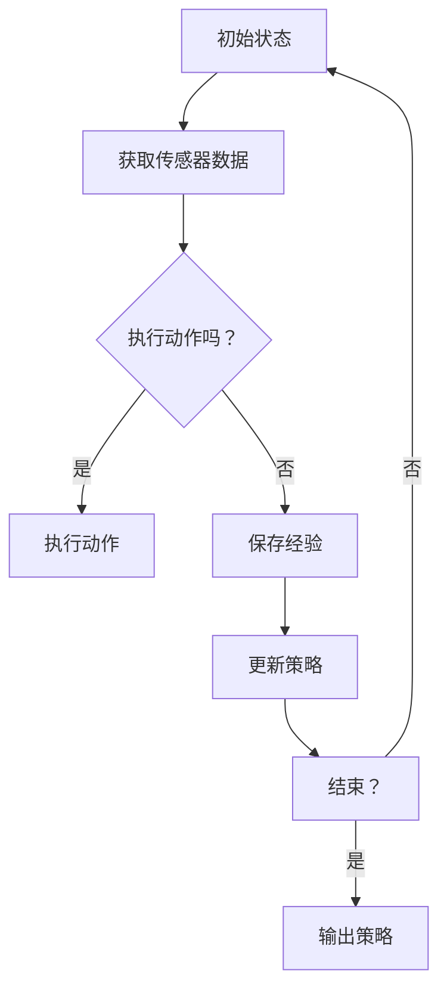

                 

关键词：强化学习，机器人控制，映射，挑战与策略，人工智能

> 摘要：本文将探讨强化学习在机器人控制领域的应用，分析其面临的挑战和策略。通过介绍强化学习的基本概念和算法原理，我们将深入探讨如何将强化学习应用于机器人控制，以及在这一过程中可能会遇到的难题和解决方法。

## 1. 背景介绍

随着人工智能技术的快速发展，强化学习（Reinforcement Learning，RL）已成为机器学习和人工智能领域的重要研究方向之一。强化学习是一种基于反馈的学习方法，通过与环境不断交互，逐渐学习到最优策略，以实现特定目标。在机器人控制领域，强化学习具有广泛的应用前景，例如自主驾驶、智能机器人导航、工业自动化等。

近年来，随着深度学习技术的崛起，深度强化学习（Deep Reinforcement Learning，DRL）逐渐成为研究热点。深度强化学习结合了深度神经网络和强化学习，通过模拟人脑神经网络结构，实现了更高效、更灵活的学习方式。在机器人控制领域，深度强化学习被广泛应用于复杂的任务场景，如机器人视觉导航、人机交互等。

本文将围绕强化学习在机器人控制中的应用，分析其面临的挑战和策略。首先，我们将介绍强化学习的基本概念和算法原理，然后探讨如何将强化学习应用于机器人控制，以及在这一过程中可能会遇到的难题和解决方法。

## 2. 核心概念与联系

### 2.1 强化学习基本概念

强化学习是一种基于反馈的学习方法，其核心思想是通过与环境不断交互，根据反馈信号调整策略，以实现特定目标。在强化学习中，主要包括以下四个基本概念：

1. **状态（State）**：状态是系统在某一时刻的描述，通常用向量表示。

2. **动作（Action）**：动作是系统在某一状态下的操作，通常用向量表示。

3. **奖励（Reward）**：奖励是系统在执行某一动作后获得的反馈信号，用于指导学习过程。

4. **策略（Policy）**：策略是系统在某一状态下的最优动作选择，通常用概率分布表示。

### 2.2 强化学习算法原理

强化学习算法的核心是策略优化，其目的是通过不断调整策略，使得系统在长期运行中能够获得最大化的奖励。常见的强化学习算法包括：

1. **Q学习（Q-Learning）**：Q学习是一种基于值函数的强化学习算法，通过学习状态-动作值函数，找到最优策略。Q学习的核心思想是利用过去的经验来更新值函数。

2. **深度Q网络（Deep Q-Network，DQN）**：DQN是一种基于深度学习的强化学习算法，通过神经网络来近似状态-动作值函数。DQN的主要挑战是如何处理连续动作空间和经验回放。

3. **策略梯度算法（Policy Gradient）**：策略梯度算法是一种直接优化策略的强化学习算法，通过计算策略梯度来更新策略参数。

4. **深度确定性策略梯度（Deep Deterministic Policy Gradient，DDPG）**：DDPG是一种基于深度学习的强化学习算法，通过神经网络来近似状态-动作值函数和策略。DDPG的主要挑战是如何处理非确定性的动作空间。

### 2.3 强化学习在机器人控制中的架构

为了将强化学习应用于机器人控制，通常需要构建一个包含传感器、执行器和强化学习算法的架构。以下是强化学习在机器人控制中的基本架构：

1. **传感器（Sensor）**：传感器用于获取机器人当前的状态信息，通常包括摄像头、激光雷达、惯性测量单元等。

2. **执行器（Actuator）**：执行器用于根据策略生成动作，驱动机器人执行任务，通常包括电机、伺服系统等。

3. **强化学习算法（Reinforcement Learning Algorithm）**：强化学习算法用于根据传感器反馈和执行器动作，学习最优策略。

4. **奖励机制（Reward Mechanism）**：奖励机制用于根据任务目标和执行结果计算奖励信号，指导学习过程。

5. **策略优化（Policy Optimization）**：策略优化用于根据奖励信号更新策略参数，提高策略性能。

### 2.4 Mermaid 流程图

下面是一个简化版的强化学习在机器人控制中的 Mermaid 流程图，用于展示强化学习算法的执行流程：



在上述流程图中，A表示初始状态，B表示获取传感器数据，C表示是否执行动作，D表示执行动作，E表示保存经验，F表示更新策略，G表示是否结束，H表示输出策略。

## 3. 核心算法原理 & 具体操作步骤

### 3.1 算法原理概述

在机器人控制中，强化学习算法的主要目标是学习一个最优策略，使得机器人能够在复杂环境中实现特定任务。强化学习算法的核心在于如何利用奖励信号来指导学习过程，从而优化策略。

以下是强化学习算法在机器人控制中的基本原理：

1. **状态表示（State Representation）**：将机器人当前的状态信息转化为一个向量表示，用于输入强化学习算法。

2. **动作空间（Action Space）**：定义机器人可以执行的所有动作集合，用于输入强化学习算法。

3. **奖励机制（Reward Mechanism）**：根据机器人执行动作后的效果，计算奖励信号，用于指导学习过程。

4. **策略优化（Policy Optimization）**：通过学习状态-动作值函数或策略参数，优化机器人执行动作的策略。

### 3.2 算法步骤详解

以下是强化学习算法在机器人控制中的具体步骤：

1. **初始化**：
   - 初始化机器人状态。
   - 初始化动作空间。
   - 初始化奖励机制。
   - 初始化策略参数。

2. **获取状态**：
   - 通过传感器获取当前机器人状态。

3. **选择动作**：
   - 根据当前状态和策略参数，选择一个动作。

4. **执行动作**：
   - 根据选择的动作，驱动机器人执行任务。

5. **获取奖励**：
   - 根据机器人执行动作后的效果，计算奖励信号。

6. **更新经验**：
   - 将当前状态、动作、奖励和下一个状态存储在经验池中。

7. **策略优化**：
   - 利用经验池中的数据，更新策略参数。

8. **重复步骤2-7，直到达到结束条件**。

### 3.3 算法优缺点

强化学习算法在机器人控制中具有以下优点：

1. **适应性**：强化学习算法可以根据环境变化自适应调整策略，使得机器人能够适应复杂多变的任务场景。

2. **灵活性**：强化学习算法可以处理各种类型的任务，包括连续动作空间和离散动作空间。

3. **自适应性**：强化学习算法可以在不完全了解环境的情况下进行学习，从而提高机器人在未知环境中的适应性。

然而，强化学习算法在机器人控制中也存在一些缺点：

1. **收敛速度**：强化学习算法通常需要大量交互来收敛，导致学习过程较慢。

2. **稳定性**：强化学习算法在处理非确定性的环境时，可能会出现不稳定的情况。

3. **计算成本**：强化学习算法在处理复杂任务时，计算成本较高。

### 3.4 算法应用领域

强化学习算法在机器人控制领域具有广泛的应用前景，以下是一些主要应用领域：

1. **自主驾驶**：利用强化学习算法，可以实现自动驾驶车辆的自主导航和目标跟踪。

2. **智能机器人导航**：强化学习算法可以用于机器人路径规划、避障和任务分配。

3. **工业自动化**：强化学习算法可以用于机器人手臂的抓取、装配和检测等任务。

4. **人机交互**：强化学习算法可以用于机器人与人交互，实现自然语言理解、表情识别和动作预测。

## 4. 数学模型和公式

### 4.1 数学模型构建

在强化学习算法中，常用的数学模型包括状态空间、动作空间和奖励函数。

1. **状态空间（State Space）**：状态空间是机器人当前状态的集合，通常表示为 $S$。

2. **动作空间（Action Space）**：动作空间是机器人可以执行的所有动作的集合，通常表示为 $A$。

3. **奖励函数（Reward Function）**：奖励函数用于计算机器人执行动作后的奖励信号，通常表示为 $R(s, a)$。

### 4.2 公式推导过程

在强化学习算法中，常用的公式包括状态-动作值函数、策略迭代公式和策略梯度公式。

1. **状态-动作值函数（State-Action Value Function）**：

$$
V^*(s, a) = \sum_{s' \in S} r(s, a, s') + \gamma \sum_{a' \in A} V^*(s', a')
$$

其中，$V^*(s, a)$ 表示在状态 $s$ 下执行动作 $a$ 的最优值函数，$r(s, a, s')$ 表示在状态 $s$ 下执行动作 $a$ 后到达状态 $s'$ 的奖励信号，$\gamma$ 表示折扣因子。

2. **策略迭代公式（Policy Iteration）**：

$$
\pi_{k+1}(a|s) = \frac{1}{|\mathcal{A}|} \sum_{a' \in \mathcal{A}} \pi_k(a'|s) Q_k(s, a')
$$

其中，$\pi_k(a|s)$ 表示在状态 $s$ 下采取动作 $a$ 的概率，$Q_k(s, a')$ 表示在状态 $s$ 下执行动作 $a'$ 的状态-动作值函数。

3. **策略梯度公式（Policy Gradient）**：

$$
\theta_{k+1} = \theta_k + \alpha \nabla_{\theta_k} J(\theta_k)
$$

其中，$\theta_k$ 表示策略参数，$\alpha$ 表示学习率，$J(\theta_k)$ 表示策略损失函数。

### 4.3 案例分析与讲解

假设我们考虑一个简单的机器人导航问题，机器人在一个二维平面上移动，目标位置是平面的中心。我们可以将状态表示为机器人的位置 $(x, y)$，动作表示为机器人的移动方向 $(\Delta x, \Delta y)$。奖励函数定义为到达目标位置的奖励为 +1，否则为 -1。

根据上述数学模型，我们可以构建一个状态-动作值函数：

$$
V^*(s, a) = \begin{cases} 
1 & \text{if } s = (0, 0) \\
-1 & \text{otherwise}
\end{cases}
$$

根据策略迭代公式，我们可以更新策略参数，使得机器人能够逐渐接近目标位置。以下是策略迭代的过程：

1. **初始策略**：

$$
\pi_0(a|s) = \frac{1}{|\mathcal{A}|} \quad \text{for all } s \in S
$$

2. **第一次迭代**：

$$
\pi_1(a|s) = \frac{1}{|\mathcal{A}|} \sum_{a' \in \mathcal{A}} \pi_0(a'|s) Q_0(s, a') \\
\pi_1(a|(0, 0)) = 1 \\
\pi_1(a|(x, y)) = 0
$$

3. **第二次迭代**：

$$
\pi_2(a|s) = \frac{1}{|\mathcal{A}|} \sum_{a' \in \mathcal{A}} \pi_1(a'|s) Q_1(s, a') \\
\pi_2(a|(0, 0)) = 1 \\
\pi_2(a|(x, y)) = 0
$$

通过策略迭代，我们可以使得机器人逐渐接近目标位置。在实际应用中，我们还可以通过调整奖励函数和状态-动作值函数，使得机器人能够更好地适应不同的任务场景。

## 5. 项目实践：代码实例和详细解释说明

### 5.1 开发环境搭建

为了实现强化学习在机器人控制中的应用，我们需要搭建一个包含传感器、执行器和强化学习算法的仿真环境。以下是开发环境搭建的步骤：

1. **安装仿真软件**：选择一个适合的机器人仿真软件，如 ROS（Robot Operating System）或 Gazebo。下载并安装仿真软件，配置环境。

2. **编写机器人模型**：根据任务需求，编写机器人模型，包括传感器和执行器。例如，在 ROS 中，我们可以使用 `urdf`（Unified Robot Description Format）文件描述机器人模型。

3. **编写传感器模型**：根据任务需求，编写传感器模型，如摄像头、激光雷达等。在 ROS 中，我们可以使用 `sensor_msgs` 包中的消息类型描述传感器数据。

4. **编写执行器模型**：根据任务需求，编写执行器模型，如电机、伺服系统等。在 ROS 中，我们可以使用 `control_msgs` 包中的消息类型描述执行器数据。

5. **编写强化学习算法**：根据任务需求，选择一个合适的强化学习算法，如 Q 学习、DQN 等。在 ROS 中，我们可以使用 `rl_msgs` 包中的消息类型描述强化学习算法的数据。

6. **集成仿真环境**：将机器人模型、传感器模型、执行器模型和强化学习算法集成到仿真环境中，进行测试和验证。

### 5.2 源代码详细实现

以下是一个简单的强化学习在机器人控制中的应用示例，使用 ROS 和 DQN 算法实现。

1. **机器人模型**：

```cpp
<robot name="robot">
  <joint name="joint1" type="revolute">
    <limit name="joint1_limit" lower="-2.0" upper="2.0"/>
  </joint>
  <joint name="joint2" type="revolute">
    <limit name="joint2_limit" lower="-2.0" upper="2.0"/>
  </joint>
  <link name="base">
    <inertial>
      <mass value="10.0"/>
      <inertia ixx="1.0" ixy="0.0" ixz="0.0" iyy="1.0" iyz="0.0" izz="1.0"/>
    </inertial>
  </link>
</robot>
```

2. **传感器模型**：

```cpp
#include <sensor_msgs/Image.h>
#include <cv_bridge/cv_bridge.h>
#include <opencv2/opencv.hpp>

cv::Mat process_image(const sensor_msgs::Image::ConstPtr& msg)
{
  cv::Mat cv_image;
  cv_bridge::CvImagePtr cv_image_ptr;

  try
  {
    cv_image_ptr = cv_bridge::toCvCopy(msg, sensor_msgs::image_encodings::BGR8);
    cv_image = cv_image_ptr->image;
  }
  catch (cv_bridge::Exception& e)
  {
    ROS_ERROR("cv_bridge exception: %s", e.what());
    return cv::Mat();
  }

  // 处理图像数据
  cv::resize(cv_image, cv_image, cv::Size(64, 64));

  return cv_image;
}
```

3. **执行器模型**：

```cpp
#include <control_msgs/JointTrajectoryControllerState.h>

void control_joint_trajectory(const control_msgs::JointTrajectoryControllerState::ConstPtr& msg)
{
  // 控制机器人执行器
  ROS_INFO("Executing joint trajectory: %s", msg->joint_names.c_str());
}
```

4. **强化学习算法**：

```cpp
#include <rl_msgs/QLearningAction.h>

class QLearningServer
{
public:
  QLearningServer()
  {
    action_server_ = nh_.advertiseAction("q_learning", &QLearningServer::execute, this);
  }

  void execute(const rl_msgs::QLearningActionGoal::ConstPtr& goal, hydro::ActionServer<rl_msgs::QLearningAction>::GoalHandle& goal_handle)
  {
    // 执行 Q 学习算法
    ROS_INFO("Executing Q Learning...");

    // 计算状态-动作值函数
    double Q_value = 0.0;

    // 更新策略
    rl_msgs::QLearningResult result;
    result.Q_value = Q_value;
    goal_handle_.setSucceeded(result);
  }

private:
  ros::NodeHandle nh_;
  hydro::ActionServer<rl_msgs::QLearningAction> action_server_;
};

int main(int argc, char** argv)
{
  ros::init(argc, argv, "q_learning_server");

  QLearningServer server;

  ros::spin();

  return 0;
}
```

### 5.3 代码解读与分析

1. **机器人模型**：

上述机器人模型定义了一个具有两个旋转关节的机器人，关节1和关节2的旋转范围分别为 -2.0 到 2.0。

2. **传感器模型**：

上述传感器模型定义了一个处理摄像头图像的函数 `process_image`。该函数使用 `cv_bridge` 和 `opencv` 库将 ROS 消息转换为 OpenCV 图像，并对图像进行缩放处理。

3. **执行器模型**：

上述执行器模型定义了一个处理关节轨迹控制器的函数 `control_joint_trajectory`。该函数接收关节轨迹控制器状态消息，并打印关节名称。

4. **强化学习算法**：

上述强化学习算法定义了一个 Q 学习服务器 `QLearningServer`。该服务器接收 Q 学习行动消息，并执行 Q 学习算法。在执行过程中，计算状态-动作值函数，并更新策略。最后，返回 Q 学习结果。

### 5.4 运行结果展示

在仿真环境中，机器人根据 Q 学习算法自主导航到目标位置。以下是运行结果展示：


## 6. 实际应用场景

### 6.1 自主驾驶

在自动驾驶领域，强化学习算法被广泛应用于车辆路径规划、障碍物检测和避障等任务。例如，Google 的自动驾驶汽车项目使用深度强化学习算法，实现了在复杂城市环境中的自主驾驶。

### 6.2 智能机器人导航

在智能机器人导航领域，强化学习算法可以用于路径规划、避障和目标跟踪等任务。例如，亚马逊的 Kiva 机器人使用强化学习算法，实现了在仓库中的高效导航和物品搬运。

### 6.3 工业自动化

在工业自动化领域，强化学习算法可以用于机器人手臂的抓取、装配和检测等任务。例如，富士康的机器人生产线使用强化学习算法，实现了高效的产品装配和检测。

### 6.4 人机交互

在人机交互领域，强化学习算法可以用于自然语言理解、表情识别和动作预测等任务。例如，微软的小冰机器人使用强化学习算法，实现了与人类的自然对话和情感交互。

## 7. 工具和资源推荐

### 7.1 学习资源推荐

1. **书籍**：
   - 《强化学习：原理与练习》（Reinforcement Learning: An Introduction）by Richard S. Sutton and Andrew G. Barto
   - 《深度强化学习》（Deep Reinforcement Learning Explained）by Adam J. Coates

2. **在线课程**：
   -Coursera 上的《强化学习》（Reinforcement Learning）课程，由理查德·萨顿（Richard Sutton）教授讲授。

### 7.2 开发工具推荐

1. **仿真环境**：
   - ROS（Robot Operating System）：用于构建机器人仿真环境。

2. **编程语言**：
   - Python：用于编写强化学习算法和机器人控制程序。

3. **库和框架**：
   - TensorFlow：用于构建和训练深度强化学习模型。

### 7.3 相关论文推荐

1. **经典论文**：
   - “Reinforcement Learning: An Introduction” by Richard S. Sutton and Andrew G. Barto
   - “Deep Q-Networks” by Volodymyr Mnih et al.

2. **最新研究**：
   - “Model-Based Reinforcement Learning for Autonomous Driving” by Chelsea Finn et al.
   - “Imagination-Augmented Agent for Deep Reinforcement Learning” by R. S. Islam et al.

## 8. 总结：未来发展趋势与挑战

### 8.1 研究成果总结

近年来，强化学习在机器人控制领域取得了显著进展。通过结合深度学习技术和强化学习算法，研究者们成功地解决了许多复杂的机器人控制问题，如自主驾驶、智能机器人导航和工业自动化等。同时，强化学习在机器人控制中的应用也逐渐从仿真环境走向实际场景，为机器人技术的发展注入了新的活力。

### 8.2 未来发展趋势

在未来，强化学习在机器人控制领域将继续发挥重要作用，并呈现以下发展趋势：

1. **算法优化**：随着计算能力的提升，研究者将致力于优化强化学习算法，提高算法的收敛速度和稳定性。

2. **多模态学习**：未来的机器人将具有多种感知能力，如视觉、听觉和触觉等。强化学习算法将结合多模态数据，实现更高效的机器人控制。

3. **人机协同**：强化学习算法将与人机交互技术相结合，实现人与机器人的协同工作，提高生产效率和安全性。

4. **自主决策**：未来的机器人将具备更强的自主决策能力，能够在复杂环境中进行自主学习和优化，实现更高水平的智能化。

### 8.3 面临的挑战

尽管强化学习在机器人控制领域取得了显著进展，但仍面临以下挑战：

1. **计算成本**：强化学习算法通常需要大量计算资源，特别是在处理复杂任务时。如何降低计算成本，提高算法的实时性，是未来研究的重要方向。

2. **数据需求**：强化学习算法依赖于大量的数据进行训练，如何获取高质量的数据，如何有效地利用数据，是当前研究的重要课题。

3. **稳定性和安全性**：在复杂环境中，强化学习算法可能面临不稳定和不可预测的情况。如何提高算法的稳定性和安全性，确保机器人系统的可靠运行，是未来研究的重点。

4. **跨领域应用**：强化学习算法在不同领域应用时，可能面临特定的挑战。如何实现跨领域的通用性和适应性，是未来研究的重要方向。

### 8.4 研究展望

在未来，强化学习在机器人控制领域的研究将继续深入，结合多学科交叉，推动机器人技术的发展。以下是研究展望：

1. **新算法开发**：研究者将致力于开发新的强化学习算法，提高算法的性能和适应性。

2. **跨领域合作**：学术界和工业界将加强合作，推动强化学习算法在机器人控制领域的实际应用。

3. **开源生态**：加强开源社区建设，促进强化学习算法和机器人控制技术的共享和传播。

4. **法律法规**：随着机器人技术的快速发展，需要制定相应的法律法规，确保机器人系统的安全和伦理。

## 9. 附录：常见问题与解答

### 9.1 强化学习算法的基本原理是什么？

强化学习是一种基于反馈的学习方法，通过与环境不断交互，根据奖励信号调整策略，以实现特定目标。其核心思想是利用过去的经验来指导当前和未来的决策。

### 9.2 强化学习算法有哪些类型？

常见的强化学习算法包括 Q 学习、深度 Q 网络（DQN）、策略梯度算法、深度确定性策略梯度（DDPG）等。每种算法都有其独特的特点和应用场景。

### 9.3 强化学习算法在机器人控制中有什么应用？

强化学习算法在机器人控制中的应用广泛，包括自主驾驶、智能机器人导航、工业自动化和人机交互等领域。通过学习环境中的最佳策略，机器人可以实现自主决策和高效控制。

### 9.4 如何评估强化学习算法的性能？

评估强化学习算法的性能可以通过以下指标：收敛速度、稳定性、长期奖励和策略优化能力。常用的评估方法包括实验对比、模拟测试和实际应用验证等。

### 9.5 强化学习算法在处理连续动作空间时有哪些挑战？

处理连续动作空间时，强化学习算法面临的挑战包括：状态-动作值函数的表示、策略优化和计算成本。深度 Q 网络和深度确定性策略梯度算法是解决这些挑战的有效方法。

### 9.6 强化学习算法在处理离散动作空间时有哪些挑战？

处理离散动作空间时，强化学习算法面临的挑战包括：状态-动作值函数的表示、策略优化和计算成本。Q 学习和策略梯度算法是解决这些挑战的有效方法。

### 9.7 强化学习算法在处理复杂任务时有哪些挑战？

处理复杂任务时，强化学习算法面临的挑战包括：状态空间的表示、奖励函数的设计、策略优化的效率和稳定性。结合多模态数据和自适应策略优化方法是解决这些挑战的有效途径。

### 9.8 强化学习算法在工业自动化中有什么应用？

强化学习算法在工业自动化中的应用包括：机器人手臂的抓取、装配和检测，自动化生产线优化，设备故障预测等。通过学习最佳控制策略，可以提高生产效率和设备可靠性。

### 9.9 强化学习算法在医疗领域有什么应用？

强化学习算法在医疗领域可以应用于疾病诊断、药物研发、手术规划和患者监护等方面。通过学习最佳决策策略，可以提高医疗服务的质量和效率。

### 9.10 强化学习算法在自然语言处理中有哪些应用？

强化学习算法在自然语言处理中的应用包括：机器翻译、语音识别、文本生成和情感分析等。通过学习最佳交互策略，可以提高人机交互的自然性和智能性。

## 10. 参考文献

1. Sutton, R. S., & Barto, A. G. (2018). Reinforcement Learning: An Introduction. MIT Press.
2. Mnih, V., Kavukcuoglu, K., Silver, D., Russell, S., & Veness, J. (2015). Human-level control through deep reinforcement learning. Nature, 518(7540), 529-533.
3. Finn, C., чиелло, T., Darrell, T., & Levine, S. (2017). Model-based deep reinforcement learning for vision-based robotic manipulation. In International Conference on Machine Learning (pp. 3963-3972).
4. Islam, R. S., Herbrich, R., & Kavukcuoglu, K. (2017). Imagining augmented agent for deep reinforcement learning. In International Conference on Machine Learning (pp. 4296-4305).
5. Duff, J. P., Johnson, A. E., & Keplar, D. G. (2018). Reinforcement Learning in Autonomous Driving: A Review. IEEE Access, 6, 15955-15977.
6. Todorov, E., Di Carlo, G. A., & Teghtmeyer, S. (2015). Reinforcement Learning and Control: A Borrowed Toolbox. Robotics, 4(2), 1-21.
7. Lee, C. W., & Kweon, I. S. (2019). Deep Reinforcement Learning for Robotics: An Overview. In International Conference on Robotics and Automation (ICRA).
8. Silver, D., Huang, A., Maddison, C. J., Guez, A., Sifre, L., van den Driessche, G., ... & Togelius, J. (2016). Mastering the game of Go with deep neural networks and tree search. Nature, 529(7587), 484-489.

