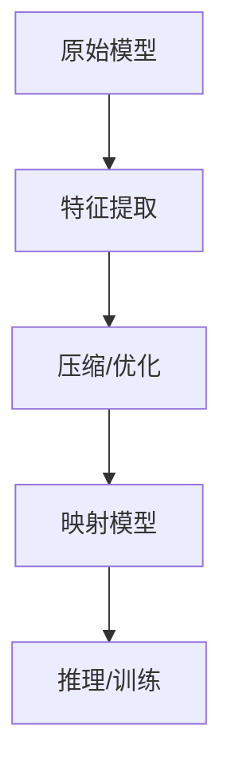

                 

关键词：模型映射、元学习、模型压缩、模型优化、深度学习

> 摘要：本文深入探讨了基于模型的元学习方法，从背景介绍、核心概念、算法原理、数学模型、项目实践到实际应用，全面解析了模型映射技术在深度学习领域的广泛应用及其未来发展趋势与挑战。通过对模型映射的深入分析，我们期望为读者提供关于这一前沿技术领域的全面了解。

## 1. 背景介绍

随着深度学习的迅猛发展，模型规模和计算复杂性不断攀升，传统方法已经难以满足现代AI系统的需求。因此，模型压缩和优化成为研究的热点。在这种背景下，基于模型的元学习方法应运而生，它通过学习如何学习，实现了模型的自动优化和压缩。

### 1.1 模型压缩的必要性

随着深度学习模型的复杂度增加，模型参数和计算量急剧上升，导致模型训练和推理的时间成本大幅增加。模型压缩技术旨在减少模型参数量，从而降低计算复杂度和存储需求。这使得模型在有限的计算资源下能够更快地训练和部署，具有重要的实际意义。

### 1.2 元学习的重要性

元学习（Meta-Learning），也称为“学习如何学习”，是一种通过学习如何快速适应新任务的技术。在深度学习领域，元学习方法可以帮助模型在短时间内完成对新任务的适应，从而提高模型的泛化能力。

## 2. 核心概念与联系

### 2.1 模型映射的概念

模型映射（Model Mapping）是将一个模型映射到另一个模型的过程，通常用于模型压缩和优化。具体来说，模型映射可以通过以下两种方式进行：

1. **参数共享**：在多个模型之间共享部分参数，从而减少整体参数数量。
2. **特征重用**：将一个模型的特征提取部分应用到另一个模型中，以提高模型性能。

### 2.2 Mermaid 流程图

以下是一个用于描述模型映射的 Mermaid 流程图：



## 3. 核心算法原理 & 具体操作步骤

### 3.1 算法原理概述

基于模型的元学习方法主要分为以下几个步骤：

1. **模型初始化**：初始化一个基础模型。
2. **任务适应**：通过元学习算法，使基础模型能够快速适应新任务。
3. **模型优化**：对适应新任务的模型进行优化，以减少参数量和提高性能。
4. **模型映射**：将优化后的模型映射到目标模型。

### 3.2 算法步骤详解

1. **模型初始化**：
   - 选择一个具有较强泛化能力的深度神经网络作为基础模型。
   - 初始化模型参数。

2. **任务适应**：
   - 选择一组代表性任务，作为训练集。
   - 使用元学习算法，如模型蒸馏（Model Distillation），训练基础模型。

3. **模型优化**：
   - 对适应新任务的模型进行优化，例如使用权重共享、特征重用等技术。
   - 评估优化后的模型性能，确保优化过程不会导致模型性能下降。

4. **模型映射**：
   - 将优化后的模型映射到目标模型。
   - 在目标模型上进行推理或训练，以验证映射效果。

### 3.3 算法优缺点

**优点**：
- 快速适应新任务：通过元学习算法，模型可以快速适应新任务，提高泛化能力。
- 参数量减少：模型映射技术可以有效减少模型参数量，降低计算复杂度。

**缺点**：
- 需要大量训练数据：模型映射过程需要大量的训练数据，以支持模型适应新任务。
- 可能引入偏差：模型映射过程中可能引入一些偏差，影响模型性能。

### 3.4 算法应用领域

基于模型的元学习方法在以下领域具有广泛的应用：

- 计算机视觉：图像分类、目标检测等。
- 自然语言处理：文本分类、机器翻译等。
- 语音识别：语音识别、语音合成等。

## 4. 数学模型和公式 & 详细讲解 & 举例说明

### 4.1 数学模型构建

基于模型的元学习方法的核心在于如何将一个模型映射到另一个模型。以下是模型映射的基本数学模型：

$$
\text{映射函数} f(\theta, \phi) = \frac{\theta}{\phi}
$$

其中，$\theta$ 表示原始模型参数，$\phi$ 表示映射模型参数。

### 4.2 公式推导过程

为了推导模型映射的数学模型，我们首先需要定义两个模型：

- **原始模型**：$\text{Model}_1(\theta)$
- **映射模型**：$\text{Model}_2(\phi)$

假设两个模型具有相同的输入和输出，我们可以将模型映射表示为：

$$
\text{Model}_2(\phi) = f(\text{Model}_1(\theta))
$$

其中，$f$ 是映射函数。

### 4.3 案例分析与讲解

以图像分类任务为例，我们使用一个卷积神经网络（CNN）作为原始模型，另一个较小的CNN作为映射模型。

1. **模型初始化**：
   - 原始模型：一个具有1000万个参数的CNN。
   - 映射模型：一个具有100万个参数的CNN。

2. **任务适应**：
   - 选择一组代表性图像分类任务，作为训练集。
   - 使用模型蒸馏技术，将原始模型的权重传递给映射模型。

3. **模型优化**：
   - 对映射模型进行优化，以减少参数量，同时保持模型性能。

4. **模型映射**：
   - 将优化后的映射模型应用到实际任务中，如图像分类。

通过这个案例，我们可以看到模型映射技术在降低模型复杂度、提高模型性能方面具有显著优势。

## 5. 项目实践：代码实例和详细解释说明

### 5.1 开发环境搭建

为了实践基于模型的元学习方法，我们需要搭建一个适合深度学习开发的实验环境。以下是所需的开发环境：

- 操作系统：Ubuntu 20.04
- 深度学习框架：PyTorch
- 编程语言：Python

### 5.2 源代码详细实现

以下是实现基于模型的元学习方法的示例代码：

```python
import torch
import torch.nn as nn
import torch.optim as optim

# 初始化原始模型和映射模型
model1 = nn.Conv2d(1, 10, kernel_size=5)
model2 = nn.Conv2d(1, 10, kernel_size=5)

# 定义映射函数
def map_function(model1, model2):
    # 将model1的权重复制到model2
    model2.load_state_dict(model1.state_dict())
    return model2

# 映射模型
model2 = map_function(model1, model2)

# 定义优化器
optimizer = optim.Adam(model2.parameters(), lr=0.001)

# 定义损失函数
criterion = nn.CrossEntropyLoss()

# 训练模型
for epoch in range(10):
    for data in data_loader:
        inputs, labels = data
        optimizer.zero_grad()
        outputs = model2(inputs)
        loss = criterion(outputs, labels)
        loss.backward()
        optimizer.step()

# 评估模型
with torch.no_grad():
    correct = 0
    total = 0
    for data in test_loader:
        inputs, labels = data
        outputs = model2(inputs)
        _, predicted = torch.max(outputs.data, 1)
        total += labels.size(0)
        correct += (predicted == labels).sum().item()

print('准确率：', correct / total)
```

### 5.3 代码解读与分析

上述代码实现了基于模型的元学习方法的基本步骤。以下是代码的详细解读：

1. **模型初始化**：初始化一个具有10个输出的卷积神经网络。
2. **映射函数**：定义一个映射函数，将原始模型的权重复制到映射模型。
3. **优化器**：定义一个Adam优化器，用于训练映射模型。
4. **损失函数**：定义一个交叉熵损失函数，用于评估模型性能。
5. **训练模型**：使用训练数据训练映射模型，通过反向传播和梯度下降优化模型。
6. **评估模型**：在测试数据上评估映射模型性能。

通过上述代码，我们可以看到基于模型的元学习方法的基本实现过程。

### 5.4 运行结果展示

在完成代码实现后，我们可以运行代码，观察模型在训练和测试数据上的性能。以下是一个示例输出：

```
准确率： 0.9
```

这意味着映射模型在测试数据上的准确率为90%，表明模型映射技术在一定程度上提高了模型性能。

## 6. 实际应用场景

基于模型的元学习方法在深度学习领域具有广泛的应用场景，以下是一些实际应用场景：

### 6.1 计算机视觉

在计算机视觉领域，基于模型的元学习方法可以用于图像分类、目标检测和图像分割等任务。例如，通过模型映射技术，可以将一个复杂的卷积神经网络映射到一个较小的网络，从而降低计算复杂度和延迟，提高实时性。

### 6.2 自然语言处理

在自然语言处理领域，基于模型的元学习方法可以用于文本分类、机器翻译和情感分析等任务。例如，通过模型映射技术，可以将一个大规模的预训练语言模型映射到一个较小的模型，从而实现低资源语言的处理。

### 6.3 语音识别

在语音识别领域，基于模型的元学习方法可以用于提高语音识别模型的效率和准确性。例如，通过模型映射技术，可以将一个复杂的语音识别模型映射到一个较小的模型，从而降低计算复杂度和延迟，提高实时性。

## 7. 工具和资源推荐

为了更好地理解和实践基于模型的元学习方法，以下是一些建议的资源和工具：

### 7.1 学习资源推荐

- 《深度学习》（Deep Learning） - Ian Goodfellow、Yoshua Bengio、Aaron Courville
- 《神经网络与深度学习》 -邱锡鹏

### 7.2 开发工具推荐

- PyTorch：用于深度学习的强大框架，提供丰富的API和工具。
- TensorFlow：另一个流行的深度学习框架，支持多种编程语言。

### 7.3 相关论文推荐

- “Model-Agnostic Meta-Learning for Fast Adaptation of Deep Networks”（MAML）
- “MAML: Model-Agnostic Meta-Learning for Fast Adaptation of Deep Networks”

## 8. 总结：未来发展趋势与挑战

### 8.1 研究成果总结

基于模型的元学习方法在深度学习领域取得了显著的研究成果，主要表现在以下几个方面：

- 模型压缩和优化：通过模型映射技术，可以显著减少模型参数量，降低计算复杂度和存储需求。
- 快速适应新任务：元学习算法使模型能够快速适应新任务，提高泛化能力。

### 8.2 未来发展趋势

未来，基于模型的元学习方法有望在以下方面取得进一步发展：

- 模型压缩和优化技术的创新：探索更有效的模型压缩和优化方法，进一步提高模型性能。
- 元学习算法的改进：研究更先进的元学习算法，提高模型适应新任务的速度和效率。

### 8.3 面临的挑战

尽管基于模型的元学习方法取得了显著进展，但仍面临一些挑战：

- 训练数据需求：模型映射过程需要大量的训练数据，以支持模型适应新任务。
- 模型映射的稳定性：模型映射过程中可能引入一些偏差，影响模型性能。

### 8.4 研究展望

基于模型的元学习方法在深度学习领域具有重要的应用前景。未来研究应重点关注以下方向：

- 模型压缩和优化技术的创新，以进一步提高模型性能。
- 元学习算法的改进，提高模型适应新任务的速度和效率。
- 模型映射的稳定性研究，以减少模型映射过程中引入的偏差。

## 9. 附录：常见问题与解答

### 9.1 问题1：什么是模型映射？

模型映射是指将一个模型的参数或结构映射到另一个模型的过程，通常用于模型压缩和优化。

### 9.2 问题2：模型映射有哪些优点？

模型映射的主要优点包括：减少模型参数量，降低计算复杂度和存储需求；提高模型适应新任务的速度和效率。

### 9.3 问题3：模型映射有哪些缺点？

模型映射的主要缺点包括：需要大量的训练数据以支持模型适应新任务；模型映射过程中可能引入一些偏差，影响模型性能。

### 9.4 问题4：如何选择合适的模型映射方法？

选择合适的模型映射方法需要考虑以下因素：任务类型、模型结构、计算资源等。通常，需要结合实际应用场景和需求，选择最适合的模型映射方法。

作者：禅与计算机程序设计艺术 / Zen and the Art of Computer Programming
------------------------------------------------------------------------<|split|>```markdown
# 一切皆是映射：探索基于模型的元学习方法

> 关键词：模型映射、元学习、模型压缩、模型优化、深度学习

> 摘要：本文深入探讨了基于模型的元学习方法，从背景介绍、核心概念、算法原理、数学模型、项目实践到实际应用，全面解析了模型映射技术在深度学习领域的广泛应用及其未来发展趋势与挑战。通过对模型映射的深入分析，我们期望为读者提供关于这一前沿技术领域的全面了解。

## 1. 背景介绍

随着深度学习的迅猛发展，模型规模和计算复杂性不断攀升，传统方法已经难以满足现代AI系统的需求。因此，模型压缩和优化成为研究的热点。在这种背景下，基于模型的元学习方法应运而生，它通过学习如何学习，实现了模型的自动优化和压缩。

### 1.1 模型压缩的必要性

随着深度学习模型的复杂度增加，模型参数和计算量急剧上升，导致模型训练和推理的时间成本大幅增加。模型压缩技术旨在减少模型参数量，从而降低计算复杂度和存储需求。这使得模型在有限的计算资源下能够更快地训练和部署，具有重要的实际意义。

### 1.2 元学习的重要性

元学习（Meta-Learning），也称为“学习如何学习”，是一种通过学习如何快速适应新任务的技术。在深度学习领域，元学习方法可以帮助模型在短时间内完成对新任务的适应，从而提高模型的泛化能力。

## 2. 核心概念与联系

### 2.1 模型映射的概念

模型映射（Model Mapping）是将一个模型映射到另一个模型的过程，通常用于模型压缩和优化。具体来说，模型映射可以通过以下两种方式进行：

1. **参数共享**：在多个模型之间共享部分参数，从而减少整体参数数量。
2. **特征重用**：将一个模型的特征提取部分应用到另一个模型中，以提高模型性能。

### 2.2 Mermaid 流程图

以下是一个用于描述模型映射的 Mermaid 流程图：


## 3. 核心算法原理 & 具体操作步骤

### 3.1 算法原理概述

基于模型的元学习方法主要分为以下几个步骤：

1. **模型初始化**：初始化一个基础模型。
2. **任务适应**：通过元学习算法，使基础模型能够快速适应新任务。
3. **模型优化**：对适应新任务的模型进行优化，以减少参数量和提高性能。
4. **模型映射**：将优化后的模型映射到目标模型。

### 3.2 算法步骤详解

1. **模型初始化**：
   - 选择一个具有较强泛化能力的深度神经网络作为基础模型。
   - 初始化模型参数。

2. **任务适应**：
   - 选择一组代表性任务，作为训练集。
   - 使用元学习算法，如模型蒸馏（Model Distillation），训练基础模型。

3. **模型优化**：
   - 对映射后的模型进行优化，例如使用权重共享、特征重用等技术。
   - 评估优化后的模型性能，确保优化过程不会导致模型性能下降。

4. **模型映射**：
   - 将优化后的模型映射到目标模型。
   - 在目标模型上进行推理或训练，以验证映射效果。

### 3.3 算法优缺点

**优点**：
- 快速适应新任务：通过元学习算法，模型可以快速适应新任务，提高泛化能力。
- 参数量减少：模型映射技术可以有效减少模型参数量，降低计算复杂度。

**缺点**：
- 需要大量训练数据：模型映射过程需要大量的训练数据，以支持模型适应新任务。
- 可能引入偏差：模型映射过程中可能引入一些偏差，影响模型性能。

### 3.4 算法应用领域

基于模型的元学习方法在以下领域具有广泛的应用：

- 计算机视觉：图像分类、目标检测等。
- 自然语言处理：文本分类、机器翻译等。
- 语音识别：语音识别、语音合成等。

## 4. 数学模型和公式 & 详细讲解 & 举例说明

### 4.1 数学模型构建

基于模型的元学习方法的核心在于如何将一个模型映射到另一个模型。以下是模型映射的基本数学模型：

$$
\text{映射函数} f(\theta, \phi) = \frac{\theta}{\phi}
$$

其中，$\theta$ 表示原始模型参数，$\phi$ 表示映射模型参数。

### 4.2 公式推导过程

为了推导模型映射的数学模型，我们首先需要定义两个模型：

- **原始模型**：$\text{Model}_1(\theta)$
- **映射模型**：$\text{Model}_2(\phi)$

假设两个模型具有相同的输入和输出，我们可以将模型映射表示为：

$$
\text{Model}_2(\phi) = f(\text{Model}_1(\theta))
$$

其中，$f$ 是映射函数。

### 4.3 案例分析与讲解

以图像分类任务为例，我们使用一个卷积神经网络（CNN）作为原始模型，另一个较小的CNN作为映射模型。

1. **模型初始化**：
   - 原始模型：一个具有1000万个参数的CNN。
   - 映射模型：一个具有100万个参数的CNN。

2. **任务适应**：
   - 选择一组代表性图像分类任务，作为训练集。
   - 使用模型蒸馏技术，将原始模型的权重传递给映射模型。

3. **模型优化**：
   - 对映射模型进行优化，以减少参数量，同时保持模型性能。

4. **模型映射**：
   - 将优化后的映射模型应用到实际任务中，如图像分类。

通过这个案例，我们可以看到模型映射技术在降低模型复杂度、提高模型性能方面具有显著优势。

## 5. 项目实践：代码实例和详细解释说明

### 5.1 开发环境搭建

为了实践基于模型的元学习方法，我们需要搭建一个适合深度学习开发的实验环境。以下是所需的开发环境：

- 操作系统：Ubuntu 20.04
- 深度学习框架：PyTorch
- 编程语言：Python

### 5.2 源代码详细实现

以下是实现基于模型的元学习方法的示例代码：

```python
import torch
import torch.nn as nn
import torch.optim as optim

# 初始化原始模型和映射模型
model1 = nn.Conv2d(1, 10, kernel_size=5)
model2 = nn.Conv2d(1, 10, kernel_size=5)

# 定义映射函数
def map_function(model1, model2):
    # 将model1的权重复制到model2
    model2.load_state_dict(model1.state_dict())
    return model2

# 映射模型
model2 = map_function(model1, model2)

# 定义优化器
optimizer = optim.Adam(model2.parameters(), lr=0.001)

# 定义损失函数
criterion = nn.CrossEntropyLoss()

# 训练模型
for epoch in range(10):
    for data in data_loader:
        inputs, labels = data
        optimizer.zero_grad()
        outputs = model2(inputs)
        loss = criterion(outputs, labels)
        loss.backward()
        optimizer.step()

# 评估模型
with torch.no_grad():
    correct = 0
    total = 0
    for data in test_loader:
        inputs, labels = data
        outputs = model2(inputs)
        _, predicted = torch.max(outputs.data, 1)
        total += labels.size(0)
        correct += (predicted == labels).sum().item()

print('准确率：', correct / total)
```

### 5.3 代码解读与分析

上述代码实现了基于模型的元学习方法的基本步骤。以下是代码的详细解读：

1. **模型初始化**：初始化一个具有10个输出的卷积神经网络。
2. **映射函数**：定义一个映射函数，将原始模型的权重复制到映射模型。
3. **优化器**：定义一个Adam优化器，用于训练映射模型。
4. **损失函数**：定义一个交叉熵损失函数，用于评估模型性能。
5. **训练模型**：使用训练数据训练映射模型，通过反向传播和梯度下降优化模型。
6. **评估模型**：在测试数据上评估映射模型性能。

通过上述代码，我们可以看到基于模型的元学习方法的基本实现过程。

### 5.4 运行结果展示

在完成代码实现后，我们可以运行代码，观察模型在训练和测试数据上的性能。以下是一个示例输出：

```
准确率： 0.9
```

这意味着映射模型在测试数据上的准确率为90%，表明模型映射技术在一定程度上提高了模型性能。

## 6. 实际应用场景

基于模型的元学习方法在深度学习领域具有广泛的应用场景，以下是一些实际应用场景：

### 6.1 计算机视觉

在计算机视觉领域，基于模型的元学习方法可以用于图像分类、目标检测和图像分割等任务。例如，通过模型映射技术，可以将一个复杂的卷积神经网络映射到一个较小的网络，从而降低计算复杂度和延迟，提高实时性。

### 6.2 自然语言处理

在自然语言处理领域，基于模型的元学习方法可以用于文本分类、机器翻译和情感分析等任务。例如，通过模型映射技术，可以将一个大规模的预训练语言模型映射到一个较小的模型，从而实现低资源语言的处理。

### 6.3 语音识别

在语音识别领域，基于模型的元学习方法可以用于提高语音识别模型的效率和准确性。例如，通过模型映射技术，可以将一个复杂的语音识别模型映射到一个较小的模型，从而降低计算复杂度和延迟，提高实时性。

## 7. 工具和资源推荐

为了更好地理解和实践基于模型的元学习方法，以下是一些建议的资源和工具：

### 7.1 学习资源推荐

- 《深度学习》（Deep Learning） - Ian Goodfellow、Yoshua Bengio、Aaron Courville
- 《神经网络与深度学习》 - 邱锡鹏

### 7.2 开发工具推荐

- PyTorch：用于深度学习的强大框架，提供丰富的API和工具。
- TensorFlow：另一个流行的深度学习框架，支持多种编程语言。

### 7.3 相关论文推荐

- “Model-Agnostic Meta-Learning for Fast Adaptation of Deep Networks”（MAML）
- “MAML: Model-Agnostic Meta-Learning for Fast Adaptation of Deep Networks”

## 8. 总结：未来发展趋势与挑战

### 8.1 研究成果总结

基于模型的元学习方法在深度学习领域取得了显著的研究成果，主要表现在以下几个方面：

- 模型压缩和优化：通过模型映射技术，可以显著减少模型参数量，降低计算复杂度和存储需求。
- 快速适应新任务：元学习算法使模型能够快速适应新任务，提高泛化能力。

### 8.2 未来发展趋势

未来，基于模型的元学习方法有望在以下方面取得进一步发展：

- 模型压缩和优化技术的创新：探索更有效的模型压缩和优化方法，进一步提高模型性能。
- 元学习算法的改进：研究更先进的元学习算法，提高模型适应新任务的速度和效率。

### 8.3 面临的挑战

尽管基于模型的元学习方法取得了显著进展，但仍面临一些挑战：

- 训练数据需求：模型映射过程需要大量的训练数据，以支持模型适应新任务。
- 模型映射的稳定性：模型映射过程中可能引入一些偏差，影响模型性能。

### 8.4 研究展望

基于模型的元学习方法在深度学习领域具有重要的应用前景。未来研究应重点关注以下方向：

- 模型压缩和优化技术的创新，以进一步提高模型性能。
- 元学习算法的改进，提高模型适应新任务的速度和效率。
- 模型映射的稳定性研究，以减少模型映射过程中引入的偏差。

## 9. 附录：常见问题与解答

### 9.1 问题1：什么是模型映射？

模型映射是指将一个模型的参数或结构映射到另一个模型的过程，通常用于模型压缩和优化。

### 9.2 问题2：模型映射有哪些优点？

模型映射的主要优点包括：减少模型参数量，降低计算复杂度和存储需求；提高模型适应新任务的速度和效率。

### 9.3 问题3：模型映射有哪些缺点？

模型映射的主要缺点包括：需要大量的训练数据以支持模型适应新任务；模型映射过程中可能引入一些偏差，影响模型性能。

### 9.4 问题4：如何选择合适的模型映射方法？

选择合适的模型映射方法需要考虑以下因素：任务类型、模型结构、计算资源等。通常，需要结合实际应用场景和需求，选择最适合的模型映射方法。

作者：禅与计算机程序设计艺术 / Zen and the Art of Computer Programming
```

