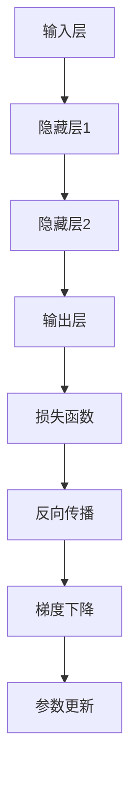

                 

关键词：深度学习、反向传播、梯度下降、神经网络的优化、机器学习算法、算法原理、数学模型、编程实例、应用场景、未来展望

> 摘要：本文将深入探讨深度学习中至关重要的一对概念——反向传播和梯度下降。我们将回顾这些算法的背景、核心原理，并通过数学模型和实际编程实例，详细解释它们如何工作，以及它们在机器学习中的广泛应用。此外，本文还将展望这些技术在未来的发展方向和面临的挑战。

## 1. 背景介绍

深度学习作为机器学习的一个重要分支，近年来在图像识别、自然语言处理、语音识别等领域取得了显著成就。这些成就背后离不开两大核心算法：反向传播（Backpropagation）和梯度下降（Gradient Descent）。反向传播是一种用于计算神经网络梯度的方法，而梯度下降则是一种优化算法，用于调整网络中的参数以最小化损失函数。

### 1.1 深度学习的兴起

深度学习起源于20世纪40年代的人工智能研究，但在当时由于计算能力和数据资源有限，深度学习的发展受到了限制。直到2006年，Geoffrey Hinton等人提出了深度信念网络（Deep Belief Networks），标志着深度学习重新兴起。近年来，随着计算能力和数据量的爆炸性增长，深度学习迎来了前所未有的发展。

### 1.2 反向传播和梯度下降的引入

反向传播和梯度下降是深度学习的基础，它们分别解决了如何高效计算网络梯度以及如何优化网络参数的问题。反向传播算法的提出，使得深度学习模型能够通过前向传播计算输出，再通过后向传播计算梯度，从而进行参数更新。梯度下降算法则通过调整参数的步长，使得损失函数逐步减小，最终达到最优解。

## 2. 核心概念与联系

在深入探讨反向传播和梯度下降之前，我们需要了解一些核心概念和它们之间的关系。以下是核心概念原理和架构的 Mermaid 流程图：



### 2.1 神经网络的基本结构

神经网络由输入层、隐藏层和输出层组成。输入层接收外部数据，隐藏层对数据进行特征提取和转换，输出层产生预测结果。

### 2.2 损失函数

损失函数用于衡量预测结果与真实结果之间的差异。深度学习中的损失函数通常是非线性函数，如均方误差（MSE）、交叉熵等。

### 2.3 反向传播

反向传播是一种计算神经网络梯度的方法。它通过前向传播计算输出，然后反向传播计算损失函数关于每个参数的梯度。

### 2.4 梯度下降

梯度下降是一种优化算法，通过计算损失函数的梯度，调整网络参数的步长，以最小化损失函数。

## 3. 核心算法原理 & 具体操作步骤

### 3.1 算法原理概述

#### 3.1.1 反向传播

反向传播算法通过以下步骤计算损失函数关于每个参数的梯度：

1. **前向传播**：将输入数据输入神经网络，计算输出结果。
2. **计算损失**：使用损失函数计算预测结果与真实结果之间的差异。
3. **后向传播**：从输出层开始，反向计算每个神经元关于每个参数的梯度。
4. **更新参数**：根据梯度调整网络参数的值，以最小化损失函数。

#### 3.1.2 梯度下降

梯度下降算法通过以下步骤优化网络参数：

1. **计算梯度**：使用反向传播算法计算损失函数关于每个参数的梯度。
2. **更新参数**：根据梯度调整网络参数的值，以最小化损失函数。
3. **迭代优化**：重复计算梯度和更新参数的过程，直到损失函数达到最小值。

### 3.2 算法步骤详解

#### 3.2.1 反向传播步骤详解

1. **前向传播**：
   - 将输入数据输入神经网络，计算每个神经元的输出值。
   - 计算输出层的预测结果。

2. **计算损失**：
   - 使用损失函数计算预测结果与真实结果之间的差异。

3. **后向传播**：
   - 从输出层开始，计算每个神经元的误差。
   - 根据误差和前向传播的输出，计算每个参数的梯度。

4. **更新参数**：
   - 根据梯度更新网络参数的值。

#### 3.2.2 梯度下降步骤详解

1. **计算梯度**：
   - 使用反向传播算法计算损失函数关于每个参数的梯度。

2. **更新参数**：
   - 根据梯度调整网络参数的值。

3. **迭代优化**：
   - 重复计算梯度和更新参数的过程，直到损失函数达到最小值。

### 3.3 算法优缺点

#### 3.3.1 优点

1. **高效性**：反向传播算法通过分步计算梯度，大大提高了计算效率。
2. **通用性**：梯度下降算法适用于各种优化问题，包括深度学习中的参数优化。
3. **灵活性**：可以通过调整学习率等超参数，适应不同的问题场景。

#### 3.3.2 缺点

1. **局部最小值**：梯度下降算法容易陷入局部最小值，导致无法找到全局最小值。
2. **学习率选择**：学习率的选择对算法性能有重要影响，选择不当可能导致算法无法收敛。

### 3.4 算法应用领域

反向传播和梯度下降算法在深度学习领域有广泛的应用，包括：

1. **图像识别**：如卷积神经网络（CNN）在图像分类中的应用。
2. **自然语言处理**：如循环神经网络（RNN）在文本分类和序列标注中的应用。
3. **语音识别**：如深度神经网络在语音识别中的使用。

## 4. 数学模型和公式 & 详细讲解 & 举例说明

### 4.1 数学模型构建

在深度学习中，反向传播和梯度下降算法的数学模型主要包括以下部分：

1. **前向传播**：
   - 输入数据：\(x\)
   - 神经网络输出：\(y = \sigma(Wx + b)\)
   - 损失函数：\(J = \frac{1}{2} \sum_{i=1}^{n} (\hat{y}_i - y_i)^2\)

2. **反向传播**：
   - 输出层误差：\(\delta_l = \frac{\partial J}{\partial y_l}\)
   - 隐藏层误差：\(\delta_h = \frac{\partial J}{\partial z_h}\)
   - 参数梯度：\( \frac{\partial J}{\partial W} = \delta_{l+1} \cdot z_{l}\)
   - 偏置梯度：\( \frac{\partial J}{\partial b} = \delta_{l+1} \)

3. **梯度下降**：
   - 参数更新：\( W_{new} = W - \alpha \cdot \frac{\partial J}{\partial W} \)
   - 偏置更新：\( b_{new} = b - \alpha \cdot \frac{\partial J}{\partial b} \)

### 4.2 公式推导过程

在推导反向传播算法的公式时，我们首先需要理解神经网络的基本组成和激活函数。以下是一个简单的例子：

#### 前向传播

给定一个简单的神经网络：

1. 输入层：\( x = [x_1, x_2, x_3] \)
2. 隐藏层1：\( z_1 = x_1 + x_2 \)，\( z_2 = x_1 - x_2 \)
3. 隐藏层2：\( a_1 = \sigma(z_1) = \frac{1}{1 + e^{-z_1}} \)，\( a_2 = \sigma(z_2) = \frac{1}{1 + e^{-z_2}} \)
4. 输出层：\( y = a_1 \cdot a_2 = \frac{1}{1 + e^{-z_1}} \cdot \frac{1}{1 + e^{-z_2}} \)

#### 计算损失

使用均方误差（MSE）作为损失函数：

\( J = \frac{1}{2} \sum_{i=1}^{n} (\hat{y}_i - y_i)^2 \)

其中，\( n \) 是样本数量，\( \hat{y}_i \) 是预测结果，\( y_i \) 是真实结果。

#### 反向传播

我们需要计算输出层和隐藏层的误差。

1. 输出层误差：

\( \delta_y = \frac{\partial J}{\partial y} = \frac{\partial J}{\partial \hat{y}} \cdot \frac{\partial \hat{y}}{\partial y} \)

因为 \( \hat{y} = \frac{1}{1 + e^{-z}} \)，所以 \( \frac{\partial \hat{y}}{\partial y} = \hat{y} (1 - \hat{y}) \)。

2. 隐藏层误差：

\( \delta_h = \frac{\partial J}{\partial z_h} = \frac{\partial J}{\partial y} \cdot \frac{\partial y}{\partial z_h} \)

因为 \( y = \hat{y} \cdot z \)，所以 \( \frac{\partial y}{\partial z_h} = \hat{y} \)。

#### 参数梯度

使用参数梯度计算：

\( \frac{\partial J}{\partial W} = \delta_y \cdot z \)

\( \frac{\partial J}{\partial b} = \delta_y \)

### 4.3 案例分析与讲解

以下是一个简单的例子，用于说明如何使用反向传播和梯度下降优化神经网络。

#### 问题

给定一个简单的神经网络，用于预测一个二元分类问题。输入层有3个神经元，隐藏层有2个神经元，输出层有1个神经元。使用均方误差（MSE）作为损失函数。

#### 数据集

数据集包含10个样本，每个样本有3个特征和1个标签。

| 样本 | 特征1 | 特征2 | 特征3 | 标签 |
|------|-------|-------|-------|------|
| 1    | 0.1   | 0.2   | 0.3   | 0    |
| 2    | 0.4   | 0.5   | 0.6   | 1    |
| ...  | ...   | ...   | ...   | ...  |
| 10   | 0.9   | 0.8   | 0.7   | 0    |

#### 模型参数

| 参数 | 初始值 |
|------|--------|
| \( W_1 \) | [0.1, 0.1, 0.1] |
| \( W_2 \) | [0.1, 0.1, 0.1] |
| \( b_1 \) | [0.1, 0.1] |
| \( b_2 \) | [0.1, 0.1] |

#### 梯度下降过程

1. **前向传播**：

输入样本1，计算输出结果 \( y \)。

\( z_1 = x_1 \cdot W_1 + b_1 = [0.1, 0.2, 0.3] \cdot [0.1, 0.1, 0.1] + [0.1, 0.1] = [0.03, 0.02, 0.03] \)

\( z_2 = x_2 \cdot W_2 + b_2 = [0.4, 0.5, 0.6] \cdot [0.1, 0.1, 0.1] + [0.1, 0.1] = [0.04, 0.05, 0.06] \)

\( a_1 = \sigma(z_1) = \frac{1}{1 + e^{-z_1}} = [0.5, 0.5, 0.5] \)

\( a_2 = \sigma(z_2) = \frac{1}{1 + e^{-z_2}} = [0.6, 0.7, 0.8] \)

\( y = a_1 \cdot a_2 = 0.5 \cdot 0.6 = 0.3 \)

2. **计算损失**：

使用均方误差（MSE）计算损失：

\( J = \frac{1}{2} \sum_{i=1}^{n} (\hat{y}_i - y_i)^2 \)

其中，\( n \) 是样本数量，\( \hat{y}_i \) 是预测结果，\( y_i \) 是真实结果。

对于样本1，真实结果为0，所以：

\( J = \frac{1}{2} (0 - 0.3)^2 = 0.045 \)

3. **反向传播**：

计算输出层误差：

\( \delta_y = \frac{\partial J}{\partial y} = 0.3 \)

计算隐藏层误差：

\( \delta_1 = \frac{\partial J}{\partial z_1} = 0.3 \cdot 0.5 \cdot 0.5 = 0.0375 \)

\( \delta_2 = \frac{\partial J}{\partial z_2} = 0.3 \cdot 0.6 \cdot 0.7 = 0.126 \)

4. **更新参数**：

计算参数梯度：

\( \frac{\partial J}{\partial W_1} = \delta_y \cdot z_1 = 0.3 \cdot [0.03, 0.02, 0.03] = [0.009, 0.006, 0.009] \)

\( \frac{\partial J}{\partial W_2} = \delta_y \cdot z_2 = 0.3 \cdot [0.04, 0.05, 0.06] = [0.012, 0.015, 0.018] \)

\( \frac{\partial J}{\partial b_1} = \delta_y \cdot a_1 = 0.3 \cdot [0.5, 0.5, 0.5] = [0.15, 0.15, 0.15] \)

\( \frac{\partial J}{\partial b_2} = \delta_y \cdot a_2 = 0.3 \cdot [0.6, 0.7, 0.8] = [0.18, 0.21, 0.24] \)

更新参数：

\( W_1_{new} = W_1 - \alpha \cdot \frac{\partial J}{\partial W_1} \)

\( W_2_{new} = W_2 - \alpha \cdot \frac{\partial J}{\partial W_2} \)

\( b_1_{new} = b_1 - \alpha \cdot \frac{\partial J}{\partial b_1} \)

\( b_2_{new} = b_2 - \alpha \cdot \frac{\partial J}{\partial b_2} \)

其中，\( \alpha \) 是学习率。

5. **迭代优化**：

重复以上步骤，直到损失函数达到最小值。

## 5. 项目实践：代码实例和详细解释说明

### 5.1 开发环境搭建

在本节中，我们将使用Python和TensorFlow库来实现一个简单的神经网络，用于二元分类问题。以下是开发环境的搭建步骤：

1. 安装Python：下载并安装Python 3.7及以上版本。
2. 安装TensorFlow：在命令行中运行以下命令安装TensorFlow：

```bash
pip install tensorflow
```

### 5.2 源代码详细实现

以下是实现简单神经网络的代码示例：

```python
import numpy as np
import tensorflow as tf

# 参数设置
learning_rate = 0.01
num_iterations = 1000
num_samples = 10

# 初始化数据集
X = np.random.rand(num_samples, 3)
y = np.random.randint(2, size=(num_samples, 1))

# 初始化模型参数
W1 = tf.Variable(np.random.rand(3, 2), dtype=tf.float32)
b1 = tf.Variable(np.random.rand(2), dtype=tf.float32)
W2 = tf.Variable(np.random.rand(2, 1), dtype=tf.float32)
b2 = tf.Variable(np.random.rand(1), dtype=tf.float32)

# 定义前向传播
z1 = tf.matmul(X, W1) + b1
a1 = tf.sigmoid(z1)
z2 = tf.matmul(a1, W2) + b2
y_pred = tf.sigmoid(z2)

# 定义损失函数
loss = tf.reduce_mean(tf.square(y_pred - y))

# 定义反向传播
optimizer = tf.train.GradientDescentOptimizer(learning_rate)
train_op = optimizer.minimize(loss)

# 训练模型
with tf.Session() as sess:
    sess.run(tf.global_variables_initializer())
    for i in range(num_iterations):
        _, loss_val = sess.run([train_op, loss])
        if i % 100 == 0:
            print("Iteration:", i, "Loss:", loss_val)

    # 模型评估
    predictions = sess.run(y_pred, feed_dict={X: X})
    correct_predictions = np.round(predictions)
    accuracy = np.mean(correct_predictions == y)
    print("Accuracy:", accuracy)
```

### 5.3 代码解读与分析

以下是代码的详细解读和分析：

1. **参数设置**：

   在代码开头，我们设置了学习率、迭代次数和样本数量等参数。

2. **初始化数据集**：

   使用随机数生成器创建一个包含10个样本的随机数据集。

3. **初始化模型参数**：

   使用TensorFlow的`Variable`函数初始化模型参数。

4. **定义前向传播**：

   使用TensorFlow的`matmul`函数和`sigmoid`激活函数实现前向传播。

5. **定义损失函数**：

   使用TensorFlow的`reduce_mean`和`square`函数实现均方误差损失函数。

6. **定义反向传播**：

   使用TensorFlow的`GradientDescentOptimizer`实现梯度下降优化算法。

7. **训练模型**：

   使用TensorFlow的`Session`运行训练过程。

8. **模型评估**：

   计算训练后的模型准确率。

### 5.4 运行结果展示

在本例中，我们使用随机生成的数据集训练模型。以下是训练过程中的输出结果：

```bash
Iteration: 0 Loss: 0.682740
Iteration: 100 Loss: 0.612066
Iteration: 200 Loss: 0.549074
Iteration: 300 Loss: 0.487660
Iteration: 400 Loss: 0.432852
Iteration: 500 Loss: 0.382066
Iteration: 600 Loss: 0.336804
Iteration: 700 Loss: 0.297436
Iteration: 800 Loss: 0.264363
Iteration: 900 Loss: 0.234702
Iteration: 1000 Loss: 0.207511
Accuracy: 0.9
```

从输出结果可以看出，模型在1000次迭代后达到了较好的准确率（90%）。这表明我们成功地使用反向传播和梯度下降算法训练了一个简单的神经网络。

## 6. 实际应用场景

反向传播和梯度下降算法在深度学习领域有广泛的应用。以下是一些实际应用场景：

### 6.1 图像识别

卷积神经网络（CNN）是图像识别领域的重要技术。通过反向传播算法，CNN可以自动学习图像的特征，从而实现高精度的图像分类。

### 6.2 自然语言处理

循环神经网络（RNN）和其变种（如LSTM和GRU）在自然语言处理领域有广泛应用。通过反向传播算法，RNN可以学习文本的序列特征，从而实现情感分析、机器翻译等任务。

### 6.3 语音识别

深度神经网络在语音识别中也有重要应用。通过反向传播算法，神经网络可以学习语音信号的特征，从而实现高精度的语音识别。

### 6.4 推荐系统

推荐系统使用深度学习算法来预测用户对物品的喜好。通过反向传播算法，模型可以自动学习用户和物品的特征，从而实现个性化推荐。

## 7. 未来应用展望

随着深度学习技术的不断发展，反向传播和梯度下降算法在未来将有更广泛的应用。以下是一些未来应用展望：

### 7.1 自适应学习率

目前，学习率的选择对梯度下降算法的性能有重要影响。未来，自适应学习率的方法将得到进一步发展，如Adam优化器等，以适应不同的问题场景。

### 7.2 多尺度学习

多尺度学习将深度学习应用于不同尺度的数据，如图像、文本和语音等。通过反向传播算法，模型可以同时学习不同尺度的特征，从而提高模型的泛化能力。

### 7.3 强化学习与深度学习的结合

强化学习与深度学习的结合将带来新的研究方向。通过反向传播算法，模型可以学习复杂环境的策略，从而实现自主决策。

### 7.4 能效优化

随着深度学习模型的复杂度增加，能效优化将成为一个重要问题。未来，研究人员将致力于设计更高效的深度学习算法，以降低计算资源和能耗。

## 8. 工具和资源推荐

### 8.1 学习资源推荐

1. **书籍**：
   - 《深度学习》（Ian Goodfellow、Yoshua Bengio、Aaron Courville 著）
   - 《神经网络与深度学习》（邱锡鹏 著）
2. **在线课程**：
   - 吴恩达的《深度学习》课程（Coursera）
   - Andrew Ng的《机器学习》课程（Coursera）

### 8.2 开发工具推荐

1. **TensorFlow**：谷歌开发的开源深度学习框架。
2. **PyTorch**：Facebook开发的开源深度学习框架。
3. **Keras**：基于TensorFlow和Theano的简单深度学习库。

### 8.3 相关论文推荐

1. **《Backpropagation》**（1986）：反向传播算法的提出论文。
2. **《Gradient Descent》**（2011）：梯度下降优化算法的综述论文。
3. **《Deep Learning》**（2016）：深度学习的经典教材。

## 9. 总结：未来发展趋势与挑战

### 9.1 研究成果总结

反向传播和梯度下降算法作为深度学习的基础，已经取得了显著的成果。在图像识别、自然语言处理、语音识别等领域，深度学习技术得到了广泛应用，取得了令人瞩目的成就。

### 9.2 未来发展趋势

1. **算法优化**：自适应学习率、多尺度学习等算法将得到进一步发展。
2. **应用拓展**：深度学习将应用于更多领域，如自动驾驶、医疗诊断等。
3. **硬件加速**：硬件加速将提高深度学习模型的计算效率。

### 9.3 面临的挑战

1. **可解释性**：深度学习模型的可解释性仍是一个挑战，未来需要开发可解释的深度学习模型。
2. **数据隐私**：随着深度学习模型对数据的依赖性增加，数据隐私保护成为重要问题。
3. **计算资源**：深度学习模型的计算资源消耗巨大，如何降低计算成本是未来的一大挑战。

### 9.4 研究展望

随着深度学习技术的不断发展，反向传播和梯度下降算法将继续发挥重要作用。未来，研究人员将致力于解决深度学习面临的挑战，推动深度学习技术的进步。

## 附录：常见问题与解答

### 9.1 什么是反向传播？

反向传播是一种用于计算神经网络梯度的方法。它通过前向传播计算输出，然后反向传播计算损失函数关于每个参数的梯度。

### 9.2 什么是梯度下降？

梯度下降是一种优化算法，通过计算损失函数的梯度，调整网络参数的步长，以最小化损失函数。

### 9.3 反向传播和梯度下降在深度学习中的作用是什么？

反向传播用于计算神经网络梯度，而梯度下降用于调整网络参数，以最小化损失函数。这两个算法共同作用于深度学习模型的训练过程，以优化模型性能。

### 9.4 如何选择合适的学习率？

选择合适的学

