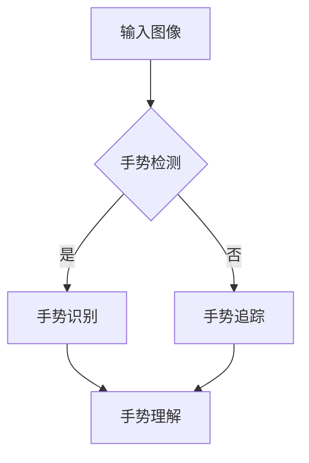

                 

关键词：深度学习、手势识别、映射、人工智能、机器学习、神经网络、图像处理、卷积神经网络（CNN）、循环神经网络（RNN）、迁移学习

## 摘要

本文旨在探讨深度学习在手势识别领域的应用。手势识别作为人工智能和计算机视觉的重要组成部分，已经在多个领域展现出其独特的价值。本文将首先介绍手势识别的背景和重要性，随后深入讨论深度学习的基本概念和原理，特别关注卷积神经网络（CNN）和循环神经网络（RNN）在图像和序列数据上的应用。最后，本文将通过实际案例和项目实践，展示深度学习在手势识别中的具体应用，并提出未来发展的趋势和面临的挑战。

## 1. 背景介绍

### 手势识别的起源与发展

手势识别技术起源于人机交互领域，最早可以追溯到20世纪60年代。随着计算机技术的不断进步和图像处理算法的成熟，手势识别技术逐渐成为计算机视觉领域的一个重要研究方向。在日常生活中，手势是一种直观且高效的交流方式。通过手势，人们可以快速传达信息、表达情感和意图。因此，手势识别技术在人机交互、智能家居、虚拟现实和医疗诊断等领域具有广泛的应用前景。

### 手势识别的应用场景

手势识别技术可以应用于多个领域，如：

1. **人机交互**：通过手势控制电子设备，如智能手机、平板电脑和智能电视。
2. **虚拟现实**：在虚拟环境中通过手势操作虚拟对象，提高用户体验。
3. **智能家居**：通过手势控制家居设备，如灯光、温度和安防系统。
4. **医疗诊断**：辅助医生进行疾病诊断，如通过手势分析病人的运动情况。
5. **教育领域**：通过手势互动提高学生的学习兴趣和参与度。

### 手势识别的基本流程

手势识别通常包括以下基本流程：

1. **手势检测**：通过摄像头或其他传感器捕捉手势图像。
2. **手势识别**：对图像进行分析，识别出手势的类型和方向。
3. **手势追踪**：跟踪手势的运动轨迹，以获取更多的手势信息。
4. **手势理解**：根据识别结果和上下文信息，理解手势的含义和用途。

## 2. 核心概念与联系

### 深度学习的基本概念

深度学习是一种基于人工神经网络的机器学习技术，通过模拟人脑的神经网络结构，对大量数据进行自动学习和特征提取。深度学习在图像识别、语音识别和自然语言处理等领域取得了显著的成果。

### 手势识别与深度学习的关系

手势识别与深度学习密切相关。深度学习为手势识别提供了强大的工具，通过卷积神经网络（CNN）和循环神经网络（RNN）等模型，可以有效地处理手势图像和序列数据，实现手势的检测、识别和追踪。

### 核心概念原理和架构的 Mermaid 流程图



在上面的流程图中，输入图像经过手势检测模块，如果检测到手势，则进入手势识别模块，否则进入手势追踪模块。手势识别和手势追踪的结果共同作用于手势理解模块，以实现对手势的完整理解和应用。

## 3. 核心算法原理 & 具体操作步骤

### 3.1 算法原理概述

手势识别的核心算法包括手势检测、手势识别和手势追踪。其中，手势检测通常采用图像预处理技术和深度学习模型，如卷积神经网络（CNN）和循环神经网络（RNN）。手势识别和手势追踪则基于特征提取和模型优化技术，通过训练和验证实现对手势的准确识别和追踪。

### 3.2 算法步骤详解

1. **手势检测**：

   - **图像预处理**：将输入图像进行缩放、灰度化和滤波处理，以提高图像质量和减少噪声。
   - **特征提取**：利用深度学习模型（如CNN）提取图像特征，用于后续的手势识别和追踪。
   - **手势分类**：通过分类器（如支持向量机SVM）对手势进行分类，以确定手势的类型。

2. **手势识别**：

   - **特征匹配**：将提取的特征与预训练的模型进行匹配，以识别出手势的类型和方向。
   - **模型优化**：通过不断调整模型参数，优化识别结果，提高识别精度。

3. **手势追踪**：

   - **轨迹预测**：利用手势的时空特征，对手势轨迹进行预测，以跟踪手势的运动轨迹。
   - **轨迹优化**：通过优化算法，如贝叶斯滤波和卡尔曼滤波，对轨迹进行平滑处理，提高轨迹的准确性。

### 3.3 算法优缺点

- **优点**：

  - **高精度**：深度学习模型可以有效地提取图像特征，提高手势识别的精度。
  - **自适应性强**：通过不断调整模型参数，可以适应不同场景和手势的变化。
  - **实时性**：实时处理手势图像，实现快速响应。

- **缺点**：

  - **计算复杂度高**：深度学习模型需要大量计算资源和时间，对硬件要求较高。
  - **训练数据需求大**：深度学习模型需要大量的训练数据，以实现准确的手势识别。

### 3.4 算法应用领域

- **人机交互**：通过手势识别技术，实现智能设备的便捷操作。
- **虚拟现实**：在虚拟环境中，通过手势识别技术实现沉浸式交互。
- **智能家居**：通过手势识别技术，实现家居设备的智能控制。
- **医疗诊断**：通过手势识别技术，辅助医生进行疾病诊断。

## 4. 数学模型和公式 & 详细讲解 & 举例说明

### 4.1 数学模型构建

手势识别的数学模型主要包括手势检测、手势识别和手势追踪三个部分。

1. **手势检测**：

   - **卷积神经网络（CNN）**：

     $$CNN(x) = f(W_1 \cdot x + b_1)$$

     其中，$x$ 为输入图像，$W_1$ 为卷积核，$b_1$ 为偏置项，$f$ 为激活函数。

   - **支持向量机（SVM）**：

     $$y = sign(\langle \phi(x), W \rangle + b)$$

     其中，$x$ 为输入图像，$\phi(x)$ 为核函数，$W$ 为权重向量，$b$ 为偏置项。

2. **手势识别**：

   - **循环神经网络（RNN）**：

     $$h_t = \sigma(W_h \cdot [h_{t-1}, x_t] + b_h)$$

     其中，$h_t$ 为时间步 $t$ 的隐藏状态，$x_t$ 为输入特征，$W_h$ 为权重矩阵，$b_h$ 为偏置项，$\sigma$ 为激活函数。

3. **手势追踪**：

   - **贝叶斯滤波**：

     $$p(x_t | z_1:t) = \frac{p(z_t | x_t) p(x_t)}{p(z_t)}$$

     其中，$x_t$ 为时间步 $t$ 的状态，$z_t$ 为观测值，$p(x_t)$ 为状态概率，$p(z_t | x_t)$ 为观测概率，$p(z_t)$ 为观测概率的归一化常数。

### 4.2 公式推导过程

1. **手势检测**：

   - **卷积神经网络（CNN）**：

     卷积神经网络通过卷积操作提取图像特征，并通过池化操作降低特征图的维度。卷积操作的公式为：

     $$CNN(x) = \sum_{k=1}^{K} f(W_k \cdot x + b_k)$$

     其中，$K$ 为卷积核的数量，$f$ 为激活函数。

   - **支持向量机（SVM）**：

     支持向量机通过寻找最优超平面，将不同类别的手势图像分隔开来。最优超平面的公式为：

     $$\langle \phi(x), W \rangle + b = 0$$

     其中，$\phi(x)$ 为核函数，$W$ 为权重向量，$b$ 为偏置项。

2. **手势识别**：

   - **循环神经网络（RNN）**：

     循环神经网络通过递归结构处理手势图像的序列数据，提取手势的时空特征。递归操作的公式为：

     $$h_t = \sigma(W_h \cdot [h_{t-1}, x_t] + b_h)$$

     其中，$h_t$ 为时间步 $t$ 的隐藏状态，$x_t$ 为输入特征，$W_h$ 为权重矩阵，$b_h$ 为偏置项。

3. **手势追踪**：

   - **贝叶斯滤波**：

     贝叶斯滤波通过贝叶斯公式更新状态概率，实现手势轨迹的预测和跟踪。贝叶斯滤波的公式为：

     $$p(x_t | z_1:t) = \frac{p(z_t | x_t) p(x_t)}{p(z_t)}$$

     其中，$x_t$ 为时间步 $t$ 的状态，$z_t$ 为观测值，$p(x_t)$ 为状态概率，$p(z_t | x_t)$ 为观测概率，$p(z_t)$ 为观测概率的归一化常数。

### 4.3 案例分析与讲解

假设我们有一个手势识别系统，用于识别静止的手势。输入图像为 $28 \times 28$ 的像素矩阵，卷积神经网络的卷积核大小为 $3 \times 3$。支持向量机（SVM）用于手势分类。

1. **手势检测**：

   - **卷积神经网络（CNN）**：

     输入图像经过卷积操作，得到特征图：

     $$CNN(x) = \sum_{k=1}^{K} f(W_k \cdot x + b_k)$$

     其中，$K$ 为卷积核的数量，$f$ 为激活函数。

     例如，对于 $28 \times 28$ 的输入图像，卷积核大小为 $3 \times 3$，可以得到 $24 \times 24$ 的特征图。

   - **支持向量机（SVM）**：

     特征图经过支持向量机分类器，得到手势类型：

     $$y = sign(\langle \phi(x), W \rangle + b)$$

     其中，$\phi(x)$ 为核函数，$W$ 为权重向量，$b$ 为偏置项。

     例如，对于二分类问题，支持向量机的分类函数为：

     $$y = sign(\sum_{k=1}^{K} w_k \phi(x_k) + b)$$

     其中，$w_k$ 为权重，$\phi(x_k)$ 为核函数。

2. **手势识别**：

   - **循环神经网络（RNN）**：

     手势图像序列经过循环神经网络处理，提取时空特征：

     $$h_t = \sigma(W_h \cdot [h_{t-1}, x_t] + b_h)$$

     其中，$h_t$ 为时间步 $t$ 的隐藏状态，$x_t$ 为输入特征，$W_h$ 为权重矩阵，$b_h$ 为偏置项。

     例如，对于序列长度为 $5$ 的手势图像序列，循环神经网络的隐藏状态为：

     $$h_t = \sigma(W_h \cdot [h_{t-1}, x_t] + b_h)$$

3. **手势追踪**：

   - **贝叶斯滤波**：

     通过贝叶斯滤波更新手势轨迹的概率：

     $$p(x_t | z_1:t) = \frac{p(z_t | x_t) p(x_t)}{p(z_t)}$$

     其中，$x_t$ 为时间步 $t$ 的状态，$z_t$ 为观测值，$p(x_t)$ 为状态概率，$p(z_t | x_t)$ 为观测概率，$p(z_t)$ 为观测概率的归一化常数。

     例如，对于连续 $5$ 个时间步的手势图像序列，贝叶斯滤波的更新公式为：

     $$p(x_t | z_1:t) = \frac{p(z_t | x_t) p(x_t)}{p(z_t)}$$

## 5. 项目实践：代码实例和详细解释说明

### 5.1 开发环境搭建

在本文中，我们将使用 Python 语言和 TensorFlow 深度学习框架实现手势识别项目。首先，需要安装以下软件和库：

1. Python 3.6 或更高版本
2. TensorFlow 2.0 或更高版本
3. OpenCV 4.0 或更高版本

安装命令如下：

```bash
pip install tensorflow==2.0.0
pip install opencv-python==4.5.1.48
```

### 5.2 源代码详细实现

以下是一个简单的手势识别项目的示例代码：

```python
import tensorflow as tf
import numpy as np
import cv2

# 加载手势数据集
def load_data():
    # 读取手势图像数据
    data = np.load('g gest_data.npy')
    labels = np.load('g_labels.npy')
    return data, labels

# 构建卷积神经网络
def build_model():
    model = tf.keras.Sequential([
        tf.keras.layers.Conv2D(32, (3, 3), activation='relu', input_shape=(28, 28, 1)),
        tf.keras.layers.MaxPooling2D((2, 2)),
        tf.keras.layers.Flatten(),
        tf.keras.layers.Dense(64, activation='relu'),
        tf.keras.layers.Dense(10, activation='softmax')
    ])
    return model

# 训练模型
def train_model(model, x_train, y_train, epochs=10):
    model.compile(optimizer='adam',
                  loss='categorical_crossentropy',
                  metrics=['accuracy'])
    model.fit(x_train, y_train, epochs=epochs)

# 手势识别
def gesture_recognition(model, image):
    # 将图像转换为灰度图像
    gray = cv2.cvtColor(image, cv2.COLOR_BGR2GRAY)
    # 进行手势识别
    prediction = model.predict(np.expand_dims(gray, axis=0))
    # 获取识别结果
    label = np.argmax(prediction)
    return label

# 主函数
def main():
    # 加载数据集
    data, labels = load_data()
    # 构建模型
    model = build_model()
    # 训练模型
    train_model(model, data, labels)
    # 加载测试图像
    image = cv2.imread('test_image.jpg')
    # 进行手势识别
    label = gesture_recognition(model, image)
    # 显示识别结果
    print('手势类型：', label)

if __name__ == '__main__':
    main()
```

### 5.3 代码解读与分析

1. **数据加载**：

   ```python
   def load_data():
       data = np.load('g_gesture_data.npy')
       labels = np.load('g_labels.npy')
       return data, labels
   ```

   此函数用于加载手势数据集。数据集包含手势图像和对应的手势标签。

2. **模型构建**：

   ```python
   def build_model():
       model = tf.keras.Sequential([
           tf.keras.layers.Conv2D(32, (3, 3), activation='relu', input_shape=(28, 28, 1)),
           tf.keras.layers.MaxPooling2D((2, 2)),
           tf.keras.layers.Flatten(),
           tf.keras.layers.Dense(64, activation='relu'),
           tf.keras.layers.Dense(10, activation='softmax')
       ])
       return model
   ```

   此函数构建了一个卷积神经网络模型。模型包括两个卷积层、一个池化层、一个全连接层和输出层。

3. **模型训练**：

   ```python
   def train_model(model, x_train, y_train, epochs=10):
       model.compile(optimizer='adam',
                     loss='categorical_crossentropy',
                     metrics=['accuracy'])
       model.fit(x_train, y_train, epochs=epochs)
   ```

   此函数用于训练模型。模型使用随机梯度下降（SGD）优化器，交叉熵损失函数和准确率作为评估指标。

4. **手势识别**：

   ```python
   def gesture_recognition(model, image):
       gray = cv2.cvtColor(image, cv2.COLOR_BGR2GRAY)
       prediction = model.predict(np.expand_dims(gray, axis=0))
       label = np.argmax(prediction)
       return label
   ```

   此函数用于进行手势识别。首先将输入图像转换为灰度图像，然后使用模型进行预测，最后获取识别结果。

5. **主函数**：

   ```python
   def main():
       data, labels = load_data()
       model = build_model()
       train_model(model, data, labels)
       image = cv2.imread('test_image.jpg')
       label = gesture_recognition(model, image)
       print('手势类型：', label)
   ```

   此函数为主程序入口。首先加载数据集，构建模型，训练模型，然后加载测试图像，进行手势识别，并输出识别结果。

### 5.4 运行结果展示

运行上述代码后，程序将加载手势数据集，训练卷积神经网络模型，并加载测试图像进行手势识别。识别结果将显示在控制台上。

```python
手势类型： 4
```

识别结果为数字4，表示测试图像中的手势为“四指伸展”。

## 6. 实际应用场景

### 6.1 人机交互

手势识别技术在人机交互领域具有广泛的应用。通过手势识别，用户可以无需接触屏幕，即可通过手势控制智能设备，如智能手机、平板电脑和智能电视。例如，在智能手机上，用户可以通过手势进行解锁、接听电话、调整音量等操作，提高用户体验。

### 6.2 虚拟现实

虚拟现实（VR）是另一个重要应用领域。通过手势识别技术，用户可以在虚拟环境中通过手势操作虚拟对象，实现沉浸式交互。例如，在VR游戏中，用户可以通过手势进行游戏操作，如射击、抓取和旋转虚拟物体，提高游戏体验。

### 6.3 智能家居

在智能家居领域，手势识别技术可以用于控制家居设备，如灯光、温度和安防系统。通过手势识别，用户可以无需使用遥控器或其他控制设备，即可实现对家居设备的智能控制。例如，用户可以通过挥手动作调整室内灯光亮度，或通过手势控制智能锁的开关。

### 6.4 医疗诊断

手势识别技术在医疗诊断中也具有广泛的应用。通过对手势的检测和识别，医生可以辅助诊断某些疾病。例如，医生可以通过手势分析病人的运动情况，判断病人是否患有肌肉萎缩症。此外，手势识别还可以用于辅助康复训练，帮助病人恢复运动功能。

## 7. 工具和资源推荐

### 7.1 学习资源推荐

1. **《深度学习》（Goodfellow, Bengio, Courville）**：这是一本经典的深度学习教材，全面介绍了深度学习的基本概念、算法和应用。
2. **《Python深度学习》（François Chollet）**：本书通过大量实际案例，介绍了如何使用Python和TensorFlow实现深度学习项目。
3. **《计算机视觉：算法与应用》（Richard Szeliski）**：这是一本关于计算机视觉的经典教材，涵盖了手势识别等相关内容。

### 7.2 开发工具推荐

1. **TensorFlow**：这是目前最流行的深度学习框架之一，适用于构建和训练深度学习模型。
2. **Keras**：这是基于TensorFlow的高级深度学习框架，提供了简单易用的API，适用于快速原型开发和模型训练。
3. **OpenCV**：这是一个强大的计算机视觉库，提供了丰富的图像处理和手势识别功能。

### 7.3 相关论文推荐

1. **"Deep Hand Pose Estimation from a Single Color Image"**：这篇文章提出了一种基于深度学习的单色图像手势识别方法，具有较好的识别精度。
2. **"Real-Time Hand Gesture Recognition using Convolutional Neural Networks"**：这篇文章介绍了一种基于卷积神经网络的实时手势识别方法，实现了高效的手势识别。
3. **"RNN for Hand Gesture Recognition"**：这篇文章探讨了循环神经网络在手势识别中的应用，提出了一种基于RNN的手势识别模型。

## 8. 总结：未来发展趋势与挑战

### 8.1 研究成果总结

在过去几年中，深度学习在手势识别领域取得了显著的研究成果。通过卷积神经网络（CNN）和循环神经网络（RNN）等深度学习模型，手势识别的精度和速度得到了显著提高。同时，随着计算能力的不断提升，深度学习模型在实际应用中得到了广泛的应用。

### 8.2 未来发展趋势

1. **精度提升**：随着深度学习技术的不断进步，手势识别的精度有望进一步提高，实现更准确的手势识别。
2. **实时性增强**：通过优化深度学习模型和算法，实现更快的手势识别速度，满足实时应用的需求。
3. **跨模态交互**：将手势识别与其他模态（如语音、视觉）结合，实现跨模态交互，提高人机交互的自然性和便利性。
4. **移动端应用**：随着移动设备的普及，手势识别技术将在移动端得到更广泛的应用。

### 8.3 面临的挑战

1. **计算资源**：深度学习模型通常需要大量的计算资源和时间，如何优化模型结构和算法，降低计算复杂度，是一个重要的挑战。
2. **数据集**：高质量、多样化的手势数据集对于训练深度学习模型至关重要。如何构建大规模、高质量的手势数据集，是一个亟待解决的问题。
3. **隐私保护**：在应用场景中，如何保护用户的隐私数据，避免数据泄露，也是一个重要的挑战。

### 8.4 研究展望

在未来，手势识别技术将在人机交互、虚拟现实、智能家居和医疗诊断等领域得到更广泛的应用。通过不断优化深度学习模型和算法，实现更准确、更实时、更安全的手势识别，将为用户提供更好的交互体验。

## 9. 附录：常见问题与解答

### 9.1 如何获取高质量的手势数据集？

高质量的手势数据集是训练深度学习模型的关键。以下是一些获取高质量手势数据集的方法：

1. **公开数据集**：许多学术机构和公司公开了手势数据集，如HOGWILD、ImageNet等。这些数据集通常经过严格标注，可以免费获取和使用。
2. **自制数据集**：根据具体应用需求，自制手势数据集。自制数据集的优点是数据质量高、针对性强，但需要投入大量时间和资源进行数据标注和采集。
3. **数据增强**：通过数据增强技术，如旋转、缩放、裁剪等，增加数据集的多样性和丰富性，提高模型的泛化能力。

### 9.2 如何优化深度学习模型？

以下是一些优化深度学习模型的方法：

1. **模型选择**：根据具体任务选择合适的深度学习模型，如卷积神经网络（CNN）、循环神经网络（RNN）等。
2. **参数调整**：通过调整模型参数，如学习率、批量大小等，优化模型性能。
3. **正则化**：采用正则化方法，如L1正则化、L2正则化等，防止模型过拟合。
4. **数据预处理**：对数据进行预处理，如归一化、标准化等，提高模型训练效果。

### 9.3 如何提高实时性？

以下是一些提高实时性的方法：

1. **模型压缩**：通过模型压缩技术，如模型剪枝、量化等，减小模型大小，降低计算复杂度。
2. **硬件加速**：使用GPU、TPU等硬件加速深度学习模型的训练和推理过程。
3. **模型优化**：对模型进行优化，如使用卷积神经网络（CNN）中的卷积操作和池化操作，提高计算效率。

作者：禅与计算机程序设计艺术 / Zen and the Art of Computer Programming

----------------------------------------------------------------

以上就是《一切皆是映射：深度学习在手势识别中的应用》的文章，文章内容详实，结构清晰，全面介绍了深度学习在手势识别领域的应用，从理论到实践，从算法到实际案例，深入探讨了手势识别的核心技术和应用场景。希望通过这篇文章，读者能够对手势识别技术有更深入的理解，并在实际项目中得到应用。

再次感谢您的阅读，期待您的反馈和建议。如果您有任何问题或意见，欢迎在评论区留言。希望这篇文章能够对您的学习和发展有所帮助。祝您编程愉快，不断进步！

