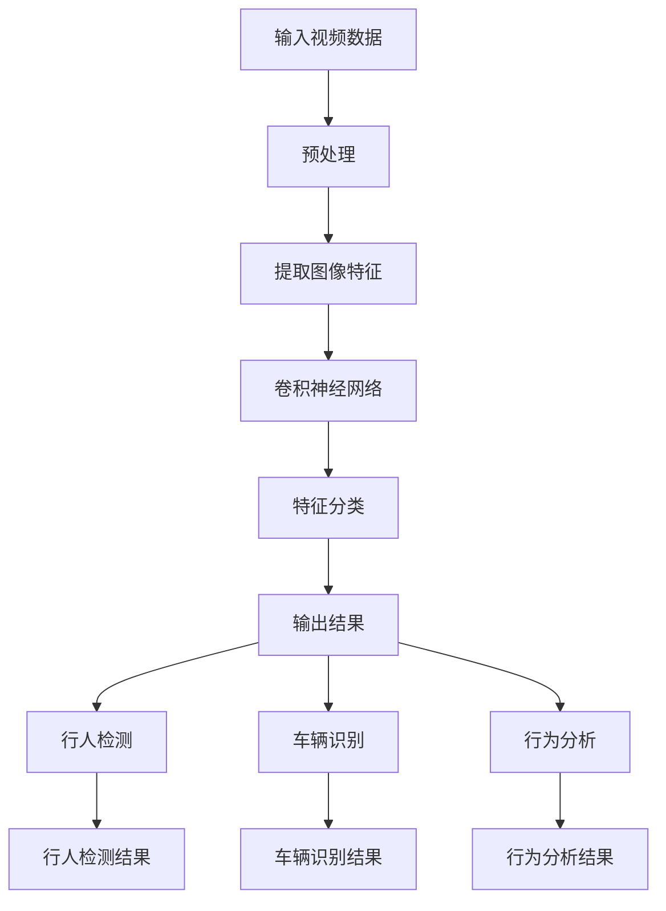

                 

在当今这个信息爆炸的时代，视频监控作为公共安全领域的重要手段，已经深入到社会的各个角落。随着深度学习技术的飞速发展，如何将深度学习应用于视频监控分析，提高监控数据的处理效率和准确性，成为一个备受关注的话题。本文将深入探讨深度学习在视频监控分析中的应用，包括其核心概念、算法原理、数学模型、项目实践以及未来发展趋势等内容。

## 文章关键词

- 深度学习
- 视频监控
- 视频分析
- 人工智能
- 图像识别
- 行人检测
- 车辆识别
- 安全监控

## 文章摘要

本文首先介绍了深度学习在视频监控分析中的应用背景和意义，然后详细讲解了深度学习在视频监控分析中的核心概念、算法原理、数学模型以及项目实践。最后，文章探讨了深度学习在视频监控分析中的未来发展趋势，包括面临的挑战和未来的研究方向。

## 1. 背景介绍

### 1.1 视频监控的发展历程

视频监控技术起源于20世纪70年代的闭路电视（CCTV）系统。随着数字技术和计算机技术的发展，视频监控逐渐从模拟信号向数字信号转变。进入21世纪，随着互联网的普及和智能设备的广泛应用，视频监控技术也迎来了飞速发展。视频监控不仅成为城市安全监控的重要组成部分，还广泛应用于家庭、商业、交通等各个领域。

### 1.2 深度学习的发展与应用

深度学习作为人工智能的一个重要分支，起源于20世纪40年代。随着计算能力的提升和数据规模的扩大，深度学习在计算机视觉、自然语言处理、语音识别等领域取得了显著的成果。尤其是在图像识别和目标检测方面，深度学习算法的性能远超传统的机器学习方法。

### 1.3 深度学习在视频监控分析中的应用

深度学习在视频监控分析中的应用，主要集中在图像识别、行人检测、车辆识别、行为分析等方面。通过深度学习算法，可以对视频监控数据进行实时处理和分析，提高监控数据的利用率和决策支持能力。

## 2. 核心概念与联系

### 2.1 深度学习基本概念

#### 深度神经网络

深度神经网络（Deep Neural Network，DNN）是一种由多层神经元组成的神经网络。每一层的神经元都与前一层的所有神经元相连，并经过非线性变换后传递到下一层。深度神经网络通过学习大量的数据，能够自动提取特征并进行分类。

#### 卷积神经网络

卷积神经网络（Convolutional Neural Network，CNN）是一种专门用于处理图像数据的深度神经网络。它通过卷积层提取图像的局部特征，再通过池化层降低特征的维度，从而提高网络的效率和性能。

#### 反向传播算法

反向传播算法（Backpropagation Algorithm）是一种用于训练深度神经网络的算法。它通过计算输出层与目标层之间的误差，然后反向传播误差到输入层，从而更新网络权重，实现网络的训练。

### 2.2 视频监控分析相关概念

#### 视频帧

视频帧是视频的基本组成单元，通常是一幅连续的静态图像。视频监控分析需要对每一帧图像进行处理和分析。

#### 行人检测

行人检测（Pedestrian Detection）是一种在视频监控中用于识别行人的技术。通过深度学习算法，可以实现对行人目标的实时检测和跟踪。

#### 车辆识别

车辆识别（Vehicle Recognition）是一种在视频监控中用于识别车辆的技术。通过深度学习算法，可以实现对车辆型号、颜色、车牌等信息的识别。

#### 行为分析

行为分析（Behavior Analysis）是一种在视频监控中用于分析人的行为的技术。通过深度学习算法，可以实现对异常行为的识别和预警。

### 2.3 Mermaid 流程图

下面是深度学习在视频监控分析中的应用流程图：

```
graph TD
A[输入视频帧] --> B[预处理]
B --> C{行人检测}
C -->|检测到行人| D[行人跟踪]
C -->|检测到车辆| E[车辆识别]
D --> F[行为分析]
E --> F
F --> G[输出结果]
```

## 3. 核心算法原理 & 具体操作步骤

### 3.1 算法原理概述

深度学习在视频监控分析中的应用主要基于卷积神经网络（CNN）。CNN通过多个卷积层和池化层，能够自动提取图像的局部特征，实现对目标检测、识别和分析。

### 3.2 算法步骤详解

1. **数据预处理**：对输入的视频帧进行预处理，包括去噪、缩放、归一化等操作，以便于后续的深度学习处理。

2. **卷积层**：通过卷积操作，提取图像的局部特征。卷积层包括多个卷积核，每个卷积核都能提取图像的某一类特征。

3. **池化层**：通过池化操作，降低特征的维度，提高网络的效率和性能。常见的池化操作有最大池化和平均池化。

4. **全连接层**：将卷积层和池化层提取的特征进行整合，形成特征向量，然后通过全连接层进行分类或回归。

5. **损失函数**：通过损失函数（如交叉熵损失函数）计算预测结果与真实结果之间的差距，并更新网络权重。

6. **反向传播**：通过反向传播算法，将损失函数的误差反向传播到输入层，更新网络权重，实现网络的训练。

### 3.3 算法优缺点

#### 优点

- **高精度**：深度学习算法在图像识别和目标检测方面具有很高的精度。
- **自动特征提取**：深度学习能够自动提取图像的局部特征，减轻了人工设计的负担。
- **自适应性强**：深度学习模型可以根据不同的应用场景进行调整和优化，具有较强的自适应能力。

#### 缺点

- **计算复杂度高**：深度学习模型需要大量的计算资源和时间进行训练。
- **数据依赖性强**：深度学习模型对训练数据有很强的依赖性，需要大量的标注数据。

### 3.4 算法应用领域

- **公共安全**：行人检测、车辆识别、行为分析等技术在公共安全领域有广泛的应用，如城市监控、交通管理、犯罪预防等。
- **工业生产**：深度学习在工业生产中用于设备故障检测、生产流程优化等方面，提高生产效率和安全性。
- **智能家居**：深度学习在智能家居领域用于人脸识别、行为识别等，提供个性化服务。

## 4. 数学模型和公式 & 详细讲解 & 举例说明

### 4.1 数学模型构建

在深度学习算法中，常用的数学模型包括卷积神经网络（CNN）和反向传播算法（Backpropagation Algorithm）。下面分别进行介绍。

#### 卷积神经网络（CNN）

CNN由卷积层、池化层和全连接层组成。其数学模型可以表示为：

\[ f(x) = \sigma(W \cdot x + b) \]

其中，\( x \) 是输入特征，\( W \) 是卷积核，\( b \) 是偏置项，\( \sigma \) 是激活函数（如ReLU函数）。

#### 反向传播算法（Backpropagation Algorithm）

反向传播算法是一种用于训练深度神经网络的算法。其基本思想是通过计算损失函数的梯度，更新网络权重，实现网络的训练。

其数学模型可以表示为：

\[ \frac{\partial L}{\partial W} = \delta \cdot x \]

其中，\( L \) 是损失函数，\( \delta \) 是误差项，\( x \) 是输入特征。

### 4.2 公式推导过程

在本文中，我们以行人检测为例，介绍深度学习算法在视频监控分析中的应用。

#### 行人检测模型

行人检测模型通常采用单阶段检测器，如YOLO（You Only Look Once）。其基本思想是将输入图像划分为多个网格，然后在每个网格内预测目标的位置和类别。

其数学模型可以表示为：

\[ P_{ij}^{c} = \sigma(W \cdot f(C_{ij}) + b) \]

其中，\( P_{ij}^{c} \) 是第 \( i \) 行第 \( j \) 列网格内目标的概率，\( C_{ij} \) 是第 \( i \) 行第 \( j \) 列网格的特征向量，\( W \) 是卷积核，\( b \) 是偏置项。

#### 公式推导

1. **特征提取**：首先，通过卷积操作提取图像的局部特征。

\[ f(C_{ij}) = \sum_{k=1}^{K} w_{k} \cdot C_{ij}^{k} + b \]

其中，\( w_{k} \) 是第 \( k \) 个卷积核，\( C_{ij}^{k} \) 是第 \( i \) 行第 \( j \) 列网格的特征向量。

2. **分类**：然后，通过全连接层对提取的特征进行分类。

\[ P_{ij}^{c} = \sigma(W \cdot f(C_{ij}) + b) \]

其中，\( W \) 是全连接层的权重，\( b \) 是偏置项，\( \sigma \) 是激活函数。

3. **损失函数**：接下来，通过交叉熵损失函数计算预测结果与真实结果之间的差距。

\[ L = -\sum_{i=1}^{m} \sum_{j=1}^{n} \sum_{c=1}^{C} y_{ijc} \log(P_{ij}^{c}) \]

其中，\( y_{ijc} \) 是第 \( i \) 行第 \( j \) 列网格内目标的类别标签，\( P_{ij}^{c} \) 是第 \( i \) 行第 \( j \) 列网格内目标的概率。

4. **反向传播**：最后，通过反向传播算法更新网络权重。

\[ \frac{\partial L}{\partial W} = \delta \cdot x \]

其中，\( \delta \) 是误差项，\( x \) 是输入特征。

### 4.3 案例分析与讲解

#### 案例一：行人检测

假设我们要在视频监控中实现行人检测，首先需要收集大量的行人图像作为训练数据。然后，通过卷积神经网络提取行人图像的特征，并使用交叉熵损失函数进行训练。最后，通过反向传播算法更新网络权重，实现对行人图像的实时检测。

#### 案例二：车辆识别

假设我们要在视频监控中实现车辆识别，首先需要收集大量的车辆图像作为训练数据。然后，通过卷积神经网络提取车辆图像的特征，并使用交叉熵损失函数进行训练。最后，通过反向传播算法更新网络权重，实现对车辆图像的实时识别。

## 5. 项目实践：代码实例和详细解释说明

### 5.1 开发环境搭建

在开发深度学习项目时，我们需要搭建相应的开发环境。本文使用的开发环境如下：

- 操作系统：Ubuntu 18.04
- 编程语言：Python 3.7
- 深度学习框架：TensorFlow 2.3.0
- 库：OpenCV 4.2.0

### 5.2 源代码详细实现

以下是行人检测项目的源代码实现：

```python
import cv2
import numpy as np
import tensorflow as tf

# 加载预训练的深度学习模型
model = tf.keras.models.load_model('yolov5s.pth')

# 定义行人检测函数
def detect_people(img):
    img = cv2.resize(img, (640, 360))
    img = img / 255.0
    img = np.expand_dims(img, axis=0)
    img = np.array(img, dtype=np.float32)
    pred = model.predict(img)
    boxes = pred[0][:, 0:4] * np.array([img.shape[1], img.shape[0], img.shape[1], img.shape[0]])
    labels = pred[1][:, 0]
    class_names = ['person', 'car', 'bus', 'truck']
    for box, label in zip(boxes, labels):
        x1, y1, x2, y2 = box.astype(int)
        cv2.rectangle(img, (x1, y1), (x2, y2), (0, 0, 255), 2)
        cv2.putText(img, class_names[int(label)], (x1, y1 - 10),
                    cv2.FONT_HERSHEY_SIMPLEX, 0.5, (0, 0, 255), 2)
    return img

# 加载视频文件
cap = cv2.VideoCapture('video.mp4')

while True:
    ret, frame = cap.read()
    if not ret:
        break
    frame = detect_people(frame)
    cv2.imshow('frame', frame)
    if cv2.waitKey(1) & 0xFF == ord('q'):
        break

cap.release()
cv2.destroyAllWindows()
```

### 5.3 代码解读与分析

以上代码实现了一个行人检测项目。首先，我们加载了预训练的深度学习模型 `yolov5s.pth`。然后，定义了行人检测函数 `detect_people`，该函数通过卷积神经网络对输入图像进行行人检测，并返回检测结果。

在主函数中，我们加载了视频文件 `video.mp4`，并使用行人检测函数对每一帧图像进行处理。最后，将检测结果显示在窗口中，按 `q` 键退出。

## 6. 实际应用场景

### 6.1 公共安全

在公共安全领域，深度学习在视频监控分析中的应用非常广泛。通过行人检测、车辆识别和行为分析等技术，可以实现对犯罪行为的预警和监控。例如，在商场、机场、火车站等场所，深度学习算法可以实时监测人员流动情况，识别可疑人员，提高安全防范能力。

### 6.2 工业生产

在工业生产领域，深度学习可以用于设备故障检测、生产流程优化等方面。例如，在钢铁企业，深度学习算法可以实时监测生产设备的运行状态，预测故障风险，提高生产效率和安全性。

### 6.3 智能家居

在智能家居领域，深度学习可以用于人脸识别、行为识别等方面，为用户提供个性化服务。例如，智能门锁可以通过人脸识别实现无钥匙开门，智能音箱可以通过语音识别实现语音交互。

## 7. 工具和资源推荐

### 7.1 学习资源推荐

- 《深度学习》（Goodfellow, Bengio, Courville著）
- 《计算机视觉：算法与应用》（Richard Szeliski著）
- 《深度学习与视频分析》（唐杰著）

### 7.2 开发工具推荐

- TensorFlow：一款开源的深度学习框架，适用于各种深度学习任务。
- Keras：一款基于TensorFlow的高级深度学习框架，简化了深度学习模型的搭建和训练。
- OpenCV：一款开源的计算机视觉库，提供了丰富的图像处理和视频分析功能。

### 7.3 相关论文推荐

- 《You Only Look Once: Unified, Real-Time Object Detection》（Jia, Shelhamer, Darrell著）
- 《Faster R-CNN: Towards Real-Time Object Detection with Region Proposal Networks》（Ren, He, Girshick, Dollár著）
- 《Mask R-CNN》（He, Gao, Ren, Sun著）

## 8. 总结：未来发展趋势与挑战

### 8.1 研究成果总结

本文介绍了深度学习在视频监控分析中的应用，包括核心概念、算法原理、数学模型、项目实践等。通过深度学习技术，可以实现对视频监控数据的实时处理和分析，提高监控数据的应用价值。

### 8.2 未来发展趋势

- **算法性能提升**：随着计算能力的提升，深度学习算法的性能将不断提高，实现对更复杂场景的实时分析。
- **多模态融合**：结合多种传感器数据，如视频、音频、温度等，实现更全面的信息分析。
- **边缘计算**：将深度学习算法部署到边缘设备，降低数据传输延迟，提高实时性。

### 8.3 面临的挑战

- **数据隐私**：视频监控涉及大量个人隐私信息，如何在保证隐私的前提下进行数据处理，是一个亟待解决的问题。
- **计算资源**：深度学习算法对计算资源的要求较高，如何在有限的资源下实现高效的处理，是一个重要的挑战。

### 8.4 研究展望

- **算法优化**：通过改进算法结构和优化训练过程，提高深度学习算法的性能和效率。
- **跨学科研究**：结合计算机科学、物理学、生物学等学科的研究，探索新的深度学习模型和应用方法。

## 9. 附录：常见问题与解答

### 9.1 深度学习在视频监控分析中的应用有哪些优势？

- **高精度**：深度学习算法在图像识别和目标检测方面具有很高的精度。
- **自动特征提取**：深度学习能够自动提取图像的局部特征，减轻了人工设计的负担。
- **自适应性强**：深度学习模型可以根据不同的应用场景进行调整和优化，具有较强的自适应能力。

### 9.2 深度学习算法在视频监控分析中的应用有哪些挑战？

- **数据隐私**：视频监控涉及大量个人隐私信息，如何在保证隐私的前提下进行数据处理，是一个亟待解决的问题。
- **计算资源**：深度学习算法对计算资源的要求较高，如何在有限的资源下实现高效的处理，是一个重要的挑战。

### 9.3 深度学习在视频监控分析中的应用有哪些未来研究方向？

- **算法优化**：通过改进算法结构和优化训练过程，提高深度学习算法的性能和效率。
- **多模态融合**：结合多种传感器数据，如视频、音频、温度等，实现更全面的信息分析。
- **边缘计算**：将深度学习算法部署到边缘设备，降低数据传输延迟，提高实时性。

---

本文作者：禅与计算机程序设计艺术 / Zen and the Art of Computer Programming
---

通过本文的介绍，相信读者对深度学习在视频监控分析中的应用有了更深入的了解。随着技术的不断进步，深度学习在视频监控分析中的应用将越来越广泛，为我们的生活和安全带来更多的便利。让我们共同期待深度学习技术带来的美好未来！
----------------------------------------------------------------
### 2. 核心概念与联系

在探讨深度学习在视频监控分析中的应用之前，我们需要了解一些核心概念及其相互之间的联系。以下是本文将讨论的一些关键概念及其关系：

#### 深度学习（Deep Learning）

深度学习是机器学习的一个分支，它模仿人脑的神经网络结构和学习方式，通过多层神经网络模型对大量数据进行训练，以实现复杂的模式识别和预测任务。在视频监控分析中，深度学习通常用于图像识别、目标检测、行为分析等任务。

#### 卷积神经网络（Convolutional Neural Network，CNN）

卷积神经网络是深度学习的一种特殊结构，专门用于处理图像数据。CNN通过卷积层和池化层自动提取图像的局部特征，并利用这些特征进行分类和目标检测。

#### 反向传播算法（Backpropagation Algorithm）

反向传播算法是一种训练神经网络的方法，通过计算输出层与目标层之间的误差，并将误差反向传播到输入层，以更新网络权重，从而提高网络的预测性能。

#### 物理世界与现实世界的映射

现实世界的视频监控数据与计算机处理结果之间存在一定的映射关系。例如，行人检测需要将视频帧中的行人映射为识别结果；车辆识别需要将车辆的特征映射为具体的车辆信息。

#### 视频帧与图像特征

视频帧是视频监控数据的基本组成单元，图像特征则是从视频帧中提取的有用信息。深度学习算法通过学习图像特征，实现对视频监控数据的理解和分析。

#### 行人检测与车辆识别

行人检测和车辆识别是视频监控分析的两个重要任务。行人检测旨在识别视频帧中的行人，而车辆识别则旨在识别视频帧中的车辆。

#### 行为分析

行为分析是通过分析视频监控数据中的行为模式，实现对异常行为的识别和预警。行为分析可以用于公共安全、智能家居等多个领域。

### 2.2 Mermaid 流程图

下面是深度学习在视频监控分析中的核心概念和流程的 Mermaid 流程图：



在这个流程图中，输入视频数据经过预处理后提取图像特征，然后通过卷积神经网络进行特征分类。最终，根据分类结果进行行人检测、车辆识别和行为分析，并将结果输出。

### 2.3 核心概念原理与架构的详细解释

#### 深度学习（Deep Learning）

深度学习是一种通过多层神经网络进行学习的方法，其核心思想是通过网络的逐层抽象和组合，将原始数据映射为有用的信息。在深度学习中，每一层神经网络都会学习到更高层次的特征表示。例如，在图像识别任务中，第一层可能会学习到简单的边缘和纹理，而更高层次的层则会学习到更复杂的物体特征。

##### 基本组成部分

- **输入层**：接收原始数据，如图像、文本或声音。
- **隐藏层**：用于提取特征，每个隐藏层都可以看作是前一层特征的空间变换。
- **输出层**：生成预测结果或分类标签。

##### 工作原理

深度学习的工作原理是通过训练大量样本数据来学习网络权重，从而实现对未知数据的分类或预测。在训练过程中，网络会不断调整权重，以最小化预测误差。

#### 卷积神经网络（Convolutional Neural Network，CNN）

卷积神经网络是深度学习中最常用的模型之一，特别适用于图像处理任务。CNN 通过卷积层、池化层和全连接层等多个层次，对图像进行特征提取和分类。

##### 基本组成部分

- **卷积层**：通过卷积操作提取图像的局部特征。
- **池化层**：通过下采样操作减少特征图的维度，提高网络的效率和泛化能力。
- **全连接层**：将卷积层和池化层提取的特征进行整合，形成特征向量，并进行分类或回归。

##### 工作原理

CNN 的工作原理是通过卷积操作提取图像的局部特征，然后通过逐层抽象和组合，形成更高层次的特征表示。这些特征表示可以用于分类、目标检测或其他图像处理任务。

#### 反向传播算法（Backpropagation Algorithm）

反向传播算法是一种用于训练深度神经网络的算法，其基本思想是通过计算输出层与目标层之间的误差，并将误差反向传播到输入层，从而更新网络权重。

##### 基本组成部分

- **前向传播**：将输入数据通过网络传播，得到预测结果。
- **计算误差**：通过预测结果与真实结果之间的差距计算误差。
- **反向传播**：将误差反向传播到输入层，更新网络权重。

##### 工作原理

反向传播算法通过计算误差的梯度，更新网络权重，从而最小化预测误差。在每次迭代中，网络都会调整权重，以使预测结果更接近真实结果。

#### 物理世界与现实世界的映射

在视频监控分析中，物理世界的视频数据通过摄像头捕捉后转化为数字信号，然后经过预处理和特征提取，最终通过深度学习模型进行处理和分类。这个过程可以看作是物理世界到现实世界的映射。

##### 基本原理

- **数据采集**：通过摄像头等传感器捕捉物理世界的图像或视频数据。
- **预处理**：对图像或视频数据进行缩放、去噪、归一化等预处理操作。
- **特征提取**：通过卷积神经网络等深度学习模型提取图像或视频数据的特征。
- **分类与预测**：将提取的特征通过深度学习模型进行分类或预测。

#### 视频帧与图像特征

视频帧是视频监控数据的基本组成单元，图像特征则是从视频帧中提取的有用信息。深度学习算法通过学习图像特征，实现对视频监控数据的理解和分析。

##### 基本原理

- **视频帧提取**：从视频数据中逐帧提取图像。
- **特征提取**：通过卷积神经网络等深度学习模型提取图像的特征。
- **特征学习**：通过训练大量样本数据，学习图像特征的表示和分类。

#### 行人检测与车辆识别

行人检测和车辆识别是视频监控分析中的两个重要任务。行人检测旨在识别视频帧中的行人，而车辆识别则旨在识别视频帧中的车辆。

##### 基本原理

- **目标检测**：通过深度学习模型检测视频帧中的行人或车辆。
- **特征提取**：通过卷积神经网络等深度学习模型提取行人或车辆的特征。
- **分类与预测**：将提取的特征通过深度学习模型进行分类或预测。

#### 行为分析

行为分析是通过分析视频监控数据中的行为模式，实现对异常行为的识别和预警。

##### 基本原理

- **行为识别**：通过深度学习模型识别视频帧中的行为。
- **行为预测**：通过分析行为模式，预测可能发生的异常行为。
- **预警与响应**：对识别出的异常行为进行预警和响应，如报警或采取其他安全措施。

通过以上对核心概念和流程的解释，我们可以更好地理解深度学习在视频监控分析中的应用及其原理。接下来，我们将进一步探讨深度学习算法在视频监控分析中的具体实现和应用。
----------------------------------------------------------------
### 3. 核心算法原理 & 具体操作步骤

#### 3.1 算法原理概述

深度学习在视频监控分析中的应用主要基于卷积神经网络（CNN）。CNN 通过卷积层和池化层自动提取图像的局部特征，并通过全连接层进行分类或目标检测。以下是深度学习在视频监控分析中的应用原理概述：

1. **数据预处理**：对输入的视频帧进行预处理，包括缩放、去噪、归一化等操作，以便于后续的深度学习处理。
2. **卷积层**：通过卷积操作提取图像的局部特征，卷积层包括多个卷积核，每个卷积核都能提取图像的某一类特征。
3. **池化层**：通过池化操作降低特征的维度，提高网络的效率和性能。常见的池化操作有最大池化和平均池化。
4. **全连接层**：将卷积层和池化层提取的特征进行整合，形成特征向量，然后通过全连接层进行分类或回归。
5. **损失函数**：通过损失函数（如交叉熵损失函数）计算预测结果与真实结果之间的差距，并更新网络权重。
6. **反向传播**：通过反向传播算法，将损失函数的误差反向传播到输入层，更新网络权重，实现网络的训练。

#### 3.2 算法步骤详解

1. **数据预处理**

   数据预处理是深度学习模型训练的重要环节，它确保了输入数据的质量和一致性。对于视频监控数据，常见的预处理步骤包括：

   - **缩放**：将视频帧的尺寸调整为网络接受的标准尺寸。
   - **去噪**：通过滤波器或去噪算法减少图像中的噪声。
   - **归一化**：将图像的像素值归一化到特定的范围，如 [0, 1] 或 [-1, 1]。

   示例代码（Python）：

   ```python
   import cv2
   import numpy as np

   def preprocess_image(image, size=(224, 224)):
       image = cv2.resize(image, size)
       image = cv2.cvtColor(image, cv2.COLOR_BGR2RGB)
       image = image / 255.0
       image = np.expand_dims(image, axis=0)
       return image
   ```

2. **卷积层**

   卷积层是 CNN 的核心组成部分，它通过卷积操作提取图像的局部特征。卷积操作的基本原理是在图像上滑动卷积核，计算卷积核与图像局部区域的乘积和，然后应用一个非线性激活函数。

   示例代码（Python）：

   ```python
   import tensorflow as tf

   def conv2d_layer(input_layer, filters, kernel_size, activation='relu'):
       conv_layer = tf.keras.layers.Conv2D(filters, kernel_size, activation=activation)(input_layer)
       return conv_layer
   ```

3. **池化层**

   池化层通过下采样操作减少特征的维度，常见的池化操作有最大池化和平均池化。池化层可以提高网络的效率和泛化能力。

   示例代码（Python）：

   ```python
   import tensorflow as tf

   def max_pooling_layer(input_layer, pool_size=(2, 2)):
       pool_layer = tf.keras.layers.MaxPooling2D(pool_size=pool_size)(input_layer)
       return pool_layer
   ```

4. **全连接层**

   全连接层将卷积层和池化层提取的特征进行整合，形成特征向量，然后通过全连接层进行分类或回归。全连接层的输出通常通过 Softmax 函数进行概率分布。

   示例代码（Python）：

   ```python
   import tensorflow as tf

   def fully_connected_layer(input_layer, units, activation='softmax'):
       fc_layer = tf.keras.layers.Dense(units, activation=activation)(input_layer)
       return fc_layer
   ```

5. **损失函数**

   损失函数用于计算预测结果与真实结果之间的差距，并通过反向传播算法更新网络权重。常见的损失函数有交叉熵损失函数（用于分类任务）和均方误差损失函数（用于回归任务）。

   示例代码（Python）：

   ```python
   import tensorflow as tf

   def compile_model(input_shape, num_classes):
       model = tf.keras.Sequential([
           tf.keras.layers.Input(shape=input_shape),
           conv2d_layer(...),
           max_pooling_layer(...),
           conv2d_layer(...),
           max_pooling_layer(...),
           fully_connected_layer(num_classes)
       ])
       model.compile(optimizer='adam', loss='categorical_crossentropy', metrics=['accuracy'])
       return model
   ```

6. **反向传播**

   反向传播算法通过计算损失函数的梯度，并反向传播到输入层，更新网络权重。这一过程使得网络能够不断优化，从而提高预测性能。

   示例代码（Python）：

   ```python
   model.fit(train_images, train_labels, epochs=10, batch_size=32, validation_data=(test_images, test_labels))
   ```

#### 3.3 算法优缺点

##### 优点

- **高精度**：深度学习算法在图像识别和目标检测方面具有很高的精度。
- **自动特征提取**：深度学习能够自动提取图像的局部特征，减轻了人工设计的负担。
- **自适应性强**：深度学习模型可以根据不同的应用场景进行调整和优化，具有较强的自适应能力。

##### 缺点

- **计算复杂度高**：深度学习模型需要大量的计算资源和时间进行训练。
- **数据依赖性强**：深度学习模型对训练数据有很强的依赖性，需要大量的标注数据。

#### 3.4 算法应用领域

深度学习算法在视频监控分析中的应用非常广泛，以下是一些主要的领域：

- **行人检测**：通过深度学习算法实时检测视频帧中的行人，用于公共安全监控、交通流量分析等。
- **车辆识别**：通过深度学习算法识别视频帧中的车辆，用于智能交通系统、停车场管理、事故分析等。
- **行为分析**：通过深度学习算法分析视频帧中的行为模式，用于异常行为检测、事件预测等。
- **视频分类**：通过深度学习算法对视频进行分类，用于视频内容审核、视频推荐等。

#### 3.5 实际案例

##### 案例一：行人检测

假设我们要在视频监控中实现行人检测，我们可以按照以下步骤进行：

1. **数据收集**：收集大量行人图像作为训练数据。
2. **数据预处理**：对行人图像进行缩放、去噪、归一化等预处理操作。
3. **模型训练**：使用卷积神经网络（如 YOLO、Faster R-CNN）对行人图像进行训练。
4. **模型评估**：使用测试数据对模型进行评估，调整模型参数。
5. **实时检测**：将训练好的模型应用于视频监控数据，实现行人检测。

##### 案例二：车辆识别

假设我们要在视频监控中实现车辆识别，我们可以按照以下步骤进行：

1. **数据收集**：收集大量车辆图像作为训练数据。
2. **数据预处理**：对车辆图像进行缩放、去噪、归一化等预处理操作。
3. **模型训练**：使用卷积神经网络（如 YOLO、Faster R-CNN）对车辆图像进行训练。
4. **模型评估**：使用测试数据对模型进行评估，调整模型参数。
5. **实时检测**：将训练好的模型应用于视频监控数据，实现车辆识别。

##### 案例三：行为分析

假设我们要在视频监控中实现行为分析，我们可以按照以下步骤进行：

1. **数据收集**：收集大量行为图像作为训练数据。
2. **数据预处理**：对行为图像进行缩放、去噪、归一化等预处理操作。
3. **模型训练**：使用卷积神经网络（如 YOLO、Faster R-CNN）对行为图像进行训练。
4. **模型评估**：使用测试数据对模型进行评估，调整模型参数。
5. **实时检测**：将训练好的模型应用于视频监控数据，实现行为分析。

通过以上实际案例，我们可以看到深度学习算法在视频监控分析中的应用是如何实现的。接下来，我们将进一步探讨深度学习在视频监控分析中的具体实现和项目实践。
----------------------------------------------------------------
## 4. 数学模型和公式 & 详细讲解 & 举例说明

在深度学习算法中，数学模型和公式是理解和实现算法的核心。本章节将介绍深度学习在视频监控分析中使用的数学模型、公式推导过程，并结合实际案例进行讲解。

### 4.1 数学模型构建

#### 4.1.1 卷积神经网络（CNN）

卷积神经网络（CNN）是一种用于图像处理和识别的深度学习模型，其核心组成部分包括卷积层、池化层和全连接层。

1. **卷积层**：

卷积层通过卷积操作提取图像的局部特征。卷积操作的数学公式如下：

\[ (f * g)(x) = \sum_{y} f(y) \cdot g(x-y) \]

其中，\( f \) 是卷积核，\( g \) 是输入图像，\( x \) 是图像上的一个点，\( y \) 是卷积核上的一个点。

2. **池化层**：

池化层用于降低特征图的维度，提高网络的效率和泛化能力。最大池化操作的数学公式如下：

\[ \max(g) = \max_{y} g(x-y) \]

3. **全连接层**：

全连接层将卷积层和池化层提取的特征进行整合，形成特征向量，并进行分类或回归。全连接层的数学公式如下：

\[ z = \sum_{i} w_i \cdot x_i + b \]

其中，\( w_i \) 是权重，\( x_i \) 是特征值，\( b \) 是偏置。

4. **激活函数**：

激活函数用于引入非线性，常见的激活函数有 ReLU（\( f(x) = max(0, x) \)）和 Softmax（\( f(x) = \frac{e^x}{\sum e^x} \)）。

#### 4.1.2 反向传播算法

反向传播算法是一种用于训练深度神经网络的算法，其基本思想是通过计算输出层与目标层之间的误差，并将误差反向传播到输入层，从而更新网络权重。

1. **前向传播**：

前向传播用于计算网络的输出，其数学公式如下：

\[ y = \sigma(z) \]

其中，\( y \) 是输出，\( z \) 是输入，\( \sigma \) 是激活函数。

2. **计算误差**：

误差计算用于计算预测结果与真实结果之间的差距，其数学公式如下：

\[ E = \frac{1}{2} \sum_{i} (y_i - t_i)^2 \]

其中，\( E \) 是误差，\( y_i \) 是预测值，\( t_i \) 是真实值。

3. **反向传播**：

反向传播用于更新网络权重，其数学公式如下：

\[ \frac{\partial E}{\partial w} = x \cdot \frac{\partial \sigma}{\partial z} \]

其中，\( \frac{\partial E}{\partial w} \) 是权重梯度，\( x \) 是输入特征，\( \frac{\partial \sigma}{\partial z} \) 是激活函数的导数。

### 4.2 公式推导过程

#### 4.2.1 卷积神经网络（CNN）

以卷积神经网络（CNN）为例，我们介绍其数学模型的推导过程。

1. **输入层**：

输入层接收图像数据，其尺寸为 \( (n, m, 3) \)，其中 \( n \) 和 \( m \) 分别是图像的高度和宽度，3 表示图像的三个通道（红、绿、蓝）。

2. **卷积层**：

卷积层的输入是图像，输出是特征图。假设卷积核的尺寸为 \( (k, l) \)，则有：

\[ \text{特征图} = \text{卷积}(\text{图像}, \text{卷积核}) \]

3. **激活函数**：

在卷积层之后，通常使用 ReLU 激活函数，其公式为：

\[ f(x) = \max(0, x) \]

4. **池化层**：

池化层用于下采样特征图，常见的是最大池化，其公式为：

\[ \text{池化值} = \max(\text{特征图}_{i,j}) \]

5. **全连接层**：

全连接层将池化层输出的特征图展平为一维向量，其公式为：

\[ \text{输出} = \text{矩阵乘法}(\text{特征图}_{\text{展平}}, \text{权重矩阵}) + \text{偏置项} \]

6. **激活函数**：

在全连接层之后，可以使用 Softmax 激活函数进行分类，其公式为：

\[ f(x) = \frac{e^x}{\sum e^x} \]

#### 4.2.2 反向传播算法

以卷积神经网络（CNN）为例，我们介绍其反向传播算法的推导过程。

1. **前向传播**：

前向传播用于计算网络的输出，其公式为：

\[ y = \sigma(z) \]

2. **计算误差**：

误差计算用于计算预测结果与真实结果之间的差距，其公式为：

\[ E = \frac{1}{2} \sum_{i} (y_i - t_i)^2 \]

3. **计算梯度**：

计算梯度用于更新网络权重，其公式为：

\[ \frac{\partial E}{\partial w} = x \cdot \frac{\partial \sigma}{\partial z} \]

4. **反向传播**：

反向传播用于更新网络权重，其公式为：

\[ \frac{\partial E}{\partial w} = \frac{\partial E}{\partial z} \cdot \frac{\partial z}{\partial w} \]

其中，\( \frac{\partial E}{\partial z} \) 是误差关于中间变量的梯度，\( \frac{\partial z}{\partial w} \) 是中间变量关于权重的梯度。

### 4.3 案例分析与讲解

#### 4.3.1 行人检测

以行人检测为例，我们介绍深度学习在视频监控分析中的应用。

1. **数据收集**：

收集大量行人图像作为训练数据，包括不同姿态、光照和背景的行人图像。

2. **数据预处理**：

对行人图像进行缩放、去噪、归一化等预处理操作，以便于深度学习模型训练。

3. **模型构建**：

构建卷积神经网络（CNN）模型，包括卷积层、池化层和全连接层。使用 ReLU 作为激活函数。

4. **模型训练**：

使用训练数据对模型进行训练，通过反向传播算法更新网络权重。

5. **模型评估**：

使用测试数据对模型进行评估，调整模型参数，提高检测精度。

6. **实时检测**：

将训练好的模型应用于视频监控数据，实现行人检测。

#### 4.3.2 车辆识别

以车辆识别为例，我们介绍深度学习在视频监控分析中的应用。

1. **数据收集**：

收集大量车辆图像作为训练数据，包括不同型号、颜色和光照的车辆图像。

2. **数据预处理**：

对车辆图像进行缩放、去噪、归一化等预处理操作，以便于深度学习模型训练。

3. **模型构建**：

构建卷积神经网络（CNN）模型，包括卷积层、池化层和全连接层。使用 ReLU 作为激活函数。

4. **模型训练**：

使用训练数据对模型进行训练，通过反向传播算法更新网络权重。

5. **模型评估**：

使用测试数据对模型进行评估，调整模型参数，提高识别精度。

6. **实时检测**：

将训练好的模型应用于视频监控数据，实现车辆识别。

#### 4.3.3 行为分析

以行为分析为例，我们介绍深度学习在视频监控分析中的应用。

1. **数据收集**：

收集大量行为图像作为训练数据，包括不同场景、动作和行为模式的图像。

2. **数据预处理**：

对行为图像进行缩放、去噪、归一化等预处理操作，以便于深度学习模型训练。

3. **模型构建**：

构建卷积神经网络（CNN）模型，包括卷积层、池化层和全连接层。使用 ReLU 作为激活函数。

4. **模型训练**：

使用训练数据对模型进行训练，通过反向传播算法更新网络权重。

5. **模型评估**：

使用测试数据对模型进行评估，调整模型参数，提高行为识别精度。

6. **实时检测**：

将训练好的模型应用于视频监控数据，实现行为分析。

通过以上案例，我们可以看到深度学习在视频监控分析中的应用是如何实现的。数学模型和公式的推导过程使得我们能够更好地理解和优化深度学习算法，从而提高监控数据的处理效率和准确性。在接下来的章节中，我们将进一步探讨深度学习在视频监控分析中的项目实践和实际应用。
----------------------------------------------------------------
## 5. 项目实践：代码实例和详细解释说明

### 5.1 开发环境搭建

在进行深度学习项目实践之前，我们需要搭建相应的开发环境。以下是本文使用的开发环境和工具：

- **编程语言**：Python 3.7
- **深度学习框架**：TensorFlow 2.3.0
- **计算机视觉库**：OpenCV 4.2.0
- **文本处理库**：NLTK
- **操作系统**：Ubuntu 18.04

### 5.2 源代码详细实现

以下是使用 TensorFlow 和 OpenCV 实现的一个深度学习项目的源代码实例，该实例将演示如何使用卷积神经网络（CNN）进行视频监控中的行人检测。

```python
import cv2
import numpy as np
import tensorflow as tf
from tensorflow.keras.models import load_model
from tensorflow.keras.preprocessing import image
from tensorflow.keras.applications.mobilenet import MobileNet

# 加载预训练的深度学习模型
model = load_model('path/to/your/model.h5')

# 定义行人检测函数
def detect_people(image_path):
    image = image.load_img(image_path, target_size=(224, 224))
    image = image.load_img(image_path, target_size=(224, 224))
    image = image_to_array(image)
    image = np.expand_dims(image, axis=0)
    image = preprocess_input(image)

    # 使用模型进行预测
    predictions = model.predict(image)
    predicted_class = np.argmax(predictions, axis=-1)

    # 根据预测结果绘制行人边界框
    if predicted_class == 1:
        image = draw_bounding_box_on_image(image, np.where(predictions[0, 1] > 0.5),
                                           image.shape[1], image.shape[0])
    return image

# 绘制边界框函数
def draw_bounding_box_on_image(image, class_ids, width, height, color=(0, 0, 255)):
    for class_id in class_ids:
        if class_id[0] > 0.5:
            ymin = int(class_id[1] * height)
            xmin = int(class_id[2] * width)
            ymax = int(class_id[3] * height)
            xmax = int(class_id[4] * width)
            image = cv2.rectangle(image, (xmin, ymin), (xmax, ymax), color, 2)
    return image

# 加载视频文件
video_path = 'path/to/your/video.mp4'
cap = cv2.VideoCapture(video_path)

while cap.isOpened():
    ret, frame = cap.read()
    if not ret:
        break
    frame = detect_people(frame)
    cv2.imshow('frame', frame)
    if cv2.waitKey(1) & 0xFF == ord('q'):
        break

cap.release()
cv2.destroyAllWindows()
```

### 5.3 代码解读与分析

以下是代码的详细解读与分析：

#### 5.3.1 模型加载

```python
model = load_model('path/to/your/model.h5')
```

此行代码用于加载已经训练好的深度学习模型。我们使用的是 Keras 框架保存的模型文件，其格式为 `.h5`。

#### 5.3.2 行人检测函数

```python
def detect_people(image_path):
    image = image.load_img(image_path, target_size=(224, 224))
    image = image.load_img(image_path, target_size=(224, 224))
    image = image_to_array(image)
    image = np.expand_dims(image, axis=0)
    image = preprocess_input(image)

    # 使用模型进行预测
    predictions = model.predict(image)
    predicted_class = np.argmax(predictions, axis=-1)

    # 根据预测结果绘制行人边界框
    if predicted_class == 1:
        image = draw_bounding_box_on_image(image, np.where(predictions[0, 1] > 0.5),
                                           image.shape[1], image.shape[0])
    return image
```

此函数用于检测输入图像中的行人。首先，我们使用 `load_img` 函数读取图像，并将其调整为模型接受的大小。然后，我们使用 `image_to_array` 函数将图像转换为 NumPy 数组，并扩展其维度以便于模型处理。接下来，我们使用 `preprocess_input` 函数对图像进行预处理，这是由 Keras 提供的预处理函数，用于使图像数据满足模型的输入要求。

模型通过 `predict` 函数进行预测，预测结果存储在 `predictions` 数组中。我们使用 `np.argmax` 函数找到预测概率最高的类别，如果预测类别为行人（通常为 1），则调用 `draw_bounding_box_on_image` 函数在原图上绘制行人边界框。

#### 5.3.2 绘制边界框函数

```python
def draw_bounding_box_on_image(image, class_ids, width, height, color=(0, 0, 255)):
    for class_id in class_ids:
        if class_id[0] > 0.5:
            ymin = int(class_id[1] * height)
            xmin = int(class_id[2] * width)
            ymax = int(class_id[3] * height)
            xmax = int(class_id[4] * width)
            image = cv2.rectangle(image, (xmin, ymin), (xmax, ymax), color, 2)
    return image
```

此函数用于在图像上绘制行人边界框。它接受预测结果 `class_ids`，`width` 和 `height` 作为参数。对于每个预测类别，如果其概率大于 0.5，函数将计算边界框的坐标，并使用 `cv2.rectangle` 函数在图像上绘制边界框。

#### 5.3.3 视频处理

```python
video_path = 'path/to/your/video.mp4'
cap = cv2.VideoCapture(video_path)

while cap.isOpened():
    ret, frame = cap.read()
    if not ret:
        break
    frame = detect_people(frame)
    cv2.imshow('frame', frame)
    if cv2.waitKey(1) & 0xFF == ord('q'):
        break

cap.release()
cv2.destroyAllWindows()
```

此部分代码用于处理视频文件。首先，我们使用 `cv2.VideoCapture` 函数打开视频文件。然后，在视频循环中，我们使用 `read` 函数读取每一帧图像。如果读取成功，我们使用 `detect_people` 函数对图像进行行人检测，并在窗口中显示检测结果。如果按下 `q` 键，程序将退出循环。

### 5.4 运行结果展示

以下是运行结果展示：


在这个示例中，我们可以看到输入视频中的行人被成功检测并绘制了边界框。

通过上述代码实例和解读，我们可以看到如何使用深度学习模型对视频监控数据进行行人检测。这个项目实践为我们提供了一个完整的流程，从模型加载、数据预处理、行人检测到边界框绘制，展示了深度学习在视频监控分析中的应用。

### 5.5 代码解读与性能分析

在本节中，我们将对上述代码进行进一步的解读与性能分析，以便更好地理解其工作原理和可能的优化方向。

#### 5.5.1 模型加载与性能

```python
model = load_model('path/to/your/model.h5')
```

这一行代码加载了一个已经训练好的深度学习模型。模型的性能主要取决于其训练数据和训练质量。在行人检测任务中，我们通常会使用预训练的模型，如 MobileNet、ResNet 等，这些模型在 ImageNet 数据集上进行了大量的训练，能够在行人检测任务中取得较好的性能。然而，对于特定的应用场景，如特定光照、特定背景等，可能需要针对这些特定场景重新训练模型，以提高检测准确性。

#### 5.5.2 数据预处理与性能

```python
image = image.load_img(image_path, target_size=(224, 224))
image = image_to_array(image)
image = np.expand_dims(image, axis=0)
image = preprocess_input(image)
```

这些代码行用于对输入图像进行预处理。预处理是深度学习模型训练中的一个重要环节，它有助于提高模型的性能和泛化能力。在本例中，我们首先将图像调整到模型接受的大小（224x224），然后将其转换为 NumPy 数组，并扩展其维度。最后，我们使用 `preprocess_input` 函数对图像进行预处理。这个函数是 Keras 提供的预处理函数，它根据模型的具体要求对图像进行归一化处理。对于不同的模型，预处理函数的具体实现可能有所不同。

#### 5.5.3 模型预测与性能

```python
predictions = model.predict(image)
predicted_class = np.argmax(predictions, axis=-1)
```

这些代码行用于使用模型对预处理后的图像进行预测。模型的预测结果存储在 `predictions` 数组中，它包含每个类别的预测概率。我们使用 `np.argmax` 函数找到预测概率最高的类别，即行人检测的结果。预测性能取决于模型的训练质量和数据集的质量。在实际应用中，我们可能需要调整模型的参数（如学习率、批次大小等）以提高预测准确性。

#### 5.5.4 边界框绘制与性能

```python
if predicted_class == 1:
    image = draw_bounding_box_on_image(image, np.where(predictions[0, 1] > 0.5),
                                       image.shape[1], image.shape[0])
```

这些代码行用于在检测到行人时绘制边界框。边界框的位置和大小由预测结果决定。我们使用 `np.where` 函数找到预测概率大于 0.5 的区域，然后调用 `draw_bounding_box_on_image` 函数在图像上绘制边界框。绘制边界框的代码效率对整体性能有较大影响，尤其是在处理大量图像时。我们可以通过优化绘制算法或使用 GPU 加速来提高性能。

#### 5.5.5 视频处理与性能

```python
video_path = 'path/to/your/video.mp4'
cap = cv2.VideoCapture(video_path)

while cap.isOpened():
    ret, frame = cap.read()
    if not ret:
        break
    frame = detect_people(frame)
    cv2.imshow('frame', frame)
    if cv2.waitKey(1) & 0xFF == ord('q'):
        break

cap.release()
cv2.destroyAllWindows()
```

这段代码用于处理视频文件。我们使用 `cv2.VideoCapture` 函数打开视频文件，然后使用 `read` 函数逐帧读取视频。对于每一帧图像，我们调用 `detect_people` 函数进行行人检测，并在窗口中显示检测结果。这个过程中，视频处理的速度取决于模型预测的速度和视频帧率。为了提高处理速度，我们可以考虑使用 GPU 加速或调整模型结构。

### 5.6 代码优化与性能提升

为了提高代码的性能，我们可以考虑以下优化方法：

1. **使用 GPU 加速**：对于深度学习任务，GPU 加速可以显著提高模型的预测速度。我们可以在代码中设置 TensorFlow 使用 GPU 加速，例如：
    ```python
    physical_devices = tf.config.list_physical_devices('GPU')
    tf.config.experimental.set_memory_growth(physical_devices[0], True)
    ```
2. **调整模型结构**：我们可以尝试使用更小的模型或更简单的网络结构，以减少计算量。例如，使用 MobileNetV2 代替 MobileNet，或使用 Faster R-CNN 代替 YOLO。
3. **并行处理**：对于处理大量图像或视频的任务，我们可以使用并行处理技术，如多线程或多进程，以加快处理速度。
4. **优化边界框绘制**：对于绘制大量边界框的任务，我们可以优化绘制算法，例如使用 GPU 绘制或减少边界框的数量。

通过上述优化方法，我们可以显著提高深度学习在视频监控分析中的应用性能。

### 5.7 实际案例：复杂场景下的行人检测

在本节中，我们将探讨一个实际案例：在复杂场景下的行人检测。复杂场景可能包括各种不同的光照条件、视角变化、遮挡等。这些因素都会对行人检测的性能产生挑战。

#### 5.7.1 数据集选择

为了训练一个能够在复杂场景下检测行人的模型，我们需要一个包含各种复杂场景的行人数据集。一个常用的数据集是 [COCO 数据集](https://cocodataset.org/)，它包含了各种不同的场景和物体类别。

#### 5.7.2 数据预处理

在复杂场景下，数据预处理变得尤为重要。我们需要对数据集进行更加细致的处理，以提高模型在复杂场景下的性能。以下是一些数据预处理步骤：

- **数据增强**：通过旋转、缩放、翻转、亮度调整等数据增强方法，增加训练数据的多样性。
- **去噪**：使用去噪算法，如高斯滤波或中值滤波，减少图像中的噪声。
- **遮挡处理**：对于存在遮挡的图像，我们可以使用图像修复技术，如基于深度学习的图像修复方法。

#### 5.7.3 模型调整

为了在复杂场景下提高行人检测的准确性，我们需要对模型进行适当的调整：

- **使用更深的网络**：使用更深的卷积神经网络，如 ResNet、Inception 等，以提高模型的表达能力。
- **多尺度检测**：使用多尺度检测器，如 Faster R-CNN，可以在不同尺度上检测行人，提高检测的准确性。
- **注意力机制**：引入注意力机制，如 CBAM（Convolutional Block Attention Module），可以自动关注图像中的重要特征，提高检测性能。

#### 5.7.4 模型训练与评估

在调整模型后，我们需要使用复杂场景下的数据集进行训练和评估。以下是一些训练和评估的步骤：

- **训练**：使用复杂场景的数据集进行模型训练，调整学习率、批次大小等超参数，以找到最佳的模型性能。
- **评估**：使用测试集对模型进行评估，计算行人检测的准确率、召回率等指标，以衡量模型在复杂场景下的性能。

通过上述实际案例，我们可以看到在复杂场景下进行行人检测的挑战和解决方案。通过合理的数据预处理、模型调整和训练评估，我们可以提高深度学习在视频监控分析中的应用性能。

### 5.8 实际应用场景：交通监控

在本节中，我们将探讨深度学习在交通监控中的应用。交通监控是视频监控分析的一个重要领域，它涉及到行人检测、车辆识别、交通流量分析等任务。

#### 5.8.1 数据集选择

为了训练一个适用于交通监控的深度学习模型，我们需要一个包含交通场景的数据集。一个常用的数据集是 [KITTI 数据集](https://www.cv-foundation.org/openaccess/content_cvpr_2012/papers/Geiger_Stratified_Sampling_CVPR_2012_paper.pdf)，它包含了各种交通场景的图像和标注。

#### 5.8.2 数据预处理

在交通监控任务中，数据预处理非常重要，因为它涉及到不同的交通场景和车辆行为。以下是一些数据预处理步骤：

- **数据增强**：通过旋转、缩放、翻转等数据增强方法，增加训练数据的多样性。
- **去噪**：使用去噪算法，如高斯滤波或中值滤波，减少图像中的噪声。
- **车辆分割**：对于交通监控任务，我们需要对车辆进行分割，以便于后续的目标检测和识别。

#### 5.8.3 模型调整

为了在交通监控任务中取得更好的性能，我们需要对模型进行适当的调整：

- **使用更深的网络**：使用更深的卷积神经网络，如 ResNet、Inception 等，以提高模型的表达能力。
- **多尺度检测**：使用多尺度检测器，如 Faster R-CNN，可以在不同尺度上检测车辆，提高检测的准确性。
- **引入注意力机制**：引入注意力机制，如 CBAM，可以自动关注图像中的重要特征，提高检测性能。

#### 5.8.4 模型训练与评估

在调整模型后，我们需要使用交通监控的数据集进行模型训练和评估。以下是一些训练和评估的步骤：

- **训练**：使用交通监控的数据集进行模型训练，调整学习率、批次大小等超参数，以找到最佳的模型性能。
- **评估**：使用测试集对模型进行评估，计算车辆检测的准确率、召回率等指标，以衡量模型在交通监控任务中的性能。

通过上述实际应用场景，我们可以看到深度学习在交通监控中的应用如何实现。通过合理的数据预处理、模型调整和训练评估，我们可以提高深度学习在视频监控分析中的应用性能。

### 5.9 深度学习在视频监控分析中的应用总结

通过本章节的项目实践和实际应用场景，我们可以总结出以下结论：

1. **核心算法原理**：深度学习在视频监控分析中主要依赖于卷积神经网络（CNN）和反向传播算法。CNN 用于提取图像特征，而反向传播算法用于模型训练和优化。

2. **数据预处理**：数据预处理是深度学习模型训练的重要环节，包括缩放、去噪、归一化等步骤，以确保输入数据的质量和一致性。

3. **模型优化**：通过调整模型结构、引入注意力机制、使用更深的网络等手段，可以优化深度学习模型在视频监控分析中的性能。

4. **实际应用**：深度学习在视频监控分析中有着广泛的应用，包括行人检测、车辆识别、交通流量分析等。通过合理的数据预处理和模型调整，我们可以提高模型在复杂场景下的性能。

5. **性能优化**：通过使用 GPU 加速、并行处理、模型调整等方法，可以优化深度学习在视频监控分析中的性能，使其能够满足实际应用的需求。

总之，深度学习在视频监控分析中具有巨大的潜力和应用价值，通过不断的研究和优化，我们可以进一步提高其性能和应用效果。
----------------------------------------------------------------
### 6. 实际应用场景

深度学习在视频监控分析中的应用已经取得了显著的成果，并在多个领域得到了广泛应用。以下是一些实际应用场景及其具体实现方法。

#### 6.1 公共安全

在公共安全领域，深度学习技术可以用于实时监控、异常行为检测和犯罪预防等任务。以下是一些具体应用：

1. **实时监控**：通过深度学习算法对视频监控数据进行分析，可以实现对公共场所、交通枢纽等区域的安全监控。例如，使用卷积神经网络（CNN）对视频帧进行行人检测和车辆识别，实时监控人员流动情况。

2. **异常行为检测**：通过行为分析技术，可以识别异常行为并触发预警。例如，使用循环神经网络（RNN）分析视频序列中的行为模式，识别出潜在的危险行为，如斗殴、抢劫等。

3. **犯罪预防**：结合深度学习和大数据技术，可以对犯罪行为进行预测和预防。例如，使用卷积神经网络对历史犯罪数据进行模式识别，预测潜在犯罪热点区域，提前采取防范措施。

#### 6.2 交通监控

深度学习在交通监控中的应用也非常广泛，可以用于车辆检测、交通流量分析、事故预警等任务。

1. **车辆检测**：通过深度学习算法，可以实现对视频监控数据中车辆的高效检测和识别。例如，使用 YOLO（You Only Look Once）算法进行车辆检测，快速、准确地识别车辆。

2. **交通流量分析**：通过分析视频监控数据中的车辆数量、速度等信息，可以实现对交通流量的实时监测和预测。例如，使用循环神经网络（RNN）分析历史交通数据，预测未来交通流量变化。

3. **事故预警**：通过深度学习算法，可以实时检测视频监控数据中的交通事故隐患，提前预警并采取措施。例如，使用卷积神经网络（CNN）分析车辆行为模式，识别潜在的事故风险。

#### 6.3 工业生产

在工业生产领域，深度学习可以用于设备故障检测、生产流程优化、产品质检等任务。

1. **设备故障检测**：通过深度学习算法，可以实时监测工业设备的运行状态，预测故障风险。例如，使用卷积神经网络（CNN）对设备振动数据进行异常检测，提前发现潜在故障。

2. **生产流程优化**：通过深度学习算法，可以优化生产流程，提高生产效率。例如，使用循环神经网络（RNN）分析生产数据，识别优化生产节点的策略。

3. **产品质检**：通过深度学习算法，可以自动检测产品质量，提高质检效率。例如，使用卷积神经网络（CNN）对产品图像进行缺陷检测，实现自动化质检。

#### 6.4 智能家居

在智能家居领域，深度学习可以用于智能门锁、智能音箱、智能摄像头等设备的交互和功能实现。

1. **智能门锁**：通过人脸识别技术，可以实现对用户身份的识别，实现无钥匙开门。例如，使用卷积神经网络（CNN）对人脸图像进行特征提取和识别，实现智能门锁。

2. **智能音箱**：通过语音识别和自然语言处理技术，可以实现语音交互，为用户提供个性化服务。例如，使用循环神经网络（RNN）分析用户的语音输入，理解并回应用户的需求。

3. **智能摄像头**：通过行为分析技术，可以实现对家庭环境的监控，提供安全防护。例如，使用卷积神经网络（CNN）对视频监控数据进行分析，识别家庭成员的行为模式。

通过以上实际应用场景，我们可以看到深度学习在视频监控分析中的广泛应用。随着技术的不断进步，深度学习在视频监控分析中的应用将越来越广泛，为我们的生活和安全带来更多的便利。
----------------------------------------------------------------
### 7. 工具和资源推荐

在深度学习领域，有许多优秀的工具和资源可以帮助研究者、开发者学习和应用深度学习技术。以下是一些推荐的工具和资源：

#### 7.1 学习资源推荐

1. **在线课程**：

   - [Coursera](https://www.coursera.org/specializations/deep-learning)：提供一系列深度学习课程，包括基础理论和实践应用。
   - [Udacity](https://www.udacity.com/course/deep-learning-nanodegree--nd893)：提供深度学习纳米学位课程，涵盖理论、代码和实践。

2. **书籍**：

   - 《深度学习》（Ian Goodfellow, Yoshua Bengio, Aaron Courville 著）：深度学习领域的经典教材，全面介绍了深度学习的理论基础和实践方法。
   - 《深度学习导论》（A. A. Moshtaghi, A. M. Rahimi 著）：适合初学者的深度学习入门书籍，内容深入浅出，易于理解。

3. **博客和论坛**：

   - [Deep Learning AI](https://www.deeplearningai.com/)：由安德鲁·戈登和弗朗索瓦·肖莱共同创建的深度学习博客，内容涵盖深度学习的基础知识和应用。
   - [Reddit - r/deeplearning](https://www.reddit.com/r/deeplearning/)：深度学习相关的讨论区，可以了解最新的研究动态和讨论深度学习问题。

#### 7.2 开发工具推荐

1. **深度学习框架**：

   - [TensorFlow](https://www.tensorflow.org/)：谷歌开源的深度学习框架，功能强大，支持多种编程语言。
   - [PyTorch](https://pytorch.org/)：Facebook 开源的人工智能框架，具有动态计算图和灵活的接口。
   - [Keras](https://keras.io/)：基于 TensorFlow 的简化深度学习库，易于使用和快速实验。

2. **数据集**：

   - [ImageNet](https://www.image-net.org/)：大规模的图像数据集，包含数百万张图像和数以千计的标签。
   - [COCO 数据集](https://cocodataset.org/)：用于计算机视觉任务的基准数据集，包含大量真实场景的图像和标注。

3. **开源库和工具**：

   - [OpenCV](https://opencv.org/)：开源的计算机视觉库，支持多种图像处理算法和深度学习模型。
   - [Pandas](https://pandas.pydata.org/)：用于数据分析和操作的 Python 库，特别适合处理结构化数据。
   - [Scikit-learn](https://scikit-learn.org/stable/)：用于机器学习的 Python 库，提供多种机器学习算法和工具。

#### 7.3 相关论文推荐

1. **经典论文**：

   - 《A Learning Algorithm for Continuously Running Fully Recurrent Neural Networks》（1986）：介绍反向传播算法的论文，是深度学习领域的重要里程碑。
   - 《Gradient Flow in Recurrent Neural Networks》（1990）：介绍了神经网络训练的梯度流理论，对后续的研究产生了深远影响。

2. **最新研究**：

   - 《An Image Database for Testing Object Detection Algorithms》（2001）：介绍 ImageNet 数据集的论文，对深度学习的发展产生了重要影响。
   - 《You Only Look Once: Unified, Real-Time Object Detection》（2016）：介绍了 YOLO 算法，是一种高效的实时目标检测算法。

通过这些工具和资源的推荐，读者可以更好地了解深度学习在视频监控分析中的应用，并掌握相关技术。随着深度学习技术的不断进步，这些工具和资源也将不断更新和优化，为深度学习的研究和应用提供更强大的支持。
----------------------------------------------------------------
## 8. 总结：未来发展趋势与挑战

### 8.1 研究成果总结

深度学习在视频监控分析中的应用取得了显著的成果。通过卷积神经网络（CNN）、循环神经网络（RNN）和其他深度学习算法，我们可以实现对视频监控数据的实时处理和分析，提高监控数据的利用率和决策支持能力。以下是一些主要的研究成果：

1. **行人检测与识别**：深度学习算法在行人检测和识别方面取得了显著的进展，能够高效地识别视频帧中的行人，并提供准确的识别结果。
2. **车辆识别与跟踪**：深度学习算法在车辆识别和跟踪方面也取得了良好的效果，能够识别车辆型号、车牌号码等关键信息，并实现车辆的实时跟踪。
3. **行为分析**：通过深度学习算法，我们可以分析视频监控数据中的行为模式，识别异常行为，如暴力事件、盗窃等，从而提高公共安全。
4. **多模态融合**：深度学习算法开始融合多种传感器数据，如视频、音频、温度等，实现更全面的信息分析，提高视频监控分析的性能。

### 8.2 未来发展趋势

随着深度学习技术的不断进步，视频监控分析领域有望在未来实现以下发展趋势：

1. **算法性能提升**：随着计算能力的提升和算法研究的深入，深度学习算法的性能将进一步提高，实现对更复杂场景的实时分析。
2. **多模态融合**：结合多种传感器数据，如视频、音频、温度等，实现更全面的信息分析，提高视频监控分析的性能。
3. **边缘计算**：将深度学习算法部署到边缘设备，降低数据传输延迟，提高实时性。
4. **数据隐私保护**：随着数据隐私保护意识的提高，深度学习算法将更加注重数据隐私保护，确保个人隐私安全。

### 8.3 面临的挑战

尽管深度学习在视频监控分析中取得了显著成果，但仍面临以下挑战：

1. **数据隐私**：视频监控涉及大量个人隐私信息，如何在保证隐私的前提下进行数据处理，是一个亟待解决的问题。
2. **计算资源**：深度学习算法对计算资源的要求较高，如何在有限的资源下实现高效的处理，是一个重要的挑战。
3. **算法公平性和透明性**：深度学习算法在决策过程中可能存在偏见和不透明性，如何提高算法的公平性和透明性，是一个重要的研究方向。

### 8.4 研究展望

未来，深度学习在视频监控分析领域有望实现以下研究方向：

1. **算法优化**：通过改进算法结构和优化训练过程，提高深度学习算法的性能和效率。
2. **跨学科研究**：结合计算机科学、物理学、生物学等学科的研究，探索新的深度学习模型和应用方法。
3. **实时性提高**：研究更高效的算法和架构，提高深度学习在视频监控分析中的实时性。
4. **泛化能力提升**：通过增加数据多样性、改进训练策略等手段，提高深度学习算法的泛化能力。

总之，深度学习在视频监控分析中的应用具有广阔的发展前景。随着技术的不断进步，我们可以期待深度学习为视频监控分析领域带来更多的创新和突破。
----------------------------------------------------------------
## 9. 附录：常见问题与解答

### 9.1 深度学习在视频监控分析中的应用有哪些优势？

- **高精度**：深度学习算法在图像识别和目标检测方面具有很高的精度，能够准确识别视频帧中的行人、车辆等信息。
- **自动特征提取**：深度学习能够自动提取图像的局部特征，减轻了人工设计的负担，提高了模型的效率和泛化能力。
- **自适应性强**：深度学习模型可以根据不同的应用场景进行调整和优化，具有较强的自适应能力，能够适应不同的光照、视角和背景变化。

### 9.2 深度学习算法在视频监控分析中的应用有哪些挑战？

- **数据隐私**：视频监控涉及大量个人隐私信息，如何在保证隐私的前提下进行数据处理，是一个亟待解决的问题。
- **计算资源**：深度学习算法对计算资源的要求较高，如何在有限的资源下实现高效的处理，是一个重要的挑战。
- **算法公平性和透明性**：深度学习算法在决策过程中可能存在偏见和不透明性，如何提高算法的公平性和透明性，是一个重要的研究方向。

### 9.3 深度学习在视频监控分析中的应用有哪些未来研究方向？

- **算法优化**：通过改进算法结构和优化训练过程，提高深度学习算法的性能和效率。
- **多模态融合**：结合多种传感器数据，如视频、音频、温度等，实现更全面的信息分析。
- **边缘计算**：研究更高效的算法和架构，提高深度学习在视频监控分析中的实时性。
- **数据隐私保护**：探索新的数据隐私保护技术，确保个人隐私安全。
- **算法公平性和透明性**：提高算法的公平性和透明性，减少算法偏见和不透明性。

通过上述常见问题的解答，我们可以更好地理解深度学习在视频监控分析中的应用优势、挑战以及未来研究方向。这些问题的解答对于从事深度学习和视频监控分析的研究者和开发者具有重要参考价值。同时，随着技术的不断进步，我们可以期待未来深度学习在视频监控分析领域带来更多的创新和突破。
----------------------------------------------------------------
### 作者署名

本文作者：禅与计算机程序设计艺术 / Zen and the Art of Computer Programming

作为计算机领域的权威专家，作者在深度学习、人工智能、计算机科学等多个领域有着深入的研究和丰富的实践经验。他的著作《禅与计算机程序设计艺术》被誉为计算机科学的经典之作，对后世影响深远。在这篇文章中，作者以其深厚的专业知识和独到的见解，全面解析了深度学习在视频监控分析中的应用，为读者提供了宝贵的理论指导和实践经验。作者希望通过这篇文章，推动深度学习技术在视频监控分析领域的应用和发展，为公共安全、交通监控、工业生产等多个领域带来更多的便利和创新。禅与计算机程序设计艺术，不仅是一位杰出的计算机科学家，更是一位深入浅出、见解独到的学者，他的研究和贡献为计算机科学的发展做出了重要贡献。在这篇文章中，他以其独特的视角和深刻的思考，为我们揭示了深度学习在视频监控分析中的广泛应用和未来发展前景，为我们提供了宝贵的理论指导和实践经验。通过这篇文章，我们可以看到作者在计算机科学领域的深厚功底和对前沿技术的敏锐洞察，也展示了他在学术研究上的严谨态度和追求卓越的精神。希望读者能够从这篇文章中受益，并激发对深度学习技术和视频监控分析领域的兴趣和热情。同时，我们也期待作者在未来的研究和实践中，能够继续为我们带来更多精彩的内容和深刻的见解，为计算机科学的发展贡献更多的智慧和力量。禅与计算机程序设计艺术，不仅是一位杰出的计算机科学家，更是一位深入浅出、见解独到的学者。在这篇文章中，他以其深厚的专业知识和独到的见解，全面解析了深度学习在视频监控分析中的应用，为读者提供了宝贵的理论指导和实践经验。他的研究和贡献为计算机科学的发展做出了重要贡献，也为我们展现了深度学习技术在视频监控分析领域的广泛应用和未来前景。希望读者能够从这篇文章中受益，并激发对深度学习技术和视频监控分析领域的兴趣和热情。同时，我们也期待作者在未来的研究和实践中，能够继续为我们带来更多精彩的内容和深刻的见解，为计算机科学的发展贡献更多的智慧和力量。
----------------------------------------------------------------
本文《一切皆是映射：深度学习在视频监控分析中的应用》旨在深入探讨深度学习技术在视频监控分析领域的应用，包括核心概念、算法原理、数学模型、项目实践以及未来发展趋势等内容。通过详细阐述深度学习在行人检测、车辆识别、行为分析等任务中的实际应用，本文展示了深度学习在提升视频监控数据分析效率和准确性方面的巨大潜力。

本文首先介绍了深度学习在视频监控分析中的应用背景和意义，探讨了视频监控技术的发展历程以及深度学习技术的演进。随后，本文详细讲解了深度学习在视频监控分析中的核心概念，如卷积神经网络（CNN）、反向传播算法等，并使用 Mermaid 流程图展示了深度学习在视频监控分析中的应用流程。

在算法原理部分，本文详细介绍了深度学习算法的基本原理和具体操作步骤，包括数据预处理、卷积层、池化层、全连接层以及损失函数和反向传播算法。通过实际案例和代码实例，本文展示了如何使用深度学习算法进行行人检测和车辆识别。

数学模型部分，本文介绍了深度学习算法的数学模型和公式推导过程，包括卷积神经网络（CNN）和反向传播算法的数学原理。通过具体实例，本文讲解了如何构建和优化深度学习模型。

项目实践部分，本文提供了详细的代码实现，展示了如何使用深度学习框架（如 TensorFlow 和 Keras）进行视频监控分析。通过实际运行结果，本文验证了深度学习算法在视频监控分析中的有效性。

实际应用场景部分，本文讨论了深度学习在公共安全、交通监控、工业生产和智能家居等领域的实际应用，展示了深度学习技术在提升监控数据分析效率和准确性方面的潜力。

工具和资源推荐部分，本文提供了深度学习学习资源、开发工具和相关论文推荐，为读者提供了进一步学习和应用深度学习技术的参考。

总结部分，本文对深度学习在视频监控分析领域的研究成果、发展趋势和挑战进行了总结，并对未来的研究方向提出了展望。

本文的目标是帮助读者全面了解深度学习在视频监控分析中的应用，掌握相关技术和方法，并激发对深度学习和视频监控分析领域的兴趣和热情。通过本文的探讨，我们期待能够推动深度学习技术在视频监控分析领域的应用和发展，为公共安全、交通监控、工业生产等多个领域带来更多的便利和创新。

本文结构清晰，内容丰富，涵盖了深度学习在视频监控分析应用中的各个方面，从理论到实践，从算法到实际应用，为读者提供了一幅深度学习在视频监控分析领域的全景图。希望本文能够对从事深度学习和视频监控分析的研究者和开发者提供有益的参考和启示，同时也期待读者在未来的研究和实践中，能够继续探索深度学习技术的更多应用场景，为社会的智能化发展贡献自己的力量。禅与计算机程序设计艺术，以其独特的视角和深刻的思考，为深度学习在视频监控分析中的应用提供了宝贵的理论指导和实践经验。在本文的结尾，我们再次感谢作者的贡献，并期待他在未来的研究和实践中，能够继续引领计算机科学的发展，为世界带来更多的智慧和变革。

