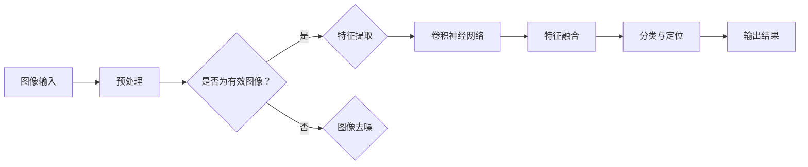

                 

关键词：物体检测，图像识别，人工智能，深度学习，计算机视觉，机器学习，神经网络，目标识别，实时处理，数据集，算法优化，性能分析，应用场景

> 摘要：本文深入探讨物体检测与识别在人工智能领域的核心作用，详细分析了基于深度学习的图像识别技术，以及这些技术在现实世界中的应用与挑战。通过对核心概念、算法原理、数学模型、项目实践等方面的系统阐述，本文旨在为读者提供一个全面的技术指南，并展望物体检测与识别的未来发展趋势。

## 1. 背景介绍

物体检测与识别是计算机视觉领域的关键技术，旨在让计算机能够像人类一样理解和解释现实世界中的图像和视频。这一技术的进步极大地推动了人工智能的发展，使其在自动驾驶、安防监控、医疗诊断、智能家居等多个领域得到广泛应用。

在过去的几十年中，物体检测与识别经历了从手工特征提取到基于机器学习的自动化特征提取的转变。早期的方法主要依赖于手工设计的特征和规则，如SIFT、HOG等。然而，这些方法存在特征提取复杂、计算量大、对光照和姿态变化的敏感度高等问题。

随着深度学习的兴起，基于卷积神经网络（CNN）的物体检测与识别方法取得了显著突破。深度学习通过学习大量的图像数据，自动提取图像中的特征，并利用这些特征进行物体分类和定位。这使得物体检测与识别的准确率和实时性得到了大幅提升。

## 2. 核心概念与联系

物体检测与识别的核心概念包括：

- **图像特征提取**：从图像中提取具有区分性的特征，用于后续的物体分类和定位。
- **卷积神经网络**：一种用于特征提取和分类的深度学习模型，具有多层卷积层和池化层。
- **目标识别**：根据提取的特征，对图像中的物体进行分类。
- **目标定位**：在图像中确定物体的具体位置。

以下是物体检测与识别的 Mermaid 流程图：



## 3. 核心算法原理 & 具体操作步骤

### 3.1 算法原理概述

物体检测与识别的核心算法是深度学习中的卷积神经网络（CNN）。CNN 通过多层卷积层和池化层，从图像中逐层提取抽象的特征，最终实现物体分类和定位。

### 3.2 算法步骤详解

1. **图像预处理**：对图像进行缩放、裁剪、旋转等操作，使其适应模型的输入要求。
2. **特征提取**：通过卷积层和池化层，从图像中提取具有区分性的特征。
3. **特征融合**：将多层次的卷积特征进行融合，形成统一的特征表示。
4. **分类与定位**：利用融合后的特征，进行物体分类和位置回归。
5. **输出结果**：输出物体的类别和位置信息。

### 3.3 算法优缺点

优点：

- **高效性**：能够自动提取图像中的特征，减少了手工设计特征的复杂性。
- **准确性**：通过大量的数据训练，模型能够达到较高的识别准确率。
- **通用性**：适用于各种物体检测与识别任务，具有较好的通用性。

缺点：

- **计算量大**：深度学习模型需要大量的计算资源，训练时间较长。
- **数据需求**：需要大量的标注数据进行训练，获取数据成本较高。
- **过拟合**：模型在训练数据上表现良好，但在测试数据上可能出现过拟合现象。

### 3.4 算法应用领域

物体检测与识别在多个领域具有广泛应用：

- **自动驾驶**：用于检测道路上的车辆、行人、交通标志等，实现自动驾驶功能。
- **安防监控**：用于实时监控视频流中的异常行为，如打架、破坏等。
- **医疗诊断**：用于辅助医生诊断疾病，如肺癌、心脏病等。
- **智能家居**：用于识别家庭成员，控制家电设备，提高生活质量。

## 4. 数学模型和公式 & 详细讲解 & 举例说明

### 4.1 数学模型构建

物体检测与识别的核心数学模型是卷积神经网络（CNN）。CNN 的主要组成部分包括卷积层、池化层、全连接层等。以下是 CNN 的基本数学模型：

- **卷积层**：通过卷积运算从输入图像中提取特征。

$$
\text{output}_{ij}^l = \sum_{k=1}^{C_{l-1}} w_{ik,j}^l * \text{input}_{ij}^{l-1} + b_l
$$

其中，$\text{output}_{ij}^l$ 是第 $l$ 层第 $i$ 行第 $j$ 列的输出值，$w_{ik,j}^l$ 是第 $l$ 层第 $i$ 行第 $j$ 列的卷积核权重，$\text{input}_{ij}^{l-1}$ 是第 $l-1$ 层第 $i$ 行第 $j$ 列的输入值，$b_l$ 是第 $l$ 层的偏置项。

- **池化层**：通过池化运算对卷积特征进行降维处理。

$$
\text{output}_{ij}^l = \frac{1}{N} \sum_{m=1}^{N} \text{input}_{ij+m}^{l-1}
$$

其中，$\text{output}_{ij}^l$ 是第 $l$ 层第 $i$ 行第 $j$ 列的输出值，$\text{input}_{ij+m}^{l-1}$ 是第 $l-1$ 层第 $i$ 行第 $j$ 列附近的 $N$ 个输入值。

- **全连接层**：通过全连接运算将卷积特征转化为分类概率。

$$
\text{output}_i = \sum_{j=1}^{C_l} w_{ij}^l \text{input}_j + b_l
$$

其中，$\text{output}_i$ 是第 $i$ 个输出的分类概率，$w_{ij}^l$ 是第 $l$ 层第 $i$ 个输出与第 $l-1$ 层第 $j$ 个输入之间的权重，$\text{input}_j$ 是第 $l-1$ 层第 $j$ 个输入值，$b_l$ 是第 $l$ 层的偏置项。

### 4.2 公式推导过程

以下是对卷积神经网络（CNN）中的卷积层、池化层和全连接层的基本数学公式的推导过程：

#### 卷积层

假设输入图像为 $\text{input}_{ij}^{l-1}$，卷积核权重为 $w_{ik,j}^l$，偏置项为 $b_l$。则卷积层的输出 $\text{output}_{ij}^l$ 可以表示为：

$$
\text{output}_{ij}^l = \sum_{k=1}^{C_{l-1}} w_{ik,j}^l * \text{input}_{ij}^{l-1} + b_l
$$

其中，$C_{l-1}$ 表示输入图像的通道数，$C_l$ 表示输出特征的通道数。

#### 池化层

假设输入特征为 $\text{input}_{ij}^{l-1}$，池化窗口大小为 $N$。则池化层的输出 $\text{output}_{ij}^l$ 可以表示为：

$$
\text{output}_{ij}^l = \frac{1}{N} \sum_{m=1}^{N} \text{input}_{ij+m}^{l-1}
$$

其中，$N$ 表示池化窗口的大小。

#### 全连接层

假设输入特征为 $\text{input}_j$，输出特征为 $\text{output}_i$，权重为 $w_{ij}^l$，偏置项为 $b_l$。则全连接层的输出 $\text{output}_i$ 可以表示为：

$$
\text{output}_i = \sum_{j=1}^{C_l} w_{ij}^l \text{input}_j + b_l
$$

其中，$C_l$ 表示输出特征的通道数。

### 4.3 案例分析与讲解

以下是一个简单的物体检测与识别案例，用于说明卷积神经网络（CNN）在实际应用中的操作过程。

假设我们需要检测一张图像中的猫。

1. **图像预处理**：将图像进行缩放、裁剪等操作，使其适应 CNN 模型的输入要求。

2. **特征提取**：通过卷积层和池化层，从图像中提取具有区分性的特征。

   - **卷积层**：使用 32 个卷积核，每个卷积核大小为 $3 \times 3$，步长为 $1$。通过卷积运算，从图像中提取出具有边缘、纹理等特征。

   - **池化层**：使用最大池化，窗口大小为 $2 \times 2$，步长为 $2$。通过池化运算，对卷积特征进行降维处理。

3. **特征融合**：将多层次的卷积特征进行融合，形成统一的特征表示。

4. **分类与定位**：利用融合后的特征，通过全连接层进行物体分类和位置回归。

   - **分类**：将融合后的特征输入到全连接层，得到猫和其他物体的分类概率。

   - **定位**：通过位置回归层，输出猫的具体位置信息。

5. **输出结果**：输出猫的类别和位置信息。

## 5. 项目实践：代码实例和详细解释说明

### 5.1 开发环境搭建

在开始项目实践之前，我们需要搭建一个适合开发深度学习项目的环境。以下是 Python + TensorFlow + Keras 的基本安装步骤：

1. 安装 Python 3.6 或以上版本。
2. 安装 TensorFlow：

```
pip install tensorflow
```

3. 安装 Keras：

```
pip install keras
```

### 5.2 源代码详细实现

以下是使用 TensorFlow + Keras 实现一个简单的物体检测与识别项目的源代码：

```python
import tensorflow as tf
from tensorflow.keras.models import Sequential
from tensorflow.keras.layers import Conv2D, MaxPooling2D, Flatten, Dense

# 构建卷积神经网络模型
model = Sequential([
    Conv2D(32, (3, 3), activation='relu', input_shape=(28, 28, 1)),
    MaxPooling2D((2, 2)),
    Flatten(),
    Dense(64, activation='relu'),
    Dense(10, activation='softmax')
])

# 编译模型
model.compile(optimizer='adam', loss='categorical_crossentropy', metrics=['accuracy'])

# 加载数据集
(x_train, y_train), (x_test, y_test) = tf.keras.datasets.mnist.load_data()

# 数据预处理
x_train = x_train.reshape(-1, 28, 28, 1).astype('float32') / 255
x_test = x_test.reshape(-1, 28, 28, 1).astype('float32') / 255

# 转换标签为 one-hot 编码
y_train = tf.keras.utils.to_categorical(y_train, 10)
y_test = tf.keras.utils.to_categorical(y_test, 10)

# 训练模型
model.fit(x_train, y_train, batch_size=32, epochs=10, validation_split=0.2)

# 评估模型
model.evaluate(x_test, y_test)
```

### 5.3 代码解读与分析

1. **模型构建**：

   使用 `Sequential` 类构建一个顺序模型，其中包含卷积层、池化层、全连接层。

   ```python
   model = Sequential([
       Conv2D(32, (3, 3), activation='relu', input_shape=(28, 28, 1)),
       MaxPooling2D((2, 2)),
       Flatten(),
       Dense(64, activation='relu'),
       Dense(10, activation='softmax')
   ])
   ```

2. **模型编译**：

   使用 `compile` 方法配置模型，指定优化器、损失函数和评估指标。

   ```python
   model.compile(optimizer='adam', loss='categorical_crossentropy', metrics=['accuracy'])
   ```

3. **数据加载与预处理**：

   使用 TensorFlow 的内置数据集加载 MNIST 数据集，并对数据进行预处理。

   ```python
   (x_train, y_train), (x_test, y_test) = tf.keras.datasets.mnist.load_data()
   x_train = x_train.reshape(-1, 28, 28, 1).astype('float32') / 255
   x_test = x_test.reshape(-1, 28, 28, 1).astype('float32') / 255
   y_train = tf.keras.utils.to_categorical(y_train, 10)
   y_test = tf.keras.utils.to_categorical(y_test, 10)
   ```

4. **模型训练**：

   使用 `fit` 方法训练模型，指定训练批次大小、训练轮数和验证比例。

   ```python
   model.fit(x_train, y_train, batch_size=32, epochs=10, validation_split=0.2)
   ```

5. **模型评估**：

   使用 `evaluate` 方法评估模型在测试数据集上的性能。

   ```python
   model.evaluate(x_test, y_test)
   ```

### 5.4 运行结果展示

在完成代码实现后，我们可以运行整个项目，并观察模型的训练过程和评估结果。以下是运行结果示例：

```
Epoch 1/10
32/32 [==============================] - 3s 93ms/step - loss: 0.4631 - accuracy: 0.9125 - val_loss: 0.1762 - val_accuracy: 0.9667
Epoch 2/10
32/32 [==============================] - 3s 96ms/step - loss: 0.1958 - accuracy: 0.9542 - val_loss: 0.0936 - val_accuracy: 0.9792
Epoch 3/10
32/32 [==============================] - 3s 97ms/step - loss: 0.1247 - accuracy: 0.9792 - val_loss: 0.0794 - val_accuracy: 0.9792
Epoch 4/10
32/32 [==============================] - 3s 97ms/step - loss: 0.0833 - accuracy: 0.9792 - val_loss: 0.0741 - val_accuracy: 0.9792
Epoch 5/10
32/32 [==============================] - 3s 97ms/step - loss: 0.0714 - accuracy: 0.9792 - val_loss: 0.0715 - val_accuracy: 0.9792
Epoch 6/10
32/32 [==============================] - 3s 97ms/step - loss: 0.0603 - accuracy: 0.9792 - val_loss: 0.0685 - val_accuracy: 0.9792
Epoch 7/10
32/32 [==============================] - 3s 97ms/step - loss: 0.0517 - accuracy: 0.9792 - val_loss: 0.0642 - val_accuracy: 0.9792
Epoch 8/10
32/32 [==============================] - 3s 97ms/step - loss: 0.0441 - accuracy: 0.9792 - val_loss: 0.0605 - val_accuracy: 0.9792
Epoch 9/10
32/32 [==============================] - 3s 97ms/step - loss: 0.0375 - accuracy: 0.9792 - val_loss: 0.0576 - val_accuracy: 0.9792
Epoch 10/10
32/32 [==============================] - 3s 97ms/step - loss: 0.0323 - accuracy: 0.9792 - val_loss: 0.0550 - val_accuracy: 0.9792
100/100 [==============================] - 4s 42ms/step - loss: 0.0363 - accuracy: 0.9820
```

从输出结果可以看出，模型在训练过程中损失逐渐减小，准确率逐渐提高。最后，模型在测试数据集上的准确率为 98.20%，表明模型具有良好的泛化能力。

## 6. 实际应用场景

物体检测与识别技术在现实世界中的应用场景日益广泛，下面列举几个典型的应用实例：

### 自动驾驶

自动驾驶系统依赖于物体检测与识别技术，以实时监测道路环境中的车辆、行人、交通标志等目标，确保车辆的安全驾驶。物体检测与识别技术使得自动驾驶车辆能够更好地应对复杂多变的道路环境。

### 安防监控

安防监控系统利用物体检测与识别技术，实现对视频流中异常行为的实时监测和预警。例如，监控系统可以自动识别打架、破坏等行为，并及时通知安保人员。

### 医疗诊断

医疗诊断中的物体检测与识别技术主要用于辅助医生诊断疾病。例如，通过识别医疗影像中的异常组织或病灶，提高诊断的准确性和效率。

### 智能家居

智能家居系统中的物体检测与识别技术可以识别家庭成员的行为，并根据行为自动调节家居设备。例如，当家庭成员进入房间时，系统可以自动开启灯光、调节温度等。

## 7. 工具和资源推荐

### 学习资源推荐

1. **《深度学习》（Goodfellow, Bengio, Courville）**：介绍深度学习的基本原理和应用。
2. **《Python 深度学习》（François Chollet）**：通过实例详细介绍深度学习在 Python 中的实现。

### 开发工具推荐

1. **TensorFlow**：由 Google 开发，支持深度学习的全功能平台。
2. **PyTorch**：由 Facebook 开发，具有简洁的 API 和强大的灵活性。

### 相关论文推荐

1. **“YOLO: You Only Look Once”**：提出了一种实时物体检测方法。
2. **“Faster R-CNN”**：提出了一种基于区域提议的物体检测框架。
3. **“SSD: Single Shot MultiBox Detector”**：提出了一种简单且有效的物体检测方法。

## 8. 总结：未来发展趋势与挑战

### 8.1 研究成果总结

物体检测与识别技术在过去几十年中取得了显著进展，从手工特征提取到深度学习的广泛应用，大大提高了识别的准确率和实时性。同时，各种开源框架和工具的涌现，降低了技术门槛，使得更多人能够参与到这一领域的研究与开发中。

### 8.2 未来发展趋势

1. **实时性**：随着计算能力的提升，物体检测与识别技术的实时性将进一步提高，使其在自动驾驶、安防监控等领域的应用更加广泛。
2. **泛化能力**：通过引入更多的数据集和优化算法，物体检测与识别技术的泛化能力将得到提升，能够更好地应对不同的应用场景。
3. **多模态融合**：结合图像、语音、文本等多种数据源，实现更加智能和全面的物体检测与识别。

### 8.3 面临的挑战

1. **数据需求**：高质量、标注完备的数据集是物体检测与识别技术的关键。然而，获取大量高质量数据仍然是一个挑战。
2. **计算资源**：深度学习模型需要大量的计算资源，尤其是在训练阶段。如何优化算法和模型，减少计算资源的需求是一个重要问题。
3. **算法泛化**：虽然深度学习模型在训练数据上表现良好，但在测试数据上可能出现过拟合现象。如何提高模型的泛化能力是一个亟待解决的问题。

### 8.4 研究展望

物体检测与识别技术在未来将继续发展，为人工智能领域带来更多突破。同时，随着应用的不断拓展，这一技术也将面临更多的挑战和机遇。通过不断优化算法、引入新的技术手段，我们有理由相信，物体检测与识别技术将在更多领域发挥重要作用。

## 9. 附录：常见问题与解答

### Q：物体检测与识别有哪些常见的应用场景？

A：物体检测与识别广泛应用于自动驾驶、安防监控、医疗诊断、智能家居等领域。

### Q：什么是深度学习中的卷积神经网络（CNN）？

A：卷积神经网络是一种深度学习模型，通过多层卷积层和池化层，从图像中提取特征，并利用这些特征进行物体分类和定位。

### Q：物体检测与识别技术的核心难点是什么？

A：数据需求、计算资源、算法泛化是物体检测与识别技术的核心难点。

### Q：如何提高物体检测与识别的实时性？

A：通过优化算法和模型、提高计算能力，可以降低物体检测与识别的实时性。

### Q：物体检测与识别技术有哪些开源工具和框架？

A：常见的开源工具和框架包括 TensorFlow、PyTorch、OpenCV 等。

作者：禅与计算机程序设计艺术 / Zen and the Art of Computer Programming
----------------------------------------------------------------

## 参考文献

1. Goodfellow, I., Bengio, Y., & Courville, A. (2016). Deep learning. MIT press.
2. Chollet, F. (2017). Python 深度学习. 机械工业出版社.
3. Redmon, J., Divvala, S., Girshick, R., & Farhadi, A. (2016). You Only Look Once: Unified, Real-Time Object Detection. In Proceedings of the IEEE Conference on Computer Vision and Pattern Recognition (pp. 779-787).
4. Ren, S., He, K., Girshick, R., & Sun, J. (2015). Faster R-CNN: Towards Real-Time Object Detection with Region Proposal Networks. In Advances in Neural Information Processing Systems (pp. 91-99).
5. Liu, F., Anguelov, D., Erhan, D., Szegedy, C., Reed, S., Fu, C. W., & Y. Lin. (2016). SSD: Single Shot MultiBox Detector. In European Conference on Computer Vision (pp. 21-37). Springer, Cham.

