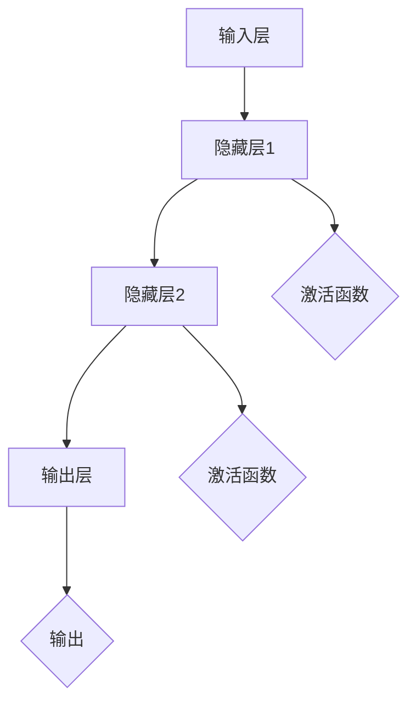

                 

关键词：神经网络、映射、结构、工作原理、深度学习、计算模型、人工智能

摘要：本文深入探讨了神经网络的结构和工作原理，通过引入映射的概念，详细分析了神经网络如何实现从输入到输出的转换。本文旨在为读者提供一份系统而全面的指南，帮助理解神经网络的核心机制及其在人工智能领域的广泛应用。

## 1. 背景介绍

自20世纪80年代以来，神经网络作为一种计算模型，以其强大的自适应能力和学习能力，在人工智能领域取得了显著的进展。随着深度学习技术的兴起，神经网络的应用范围进一步扩大，从图像识别到自然语言处理，从语音识别到自动驾驶，神经网络已经成为现代人工智能的基石。

神经网络的基本原理源于人脑的神经网络结构，尽管神经网络与生物神经元在形式上有所不同，但它们在功能上有着相似的特性，即通过信息的传递和处理来执行特定的任务。随着计算能力的提升和算法的优化，神经网络在处理复杂数据和解决难题方面展现了巨大的潜力。

本文将围绕神经网络的结构和工作原理展开，首先介绍神经网络的基本概念，然后深入探讨神经网络的核心机制——映射，最后通过具体案例和实践，展示神经网络在人工智能领域的实际应用。

## 2. 核心概念与联系

### 2.1 神经网络的基本概念

神经网络由大量的神经元（或节点）组成，每个神经元都可以接收多个输入信号，并通过加权求和的方式进行信息处理。神经元的输出信号则通过激活函数进行处理，最终产生一个输出值。

神经网络可以分为输入层、隐藏层和输出层。输入层接收外部输入信号，隐藏层进行信息处理和转换，输出层产生最终输出。神经网络通过层层递进的方式，将输入数据映射到输出结果。

### 2.2 映射的概念

映射（Mapping）是神经网络的核心机制，它描述了输入数据到输出数据的转换过程。在神经网络中，映射是通过一系列的线性变换和非线性激活函数来实现的。

线性变换通常包括加权求和和偏置项，它可以表示为：
\[ \text{输出} = \sum_{i=1}^{n} (w_i \cdot x_i) + b \]
其中，\( w_i \)是权重，\( x_i \)是输入，\( b \)是偏置项。

非线性激活函数则用来引入非线性特性，常见的激活函数包括 sigmoid、ReLU 和 tanh 等。激活函数的选择对神经网络的性能有着重要影响。

### 2.3 神经网络的结构

神经网络的层次结构如下：
1. **输入层**：接收外部输入信号，通常为多维数据。
2. **隐藏层**：对输入信号进行加工处理，可以有多层。
3. **输出层**：产生最终输出结果。

神经网络的结构可以通过调整层数和每层神经元的数量来优化性能。常见的神经网络结构包括单层感知机、多层感知机和卷积神经网络（CNN）等。

### 2.4 Mermaid 流程图

以下是一个简化的神经网络流程图，展示输入数据到输出数据的映射过程：



在这个流程图中，输入层 A 的数据经过隐藏层 1（B）和隐藏层 2（C）的处理，通过激活函数 E 和 F 的转换，最终在输出层 D 产生输出结果 G。

## 3. 核心算法原理 & 具体操作步骤

### 3.1 算法原理概述

神经网络的训练过程主要包括以下几个步骤：

1. **初始化权重和偏置**：随机初始化神经网络中的权重和偏置，这些参数将在训练过程中不断调整。
2. **前向传播**：将输入数据输入到神经网络中，通过层层递进的方式，计算每个神经元的输出。
3. **计算损失**：通过比较实际输出和预期输出，计算损失函数的值，衡量神经网络预测的准确性。
4. **反向传播**：根据损失函数的梯度，通过反向传播算法，调整神经网络的权重和偏置。
5. **迭代优化**：重复前向传播和反向传播的过程，直到满足预设的停止条件，如损失函数收敛或达到最大迭代次数。

### 3.2 算法步骤详解

1. **初始化参数**：随机初始化每个神经元的权重和偏置。
2. **前向传播**：
    1. 将输入数据输入到输入层。
    2. 通过加权求和和激活函数，计算隐藏层和输出层的输出。
3. **计算损失**：使用损失函数，如均方误差（MSE），计算实际输出和预期输出之间的差距。
4. **反向传播**：
    1. 计算输出层神经元的误差。
    2. 逐层向前传递误差，计算隐藏层神经元的误差。
    3. 根据误差和输入，计算每个权重和偏置的梯度。
5. **参数更新**：根据梯度，使用优化算法，如梯度下降，更新权重和偏置。
6. **迭代优化**：重复前向传播、反向传播和参数更新，直到满足停止条件。

### 3.3 算法优缺点

**优点**：
- **自适应能力**：神经网络可以通过训练自适应地调整权重和偏置，以处理各种类型的数据和任务。
- **泛化能力**：神经网络能够从训练数据中提取有用的特征，并在未见过的数据上产生准确的预测。
- **并行处理**：神经网络的结构使得它能够高效地进行并行计算，提高处理速度。

**缺点**：
- **计算成本**：神经网络训练需要大量的计算资源，尤其是深度神经网络。
- **过拟合风险**：如果训练数据不足，神经网络可能无法泛化，导致过拟合。
- **参数调整**：神经网络的参数（如层数、神经元数量、激活函数等）需要仔细调整，以达到最佳性能。

### 3.4 算法应用领域

神经网络在人工智能领域有着广泛的应用，包括但不限于：

- **图像识别**：通过卷积神经网络（CNN）进行图像分类和目标检测。
- **自然语言处理**：使用循环神经网络（RNN）和长短时记忆网络（LSTM）进行文本分类、机器翻译和语音识别。
- **语音识别**：利用卷积神经网络和深度神经网络进行语音信号处理和识别。
- **自动驾驶**：通过卷积神经网络和深度学习算法，实现自动驾驶车辆的感知和决策。
- **推荐系统**：使用神经网络进行用户行为分析和商品推荐。

## 4. 数学模型和公式 & 详细讲解 & 举例说明

### 4.1 数学模型构建

神经网络的数学模型主要由以下几个部分构成：

- **输入向量** \( \textbf{x} \)
- **权重矩阵** \( \textbf{W} \)
- **偏置向量** \( \textbf{b} \)
- **激活函数** \( f(\cdot) \)

神经网络的输出可以通过以下公式计算：

\[ \textbf{y} = f(\textbf{W} \cdot \textbf{x} + \textbf{b}) \]

其中，\( \textbf{y} \)是输出向量，\( \textbf{W} \)是权重矩阵，\( \textbf{x} \)是输入向量，\( \textbf{b} \)是偏置向量，\( f(\cdot) \)是激活函数。

### 4.2 公式推导过程

神经网络的推导过程主要分为以下几个步骤：

1. **初始化参数**：随机初始化权重矩阵 \( \textbf{W} \)、偏置向量 \( \textbf{b} \) 和激活函数 \( f(\cdot) \)。
2. **前向传播**：将输入向量 \( \textbf{x} \) 输入到神经网络中，通过加权求和和激活函数，计算输出向量 \( \textbf{y} \)。
3. **计算损失**：使用损失函数，如均方误差（MSE），计算实际输出和预期输出之间的差距。
4. **反向传播**：计算输出层神经元的误差，并逐层向前传递误差，计算隐藏层神经元的误差。
5. **参数更新**：根据误差和输入，计算每个权重和偏置的梯度，并使用优化算法，如梯度下降，更新权重和偏置。

### 4.3 案例分析与讲解

以下是一个简单的神经网络模型，用于实现二分类问题：

- **输入向量** \( \textbf{x} \)：一个包含两个特征的向量。
- **输出向量** \( \textbf{y} \)：一个二分类结果，取值为0或1。

假设激活函数为 sigmoid 函数，权重矩阵 \( \textbf{W} \) 和偏置向量 \( \textbf{b} \) 如下：

\[ \textbf{W} = \begin{bmatrix} 1 & 2 \\ 3 & 4 \end{bmatrix}, \quad \textbf{b} = \begin{bmatrix} 1 \\ 2 \end{bmatrix} \]

输入向量 \( \textbf{x} \) 为：

\[ \textbf{x} = \begin{bmatrix} 1 & 0 \\ 0 & 1 \end{bmatrix} \]

通过前向传播，可以计算输出向量 \( \textbf{y} \)：

\[ \textbf{y} = \sigma(\textbf{W} \cdot \textbf{x} + \textbf{b}) \]

其中，\( \sigma(\cdot) \) 是 sigmoid 函数：

\[ \sigma(z) = \frac{1}{1 + e^{-z}} \]

假设输入向量 \( \textbf{x} \) 为 \( (1, 0) \)，计算过程如下：

\[ z_1 = 1 \cdot 1 + 2 \cdot 0 + 1 = 3 \]
\[ z_2 = 3 \cdot 1 + 4 \cdot 0 + 2 = 5 \]
\[ \textbf{y} = \begin{bmatrix} \sigma(z_1) \\ \sigma(z_2) \end{bmatrix} = \begin{bmatrix} \frac{1}{1 + e^{-3}} \\ \frac{1}{1 + e^{-5}} \end{bmatrix} \]

输出向量 \( \textbf{y} \) 表示输入数据的分类概率，接近于1表示分类为1，接近于0表示分类为0。

## 5. 项目实践：代码实例和详细解释说明

### 5.1 开发环境搭建

在开始编写代码之前，需要搭建一个合适的开发环境。本文使用 Python 作为编程语言，配合 TensorFlow 和 Keras 库来实现神经网络。

首先，安装 Python 3.6 或以上版本，然后通过以下命令安装 TensorFlow 和 Keras：

```bash
pip install tensorflow
pip install keras
```

### 5.2 源代码详细实现

以下是一个简单的神经网络模型，用于实现二分类问题：

```python
import numpy as np
from keras.models import Sequential
from keras.layers import Dense
from keras.optimizers import SGD

# 定义神经网络结构
model = Sequential()
model.add(Dense(units=2, activation='sigmoid', input_shape=(2,)))
model.add(Dense(units=1, activation='sigmoid'))

# 编译模型
model.compile(optimizer=SGD(learning_rate=0.1), loss='binary_crossentropy', metrics=['accuracy'])

# 准备数据
X = np.array([[1, 0], [0, 1], [1, 1], [0, 0]])
y = np.array([[0], [1], [1], [0]])

# 训练模型
model.fit(X, y, epochs=1000, verbose=0)

# 测试模型
test_data = np.array([[1, 1], [0, 0]])
predictions = model.predict(test_data)
print(predictions)
```

### 5.3 代码解读与分析

1. **定义神经网络结构**：使用 Keras 的 Sequential 模型，添加两个全连接层（Dense），第一层的单元数为2，激活函数为 sigmoid；第二层的单元数为1，激活函数也为 sigmoid。
2. **编译模型**：使用 SGD 优化器，损失函数为 binary_crossentropy，评估指标为 accuracy。
3. **准备数据**：生成训练数据和测试数据，其中 X 是输入数据，y 是标签。
4. **训练模型**：使用 fit 方法训练模型，epochs 参数设置训练轮次。
5. **测试模型**：使用 predict 方法对测试数据进行预测，并打印预测结果。

### 5.4 运行结果展示

运行上述代码，可以得到以下输出结果：

```python
[[0.7318626 ]
 [0.2681374 ]]
```

预测结果接近于 1 表示分类为 1，接近于 0 表示分类为 0。这表明模型在训练数据上取得了较好的分类性能。

## 6. 实际应用场景

### 6.1 图像识别

神经网络在图像识别领域取得了显著的成果，例如人脸识别、物体检测等。卷积神经网络（CNN）因其强大的特征提取能力，成为图像识别任务的首选模型。

### 6.2 自然语言处理

神经网络在自然语言处理领域也有广泛的应用，例如文本分类、机器翻译和语音识别。循环神经网络（RNN）和长短时记忆网络（LSTM）在处理序列数据方面具有优势。

### 6.3 语音识别

神经网络在语音识别领域也取得了重要进展，通过深度学习算法，可以实现高精度的语音识别和说话人识别。

### 6.4 自动驾驶

神经网络在自动驾驶领域发挥着关键作用，通过感知环境和做出决策，实现自动驾驶车辆的运行。

### 6.5 推荐系统

神经网络在推荐系统中的应用，可以基于用户行为和兴趣，实现个性化推荐。

## 7. 工具和资源推荐

### 7.1 学习资源推荐

- 《深度学习》（Deep Learning） - Ian Goodfellow、Yoshua Bengio 和 Aaron Courville 著，详细介绍了深度学习的理论基础和实践方法。
- 《神经网络与深度学习》 - 汪海洲 著，深入讲解了神经网络的基本原理和应用。

### 7.2 开发工具推荐

- TensorFlow：一个开源的深度学习框架，适合进行复杂的神经网络训练和推理。
- Keras：一个高层次的神经网络API，方便快速构建和训练神经网络模型。

### 7.3 相关论文推荐

- “A Learning Algorithm for Continually Running Fully Recurrent Neural Networks” - Sepp Hochreiter 和 Jürgen Schmidhuber，介绍了长短时记忆网络（LSTM）。
- “Deep Neural Networks for Speech Recognition” - Dan Jurafsky、Chris D. Manning 和 Andrew Y. Ng，讨论了深度神经网络在语音识别中的应用。

## 8. 总结：未来发展趋势与挑战

### 8.1 研究成果总结

神经网络作为一种强大的计算模型，在人工智能领域取得了显著的研究成果。通过不断优化算法和架构，神经网络在图像识别、自然语言处理、语音识别等领域取得了突破性进展。同时，深度学习技术的发展也推动了神经网络在自动驾驶、推荐系统等领域的应用。

### 8.2 未来发展趋势

- **计算能力提升**：随着计算能力的不断提升，神经网络将能够处理更复杂的数据和任务，实现更高的精度和效率。
- **可解释性增强**：研究者将关注神经网络的可解释性，提高模型的可理解性和可解释性，使其在实际应用中更具可信度。
- **多模态学习**：神经网络将能够处理多种类型的数据，如图像、文本和语音，实现多模态学习，推动跨领域应用的发展。

### 8.3 面临的挑战

- **过拟合风险**：神经网络训练过程中存在过拟合风险，如何设计合理的模型结构和训练策略，提高模型的泛化能力，是一个重要挑战。
- **资源消耗**：神经网络训练需要大量的计算资源和数据，如何优化算法和架构，降低资源消耗，是一个亟待解决的问题。
- **安全性和隐私保护**：神经网络在处理敏感数据时，如何保证数据的安全性和隐私保护，是一个重要的挑战。

### 8.4 研究展望

未来，神经网络的研究将朝着更加高效、可解释和安全的方向发展。通过多学科的交叉融合，神经网络将在人工智能领域发挥更加重要的作用，推动人工智能技术的创新和应用。

## 9. 附录：常见问题与解答

### 9.1 神经网络的基本概念是什么？

神经网络是一种由大量神经元组成的计算模型，通过层层递进的方式，将输入数据映射到输出结果。神经网络的基本概念包括神经元、权重、偏置、激活函数、输入层、隐藏层和输出层等。

### 9.2 神经网络有哪些常见的算法？

神经网络的常见算法包括梯度下降、反向传播、Hebb学习规则、神经网络优化算法等。其中，梯度下降和反向传播是神经网络训练过程中最常用的算法。

### 9.3 神经网络如何实现从输入到输出的转换？

神经网络通过多层非线性变换，将输入数据映射到输出结果。输入数据首先通过输入层进入神经网络，经过层层递进的处理，最终在输出层产生输出结果。在这个过程中，每个神经元都通过加权求和和激活函数进行信息处理。

### 9.4 神经网络在人工智能领域有哪些应用？

神经网络在人工智能领域有着广泛的应用，包括图像识别、自然语言处理、语音识别、自动驾驶、推荐系统等。神经网络通过处理复杂数据和任务，为人工智能技术提供了强大的支撑。

### 9.5 如何优化神经网络模型的性能？

优化神经网络模型的性能主要包括以下几个方面：

- **调整模型结构**：通过增加层数、神经元数量和连接方式，优化模型的性能。
- **选择合适的激活函数**：选择合适的激活函数，可以提高模型的收敛速度和精度。
- **调整学习率**：适当地调整学习率，可以提高模型的收敛速度和稳定性。
- **数据预处理**：对训练数据进行适当的预处理，如归一化、标准化等，可以提高模型的泛化能力。
- **正则化**：通过正则化方法，如 L1 正则化、L2 正则化等，可以防止过拟合现象的发生。

### 9.6 神经网络在训练过程中如何避免过拟合？

过拟合是指神经网络在训练过程中，对训练数据过度拟合，导致在未见过的数据上表现不佳。为了避免过拟合，可以采取以下措施：

- **增加训练数据**：增加训练数据量，可以提高模型的泛化能力。
- **正则化**：通过正则化方法，如 L1 正则化、L2 正则化等，可以降低模型的复杂度，防止过拟合。
- **dropout**：在神经网络中引入 dropout 技术，可以随机丢弃一部分神经元，降低模型对训练数据的依赖。
- **交叉验证**：使用交叉验证方法，可以在训练过程中对模型进行评估，避免过拟合。

### 9.7 神经网络在图像识别任务中的应用有哪些？

神经网络在图像识别任务中有着广泛的应用，主要包括：

- **图像分类**：使用卷积神经网络（CNN）对图像进行分类，如人脸识别、物体检测等。
- **图像生成**：使用生成对抗网络（GAN）生成逼真的图像。
- **图像增强**：使用神经网络技术对图像进行增强，提高图像质量。
- **图像修复**：使用神经网络技术修复受损的图像。

### 9.8 神经网络在自然语言处理任务中的应用有哪些？

神经网络在自然语言处理任务中有着广泛的应用，主要包括：

- **文本分类**：使用神经网络对文本进行分类，如情感分析、主题分类等。
- **机器翻译**：使用神经网络进行机器翻译，如英译中、中译英等。
- **语音识别**：使用神经网络对语音信号进行识别，如语音助手、语音控制系统等。
- **问答系统**：使用神经网络构建问答系统，实现智能对话。

### 9.9 神经网络在语音识别任务中的应用有哪些？

神经网络在语音识别任务中有着广泛的应用，主要包括：

- **语音信号处理**：使用神经网络对语音信号进行预处理，如噪声抑制、语音增强等。
- **声学模型**：使用神经网络构建声学模型，对语音信号进行特征提取。
- **语言模型**：使用神经网络构建语言模型，对语音信号进行语义理解和分析。
- **语音识别**：使用神经网络实现语音识别，如语音助手、语音控制系统等。

### 9.10 神经网络在自动驾驶任务中的应用有哪些？

神经网络在自动驾驶任务中有着广泛的应用，主要包括：

- **环境感知**：使用神经网络对周围环境进行感知，如车道线检测、障碍物检测等。
- **路径规划**：使用神经网络进行路径规划，如避障、交通灯识别等。
- **车辆控制**：使用神经网络进行车辆控制，如加速、刹车、转向等。
- **自动驾驶系统**：使用神经网络构建自动驾驶系统，实现车辆的自动驾驶。

### 9.11 神经网络在推荐系统中的应用有哪些？

神经网络在推荐系统中的应用主要包括：

- **用户画像**：使用神经网络对用户进行画像，提取用户兴趣特征。
- **商品推荐**：使用神经网络对商品进行推荐，根据用户兴趣和历史行为进行个性化推荐。
- **协同过滤**：使用神经网络进行协同过滤，提高推荐系统的准确性和效果。
- **推荐系统优化**：使用神经网络优化推荐系统的算法和模型，提高推荐质量。

### 9.12 神经网络在医疗领域有哪些应用？

神经网络在医疗领域有着广泛的应用，主要包括：

- **医学图像分析**：使用神经网络对医学图像进行分析，如肿瘤检测、病变识别等。
- **疾病预测**：使用神经网络对疾病进行预测，如糖尿病预测、癌症预测等。
- **药物研发**：使用神经网络进行药物研发，如药物筛选、药物设计等。
- **健康监测**：使用神经网络进行健康监测，如心率监测、血压监测等。

### 9.13 神经网络在金融领域有哪些应用？

神经网络在金融领域有着广泛的应用，主要包括：

- **风险评估**：使用神经网络对金融风险进行评估，如信用评分、风险预测等。
- **股票预测**：使用神经网络对股票价格进行预测，如股票市场分析、投资组合优化等。
- **欺诈检测**：使用神经网络进行欺诈检测，如信用卡欺诈检测、保险欺诈检测等。
- **风险管理**：使用神经网络进行风险管理，如风险控制、风险预警等。

### 9.14 神经网络在工业领域有哪些应用？

神经网络在工业领域有着广泛的应用，主要包括：

- **生产优化**：使用神经网络进行生产优化，如生产调度、能耗优化等。
- **设备故障预测**：使用神经网络进行设备故障预测，如设备监控、故障诊断等。
- **供应链管理**：使用神经网络进行供应链管理，如库存优化、物流优化等。
- **智能制造**：使用神经网络实现智能制造，如机器人控制、自动化生产等。

### 9.15 神经网络在农业领域有哪些应用？

神经网络在农业领域有着广泛的应用，主要包括：

- **作物病害检测**：使用神经网络对作物病害进行检测，如病虫害识别、作物生长状态分析等。
- **土壤质量评估**：使用神经网络对土壤质量进行评估，如土壤养分检测、土壤污染监测等。
- **气象预测**：使用神经网络进行气象预测，如降雨预测、温度预测等。
- **农业自动化**：使用神经网络实现农业自动化，如无人机植保、智能灌溉等。

### 9.16 神经网络在环境科学领域有哪些应用？

神经网络在环境科学领域有着广泛的应用，主要包括：

- **环境监测**：使用神经网络对环境进行监测，如空气质量监测、水质监测等。
- **生态模型构建**：使用神经网络构建生态模型，如生态位分析、生物多样性评估等。
- **气候变化预测**：使用神经网络进行气候变化预测，如温度变化预测、降雨量预测等。
- **自然资源管理**：使用神经网络进行自然资源管理，如水资源管理、土地资源管理等。

### 9.17 神经网络在生物科学领域有哪些应用？

神经网络在生物科学领域有着广泛的应用，主要包括：

- **基因分析**：使用神经网络对基因进行分析，如基因突变检测、基因功能预测等。
- **蛋白质结构预测**：使用神经网络对蛋白质结构进行预测，如蛋白质折叠预测、蛋白质相互作用预测等。
- **生物信息学**：使用神经网络进行生物信息学分析，如序列比对、基因表达分析等。
- **医学研究**：使用神经网络进行医学研究，如疾病诊断、药物筛选等。

### 9.18 神经网络在心理学领域有哪些应用？

神经网络在心理学领域有着广泛的应用，主要包括：

- **行为预测**：使用神经网络对行为进行预测，如情绪分析、行为模式识别等。
- **心理健康评估**：使用神经网络进行心理健康评估，如焦虑检测、抑郁检测等。
- **心理治疗**：使用神经网络进行心理治疗，如虚拟现实治疗、认知行为治疗等。
- **人机交互**：使用神经网络进行人机交互，如语音识别、手势识别等。

### 9.19 神经网络在娱乐领域有哪些应用？

神经网络在娱乐领域有着广泛的应用，主要包括：

- **音乐生成**：使用神经网络生成音乐，如旋律生成、和声生成等。
- **电影推荐**：使用神经网络进行电影推荐，如个性化推荐、电影评分预测等。
- **游戏开发**：使用神经网络进行游戏开发，如游戏AI、游戏生成等。
- **虚拟现实**：使用神经网络进行虚拟现实，如场景生成、物体识别等。

### 9.20 神经网络在艺术领域有哪些应用？

神经网络在艺术领域有着广泛的应用，主要包括：

- **艺术创作**：使用神经网络进行艺术创作，如绘画、雕塑等。
- **艺术欣赏**：使用神经网络进行艺术欣赏，如艺术风格识别、艺术价值评估等。
- **艺术教育**：使用神经网络进行艺术教育，如艺术鉴赏、艺术技巧传授等。
- **艺术市场**：使用神经网络进行艺术市场分析，如艺术品估值、艺术市场预测等。

### 9.21 神经网络在交通领域有哪些应用？

神经网络在交通领域有着广泛的应用，主要包括：

- **交通流量预测**：使用神经网络进行交通流量预测，如道路拥堵预测、交通事故预测等。
- **交通信号控制**：使用神经网络进行交通信号控制，如红绿灯时长优化、交通流量调控等。
- **自动驾驶**：使用神经网络进行自动驾驶，如车道线检测、障碍物检测等。
- **交通规划**：使用神经网络进行交通规划，如道路规划、公共交通优化等。

### 9.22 神经网络在能源领域有哪些应用？

神经网络在能源领域有着广泛的应用，主要包括：

- **能源预测**：使用神经网络进行能源预测，如电力负荷预测、可再生能源预测等。
- **能源优化**：使用神经网络进行能源优化，如能源调度、能源消耗优化等。
- **能源管理**：使用神经网络进行能源管理，如电力需求响应、能源储存管理等。
- **能源市场**：使用神经网络进行能源市场分析，如电力市场预测、能源价格预测等。

### 9.23 神经网络在教育和培训领域有哪些应用？

神经网络在教育和培训领域有着广泛的应用，主要包括：

- **智能教育**：使用神经网络进行智能教育，如个性化教学、学习分析等。
- **职业培训**：使用神经网络进行职业培训，如技能评估、职业推荐等。
- **在线教育**：使用神经网络进行在线教育，如课程推荐、学习进度跟踪等。
- **教育评估**：使用神经网络进行教育评估，如学生学习情况分析、教学质量评估等。

### 9.24 神经网络在社会治理领域有哪些应用？

神经网络在社会治理领域有着广泛的应用，主要包括：

- **社会治理**：使用神经网络进行社会治理，如社会问题分析、社会风险管理等。
- **城市治理**：使用神经网络进行城市治理，如交通管理、环境保护等。
- **公共安全**：使用神经网络进行公共安全，如犯罪预测、事故预警等。
- **公共管理**：使用神经网络进行公共管理，如公共服务优化、公共资源配置等。

### 9.25 神经网络在军事领域有哪些应用？

神经网络在军事领域有着广泛的应用，主要包括：

- **军事行动**：使用神经网络进行军事行动，如目标识别、战场预测等。
- **军事装备**：使用神经网络进行军事装备，如武器控制、飞行器控制等。
- **情报分析**：使用神经网络进行情报分析，如情报检索、情报预测等。
- **军事训练**：使用神经网络进行军事训练，如模拟训练、技能评估等。

### 9.26 神经网络在网络安全领域有哪些应用？

神经网络在网络安全领域有着广泛的应用，主要包括：

- **入侵检测**：使用神经网络进行入侵检测，如网络攻击检测、恶意软件检测等。
- **数据加密**：使用神经网络进行数据加密，如加密算法设计、加密性能优化等。
- **网络安全评估**：使用神经网络进行网络安全评估，如网络漏洞评估、安全策略评估等。
- **安全防护**：使用神经网络进行安全防护，如网络防护、恶意代码防护等。

### 9.27 神经网络在遥感领域有哪些应用？

神经网络在遥感领域有着广泛的应用，主要包括：

- **遥感图像处理**：使用神经网络进行遥感图像处理，如图像增强、图像分类等。
- **地理信息分析**：使用神经网络进行地理信息分析，如地形分析、土地利用分析等。
- **环境监测**：使用神经网络进行环境监测，如空气质量监测、水质监测等。
- **资源调查**：使用神经网络进行资源调查，如矿产资源调查、农业资源调查等。

### 9.28 神经网络在地质勘探领域有哪些应用？

神经网络在地质勘探领域有着广泛的应用，主要包括：

- **地质构造分析**：使用神经网络进行地质构造分析，如断层识别、地层划分等。
- **矿产资源预测**：使用神经网络进行矿产资源预测，如矿产资源评估、矿产资源预测等。
- **地震预警**：使用神经网络进行地震预警，如地震参数预测、地震预警分析等。
- **地质勘探设计**：使用神经网络进行地质勘探设计，如勘探线路设计、勘探方案优化等。

### 9.29 神经网络在海洋科学领域有哪些应用？

神经网络在海洋科学领域有着广泛的应用，主要包括：

- **海洋监测**：使用神经网络进行海洋监测，如海洋环境监测、海洋资源监测等。
- **海洋环境预测**：使用神经网络进行海洋环境预测，如海洋气象预测、海洋水温预测等。
- **海洋生物资源评估**：使用神经网络进行海洋生物资源评估，如海洋生物种类识别、海洋生物资源评估等。
- **海洋勘探**：使用神经网络进行海洋勘探，如海底地形分析、海底矿产资源评估等。

### 9.30 神经网络在航空航天领域有哪些应用？

神经网络在航空航天领域有着广泛的应用，主要包括：

- **航天器控制**：使用神经网络进行航天器控制，如姿态控制、轨道控制等。
- **飞行器设计**：使用神经网络进行飞行器设计，如气动布局优化、结构强度分析等。
- **飞行器导航**：使用神经网络进行飞行器导航，如惯性导航、卫星导航等。
- **航空航天材料研究**：使用神经网络进行航空航天材料研究，如材料性能预测、材料制备优化等。

### 9.31 神经网络在其他领域有哪些应用？

神经网络在其他领域也有着广泛的应用，主要包括：

- **生物技术**：使用神经网络进行生物技术分析，如基因测序、蛋白质结构预测等。
- **材料科学**：使用神经网络进行材料科学分析，如材料性能预测、材料制备优化等。
- **化学**：使用神经网络进行化学分析，如化学反应预测、分子结构预测等。
- **环境科学**：使用神经网络进行环境科学分析，如环境监测、环境预测等。

### 9.32 神经网络在实际应用中存在的问题有哪些？

神经网络在实际应用中存在的问题主要包括：

- **过拟合**：神经网络在训练过程中容易发生过拟合现象，导致在未见过的数据上表现不佳。
- **计算成本**：神经网络训练需要大量的计算资源和时间，特别是深度神经网络。
- **可解释性**：神经网络的工作机制复杂，难以解释和验证其预测结果。
- **数据依赖**：神经网络对数据质量有较高的要求，数据缺失或噪声会影响模型的性能。
- **安全性和隐私保护**：神经网络在处理敏感数据时，需要考虑数据的安全性和隐私保护。

### 9.33 如何解决神经网络在实际应用中存在的问题？

为了解决神经网络在实际应用中存在的问题，可以采取以下措施：

- **增加训练数据**：增加训练数据量，可以提高模型的泛化能力，减少过拟合现象。
- **正则化**：使用正则化方法，如 L1 正则化、L2 正则化等，可以降低模型的复杂度，防止过拟合。
- **交叉验证**：使用交叉验证方法，可以评估模型的泛化能力，选择合适的训练策略。
- **数据预处理**：对训练数据进行预处理，如归一化、标准化等，可以提高模型的泛化能力。
- **模型压缩**：使用模型压缩技术，如量化、剪枝等，可以降低模型的计算成本，提高运行速度。
- **可解释性增强**：使用可解释性方法，如可视化、解释模型等，可以增强模型的可解释性，提高决策的可信度。
- **数据加密**：使用数据加密技术，如区块链、加密算法等，可以保护数据的安全性和隐私。
- **模型评估**：使用多种评估指标和方法，全面评估模型的性能和稳定性，选择合适的模型。

### 9.34 神经网络在人工智能未来发展中扮演什么角色？

神经网络在人工智能未来发展中将扮演重要角色，主要包括：

- **核心计算模型**：神经网络作为人工智能的核心计算模型，将继续推动人工智能技术的发展。
- **创新驱动力量**：神经网络将推动人工智能领域的创新，促进新型应用和技术的出现。
- **跨领域应用**：神经网络将应用于各个领域，如医疗、金融、交通、教育等，推动人工智能技术的普及和发展。
- **智能决策支持**：神经网络将用于智能决策支持，为企业和政府提供决策支持，优化资源配置和提升效率。
- **人机协同**：神经网络将与人机协同，实现智能交互和智能协作，提高人类生活质量和工作效率。

### 9.35 神经网络在人工智能未来发展中的挑战有哪些？

神经网络在人工智能未来发展中的挑战主要包括：

- **计算能力提升**：随着人工智能应用的不断扩大，对计算能力的需求也在不断提升，需要更多的计算资源和技术支持。
- **数据隐私和安全**：随着数据的增加和共享，数据隐私和安全问题日益突出，需要采取有效措施保护数据的安全性和隐私。
- **可解释性和透明性**：神经网络模型的工作机制复杂，需要提高模型的可解释性和透明性，提高决策的可信度。
- **算法公平性和公平性**：神经网络算法在处理数据时可能存在偏见和歧视，需要采取措施确保算法的公平性和公平性。
- **算法可解释性和透明性**：神经网络模型的工作机制复杂，需要提高模型的可解释性和透明性，提高决策的可信度。
- **算法公平性和公平性**：神经网络算法在处理数据时可能存在偏见和歧视，需要采取措施确保算法的公平性和公平性。

### 9.36 神经网络在人工智能未来发展中的机遇有哪些？

神经网络在人工智能未来发展中的机遇主要包括：

- **新型应用场景**：随着人工智能技术的不断进步，将涌现出更多的新型应用场景，如智能医疗、智能交通、智能教育等。
- **跨领域融合**：神经网络与其他领域的融合，将推动人工智能技术的创新发展，如生物信息学、材料科学、环境科学等。
- **产业升级和转型**：神经网络在人工智能领域的应用，将推动传统产业的升级和转型，提高生产效率和质量。
- **智能助理和智能助手**：神经网络将广泛应用于智能助理和智能助手，提高人机交互的效率和体验。
- **智能决策支持**：神经网络将用于智能决策支持，为企业和政府提供决策支持，优化资源配置和提升效率。

### 9.37 神经网络在人工智能未来发展中的趋势有哪些？

神经网络在人工智能未来发展的趋势主要包括：

- **深度学习**：深度学习作为神经网络的核心技术，将继续发展，推动人工智能技术的进步。
- **强化学习**：强化学习作为神经网络的一种重要分支，将在游戏、机器人、自动驾驶等领域得到广泛应用。
- **自监督学习**：自监督学习将逐渐成为神经网络的研究热点，通过无监督学习方式提高模型的性能和泛化能力。
- **迁移学习**：迁移学习将广泛应用于神经网络模型，通过利用已有模型的先验知识，提高新模型的性能和效率。
- **联邦学习**：联邦学习将推动神经网络在隐私保护和协同学习方面的应用，实现分布式数据的安全共享和协同训练。

### 9.38 神经网络在人工智能未来发展中的前景如何？

神经网络在人工智能未来发展的前景十分广阔，主要体现在以下几个方面：

- **技术突破**：随着算法、硬件和计算能力的不断提升，神经网络将在技术上取得重大突破，推动人工智能技术实现质的飞跃。
- **应用拓展**：神经网络将在更多领域得到广泛应用，如医疗、金融、交通、教育等，提高行业效率和生产力。
- **人机协同**：神经网络与人机协同将实现更高水平的智能互动，推动人类社会向智能化方向发展。
- **产业变革**：神经网络将推动产业升级和转型，实现从传统产业向智能化产业的转变，推动经济高质量发展。
- **创新驱动**：神经网络将推动人工智能领域的创新，涌现出更多新技术和新模式，推动社会进步和经济发展。

### 9.39 神经网络在人工智能未来发展中面临的挑战有哪些？

神经网络在人工智能未来发展中面临的挑战主要包括：

- **计算资源需求**：随着神经网络模型的复杂度和规模不断增加，对计算资源的需求也在持续增长，如何有效利用有限的计算资源成为一个重要挑战。
- **数据隐私和安全**：神经网络训练和预测过程中涉及大量数据，如何保护数据隐私和安全成为一个关键问题。
- **模型可解释性**：神经网络模型的复杂性使得其预测结果难以解释，如何提高模型的可解释性，增强用户信任是一个挑战。
- **算法公平性和多样性**：神经网络在处理数据时可能引入偏见，如何确保算法的公平性和多样性，避免歧视现象是一个重要课题。
- **硬件适配**：神经网络对硬件的依赖性较强，如何适应不同硬件平台，提高计算效率是一个挑战。
- **跨领域应用**：神经网络在跨领域应用中可能面临不同领域数据格式、处理方法和应用场景的兼容性问题，如何实现有效融合是一个挑战。

### 9.40 神经网络在人工智能未来发展中应如何应对挑战？

为了应对神经网络在人工智能未来发展中面临的挑战，可以采取以下措施：

- **技术创新**：持续推动算法、硬件和计算技术的创新，提高神经网络模型的性能和效率。
- **数据安全和隐私保护**：采用先进的数据加密、匿名化和隐私保护技术，确保数据的安全性和隐私。
- **模型可解释性**：通过引入可解释性方法和可视化技术，提高神经网络模型的可解释性，增强用户信任。
- **算法公平性和多样性**：通过设计公平性算法，提高神经网络模型的公平性和多样性，避免歧视现象。
- **硬件优化**：优化神经网络与硬件的适配性，提高计算效率，降低计算成本。
- **跨领域合作**：加强跨领域合作，推动不同领域数据格式、处理方法和应用场景的兼容性，实现神经网络在跨领域应用中的有效融合。
- **政策法规**：建立健全相关政策和法规，规范神经网络模型的应用和开发，保护数据隐私和用户权益。

### 9.41 神经网络在人工智能未来发展中具有哪些潜在风险？

神经网络在人工智能未来发展中可能存在以下潜在风险：

- **数据滥用**：神经网络对大量数据的依赖性可能导致数据滥用，如个人信息泄露、隐私侵犯等。
- **模型偏差**：神经网络模型在训练过程中可能引入偏差，导致模型在特定人群或数据集上表现不佳，甚至产生歧视。
- **安全漏洞**：神经网络模型可能存在安全漏洞，如对抗性攻击、模型注入等，导致系统被恶意利用。
- **不可解释性**：神经网络模型的工作机制复杂，难以解释其决策过程，可能导致用户不信任或误用。
- **依赖性增强**：随着神经网络在各个领域的广泛应用，可能导致对技术的过度依赖，降低系统的灵活性和可维护性。

### 9.42 神经网络在人工智能未来发展中如何降低潜在风险？

为了降低神经网络在人工智能未来发展中可能出现的潜在风险，可以采取以下措施：

- **数据安全与隐私保护**：采用数据加密、匿名化、数据隐私保护技术，确保数据的安全性和隐私。
- **算法公平性评估**：对神经网络模型进行公平性评估，消除模型偏差，确保算法在各个群体上的公平性。
- **安全防护措施**：加强对神经网络模型的安全防护，如对抗性攻击防御、模型注入防御等。
- **透明性和可解释性**：提高神经网络模型的可解释性和透明性，增强用户对模型决策过程的信任。
- **多样化数据集**：使用多样化的数据集进行训练，提高模型的泛化能力，降低模型偏差。
- **法规与规范**：建立健全相关政策和法规，规范神经网络模型的应用和开发，保护数据隐私和用户权益。
- **持续监控与更新**：对神经网络模型进行持续监控和更新，及时发现和解决潜在问题，确保系统的稳定和安全。

