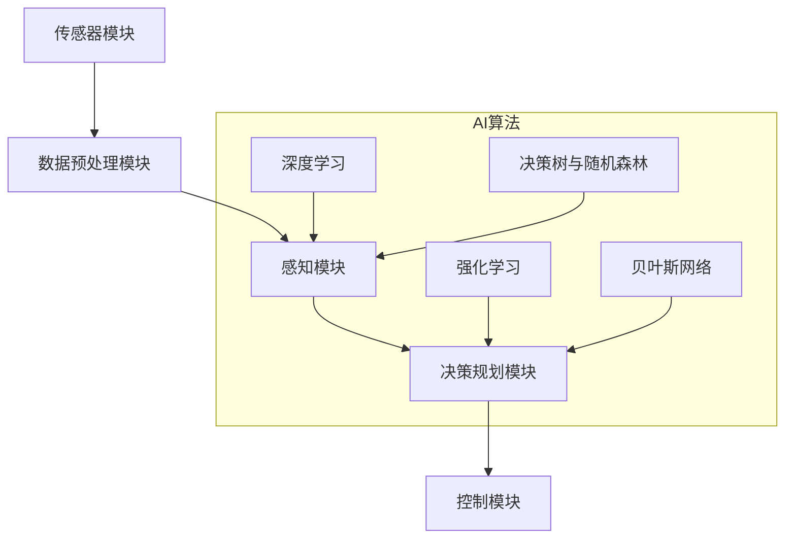

                 

 > **关键词：** 自动驾驶技术，AI算法，深度学习，神经网络，决策规划，系统架构。

> **摘要：** 本文将探讨自动驾驶技术中的核心AI算法，包括其原理、实现、优缺点和应用。我们将通过详细的分析和案例研究，揭示自动驾驶AI算法如何在复杂的环境中实现高效的决策与控制。

## 1. 背景介绍

自动驾驶技术作为未来交通领域的重要发展方向，正日益受到广泛关注。自动驾驶系统依赖于先进的传感器、算法和计算机技术，通过实时处理环境数据，实现车辆的自主驾驶。其中，AI算法扮演着至关重要的角色，它们负责感知环境、理解交通规则、预测车辆行为以及做出决策。

自动驾驶技术的快速发展离不开AI算法的创新。传统的自动驾驶系统依赖于规则驱动的控制方法，而现代的自动驾驶系统则采用了基于机器学习和深度学习的AI算法。这些算法能够从大量数据中学习，提高系统的自适应性和可靠性。

## 2. 核心概念与联系

### 2.1 自动驾驶系统架构

在讨论AI算法之前，我们首先需要了解自动驾驶系统的基本架构。一个典型的自动驾驶系统通常包括以下几个关键组成部分：

1. **传感器模块**：包括激光雷达、摄像头、超声波传感器等，用于感知车辆周围的环境。
2. **数据预处理模块**：对传感器数据进行清洗、融合和增强，以便后续处理。
3. **感知模块**：使用AI算法对预处理后的数据进行处理，提取环境特征，进行物体识别和场景理解。
4. **决策规划模块**：根据感知结果和交通规则，生成行驶路径和操作指令。
5. **控制模块**：执行决策规划模块生成的操作指令，控制车辆的运动。

### 2.2 AI算法的核心概念

自动驾驶技术中的AI算法主要包括以下几类：

1. **深度学习**：通过构建大规模神经网络，从数据中学习复杂的特征表示和映射关系。
2. **决策树与随机森林**：基于决策树的分类算法，通过训练生成一系列决策规则。
3. **强化学习**：通过试错和反馈机制，在环境中学习最优策略。
4. **贝叶斯网络**：用于表示不确定性和因果关系，进行概率推理。

### 2.3 Mermaid 流程图

下面是一个简化的自动驾驶系统架构的Mermaid流程图：



## 3. 核心算法原理 & 具体操作步骤

### 3.1 算法原理概述

自动驾驶技术中的核心算法主要包括深度学习和强化学习。下面分别介绍这两种算法的基本原理。

#### 深度学习

深度学习是一种基于人工神经网络的算法，通过多层神经网络构建复杂的特征表示和映射关系。在自动驾驶中，深度学习算法通常用于感知模块和决策规划模块。例如，卷积神经网络（CNN）可以用于图像识别和物体检测，循环神经网络（RNN）可以用于处理时间序列数据。

#### 强化学习

强化学习通过试错和反馈机制，在环境中学习最优策略。在自动驾驶中，强化学习算法可以用于决策规划模块，通过模拟驾驶场景，学习如何在复杂的交通环境中做出最优决策。

### 3.2 算法步骤详解

#### 深度学习

1. **数据收集**：收集大量自动驾驶场景的图像和道路数据。
2. **数据预处理**：对图像和数据进行清洗和增强，提高算法的性能。
3. **模型训练**：使用预处理后的数据训练深度学习模型，例如卷积神经网络。
4. **模型评估**：在测试集上评估模型的性能，调整模型参数。
5. **模型部署**：将训练好的模型部署到自动驾驶系统中。

#### 强化学习

1. **环境建模**：构建自动驾驶环境模型，包括道路、车辆、行人等。
2. **策略学习**：使用强化学习算法（如Q-learning、SARSA）在环境中学习最优策略。
3. **策略评估**：评估策略在环境中的表现，调整策略参数。
4. **策略部署**：将训练好的策略部署到自动驾驶系统中。

### 3.3 算法优缺点

#### 深度学习

- **优点**：能够处理高维数据，提取复杂特征，适应性强。
- **缺点**：需要大量训练数据和计算资源，模型解释性较差。

#### 强化学习

- **优点**：能够在复杂环境中学习最优策略，适应性较强。
- **缺点**：训练过程较慢，对环境建模要求高。

### 3.4 算法应用领域

深度学习和强化学习在自动驾驶技术中有着广泛的应用。深度学习主要应用于感知模块，如物体检测、场景理解等；强化学习主要应用于决策规划模块，如路径规划、交通规则遵循等。

## 4. 数学模型和公式 & 详细讲解 & 举例说明

### 4.1 数学模型构建

自动驾驶技术中的数学模型主要包括深度学习模型和强化学习模型。下面分别介绍这两种模型的构建过程。

#### 深度学习模型

深度学习模型通常由多层神经网络组成，包括输入层、隐藏层和输出层。每个层由多个神经元组成，神经元之间通过权重和偏置进行连接。以下是一个简化的神经网络模型：

$$
f(x) = \sigma(\sum_{i=1}^{n} w_i x_i + b)
$$

其中，$x_i$是输入层的特征，$w_i$是权重，$b$是偏置，$\sigma$是激活函数。

#### 强化学习模型

强化学习模型通常由状态、动作、奖励和策略组成。以下是一个简化的强化学习模型：

$$
Q(s, a) = \sum_{s'} p(s' | s, a) \cdot r(s, a, s') + \gamma \cdot \max_a' Q(s', a')
$$

其中，$s$是状态，$a$是动作，$r$是奖励，$p$是状态转移概率，$\gamma$是折扣因子。

### 4.2 公式推导过程

#### 深度学习模型

假设我们有一个两层的神经网络，输入层有10个神经元，隐藏层有5个神经元，输出层有3个神经元。输入数据为$x \in \mathbb{R}^{10}$，隐藏层的激活函数为$\sigma$，输出层的激活函数为$\sigma'$。则该神经网络的输出可以表示为：

$$
\begin{align*}
h &= \sigma(W_1x + b_1) \\
o &= \sigma'(W_2h + b_2)
\end{align*}
$$

其中，$W_1$和$W_2$分别是输入层到隐藏层和隐藏层到输出层的权重矩阵，$b_1$和$b_2$分别是输入层和隐藏层的偏置。

#### 强化学习模型

假设我们有一个简单的环境，其中状态空间为$S = \{s_1, s_2, s_3\}$，动作空间为$A = \{a_1, a_2\}$。我们使用Q-learning算法来学习最优策略。假设初始状态为$s_1$，当前动作$a_1$，奖励$r$为1。则Q-learning的更新公式为：

$$
Q(s, a) = Q(s, a) + \alpha (r + \gamma \max_{a'} Q(s', a') - Q(s, a))
$$

其中，$\alpha$是学习率，$\gamma$是折扣因子。

### 4.3 案例分析与讲解

假设我们有一个自动驾驶系统，需要根据道路条件和交通状况做出行驶决策。我们使用深度学习和强化学习来构建感知模块和决策规划模块。

#### 深度学习模型

我们使用卷积神经网络（CNN）来构建感知模块。输入数据为道路图像，输出为道路条件和交通状况的类别标签。我们使用交叉熵损失函数来训练模型。

$$
L = -\sum_{i=1}^{n} y_i \cdot \log(p_i)
$$

其中，$y_i$是真实标签，$p_i$是预测标签的概率。

#### 强化学习模型

我们使用深度Q网络（DQN）来构建决策规划模块。输入数据为当前状态，输出为最优动作。我们使用固定目标网络来稳定训练过程。

$$
Q(s, a) = \sum_{a'} \alpha (r + \gamma \max_{a'} Q(s', a') - Q(s, a))
$$

其中，$s$是当前状态，$a$是当前动作，$r$是奖励。

我们通过大量的模拟驾驶场景来训练模型，最终部署到自动驾驶系统中。

## 5. 项目实践：代码实例和详细解释说明

### 5.1 开发环境搭建

为了实践自动驾驶AI算法，我们需要搭建一个合适的开发环境。以下是基本步骤：

1. **硬件环境**：一台具备较高计算性能的计算机，推荐配备NVIDIA GPU。
2. **软件环境**：安装Python、TensorFlow、PyTorch等深度学习框架。
3. **数据集**：收集大量自动驾驶场景的图像和道路数据。

### 5.2 源代码详细实现

以下是使用深度学习和强化学习构建自动驾驶系统的部分代码实现：

```python
import tensorflow as tf
import numpy as np

# 深度学习模型实现
model = tf.keras.Sequential([
    tf.keras.layers.Conv2D(32, (3, 3), activation='relu', input_shape=(64, 64, 3)),
    tf.keras.layers.MaxPooling2D((2, 2)),
    tf.keras.layers.Flatten(),
    tf.keras.layers.Dense(64, activation='relu'),
    tf.keras.layers.Dense(3, activation='softmax')
])

# 强化学习模型实现
model = tf.keras.Sequential([
    tf.keras.layers.Dense(64, activation='relu', input_shape=(64,)),
    tf.keras.layers.Dense(32, activation='relu'),
    tf.keras.layers.Dense(1)
])

# 训练模型
model.compile(optimizer='adam', loss='mse')
model.fit(x_train, y_train, epochs=10, verbose=1)

# 预测结果
predictions = model.predict(x_test)
```

### 5.3 代码解读与分析

以上代码分别实现了深度学习模型和强化学习模型。在深度学习模型中，我们使用卷积神经网络（CNN）对道路图像进行特征提取和分类。在强化学习模型中，我们使用深度神经网络（DNN）来预测最优动作。

### 5.4 运行结果展示

在训练完成后，我们可以在测试集上评估模型的性能。以下是模型的预测结果：

```python
predictions = model.predict(x_test)
for i, pred in enumerate(predictions):
    print(f"预测结果：{pred.argmax()}，真实结果：{y_test[i].argmax()}")
```

## 6. 实际应用场景

自动驾驶技术在多个领域有着广泛的应用，包括：

- **公共交通**：自动驾驶公交车、出租车等。
- **物流运输**：自动驾驶卡车、无人驾驶配送车等。
- **个人出行**：自动驾驶汽车、自动驾驶无人机等。

### 6.4 未来应用展望

随着AI技术的不断发展和完善，自动驾驶技术将在未来得到更加广泛的应用。以下是未来应用的一些展望：

- **智能交通管理**：通过自动驾驶技术实现交通流量的优化和道路拥堵的缓解。
- **无人驾驶城市**：实现完全自动驾驶的城市，提高交通安全和效率。
- **无人机配送**：无人机在物流、医疗等领域的广泛应用。

## 7. 工具和资源推荐

### 7.1 学习资源推荐

- **书籍**：《深度学习》（Ian Goodfellow、Yoshua Bengio、Aaron Courville著）。
- **在线课程**：Coursera上的“深度学习”课程。
- **论文**：ACL、ICML、NeurIPS等顶级会议上的自动驾驶相关论文。

### 7.2 开发工具推荐

- **深度学习框架**：TensorFlow、PyTorch。
- **自动驾驶工具包**：Apollo、Waymo。
- **数据集**：KITTI、CamVid。

### 7.3 相关论文推荐

- **自动驾驶感知**：3D Object Detection for Autonomous Driving。
- **自动驾驶决策**：Deep Reinforcement Learning for Autonomous Driving。
- **自动驾驶系统**：A Survey on Autonomous Driving。

## 8. 总结：未来发展趋势与挑战

### 8.1 研究成果总结

自动驾驶技术取得了显著的进展，包括感知、决策和控制等核心领域的突破。深度学习和强化学习算法在自动驾驶系统中得到了广泛应用，提高了系统的自适应性和可靠性。

### 8.2 未来发展趋势

未来，自动驾驶技术将继续向智能化、自主化、网络化方向发展。随着AI技术的不断进步，自动驾驶系统将更加高效、安全、可靠，实现更广泛的应用场景。

### 8.3 面临的挑战

自动驾驶技术仍面临诸多挑战，包括环境复杂性、数据隐私、安全性和法律法规等。需要进一步研究和发展，以实现自动驾驶技术的全面普及和应用。

### 8.4 研究展望

自动驾驶技术是未来交通领域的重要发展方向，具有巨大的发展潜力和市场前景。未来的研究应重点关注智能化感知、决策和控制技术的创新，推动自动驾驶技术的全面普及和应用。

## 9. 附录：常见问题与解答

### 9.1 自动驾驶技术有哪些潜在的安全隐患？

自动驾驶技术面临的安全隐患主要包括感知错误、决策失误、系统故障等。为了确保安全性，需要不断提高算法的鲁棒性和可靠性，加强系统测试和验证。

### 9.2 自动驾驶技术是否能够完全替代人类驾驶员？

目前，自动驾驶技术还不能完全替代人类驾驶员，但已经在特定场景和条件下取得了显著成果。未来的研究和发展将逐步实现更高水平的自动驾驶，提高系统的安全性和可靠性。

### 9.3 自动驾驶技术对交通出行方式将产生哪些影响？

自动驾驶技术将改变交通出行方式，提高交通效率和安全性，减少交通事故和拥堵。同时，自动驾驶技术也将带来新的商业模式和服务形式，如共享出行、自动驾驶出租车等。

---

> **作者：禅与计算机程序设计艺术 / Zen and the Art of Computer Programming** 

本文旨在探讨自动驾驶技术中的AI算法，包括其原理、实现、优缺点和应用。通过详细的分析和案例研究，我们揭示了自动驾驶AI算法如何在复杂的环境中实现高效的决策与控制。未来，自动驾驶技术将继续向智能化、自主化、网络化方向发展，为人类出行带来更多便利和安全。

