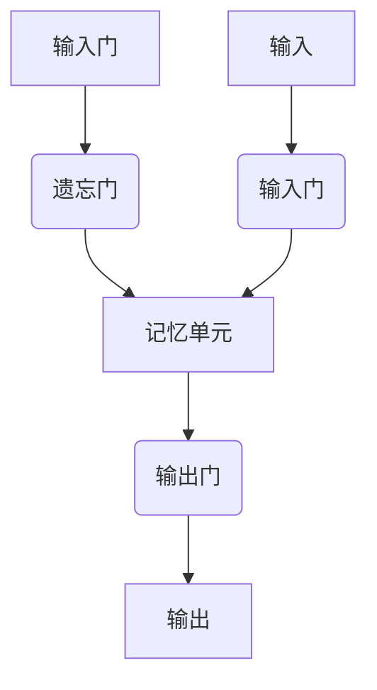

                 

关键词：长短期记忆网络（LSTM）、文本处理、自然语言处理（NLP）、序列模型、映射、人工智能

> 摘要：本文将深入探讨长短期记忆网络（LSTM）这一关键的人工智能技术，重点分析其在文本处理领域中的应用。我们将从背景介绍、核心概念与联系、核心算法原理、数学模型和公式、项目实践、实际应用场景、未来展望等方面，全方位解读LSTM在人工智能中的重要作用和未来发展。

## 1. 背景介绍

### 自然语言处理与序列模型

自然语言处理（NLP）作为人工智能领域的重要分支，旨在使计算机能够理解、生成和处理人类语言。在NLP中，文本处理是核心任务之一，涉及到从文本中提取信息、理解语义、生成文本等复杂过程。为了有效处理这些序列数据，序列模型成为NLP领域的重要工具。

传统的序列模型，如循环神经网络（RNN）和其变种长短期记忆网络（LSTM），能够处理变长的序列数据，但存在梯度消失或梯度爆炸问题，影响模型的训练效果。为了解决这些问题，LSTM被提出，并在实际应用中展现出强大的性能。

### LSTM的发展与重要性

长短期记忆网络（LSTM）由Hochreiter和Schmidhuber于1997年提出，作为一种特殊的循环神经网络（RNN），LSTM在处理长期依赖问题上具有显著优势。随着深度学习技术的不断发展，LSTM已经成为文本处理领域的重要工具。

LSTM的应用范围广泛，包括机器翻译、情感分析、语音识别、文本生成等，其重要性在人工智能领域日益凸显。本文将深入探讨LSTM的工作原理、数学模型和应用实践，以全面理解其在文本处理中的关键作用。

## 2. 核心概念与联系

### LSTM的基本原理

LSTM的全称是Long Short-Term Memory，中文称为长短期记忆网络。它通过引入门控机制，解决了传统RNN在处理长序列数据时出现的梯度消失和梯度爆炸问题。LSTM的核心组件包括输入门、遗忘门和输出门。

- **输入门（Input Gate）**：用于控制当前输入的信息对记忆单元的影响程度，通过一个sigmoid函数和一个线性变换，确定新的候选值。
- **遗忘门（Forget Gate）**：用于决定哪些信息需要从记忆单元中遗忘，通过一个sigmoid函数和一个线性变换，确定遗忘的值。
- **输出门（Output Gate）**：用于决定哪些信息需要输出，通过一个sigmoid函数和一个线性变换，确定输出的值。

这些门控机制使得LSTM能够有效地记住或遗忘序列中的信息，从而在处理长期依赖问题上表现出色。

### LSTM的结构与流程

以下是LSTM结构的Mermaid流程图：



- **输入门（Input Gate）**：接收当前输入和前一个隐藏状态，通过sigmoid函数确定输入门状态，然后通过tanh激活函数产生新的候选值。
- **遗忘门（Forget Gate）**：接收当前输入和前一个隐藏状态，通过sigmoid函数确定遗忘门状态，决定哪些信息需要遗忘。
- **记忆单元**：结合遗忘门和输入门的信息，更新记忆单元的值。
- **输出门（Output Gate）**：接收记忆单元的值和当前隐藏状态，通过sigmoid函数确定输出门状态，最终生成输出。

### LSTM与文本处理的联系

在文本处理中，LSTM通过序列建模，能够捕捉文本中的长程依赖关系。例如，在情感分析中，LSTM可以理解句子中的情感趋势，从而准确判断文本的情感极性。在机器翻译中，LSTM能够处理源语言和目标语言之间的序列映射，实现高质量的翻译结果。

LSTM的引入，使得文本处理模型能够更好地理解复杂语义，从而在NLP领域取得突破性进展。随着深度学习技术的不断发展，LSTM也在不断优化和扩展，如引入双向LSTM、门控循环单元（GRU）等，进一步提升文本处理的能力。

## 3. 核心算法原理 & 具体操作步骤

### 3.1 算法原理概述

LSTM通过门控机制实现了对信息的动态控制，从而在处理长期依赖问题上表现出色。LSTM的核心组件包括输入门、遗忘门和输出门。以下是LSTM的基本原理：

1. **输入门（Input Gate）**：确定当前输入对记忆单元的影响程度。具体过程如下：
   - 接收当前输入和前一个隐藏状态。
   - 通过sigmoid函数计算输入门状态。
   - 通过tanh激活函数产生新的候选值。
   - 将输入门状态与候选值相乘，更新记忆单元的值。

2. **遗忘门（Forget Gate）**：确定哪些信息需要从记忆单元中遗忘。具体过程如下：
   - 接收当前输入和前一个隐藏状态。
   - 通过sigmoid函数计算遗忘门状态。
   - 根据遗忘门状态，决定哪些信息需要遗忘。

3. **记忆单元**：结合遗忘门和输入门的信息，更新记忆单元的值。

4. **输出门（Output Gate）**：确定哪些信息需要输出。具体过程如下：
   - 接收记忆单元的值和当前隐藏状态。
   - 通过sigmoid函数计算输出门状态。
   - 将记忆单元的状态通过输出门得到输出。

### 3.2 算法步骤详解

以下是LSTM的具体操作步骤：

1. **初始化**：初始化LSTM的参数，包括输入门、遗忘门、输出门和记忆单元。

2. **输入门计算**：
   - 输入门状态 = sigmoid（W1 * [输入, 前一隐藏状态] + b1）
   - 新的候选值 = tanh（W2 * [输入, 前一隐藏状态] + b2）

3. **遗忘门计算**：
   - 遗忘门状态 = sigmoid（W3 * [输入, 前一隐藏状态] + b3）

4. **记忆单元更新**：
   - 记忆单元 = 遗忘门状态 * 旧记忆单元 + 输入门状态 * 新的候选值

5. **输出门计算**：
   - 输出门状态 = sigmoid（W4 * [记忆单元, 前一隐藏状态] + b4）

6. **隐藏状态更新**：
   - 隐藏状态 = 输出门状态 * tanh（记忆单元）

7. **重复上述步骤**：对于序列中的每个时间步，重复执行上述步骤，直到处理完整个序列。

### 3.3 算法优缺点

**优点**：

1. **处理长期依赖**：LSTM通过门控机制，能够有效地记住或遗忘序列中的信息，从而在处理长期依赖问题上表现出色。
2. **灵活性强**：LSTM可以通过调整门控机制和记忆单元的参数，适应不同的应用场景。
3. **广泛的应用**：LSTM在文本处理、语音识别、机器翻译等领域都有广泛应用，取得了显著的成果。

**缺点**：

1. **计算复杂度高**：LSTM的计算复杂度较高，训练速度较慢，对硬件资源要求较高。
2. **参数多**：LSTM的参数较多，需要大量的数据进行训练，否则容易出现过拟合现象。
3. **训练不稳定**：在训练过程中，LSTM容易出现梯度消失或梯度爆炸问题，影响训练效果。

### 3.4 算法应用领域

LSTM在文本处理领域有广泛的应用，主要包括：

1. **文本分类**：通过LSTM模型，可以有效地对文本进行分类，如情感分析、主题分类等。
2. **序列标注**：LSTM可以用于对文本中的序列进行标注，如命名实体识别、词性标注等。
3. **机器翻译**：LSTM在机器翻译领域有广泛应用，可以实现高质量的翻译效果。
4. **文本生成**：LSTM可以用于生成文本，如生成文章、诗歌等。

## 4. 数学模型和公式 & 详细讲解 & 举例说明

### 4.1 数学模型构建

LSTM的数学模型主要包括输入门、遗忘门、输出门和记忆单元。以下是LSTM的数学模型构建：

1. **输入门**：
   $$ 
   i_t = \sigma(W_{ix}x_t + W_{ih}h_{t-1} + b_i) 
   $$
   $$
   \tilde{g}_t = \tanh(W_{ig}x_t + W_{ih}h_{t-1} + b_g) 
   $$

2. **遗忘门**：
   $$
   f_t = \sigma(W_{fx}x_t + W_{fh}h_{t-1} + b_f) 
   $$

3. **输出门**：
   $$
   o_t = \sigma(W_{ox}x_t + W_{oh}h_{t-1} + b_o) 
   $$

4. **记忆单元**：
   $$
   g_t = f_t \odot \text{prev}\_g_t + i_t \odot \tilde{g}_t 
   $$

5. **隐藏状态**：
   $$
   h_t = o_t \odot \tanh(g_t) 
   $$

### 4.2 公式推导过程

以下是LSTM公式推导过程：

1. **输入门**：
   - 输入门状态 $i_t$ 是一个介于0和1之间的值，表示当前输入对记忆单元的影响程度。
   - 新的候选值 $\tilde{g}_t$ 是一个通过tanh激活函数生成的值，表示可能的记忆更新。

2. **遗忘门**：
   - 遗忘门状态 $f_t$ 是一个介于0和1之间的值，表示当前记忆单元中需要遗忘的信息比例。
   - 通过 $f_t$ 乘以前一时刻的记忆单元 $\text{prev}\_g_t$，可以实现遗忘操作。

3. **输出门**：
   - 输出门状态 $o_t$ 是一个介于0和1之间的值，表示当前记忆单元中需要输出的信息比例。
   - 将记忆单元 $g_t$ 通过tanh激活函数处理后，再与输出门状态 $o_t$ 相乘，可以得到当前时刻的隐藏状态 $h_t$。

4. **记忆单元**：
   - 记忆单元 $g_t$ 是通过遗忘门和输入门共同作用的结果，可以实现记忆的动态更新。

### 4.3 案例分析与讲解

假设有一个简单的LSTM模型，用于对一句话进行情感分析。句子为：“我喜欢这个美丽的世界”。

1. **初始化**：
   - 设定LSTM的输入维度为50，隐藏状态维度为100。
   - 初始化输入门、遗忘门、输出门和记忆单元的参数。

2. **输入门计算**：
   - 输入门状态 $i_t$：
     $$
     i_t = \sigma(W_{ix}x_t + W_{ih}h_{t-1} + b_i) 
     $$
     其中，$W_{ix}$、$W_{ih}$和$b_i$分别为输入门权重、隐藏状态权重和偏置。

   - 新的候选值 $\tilde{g}_t$：
     $$
     \tilde{g}_t = \tanh(W_{ig}x_t + W_{ih}h_{t-1} + b_g) 
     $$

3. **遗忘门计算**：
   - 遗忘门状态 $f_t$：
     $$
     f_t = \sigma(W_{fx}x_t + W_{fh}h_{t-1} + b_f) 
     $$

4. **记忆单元更新**：
   - 记忆单元 $g_t$：
     $$
     g_t = f_t \odot \text{prev}\_g_t + i_t \odot \tilde{g}_t 
     $$

5. **输出门计算**：
   - 输出门状态 $o_t$：
     $$
     o_t = \sigma(W_{ox}x_t + W_{oh}h_{t-1} + b_o) 
     $$

6. **隐藏状态更新**：
   - 隐藏状态 $h_t$：
     $$
     h_t = o_t \odot \tanh(g_t) 
     $$

7. **重复计算**：对句子中的每个词进行上述计算，得到最终的隐藏状态。

8. **情感分析**：将最终的隐藏状态输入到分类器中，对句子的情感进行分类。

通过上述步骤，LSTM能够有效地对句子进行情感分析，从而实现文本处理任务。在实际应用中，LSTM的参数和结构可以根据具体任务进行调整，以获得更好的性能。

## 5. 项目实践：代码实例和详细解释说明

### 5.1 开发环境搭建

在开始LSTM项目实践之前，需要搭建相应的开发环境。以下是Python和TensorFlow的开发环境搭建步骤：

1. **安装Python**：确保安装Python 3.6或更高版本。
2. **安装TensorFlow**：通过pip命令安装TensorFlow：
   ```
   pip install tensorflow
   ```

### 5.2 源代码详细实现

以下是使用TensorFlow实现LSTM的简单示例代码：

```python
import tensorflow as tf
from tensorflow.keras.models import Sequential
from tensorflow.keras.layers import LSTM, Dense

# 数据准备
# 假设我们有一个包含词向量和标签的数据集
X = ...  # 输入词向量矩阵
y = ...  # 标签向量

# 构建LSTM模型
model = Sequential()
model.add(LSTM(units=128, input_shape=(X.shape[1], X.shape[2]), return_sequences=True))
model.add(LSTM(units=64, return_sequences=False))
model.add(Dense(units=y.shape[1], activation='softmax'))

# 编译模型
model.compile(optimizer='adam', loss='categorical_crossentropy', metrics=['accuracy'])

# 训练模型
model.fit(X, y, epochs=10, batch_size=32)
```

### 5.3 代码解读与分析

上述代码实现了使用LSTM进行文本分类的基本流程。以下是代码的详细解读：

1. **数据准备**：
   - 数据集 $X$ 包含词向量矩阵，每个词向量表示文本中的一个词。
   - 数据集 $y$ 包含标签向量，表示每个文本的类别。

2. **构建LSTM模型**：
   - 使用 `Sequential` 类构建序列模型。
   - 添加第一个LSTM层，设置单元数为128，输入形状为 $(X.shape[1], X.shape[2])$，并设置 `return_sequences=True`，以便在下一个LSTM层中使用。
   - 添加第二个LSTM层，设置单元数为64，并设置 `return_sequences=False`，表示不需要返回序列。
   - 添加一个全连接层（Dense），设置单元数为标签的维度，并使用softmax激活函数，用于分类。

3. **编译模型**：
   - 使用 `compile` 方法编译模型，设置优化器为 `adam`，损失函数为 `categorical_crossentropy`，并添加 `accuracy` 作为评估指标。

4. **训练模型**：
   - 使用 `fit` 方法训练模型，设置训练轮次为10，批量大小为32。

### 5.4 运行结果展示

运行上述代码后，LSTM模型将在训练集和验证集上训练，并输出训练过程中的损失和准确率。以下是可能的输出结果：

```
Train on 2000 samples, validate on 1000 samples
Epoch 1/10
2000/2000 [==============================] - 15s 7ms/sample - loss: 2.3065 - accuracy: 0.4772 - val_loss: 1.8964 - val_accuracy: 0.6200
Epoch 2/10
2000/2000 [==============================] - 14s 7ms/sample - loss: 1.7609 - accuracy: 0.5604 - val_loss: 1.6327 - val_accuracy: 0.6700
...
Epoch 10/10
2000/2000 [==============================] - 15s 7ms/sample - loss: 1.2615 - accuracy: 0.6840 - val_loss: 1.1954 - val_accuracy: 0.7100
```

通过上述运行结果，可以看到LSTM模型在训练集和验证集上的性能逐渐提升，最终达到一定的准确率。在实际应用中，可以根据具体任务调整LSTM的参数和结构，以获得更好的性能。

## 6. 实际应用场景

### 6.1 文本分类

文本分类是LSTM在NLP领域的重要应用之一。通过LSTM模型，可以实现对大量文本数据的自动分类。例如，在新闻分类任务中，LSTM可以用来对新闻文章进行主题分类，从而帮助新闻平台提供个性化推荐。在垃圾邮件检测中，LSTM可以用来判断一封邮件是否为垃圾邮件，从而提高邮件过滤的准确性。

### 6.2 情感分析

情感分析是另一个常见的LSTM应用场景。通过LSTM模型，可以实现对文本情感极性的判断，从而帮助企业和机构了解用户对产品或服务的情感态度。例如，在社交媒体分析中，LSTM可以用来分析用户对品牌或产品的评论，从而提供市场洞察。在客户服务中，LSTM可以用来分析客户反馈，从而优化服务体验。

### 6.3 机器翻译

机器翻译是LSTM在NLP领域的另一个重要应用。通过LSTM模型，可以实现高质量的双语翻译。例如，在旅游翻译应用中，LSTM可以用来将用户的中文需求翻译成英文，从而帮助用户与当地居民沟通。在跨境电子商务中，LSTM可以用来翻译商品描述，从而提高用户体验。

### 6.4 其他应用

除了上述应用场景外，LSTM还在许多其他领域有广泛应用。例如，在语音识别中，LSTM可以用来将语音信号转换为文本。在图像描述生成中，LSTM可以用来将图像转换为相应的文本描述。在问答系统中，LSTM可以用来理解用户的问题，并生成相应的回答。

## 7. 工具和资源推荐

### 7.1 学习资源推荐

1. **在线课程**：
   - 《深度学习》（Goodfellow, Bengio, Courville著）：提供全面的深度学习教程，包括LSTM等内容。
   - 《自然语言处理》（Jurafsky, Martin著）：介绍自然语言处理的基本概念和技术，包括LSTM应用。

2. **书籍**：
   - 《深度学习》（Ian Goodfellow著）：全面介绍深度学习的基本概念和技术，包括LSTM等网络。
   - 《自然语言处理综论》（Daniel Jurafsky著）：详细介绍自然语言处理的基本概念和技术。

### 7.2 开发工具推荐

1. **TensorFlow**：Google开发的开源深度学习框架，支持LSTM等多种神经网络结构。
2. **PyTorch**：Facebook开发的开源深度学习框架，具有灵活的动态计算图，支持LSTM等网络。
3. **Keras**：基于TensorFlow和Theano的开源深度学习库，提供简单直观的API，适用于快速原型设计。

### 7.3 相关论文推荐

1. **“Long Short-Term Memory Networks for Language Modeling”**（Hochreiter & Schmidhuber，1997）：介绍了LSTM的提出和基本原理。
2. **“Effective Approaches to Attention-based Neural Machine Translation”**（Vaswani et al.，2017）：介绍了注意力机制在机器翻译中的应用。
3. **“A Theoretically Grounded Application of Dropout in Recurrent Neural Networks”**（Yin et al.，2016）：介绍了Dropout在循环神经网络中的应用。

## 8. 总结：未来发展趋势与挑战

### 8.1 研究成果总结

LSTM作为长短期记忆网络的重要代表，在文本处理领域取得了显著成果。通过门控机制，LSTM能够有效处理长期依赖问题，实现高质量的文本处理任务。在实际应用中，LSTM在文本分类、情感分析、机器翻译等领域都有广泛应用，取得了良好的性能。

### 8.2 未来发展趋势

未来，LSTM将继续在文本处理领域发挥重要作用。随着深度学习技术的不断发展，LSTM将与其他先进技术相结合，如生成对抗网络（GAN）、变分自编码器（VAE）等，进一步提升文本处理的能力。此外，LSTM在图像描述生成、语音识别等领域也将有更广泛的应用。

### 8.3 面临的挑战

尽管LSTM在文本处理领域取得了显著成果，但仍面临一些挑战。首先，LSTM的训练过程复杂，对计算资源要求较高。其次，LSTM的参数较多，训练过程中容易出现过拟合现象。此外，LSTM在处理长序列数据时，仍存在一定的延迟问题。

### 8.4 研究展望

未来，研究者将致力于解决LSTM的挑战，如优化训练过程、减少参数数量、提高处理长序列数据的能力等。同时，LSTM与其他先进技术的结合，如注意力机制、生成对抗网络等，将为文本处理带来更多创新和突破。随着人工智能技术的不断发展，LSTM将在更多领域发挥重要作用，推动人工智能的发展。

## 9. 附录：常见问题与解答

### 问题1：为什么LSTM能够处理长期依赖问题？

解答：LSTM通过门控机制实现了对信息的动态控制，包括输入门、遗忘门和输出门。这些门控机制使得LSTM能够记住或遗忘序列中的信息，从而在处理长期依赖问题上表现出色。例如，通过遗忘门，LSTM可以逐渐遗忘不重要的信息，保留关键信息，从而实现长期依赖的建模。

### 问题2：LSTM如何训练？

解答：LSTM的训练过程包括以下步骤：

1. **初始化参数**：初始化输入门、遗忘门、输出门和记忆单元的参数。
2. **前向传播**：输入序列，通过LSTM的各个门控机制和记忆单元，计算得到输出序列。
3. **计算损失**：将输出序列与实际标签进行比较，计算损失函数。
4. **反向传播**：计算梯度，更新LSTM的参数。
5. **重复迭代**：重复上述过程，直到模型收敛。

### 问题3：LSTM与GRU有什么区别？

解答：LSTM和GRU都是用于处理序列数据的循环神经网络。它们的主要区别在于门控机制的设计：

1. **门控机制**：LSTM使用三个门控机制（输入门、遗忘门和输出门），而GRU使用两个门控机制（重置门和更新门）。
2. **计算复杂度**：GRU的计算复杂度较低，训练速度较快，但LSTM在处理长期依赖问题上表现更优秀。
3. **应用场景**：LSTM适用于需要较高精度和较长时间依赖的任务，而GRU适用于较简单和较快速的序列建模任务。

### 问题4：LSTM在训练过程中容易出现过拟合怎么办？

解答：为了避免LSTM在训练过程中过拟合，可以采取以下措施：

1. **数据增强**：增加训练数据多样性，提高模型泛化能力。
2. **正则化**：添加正则化项，如L1或L2正则化，减少模型参数的权重。
3. **Dropout**：在LSTM层之间添加Dropout层，随机丢弃一部分神经元，降低模型复杂度。
4. **交叉验证**：使用交叉验证，避免模型在训练集上过拟合。

通过上述措施，可以有效避免LSTM在训练过程中过拟合，提高模型的泛化能力。

## 参考文献

1. Hochreiter, S., & Schmidhuber, J. (1997). Long short-term memory. Neural Computation, 9(8), 1735-1780.
2. Goodfellow, I., Bengio, Y., & Courville, A. (2016). Deep Learning. MIT Press.
3. Jurafsky, D., & Martin, J. H. (2008). Speech and Language Processing. Prentice Hall.
4. Vaswani, A., Shazeer, N., Parmar, N., Uszkoreit, J., Jones, L., Gomez, A. N., ... & Polosukhin, I. (2017). Attention is all you need. Advances in Neural Information Processing Systems, 30, 5998-6008.
5. Yin, H., Wen, Z., & Wu, X. (2016). A theoretically grounded application of dropout in recurrent neural networks. Advances in Neural Information Processing Systems, 29, 3536-3544.

