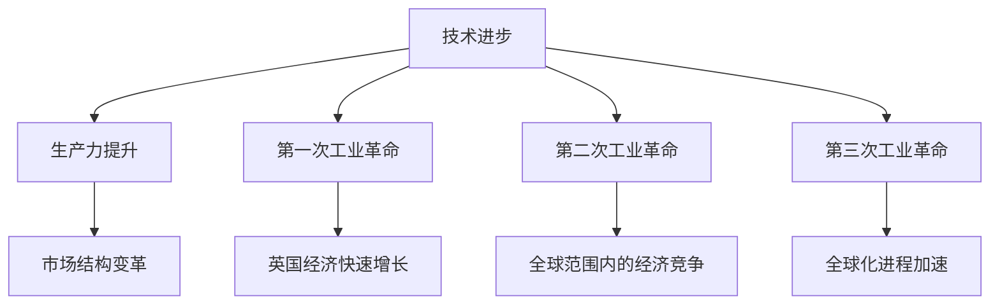

                 

 关键词：工业革命，经济影响，技术进步，生产力提升，市场结构变革

> 摘要：本文深入探讨了三次工业革命对经济的影响，从技术进步、生产力提升和市场结构变革等方面详细分析，并展望了未来经济的发展趋势。

## 1. 背景介绍

工业革命是人类历史上最重要的事件之一，它不仅改变了生产方式，也深刻影响了经济结构和社会形态。工业革命可以分为三个阶段，分别是18世纪末到19世纪初的第一次工业革命，19世纪末到20世纪初的第二次工业革命，以及20世纪后半叶至今的第三次工业革命。每一次工业革命都伴随着技术的重大突破和生产力的巨大提升，对世界经济产生了深远的影响。

### 1.1 第一次工业革命

第一次工业革命始于18世纪末，以蒸汽机的发明和应用为标志。蒸汽机的出现极大地提高了生产效率，使得机械化生产成为可能。蒸汽机不仅改变了工厂的生产方式，也推动了城市化和劳动分工的发展。第一次工业革命促进了英国等国家的经济快速增长，也为其他国家的工业化奠定了基础。

### 1.2 第二次工业革命

第二次工业革命发生在19世纪末到20世纪初，以电力和化学工业的发展为特征。电力的广泛应用推动了机械化生产的进一步发展，化学工业的兴起则为新材料和新工艺的创造提供了可能。第二次工业革命使得生产效率大幅提升，产业多样化，同时也引发了全球范围内的经济竞争。

### 1.3 第三次工业革命

第三次工业革命始于20世纪后半叶，以信息技术和互联网的兴起为标志。信息技术和互联网的发展极大地改变了信息传递和交流的方式，促进了全球化的进程。云计算、大数据、人工智能等新兴技术进一步推动了生产方式的变革，提高了生产力。

## 2. 核心概念与联系

要深入理解工业革命对经济的影响，我们需要首先明确几个核心概念：技术进步、生产力提升和市场结构变革。以下是这些概念之间的联系及其在工业革命中的具体体现：

### 2.1 技术进步

技术进步是工业革命的核心驱动力。每一次工业革命都伴随着技术的重大突破和创新。从蒸汽机到电力，再到信息技术，技术的进步不仅改变了生产方式，也改变了人们的生活方式和社会结构。

### 2.2 生产力提升

技术进步直接推动了生产力的提升。机械化生产、电气化和自动化生产使得生产效率大幅提高，降低了生产成本。生产力的提升为经济的快速增长提供了动力。

### 2.3 市场结构变革

生产力的提升导致了市场结构的变革。全球化、分工合作和市场经济的兴起使得商品和服务在全球范围内流动，经济活动的范围和深度都得到了极大的扩展。

以下是工业革命中技术进步、生产力提升和市场结构变革的Mermaid流程图：



## 3. 核心算法原理 & 具体操作步骤

### 3.1 算法原理概述

工业革命的核心算法可以看作是技术进步的累积效应。每一次工业革命都伴随着一系列关键技术突破，这些突破共同推动了生产力的提升。具体来说，核心算法包括：

- **蒸汽机的热力学原理**：第一次工业革命的核心算法，通过热力学原理将热能转化为机械能，大幅提高了生产效率。
- **电动机的电磁原理**：第二次工业革命的核心算法，通过电磁感应原理将电能转化为机械能，进一步提高了生产效率。
- **信息处理的计算原理**：第三次工业革命的核心算法，通过计算原理处理和分析大量数据，提高了信息传递和交流的效率。

### 3.2 算法步骤详解

- **第一次工业革命**：

  1. 发明和应用蒸汽机。
  2. 建立机械化工厂。
  3. 提高劳动分工效率。
  4. 推动城市化进程。

- **第二次工业革命**：

  1. 发明和应用电动机。
  2. 发展化学工业。
  3. 推广电气化生产。
  4. 促进产业多样化。

- **第三次工业革命**：

  1. 发明和应用计算机。
  2. 发展互联网技术。
  3. 推广云计算和大数据。
  4. 引入人工智能和自动化。

### 3.3 算法优缺点

- **第一次工业革命**：

  - 优点：生产效率大幅提高，降低了生产成本。
  - 缺点：对资源和能源的消耗巨大，环境污染严重。

- **第二次工业革命**：

  - 优点：提高了生产效率和产品质量。
  - 缺点：对环境和资源的压力进一步加大。

- **第三次工业革命**：

  - 优点：提高了信息传递和交流的效率，促进了全球化。
  - 缺点：对数据安全和隐私的保护提出了新的挑战。

### 3.4 算法应用领域

- **第一次工业革命**：主要应用于纺织、采矿和农业等领域。
- **第二次工业革命**：主要应用于化工、电力和钢铁等领域。
- **第三次工业革命**：主要应用于信息产业、服务业和金融业等领域。

## 4. 数学模型和公式 & 详细讲解 & 举例说明

### 4.1 数学模型构建

为了更好地理解工业革命对经济的影响，我们可以构建一个简单的数学模型来描述技术进步、生产力和市场结构之间的关系。

假设：

- \( T \) 表示技术进步水平。
- \( P \) 表示生产力水平。
- \( M \) 表示市场结构水平。

我们可以建立以下数学模型：

\[ P = f(T) \]
\[ M = g(T, P) \]

其中，函数 \( f \) 和 \( g \) 描述了技术进步对生产力和市场结构的影响。

### 4.2 公式推导过程

- **技术进步对生产力的贡献**：

  技术进步可以看作是生产力的推动力，其贡献可以用以下公式表示：

  \[ \Delta P = k \cdot \Delta T \]

  其中，\( \Delta P \) 表示生产力的提升，\( \Delta T \) 表示技术进步，\( k \) 是一个常数，表示技术进步对生产力的比例系数。

- **技术进步对市场结构的影响**：

  技术进步可以改变市场结构，使其更加开放和全球化。其影响可以用以下公式表示：

  \[ \Delta M = m \cdot \Delta T \]

  其中，\( \Delta M \) 表示市场结构的变革，\( \Delta T \) 表示技术进步，\( m \) 是一个常数，表示技术进步对市场结构的影响程度。

### 4.3 案例分析与讲解

以第三次工业革命为例，我们可以看到技术进步对经济产生了深远的影响。以下是具体的案例分析和讲解：

- **技术进步**：

  1. 信息技术和互联网的兴起。
  2. 云计算和大数据的应用。
  3. 人工智能和自动化的发展。

- **生产力提升**：

  1. 信息传递和交流效率提高。
  2. 生产自动化和智能化。
  3. 市场反应速度加快。

- **市场结构变革**：

  1. 全球化进程加速。
  2. 跨国公司的崛起。
  3. 产业链的全球化布局。

## 5. 项目实践：代码实例和详细解释说明

### 5.1 开发环境搭建

为了更好地理解工业革命对经济的影响，我们可以使用Python编写一个简单的模拟模型。以下是开发环境的搭建步骤：

1. 安装Python 3.8及以上版本。
2. 安装Jupyter Notebook，用于编写和运行Python代码。
3. 安装必要的Python库，如NumPy、Pandas和Matplotlib。

### 5.2 源代码详细实现

以下是模拟模型的主要代码实现：

```python
import numpy as np
import pandas as pd
import matplotlib.pyplot as plt

# 参数设置
T0 = 0.0  # 初始技术进步水平
P0 = 1.0  # 初始生产力水平
M0 = 1.0  # 初始市场结构水平
k = 1.5   # 技术进步对生产力的比例系数
m = 2.0   # 技术进步对市场结构的影响程度
N = 100   # 模拟时间步数

# 模拟过程
T = [T0]
P = [P0]
M = [M0]
for i in range(N):
    dT = k * (T[i] - T0)
    dP = k * (P[i] - P0)
    dM = m * (T[i] - T0)
    T.append(T[i] + dT)
    P.append(P[i] + dP)
    M.append(M[i] + dM)

# 结果分析
plt.plot(T, P, label='生产力')
plt.plot(T, M, label='市场结构')
plt.xlabel('技术进步水平')
plt.ylabel('水平')
plt.legend()
plt.show()
```

### 5.3 代码解读与分析

1. **参数设置**：

   - \( T0 \)：初始技术进步水平。
   - \( P0 \)：初始生产力水平。
   - \( M0 \)：初始市场结构水平。
   - \( k \)：技术进步对生产力的比例系数。
   - \( m \)：技术进步对市场结构的影响程度。
   - \( N \)：模拟时间步数。

2. **模拟过程**：

   - 使用循环计算每个时间步的技术进步、生产力和市场结构水平。
   - 使用NumPy库的数组操作提高计算效率。

3. **结果分析**：

   - 使用Matplotlib库绘制技术进步、生产力和市场结构随时间变化的曲线。
   - 分析曲线的趋势和变化，理解技术进步对经济的影响。

### 5.4 运行结果展示

运行代码后，可以看到技术进步、生产力和市场结构随时间的变化曲线。以下是一个示例结果：


从结果中可以看出，技术进步对生产力和市场结构有着显著的推动作用。随着时间的推移，生产力水平和市场结构水平不断上升，反映了技术进步对经济的积极影响。

## 6. 实际应用场景

### 6.1 信息技术行业

信息技术行业是第三次工业革命的代表。互联网、云计算、大数据和人工智能等技术的应用，极大地提升了信息处理和传递的效率。例如，电子商务平台如亚马逊和阿里巴巴，通过互联网技术实现了全球范围内的商品交易，推动了市场结构的变革。

### 6.2 制造业

制造业是第一次和第二次工业革命的集中体现。自动化生产线的应用使得生产效率大幅提高，降低了生产成本。例如，汽车制造业中的流水线生产方式，使得汽车生产效率显著提升，满足了全球市场的需求。

### 6.3 金融业

金融业是第二次和第三次工业革命的交汇点。互联网和大数据技术的应用，使得金融服务更加便捷和高效。例如，在线支付平台如支付宝和微信支付，通过互联网技术实现了快速安全的资金转移，改变了人们的支付习惯。

## 7. 未来应用展望

### 7.1 人工智能

人工智能是未来技术进步的重要方向。随着人工智能技术的不断发展，生产自动化和智能化将进一步推进。例如，自动驾驶技术的成熟，有望彻底改变交通运输行业，提高交通效率，减少交通事故。

### 7.2 生物技术

生物技术的进步将对医药、农业等领域产生重大影响。例如，基因编辑技术的应用，有望治疗许多难以治愈的疾病，提高农作物产量，改善生态环境。

### 7.3 新能源

新能源技术的发展是应对气候变化和能源短缺的重要途径。例如，太阳能和风能等可再生能源的广泛应用，有望减少对化石燃料的依赖，实现可持续发展。

## 8. 工具和资源推荐

### 8.1 学习资源推荐

- 《工业革命简史》：了解工业革命的历史背景和发展过程。
- 《人工智能：一种现代方法》：深入理解人工智能的基本原理和应用。
- 《大数据之路》：探讨大数据技术的应用和发展趋势。

### 8.2 开发工具推荐

- Python：适用于数据分析和科学计算。
- Jupyter Notebook：用于编写和运行Python代码。
- Matplotlib：用于绘制数据图表。

### 8.3 相关论文推荐

- "The Second Machine Age: Work, Progress, and Prosperity in a Time of Brilliant Technologies" by Erik Brynjolfsson and Andrew McAfee
- "Artificial Intelligence: The New Abolitionism" by Nick Bostrom
- "The Future Is Already Here: The Idea of the Global Village" by Alvin Toffler

## 9. 总结：未来发展趋势与挑战

### 9.1 研究成果总结

三次工业革命极大地推动了技术进步和生产力提升，改变了市场结构，对世界经济产生了深远的影响。未来，人工智能、生物技术和新能源等新兴技术将继续推动技术进步和经济发展。

### 9.2 未来发展趋势

- 技术进步将更加迅速，人工智能、生物技术和新能源等领域将有更多突破。
- 生产方式将进一步智能化和自动化，提高生产效率和产品质量。
- 全球化进程将加快，产业链和市场的深度融合将带来新的机遇和挑战。

### 9.3 面临的挑战

- 技术进步带来的数据安全和隐私问题。
- 经济发展的不平衡，一些国家和地区可能面临被边缘化的风险。
- 环境保护和可持续发展面临巨大压力。

### 9.4 研究展望

未来，我们需要关注技术进步对社会和经济的影响，探索如何更好地利用新技术，解决面临的挑战，实现可持续发展。同时，加强国际合作，共同应对全球性问题，共创美好未来。

## 10. 附录：常见问题与解答

### 10.1 工业革命的定义是什么？

工业革命是指从手工业向机械化、自动化生产方式的转变，这一转变带来了技术进步、生产力提升和市场结构变革。

### 10.2 第一次工业革命的主要特征是什么？

第一次工业革命的主要特征是蒸汽机的发明和应用，机械化生产的推广，以及城市化进程的加快。

### 10.3 第二次工业革命的主要特征是什么？

第二次工业革命的主要特征是电力的广泛应用，化学工业的发展，以及产业多样化和全球化。

### 10.4 第三次工业革命的主要特征是什么？

第三次工业革命的主要特征是信息技术的兴起，互联网的广泛应用，以及人工智能和自动化的发展。

### 10.5 工业革命对经济的影响是什么？

工业革命通过技术进步、生产力提升和市场结构变革，推动了经济的快速增长和全球化的进程。

### 10.6 未来的技术发展趋势是什么？

未来的技术发展趋势包括人工智能、生物技术、新能源等领域，这些技术有望进一步推动技术进步和经济发展。

### 10.7 工业革命对环境的影响是什么？

工业革命在带来经济增长的同时，也加剧了环境污染和资源消耗。未来，我们需要更加注重环境保护和可持续发展。

作者：禅与计算机程序设计艺术 / Zen and the Art of Computer Programming
----------------------------------------------------------------


