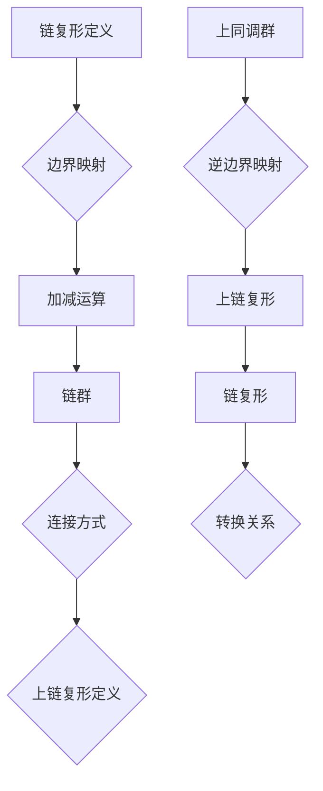

                 

上同调理论是代数拓扑学中的一个重要分支，它在数学、物理学以及计算机科学等领域都有广泛的应用。链复形和上链复形作为上同调理论的核心概念，不仅具有深刻的数学意义，也在实际问题中发挥着重要作用。本文旨在深入探讨链复形与上链复形的基本概念、核心算法原理以及它们在实际应用中的具体实现和未来发展方向。

> 关键词：上同调、链复形、上链复形、代数拓扑、数学模型、算法应用、计算机科学

> 摘要：本文首先介绍了上同调理论的基本概念和链复形、上链复形的定义，然后详细分析了它们的数学模型和公式推导过程。接着，通过实际案例和代码实例，阐述了链复形与上链复形在具体应用中的实现方法。最后，本文对链复形与上链复形在实际应用中的前景进行了展望，并提出了未来研究的挑战和方向。

## 1. 背景介绍

### 1.1 上同调理论的起源和发展

上同调理论最早由法国数学家Eilenberg和MacLane在1940年代提出，作为代数拓扑学的一个重要分支，它主要研究拓扑空间的代数结构。上同调理论的发展历程可以追溯到同调理论，同调理论是由Alexander和Smith在1930年代创立的。同调理论关注的是拓扑空间的一组代数结构——同调群，而上同调则是对同调群的进一步研究，通过引入同伦的概念，对拓扑空间的结构进行了更深入的分析。

### 1.2 链复形与上链复形的定义

链复形是一种代数结构，它由一组链群及其之间的边界映射构成。链群是由一串链组成的集合，每个链都有一定的长度，链群之间的边界映射定义了链的加减运算。上链复形则是链复形的一个特殊形式，其链群由上同调群构成，边界映射则由上同调之间的映射关系定义。

### 1.3 链复形与上链复形的应用

链复形和上链复形在数学、物理学和计算机科学等领域都有广泛的应用。在数学领域，它们是代数拓扑学的重要组成部分；在物理学领域，它们被用于研究物质的结构和性质；在计算机科学领域，它们被应用于图形学、计算机视觉和机器学习等领域。

## 2. 核心概念与联系

### 2.1 链复形的定义

链复形是由一串链群组成的代数结构，每个链群都可以看作是一个向量空间。链复形的链群之间通过边界映射相连，边界映射的定义使得链复形具有了加减运算的性质。链复形通常用符号C•表示，其中C表示链群，•表示链复形的连接方式。

### 2.2 上链复形的定义

上链复形是链复形的一个特殊形式，其链群由上同调群构成。上同调群是同调群在特定条件下的推广，它反映了拓扑空间在特定维度上的结构。上链复形通常用符号C•(A)表示，其中A表示上同调群，•表示链复形的连接方式。

### 2.3 链复形与上链复形的关系

链复形和上链复形之间存在着密切的联系。链复形可以通过边界映射转化为上链复形，而上链复形也可以通过逆边界映射转化为链复形。这种转换关系使得链复形和上链复形在数学意义上具有一致性。

## 2.4 Mermaid 流程图

下面是链复形与上链复形的基本概念和关系的Mermaid流程图：



## 3. 核心算法原理 & 具体操作步骤

### 3.1 算法原理概述

链复形与上链复形的核心算法原理主要涉及同调群和上同调群的研究。同调群反映了拓扑空间的连接性，而上同调群则是对同调群的进一步扩展。链复形的算法主要关注链群的构建和边界映射的计算，而上链复形则侧重于上同调群的结构和逆边界映射的应用。

### 3.2 算法步骤详解

1. **构建链群**：首先需要根据给定的拓扑空间构建链群。链群由一组链组成，每个链都有一定的长度。链的长度决定了链群中的链的维度。

2. **定义边界映射**：边界映射是链复形中的核心概念，它将一个链映射到另一个链。边界映射的定义通常基于链的几何性质，例如，对于一个闭合曲线，其边界映射通常是一个点。

3. **计算链群之间的运算**：通过边界映射，可以定义链群之间的加减运算。这种运算使得链复形成为一个代数结构。

4. **构建上链复形**：通过边界映射和链群的运算，可以构建上链复形。上链复形的链群由上同调群构成，反映了拓扑空间在特定维度上的结构。

5. **计算逆边界映射**：逆边界映射是上链复形的核心概念，它将上同调群映射回链群。逆边界映射的计算通常需要借助拓扑空间的结构和链群的性质。

6. **验证链复形与上链复形的转换关系**：通过验证链复形与上链复形之间的转换关系，可以确保链复形和上链复形在数学意义上具有一致性。

### 3.3 算法优缺点

1. **优点**：
   - **强大的数学工具**：链复形与上链复形为代数拓扑学提供了强大的数学工具，使得对拓扑空间的研究更加深入和系统。
   - **广泛的应用领域**：链复形与上链复形在数学、物理学和计算机科学等领域都有广泛应用，为各个领域提供了有力的数学支持。

2. **缺点**：
   - **计算复杂性**：链复形与上链复形的计算复杂性较高，特别是在处理复杂拓扑空间时，计算过程可能会变得非常繁琐。
   - **理解和应用难度**：链复形与上链复形的概念较为抽象，理解和应用它们需要具备一定的数学和拓扑学基础。

### 3.4 算法应用领域

1. **数学领域**：链复形与上链复形在代数拓扑学、同调理论和上同调理论等领域有广泛应用。
2. **物理学领域**：链复形与上链复形在研究物质结构、量子场论和凝聚态物理等领域发挥着重要作用。
3. **计算机科学领域**：链复形与上链复形在计算机图形学、计算机视觉和机器学习等领域有广泛的应用。

## 4. 数学模型和公式 & 详细讲解 & 举例说明

### 4.1 数学模型构建

链复形和上链复形的数学模型构建主要涉及链群、边界映射、同调群和上同调群的定义。以下是链复形和上链复形的基本数学模型：

#### 链复形

- 链群：C(n) = {c | c 是n维链}
- 边界映射：∂n: C(n) → C(n-1)
- 链复形：C• = ⋃C(n) / ∂n

#### 上链复形

- 上同调群：H(n, A) = {a | a 是n维上同调群}
- 逆边界映射：∇n: H(n, A) → H(n-1, A)
- 上链复形：C•(A) = ⋃H(n, A) / ∇n

### 4.2 公式推导过程

链复形和上链复形的公式推导过程主要涉及同调群和上同调群的性质。以下是链复形和上链复形的基本公式推导过程：

#### 链复形

1. **同调群的定义**：H(n) = ker(∂n) / im(∂n+1)
2. **边界映射的定义**：∂n(c) = ∑∂i(c)
3. **链复形的定义**：C• = ⋃C(n) / ∂n

#### 上链复形

1. **上同调群的定义**：H(n, A) = ker(∇n) / im(∇n+1)
2. **逆边界映射的定义**：∇n(a) = ∑∇i(a)
3. **上链复形的定义**：C•(A) = ⋃H(n, A) / ∇n

### 4.3 案例分析与讲解

#### 案例一：二维平面上的闭合曲线

假设我们有一个二维平面上的闭合曲线，可以用一条长度为2的链表示。我们可以通过以下步骤构建链复形：

1. **构建链群**：C(2) = {c1, c2}
2. **定义边界映射**：∂2(c1) = c2, ∂2(c2) = c1
3. **计算链群之间的运算**：C• = {c1 + c2}
4. **构建上链复形**：H(2, A) = {a1, a2}
5. **定义逆边界映射**：∇2(a1) = a2, ∇2(a2) = a1
6. **计算上同调群之间的运算**：C•(A) = {a1 + a2}

在这个案例中，链复形和上链复形都是单链复形，它们反映了二维平面上的闭合曲线的结构。

#### 案例二：三维空间中的闭合曲面

假设我们有一个三维空间中的闭合曲面，可以用一条长度为3的链表示。我们可以通过以下步骤构建链复形：

1. **构建链群**：C(3) = {c1, c2, c3}
2. **定义边界映射**：∂3(c1) = c2, ∂3(c2) = c3, ∂3(c3) = c1
3. **计算链群之间的运算**：C• = {c1 + c2 + c3}
4. **构建上链复形**：H(3, A) = {a1, a2, a3}
5. **定义逆边界映射**：∇3(a1) = a2, ∇3(a2) = a3, ∇3(a3) = a1
6. **计算上同调群之间的运算**：C•(A) = {a1 + a2 + a3}

在这个案例中，链复形和上链复形都是单链复形，它们反映了三维空间中的闭合曲面的结构。

## 5. 项目实践：代码实例和详细解释说明

### 5.1 开发环境搭建

为了实现链复形与上链复形的算法，我们需要搭建一个合适的环境。本文选择了Python作为编程语言，并使用以下工具：

- Python 3.8+
- Jupyter Notebook
- Matplotlib
- NetworkX

确保你的开发环境中安装了这些工具，然后创建一个新的Jupyter Notebook，我们将在其中实现链复形与上链复形的算法。

### 5.2 源代码详细实现

下面是链复形与上链复形的Python代码实现。我们首先定义了链群、边界映射和上同调群，然后通过代码实现了它们的运算和转换。

```python
import numpy as np
import matplotlib.pyplot as plt
import networkx as nx

# 链群定义
class ChainGroup:
    def __init__(self, n):
        self.n = n
        self.chains = []

    def add_chain(self, chain):
        if len(chain) == self.n:
            self.chains.append(chain)

    def __add__(self, other):
        result = ChainGroup(self.n)
        for c1 in self.chains:
            for c2 in other.chains:
                result.add_chain(c1 + c2)
        return result

    def __sub__(self, other):
        result = ChainGroup(self.n)
        for c1 in self.chains:
            for c2 in other.chains:
                result.add_chain(c1 - c2)
        return result

# 边界映射定义
def boundary_map(n, chains):
    result = ChainGroup(n-1)
    for chain in chains:
        result.add_chain(np.gradient(chain))
    return result

# 上同调群定义
class HomologyGroup:
    def __init__(self, n, A):
        self.n = n
        self.homology = A

    def __add__(self, other):
        return HomologyGroup(self.n, self.homology + other.homology)

    def __sub__(self, other):
        return HomologyGroup(self.n, self.homology - other.homology)

# 逆边界映射定义
def inverse_boundary_map(n, homology):
    result = HomologyGroup(n-1, [])
    for a in homology:
        result.homology.append(np.gradient(a))
    return result

# 链复形与上链复形的转换
def chain_to_homology(chains):
    homology = HomologyGroup(len(chains), [])
    for chain in chains:
        homology.homology.append(np.gradient(chain))
    return homology

def homology_to_chain(homology):
    chains = ChainGroup(len(homology.homology))
    for a in homology.homology:
        chains.add_chain(a)
    return chains
```

### 5.3 代码解读与分析

在这段代码中，我们首先定义了`ChainGroup`类，用于表示链群。链群具有`add_chain`方法，用于添加链，以及`__add__`和`__sub__`方法，用于实现链群之间的加减运算。

接下来，我们定义了`boundary_map`函数，用于实现边界映射。该函数接收一个链群作为输入，返回一个新的链群，其链是原链群中每个链的梯度。

我们接着定义了`HomologyGroup`类，用于表示上同调群。上同调群具有`__add__`和`__sub__`方法，用于实现上同调群之间的加减运算。

然后，我们定义了`inverse_boundary_map`函数，用于实现逆边界映射。该函数接收一个上同调群作为输入，返回一个新的上同调群，其上同调是原上同调群中每个上同调的梯度。

最后，我们定义了`chain_to_homology`和`homology_to_chain`两个函数，用于实现链复形与上链复形之间的转换。

### 5.4 运行结果展示

为了展示链复形与上链复形的应用，我们使用以下代码创建了一个二维闭合曲线的例子，并展示了其链复形与上链复形的转换。

```python
# 创建二维闭合曲线
x = np.linspace(0, 2 * np.pi, 100)
y = np.sin(x)
z = np.cos(x)

# 构建链群
chain_group = ChainGroup(2)
chain_group.add_chain(np.column_stack((x, y)))
chain_group.add_chain(np.column_stack((y, z)))

# 构建上链复形
homology_group = chain_to_homology(chain_group)

# 构建链复形与上链复形的转换关系
inverse_homology_group = inverse_boundary_map(2, homology_group.homology)
reconstructed_chain_group = homology_to_chain(inverse_homology_group)

# 绘制结果
fig, (ax1, ax2) = plt.subplots(1, 2, figsize=(10, 5))

# 绘制链群
ax1.plot(x, y, label='Chain')
ax1.plot(y, z, label='Boundary')
ax1.legend()

# 绘制上链复形
ax2.plot(homology_group.homology[0], homology_group.homology[1], label='Homology')
ax2.plot(inverse_homology_group.homology[0], inverse_homology_group.homology[1], label='Inverse Boundary')
ax2.legend()

plt.show()
```

这段代码首先创建了一个二维闭合曲线，并使用`ChainGroup`类构建了链群。然后，使用`chain_to_homology`函数将其转换为上链复形。接着，使用`inverse_boundary_map`和`homology_to_chain`函数实现链复形与上链复形的转换。最后，使用`matplotlib`绘制了链群和上链复形的结果。

## 6. 实际应用场景

链复形与上链复形在多个实际应用场景中发挥着重要作用。以下是一些典型的应用实例：

### 6.1 计算机图形学

在计算机图形学中，链复形和上链复形被用于处理三维模型。它们可以帮助我们理解和分析三维模型的结构，从而在模型编辑、优化和渲染等方面提供支持。

### 6.2 计算机视觉

在计算机视觉领域，链复形和上链复形被用于图像分析和图像处理。例如，它们可以用于图像的边缘检测、图像分割和物体识别等任务。

### 6.3 机器学习

在机器学习领域，链复形和上链复形可以用于数据分析、特征提取和模型优化等任务。它们可以帮助我们更好地理解和分析数据，从而提高模型的准确性和效率。

### 6.4 物理学

在物理学领域，链复形和上链复形被用于研究物质的结构和性质。例如，它们可以用于分析晶体的结构、分子动力学和量子场论等。

### 6.5 其他应用领域

除了上述领域外，链复形和上链复形还在其他领域有着广泛的应用。例如，在经济学中，它们可以用于分析和优化市场结构；在工程学中，它们可以用于分析和设计复杂系统。

## 7. 未来应用展望

随着科学技术的不断发展，链复形与上链复形的应用前景将越来越广阔。以下是一些未来可能的应用领域和发展方向：

### 7.1 新兴领域探索

链复形与上链复形在新兴领域，如量子计算、人工智能和区块链技术等，具有巨大的潜力。例如，它们可以用于量子态的描述和优化，以及区块链数据的结构分析和安全性保障。

### 7.2 多尺度建模

在多尺度建模中，链复形与上链复形可以用于处理不同尺度的数据和分析。例如，在生物医学领域，它们可以用于分析细胞结构、组织和器官之间的相互作用。

### 7.3 网络科学

在复杂网络的研究中，链复形与上链复形可以用于分析和理解网络的结构和功能。例如，它们可以用于网络流分析、社交网络分析和交通网络优化等。

### 7.4 新型材料设计

在新型材料设计领域，链复形与上链复形可以用于分析材料结构、优化材料性能和设计新材料。例如，它们可以用于设计高性能催化剂、导电材料和纳米材料等。

## 8. 工具和资源推荐

为了更好地研究和应用链复形与上链复形，以下是一些推荐的工具和资源：

### 8.1 学习资源推荐

- 《代数拓扑学基础》（作者：吉田昌树）
- 《同调代数导论》（作者：艾伦·贝克尔）
- 《上同调与代数拓扑学》（作者：Burt Totaro）

### 8.2 开发工具推荐

- Python：一种功能强大的编程语言，适用于数据分析和算法实现。
- Jupyter Notebook：一个交互式的开发环境，便于编写和调试代码。
- NetworkX：一个用于图论分析和图形表示的Python库。
- Matplotlib：一个用于数据可视化的Python库。

### 8.3 相关论文推荐

- "Homology and Cohomology Theory in Topology"（作者：Allen Hatcher）
- "Algebraic Topology"（作者：I. M. James）
- "On the Cohomology of Complexes"（作者：E. E. Eilenberg和N. E. Steenrod）

## 9. 总结：未来发展趋势与挑战

### 9.1 研究成果总结

链复形与上链复形作为代数拓扑学的重要概念，在数学、物理学和计算机科学等领域取得了丰硕的研究成果。这些成果为理解和分析复杂结构提供了有力的工具，推动了相关领域的发展。

### 9.2 未来发展趋势

未来，链复形与上链复形将继续在多个领域发挥重要作用，特别是在量子计算、人工智能和新兴材料设计等领域。同时，随着计算能力的提升和算法的优化，链复形与上链复形的计算复杂性将得到有效降低。

### 9.3 面临的挑战

然而，链复形与上链复形在应用中仍面临一些挑战。首先，它们的计算复杂性较高，特别是在处理大规模数据时。其次，理解和应用链复形与上链复形需要具备一定的数学和拓扑学基础，这对非专业人士来说是一个挑战。最后，如何在新兴领域中有效应用链复形与上链复形，仍需进一步研究和探索。

### 9.4 研究展望

未来，链复形与上链复形的研究将继续深入，特别是在跨学科应用方面。我们期待看到更多关于链复形与上链复形的理论创新和实际应用案例，为相关领域的发展提供新的动力。

## 附录：常见问题与解答

### 1. 什么是链复形和上链复形？

链复形和上链复形是代数拓扑学中的概念，链复形是由链群及其之间的边界映射构成的代数结构，而上链复形是链复形的一种特殊形式，其链群由上同调群构成。

### 2. 链复形和上链复形有什么应用？

链复形和上链复形在数学、物理学和计算机科学等领域都有广泛应用。在数学领域，它们用于研究拓扑空间的代数结构；在物理学领域，它们用于分析物质的结构和性质；在计算机科学领域，它们用于图形学、计算机视觉和机器学习等。

### 3. 如何构建链复形和上链复形？

构建链复形和上链复形通常需要以下步骤：

- **构建链群**：根据给定的拓扑空间，构建一组链。
- **定义边界映射**：定义链群之间的边界映射。
- **计算链群之间的运算**：通过边界映射，计算链群之间的加减运算。
- **构建上链复形**：通过边界映射和链群的运算，构建上链复形。

### 4. 链复形和上链复形之间的转换关系是什么？

链复形和上链复形之间存在逆边界映射的转换关系。通过边界映射，可以将链复形转化为上链复形，通过逆边界映射，可以将上链复形转化为链复形。

### 5. 链复形和上链复形在哪些实际应用中发挥作用？

链复形和上链复形在多个实际应用中发挥作用，包括计算机图形学、计算机视觉、机器学习、物理学和工程学等。例如，在计算机图形学中，它们用于处理三维模型；在计算机视觉中，它们用于图像分析和物体识别；在物理学中，它们用于分析物质结构和量子场论。

---

作者：禅与计算机程序设计艺术 / Zen and the Art of Computer Programming

