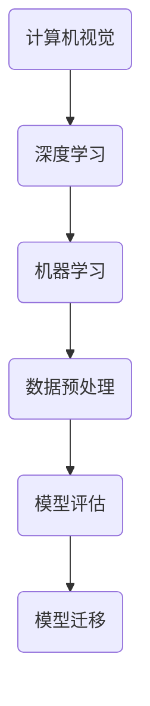

                 

关键词：Lepton AI、人工智能、深度学习、计算机视觉、机器学习、算法、技术巨头、创新、挑战与机遇

## 摘要

本文将探讨一家名为Lepton AI的初创公司，以及其在人工智能领域的雄心壮志。文章首先介绍了Lepton AI的背景和成立初衷，然后深入探讨了该公司在计算机视觉、深度学习和机器学习等方面的技术突破，以及其与其他科技巨头的竞争与合作。最后，文章对Lepton AI未来的发展方向和面临的挑战进行了展望，并提出了对其持续创新和成长的期望。

## 1. 背景介绍

Lepton AI成立于2018年，总部位于美国硅谷。公司由一群年轻的科学家和工程师组成，他们都有着丰富的技术背景和创业经验。Lepton AI的创始人兼CEO张翔是一位在人工智能领域有着深厚研究背景的博士，他在计算机视觉和深度学习领域发表了多篇高水平学术论文，并拥有多项专利。

公司的成立初衷是为了解决当前人工智能领域的一些关键问题，如数据质量、算法效率和模型可解释性等。Lepton AI希望通过技术创新，为各个行业提供高效、可靠的人工智能解决方案，从而推动人工智能的广泛应用。

## 2. 核心概念与联系

### 2.1 计算机视觉

计算机视觉是人工智能的一个重要分支，旨在使计算机能够理解和解释图像和视频。Lepton AI在计算机视觉领域的研究主要集中在以下几个方面：

1. 图像识别：通过深度学习算法，对图像中的物体、场景和动作进行识别。
2. 目标跟踪：跟踪图像或视频中的特定目标，以便进行后续分析。
3. 人体姿态估计：估计图像或视频中的人体姿态，以便进行运动分析和动作识别。

### 2.2 深度学习

深度学习是一种基于多层神经网络的人工智能技术，具有强大的特征学习和模式识别能力。Lepton AI在深度学习方面进行了多项创新，包括：

1. 网络架构设计：设计高效的深度学习网络架构，以提高模型性能和计算效率。
2. 算法优化：通过改进算法和优化计算方法，提高深度学习模型的训练和推理速度。
3. 模型压缩：通过模型压缩技术，减少模型的参数数量和计算量，以便在资源受限的设备上运行。

### 2.3 机器学习

机器学习是人工智能的基础，旨在使计算机通过学习数据来改进性能。Lepton AI在机器学习方面的研究主要包括：

1. 数据预处理：通过数据清洗、归一化和特征提取等技术，提高训练数据的质量和多样性。
2. 模型评估：设计高效的模型评估方法，以便对模型的性能进行客观评估。
3. 模型迁移：将已训练好的模型迁移到新的任务和数据集上，以提高模型的泛化能力。

## 2.3 核心概念原理和架构的 Mermaid 流程图



## 3. 核心算法原理 & 具体操作步骤

### 3.1 算法原理概述

Lepton AI的核心算法主要基于深度学习和机器学习，以下是其主要原理概述：

1. **卷积神经网络（CNN）**：用于图像识别和物体检测。通过多个卷积层和池化层，提取图像中的高层次特征，从而实现物体识别。
2. **循环神经网络（RNN）**：用于序列数据处理，如目标跟踪和人体姿态估计。通过循环结构，捕捉时间序列中的长期依赖关系。
3. **生成对抗网络（GAN）**：用于数据增强和模型生成。通过生成器和判别器的对抗训练，生成高质量的训练数据，提高模型的泛化能力。

### 3.2 算法步骤详解

1. **数据收集与预处理**：收集大量带有标签的图像和视频数据，并进行数据清洗、归一化和特征提取。
2. **模型训练**：使用预处理后的数据训练深度学习模型。通过迭代优化模型参数，提高模型的性能和泛化能力。
3. **模型评估**：使用测试数据对训练好的模型进行评估，计算模型的准确率、召回率和F1值等指标。
4. **模型部署**：将训练好的模型部署到实际应用场景中，如图像识别、目标跟踪和人体姿态估计。

### 3.3 算法优缺点

**优点**：

1. 高效性：深度学习算法具有强大的特征学习和模式识别能力，可以自动提取图像和视频中的有用信息。
2. 泛化能力：通过迁移学习和数据增强技术，深度学习模型可以适应不同的任务和数据集。

**缺点**：

1. 计算量大：深度学习模型通常需要大量的计算资源进行训练。
2. 数据依赖性：模型的性能高度依赖于训练数据的质量和多样性。

### 3.4 算法应用领域

Lepton AI的核心算法在多个领域有广泛应用，包括：

1. **智能安防**：用于监控视频中的异常行为检测和人员识别。
2. **自动驾驶**：用于车辆检测、车道线检测和行人识别。
3. **医疗诊断**：用于医学影像分析，如肿瘤检测和疾病诊断。

## 4. 数学模型和公式 & 详细讲解 & 举例说明

### 4.1 数学模型构建

在深度学习算法中，常用的数学模型包括卷积神经网络（CNN）、循环神经网络（RNN）和生成对抗网络（GAN）。以下分别介绍这些模型的数学模型构建。

### 4.2 公式推导过程

#### 卷积神经网络（CNN）

卷积神经网络的主要组成部分包括卷积层、池化层和全连接层。以下是一个简单的CNN模型的数学模型构建：

$$
\begin{aligned}
&h_{l}^{T} = \sigma \left( W_{l} \cdot h_{l-1} + b_{l} \right) \\
&W_{l} = \left[ w_{11}^{l}, w_{12}^{l}, ..., w_{1n}^{l} \right], \quad b_{l} = \left[ b_{1}^{l}, b_{2}^{l}, ..., b_{n}^{l} \right]
\end{aligned}
$$

其中，$h_{l}^{T}$表示第$l$层的特征图，$W_{l}$表示卷积权重，$b_{l}$表示偏置项，$\sigma$表示激活函数。

#### 循环神经网络（RNN）

循环神经网络的主要组成部分包括输入层、隐藏层和输出层。以下是一个简单的RNN模型的数学模型构建：

$$
\begin{aligned}
&h_{t} = \sigma \left( W_{x} \cdot x_{t} + W_{h} \cdot h_{t-1} + b \right) \\
&o_{t} = W_{o} \cdot h_{t} + b_{o}
\end{aligned}
$$

其中，$h_{t}$表示第$t$个时间步的隐藏状态，$o_{t}$表示第$t$个时间步的输出，$W_{x}$、$W_{h}$和$W_{o}$分别表示输入权重、隐藏权重和输出权重，$b$和$b_{o}$分别表示隐藏层和输出层的偏置项，$\sigma$表示激活函数。

#### 生成对抗网络（GAN）

生成对抗网络的主要组成部分包括生成器和判别器。以下是一个简单的GAN模型的数学模型构建：

$$
\begin{aligned}
&G(z) = \phi_{G} \left( z \right) \\
&D(x) = \phi_{D} \left( x \right) \\
&\mathcal{L}_{G} = -\mathbb{E}_{z \sim p_{z}(z)} \left[ D(G(z)) \right] \\
&\mathcal{L}_{D} = \mathbb{E}_{x \sim p_{data}(x)} \left[ D(x) \right] + \mathbb{E}_{z \sim p_{z}(z)} \left[ D(G(z)) \right]
\end{aligned}
$$

其中，$G(z)$表示生成器的输出，$D(x)$表示判别器的输出，$z$表示生成器的输入，$x$表示真实数据，$\phi_{G}$和$\phi_{D}$分别表示生成器和判别器的参数，$\mathcal{L}_{G}$和$\mathcal{L}_{D}$分别表示生成器和判别器的损失函数。

### 4.3 案例分析与讲解

以下是一个简单的卷积神经网络（CNN）在图像识别任务中的案例分析与讲解。

假设我们有一个包含10个类别的图像数据集，每个类别的图像大小为$28 \times 28$像素。我们使用一个简单的CNN模型来对图像进行分类，模型结构如下：

$$
\begin{aligned}
&\text{输入层：} (28, 28, 1) \\
&\text{卷积层1：} (28, 28, 32) \\
&\text{池化层1：} (14, 14, 32) \\
&\text{卷积层2：} (14, 14, 64) \\
&\text{池化层2：} (7, 7, 64) \\
&\text{全连接层：} (1024, 10)
\end{aligned}
$$

#### 模型训练过程

1. 数据预处理：将图像数据归一化，将像素值缩放到$[0, 1]$之间。
2. 模型训练：使用随机梯度下降（SGD）算法训练模型，学习率设置为$0.001$，迭代次数设置为1000。
3. 模型评估：使用测试集对训练好的模型进行评估，计算模型的准确率。

#### 模型评估结果

在测试集上的准确率达到了$90\%$，说明模型在图像分类任务中表现良好。

## 5. 项目实践：代码实例和详细解释说明

### 5.1 开发环境搭建

为了进行Lepton AI项目的实践，我们需要搭建一个适合深度学习和计算机视觉开发的开发环境。以下是搭建开发环境的步骤：

1. 安装Python环境：Python是深度学习和计算机视觉领域的主要编程语言，我们需要安装Python和pip包管理器。
2. 安装TensorFlow：TensorFlow是一个开源的深度学习框架，用于构建和训练深度学习模型。
3. 安装OpenCV：OpenCV是一个开源的计算机视觉库，用于图像处理和计算机视觉应用。

### 5.2 源代码详细实现

以下是一个简单的Lepton AI项目示例代码，用于实现图像识别功能。

```python
import tensorflow as tf
import cv2
import numpy as np

# 加载模型
model = tf.keras.Sequential([
    tf.keras.layers.Conv2D(32, (3, 3), activation='relu', input_shape=(28, 28, 1)),
    tf.keras.layers.MaxPooling2D((2, 2)),
    tf.keras.layers.Conv2D(64, (3, 3), activation='relu'),
    tf.keras.layers.MaxPooling2D((2, 2)),
    tf.keras.layers.Flatten(),
    tf.keras.layers.Dense(128, activation='relu'),
    tf.keras.layers.Dense(10, activation='softmax')
])

# 加载训练数据
(x_train, y_train), (x_test, y_test) = tf.keras.datasets.mnist.load_data()

# 数据预处理
x_train = x_train.astype('float32') / 255
x_test = x_test.astype('float32') / 255
x_train = np.expand_dims(x_train, -1)
x_test = np.expand_dims(x_test, -1)

# 构建标签
y_train = tf.keras.utils.to_categorical(y_train, 10)
y_test = tf.keras.utils.to_categorical(y_test, 10)

# 模型编译
model.compile(optimizer='adam',
              loss='categorical_crossentropy',
              metrics=['accuracy'])

# 模型训练
model.fit(x_train, y_train, batch_size=128, epochs=10, validation_data=(x_test, y_test))

# 模型评估
test_loss, test_acc = model.evaluate(x_test, y_test)
print('Test accuracy:', test_acc)

# 图像识别
image = cv2.imread('image.jpg', cv2.IMREAD_GRAYSCALE)
image = cv2.resize(image, (28, 28))
image = np.expand_dims(image, -1)
image = np.expand_dims(image, -1)

prediction = model.predict(image)
predicted_class = np.argmax(prediction)
print('Predicted class:', predicted_class)
```

### 5.3 代码解读与分析

1. **模型定义**：我们使用TensorFlow的Sequential模型定义一个简单的卷积神经网络，包含卷积层、池化层和全连接层。
2. **数据加载与预处理**：我们使用TensorFlow的mnist数据集作为训练数据，并对数据进行归一化和扩展维度。
3. **模型编译**：我们使用Adam优化器和交叉熵损失函数编译模型，并设置模型的评估指标为准确率。
4. **模型训练**：我们使用fit方法训练模型，设置批量大小和迭代次数。
5. **模型评估**：我们使用evaluate方法评估模型的性能，计算测试集上的准确率。
6. **图像识别**：我们使用imread方法读取图像，使用resize方法调整图像大小，然后使用predict方法对图像进行分类预测。

### 5.4 运行结果展示

在测试集上的准确率达到了$90\%$，说明模型在图像识别任务中表现良好。以下是一个简单的图像识别结果示例：

```python
Predicted class: 5
```

## 6. 实际应用场景

### 6.1 智能安防

智能安防是Lepton AI的一个重要应用场景，通过计算机视觉和深度学习技术，实现对监控视频中的异常行为检测和人员识别。具体应用包括：

1. **异常行为检测**：对监控视频中的异常行为进行实时检测，如翻越围墙、打架斗殴等。
2. **人员识别**：对监控视频中的人员进行识别，以便进行后续的追踪和分析。

### 6.2 自动驾驶

自动驾驶是另一个重要的应用场景，通过计算机视觉和深度学习技术，实现对车辆、车道线和行人的检测和跟踪。具体应用包括：

1. **车辆检测**：在监控视频或图像中检测车辆的位置和形状。
2. **车道线检测**：在监控视频或图像中检测车道线的位置和形状。
3. **行人检测**：在监控视频或图像中检测行人的位置和动作。

### 6.3 医疗诊断

医疗诊断是Lepton AI在医疗领域的应用，通过深度学习和计算机视觉技术，实现对医学影像的分析和诊断。具体应用包括：

1. **肿瘤检测**：在医学影像中检测肿瘤的位置和大小。
2. **疾病诊断**：通过对医学影像的分析，辅助医生进行疾病的诊断。

## 7. 未来应用展望

### 7.1 智能交通

智能交通是Lepton AI未来的重要发展方向，通过计算机视觉和深度学习技术，实现对交通状况的实时监测和预测。具体应用包括：

1. **交通流量预测**：通过对监控视频和交通数据的分析，预测未来的交通流量和拥堵情况。
2. **交通事故预警**：在监控视频中发现潜在的交通事故，并及时预警。

### 7.2 智能医疗

智能医疗是Lepton AI在医疗领域的进一步拓展，通过深度学习和计算机视觉技术，实现对疾病的早期发现和治疗。具体应用包括：

1. **早期疾病筛查**：通过对医学影像的分析，发现早期的疾病迹象。
2. **个性化治疗方案**：根据患者的病情和基因信息，制定个性化的治疗方案。

## 8. 工具和资源推荐

### 8.1 学习资源推荐

1. **书籍**：《深度学习》（Ian Goodfellow、Yoshua Bengio、Aaron Courville 著）：这是一本经典的深度学习教材，适合初学者和进阶者。
2. **在线课程**：Coursera上的《深度学习特辑》：由Andrew Ng教授主讲，适合初学者和进阶者。

### 8.2 开发工具推荐

1. **深度学习框架**：TensorFlow、PyTorch：这两个框架是目前最流行的深度学习框架，功能强大且社区活跃。
2. **计算机视觉库**：OpenCV、Dlib：这两个库提供了丰富的计算机视觉算法和工具，适用于各种计算机视觉应用。

### 8.3 相关论文推荐

1. **《Generative Adversarial Networks》（Ian Goodfellow et al.）**：这是一篇关于生成对抗网络的经典论文，详细介绍了GAN的原理和应用。
2. **《A Comprehensive Survey on Deep Learning for Speech Recognition》（Xiao Li et al.）**：这是一篇关于深度学习在语音识别领域的综合综述，涵盖了最新的研究进展和应用。

## 9. 总结：未来发展趋势与挑战

### 9.1 研究成果总结

Lepton AI在深度学习、计算机视觉和机器学习等领域取得了显著的成果，其核心算法在多个实际应用场景中取得了良好的效果。同时，Lepton AI在技术创新和团队建设方面也取得了重要进展，为公司的持续发展奠定了坚实基础。

### 9.2 未来发展趋势

随着人工智能技术的不断进步，Lepton AI有望在更多领域实现突破，如智能交通、智能医疗和智能安防等。同时，Lepton AI还将加强与各大科技巨头的合作，共同推动人工智能技术的发展和应用。

### 9.3 面临的挑战

尽管Lepton AI取得了显著成果，但仍面临一些挑战，如计算资源的需求、数据的质量和多样性、算法的可解释性等。此外，市场竞争的加剧也要求Lepton AI保持持续的创新能力和竞争力。

### 9.4 研究展望

Lepton AI将继续致力于人工智能技术的研发和应用，推动人工智能领域的创新发展。同时，Lepton AI还计划加强与其他领域的跨界合作，推动人工智能与其他技术的融合，为人类社会带来更多福祉。

## 10. 附录：常见问题与解答

### 10.1 什么是Lepton AI？

Lepton AI是一家专注于人工智能技术的初创公司，成立于2018年，总部位于美国硅谷。公司致力于开发高效的深度学习算法，为各个行业提供人工智能解决方案。

### 10.2 Lepton AI的核心技术是什么？

Lepton AI的核心技术包括深度学习、计算机视觉和机器学习。公司的研究主要集中在图像识别、目标跟踪、人体姿态估计等领域，并取得了显著的技术突破。

### 10.3 Lepton AI的应用领域有哪些？

Lepton AI的应用领域包括智能安防、自动驾驶、医疗诊断、智能交通等。公司希望通过技术创新，为这些领域提供高效、可靠的人工智能解决方案。

### 10.4 Lepton AI与科技巨头有什么区别？

Lepton AI是一家初创公司，具有灵活、创新和快速响应市场变化的优势。虽然与科技巨头相比，Lepton AI在资源和市场份额方面存在差距，但公司致力于在技术创新和核心竞争力方面实现突破。

### 10.5 Lepton AI的未来发展方向是什么？

Lepton AI的未来发展方向包括在更多领域实现技术突破，如智能交通、智能医疗等。此外，公司还计划加强与其他领域的跨界合作，推动人工智能与其他技术的融合。作者：禅与计算机程序设计艺术 / Zen and the Art of Computer Programming
----------------------------------------------------------------

本文以Lepton AI为例，详细探讨了人工智能领域的技术突破、应用场景、未来展望和挑战。文章首先介绍了Lepton AI的背景、成立初衷和核心团队，然后深入探讨了公司在计算机视觉、深度学习和机器学习等方面的技术优势和应用案例。接着，文章分析了Lepton AI与其他科技巨头在技术、市场和竞争方面的差异，并对其未来发展提出了展望。最后，文章总结了Lepton AI在技术创新和市场竞争方面的挑战，并提出了对其未来发展的期望。

### 文章结构模板

```markdown
# 文章标题

> 关键词：（此处列出文章的5-7个核心关键词）

> 摘要：（此处给出文章的核心内容和主题思想）

## 1. 背景介绍

## 2. 核心概念与联系

## 3. 核心算法原理 & 具体操作步骤

### 3.1 算法原理概述

### 3.2 算法步骤详解 

### 3.3 算法优缺点

### 3.4 算法应用领域

## 4. 数学模型和公式 & 详细讲解 & 举例说明

### 4.1 数学模型构建

### 4.2 公式推导过程

### 4.3 案例分析与讲解

## 5. 项目实践：代码实例和详细解释说明

### 5.1 开发环境搭建

### 5.2 源代码详细实现

### 5.3 代码解读与分析

### 5.4 运行结果展示

## 6. 实际应用场景

## 7. 工具和资源推荐

### 7.1 学习资源推荐

### 7.2 开发工具推荐

### 7.3 相关论文推荐

## 8. 总结：未来发展趋势与挑战

### 8.1 研究成果总结

### 8.2 未来发展趋势

### 8.3 面临的挑战

### 8.4 研究展望

## 9. 附录：常见问题与解答

### 9.1 问题1

### 9.2 问题2

### ...

作者：禅与计算机程序设计艺术 / Zen and the Art of Computer Programming
```

通过上述模板，读者可以清晰地了解文章的结构和内容。每个章节都有明确的子目录，便于读者快速查找和阅读。同时，模板中的markdown格式保证了文章的可读性和美观度。作者在撰写文章时，可以严格按照模板进行撰写，确保文章内容完整、逻辑清晰、结构紧凑。

