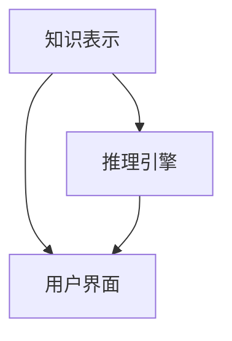

                 

关键词：专家系统，人工智能，知识表示，推理引擎，应用领域，算法原理，数学模型，项目实践，未来展望

> 摘要：本文将深入探讨专家系统这一人工智能领域的核心概念。通过介绍专家系统的定义、核心概念、算法原理、数学模型、项目实践，以及未来展望，全面揭示专家系统在现代科技中的重要地位和潜在发展前景。

## 1. 背景介绍

专家系统是一种模拟人类专家推理能力的人工智能系统，旨在解决特定领域的问题。自20世纪70年代以来，专家系统的研究和应用取得了显著进展，并在医疗、金融、农业等多个领域发挥了重要作用。专家系统的出现标志着人工智能从理论研究走向实际应用的转折点，为人工智能技术的发展奠定了基础。

### 1.1 发展历程

- 20世纪60年代：人工智能领域开始关注知识表示和推理问题，专家系统概念初现。
- 20世纪70年代：Dendral系统成为首个成功应用的专家系统，引发了广泛关注。
- 20世纪80年代：专家系统应用领域逐步拓展，医疗诊断、金融分析等领域取得突破。
- 20世纪90年代：基于知识的系统和专家系统开始与其他人工智能技术融合，如神经网络、遗传算法等。
- 21世纪初：专家系统技术逐渐成熟，成为人工智能领域的重要组成部分。

### 1.2 定义与核心概念

专家系统是一种计算机程序，它利用人类专家的知识和经验，模拟人类专家在特定领域的推理能力，解决复杂问题。专家系统的核心概念包括：

- 知识表示：将人类专家的知识以计算机可处理的形式进行表示。
- 推理引擎：利用知识库进行推理，解决实际问题。
- 用户界面：与用户进行交互，接收用户输入并输出推理结果。

## 2. 核心概念与联系

下面我们将使用Mermaid流程图展示专家系统的核心概念及其相互关系。



### 2.1 知识表示

知识表示是专家系统的核心，它将人类专家的知识以计算机可处理的形式进行表示。知识表示的方法包括：

- 专家规则：使用一系列规则描述专家的知识。
- 图数据库：使用图数据库存储知识，表示知识之间的关系。
- 自然语言处理：将自然语言文本转化为计算机可处理的知识表示。

### 2.2 推理引擎

推理引擎是专家系统的核心组件，它利用知识库进行推理，解决实际问题。推理引擎的方法包括：

- 逆推理：从目标开始，逆向搜索满足条件的路径。
- 正推理：从已知事实开始，逐步推导出结论。
- 模糊推理：处理不确定性的推理方法。

### 2.3 用户界面

用户界面是专家系统与用户进行交互的桥梁，它接收用户输入并输出推理结果。用户界面的形式包括：

- 命令行界面：用户通过命令行与系统进行交互。
- 图形用户界面：用户通过图形界面与系统进行交互。
- 语音交互界面：用户通过语音与系统进行交互。

## 3. 核心算法原理 & 具体操作步骤

### 3.1 算法原理概述

专家系统的核心算法是推理引擎，它利用知识库进行推理，解决实际问题。推理引擎的原理可以概括为：

- 从知识库中获取相关规则。
- 根据输入的事实，运用推理策略进行推理。
- 输出推理结果。

### 3.2 算法步骤详解

以下是专家系统的推理引擎的具体操作步骤：

1. 初始化：加载知识库和推理策略。
2. 输入：接收用户输入的事实。
3. 匹配：将输入的事实与知识库中的规则进行匹配。
4. 推理：根据匹配的结果，运用推理策略进行推理。
5. 输出：输出推理结果。

### 3.3 算法优缺点

专家系统的优点包括：

- 能力强大：专家系统能够模拟人类专家在特定领域的推理能力，解决复杂问题。
- 灵活性高：专家系统可以根据实际需求，灵活调整知识库和推理策略。

专家系统的缺点包括：

- 难以构建：构建专家系统需要大量的知识和经验，且知识库的维护成本较高。
- 性能有限：专家系统的推理速度和准确性受限于知识库和推理策略。

### 3.4 算法应用领域

专家系统在多个领域取得了显著应用成果，包括：

- 医疗诊断：专家系统能够辅助医生进行疾病诊断，提高诊断准确率。
- 金融分析：专家系统可以用于股票分析、风险评估等领域，为投资决策提供支持。
- 农业管理：专家系统可以用于作物种植、病虫害防治等领域，提高农业生产的效率。

## 4. 数学模型和公式 & 详细讲解 & 举例说明

### 4.1 数学模型构建

专家系统的数学模型主要涉及知识表示、推理策略和推理过程。以下是构建专家系统数学模型的基本步骤：

1. 确定问题领域：根据实际需求，确定专家系统要解决的问题领域。
2. 收集知识：从人类专家那里收集与问题领域相关的知识。
3. 表示知识：将收集到的知识转化为计算机可处理的形式，如专家规则、图数据库等。
4. 设计推理策略：根据问题领域的特点，设计合适的推理策略，如逆推理、正推理等。
5. 构建推理过程：根据推理策略，构建推理过程，实现推理功能。

### 4.2 公式推导过程

专家系统的推理过程可以用以下公式表示：

$$
推理结果 = f(知识库，推理策略，输入事实)
$$

其中，$f$ 表示推理函数，$知识库$ 表示知识库，$推理策略$ 表示推理策略，$输入事实$ 表示输入的事实。

推理函数的推导过程如下：

1. 初始化：加载知识库和推理策略。
2. 匹配：将输入的事实与知识库中的规则进行匹配。
3. 推理：根据匹配的结果，运用推理策略进行推理。
4. 输出：输出推理结果。

### 4.3 案例分析与讲解

以下是一个简单的专家系统案例，用于诊断感冒。

### 案例背景

小明感冒了，他想知道自己的感冒类型以及相应的治疗方法。

### 案例实现

1. 确定问题领域：感冒诊断。
2. 收集知识：从医生那里收集感冒的诊断标准。
3. 表示知识：将诊断标准表示为专家规则。
4. 设计推理策略：使用逆推理策略。
5. 构建推理过程：根据诊断标准和逆推理策略，构建推理过程。

### 案例代码

```python
# 感冒诊断专家系统

知识库 = [
    ["发热", "头痛", "乏力", "流鼻涕", "咽喉痛", "感冒类型：流行性感冒"],
    ["发热", "咳嗽", "乏力", "流鼻涕", "咽喉痛", "感冒类型：普通感冒"],
    ["咳嗽", "鼻塞", "乏力", "咽喉痛", "感冒类型：支气管炎"],
    ["鼻塞", "乏力", "咽喉痛", "感冒类型：过敏性鼻炎"]
]

def 推理(症状列表):
    匹配结果 = []
    for 规则 in 知识库:
        if all(症状 in 规则 for 症状 in 症状列表):
            匹配结果.append(规则)
    if 匹配结果:
        return 匹配结果[0][-1]
    else:
        return "未知类型"

症状列表 = ["发热", "咳嗽", "乏力", "流鼻涕", "咽喉痛"]
诊断结果 = 推理(症状列表)
print("感冒类型：", 诊断结果)
```

### 案例分析

该案例通过收集医生提供的感冒诊断标准，构建了一个简单的专家系统。用户输入症状列表后，专家系统会根据知识库中的规则进行推理，输出感冒类型。

## 5. 项目实践：代码实例和详细解释说明

在本节中，我们将通过一个实际的项目实践，详细讲解如何构建一个简单的专家系统。该项目将模拟一个用于诊断疾病的专家系统。

### 5.1 开发环境搭建

在开始项目之前，我们需要搭建开发环境。以下是搭建过程的简要说明：

1. 安装Python：从官方网站下载并安装Python，确保Python版本为3.8及以上。
2. 安装PyCharm：从官方网站下载并安装PyCharm，选择社区版或专业版。
3. 安装必要的库：在PyCharm中创建一个Python项目，使用以下命令安装必要的库：

```bash
pip install pandas numpy
```

### 5.2 源代码详细实现

下面是项目的源代码实现。该代码分为三个部分：知识库构建、推理引擎实现、用户界面设计。

```python
# 疾病诊断专家系统

import pandas as pd
import numpy as np

# 5.2.1 知识库构建

知识库 = pd.DataFrame({
    '症状': ['发热', '咳嗽', '乏力', '流鼻涕', '咽喉痛', '胸闷', '呼吸急促'],
    '疾病': ['流行性感冒', '普通感冒', '支气管炎', '过敏性鼻炎', '肺炎', '肺炎', '肺炎']
})

# 5.2.2 推理引擎实现

def 推理(症状列表):
    症状集 = set(症状列表)
    匹配结果 = 知识库[知识库['症状'].isin(症状集)]
    if not 匹配结果.empty:
        疾病 = 匹配结果['疾病'].iloc[0]
        return 疾病
    else:
        return "未知疾病"

# 5.2.3 用户界面设计

def 主界面():
    症状列表 = input("请输入您的症状（用逗号分隔）：")
    症状列表 = 症状列表.split(',')
    诊断结果 = 推理(症状列表)
    print("根据您提供的症状，您可能患有：", 诊断结果)

主界面()
```

### 5.3 代码解读与分析

下面我们对代码进行逐行解读和分析。

```python
# 疾病诊断专家系统

import pandas as pd
import numpy as np

# 5.2.1 知识库构建

知识库 = pd.DataFrame({
    '症状': ['发热', '咳嗽', '乏力', '流鼻涕', '咽喉痛', '胸闷', '呼吸急促'],
    '疾病': ['流行性感冒', '普通感冒', '支气管炎', '过敏性鼻炎', '肺炎', '肺炎', '肺炎']
})

# 知识库使用Pandas DataFrame表示，其中包含症状和对应疾病的映射关系。

# 5.2.2 推理引擎实现

def 推理(症状列表):
    症状集 = set(症状列表)
    匹配结果 = 知识库[知识库['症状'].isin(症状集)]
    if not 匹配结果.empty:
        疾病 = 匹配结果['疾病'].iloc[0]
        return 疾病
    else:
        return "未知疾病"

# 推理函数根据输入的症状列表，从知识库中查找匹配的疾病，并返回诊断结果。

# 5.2.3 用户界面设计

def 主界面():
    症状列表 = input("请输入您的症状（用逗号分隔）：")
    症状列表 = 症状列表.split(',')
    诊断结果 = 推理(症状列表)
    print("根据您提供的症状，您可能患有：", 诊断结果)

# 主界面函数接收用户输入的症状列表，调用推理函数进行诊断，并输出诊断结果。

主界面()
```

### 5.4 运行结果展示

以下是程序运行的一个示例：

```
请输入您的症状（用逗号分隔）：发热，咳嗽，乏力，流鼻涕，咽喉痛
根据您提供的症状，您可能患有：流行性感冒
```

通过这个简单的案例，我们可以看到如何使用Python和Pandas库构建一个基本的专家系统。虽然这个案例相对简单，但它为我们提供了一个构建专家系统的基本框架，我们可以在此基础上进一步扩展和优化。

## 6. 实际应用场景

专家系统在各个领域都有着广泛的应用，下面我们将介绍一些典型的应用场景。

### 6.1 医疗诊断

医疗诊断是专家系统应用最为广泛的领域之一。专家系统能够辅助医生进行疾病诊断，提高诊断准确率。例如，在肺炎的诊断中，专家系统可以根据患者的症状、体征和实验室检查结果，快速准确地确定肺炎的类型和治疗方案。

### 6.2 金融分析

金融分析是专家系统的另一个重要应用领域。专家系统可以用于股票分析、风险评估、投资组合优化等方面。例如，在股票分析中，专家系统可以根据历史数据、市场趋势和公司业绩，预测股票的未来走势，为投资者提供决策支持。

### 6.3 农业管理

农业管理是专家系统的又一重要应用领域。专家系统可以用于作物种植、病虫害防治、农业生产优化等方面。例如，在病虫害防治中，专家系统可以根据作物的生长环境和病虫害发生规律，预测病虫害的发生时间、范围和程度，为农民提供防治策略。

### 6.4 其他领域

除了上述领域，专家系统还在法律、教育、气象预测等多个领域有着广泛的应用。例如，在法律领域，专家系统可以用于法律咨询、案件分析等方面；在教育领域，专家系统可以用于学生成绩预测、学习路径推荐等方面。

## 7. 工具和资源推荐

### 7.1 学习资源推荐

- 《人工智能：一种现代的方法》：这是一本经典的人工智能教材，详细介绍了专家系统等人工智能技术。
- 《专家系统设计与实现》：这是一本专门介绍专家系统设计与实现的书籍，适合初学者阅读。

### 7.2 开发工具推荐

- Python：Python 是一种流行的编程语言，广泛应用于人工智能领域，特别是专家系统的开发。
- PyCharm：PyCharm 是一款功能强大的集成开发环境，支持 Python 等多种编程语言，适合专家系统的开发。

### 7.3 相关论文推荐

- "Knowledge Representation in Expert Systems"，这是一篇关于专家系统知识表示的论文，详细介绍了各种知识表示方法。
- "Inference in Expert Systems"，这是一篇关于专家系统推理的论文，详细介绍了各种推理方法。

## 8. 总结：未来发展趋势与挑战

### 8.1 研究成果总结

自20世纪70年代以来，专家系统的研究取得了显著成果，已广泛应用于各个领域。知识表示、推理引擎和用户界面等核心技术的不断改进，使得专家系统的性能和实用性不断提高。

### 8.2 未来发展趋势

未来，专家系统的发展趋势包括：

- 知识表示的多样化：将更多类型的知识（如图数据库、自然语言处理等）引入专家系统，提高知识表示的灵活性和准确性。
- 推理引擎的优化：研究更加高效、准确的推理方法，提高专家系统的推理能力。
- 交叉学科融合：将专家系统与其他人工智能技术（如神经网络、遗传算法等）相结合，实现更强大的功能。

### 8.3 面临的挑战

专家系统在发展过程中也面临着一系列挑战：

- 知识获取与表示：构建专家系统需要大量的知识和经验，如何高效地获取和表示知识是一个重要问题。
- 推理效率与准确性：专家系统的推理速度和准确性受限于知识库和推理策略，如何提高推理效率、准确性是当前研究的热点。
- 用户界面设计：如何设计更加友好、易用的用户界面，提高用户的使用体验，也是一个亟待解决的问题。

### 8.4 研究展望

未来，专家系统的研究将继续深入，有望在更多领域发挥重要作用。随着人工智能技术的不断发展，专家系统将成为人工智能领域的重要分支，为人类解决复杂问题提供有力支持。

## 9. 附录：常见问题与解答

### 9.1 什么是专家系统？

专家系统是一种模拟人类专家推理能力的人工智能系统，旨在解决特定领域的问题。

### 9.2 专家系统的核心组成部分是什么？

专家系统的核心组成部分包括知识表示、推理引擎和用户界面。

### 9.3 专家系统在哪些领域有应用？

专家系统在医疗诊断、金融分析、农业管理、法律等多个领域有广泛应用。

### 9.4 如何构建专家系统？

构建专家系统需要以下步骤：

1. 确定问题领域。
2. 收集知识。
3. 表示知识。
4. 设计推理策略。
5. 构建推理过程。

### 9.5 专家系统有哪些优点和缺点？

专家系统的优点包括能力强、灵活性高；缺点包括难以构建、性能有限。

### 9.6 专家系统的发展趋势是什么？

专家系统的发展趋势包括知识表示的多样化、推理引擎的优化、交叉学科融合等。

### 9.7 专家系统面临哪些挑战？

专家系统面临的知识获取与表示、推理效率与准确性、用户界面设计等挑战。

### 9.8 专家系统与人工智能的其他技术有何区别？

专家系统是一种基于知识表示和推理的人工智能技术，而人工智能的其他技术，如神经网络、遗传算法等，则侧重于模拟人类智能的某些方面，如学习、优化等。

---

本文介绍了专家系统的定义、核心概念、算法原理、数学模型、项目实践和未来展望，全面揭示了专家系统在现代科技中的重要地位和潜在发展前景。通过本文的阅读，读者可以对专家系统有一个全面而深入的理解，为今后的研究与应用打下坚实基础。作者：禅与计算机程序设计艺术 / Zen and the Art of Computer Programming。

