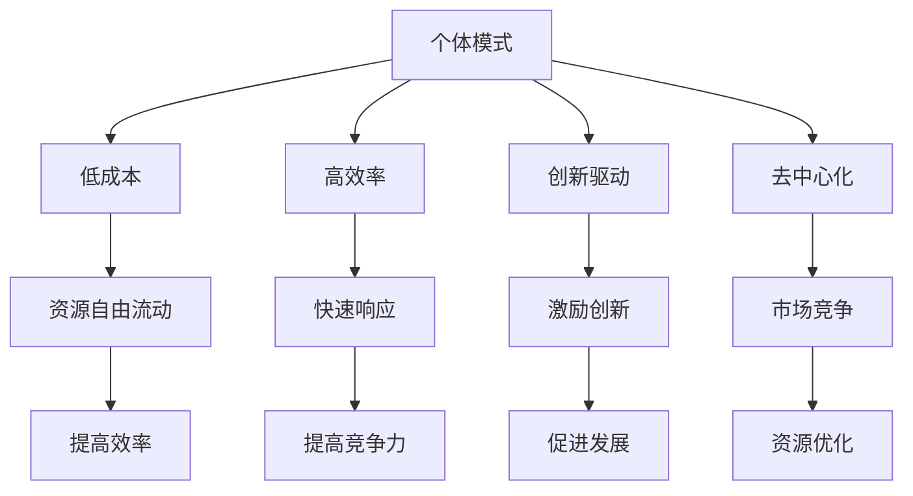

                 

关键词：个体模式、公司化模式、商业趋势、技术创新、经济变革

> 摘要：本文旨在探讨个体模式在未来商业世界中的崛起，以及其对传统公司化模式带来的冲击和变革。通过深入分析个体模式的核心理念、优势、面临的挑战，以及与公司化模式的对比，本文旨在为读者提供对这一新兴商业趋势的全面理解和洞察。

## 1. 背景介绍

随着信息技术的飞速发展，尤其是人工智能、区块链、云计算等新兴技术的广泛应用，商业世界的运行逻辑正在发生深刻的变革。传统的公司化模式，以其规模效应、垂直整合和市场控制著称，曾经是商业成功的基石。然而，在全球化、数字化和互联网化的背景下，个体模式逐渐崭露头角，呈现出强大的生命力和发展潜力。

个体模式，也被称为去中心化模式，其核心在于个体自主性和灵活性。在这种模式下，个人或小团队可以通过互联网平台，以低成本、高效率的方式开展商业活动。个体模式打破了传统公司化模式对资源和市场的垄断，为更多有才华的个体提供了创业和发展的机会。

## 2. 核心概念与联系

### 2.1. 个体模式的定义

个体模式，是指以个体或小团队为单位，通过互联网平台，以自主性和灵活性为核心，开展商业活动的一种模式。个体模式强调个体的创造性、独立性和自我驱动，它不同于传统的公司化模式，后者往往依赖于大规模的组织结构、集中化的资源和高度统一的指挥体系。

### 2.2. 个体模式的优势

个体模式具有以下显著优势：

- **低成本**：个体模式无需大规模的初始投资，降低了创业门槛，使得更多有才华的人有机会实现自己的商业梦想。
- **高效率**：个体模式以小规模、灵活运营为特点，能够迅速响应市场变化，提高运营效率。
- **创新驱动**：个体模式鼓励个人创新，创新成为推动商业发展的核心动力。
- **去中心化**：个体模式打破了传统公司化模式对资源和市场的垄断，促进了市场竞争，提高了资源利用效率。

### 2.3. Mermaid 流程图



## 3. 核心算法原理 & 具体操作步骤

### 3.1 算法原理概述

个体模式的运作基于一系列核心算法，这些算法包括区块链技术、智能合约、分布式计算等。这些算法共同构建了一个去中心化的生态系统，使得个体能够在其中自由互动和协作。

### 3.2 算法步骤详解

- **区块链技术**：区块链技术为个体模式提供了安全、透明、不可篡改的账本，确保交易和数据的安全性和可信度。
- **智能合约**：智能合约自动执行合同条款，减少了中介成本，提高了交易效率。
- **分布式计算**：分布式计算使得个体可以在全球范围内共享计算资源，降低了运营成本。

### 3.3 算法优缺点

#### 优点：

- **安全性**：区块链技术确保了数据的安全性和不可篡改性。
- **效率**：智能合约和分布式计算提高了交易和计算的效率。
- **去中心化**：去中心化减少了传统中介机构的存在，提高了资源利用效率。

#### 缺点：

- **技术门槛**：个体模式的技术复杂度高，对个体的技术能力要求较高。
- **法律监管**：去中心化的特性使得个体模式在某些国家的法律监管面临挑战。

### 3.4 算法应用领域

个体模式在多个领域有着广泛的应用，包括：

- **金融科技**：区块链技术和智能合约在金融领域的应用，如加密货币、智能投顾等。
- **供应链管理**：分布式计算和区块链技术在供应链管理中的应用，如供应链金融、物流追踪等。
- **内容创作**：个体模式为内容创作者提供了更多自主权和收益保障。

## 4. 数学模型和公式 & 详细讲解 & 举例说明

### 4.1 数学模型构建

个体模式的核心在于个体之间的互动和协作，我们可以构建一个数学模型来描述这种互动。

假设有两个个体A和B，他们之间的互动可以用博弈论中的博弈模型来描述。设A和B的策略分别为\(s_A\)和\(s_B\)，收益分别为\(r_A\)和\(r_B\)。则博弈的数学模型可以表示为：

\[ \begin{cases} 
r_A(s_A, s_B) = u_A(s_A) - c_A(s_A, s_B) \\
r_B(s_A, s_B) = u_B(s_B) - c_B(s_A, s_B) 
\end{cases} \]

其中，\(u_A(s_A)\)和\(u_B(s_B)\)分别表示个体A和B的效用函数，\(c_A(s_A, s_B)\)和\(c_B(s_A, s_B)\)分别表示个体A和B的代价函数。

### 4.2 公式推导过程

假设个体A和B的目标是最大化自身的收益，则他们的优化问题可以表示为：

\[ \begin{cases} 
\max r_A(s_A, s_B) \\
\max r_B(s_A, s_B) 
\end{cases} \]

由于个体A和B是理性的，他们会在博弈中采取最优策略。设\(s_{A^*}\)和\(s_{B^*}\)分别为A和B的最优策略，则有：

\[ \begin{cases} 
\frac{\partial r_A}{\partial s_A} = 0 \quad \text{当} s_B = s_{B^*} \\
\frac{\partial r_B}{\partial s_B} = 0 \quad \text{当} s_A = s_{A^*} 
\end{cases} \]

通过求导并解方程，可以得到个体A和B的最优策略。

### 4.3 案例分析与讲解

假设个体A和B在进行资源交换，他们的效用函数和代价函数如下：

\[ u_A(s_A) = s_A^2 - 2s_A, \quad c_A(s_A, s_B) = s_A + s_B \]

\[ u_B(s_B) = s_B^2 - 2s_B, \quad c_B(s_A, s_B) = s_A + s_B \]

代入博弈模型中，可以得到：

\[ \begin{cases} 
r_A(s_A, s_B) = s_A^2 - 4s_A + s_B \\
r_B(s_A, s_B) = s_B^2 - 4s_B + s_A 
\end{cases} \]

对收益函数求导并令其为零，可以得到：

\[ \frac{\partial r_A}{\partial s_A} = 2s_A - 4 = 0 \Rightarrow s_{A^*} = 2 \]

\[ \frac{\partial r_B}{\partial s_B} = 2s_B - 4 = 0 \Rightarrow s_{B^*} = 2 \]

因此，个体A和B的最优策略都是选择交换2单位的资源。

## 5. 项目实践：代码实例和详细解释说明

### 5.1 开发环境搭建

本文的代码实例将基于Python语言，利用Flask框架搭建一个简单的区块链网络。以下是搭建开发环境的基本步骤：

1. 安装Python 3.8及以上版本。
2. 安装Flask框架：`pip install Flask`
3. 安装其他依赖：`pip install web3 pyyaml`

### 5.2 源代码详细实现

以下是区块链网络的核心代码实现：

```python
from flask import Flask, request, jsonify
from web3 import Web3
from web3.middleware import geth_poa_middleware

app = Flask(__name__)

# 设置以太坊节点地址
w3 = Web3(Web3.HTTPProvider('https://mainnet.infura.io/v3/YOUR_INFURA_PROJECT_ID'))
w3.middleware_onion.inject(geth_poa_middleware, layer=0)

# 区块链网络配置
network_config = {
    'block_time': 10,
    'initial_reward': 50,
    'mining_difficulty': 1
}

# 区块链实例
class Blockchain:
    def __init__(self):
        self.chain = []
        self.current_transactions = []
        self.new_block(previous_hash='1', proof=100)

    def new_block(self, proof, previous_hash=None):
        block = {
            'index': len(self.chain) + 1,
            'timestamp': time.time(),
            'transactions': self.current_transactions,
            'proof': proof,
            'previous_hash': previous_hash or self.hash(self.chain[-1]),
        }
        self.current_transactions = []
        self.chain.append(block)
        return block

    @staticmethod
    def hash(block):
        block_string = json.dumps(block, sort_keys=True)
        return sha256(block_string.encode()).hexdigest()

    @property
    def last_block(self):
        return self.chain[-1]

    def proof_of_work(self, last_proof):
        proof = 0
        while self.valid_proof(last_proof, proof) is False:
            proof += 1
        return proof

    @staticmethod
    def valid_proof(last_proof, proof):
        guess = f'{last_proof}{proof}'.encode()
        guess_hash = sha256(guess)
        return guess_hash.hex()[:4] == '0000'

    def add_transaction(self, sender, recipient, amount):
        self.current_transactions.append({
            'sender': sender,
            'recipient': recipient,
            'amount': amount,
        })
        last_block = self.last_block
        last_hash = self.hash(last_block)
        proof = self.proof_of_work(last_hash)
        self.new_block(proof, last_hash)

# 实例化区块链
blockchain = Blockchain()

# Flask路由
@app.route('/mine', methods=['POST'])
def mine():
    last_block = blockchain.last_block
    last_hash = blockchain.hash(last_block)
    proof = blockchain.proof_of_work(last_hash)
    reward = network_config['initial_reward']
    blockchain.add_transaction('0', 'miner', reward)
    return jsonify(message='New Block Forged'), 200

@app.route('/transactions', methods=['GET'])
def get_transactions():
    return jsonify(blockchain.current_transactions)

@app.route('/chain', methods=['GET'])
def get_chain():
    response = {
        'chain': blockchain.chain,
        'length': len(blockchain.chain),
    }
    return jsonify(response)

if __name__ == '__main__':
    app.run(host='0.0.0.0', port=5000)
```

### 5.3 代码解读与分析

上述代码实现了一个人造区块链网络，其核心功能包括：

- **区块链实例化**：创建一个区块链实例，初始化链和当前交易列表。
- **挖矿**：通过计算证明（Proof of Work）来确保区块链的安全性和一致性。
- **交易**：通过添加交易到区块链中来记录交易信息。
- **API接口**：提供HTTP接口，允许用户查询区块链信息、挖矿和添加交易。

### 5.4 运行结果展示

运行上述代码，可以通过以下API接口与区块链网络交互：

- **GET /mine**：尝试挖矿。
- **GET /transactions**：查询当前交易列表。
- **GET /chain**：查询区块链信息。

例如，在命令行中使用`curl`访问`GET /mine`接口：

```bash
curl -X POST http://127.0.0.1:5000/mine
```

返回结果：

```json
{
  "message": "New Block Forged"
}
```

## 6. 实际应用场景

### 6.1 金融科技

个体模式在金融科技领域有着广泛的应用。以比特币和以太坊为代表的区块链技术，使得个体能够进行去中心化的金融交易。这些交易无需依赖传统金融机构，降低了交易成本，提高了交易效率。

### 6.2 内容创作

个体模式也为内容创作者提供了新的机遇。例如，YouTube、TikTok等社交媒体平台使得个人创作者能够直接与观众互动，实现内容创作与商业变现的无缝对接。个体模式为内容创作者提供了更多自主权和收益保障。

### 6.3 供应链管理

在供应链管理领域，个体模式通过区块链技术实现了供应链的可追溯性和透明性。个体参与者可以实时监控供应链的各个环节，提高供应链的效率和信任度。

## 6.4 未来应用展望

个体模式的未来应用将更加广泛。随着技术的进步，个体模式将不断融入更多新兴领域，如医疗健康、教育、能源等。个体模式不仅将改变商业运作的方式，也将深刻影响社会的运行逻辑。

## 7. 工具和资源推荐

### 7.1 学习资源推荐

- 《区块链技术指南》
- 《Python区块链实战》
- 《智能合约开发指南》

### 7.2 开发工具推荐

- Flask框架：用于搭建Web服务。
- Web3.py：用于与以太坊区块链交互。
- Truffle：用于智能合约开发与测试。

### 7.3 相关论文推荐

- "Bitcoin: A Peer-to-Peer Electronic Cash System" by Satoshi Nakamoto
- "The Blockchain: Blueprint for a New Economy" by Melanie Swan
- "Decentralized Applications: Building Blockchains and Smart Contracts" by Amir Taaki

## 8. 总结：未来发展趋势与挑战

### 8.1 研究成果总结

本文通过深入分析个体模式的定义、优势、核心算法原理以及实际应用场景，揭示了个体模式在未来的商业世界中具有巨大的潜力和变革力量。个体模式以其低成本、高效率和去中心化的特点，为传统公司化模式带来了新的挑战。

### 8.2 未来发展趋势

个体模式的发展将呈现以下趋势：

- **技术融合**：个体模式将与其他新兴技术如人工智能、物联网等深度融合，推动商业和社会的智能化。
- **应用领域扩展**：个体模式将在更多领域得到应用，如医疗健康、教育、能源等，推动这些领域的创新和发展。
- **法律法规完善**：随着个体模式的广泛应用，相关法律法规将逐步完善，为个体模式的发展提供保障。

### 8.3 面临的挑战

个体模式在发展过程中也面临一些挑战：

- **技术门槛**：个体模式的技术复杂度高，对个体的技术能力要求较高，需要加强对个体的技术培训和指导。
- **法律监管**：个体模式的去中心化特性使得其在某些国家的法律监管面临挑战，需要建立健全的法律体系和监管机制。
- **隐私保护**：个体模式在处理个人数据时，需要确保个人隐私得到保护，避免数据泄露和滥用。

### 8.4 研究展望

未来研究应重点关注以下几个方面：

- **技术优化**：持续优化个体模式的技术，提高其性能和安全性。
- **应用创新**：探索个体模式在更多领域的应用，推动商业和社会的创新。
- **政策研究**：深入研究个体模式的发展趋势和挑战，为政策制定提供科学依据。

## 9. 附录：常见问题与解答

### 问题1：个体模式是否适用于所有行业？

解答：个体模式在某些行业如金融科技、内容创作等领域表现出色，但在某些行业如传统制造、能源等可能面临技术门槛和监管挑战。个体模式的适用性取决于行业的特性和技术成熟度。

### 问题2：个体模式是否会替代公司化模式？

解答：个体模式并非替代公司化模式，而是与之共存。个体模式为创业者提供了更多机会，但公司化模式在某些领域如大规模生产和供应链管理中仍具有优势。

### 问题3：个体模式如何保障数据安全和隐私？

解答：个体模式通过区块链技术保障数据的透明性和不可篡改性。同时，需建立健全的隐私保护机制，确保个体数据的隐私和安全。

## 作者署名

作者：禅与计算机程序设计艺术 / Zen and the Art of Computer Programming

### 文章结构模板

```
# 个体模式取代公司化模式：未来的商业趋势

## 文章关键词
- 个体模式
- 公司化模式
- 商业趋势
- 技术创新
- 经济变革

## 文章摘要
本文探讨了个体模式在未来商业世界中的崛起，以及其对传统公司化模式带来的冲击和变革。通过深入分析个体模式的核心理念、优势、面临的挑战，以及与公司化模式的对比，本文为读者提供了对这一新兴商业趋势的全面理解和洞察。

## 1. 背景介绍

### 1.1 商业世界的变革
#### 1.1.1 信息技术的飞速发展
#### 1.1.2 互联网化的影响
#### 1.1.3 公司化模式的局限性

### 1.2 个体模式的崛起
#### 1.2.1 定义与特点
#### 1.2.2 发展背景与动力

## 2. 核心概念与联系
### 2.1 个体模式的定义
#### 2.1.1 自主性与灵活性
#### 2.1.2 低成本与高效率

### 2.2 个体模式的优势
#### 2.2.1 创新驱动
#### 2.2.2 去中心化
#### 2.2.3 资源自由流动

### 2.3 Mermaid流程图
#### 2.3.1 核心概念与联系
#### 2.3.2 优势分析

## 3. 核心算法原理 & 具体操作步骤
### 3.1 算法原理概述
#### 3.1.1 区块链技术
#### 3.1.2 智能合约
#### 3.1.3 分布式计算

### 3.2 算法步骤详解
#### 3.2.1 区块链网络搭建
#### 3.2.2 智能合约执行
#### 3.2.3 分布式计算应用

### 3.3 算法优缺点
#### 3.3.1 优点分析
#### 3.3.2 缺点讨论

### 3.4 算法应用领域
#### 3.4.1 金融科技
#### 3.4.2 供应链管理
#### 3.4.3 内容创作

## 4. 数学模型和公式 & 详细讲解 & 举例说明
### 4.1 数学模型构建
#### 4.1.1 博弈论模型
#### 4.1.2 效用函数与代价函数

### 4.2 公式推导过程
#### 4.2.1 收益最大化
#### 4.2.2 最优策略求解

### 4.3 案例分析与讲解
#### 4.3.1 资源交换博弈
#### 4.3.2 案例说明与解读

## 5. 项目实践：代码实例和详细解释说明
### 5.1 开发环境搭建
#### 5.1.1 Python与Flask
#### 5.1.2 Web3与区块链交互

### 5.2 源代码详细实现
#### 5.2.1 区块链网络实现
#### 5.2.2 Flask API接口

### 5.3 代码解读与分析
#### 5.3.1 功能解读
#### 5.3.2 技术实现分析

### 5.4 运行结果展示
#### 5.4.1 挖矿结果
#### 5.4.2 交易查询

## 6. 实际应用场景
### 6.1 金融科技
#### 6.1.1 区块链在金融领域的应用
#### 6.1.2 加密货币与智能投顾

### 6.2 内容创作
#### 6.2.1 社交媒体平台
#### 6.2.2 内容创作者收益保障

### 6.3 供应链管理
#### 6.3.1 区块链的可追溯性
#### 6.3.2 供应链透明性

## 6.4 未来应用展望
### 6.4.1 技术融合
### 6.4.2 应用领域扩展
### 6.4.3 法律法规完善

## 7. 工具和资源推荐
### 7.1 学习资源推荐
### 7.2 开发工具推荐
### 7.3 相关论文推荐

## 8. 总结：未来发展趋势与挑战
### 8.1 研究成果总结
### 8.2 未来发展趋势
### 8.3 面临的挑战
### 8.4 研究展望

## 9. 附录：常见问题与解答
### 9.1 常见问题
### 9.2 解答与建议

## 作者署名
### 作者：禅与计算机程序设计艺术 / Zen and the Art of Computer Programming
```

### 注意事项

在撰写文章时，请注意以下几点：

1. **逻辑清晰**：文章结构要合理，各部分内容要层层递进，确保读者能够顺畅地阅读。
2. **结构紧凑**：避免冗长的段落和重复的内容，保持文章的紧凑性。
3. **简单易懂**：使用简单清晰的语言解释复杂的概念，避免使用过于专业的术语。
4. **专业语言**：在描述技术细节时，使用专业的技术语言，确保文章的权威性。
5. **完整性与连贯性**：确保文章内容的完整性，各个部分内容连贯一致。
6. **图表与代码**：合理使用图表和代码，帮助读者更好地理解文章内容。

### 结论

个体模式取代公司化模式，正在成为未来商业世界的重要趋势。本文通过对个体模式的定义、优势、核心算法原理、实际应用场景以及面临的挑战的深入分析，为读者提供了全面的视角。随着技术的不断进步，个体模式将在更多领域得到应用，为商业和社会带来深刻的变革。

