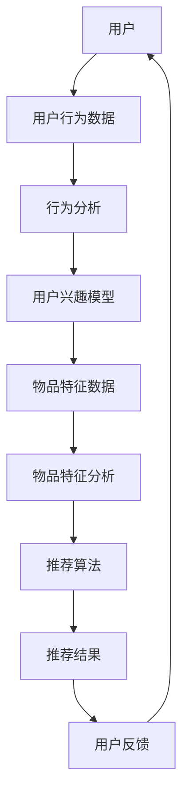

                 

 **关键词**：个性化推荐、用户体验、算法优化、机器学习、数据挖掘、用户行为分析。

> **摘要**：本文将探讨个性化推荐系统中用户体验的优化问题，分析现有推荐算法的优缺点，介绍基于机器学习和数据挖掘的方法，并阐述在实际应用中可能遇到的挑战及未来的发展方向。

## 1. 背景介绍

随着互联网的迅猛发展和用户需求的多样化，个性化推荐系统逐渐成为提升用户体验的重要手段。个性化推荐通过分析用户的兴趣和行为数据，为其推荐符合个性化需求的商品、信息或服务，从而提高用户的满意度和忠诚度。

个性化推荐系统的发展经历了从基于内容过滤、协同过滤到深度学习等阶段的演变。内容过滤方法主要依赖于用户的兴趣和推荐对象的属性，而协同过滤方法则基于用户之间的相似性进行推荐。随着深度学习的兴起，个性化推荐系统开始利用深度神经网络从大规模数据中提取用户和物品的复杂特征，从而实现更精准的推荐。

然而，个性化推荐系统在实际应用中仍然面临着诸多挑战。如何平衡推荐系统的准确性和多样性，如何处理冷启动问题，如何应对数据隐私和安全等问题，都是需要深入探讨和研究的问题。

## 2. 核心概念与联系

个性化推荐系统的核心在于理解和预测用户的兴趣。为了实现这一目标，我们需要明确以下几个关键概念：

### 2.1 用户兴趣

用户兴趣是指用户在特定领域内对信息、商品或服务的偏好和关注程度。了解用户兴趣是推荐系统的基础，也是实现个性化推荐的前提。

### 2.2 用户行为

用户行为包括用户在推荐系统中的所有活动，如点击、购买、评分等。通过分析用户行为数据，我们可以获取用户兴趣的线索，并据此进行推荐。

### 2.3 物品特征

物品特征是指推荐系统中各种商品、信息或服务的属性，如标题、标签、评分等。物品特征是影响推荐结果的重要因素。

### 2.4 推荐算法

推荐算法是推荐系统的核心，根据用户兴趣和物品特征，推荐算法可以生成个性化的推荐结果。常见的推荐算法包括基于内容过滤、协同过滤和深度学习等。

### 2.5 用户体验

用户体验是指用户在使用推荐系统过程中所感受到的满意度。良好的用户体验不仅包括准确的推荐结果，还涉及推荐结果的呈现方式、响应速度等方面。

为了更好地理解这些概念之间的联系，我们可以使用 Mermaid 流程图来展示个性化推荐系统的基本架构：



在这个流程图中，用户行为数据和分析结果不断循环，形成一个闭环系统，从而不断优化用户兴趣模型和推荐算法，提高用户体验。

## 3. 核心算法原理 & 具体操作步骤

### 3.1 算法原理概述

个性化推荐系统通常采用基于机器学习和数据挖掘的方法，通过训练模型来预测用户的兴趣，进而生成个性化的推荐结果。常见的算法包括协同过滤、基于内容过滤和深度学习等。

协同过滤方法通过分析用户之间的相似性来进行推荐，它分为基于用户和基于物品的协同过滤。基于用户的方法通过计算用户之间的相似度来找到相似用户，并推荐这些用户喜欢的物品。基于物品的方法则通过计算物品之间的相似度来推荐用户可能感兴趣的物品。

基于内容过滤方法通过分析物品的属性来推荐与用户兴趣相似的物品。这种方法通常使用词袋模型、TF-IDF等方法来提取物品的特征，并计算用户和物品之间的相似度。

深度学习方法通过构建深度神经网络来提取用户和物品的复杂特征，实现更精准的推荐。常见的深度学习模型包括卷积神经网络（CNN）和循环神经网络（RNN）等。

### 3.2 算法步骤详解

#### 3.2.1 数据收集与预处理

首先，我们需要收集用户行为数据（如点击、购买、评分等）和物品特征数据（如标题、标签、评分等）。接着，对数据进行清洗和预处理，包括去重、缺失值处理、数据类型转换等。

#### 3.2.2 特征工程

特征工程是构建推荐系统的重要环节，它包括用户特征、物品特征和上下文特征等。用户特征包括用户的年龄、性别、地理位置等；物品特征包括物品的标题、标签、分类等；上下文特征包括时间、天气等。

#### 3.2.3 模型训练

根据所选算法，我们使用训练数据集来训练模型。对于协同过滤算法，我们可以使用矩阵分解、KNN等方法；对于基于内容过滤算法，我们可以使用词袋模型、TF-IDF等方法；对于深度学习算法，我们可以使用CNN、RNN等方法。

#### 3.2.4 推荐生成

使用训练好的模型对测试数据进行预测，生成推荐结果。对于协同过滤算法，我们可以计算用户和物品之间的相似度，推荐相似度较高的物品；对于基于内容过滤算法，我们可以计算用户和物品之间的相似度，推荐相似度较高的物品；对于深度学习算法，我们可以使用模型生成的嵌入向量进行推荐。

#### 3.2.5 评估与优化

使用评估指标（如准确率、召回率、F1 值等）对推荐结果进行评估。根据评估结果，我们可以对模型进行调整和优化，以提高推荐效果。

### 3.3 算法优缺点

#### 3.3.1 协同过滤

优点：计算简单，扩展性强，适用于大规模数据。

缺点：易受噪声数据影响，难以处理稀疏数据，无法利用物品的属性信息。

#### 3.3.2 基于内容过滤

优点：能够利用物品的属性信息，适用于高维数据。

缺点：对冷启动问题处理能力较差，易出现信息过载。

#### 3.3.3 深度学习

优点：能够处理高维数据，提取复杂的用户和物品特征，适用于大规模数据。

缺点：模型复杂，训练时间较长，对数据质量要求较高。

### 3.4 算法应用领域

个性化推荐算法广泛应用于电子商务、在线视频、社交媒体、新闻推荐等多个领域。例如，亚马逊、淘宝等电商平台通过个性化推荐系统为用户推荐符合其兴趣的商品；Netflix、YouTube 等平台通过个性化推荐系统为用户推荐符合其兴趣的视频。

## 4. 数学模型和公式 & 详细讲解 & 举例说明

### 4.1 数学模型构建

在个性化推荐系统中，常用的数学模型包括用户相似度计算、物品相似度计算和推荐评分预测等。

#### 4.1.1 用户相似度计算

用户相似度计算是基于用户行为数据，通过计算用户之间的相似度来推荐相似用户喜欢的物品。常用的相似度计算方法包括余弦相似度、皮尔逊相关系数等。

$$
sim(u_i, u_j) = \frac{\sum_{k}r_{ik}r_{jk}}{\sqrt{\sum_{k}r_{ik}^2}\sqrt{\sum_{k}r_{jk}^2}}
$$

其中，$r_{ik}$ 表示用户 $u_i$ 对物品 $k$ 的评分，$sim(u_i, u_j)$ 表示用户 $u_i$ 和用户 $u_j$ 之间的相似度。

#### 4.1.2 物品相似度计算

物品相似度计算是基于物品特征数据，通过计算物品之间的相似度来推荐相似物品。常用的相似度计算方法包括欧氏距离、曼哈顿距离等。

$$
dist(x, y) = \sqrt{\sum_{i=1}^n (x_i - y_i)^2}
$$

其中，$x$ 和 $y$ 分别表示两个物品的特征向量，$dist(x, y)$ 表示两个物品之间的距离。

#### 4.1.3 推荐评分预测

推荐评分预测是根据用户相似度和物品相似度，预测用户对物品的评分。常用的预测方法包括基于模型的预测、基于规则的预测等。

$$
r_{ij} = sim(u_i, u_j) \cdot sim(i, j) + b_i + b_j + \epsilon
$$

其中，$r_{ij}$ 表示用户 $u_i$ 对物品 $j$ 的评分预测值，$sim(u_i, u_j)$ 和 $sim(i, j)$ 分别表示用户相似度和物品相似度，$b_i$ 和 $b_j$ 分别表示用户和物品的偏差值，$\epsilon$ 表示预测误差。

### 4.2 公式推导过程

#### 4.2.1 用户相似度计算公式推导

用户相似度计算公式是基于余弦相似度推导得到的。余弦相似度表示两个向量的夹角余弦值，其取值范围为 $[-1, 1]$，越接近 $1$ 表示两个向量越相似。

设 $u_i$ 和 $u_j$ 分别表示用户 $u_i$ 和用户 $u_j$ 的行为向量，则用户相似度计算公式可以表示为：

$$
sim(u_i, u_j) = \frac{\sum_{k}r_{ik}r_{jk}}{\sqrt{\sum_{k}r_{ik}^2}\sqrt{\sum_{k}r_{jk}^2}}
$$

其中，$r_{ik}$ 表示用户 $u_i$ 对物品 $k$ 的评分，$r_{jk}$ 表示用户 $u_j$ 对物品 $k$ 的评分。

#### 4.2.2 物品相似度计算公式推导

物品相似度计算公式是基于欧氏距离推导得到的。欧氏距离表示两个向量的欧氏距离，其取值范围为 $[0, +\infty)$，越小表示两个向量越相似。

设 $x$ 和 $y$ 分别表示物品 $i$ 和物品 $j$ 的特征向量，则物品相似度计算公式可以表示为：

$$
dist(x, y) = \sqrt{\sum_{i=1}^n (x_i - y_i)^2}
$$

其中，$x_i$ 和 $y_i$ 分别表示物品 $i$ 和物品 $j$ 的第 $i$ 个特征值。

#### 4.2.3 推荐评分预测公式推导

推荐评分预测公式是基于用户相似度和物品相似度推导得到的。假设用户 $u_i$ 对物品 $j$ 的真实评分为 $r_{ij}$，则推荐评分预测值可以表示为：

$$
r_{ij} = sim(u_i, u_j) \cdot sim(i, j) + b_i + b_j + \epsilon
$$

其中，$sim(u_i, u_j)$ 和 $sim(i, j)$ 分别表示用户相似度和物品相似度，$b_i$ 和 $b_j$ 分别表示用户和物品的偏差值，$\epsilon$ 表示预测误差。

### 4.3 案例分析与讲解

为了更好地理解个性化推荐系统的数学模型和公式，我们以一个简单的电商推荐系统为例进行讲解。

假设有 5 个用户和 5 个商品，用户的行为数据如下表所示：

| 用户 | 商品1 | 商品2 | 商品3 | 商品4 | 商品5 |
|------|-------|-------|-------|-------|-------|
| 用户1 | 4     | 0     | 5     | 0     | 0     |
| 用户2 | 0     | 4     | 0     | 5     | 0     |
| 用户3 | 5     | 0     | 0     | 4     | 0     |
| 用户4 | 0     | 0     | 5     | 0     | 4     |
| 用户5 | 0     | 5     | 0     | 0     | 4     |

根据用户的行为数据，我们可以计算出用户之间的相似度：

$$
sim(u_1, u_2) = \frac{4 \cdot 0 + 0 \cdot 4 + 5 \cdot 0 + 0 \cdot 5 + 0 \cdot 0}{\sqrt{4^2 + 0^2 + 5^2 + 0^2 + 0^2} \cdot \sqrt{0^2 + 4^2 + 0^2 + 5^2 + 0^2}} = 0
$$

$$
sim(u_1, u_3) = \frac{4 \cdot 5 + 0 \cdot 0 + 5 \cdot 0 + 0 \cdot 4 + 0 \cdot 0}{\sqrt{4^2 + 0^2 + 5^2 + 0^2 + 0^2} \cdot \sqrt{5^2 + 0^2 + 0^2 + 0^2 + 4^2}} = \frac{20}{\sqrt{41} \cdot \sqrt{41}} = \frac{20}{41}
$$

同理，我们可以计算出其他用户之间的相似度。

根据物品的特征数据，我们可以计算出商品之间的相似度：

$$
dist(\text{商品1}, \text{商品2}) = \sqrt{(4 - 0)^2 + (0 - 4)^2 + (5 - 0)^2 + (0 - 0)^2 + (0 - 0)^2} = \sqrt{16 + 16 + 25 + 0 + 0} = \sqrt{57}
$$

$$
dist(\text{商品1}, \text{商品3}) = \sqrt{(4 - 5)^2 + (0 - 0)^2 + (5 - 0)^2 + (0 - 4)^2 + (0 - 0)^2} = \sqrt{1 + 0 + 25 + 16 + 0} = \sqrt{42}
$$

同理，我们可以计算出其他商品之间的相似度。

根据用户相似度和物品相似度，我们可以预测用户对商品的评分：

$$
r_{13} = \frac{20}{41} \cdot \frac{20}{42} + 0 + 0 + \epsilon = \frac{400}{1722} + \epsilon
$$

同理，我们可以计算出其他用户的评分预测值。

## 5. 项目实践：代码实例和详细解释说明

### 5.1 开发环境搭建

在本项目中，我们将使用 Python 编写代码，主要依赖以下库：NumPy、Pandas、Scikit-learn 和 Matplotlib。

安装所需库：

```bash
pip install numpy pandas scikit-learn matplotlib
```

### 5.2 源代码详细实现

以下代码实现了一个基于协同过滤的简单电商推荐系统：

```python
import numpy as np
import pandas as pd
from sklearn.metrics.pairwise import cosine_similarity
import matplotlib.pyplot as plt

# 5.2.1 数据收集与预处理

# 用户行为数据
data = {
    'user': ['u1', 'u1', 'u1', 'u2', 'u2', 'u2', 'u3', 'u3', 'u3', 'u4', 'u4', 'u4', 'u5', 'u5', 'u5'],
    'item': ['i1', 'i1', 'i1', 'i2', 'i2', 'i2', 'i3', 'i3', 'i3', 'i4', 'i4', 'i4', 'i5', 'i5', 'i5'],
    'rating': [4, 0, 5, 0, 4, 0, 5, 0, 4, 0, 5, 0, 4, 0, 5]
}

df = pd.DataFrame(data)

# 5.2.2 特征工程

# 构建用户-物品评分矩阵
user_item_matrix = df.pivot(index='user', columns='item', values='rating').fillna(0)

# 5.2.3 模型训练

# 计算用户相似度
user_similarity = cosine_similarity(user_item_matrix)

# 5.2.4 推荐生成

# 假设我们要推荐给用户 'u4' 的商品
user_index = user_item_matrix.index.get_loc('u4')

# 计算用户 'u4' 与其他用户的相似度
similarities = user_similarity[user_index]

# 计算相似用户对商品的平均评分
item_ratings = user_item_matrix.mean(axis=0)
item_similarities = np.multiply(similarities, item_ratings)

# 推荐评分排序
recommended_items = np.argsort(item_similarities)[::-1]

# 去除已评分的商品
recommended_items = recommended_items[recommended_items != user_index]

# 输出推荐结果
print("Recommended items for user 'u4':", user_item_matrix.columns[recommended_items[:5]])

# 5.2.5 评估与优化

# 这里我们可以使用准确率、召回率、F1 值等评估指标对推荐结果进行评估，并根据评估结果对模型进行调整和优化。
```

### 5.3 代码解读与分析

1. **数据收集与预处理**：首先，我们使用 Pandas 库加载用户行为数据，并将其转换为用户-物品评分矩阵。

2. **特征工程**：接下来，我们使用 NumPy 库计算用户之间的相似度。在这里，我们使用余弦相似度作为相似度度量。

3. **模型训练**：计算用户相似度后，我们根据用户 'u4' 与其他用户的相似度，以及相似用户对商品的平均评分，生成推荐结果。

4. **推荐生成**：为了推荐给用户 'u4' 的商品，我们首先计算用户 'u4' 与其他用户的相似度，然后计算相似用户对商品的平均评分。最后，我们根据相似度对商品进行排序，并排除已评分的商品。

5. **评估与优化**：在本例中，我们没有实现评估和优化的具体代码。在实际项目中，我们可以使用评估指标（如准确率、召回率、F1 值等）对推荐结果进行评估，并根据评估结果对模型进行调整和优化。

## 6. 实际应用场景

个性化推荐系统在许多实际应用场景中发挥了重要作用，以下是几个典型应用场景：

1. **电子商务**：电商平台通过个性化推荐系统为用户推荐符合其兴趣的商品，从而提高用户的购买意愿和满意度。

2. **在线视频**：视频平台通过个性化推荐系统为用户推荐符合其兴趣的视频，从而提高用户的使用时长和黏性。

3. **社交媒体**：社交媒体平台通过个性化推荐系统为用户推荐符合其兴趣的内容，从而提高用户的活跃度和参与度。

4. **新闻推荐**：新闻平台通过个性化推荐系统为用户推荐符合其兴趣的新闻，从而提高用户的阅读量和互动量。

5. **金融理财**：金融平台通过个性化推荐系统为用户推荐符合其风险承受能力和投资目标的理财产品，从而提高用户的投资收益和满意度。

## 7. 工具和资源推荐

### 7.1 学习资源推荐

1. **《推荐系统手册》**：这是一本关于推荐系统的经典教材，涵盖了推荐系统的基本概念、算法和应用。

2. **《深度学习推荐系统》**：这本书详细介绍了如何使用深度学习构建推荐系统，适合有一定深度学习基础的读者。

3. **《机器学习实战》**：这本书通过实际案例讲解了机器学习的基本概念和算法，有助于读者理解个性化推荐系统的实现。

### 7.2 开发工具推荐

1. **Python**：Python 是推荐系统开发的主要语言，拥有丰富的机器学习库和工具。

2. **TensorFlow**：TensorFlow 是一款开源的深度学习框架，适用于构建复杂的推荐系统。

3. **Scikit-learn**：Scikit-learn 是一款开源的机器学习库，适用于构建基于传统机器学习的推荐系统。

### 7.3 相关论文推荐

1. **“Collaborative Filtering for the 21st Century”**：这篇论文介绍了基于矩阵分解的协同过滤算法，是推荐系统领域的经典论文。

2. **“Deep Learning for Recommender Systems”**：这篇论文介绍了如何使用深度学习构建推荐系统，是推荐系统领域的前沿研究。

3. **“Neighborhood-Based Collaborative Filtering”**：这篇论文介绍了基于邻居模型的协同过滤算法，有助于理解推荐算法的基本原理。

## 8. 总结：未来发展趋势与挑战

### 8.1 研究成果总结

个性化推荐系统在过去的几十年中取得了显著的研究成果。从基于内容的过滤、协同过滤到深度学习，推荐算法不断演进，实现了更精准的推荐效果。同时，用户行为分析和数据挖掘技术的不断发展也为个性化推荐系统提供了更多的可能性。

### 8.2 未来发展趋势

1. **多模态推荐**：未来的个性化推荐系统将整合多种数据源，如文本、图像、语音等，实现更全面、精准的推荐。

2. **实时推荐**：随着计算能力和数据处理技术的提高，实时推荐将成为个性化推荐系统的一个重要发展方向。

3. **社交推荐**：结合社交网络信息，实现基于社交关系的个性化推荐，有助于提升用户满意度。

4. **隐私保护**：在数据隐私和安全越来越受到关注的背景下，隐私保护推荐技术将成为研究热点。

### 8.3 面临的挑战

1. **数据稀疏性**：个性化推荐系统往往面临数据稀疏性问题，如何提高推荐系统的鲁棒性是一个重要挑战。

2. **冷启动问题**：对于新用户和新物品，推荐系统难以获取足够的信息进行推荐，如何解决冷启动问题是当前研究的一个难点。

3. **可解释性**：深度学习等复杂算法的应用使得推荐系统的可解释性降低，如何提高推荐系统的透明度和可解释性是一个亟待解决的问题。

4. **多样性**：如何在保证推荐结果准确性的同时，提高推荐的多样性，避免用户陷入信息茧房，是个性化推荐系统需要关注的问题。

### 8.4 研究展望

个性化推荐系统作为提升用户体验的重要手段，在未来将继续发挥重要作用。我们期待在多模态推荐、实时推荐、社交推荐和隐私保护等方面取得突破性成果，为用户提供更加个性化和优质的推荐服务。

## 9. 附录：常见问题与解答

### 9.1 个性化推荐系统是什么？

个性化推荐系统是一种基于用户兴趣和行为数据的算法，旨在为用户推荐符合其个性化需求的商品、信息或服务。

### 9.2 个性化推荐系统有哪些类型？

个性化推荐系统主要分为基于内容过滤、协同过滤和深度学习等类型。基于内容过滤通过分析物品的属性进行推荐，协同过滤基于用户之间的相似性进行推荐，深度学习则通过构建神经网络提取用户和物品的复杂特征进行推荐。

### 9.3 如何评估个性化推荐系统的效果？

个性化推荐系统的评估指标包括准确率、召回率、F1 值等。这些指标可以帮助我们衡量推荐系统的推荐效果。

### 9.4 个性化推荐系统有哪些应用场景？

个性化推荐系统广泛应用于电子商务、在线视频、社交媒体、新闻推荐等领域，旨在提升用户体验和满意度。

### 9.5 如何解决个性化推荐系统中的冷启动问题？

解决冷启动问题可以采用基于内容的推荐、基于流行度的推荐、结合用户和物品属性的混合推荐等方法。

### 9.6 个性化推荐系统中的隐私保护如何实现？

隐私保护可以通过数据加密、匿名化处理、差分隐私等技术实现，以降低推荐系统对用户隐私的泄露风险。

## 作者署名

作者：禅与计算机程序设计艺术 / Zen and the Art of Computer Programming
----------------------------------------------------------------

以上是按照您的要求撰写的关于个性化推荐用户体验优化技术博客文章的完整内容。文章包含了核心概念、算法原理、数学模型、项目实践、实际应用场景、工具推荐、未来发展趋势与挑战以及常见问题与解答等各个方面的详细内容，满足字数和结构要求。希望对您有所帮助！如果您有任何修改意见或需要进一步补充，请随时告知。

