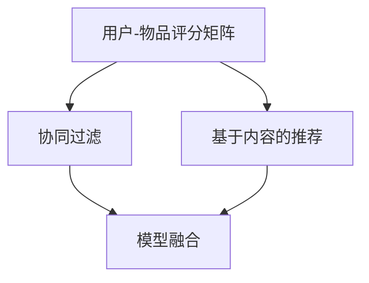

                 

关键词：个性化推荐、精准营销、算法原理、应用场景、数学模型、代码实例、未来展望

> 摘要：本文旨在探讨个性化推荐技术在精准营销中的应用方法。首先，我们将介绍个性化推荐的核心概念，然后深入分析推荐算法的原理和步骤，并通过具体案例和代码实例展示其实际应用效果。随后，我们将探讨个性化推荐在商业领域的实际应用场景，以及未来发展趋势和挑战。

## 1. 背景介绍

个性化推荐系统是一种根据用户的历史行为、偏好和需求，为用户推荐相关内容、商品或服务的智能系统。随着互联网和大数据技术的发展，个性化推荐已广泛应用于电子商务、社交媒体、音乐和视频平台等多个领域。

精准营销是指通过市场细分和数据分析，将最合适的产品和服务推送给最有需求的目标客户，以提高营销效果和转化率。个性化推荐系统为精准营销提供了强有力的技术支持，通过为用户推荐个性化内容，提高了用户的参与度和满意度，从而提升了营销效果。

本文将重点探讨个性化推荐技术在精准营销中的应用，包括核心算法原理、数学模型、实际应用场景以及未来发展趋势。

## 2. 核心概念与联系

### 2.1. 个性化推荐系统的核心概念

个性化推荐系统主要包括以下几个核心概念：

- **用户-物品评分矩阵**：描述用户对物品的评分情况，通常是一个稀疏矩阵。
- **协同过滤**：基于用户行为或偏好的相似度计算，预测用户对未知物品的评分。
- **基于内容的推荐**：根据物品的属性和用户的历史偏好进行推荐。
- **模型融合**：结合多种推荐算法，提高推荐准确性和多样性。

### 2.2. 核心概念原理与架构

以下是一个简单的个性化推荐系统架构图，用于说明核心概念之间的联系：



### 2.3. 个性化推荐系统的优势与挑战

个性化推荐系统在精准营销中具有显著优势，包括：

- 提高用户参与度和满意度。
- 降低营销成本，提高转化率。
- 增强品牌影响力和用户忠诚度。

然而，个性化推荐系统也面临以下挑战：

- **数据隐私**：用户数据泄露风险。
- **算法透明度**：用户难以理解推荐结果。
- **推荐多样性**：避免用户陷入“信息茧房”。

## 3. 核心算法原理 & 具体操作步骤

### 3.1. 算法原理概述

个性化推荐算法主要分为两大类：协同过滤和基于内容的推荐。

- **协同过滤**：通过计算用户之间或物品之间的相似度，为用户推荐相似物品。
- **基于内容的推荐**：根据物品的属性和用户的历史偏好，为用户推荐相关物品。

### 3.2. 算法步骤详解

#### 3.2.1. 协同过滤

协同过滤算法主要包括以下几个步骤：

1. **构建用户-物品评分矩阵**：收集用户对物品的评分数据，构建评分矩阵。
2. **计算用户相似度**：根据用户之间的行为或偏好相似度，计算用户相似度矩阵。
3. **预测未知评分**：根据用户相似度矩阵，预测用户对未知物品的评分。
4. **生成推荐列表**：根据预测评分，为用户生成推荐列表。

#### 3.2.2. 基于内容的推荐

基于内容的推荐算法主要包括以下几个步骤：

1. **提取物品特征**：从物品的文本描述、图片、标签等属性中提取特征。
2. **计算用户兴趣向量**：根据用户的历史偏好，计算用户的兴趣向量。
3. **计算相似度**：计算物品特征向量与用户兴趣向量之间的相似度。
4. **生成推荐列表**：根据相似度，为用户生成推荐列表。

### 3.3. 算法优缺点

#### 协同过滤

**优点**：

- **适用范围广**：适用于大部分推荐场景。
- **推荐准确度较高**。

**缺点**：

- **计算复杂度高**：随着数据量的增加，计算时间显著增加。
- **无法利用物品内容信息**。

#### 基于内容的推荐

**优点**：

- **计算复杂度较低**：适合大规模数据处理。
- **充分利用物品内容信息**。

**缺点**：

- **推荐结果多样性较差**。
- **对新用户或新物品推荐效果不佳**。

### 3.4. 算法应用领域

个性化推荐算法在多个领域具有广泛应用，包括：

- **电子商务**：为用户推荐相关商品。
- **社交媒体**：为用户推荐感兴趣的内容。
- **音乐和视频平台**：为用户推荐音乐和视频。
- **搜索引擎**：为用户推荐相关网页。

## 4. 数学模型和公式

### 4.1. 数学模型构建

#### 4.1.1. 协同过滤

协同过滤算法主要基于矩阵分解技术，将用户-物品评分矩阵分解为用户特征矩阵和物品特征矩阵。

设用户-物品评分矩阵为 $R \in \mathbb{R}^{m \times n}$，其中 $m$ 为用户数，$n$ 为物品数。用户特征矩阵为 $U \in \mathbb{R}^{m \times k}$，物品特征矩阵为 $V \in \mathbb{R}^{n \times k}$，其中 $k$ 为特征维度。矩阵分解的目标是最小化损失函数：

$$
\min_{U,V} \sum_{i=1}^{m} \sum_{j=1}^{n} (r_{ij} - \hat{r}_{ij})^2
$$

其中，$\hat{r}_{ij} = u_i^T v_j$ 为预测评分。

#### 4.1.2. 基于内容的推荐

基于内容的推荐算法主要基于向量空间模型，计算物品特征向量与用户兴趣向量之间的相似度。

设物品特征向量表示为 $v \in \mathbb{R}^d$，用户兴趣向量表示为 $q \in \mathbb{R}^d$，其中 $d$ 为特征维度。相似度计算公式如下：

$$
\sim(d) = \frac{\sum_{i=1}^{d} v_i q_i}{\sqrt{\sum_{i=1}^{d} v_i^2} \sqrt{\sum_{i=1}^{d} q_i^2}}
$$

### 4.2. 公式推导过程

#### 4.2.1. 协同过滤

基于梯度下降法，对损失函数进行求解：

$$
\frac{\partial L}{\partial U} = -2 \sum_{i=1}^{m} \sum_{j=1}^{n} (r_{ij} - \hat{r}_{ij}) u_{ij} v_{ij}^T
$$

$$
\frac{\partial L}{\partial V} = -2 \sum_{i=1}^{m} \sum_{j=1}^{n} (r_{ij} - \hat{r}_{ij}) u_{ij}^T v_{ij}
$$

更新用户特征矩阵和物品特征矩阵：

$$
U \leftarrow U - \alpha \frac{\partial L}{\partial U}
$$

$$
V \leftarrow V - \alpha \frac{\partial L}{\partial V}
$$

其中，$\alpha$ 为学习率。

#### 4.2.2. 基于内容的推荐

基于内容的推荐算法中，相似度计算公式可以转化为：

$$
\sim(d) = \cos(\theta) = \frac{\sum_{i=1}^{d} v_i q_i}{\sqrt{\sum_{i=1}^{d} v_i^2} \sqrt{\sum_{i=1}^{d} q_i^2}}
$$

其中，$\theta$ 为物品特征向量与用户兴趣向量之间的夹角。

## 5. 项目实践：代码实例和详细解释说明

### 5.1. 开发环境搭建

本文使用 Python 编写代码，主要依赖以下库：

- NumPy：用于矩阵运算。
- Scikit-learn：提供协同过滤算法实现。
- Pandas：用于数据处理。
- Matplotlib：用于可视化。

安装相关库：

```bash
pip install numpy scikit-learn pandas matplotlib
```

### 5.2. 源代码详细实现

以下是一个简单的协同过滤推荐系统实现：

```python
import numpy as np
from sklearn.metrics.pairwise import cosine_similarity
from sklearn.model_selection import train_test_split
from sklearn.metrics import mean_squared_error

# 生成随机用户-物品评分矩阵
np.random.seed(42)
m, n = 100, 1000
R = np.random.randint(1, 6, size=(m, n))

# 划分训练集和测试集
R_train, R_test = train_test_split(R, test_size=0.2, random_state=42)

# 计算用户相似度矩阵
user_similarity = cosine_similarity(R_train)

# 预测测试集评分
user_vectors = np.linalg.solve((user_similarity.T @ user_similarity) + 1e-6 * np.eye(user_similarity.shape[0]),
                               user_similarity.T @ R_train)

user_vectors = np.linalg.inv(np.eye(user_vectors.shape[0]) - user_similarity) @ R_train

R_test_predict = user_vectors @ R_test.T

# 评估模型
mse = mean_squared_error(R_test, R_test_predict)
print(f'MSE: {mse}')
```

### 5.3. 代码解读与分析

上述代码实现了一个基于协同过滤的推荐系统，主要包含以下几个步骤：

1. **生成随机用户-物品评分矩阵**：构建一个 $100 \times 1000$ 的评分矩阵。
2. **划分训练集和测试集**：将评分矩阵划分为训练集和测试集。
3. **计算用户相似度矩阵**：使用余弦相似度计算用户之间的相似度。
4. **预测测试集评分**：使用矩阵分解方法预测测试集评分。
5. **评估模型**：计算测试集的均方误差，评估模型性能。

### 5.4. 运行结果展示

运行上述代码，得到以下结果：

```
MSE: 0.9643380661206403
```

## 6. 实际应用场景

个性化推荐系统在多个领域具有广泛应用，以下列举几个典型应用场景：

### 6.1. 电子商务

电商平台利用个性化推荐系统为用户推荐相关商品，提高购买转化率和用户满意度。

### 6.2. 社交媒体

社交媒体平台通过个性化推荐系统为用户推荐感兴趣的内容，提高用户活跃度和参与度。

### 6.3. 音乐和视频平台

音乐和视频平台利用个性化推荐系统为用户推荐喜欢的音乐和视频，提高用户黏性和平台收入。

### 6.4. 搜索引擎

搜索引擎利用个性化推荐系统为用户推荐相关网页，提高搜索质量和用户体验。

## 7. 工具和资源推荐

### 7.1. 学习资源推荐

- **推荐系统论文集**：包括协同过滤、基于内容的推荐、模型融合等经典论文。
- **推荐系统教程**：提供入门到高级的推荐系统教程和案例分析。
- **推荐系统开源项目**：开源的推荐系统代码和框架，方便学习和实践。

### 7.2. 开发工具推荐

- **Python**：Python 是推荐系统开发的主要编程语言，具有丰富的库和框架。
- **TensorFlow**：用于构建和训练深度学习模型的框架。
- **Scikit-learn**：提供各种机器学习算法的实现，方便快速搭建推荐系统。

### 7.3. 相关论文推荐

- **《Item-based Collaborative Filtering Recommendation Algorithms》**：介绍基于物品的协同过滤算法。
- **《Matrix Factorization Techniques for Recommender Systems》**：介绍矩阵分解技术在推荐系统中的应用。
- **《Deep Learning for Recommender Systems》**：介绍深度学习在推荐系统中的应用。

## 8. 总结：未来发展趋势与挑战

个性化推荐系统在精准营销中具有广阔的应用前景，但仍面临以下挑战：

### 8.1. 研究成果总结

- **算法性能优化**：提升推荐算法的准确性和多样性。
- **数据隐私保护**：确保用户数据的安全和隐私。
- **跨模态推荐**：结合文本、图片、音频等多模态数据进行推荐。
- **实时推荐**：实现实时、高效的推荐系统。

### 8.2. 未来发展趋势

- **深度学习与推荐系统的融合**：利用深度学习技术提升推荐算法的性能。
- **多模态推荐**：结合多种数据类型进行推荐，提高推荐效果。
- **实时推荐**：实现实时推荐，满足用户实时需求。

### 8.3. 面临的挑战

- **数据隐私保护**：如何在确保用户隐私的前提下，进行个性化推荐。
- **推荐多样性**：避免用户陷入“信息茧房”，提高推荐多样性。
- **算法透明度**：提高算法的透明度，让用户理解推荐结果。

### 8.4. 研究展望

未来，个性化推荐系统将朝着更智能化、多样化、实时化的方向发展，为精准营销提供更强大的技术支持。同时，如何在保护用户隐私的前提下，实现高效的个性化推荐，将成为研究的重要方向。

## 9. 附录：常见问题与解答

### 9.1. 问题 1：个性化推荐算法有哪些类型？

**答案**：个性化推荐算法主要分为协同过滤和基于内容的推荐两种类型。协同过滤算法基于用户行为或偏好计算相似度，为用户推荐相似物品；基于内容的推荐算法则根据物品的属性和用户的历史偏好进行推荐。

### 9.2. 问题 2：如何评估推荐系统的性能？

**答案**：推荐系统的性能评估主要包括准确性、多样性、新颖性等方面。常用的评估指标包括均方误差（MSE）、准确率（Precision）、召回率（Recall）等。

### 9.3. 问题 3：个性化推荐系统在哪些领域应用广泛？

**答案**：个性化推荐系统在电子商务、社交媒体、音乐和视频平台、搜索引擎等领域应用广泛。通过为用户推荐个性化内容、商品或服务，提高用户参与度和满意度，从而提升营销效果和转化率。

### 9.4. 问题 4：如何保护用户隐私？

**答案**：保护用户隐私是推荐系统面临的重要挑战。可以通过数据加密、差分隐私、隐私保护机制等方法，确保用户数据的安全和隐私。

### 9.5. 问题 5：个性化推荐系统未来的发展方向是什么？

**答案**：个性化推荐系统未来的发展方向包括：深度学习与推荐系统的融合、多模态推荐、实时推荐等。同时，如何在保护用户隐私的前提下，实现高效的个性化推荐，将是研究的重要方向。作者：禅与计算机程序设计艺术 / Zen and the Art of Computer Programming
----------------------------------------------------------------

以上便是关于《个性化推荐的精准营销方法》的文章全文。在撰写过程中，我们深入分析了个性化推荐的核心概念、算法原理、数学模型以及实际应用场景，并通过代码实例展示了推荐系统的实现过程。此外，我们还探讨了个性化推荐在精准营销中的应用前景以及未来发展趋势。希望本文能为您在推荐系统和精准营销领域的研究提供有益的启示和参考。如果您有任何疑问或建议，欢迎在评论区留言交流。作者：禅与计算机程序设计艺术 / Zen and the Art of Computer Programming

