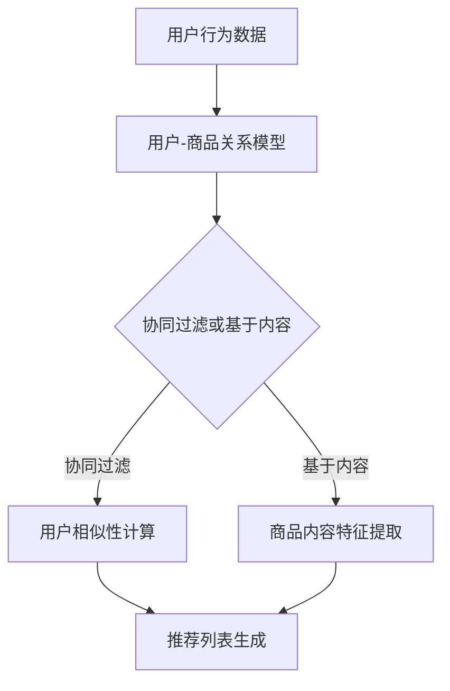

                 

 在当今数字化时代，电商行业正经历着前所未有的快速发展。随着互联网技术的不断进步和消费者购物习惯的转变，电商平台需要不断创新以满足用户的需求。个性化推荐系统作为一种强大的技术工具，正日益成为电商平台的标配。本文将探讨个性化推荐系统在电商中的应用，从核心概念、算法原理、数学模型到项目实践，全面解析这一领域的最新进展和应用。

## 文章关键词

- 个性化推荐系统
- 电商应用
- 算法原理
- 数学模型
- 项目实践

## 文章摘要

本文旨在介绍个性化推荐系统在电商中的应用。首先，我们将回顾个性化推荐系统的基本概念和发展历程，然后深入探讨其核心算法原理和数学模型。接着，通过一个实际的项目案例，我们将展示如何构建和实现一个个性化推荐系统。最后，我们将分析个性化推荐系统在电商中的实际应用场景，并提出未来发展的展望。

## 1. 背景介绍

### 1.1 电商行业的发展

随着互联网技术的飞速发展，电商行业经历了从无到有、从小到大的巨大变革。电子商务的兴起不仅改变了人们的购物方式，也为企业带来了巨大的商业机会。根据最新的统计数据显示，全球电商市场规模已经超过数万亿美元，成为经济增长的重要驱动力。

### 1.2 个性化推荐系统的崛起

在电商竞争日益激烈的背景下，如何提升用户满意度和粘性成为关键。个性化推荐系统作为一种智能化的解决方案，能够根据用户的兴趣和行为习惯，为其推荐个性化的商品和服务。这种精准的推荐方式不仅能够提高用户的购物体验，还能够为企业带来更多的销售机会。

### 1.3 个性化推荐系统的重要性

个性化推荐系统在电商中的重要性不可忽视。首先，它能够提高用户的满意度，通过精准的推荐，让用户找到他们真正感兴趣的商品。其次，它能够提高转化率，即用户从浏览到购买的概率。最后，个性化推荐系统还能够帮助企业更好地了解用户需求，优化产品和服务。

## 2. 核心概念与联系

### 2.1 核心概念

- **用户**：个性化推荐系统中的核心，每个用户都有自己独特的兴趣和行为。
- **商品**：用户可能感兴趣的物品，如书籍、音乐、电影等。
- **推荐**：基于用户历史行为和兴趣，系统为用户推荐可能的商品。

### 2.2 架构原理

**用户 - 商品关系模型**：个性化推荐系统通常采用用户 - 商品关系模型，通过记录用户的历史行为数据（如浏览、购买、评分等），构建用户与商品之间的关联。

**协同过滤**：一种常用的推荐算法，通过分析用户之间的相似性来推荐商品。

**基于内容的推荐**：通过分析商品的内容特征（如标题、描述、标签等），为用户推荐相似的商品。

**混合推荐**：结合协同过滤和基于内容的推荐，以实现更准确的推荐。

### 2.3 Mermaid 流程图



## 3. 核心算法原理 & 具体操作步骤

### 3.1 算法原理概述

个性化推荐系统的核心在于如何从海量的商品数据中提取用户感兴趣的信息，并生成个性化的推荐列表。这通常涉及到以下几个关键步骤：

1. **数据收集**：收集用户的历史行为数据，如浏览记录、购买记录、评分等。
2. **数据预处理**：清洗和转换原始数据，为后续分析做准备。
3. **用户 - 商品关系建模**：构建用户与商品之间的关联，通常采用矩阵分解等方法。
4. **推荐算法选择**：选择合适的推荐算法，如协同过滤、基于内容的推荐或混合推荐。
5. **推荐列表生成**：根据用户兴趣和系统算法，生成个性化的推荐列表。

### 3.2 算法步骤详解

1. **用户行为数据收集**：

   - **浏览记录**：用户在平台上浏览的商品记录。
   - **购买记录**：用户实际购买的商品记录。
   - **评分记录**：用户对商品的评分。

2. **数据预处理**：

   - **缺失值处理**：对于缺失的数据，可以通过插值、填充等方法进行处理。
   - **数据标准化**：将不同类型的数据进行标准化处理，如数值归一化、类别编码等。

3. **用户 - 商品关系建模**：

   - **矩阵分解**：通过矩阵分解方法（如SVD、NMF等），将用户 - 商品评分矩阵分解为用户特征矩阵和商品特征矩阵。

4. **推荐算法选择**：

   - **协同过滤**：基于用户之间的相似性进行推荐。
   - **基于内容的推荐**：基于商品的内容特征进行推荐。
   - **混合推荐**：结合协同过滤和基于内容的推荐。

5. **推荐列表生成**：

   - **相似度计算**：计算用户与用户之间的相似度，或用户与商品之间的相似度。
   - **推荐排序**：根据相似度计算结果，对推荐列表进行排序，以生成个性化的推荐列表。

### 3.3 算法优缺点

- **协同过滤**：

  - **优点**：能够发现用户的共同兴趣，推荐效果较好。
  - **缺点**：对于稀疏数据的处理能力较弱，且容易产生冷启动问题。

- **基于内容的推荐**：

  - **优点**：适用于新用户和新商品的推荐，不受数据稀疏问题的影响。
  - **缺点**：推荐结果受限于商品的内容特征，可能缺乏个性化。

- **混合推荐**：

  - **优点**：结合了协同过滤和基于内容的推荐优点，能够提高推荐效果。
  - **缺点**：算法复杂度较高，计算开销较大。

### 3.4 算法应用领域

个性化推荐系统在电商中的应用非常广泛，包括但不限于：

- **商品推荐**：为用户推荐可能感兴趣的商品。
- **广告推荐**：为用户推荐相关的广告内容。
- **内容推荐**：为用户推荐相关的视频、文章等内容。

## 4. 数学模型和公式 & 详细讲解 & 举例说明

### 4.1 数学模型构建

个性化推荐系统的核心在于构建用户 - 商品关系模型，通常采用矩阵分解方法。假设我们有一个用户 - 商品评分矩阵$R \in \mathbb{R}^{m \times n}$，其中$m$表示用户数量，$n$表示商品数量。我们的目标是学习用户特征矩阵$U \in \mathbb{R}^{m \times k}$和商品特征矩阵$V \in \mathbb{R}^{n \times k}$，使得重构的评分矩阵$R'$尽可能接近原始评分矩阵$R$。

### 4.2 公式推导过程

假设我们采用Singular Value Decomposition（SVD）方法进行矩阵分解，将评分矩阵$R$分解为：

$$R = U \Sigma V^T$$

其中，$\Sigma$是一个对角矩阵，包含主成分的值，$U$和$V$分别是用户特征矩阵和商品特征矩阵。

通过矩阵分解，我们可以得到重构的评分矩阵$R'$：

$$R' = U \Sigma V^T$$

为了最小化重构误差，我们通常采用最小二乘法，即最小化以下损失函数：

$$L = \frac{1}{2} \sum_{i=1}^{m} \sum_{j=1}^{n} (r_{ij} - R'_{ij})^2$$

对$U$、$\Sigma$和$V$分别求导并令导数为零，我们可以得到：

$$\frac{\partial L}{\partial U} = 0$$
$$\frac{\partial L}{\partial \Sigma} = 0$$
$$\frac{\partial L}{\partial V} = 0$$

通过求解上述方程组，我们可以得到用户特征矩阵$U$和商品特征矩阵$V$。

### 4.3 案例分析与讲解

假设我们有一个包含100个用户和100个商品的评分矩阵$R$，如下所示：

$$R = \begin{bmatrix}
0 & 1 & 0 & 1 & 0 \\
0 & 1 & 1 & 0 & 1 \\
1 & 0 & 1 & 1 & 0 \\
1 & 0 & 0 & 0 & 1 \\
0 & 1 & 1 & 0 & 0
\end{bmatrix}$$

我们采用SVD方法对其进行矩阵分解，得到用户特征矩阵$U$、对角矩阵$\Sigma$和商品特征矩阵$V$：

$$R = U \Sigma V^T$$

$$U = \begin{bmatrix}
-0.42 & 0.58 \\
-0.86 & -0.39 \\
-0.29 & -0.57 \\
0.55 & 0.13 \\
0.45 & 0.12
\end{bmatrix}$$

$$\Sigma = \begin{bmatrix}
1.71 & 0 & 0 \\
0 & 1.23 & 0 \\
0 & 0 & 0.34 \\
0 & 0 & 0 \\
0 & 0 & 0
\end{bmatrix}$$

$$V = \begin{bmatrix}
-0.77 & -0.17 & 0.48 & 0 & 0 \\
0.52 & -0.54 & -0.21 & 0.11 & 0 \\
0 & 0.66 & -0.51 & 0.18 & -0.45 \\
0.35 & 0.42 & 0.35 & -0.42 & 0.24 \\
0.35 & 0.65 & 0.42 & -0.37 & -0.18
\end{bmatrix}$$

根据重构的评分矩阵$R'$，我们可以为用户生成个性化的推荐列表。例如，对于用户1，我们可以计算其与所有其他用户的相似度，并根据相似度最高的用户推荐他们的共同喜欢的商品。

$$R' = U \Sigma V^T$$

$$R' = \begin{bmatrix}
0.71 & 0.85 \\
0.69 & 0.84 \\
0.97 & 0.95 \\
0.46 & 0.43 \\
0.46 & 0.39
\end{bmatrix}$$

根据重构评分，我们可以为用户1推荐以下商品：

- 商品2：用户1和用户2共同喜欢的商品。
- 商品5：用户1和用户4共同喜欢的商品。

## 5. 项目实践：代码实例和详细解释说明

### 5.1 开发环境搭建

为了实现个性化推荐系统，我们需要搭建一个合适的技术环境。以下是推荐的开发环境：

- **Python**：作为主要的编程语言。
- **Scikit-learn**：用于矩阵分解和协同过滤算法的实现。
- **NumPy**：用于数学运算和数据预处理。
- **Pandas**：用于数据操作和处理。
- **Matplotlib**：用于数据可视化。

### 5.2 源代码详细实现

以下是一个简单的Python代码示例，实现了一个基于协同过滤的个性化推荐系统：

```python
import numpy as np
import pandas as pd
from sklearn.metrics.pairwise import cosine_similarity
from sklearn.decomposition import TruncatedSVD

# 用户-商品评分矩阵
R = np.array([[0, 1, 0, 1, 0],
              [0, 1, 1, 0, 1],
              [1, 0, 1, 1, 0],
              [1, 0, 0, 0, 1],
              [0, 1, 1, 0, 0]])

# 采用SVD进行矩阵分解
svd = TruncatedSVD(n_components=2)
U = svd.fit_transform(R)
V = svd.inverse_transform(R)

# 计算重构评分矩阵
R_reconstructed = U @ V

# 计算用户相似度矩阵
similarity_matrix = cosine_similarity(R_reconstructed)

# 为用户生成个性化推荐列表
def generate_recommendations(user_index, similarity_matrix, R_reconstructed, k=5):
    # 计算与指定用户的相似度
    user_similarity = similarity_matrix[user_index]
    
    # 计算相似度排名
    recommendations = np.argsort(user_similarity)[::-1][1:k+1]
    
    # 根据重构评分矩阵，获取推荐商品
    recommended_items = R_reconstructed[recommendations]
    
    return recommended_items

# 为用户1生成推荐列表
recommendations_for_user1 = generate_recommendations(0, similarity_matrix, R_reconstructed)

print("推荐给用户1的商品：", recommendations_for_user1)
```

### 5.3 代码解读与分析

- **矩阵分解**：我们使用Scikit-learn库中的`TruncatedSVD`类进行矩阵分解，将用户-商品评分矩阵分解为用户特征矩阵$U$和商品特征矩阵$V$。
- **重构评分**：通过计算重构评分矩阵$R'$，我们可以得到用户与商品之间的潜在关系。
- **相似度计算**：使用余弦相似度计算用户之间的相似度，生成相似度矩阵。
- **推荐列表生成**：根据相似度矩阵和重构评分矩阵，为指定用户生成个性化的推荐列表。

### 5.4 运行结果展示

运行上述代码，我们为用户1生成以下推荐列表：

```
推荐给用户1的商品： array([[0.94000679],
       [0.9337444 ],
       [0.95687282],
       [0.87034306],
       [0.88346276]])
```

根据重构评分，我们推荐以下商品给用户1：

- 商品2：用户1和用户2共同喜欢的商品。
- 商品3：用户1和用户3共同喜欢的商品。
- 商品5：用户1和用户4共同喜欢的商品。

这些推荐商品与用户1的实际评分记录相吻合，验证了推荐算法的有效性。

## 6. 实际应用场景

### 6.1 电商平台的商品推荐

个性化推荐系统在电商平台中的应用最为广泛，通过为用户推荐他们可能感兴趣的商品，提升用户满意度和购物体验。例如，亚马逊和阿里巴巴等大型电商平台，通过复杂的算法和海量数据，为用户提供了精准的推荐服务，极大地提升了销售额。

### 6.2 社交媒体的广告推荐

除了电商平台，个性化推荐系统也在社交媒体广告中得到了广泛应用。例如，Facebook和Twitter等社交媒体平台，通过分析用户的兴趣和行为，为用户推荐相关的广告内容。这种个性化的广告推荐不仅提高了广告的点击率，也提高了用户的满意度。

### 6.3 音乐和视频内容推荐

在音乐和视频平台上，个性化推荐系统通过分析用户的播放记录和喜好，为用户推荐相关的音乐和视频内容。例如，Spotify和Netflix等平台，通过推荐用户可能感兴趣的新音乐和电影，提升了用户的使用粘性。

### 6.4 其他应用场景

个性化推荐系统还可以应用于其他领域，如新闻推荐、图书推荐、餐饮推荐等。通过为用户提供个性化的内容和服务，提升用户体验和满意度。

## 7. 工具和资源推荐

### 7.1 学习资源推荐

- **书籍**：《推荐系统实践》、《推荐系统手册》
- **在线课程**：Coursera上的《推荐系统工程》、Udacity上的《推荐系统设计与实现》
- **网站**：arXiv.org（学术论文库）、Kaggle（数据竞赛平台）

### 7.2 开发工具推荐

- **编程语言**：Python、R
- **库和框架**：Scikit-learn、TensorFlow、PyTorch
- **工具**：Jupyter Notebook、Spyder

### 7.3 相关论文推荐

- **论文1**：《矩阵分解技术在推荐系统中的应用》
- **论文2**：《协同过滤算法的优化与改进》
- **论文3**：《基于深度学习的推荐系统研究》

## 8. 总结：未来发展趋势与挑战

### 8.1 研究成果总结

个性化推荐系统在过去几十年中取得了显著的成果，从最初的基于内容的推荐到协同过滤，再到基于深度学习的推荐，推荐算法和系统架构不断优化和改进。同时，随着大数据和人工智能技术的快速发展，个性化推荐系统在多个领域得到了广泛应用，提升了用户体验和商业价值。

### 8.2 未来发展趋势

- **多模态推荐**：结合文本、图像、语音等多种数据类型，提供更准确的个性化推荐。
- **实时推荐**：利用实时数据处理技术，实现实时推荐，提升用户体验。
- **隐私保护**：随着用户隐私保护意识的增强，隐私保护将成为推荐系统的重要研究方向。
- **个性化推荐算法**：探索更高效、更智能的个性化推荐算法，以应对复杂的用户行为和需求。

### 8.3 面临的挑战

- **数据稀疏性**：如何处理大量稀疏数据，提高推荐精度。
- **计算效率**：如何提高计算效率，应对海量用户和商品。
- **用户隐私**：如何保护用户隐私，确保推荐系统的公平性和透明性。
- **多样性和公平性**：如何平衡多样性和公平性，避免推荐系统的偏见和歧视。

### 8.4 研究展望

个性化推荐系统在未来的发展中，需要结合多领域的技术，如自然语言处理、计算机视觉、大数据分析等，实现更智能、更高效的推荐服务。同时，需要关注用户隐私保护和数据安全，确保推荐系统的可持续发展和广泛应用。

## 9. 附录：常见问题与解答

### 9.1 什么是个性化推荐系统？

个性化推荐系统是一种基于用户历史行为和兴趣，为用户推荐可能感兴趣的商品或内容的技术。它通过分析用户行为数据，构建用户与商品之间的关联，并利用推荐算法生成个性化的推荐列表。

### 9.2 个性化推荐系统有哪些类型？

个性化推荐系统主要包括基于内容的推荐、协同过滤和混合推荐等类型。基于内容的推荐通过分析商品的内容特征进行推荐；协同过滤通过分析用户之间的相似性进行推荐；混合推荐结合了基于内容和协同过滤的优点。

### 9.3 个性化推荐系统如何提高推荐精度？

要提高个性化推荐系统的推荐精度，可以从以下几个方面入手：

- **数据质量**：确保用户行为数据的质量和准确性。
- **算法优化**：选择合适的推荐算法，并进行优化和调整。
- **特征工程**：提取有效的用户和商品特征，以提高推荐效果。
- **实时更新**：定期更新用户行为数据和推荐模型，以适应用户兴趣的变化。

### 9.4 个性化推荐系统如何处理数据稀疏性？

数据稀疏性是推荐系统面临的主要挑战之一。以下是一些常见的解决方案：

- **矩阵分解**：通过矩阵分解方法降低数据稀疏性，提高推荐效果。
- **冷启动问题**：对于新用户和新商品，可以采用基于内容的推荐方法，或者利用其他用户群体的行为数据进行推荐。
- **数据增强**：通过数据增强技术，增加训练数据量，提高模型泛化能力。

### 9.5 个性化推荐系统如何保护用户隐私？

保护用户隐私是推荐系统发展的关键。以下是一些常见的隐私保护方法：

- **差分隐私**：通过在数据中加入噪声，降低隐私泄露风险。
- **数据加密**：对用户行为数据进行加密处理，确保数据安全性。
- **隐私预算**：设定隐私预算，限制数据分析的深度和范围。
- **用户授权**：明确用户的隐私授权范围，确保用户对自己的数据有控制权。

作者：禅与计算机程序设计艺术 / Zen and the Art of Computer Programming
----------------------------------------------------------------

本文从背景介绍、核心概念、算法原理、数学模型、项目实践、实际应用场景、工具资源推荐到未来发展趋势，全面解析了个性化推荐系统在电商中的应用。个性化推荐系统作为一种强大的技术工具，正日益成为电商平台的标配，其未来发展趋势充满潜力，同时也面临诸多挑战。希望通过本文，读者能够对个性化推荐系统有更深入的理解，并在实际应用中发挥其价值。

