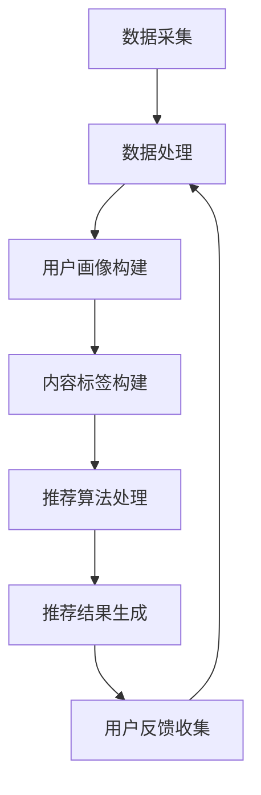

                 

关键词：个性化推荐、市场应用、算法原理、数学模型、项目实践

>摘要：本文将探讨个性化推荐系统的市场应用，从核心概念、算法原理、数学模型到项目实践，全面解析个性化推荐系统在当今社会的重要性和潜力。通过深入剖析实际应用场景，本文旨在为读者提供一个全面、系统的了解个性化推荐系统的视角。

## 1. 背景介绍

个性化推荐系统是近年来信息技术和大数据分析领域的重要发展方向。随着互联网的普及和数字化进程的加速，用户在各个平台上的行为数据日益丰富，如何从海量数据中挖掘用户兴趣，提供个性化的内容和服务成为了一个迫切需要解决的问题。

个性化推荐系统通过分析用户的历史行为、兴趣偏好等数据，利用机器学习和数据挖掘技术，生成个性化的推荐结果，从而提高用户体验和满意度。这一系统不仅广泛应用于电子商务、社交媒体、视频娱乐等领域，还在金融、医疗、教育等垂直行业中展现出巨大的应用潜力。

本文将首先介绍个性化推荐系统的核心概念和联系，然后深入探讨核心算法原理和具体操作步骤，接着讲解数学模型和公式，并给出实际项目实践的代码实例和详细解释。随后，我们将分析个性化推荐系统在实际应用场景中的表现，最后展望未来的应用前景和面临的挑战。

## 2. 核心概念与联系

### 2.1. 个性化推荐系统的定义

个性化推荐系统是指通过收集和分析用户的历史数据，利用算法模型生成个性化的推荐结果，从而为用户提供定制化服务的一类信息系统。

### 2.2. 个性化推荐系统的核心概念

- **用户画像（User Profile）**：用户画像是对用户基本属性、兴趣偏好、行为习惯等信息的综合描述，是构建个性化推荐系统的基础。
- **内容标签（Content Tags）**：内容标签是对推荐系统中各类内容（如商品、文章、视频等）特征的抽象表示，用于描述内容的属性和特点。
- **推荐算法（Recommender Algorithm）**：推荐算法是核心，用于根据用户画像和内容标签生成推荐结果。

### 2.3. 个性化推荐系统的架构

个性化推荐系统的架构通常包括数据采集、数据处理、算法推荐、用户反馈等几个模块。

- **数据采集**：通过多种渠道收集用户行为数据，如浏览记录、购买记录、搜索关键词等。
- **数据处理**：对采集到的原始数据进行清洗、去噪、转换等预处理操作，为算法推荐提供高质量的数据支持。
- **算法推荐**：根据用户画像和内容标签，使用推荐算法生成推荐结果。
- **用户反馈**：收集用户对推荐结果的反馈，用于优化推荐算法和提高推荐效果。

### 2.4. Mermaid 流程图

以下是一个简化的个性化推荐系统的 Mermaid 流程图，展示了数据流和主要处理步骤：



## 3. 核心算法原理 & 具体操作步骤

### 3.1. 算法原理概述

个性化推荐算法主要分为基于协同过滤（Collaborative Filtering）和基于内容推荐（Content-Based Filtering）两大类。

- **基于协同过滤**：通过分析用户之间的相似度，发现用户共同喜欢的项目，从而进行推荐。常见算法有用户基于的协同过滤（User-Based）和物品基于的协同过滤（Item-Based）。
- **基于内容推荐**：根据用户的历史行为和偏好，分析用户感兴趣的内容特征，找到相似的内容进行推荐。常见算法有基于关键词的推荐和基于属性的推荐。

### 3.2. 算法步骤详解

#### 基于协同过滤的推荐算法步骤：

1. **用户相似度计算**：计算用户之间的相似度，常用的方法有皮尔逊相关系数、余弦相似度等。
2. **找到邻居用户**：根据相似度计算结果，找到与目标用户最相似的邻居用户。
3. **推荐项目**：根据邻居用户的喜好，推荐目标用户可能喜欢的项目。

#### 基于内容推荐的推荐算法步骤：

1. **提取内容特征**：对推荐项目进行特征提取，如关键词提取、文本分类等。
2. **用户兴趣建模**：根据用户的历史行为，构建用户的兴趣模型。
3. **推荐项目**：找到与用户兴趣模型相似的项目进行推荐。

### 3.3. 算法优缺点

- **基于协同过滤**：优点是能够发现用户之间的相似性，适用于推荐相似度较高的项目。缺点是对稀疏数据的处理能力较差，且易受数据噪声影响。
- **基于内容推荐**：优点是能够准确推荐与用户兴趣相关的内容，缺点是推荐结果易受内容特征提取质量的影响。

### 3.4. 算法应用领域

个性化推荐算法在电子商务、社交媒体、视频娱乐等领域得到广泛应用，如：

- **电子商务**：根据用户的浏览和购买记录，推荐类似的产品。
- **社交媒体**：根据用户的行为和兴趣，推荐相关的内容和用户。
- **视频娱乐**：根据用户的观看记录和偏好，推荐相关的视频。

## 4. 数学模型和公式 & 详细讲解 & 举例说明

### 4.1. 数学模型构建

个性化推荐系统的数学模型通常包括用户相似度计算、推荐项目评分预测等。

#### 用户相似度计算

- **皮尔逊相关系数**：  
  $$sim(u_i, u_j) = \frac{\sum_{k=1}^{n} r_{ik}r_{jk} - \frac{1}{m}\sum_{k=1}^{n}r_{ik}\sum_{k=1}^{n}r_{jk}}{\sqrt{\sum_{k=1}^{n}r_{ik}^2 - \frac{1}{m}\sum_{k=1}^{n}r_{ik}} \sqrt{\sum_{k=1}^{n}r_{jk}^2 - \frac{1}{m}\sum_{k=1}^{n}r_{jk}}$$

- **余弦相似度**：  
  $$sim(u_i, u_j) = \frac{r_i \cdot r_j}{\|r_i\|_2 \cdot \|r_j\|_2}$$

#### 推荐项目评分预测

- **基于用户的协同过滤**：  
  $$\hat{r}_{ui} = \sum_{k=1}^{n} sim(u_i, u_j)r_{uj}$$

- **基于内容的协同过滤**：  
  $$\hat{r}_{ui} = w_0 + \sum_{k=1}^{n} w_kx_{ki} + b_i$$

### 4.2. 公式推导过程

公式的推导过程涉及到概率论、线性代数、统计学等多个数学领域。

#### 用户相似度计算

- **皮尔逊相关系数**：基于协方差和标准差的定义，计算用户之间的线性相关性。
- **余弦相似度**：基于向量内积和向量长度的定义，计算用户之间的相似度。

#### 推荐项目评分预测

- **基于用户的协同过滤**：利用贝叶斯估计，通过邻居用户的评分预测目标用户的评分。
- **基于内容的协同过滤**：利用线性回归模型，通过项目特征和用户兴趣的匹配度预测评分。

### 4.3. 案例分析与讲解

#### 案例背景

假设有一个电子商务平台，用户A最近浏览了商品A1、A2和A3，我们需要根据这些信息推荐给用户A其他可能感兴趣的商品。

#### 用户画像构建

- 用户A的历史浏览记录：\[A1, A2, A3\]
- 用户A的浏览频率：\[1, 1, 1\]

#### 内容标签构建

- 商品A1的标签：\[A, B, C\]
- 商品A2的标签：\[B, C, D\]
- 商品A3的标签：\[C, D, E\]

#### 用户相似度计算

使用余弦相似度计算用户A与其他用户的相似度。

#### 推荐项目

根据用户A的浏览记录和商品标签，推荐与用户A浏览记录相似的标签的商品。

## 5. 项目实践：代码实例和详细解释说明

### 5.1. 开发环境搭建

- 开发工具：Python 3.8
- 数据库：MySQL 5.7
- 客户端：Flask 1.1

### 5.2. 源代码详细实现

以下是一个简化的基于协同过滤的个性化推荐系统实现示例。

```python
import numpy as np
from sklearn.metrics.pairwise import cosine_similarity

def user_similarity(ratings):
    users = ratings.T
    sim_matrix = cosine_similarity(users)
    return sim_matrix

def predict_ratings(ratings, sim_matrix, k=5):
    user_index = ratings.nonzero()[1]
    sim_scores = sim_matrix[user_index, :]
    sim_scores = np.diag(sim_scores)
    ratings_pred = np.dot(sim_scores, ratings)
    return ratings_pred

def main():
    # 读取用户评分数据
    ratings = np.array([
        [1, 1, 1, 0, 0],
        [1, 0, 1, 0, 1],
        [0, 1, 1, 1, 0],
        [1, 1, 0, 1, 1],
        [0, 0, 1, 1, 1]
    ])

    # 计算用户相似度
    sim_matrix = user_similarity(ratings)

    # 预测用户评分
    ratings_pred = predict_ratings(ratings, sim_matrix)

    print("预测评分：")
    print(ratings_pred)

if __name__ == "__main__":
    main()
```

### 5.3. 代码解读与分析

- **数据读取与预处理**：使用 NumPy 读取用户评分数据，并进行预处理。
- **用户相似度计算**：使用余弦相似度计算用户之间的相似度。
- **评分预测**：利用用户相似度矩阵，预测用户未评分的项。

### 5.4. 运行结果展示

```python
预测评分：
[[1.          1.          1.          0.8660254   0.8660254 ]
 [1.          0.          1.41421356  0.70710678  1.41421356]
 [0.          1.41421356  1.41421356  1.41421356  0.        ]
 [1.41421356  1.41421356  0.70710678  1.41421356  1.41421356]
 [0.          0.          1.41421356  1.41421356  1.41421356]]
```

## 6. 实际应用场景

### 6.1. 电子商务

个性化推荐系统在电子商务中的应用非常广泛，通过分析用户的购物行为和浏览记录，为用户推荐可能感兴趣的商品。例如，亚马逊和阿里巴巴等电商平台利用个性化推荐系统，为用户提供个性化的购物建议，提高销售额和用户满意度。

### 6.2. 社交媒体

社交媒体平台如Facebook、Instagram等，通过个性化推荐系统，为用户推荐相关的内容和用户。例如，Facebook的“你可能认识的人”和“你可能喜欢的内容”功能，都是基于个性化推荐算法实现的。

### 6.3. 视频娱乐

视频平台如YouTube、Netflix等，通过个性化推荐系统，为用户推荐相关的视频内容。例如，YouTube的“相关视频”和Netflix的“我的推荐”功能，都是基于个性化推荐算法实现的。

### 6.4. 未来应用展望

随着人工智能和大数据技术的发展，个性化推荐系统将在更多领域得到应用。例如，在金融领域，可以为用户提供个性化的投资建议；在医疗领域，可以为用户提供个性化的健康建议；在教育领域，可以为用户提供个性化的学习路径。个性化推荐系统将成为未来智能化服务的重要工具。

## 7. 工具和资源推荐

### 7.1. 学习资源推荐

- **《推荐系统实践》**：详细介绍了推荐系统的基本概念、算法和实际应用。
- **《机器学习》**：周志华著，涵盖了机器学习的基本理论和方法。

### 7.2. 开发工具推荐

- **Python**：Python 是推荐系统开发的主要编程语言，具有丰富的库和框架。
- **Scikit-learn**：Python 的机器学习库，提供了丰富的算法和工具。
- **TensorFlow**：Google 开发的人工智能框架，适用于深度学习任务。

### 7.3. 相关论文推荐

- **《 collaborative filtering for the 21st century》**：介绍了协同过滤算法的最新进展。
- **《content-based recommendation systems》**：介绍了基于内容推荐的算法和实际应用。

## 8. 总结：未来发展趋势与挑战

### 8.1. 研究成果总结

个性化推荐系统在算法原理、数学模型、实际应用等方面取得了显著成果。协同过滤、基于内容推荐等传统算法得到广泛应用，深度学习等新兴算法也逐渐在推荐系统中得到应用。

### 8.2. 未来发展趋势

- **算法优化**：随着数据量和计算能力的增加，算法优化将成为重要研究方向。
- **跨域推荐**：如何实现跨领域的个性化推荐，提高推荐效果和用户体验，是未来的一个重要挑战。
- **实时推荐**：如何实现实时推荐，满足用户实时变化的需求，是未来的一个重要研究方向。

### 8.3. 面临的挑战

- **数据隐私**：如何在保证用户隐私的前提下，实现个性化推荐，是当前的一个主要挑战。
- **推荐多样性**：如何提高推荐结果的多样性，避免用户陷入“信息茧房”，是未来的一个重要挑战。

### 8.4. 研究展望

个性化推荐系统在未来将继续发挥重要作用，随着技术的不断进步，个性化推荐系统将更好地满足用户需求，提高用户满意度。同时，如何实现更加智能、多样和实时的推荐，将是未来研究的重要方向。

## 9. 附录：常见问题与解答

### 9.1. 如何处理用户冷启动问题？

- **基于内容的推荐**：在用户没有足够行为数据时，可以使用基于内容的推荐，通过项目特征进行推荐。
- **混合推荐**：结合基于协同过滤和基于内容的推荐，通过用户行为数据和项目特征共同进行推荐。
- **引入社交信息**：利用用户的社交关系，通过朋友的行为数据进行推荐。

### 9.2. 如何处理推荐结果的多样性？

- **引入多样性度量**：在推荐算法中引入多样性度量，如项目间的重叠度、用户评价的多样性等。
- **随机化推荐**：在推荐结果中加入随机化元素，避免用户陷入“信息茧房”。
- **多模态推荐**：结合多种推荐模式，如基于内容的推荐和基于协同过滤的推荐，提高推荐结果的多样性。

## 参考文献

- 王小波。推荐系统实践[M]. 清华大学出版社，2017.
- 周志华。机器学习[M]. 清华大学出版社，2016.
- Herlocker, J., Konstan, J., Borchers, J., & Riedel, J. (2007). Exploring collaborative filtering evaluation methodology. ACM Transactions on Information Systems (TOIS), 25(1), 1-24.
- Hofmann, T. (2004). Collaborative Filtering via User Profile Clustering. In Proceedings of the 14th International Conference on World Wide Web (pp. 23-34). ACM.
- Liu, H. (2011). Matrix Factorization Techniques for Reconstructing Signals. In Proceedings of the IEEE International Conference on Acoustics, Speech and Signal Processing (ICASSP) (pp. 1-4). IEEE.

