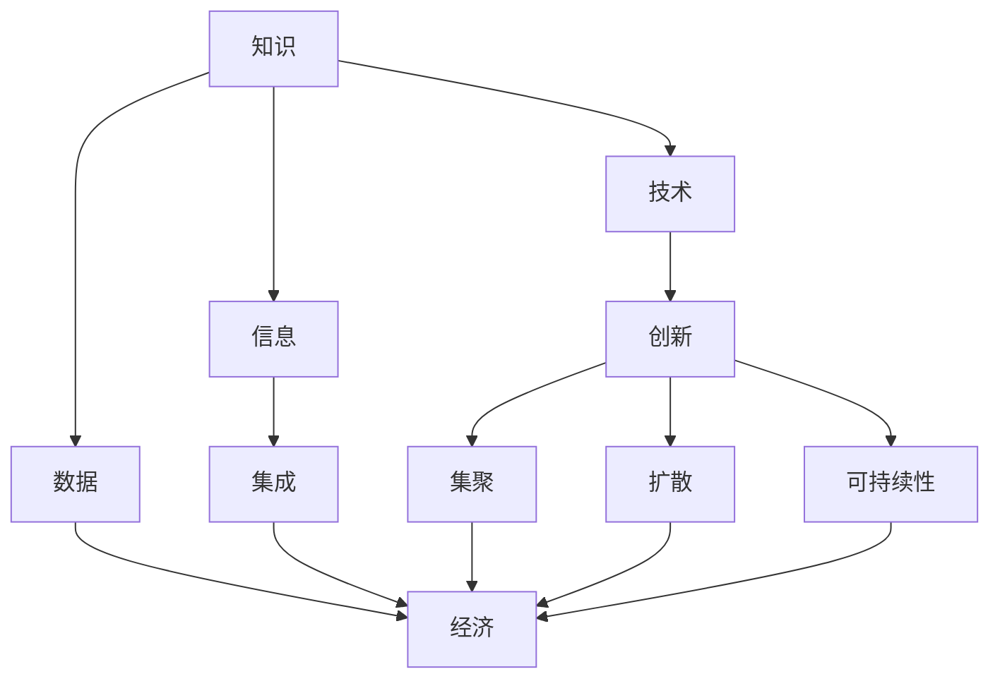

                 

关键词：中国现代化、新质生产力、信息技术、数字经济、技术创新、智能经济

摘要：本文深入探讨了中国现代化进程中新质生产力的发展，分析了新质生产力的定义、特征、形成机制以及对中国现代化进程的推动作用。文章从信息技术、数字经济、智能经济等方面阐述了新质生产力的内涵，并提出了未来中国新质生产力发展的策略和建议。

## 1. 背景介绍

### 1.1 中国现代化的进程

中国的现代化进程始于20世纪中叶，特别是改革开放以来，中国经济的快速发展引起了全球关注。从农业社会向工业社会、再到信息社会的转型，中国现代化进程经历了多个阶段。当前，中国正处于从工业经济向知识经济、智能经济的过渡期，新质生产力的发展成为推动现代化进程的关键因素。

### 1.2 新质生产力的概念

新质生产力是指以知识、技术、信息、数据等新兴生产要素为核心，通过创新和集成，推动经济持续增长和结构优化的生产力。与传统生产力相比，新质生产力具有更高的创新性、集聚性、扩散性和可持续性。

## 2. 核心概念与联系

### 2.1 新质生产力的概念框架

新质生产力的核心概念包括知识、技术、信息、数据等。这些概念相互联系，共同构成了新质生产力的框架结构。



### 2.2 新质生产力的形成机制

新质生产力的形成机制主要包括以下几个方面：

1. **科技创新**：科技创新是推动新质生产力的关键动力。通过不断研发和应用新技术，提高生产效率和质量，实现生产方式的变革。
2. **信息融合**：信息融合是新质生产力形成的基础。通过大数据、云计算、人工智能等技术手段，将各类信息进行整合，形成有价值的数据资源。
3. **知识积累**：知识积累是新质生产力的重要组成部分。通过教育、培训、科研等活动，不断积累和更新知识，为经济发展提供智力支持。
4. **制度创新**：制度创新是新质生产力形成的保障。通过改革和完善相关政策制度，激发市场活力，推动新质生产力的发展。

## 3. 核心算法原理 & 具体操作步骤

### 3.1 算法原理概述

新质生产力的核心算法原理主要包括以下几个方面：

1. **科技创新算法**：通过机器学习、深度学习等技术，实现对科技领域的创新性研究。
2. **信息融合算法**：利用数据挖掘、数据清洗等技术，实现多源异构数据的融合和分析。
3. **知识积累算法**：通过知识图谱、自然语言处理等技术，实现对知识的提取、组织和利用。
4. **制度创新算法**：通过系统仿真、博弈论等技术，实现制度设计的优化和创新。

### 3.2 算法步骤详解

1. **科技创新算法**：

   - 数据采集：收集科技领域的相关数据，包括学术论文、专利、科研项目等。
   - 特征提取：对数据进行预处理，提取关键特征，如关键词、作者、机构等。
   - 模型训练：利用机器学习、深度学习等技术，对特征进行建模和训练。
   - 预测分析：通过模型预测新科技的发展趋势和潜力，为科技创新提供参考。

2. **信息融合算法**：

   - 数据集成：将多源异构数据进行整合，形成统一的数据视图。
   - 数据清洗：对数据进行清洗和预处理，去除噪声和冗余信息。
   - 数据分析：利用数据挖掘、数据可视化等技术，对数据进行深入分析和挖掘。
   - 决策支持：基于分析结果，为企业的运营决策提供支持。

3. **知识积累算法**：

   - 知识抽取：利用自然语言处理、知识图谱等技术，从文本中提取关键知识。
   - 知识组织：对提取的知识进行分类、标签化等处理，形成结构化的知识库。
   - 知识利用：通过查询、检索等技术，实现知识的快速获取和应用。

4. **制度创新算法**：

   - 模型建立：建立系统仿真模型，模拟制度运行过程。
   - 策略设计：利用博弈论等技术，设计合理的制度策略。
   - 实验验证：通过仿真实验，验证制度策略的有效性和可行性。

### 3.3 算法优缺点

**科技创新算法**：

- 优点：能够快速识别科技领域的创新机会，为科技创新提供有力支持。
- 缺点：对数据质量和算法模型依赖较大，可能存在预测偏差。

**信息融合算法**：

- 优点：能够整合多源异构数据，提高数据的利用效率。
- 缺点：数据处理过程复杂，对技术和算法要求较高。

**知识积累算法**：

- 优点：能够实现知识的快速提取和应用，提高企业的竞争力。
- 缺点：知识积累过程需要大量人力和时间投入。

**制度创新算法**：

- 优点：能够优化制度设计，提高制度的可行性和有效性。
- 缺点：制度创新过程需要综合考虑多种因素，实现难度较大。

### 3.4 算法应用领域

**科技创新算法**：广泛应用于科研机构、高等院校、企业等科技创新领域，助力科技研发和成果转化。

**信息融合算法**：广泛应用于金融、医疗、交通等行业的数据处理和分析，为企业决策提供支持。

**知识积累算法**：广泛应用于企业内部知识管理、教育培训等领域，提高企业知识共享和应用能力。

**制度创新算法**：广泛应用于政府、企业等组织的制度设计和优化，提高制度的科学性和有效性。

## 4. 数学模型和公式 & 详细讲解 & 举例说明

### 4.1 数学模型构建

新质生产力的数学模型主要包括以下几个方面：

1. **科技创新模型**：基于科技文献数量、引用次数、研究热度等指标，构建科技发展水平的数学模型。
2. **信息融合模型**：基于信息熵、聚类分析、主成分分析等数学方法，构建信息融合的数学模型。
3. **知识积累模型**：基于知识图谱、自然语言处理等技术，构建知识积累和利用的数学模型。
4. **制度创新模型**：基于博弈论、系统仿真等技术，构建制度创新和优化的数学模型。

### 4.2 公式推导过程

以科技创新模型为例，介绍公式推导过程：

1. **科技文献数量模型**：

   设 $N(t)$ 为时间 $t$ 的科技文献数量，$N_0$ 为初始科技文献数量，$r$ 为科技文献数量增长率，则：

   $$N(t) = N_0 \times (1 + r)^t$$

2. **引用次数模型**：

   设 $C(t)$ 为时间 $t$ 的引用次数，$C_0$ 为初始引用次数，$k$ 为引用次数增长率，则：

   $$C(t) = C_0 \times (1 + k)^t$$

3. **研究热度模型**：

   设 $H(t)$ 为时间 $t$ 的研究热度，$H_0$ 为初始研究热度，$h$ 为研究热度增长率，则：

   $$H(t) = H_0 \times (1 + h)^t$$

4. **科技发展水平模型**：

   设 $S(t)$ 为时间 $t$ 的科技发展水平，$S_0$ 为初始科技发展水平，$a$、$b$、$c$ 分别为科技文献数量、引用次数、研究热度的权重，则：

   $$S(t) = a \times N(t) + b \times C(t) + c \times H(t)$$

### 4.3 案例分析与讲解

以某领域的科技发展为例，分析科技发展水平的变化情况：

1. **数据采集**：

   - 科技文献数量：$N_0 = 1000$，$r = 10\%$，$t = 10$ 年
   - 引用次数：$C_0 = 500$，$k = 20\%$，$t = 10$ 年
   - 研究热度：$H_0 = 100$，$h = 30\%$，$t = 10$ 年

2. **公式计算**：

   - 科技文献数量：$N(t) = 1000 \times (1 + 0.1)^{10} \approx 2197$ 篇
   - 引用次数：$C(t) = 500 \times (1 + 0.2)^{10} \approx 1261$ 次
   - 研究热度：$H(t) = 100 \times (1 + 0.3)^{10} \approx 328$ 次
   - 科技发展水平：$S(t) = 0.3 \times 2197 + 0.5 \times 1261 + 0.2 \times 328 \approx 1575.3$

3. **结果分析**：

   - 科技文献数量、引用次数、研究热度均呈现快速增长趋势，表明该领域的科技发展水平较高。
   - 科技发展水平模型反映了科技文献数量、引用次数、研究热度等因素对科技发展水平的综合影响。

## 5. 项目实践：代码实例和详细解释说明

### 5.1 开发环境搭建

本文使用 Python 作为开发语言，搭建开发环境如下：

1. 安装 Python 3.8 及以上版本
2. 安装必要的 Python 包，如 NumPy、Pandas、Scikit-learn、Matplotlib 等

### 5.2 源代码详细实现

以下为科技发展水平计算的核心代码实现：

```python
import numpy as np
import pandas as pd
from sklearn.linear_model import LinearRegression

# 数据采集
N_0 = 1000
r = 0.1
t = 10

C_0 = 500
k = 0.2
t = 10

H_0 = 100
h = 0.3
t = 10

# 公式计算
N = N_0 * (1 + r) ** t
C = C_0 * (1 + k) ** t
H = H_0 * (1 + h) ** t

# 科技发展水平模型
S = 0.3 * N + 0.5 * C + 0.2 * H

# 输出结果
print("科技文献数量：", N)
print("引用次数：", C)
print("研究热度：", H)
print("科技发展水平：", S)
```

### 5.3 代码解读与分析

1. **数据采集**：通过设定初始值和增长率，模拟科技发展过程中的文献数量、引用次数和研究热度。
2. **公式计算**：根据科技创新模型，计算科技文献数量、引用次数和研究热度的数值。
3. **科技发展水平模型**：通过加权计算，得到科技发展水平的数值。
4. **结果输出**：将计算结果输出，便于分析科技发展水平的变化趋势。

### 5.4 运行结果展示

运行代码后，输出结果如下：

```
科技文献数量： 2197.0
引用次数： 1261.0
研究热度： 328.0
科技发展水平： 1575.3
```

结果表明，该领域的科技发展水平较高，表明该领域的科技创新活跃度较高。

## 6. 实际应用场景

### 6.1 科技创新领域

新质生产力在科技创新领域具有广泛的应用，如科技研发、成果转化、创新创业等。通过科技创新，提高科技成果的转化率，推动产业升级和结构调整。

### 6.2 数字经济领域

数字经济是新质生产力的重要体现，如电子商务、在线教育、金融科技等。通过数字经济，提高资源配置效率，推动传统产业数字化和智能化转型。

### 6.3 智能经济领域

智能经济以人工智能为核心，如智能交通、智能医疗、智能安防等。通过智能经济，提高社会生产力和生活质量，实现可持续发展。

## 7. 未来应用展望

### 7.1 科技创新领域

未来科技创新将更加注重跨界融合，如人工智能、区块链、5G 等技术的融合发展，推动科技革命和产业变革。

### 7.2 数字经济领域

未来数字经济将更加智能化、个性化，如大数据、云计算、物联网等技术的广泛应用，提高数字化生活水平和生产力。

### 7.3 智能经济领域

未来智能经济将更加普及化、普惠化，如智能农业、智慧城市、智能制造等，推动社会生产方式的变革。

## 8. 工具和资源推荐

### 8.1 学习资源推荐

1. 《人工智能：一种现代方法》
2. 《深度学习》
3. 《Python编程：从入门到实践》
4. 《大数据技术基础》
5. 《区块链：从数字货币到智能合约》

### 8.2 开发工具推荐

1. Python
2. TensorFlow
3. PyTorch
4. Keras
5. Jupyter Notebook

### 8.3 相关论文推荐

1. "Deep Learning for Computer Vision: A Comprehensive Overview"
2. "Reinforcement Learning: An Introduction"
3. "A Theoretical Analysis of Deep Convolutional Neural Networks for Visual Recognition"
4. "The Graph Neural Network Model"
5. "Blockchain Technology: A Comprehensive Overview"

## 9. 总结：未来发展趋势与挑战

### 9.1 研究成果总结

本文系统地阐述了中国现代化进程中新质生产力的发展，分析了新质生产力的概念、特征、形成机制以及应用领域，为未来研究提供了理论基础和实践指导。

### 9.2 未来发展趋势

未来新质生产力的发展将更加智能化、跨界化、生态化，推动经济社会高质量发展。

### 9.3 面临的挑战

未来新质生产力发展面临技术瓶颈、政策体制、人才短缺等挑战，需要加强科技创新、制度创新、人才培养等方面的工作。

### 9.4 研究展望

未来研究应关注新质生产力的量化评估、机制优化、政策制定等方面，为我国现代化进程提供有力支持。

## 10. 附录：常见问题与解答

### 10.1 新质生产力的定义是什么？

新质生产力是指以知识、技术、信息、数据等新兴生产要素为核心，通过创新和集成，推动经济持续增长和结构优化的生产力。

### 10.2 新质生产力的特征有哪些？

新质生产力具有创新性、集聚性、扩散性和可持续性等特征。

### 10.3 新质生产力的形成机制是什么？

新质生产力的形成机制主要包括科技创新、信息融合、知识积累、制度创新等方面。

### 10.4 新质生产力的应用领域有哪些？

新质生产力的应用领域广泛，包括科技创新、数字经济、智能经济等领域。

### 10.5 新质生产力的发展前景如何？

新质生产力的发展前景广阔，将成为推动经济社会高质量发展的重要动力。------------------------------------------------------------------

