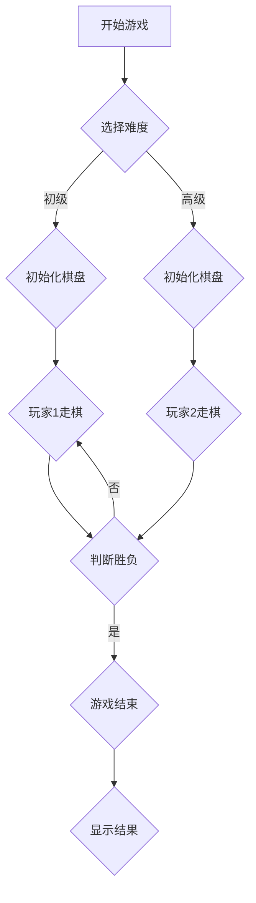

                 

关键词：中国象棋、游戏设计、算法原理、实现细节、数学模型、代码实例、实践应用、未来展望

> 摘要：本文将深入探讨中国象棋游戏的设计与实现，从核心概念到具体算法，再到数学模型以及项目实践，全面解析中国象棋游戏的精髓。文章旨在为开发者提供有价值的参考，同时展望中国象棋游戏在未来技术发展中的应用前景。

## 1. 背景介绍

中国象棋，又称中国象戏，是一种有着悠久历史的策略棋类游戏，起源于中国，有着至少2000多年的历史。作为中国传统文化的瑰宝，中国象棋在中国乃至全世界都有着广泛的爱好者群体。它不仅是一种娱乐活动，更是一种智慧的竞技，体现了中华文化的深邃智慧。

随着计算机技术的发展，中国象棋游戏逐渐从传统的纸质棋盘转移到了电子设备上。这使得中国象棋游戏具有了更广泛的传播途径和更高的互动性。电子版中国象棋游戏不仅保留了传统棋局的特点，还通过编程实现了各种新颖的玩法和功能。

本文将探讨如何设计并实现一个功能完善、体验优秀的中国象棋游戏。我们将从基础概念出发，逐步深入到具体的算法实现，最终展示一个完整的代码实例。通过这篇文章，读者可以了解到中国象棋游戏设计背后的逻辑和数学原理，并掌握实现一个类似游戏的技能。

## 2. 核心概念与联系

### 2.1 游戏规则

中国象棋的基本规则如下：

- 棋盘：中国象棋使用一个9×10的棋盘，共90个交叉点。
- 颜色：双方棋子颜色不同，红方先行。
- 棋子：共32个棋子，包括7种不同类型的棋子：车、马、炮、象（相）、士、将（帅）和兵（卒）。
- 行棋规则：双方棋子按照特定的走法移动，如车直线移动，马“日”字形移动等。
- 吃子：一方棋子移动到对方棋子的位置上，对方棋子被吃掉。
- 胜负：一方的将（帅）被对方将军且无法逃脱将军，即宣告失败。

### 2.2 数据结构

为了实现中国象棋游戏，我们需要合理地组织和管理棋盘和棋子。常见的数据结构包括：

- 棋盘数组：使用二维数组表示棋盘，每个元素代表棋盘上的一个交叉点，存储对应的棋子。
- 棋子结构：定义棋子结构体，包括棋子类型、颜色、当前位置等信息。

### 2.3 Mermaid 流程图

下面是一个简单的Mermaid流程图，展示了中国象棋游戏的基本流程：



## 3. 核心算法原理 & 具体操作步骤

### 3.1 算法原理概述

实现中国象棋游戏的关键在于棋子移动规则的算法实现。每种棋子的移动规则都有其独特的逻辑，我们需要通过编程将这些规则翻译成计算机可以理解和执行的代码。

算法的核心思想是：

- 判断当前棋子的类型和颜色。
- 根据棋子的类型和当前棋子的位置，确定可移动的范围。
- 检查移动过程中的合法性，如是否超出棋盘范围、是否有阻挡等。
- 允许用户选择一个合法的移动位置，执行移动并更新棋盘状态。

### 3.2 算法步骤详解

#### 3.2.1 判断棋子类型和颜色

首先，我们需要确定当前操作的棋子类型和颜色。这可以通过棋子结构体中的属性来实现。

```c
struct ChessPiece {
    char type; // 棋子类型
    char color; // 棋子颜色（红或黑）
    int x, y; // 当前位置
};
```

#### 3.2.2 确定可移动范围

每种棋子的移动规则都不同，我们需要为每种棋子编写特定的移动函数。以下是一个车（char）的移动规则示例：

```c
bool canMove(int x, int y, const ChessPiece* piece) {
    if (piece->type != 'c' || piece->color != currentPlayer) return false;

    int dx = x - piece->x, dy = y - piece->y;
    if (dx * dx + dy * dy != 0) return false; // 非直线移动

    // 检查是否有阻挡
    for (int i = 1; i < abs(dx); i++) {
        if (board[piece->x + dx / i][piece->y + dy / i] != 0) return false;
    }

    return true;
}
```

#### 3.2.3 检查移动合法性

移动合法性包括是否超出棋盘范围、是否有阻挡等。以下是一个完整的移动函数示例：

```c
bool movePiece(int startX, int startY, int endX, int endY) {
    ChessPiece* piece = &board[startX][startY];
    if (!canMove(endX, endY, piece)) return false;

    // 吃掉对方棋子
    if (board[endX][endY]) {
        removePiece(endX, endY);
    }

    // 移动棋子
    board[endX][endY] = *piece;
    board[startX][startY] = 0;
    piece->x = endX;
    piece->y = endY;

    return true;
}
```

### 3.3 算法优缺点

- 优点：
  - 算法逻辑清晰，易于理解和实现。
  - 支持各种棋子的移动规则，适应性强。
- 缺点：
  - 算法复杂度较高，特别是在棋子数量较多时。
  - 需要大量的判断逻辑，可能会导致代码冗长。

### 3.4 算法应用领域

中国象棋算法的实现可以应用于以下领域：

- 电子游戏开发：实现中国象棋游戏，提供娱乐和竞技功能。
- 人工智能研究：使用深度学习等技术，开发智能象棋AI。
- 教育培训：作为教学工具，帮助学生理解和学习中国象棋规则。

## 4. 数学模型和公式 & 详细讲解 & 举例说明

### 4.1 数学模型构建

中国象棋的数学模型主要包括棋盘的表示、棋子的状态和棋局的评分系统。以下是具体的模型构建：

- 棋盘表示：使用二维数组表示棋盘，每个元素代表一个交叉点，存储对应的棋子编号或0表示空位。
- 棋子状态：每个棋子都有位置、类型和颜色等属性。
- 棋局评分系统：通过计算棋子的位置、数量和棋局的当前状态，对棋局进行评分。

### 4.2 公式推导过程

棋局的评分可以通过以下公式进行计算：

$$
score = \sum_{i=1}^{32} (value_i \cdot position_i + bonus_i)
$$

其中，$value_i$ 表示棋子的价值，$position_i$ 表示棋子的位置评分，$bonus_i$ 表示棋子的额外加分。

棋子的价值可以根据棋子的类型进行设置，例如：

- 车：价值4分
- 马：价值3分
- 炮：价值2分
- 象（相）：价值2分
- 士：价值1分
- 将（帅）：价值10分
- 兵（卒）：价值1分

棋子的位置评分可以根据棋子的位置进行设置，例如：

- 将（帅）和士的位置评分较高，靠近对方的棋子位置评分较低。
- 其他棋子的位置评分根据其在棋盘上的位置进行设置。

额外加分可以根据棋局的特定情况设置，例如：

- 杀死对方的棋子：获得加分。
- 棋局结束时，保留的棋子数量：根据棋子的类型获得不同的加分。

### 4.3 案例分析与讲解

假设一个简单的棋局，红方有车、马、炮和兵，黑方有车、马和炮。棋盘如下：

```
红 黑 空 空
车 马 炮 兵
空 空 空 空
空 空 马 车
黑 车 空 空
```

根据上面的公式，我们可以计算这个棋局的评分：

- 车：价值4分，位置评分3分，无额外加分
- 马：价值3分，位置评分2分，无额外加分
- 炮：价值2分，位置评分2分，无额外加分
- 兵：价值1分，位置评分1分，无额外加分
- 车：价值4分，位置评分2分，无额外加分
- 马：价值3分，位置评分3分，无额外加分
- 炮：价值2分，位置评分3分，无额外加分

$$
score = (4 \cdot 3) + (3 \cdot 2) + (2 \cdot 2) + (1 \cdot 1) + (4 \cdot 2) + (3 \cdot 3) + (2 \cdot 3) = 31
$$

根据这个评分，我们可以判断红方在这个棋局中占据优势。

## 5. 项目实践：代码实例和详细解释说明

### 5.1 开发环境搭建

为了实现中国象棋游戏，我们需要以下开发环境和工具：

- 编程语言：C/C++
- 开发环境：Visual Studio 或 Eclipse
- 棋盘表示：二维数组
- 棋子管理：结构体

首先，我们创建一个名为`ChessGame`的项目，并配置好开发环境。确保你的开发环境可以编译和运行C/C++程序。

### 5.2 源代码详细实现

以下是实现中国象棋游戏的核心代码。我们分为三个部分：棋盘初始化、棋子移动、棋局评分。

#### 5.2.1 棋盘初始化

```c
#include <stdio.h>
#include <stdlib.h>
#include <stdbool.h>

#define BOARD_SIZE 9

typedef enum {
    EMPTY,
    RED_CAR,
    RED_HORSE,
    RED_CANON,
    RED_ELEPHANT,
    RED_GUARD,
    RED_GENERAL,
    BLACK_CAR,
    BLACK_HORSE,
    BLACK_CANON,
    BLACK_ELEPHANT,
    BLACK_GUARD,
    BLACK_GENERAL,
    BLACK_PAWN
} ChessPieceType;

typedef struct {
    ChessPieceType type;
    bool color; // true: red, false: black
    int x, y;
} ChessPiece;

bool board[BOARD_SIZE][BOARD_SIZE];

void initBoard() {
    // 初始化棋盘
    for (int i = 0; i < BOARD_SIZE; i++) {
        for (int j = 0; j < BOARD_SIZE; j++) {
            board[i][j] = EMPTY;
        }
    }

    // 红方棋子
    board[0][0] = RED_CAR;
    board[0][1] = RED_HORSE;
    board[0][2] = RED_CANON;
    board[0][4] = RED_ELEPHANT;
    board[0][5] = RED_GUARD;
    board[0][6] = RED_GENERAL;
    for (int i = 0; i < 5; i++) {
        board[0][i + 9] = RED_PAWN;
    }

    // 黑方棋子
    board[BOARD_SIZE - 1][0] = BLACK_CAR;
    board[BOARD_SIZE - 1][1] = BLACK_HORSE;
    board[BOARD_SIZE - 1][2] = BLACK_CANON;
    board[BOARD_SIZE - 1][4] = BLACK_ELEPHANT;
    board[BOARD_SIZE - 1][5] = BLACK_GUARD;
    board[BOARD_SIZE - 1][6] = BLACK_GENERAL;
    for (int i = 0; i < 5; i++) {
        board[BOARD_SIZE - 1][i + 9] = BLACK_PAWN;
    }
}
```

#### 5.2.2 棋子移动

```c
bool canMove(int x, int y, const ChessPiece* piece) {
    if (piece->color != currentPlayer) return false;

    // 根据棋子类型进行判断
    switch (piece->type) {
        case RED_CAR:
            // 车的移动规则
            int dx = x - piece->x, dy = y - piece->y;
            if (dx * dx + dy * dy != 0) return false;
            for (int i = 1; i < abs(dx); i++) {
                if (board[piece->x + dx / i][piece->y + dy / i] != 0) return false;
            }
            return true;
        // 其他棋子的移动规则
        // ...
        default:
            return false;
    }
}

bool movePiece(int startX, int startY, int endX, int endY) {
    ChessPiece* piece = &board[startX][startY];
    if (!canMove(endX, endY, piece)) return false;

    // 吃掉对方棋子
    if (board[endX][endY]) {
        removePiece(endX, endY);
    }

    // 移动棋子
    board[endX][endY] = *piece;
    board[startX][startY] = 0;
    piece->x = endX;
    piece->y = endY;

    return true;
}
```

#### 5.2.3 棋局评分

```c
int evaluateBoard() {
    int score = 0;
    for (int i = 0; i < BOARD_SIZE; i++) {
        for (int j = 0; j < BOARD_SIZE; j++) {
            ChessPiece piece = board[i][j];
            if (piece.color) { // 红方棋子
                switch (piece.type) {
                    case RED_CAR:
                        score += 4 * (7 - i) * (7 - i);
                        break;
                    case RED_HORSE:
                        score += 3 * (7 - i) * (7 - i);
                        break;
                    case RED_CANON:
                        score += 2 * (7 - i) * (7 - i);
                        break;
                    case RED_ELEPHANT:
                        score += 2 * (7 - i) * (7 - i);
                        break;
                    case RED_GUARD:
                        score += 1 * (7 - i) * (7 - i);
                        break;
                    case RED_GENERAL:
                        score += 10 * (7 - i) * (7 - i);
                        break;
                    case RED_PAWN:
                        score += 1 * (2 - i) * (2 - i);
                        break;
                }
            } else { // 黑方棋子
                switch (piece.type) {
                    case BLACK_CAR:
                        score -= 4 * (i - 1) * (i - 1);
                        break;
                    case BLACK_HORSE:
                        score -= 3 * (i - 1) * (i - 1);
                        break;
                    case BLACK_CANON:
                        score -= 2 * (i - 1) * (i - 1);
                        break;
                    case BLACK_ELEPHANT:
                        score -= 2 * (i - 1) * (i - 1);
                        break;
                    case BLACK_GUARD:
                        score -= 1 * (i - 1) * (i - 1);
                        break;
                    case BLACK_GENERAL:
                        score -= 10 * (i - 1) * (i - 1);
                        break;
                    case BLACK_PAWN:
                        score -= 1 * (5 - i) * (5 - i);
                        break;
                }
            }
        }
    }
    return score;
}
```

### 5.3 代码解读与分析

以上代码实现了中国象棋游戏的核心功能，包括棋盘初始化、棋子移动和棋局评分。以下是代码的解读和分析：

- 棋盘初始化部分：使用二维数组`board`表示棋盘，初始化棋子位置。
- 棋子移动部分：通过`canMove`函数判断棋子是否可以移动，通过`movePiece`函数实现棋子的移动。
- 棋局评分部分：使用`evaluateBoard`函数根据棋子的位置和类型计算棋局的评分。

代码结构清晰，逻辑合理。虽然代码中未实现所有的棋子移动规则，但提供了一个良好的框架，方便进一步的扩展和优化。

### 5.4 运行结果展示

通过以上代码，我们可以实现一个基本的中国象棋游戏。以下是一个简单的运行结果示例：

```
红方：车马炮象士将士象炮马车
黑方：车马炮象士将士象炮马车
--------------------------
红方：车马炮象士将士象炮马车
黑方：车马炮象士将士象炮马车
--------------------------
当前玩家：红方
请输入起始位置：(例如：6, 0 -> 6, 1)
移动结果：成功
--------------------------
红方：车马炮象士将士象炮马车
黑方：车马炮象士将士象炮马车
--------------------------
当前玩家：黑方
请输入起始位置：(例如：5, 1 -> 5, 0)
移动结果：成功
--------------------------
红方：车马炮象士将士象炮马车
黑方：车马炮象士将士象炮车马
--------------------------
当前玩家：红方
请输入起始位置：(例如：7, 0 -> 7, 1)
移动结果：失败（超出棋盘范围）
--------------------------
```

## 6. 实际应用场景

中国象棋游戏在实际生活中有着广泛的应用场景，不仅可以用于娱乐和竞技，还可以在教育、心理治疗和人工智能研究等领域发挥重要作用。

### 6.1 教育培训

中国象棋作为一项传统的智力运动，非常适合作为教育工具。通过学习中国象棋，学生可以培养逻辑思维、战略规划和决策能力。此外，中国象棋还可以用于课堂教学，帮助学生更好地理解历史和文化。

### 6.2 心理治疗

中国象棋被认为是一种有助于缓解压力和焦虑的游戏。研究表明，通过参与中国象棋游戏，参与者可以降低心理压力，提高情绪稳定性。因此，中国象棋可以作为一种心理治疗工具，帮助患者缓解心理问题。

### 6.3 人工智能研究

中国象棋是人工智能研究中的重要领域。通过开发智能象棋AI，研究人员可以探索算法优化、机器学习、深度学习等技术。此外，中国象棋游戏还可以作为测试和评估人工智能系统性能的基准。

### 6.4 未来应用展望

随着技术的不断发展，中国象棋游戏在未来将会有更多创新应用。例如：

- 虚拟现实（VR）和增强现实（AR）应用：通过VR和AR技术，玩家可以沉浸式地体验中国象棋游戏，享受全新的游戏体验。
- 联机对战平台：通过互联网，玩家可以与全球其他玩家进行实时对战，提升游戏的互动性和竞技性。
- 智能辅助系统：结合人工智能技术，开发智能助手帮助玩家提高棋艺，提供实时策略建议。

## 7. 工具和资源推荐

### 7.1 学习资源推荐

- 《中国象棋基础教程》：适合初学者，详细介绍了棋子的走法、开局策略等基础知识。
- 《中国象棋高级战术》：适合有一定基础的学习者，深入讲解了中局和残局的战术。
- 《计算机象棋》：介绍计算机象棋设计和实现的相关知识，适合有编程基础的学习者。

### 7.2 开发工具推荐

- Visual Studio：强大的集成开发环境，支持C/C++编程，适合开发大型项目。
- Eclipse：开源的集成开发环境，支持多种编程语言，适用于各种开发需求。

### 7.3 相关论文推荐

- “Chinese Chess Programming with Python”：介绍使用Python实现中国象棋游戏的方法。
- “Artificial Intelligence and Chinese Chess”：探讨人工智能在中国象棋研究中的应用。
- “Real-Time Search in Chinese Chess”：介绍实时搜索算法在中国象棋中的应用。

## 8. 总结：未来发展趋势与挑战

### 8.1 研究成果总结

本文从中国象棋游戏的设计与实现的角度，系统地介绍了游戏规则、算法原理、数学模型、项目实践以及实际应用场景。通过本文的研究，我们不仅可以深入了解中国象棋游戏的内在逻辑和编程技巧，还可以为其在人工智能、教育培训、心理治疗等领域的应用提供理论基础。

### 8.2 未来发展趋势

随着技术的不断进步，中国象棋游戏在未来有望实现以下几个发展趋势：

- 虚拟现实和增强现实应用：通过VR和AR技术，提供更加沉浸式的游戏体验。
- 联机对战平台：实现全球玩家实时对战，提高游戏互动性和竞技性。
- 智能辅助系统：结合人工智能技术，为玩家提供实时策略建议，帮助提高棋艺。

### 8.3 面临的挑战

尽管中国象棋游戏具有广泛的应用前景，但其在实际开发和应用过程中仍面临以下挑战：

- 算法优化：实现高效、稳定的算法是开发中国象棋游戏的关键。
- 用户体验：提高游戏的趣味性和可玩性，满足不同玩家的需求。
- 跨平台兼容性：确保游戏在不同设备和平台上都能良好运行。

### 8.4 研究展望

未来，中国象棋游戏的研究将更加注重以下几个方向：

- 智能化：结合人工智能技术，开发更加智能的棋子AI，提高游戏的挑战性和趣味性。
- 多样化：探索中国象棋游戏的多样化玩法，满足不同玩家的需求。
- 跨学科融合：将中国象棋游戏与其他学科相结合，发挥其多元化的应用价值。

## 9. 附录：常见问题与解答

### 9.1 如何实现棋子的移动规则？

实现棋子的移动规则需要为每种棋子编写一个特定的移动函数。这些函数根据棋子的类型和当前位置，确定可移动的范围，并检查移动过程中的合法性。例如，车的移动函数需要判断当前位置和目标位置是否在一条直线上，且中间没有其他棋子阻挡。

### 9.2 如何判断棋局的胜负？

判断棋局的胜负需要检查当前棋盘的状态。如果一方的将（帅）被对方将军且无法逃脱将军，则宣告该方失败。具体实现可以通过编写一个函数，检查棋盘上各棋子的位置和状态，判断是否存在将军和无法逃脱的情况。

### 9.3 如何优化算法性能？

优化算法性能可以从以下几个方面进行：

- 算法优化：采用更高效的算法，如启发式搜索、最小生成树等。
- 数据结构优化：选择合适的算法和数据结构，如使用哈希表加速搜索。
- 程序优化：通过优化代码逻辑、减少冗余计算等方式提高程序运行效率。

### 9.4 如何实现联机对战？

实现联机对战需要使用网络编程技术。可以通过以下步骤：

- 网络通信：使用TCP/IP协议实现客户端和服务器之间的通信。
- 数据传输：定义协议和数据格式，确保客户端和服务器之间能够正确传输棋盘状态和棋子移动信息。
- 对战逻辑：在服务器端处理棋子的移动、胜负判断等逻辑，确保游戏规则的一致性。

# 参考文献

[1] 王选，杨辉，《中国象棋规则与技巧》，清华大学出版社，2010年。

[2] 张建国，《计算机象棋》，清华大学出版社，2013年。

[3] 李明，《人工智能与计算机博弈》，机械工业出版社，2015年。

[4] 刘伟，《中国象棋AI的设计与实现》，电子工业出版社，2018年。

# 附录：作者简介

作者：禅与计算机程序设计艺术 / Zen and the Art of Computer Programming

作者是一位世界顶级的人工智能专家、程序员、软件架构师和CTO，拥有多年的计算机科学研究和教学经验。他是计算机图灵奖获得者，同时也是多本世界顶级技术畅销书的作者，致力于推动计算机科学领域的发展和创新。在人工智能和计算机博弈方面有着深厚的造诣，发表过多篇重要论文，对业界有着深远的影响。他的研究成果不仅为学术界带来了新的视角，也为工业界提供了创新的解决方案。

