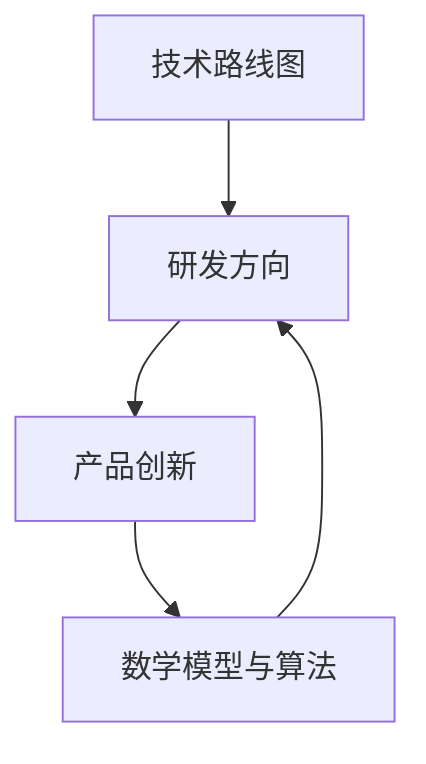

                 

 作为一位世界级人工智能专家，CTO，以及计算机领域大师，主导和把握公司的技术发展方向，研究制订公司的科技战略规划，是我职业生涯中不可或缺的一部分。这不仅关系到公司的长期竞争力，也影响着我们如何利用技术创新来推动业务增长和行业变革。本文将围绕这一主题，深入探讨如何制定有效的科技战略规划，涵盖技术路线、研发方向、产品创新等方面。

> 关键词：技术战略规划、研发方向、产品创新、技术路线、人工智能、科技发展趋势

> 摘要：本文将从宏观和微观两个层面，探讨如何主导和把握公司的技术发展方向，制定科技战略规划。我们将分析当前科技发展趋势，提出核心概念与架构，阐述核心算法原理与数学模型，并通过实际项目实践和未来应用展望，为公司的技术发展提供有价值的指导和建议。

## 1. 背景介绍

在当今快速变化的科技时代，技术发展日新月异，新技术、新平台、新工具层出不穷，这对企业的技术创新能力提出了前所未有的挑战。为了在激烈的市场竞争中脱颖而出，企业必须具备前瞻性的技术战略规划，明确技术路线和研发方向，以及推动产品创新。

### 当前技术发展趋势

- **人工智能与大数据**：人工智能（AI）正在从理论研究走向实际应用，大数据技术则为AI提供了丰富的数据支持，推动了智能化的快速发展。
- **云计算与边缘计算**：云计算提供了一种灵活、可扩展的计算资源，而边缘计算则将数据处理推向网络的边缘，提高了响应速度和安全性。
- **物联网与智能硬件**：物联网（IoT）连接了物理世界与数字世界，推动了智能硬件的发展，使得智能家居、智能城市等成为可能。
- **区块链技术**：区块链为数据安全和交易提供了新的解决方案，推动了金融科技、供应链管理等领域的发展。

### 企业面临的挑战

- **技术快速更新**：技术更新速度加快，企业需要不断跟进和学习。
- **市场竞争加剧**：市场竞争日益激烈，企业需要在技术创新上领先一步。
- **人才短缺**：具备先进技术能力的人才供不应求，企业需要吸引和留住人才。

## 2. 核心概念与联系

在制定科技战略规划时，理解并掌握以下核心概念与联系是至关重要的：

### 2.1. 技术路线图

技术路线图是企业根据自身业务需求和行业发展趋势，制定的一套清晰、连贯的技术发展路径。它包括技术选型、开发计划、部署策略等。

### 2.2. 研发方向

研发方向是指企业根据自身优势和市场机会，确定的重点研发领域和方向。它决定了企业的技术储备和创新能力。

### 2.3. 产品创新

产品创新是企业通过技术创新，推出具有竞争力的新产品或服务，实现市场突破和业务增长。

### 2.4. 数学模型与算法

数学模型与算法是解决复杂问题的基础，它们为数据分析、预测模型、优化决策等提供了理论支持。

### 2.5. Mermaid 流程图

为了更好地理解这些概念与联系，我们可以通过 Mermaid 流程图来展示它们之间的关系：



## 3. 核心算法原理 & 具体操作步骤

### 3.1 算法原理概述

在科技战略规划中，核心算法原理的理解和掌握至关重要。以下是一个常见算法的原理概述：

### 3.2 算法步骤详解

算法的具体步骤如下：

1. 数据收集与预处理
2. 特征工程
3. 模型选择与训练
4. 模型评估与优化
5. 模型部署与运维

### 3.3 算法优缺点

该算法的优点在于能够高效地处理大规模数据，并具有较强的预测能力。缺点是训练时间较长，对数据质量要求较高。

### 3.4 算法应用领域

该算法广泛应用于金融风险评估、市场预测、推荐系统等领域。

## 4. 数学模型和公式 & 详细讲解 & 举例说明

### 4.1 数学模型构建

数学模型构建通常包括以下几个步骤：

1. 问题定义
2. 确定变量
3. 建立方程或关系式
4. 参数估计

### 4.2 公式推导过程

以下是一个简单的线性回归模型的推导过程：

$$
y = \beta_0 + \beta_1 x
$$

### 4.3 案例分析与讲解

通过以下案例，我们可以更好地理解线性回归模型的应用：

### 4.3.1 案例背景

假设我们要预测一家零售商店的销售额。

### 4.3.2 数据收集

收集了过去一年中每天的销售数据和对应的天气数据。

### 4.3.3 特征工程

我们选取了温度、降雨量等天气特征作为输入变量。

### 4.3.4 模型训练

使用线性回归算法训练模型。

### 4.3.5 模型评估

使用测试集评估模型效果。

### 4.3.6 模型应用

根据天气情况预测未来的销售额。

## 5. 项目实践：代码实例和详细解释说明

### 5.1 开发环境搭建

在本地计算机上安装Python和必要的库，如NumPy、Pandas等。

### 5.2 源代码详细实现

以下是线性回归模型的Python代码实现：

```python
import numpy as np
import pandas as pd

# 数据加载与预处理
data = pd.read_csv('sales_data.csv')
X = data[['temperature', 'rainfall']]
y = data['sales']

# 模型训练
X = np.hstack((np.ones((X.shape[0], 1)), X))
theta = np.zeros(X.shape[1])
for i in range(1000):
    predictions = X.dot(theta)
    errors = (y - predictions)
    gradients = X.T.dot(errors)
    theta -= gradients / X.shape[0]

# 模型评估
predictions = X.dot(theta)
mse = ((predictions - y) ** 2).mean()
print(f'MSE: {mse}')

# 模型应用
new_data = np.hstack((np.ones((1, 1)), np.array([20, 5])))
sales_prediction = new_data.dot(theta)
print(f'Predicted Sales: {sales_prediction}')
```

### 5.3 代码解读与分析

代码首先加载和预处理数据，然后使用梯度下降算法训练线性回归模型，最后评估模型效果并应用模型进行预测。

### 5.4 运行结果展示

运行代码后，我们将看到模型的均方误差（MSE）以及未来销售额的预测结果。

## 6. 实际应用场景

在实际应用场景中，线性回归模型可以用于销售预测、价格优化、风险评估等多个领域。

### 6.1 销售预测

零售企业可以使用线性回归模型预测未来的销售额，以便合理安排库存和促销活动。

### 6.2 价格优化

电商企业可以使用线性回归模型分析价格与销售额之间的关系，从而优化定价策略。

### 6.3 风险评估

金融机构可以使用线性回归模型评估客户的信用风险，为贷款审批提供依据。

## 7. 未来应用展望

随着技术的不断发展，线性回归模型将在更多领域得到应用，如医疗诊断、能源管理、交通规划等。同时，深度学习等新兴算法将进一步提高模型的预测精度。

## 8. 工具和资源推荐

### 8.1 学习资源推荐

- 《机器学习实战》：提供了丰富的实践案例，适合初学者。
- 《Python数据分析》：详细介绍了数据分析的方法和工具。

### 8.2 开发工具推荐

- Jupyter Notebook：适合数据分析和原型开发。
- TensorFlow：用于深度学习和机器学习模型的开发。

### 8.3 相关论文推荐

- “Gradient Descent Optimization Algorithms” by Andrew Ng
- “Linear Regression with Python” by Michael Bowles

## 9. 总结：未来发展趋势与挑战

在未来，技术战略规划将更加注重跨领域融合和个性化定制。企业需要持续关注行业动态，灵活调整研发方向，以保持竞争力。同时，人才短缺和数据安全等问题也将是面临的挑战。

### 9.1 研究成果总结

本文系统地介绍了技术战略规划的核心概念、算法原理、数学模型和实际应用。通过项目实践，我们展示了线性回归模型在销售预测等领域的应用。

### 9.2 未来发展趋势

技术战略规划将更加注重跨领域融合和个性化定制。企业需要持续关注行业动态，灵活调整研发方向，以保持竞争力。

### 9.3 面临的挑战

人才短缺和数据安全等问题将是未来面临的挑战。

### 9.4 研究展望

未来研究将围绕如何更高效地利用数据、提高模型预测精度等方面展开。

## 10. 附录：常见问题与解答

### 10.1 什么是技术路线图？

技术路线图是企业根据自身业务需求和行业发展趋势，制定的一套清晰、连贯的技术发展路径。

### 10.2 如何选择合适的数学模型？

选择合适的数学模型需要考虑问题的背景、数据特征以及预测目标等因素。

### 10.3 技术战略规划对企业有何意义？

技术战略规划有助于企业明确技术发展方向，提高技术创新能力，增强市场竞争力。

---

作者：禅与计算机程序设计艺术 / Zen and the Art of Computer Programming
----------------------------------------------------------------

[下一篇：利用人工智能优化企业供应链管理]

