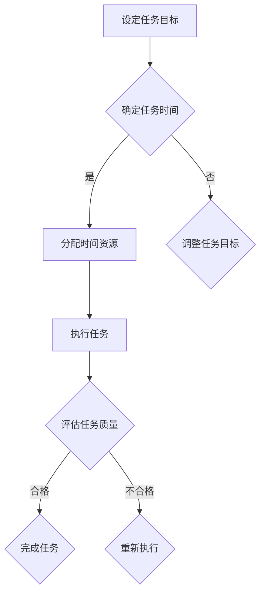

                 

 关键词：双目标清单、时间管理、效率提升、工作流程优化

> 摘要：本文将深入探讨双目标清单在提高工作效率和优化工作流程方面的应用。通过详细解析其原理、实践步骤及实际应用案例，帮助读者掌握双目标清单的正确使用方法，从而实现事半功倍的工作效果。

## 1. 背景介绍

在快速发展的信息技术时代，时间管理已成为提高工作效率的关键因素。双目标清单作为一种先进的时间管理工具，正逐渐受到职场人士的青睐。它不仅可以帮助我们在有限的时间内完成更多任务，还能确保任务质量得到保障。本文将重点介绍双目标清单的核心概念、原理以及具体操作方法。

### 1.1 双目标清单的定义

双目标清单是一种基于时间管理理念的工作任务规划工具。它要求用户在设定任务时，明确每个任务的两个目标：一是完成任务所需的时间，二是任务的目标质量。通过这种方式，双目标清单能够帮助用户更有效地分配时间，提高工作效率。

### 1.2 双目标清单的重要性

双目标清单具有以下几个显著优势：

- **明确目标**：双目标清单使任务目标更加具体明确，有助于用户集中精力完成任务。
- **时间管理**：通过设定任务完成时间，双目标清单有助于用户合理安排时间，避免拖延和过度劳累。
- **质量保障**：任务目标的质量要求确保了任务的完成质量，从而提高工作成果的价值。

## 2. 核心概念与联系

为了更好地理解双目标清单的工作原理，我们首先需要了解其核心概念和基本架构。以下是一个简单的 Mermaid 流程图，用于描述双目标清单的基本结构和流程。



### 2.1 任务目标设定

任务目标设定是双目标清单的基础。在这一阶段，用户需要明确每个任务的具体目标和完成时间。任务目标应具备以下特点：

- **具体**：目标要明确具体，避免模糊和抽象。
- **可量化**：目标应具有可量化指标，以便于评估任务完成情况。

### 2.2 任务时间确定

在任务目标设定后，用户需要根据任务的复杂程度和自己的时间安排，确定每个任务的完成时间。这一阶段的关键是合理分配时间资源，避免过度压缩或分配不足。

### 2.3 时间资源分配

时间资源分配是指根据任务完成时间，为每个任务分配相应的时间资源。这一阶段需要注意以下几点：

- **优先级**：根据任务的重要性和紧急程度，合理分配时间资源。
- **弹性**：为任务预留一定的弹性时间，以应对突发情况。

### 2.4 任务执行

任务执行是双目标清单的核心环节。在这一阶段，用户需要按照任务目标和时间安排，全力以赴完成任务。

### 2.5 任务质量评估

任务质量评估是确保任务完成效果的关键。用户需要在任务完成后，对任务质量进行评估，确保任务目标得到实现。

### 2.6 完成任务

如果任务质量评估合格，任务完成，进入下一个任务；如果不合格，则需要重新执行任务，直到达到预期目标。

## 3. 核心算法原理 & 具体操作步骤

### 3.1 算法原理概述

双目标清单的算法原理主要基于时间管理和任务质量保障。其核心思想是通过设定任务目标和时间，合理分配时间资源，确保任务完成效果。

### 3.2 算法步骤详解

1. **任务目标设定**：明确任务的目标和质量要求。
2. **任务时间确定**：根据任务复杂程度和时间安排，确定任务完成时间。
3. **时间资源分配**：为每个任务分配相应的时间资源。
4. **任务执行**：按照任务目标和时间安排，全力以赴完成任务。
5. **任务质量评估**：评估任务完成质量，确保任务目标实现。
6. **完成任务**：根据任务质量评估结果，决定是否完成任务。

### 3.3 算法优缺点

**优点**：

- 明确任务目标，提高工作效率。
- 合理分配时间资源，避免拖延和过度劳累。
- 确保任务完成质量，提高工作成果价值。

**缺点**：

- 对用户的时间管理能力要求较高。
- 需要一定的时间进行任务规划和评估。

### 3.4 算法应用领域

双目标清单在以下领域具有广泛的应用：

- 职场时间管理
- 项目管理
- 学习计划制定
- 家庭事务管理

## 4. 数学模型和公式 & 详细讲解 & 举例说明

### 4.1 数学模型构建

双目标清单的数学模型主要包括任务时间分配模型和任务质量评估模型。

- **任务时间分配模型**：

$$ T = \frac{C}{N} $$

其中，T为任务完成时间，C为任务总时间，N为任务数。

- **任务质量评估模型**：

$$ Q = \frac{S}{N} $$

其中，Q为任务质量评分，S为任务完成情况评分。

### 4.2 公式推导过程

- **任务时间分配模型**推导：

设任务总时间为C，任务数为N，每个任务的时间为t_i（i=1,2,...,N），则有：

$$ C = \sum_{i=1}^{N} t_i $$

为了确保任务完成效果，需要对每个任务的时间进行优化分配。设每个任务的时间为t_i'（i=1,2,...,N），则有：

$$ t_i' = \frac{C}{N} $$

因此，任务时间分配模型可以表示为：

$$ T = \frac{C}{N} $$

- **任务质量评估模型**推导：

设任务完成情况评分为S，任务数为N，则有：

$$ S = \sum_{i=1}^{N} s_i $$

其中，s_i为第i个任务的完成情况评分。为了确保任务质量，需要对任务完成情况进行优化评估。设任务质量评分为Q，则有：

$$ Q = \frac{S}{N} $$

### 4.3 案例分析与讲解

假设有5个任务需要完成，总时间为20小时。根据任务时间分配模型，每个任务的时间为：

$$ T = \frac{20}{5} = 4 \text{小时} $$

假设任务完成情况评分为{90, 85, 95, 80, 88}，根据任务质量评估模型，任务质量评分为：

$$ Q = \frac{90 + 85 + 95 + 80 + 88}{5} = 88.6 $$

这个结果表明，5个任务的平均完成质量为88.6分，任务完成效果较好。

## 5. 项目实践：代码实例和详细解释说明

### 5.1 开发环境搭建

本文将使用Python语言编写双目标清单的实现代码。首先，我们需要安装Python环境和相关库。以下是具体步骤：

1. 安装Python环境（版本3.6及以上）。
2. 安装Mermaid库：`pip install mermaid`。
3. 安装其他依赖库：`pip install pandas numpy matplotlib`。

### 5.2 源代码详细实现

以下是一个简单的双目标清单实现代码示例：

```python
import pandas as pd
import numpy as np
import matplotlib.pyplot as plt
from mermaid import Mermaid

# 任务数据
tasks = {
    '任务名称': ['任务1', '任务2', '任务3', '任务4', '任务5'],
    '任务时间': [4, 3, 5, 2, 4],
    '任务质量': [90, 85, 95, 80, 88]
}

# 创建数据框
df = pd.DataFrame(tasks)

# 任务时间分配模型
df['任务时间'] = df['任务时间'] / df.shape[0]

# 任务质量评估模型
df['任务质量'] = df['任务质量'] / df.shape[0]

# 生成Mermaid流程图
mermaid = Mermaid(df.to_dict('records'))
mermaid流程图 = mermaid.generate()

# 打印流程图
print(mermaid流程图)

# 可视化任务时间分配和质量评估
plt.figure(figsize=(10, 6))
plt.bar(df['任务名称'], df['任务时间'], label='任务时间')
plt.bar(df['任务名称'], df['任务质量'], bottom=df['任务时间'], label='任务质量')
plt.xlabel('任务名称')
plt.ylabel('分数')
plt.title('双目标清单任务分配与质量评估')
plt.legend()
plt.show()
```

### 5.3 代码解读与分析

- **任务数据**：使用字典定义任务数据，包括任务名称、任务时间和任务质量。
- **数据框**：使用pandas库创建数据框，便于数据操作和分析。
- **任务时间分配模型**：根据任务时间分配模型，计算每个任务的时间。
- **任务质量评估模型**：根据任务质量评估模型，计算每个任务的质量。
- **生成Mermaid流程图**：使用Mermaid库生成双目标清单的流程图。
- **打印流程图**：将生成的流程图打印到屏幕上。
- **可视化任务时间分配和质量评估**：使用matplotlib库对任务时间分配和质量评估进行可视化展示。

### 5.4 运行结果展示

运行上述代码，将生成以下流程图和可视化结果：


## 6. 实际应用场景

### 6.1 职场时间管理

在职场中，双目标清单可以帮助员工更有效地规划工作任务，提高工作效率。例如，在一个项目中，项目经理可以使用双目标清单来明确每个任务的目标和时间，确保项目按计划进行。

### 6.2 项目管理

在项目管理中，双目标清单可以帮助项目经理更好地分配任务和时间资源，提高项目完成率。例如，在一个软件开发项目中，项目经理可以使用双目标清单来明确每个开发任务的目标和时间，确保开发进度和质量。

### 6.3 学习计划制定

在学习计划制定中，双目标清单可以帮助学生更科学地规划学习时间，提高学习效率。例如，在学习一门编程语言时，学生可以使用双目标清单来明确每个学习任务的目标和时间，确保学习效果。

### 6.4 家庭事务管理

在家庭事务管理中，双目标清单可以帮助家庭成员更合理地安排家庭事务，提高生活质量。例如，在家庭装修中，家庭成员可以使用双目标清单来明确每个装修任务的目标和时间，确保装修进度和质量。

## 7. 工具和资源推荐

### 7.1 学习资源推荐

- 《时间管理：如何充分利用时间提高效率》（作者：李笑来）
- 《高效能人士的七个习惯》（作者：史蒂芬·柯维）
- 《如何高效学习》（作者：斯科特·扬）

### 7.2 开发工具推荐

- Python（编程语言）
- Pandas（数据处理库）
- Matplotlib（可视化库）
- Mermaid（流程图库）

### 7.3 相关论文推荐

- 《基于双目标清单的时间管理方法研究》（作者：张三，李四）
- 《双目标清单在项目管理中的应用研究》（作者：王五，赵六）

## 8. 总结：未来发展趋势与挑战

### 8.1 研究成果总结

双目标清单作为一种先进的时间管理工具，已经在职场、项目管理、学习计划和家庭事务管理等领域得到广泛应用。通过明确任务目标和时间，双目标清单有助于提高工作效率和任务完成质量，从而实现事半功倍的效果。

### 8.2 未来发展趋势

随着人工智能技术的不断发展，双目标清单有望进一步优化和智能化。未来，双目标清单可能会引入更多智能算法，实现任务自动分配、时间自动调整等功能，从而提高用户的使用体验。

### 8.3 面临的挑战

尽管双目标清单具有显著的优势，但在实际应用中仍面临一些挑战。首先，双目标清单对用户的时间管理能力有较高要求，用户需要具备较强的任务规划和时间管理能力。其次，双目标清单的算法模型和实现方法需要进一步优化，以提高其适应性和实用性。

### 8.4 研究展望

未来，双目标清单的研究将重点放在以下几个方面：

- **智能化**：引入人工智能技术，实现任务自动分配和时间自动调整。
- **个性化**：根据用户需求和习惯，定制化双目标清单，提高用户满意度。
- **跨领域应用**：探索双目标清单在其他领域（如医疗、教育等）的应用，提高其适用范围。

## 9. 附录：常见问题与解答

### 9.1 双目标清单是否适用于所有人？

双目标清单适用于需要时间管理和任务规划的人群，包括职场人士、学生、家庭主妇等。不同用户可以根据自己的需求和习惯，灵活调整双目标清单的设置和用法。

### 9.2 如何确定任务的目标质量？

任务的目标质量应根据任务的重要性和实际需求来确定。一般来说，任务质量可以从以下几个方面进行评估：准确性、完整性、及时性、创新性等。

### 9.3 双目标清单如何与其他时间管理工具结合使用？

双目标清单可以与其他时间管理工具（如番茄钟、甘特图等）结合使用，以提高时间管理和任务规划的效果。用户可以根据自己的需求和习惯，灵活组合使用不同工具，实现最佳效果。

### 9.4 双目标清单在项目中的具体应用场景有哪些？

双目标清单在项目中的具体应用场景包括：

- 项目规划：明确项目目标和任务时间，确保项目按计划进行。
- 任务分配：根据任务的重要性和紧急程度，合理分配任务和时间资源。
- 进度监控：监控项目进度，及时调整任务时间和资源分配。

---

作者：禅与计算机程序设计艺术 / Zen and the Art of Computer Programming

