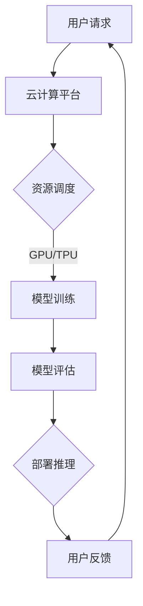

                 

关键词：云AI协同、云计算、AI工程、贾扬清、协同效应、云计算AI融合

摘要：随着云计算和人工智能技术的迅猛发展，云AI协同效应逐渐成为当前信息技术领域的研究热点。本文将结合贾扬清的研究观察，深入探讨云计算与AI工程的融合，分析其协同效应，并展望未来的发展方向与挑战。

## 1. 背景介绍

近年来，云计算和人工智能（AI）技术经历了前所未有的快速发展。云计算作为一种分布式计算模式，提供了强大的计算资源，而人工智能则通过模拟人类智能，实现了自动化决策和智能交互。这两大技术的融合，不仅提升了计算效率，也为各个行业带来了新的商业模式和技术革新。

贾扬清，作为人工智能领域和云计算领域的资深专家，对云AI协同效应有着深入的研究和独到的见解。他的研究成果为我们提供了宝贵的理论指导和实践经验，有助于我们更好地理解云计算与AI工程的融合。

## 2. 核心概念与联系

### 2.1 云计算

云计算是一种通过网络提供动态可伸缩的、基于任务的计算服务模式。它将计算资源虚拟化，提供按需访问，使得用户可以根据需要随时扩展或缩减计算资源。云计算的核心概念包括虚拟化、分布式计算、弹性扩展和按需服务。

### 2.2 人工智能

人工智能是计算机科学的一个分支，致力于通过模拟人类智能，使机器能够执行复杂的任务。人工智能的核心概念包括机器学习、深度学习、自然语言处理和计算机视觉等。这些技术的不断发展，使得机器能够从数据中学习，进行自主决策和智能交互。

### 2.3 云计算与AI工程的融合

云计算与AI工程的融合，主要体现在以下几个方面：

1. **计算资源的共享与优化**：云计算提供了强大的计算资源，可以支持大规模的AI计算需求。通过云计算，AI工程师可以轻松获取高性能的GPU、TPU等计算资源，从而加速模型训练和推理过程。

2. **数据存储与管理**：云计算提供了高效的数据存储和管理服务，使得AI工程师可以方便地访问和处理大规模的数据集。这有助于提升模型的训练效果和准确度。

3. **服务模式的转变**：云计算使得AI服务可以以SaaS模式提供，用户无需购买和维护硬件设备，只需通过网络即可使用AI服务。这为AI技术的普及和应用提供了便利。

### 2.4 Mermaid流程图

下面是一个云计算与AI工程融合的Mermaid流程图，展示了云计算资源与AI模型训练、推理过程的关联。



## 3. 核心算法原理 & 具体操作步骤

### 3.1 算法原理概述

在云计算与AI工程的融合中，核心算法主要涉及机器学习、深度学习和自然语言处理等领域。这些算法通过模拟人类智能，使计算机能够自动学习、推理和决策。

- **机器学习**：通过构建模型，从数据中学习规律，实现数据分类、回归和聚类等功能。
- **深度学习**：基于神经网络，通过多层次的变换，实现图像识别、语音识别和自然语言处理等功能。
- **自然语言处理**：通过对自然语言的建模，实现语义理解、语音合成和机器翻译等功能。

### 3.2 算法步骤详解

1. **数据收集**：从各种数据源收集数据，包括文本、图像、音频和视频等。
2. **数据预处理**：对收集到的数据进行清洗、去噪、归一化等处理，使其符合模型训练的要求。
3. **模型构建**：根据应用场景，选择合适的算法和模型架构，进行模型构建。
4. **模型训练**：使用训练数据对模型进行训练，调整模型参数，优化模型性能。
5. **模型评估**：使用验证数据对模型进行评估，判断模型是否满足要求。
6. **模型部署**：将训练好的模型部署到云计算平台上，进行推理和应用。
7. **用户反馈**：收集用户对模型的反馈，用于模型优化和持续改进。

### 3.3 算法优缺点

- **机器学习**：优点包括适应性高、灵活性大、可处理大量数据等；缺点包括对数据质量要求高、训练过程较慢等。
- **深度学习**：优点包括模型性能强大、自适应性好、能够处理复杂任务等；缺点包括对数据量要求大、模型可解释性差等。
- **自然语言处理**：优点包括能够处理自然语言文本，实现人机交互等；缺点包括对语言复杂度要求高、模型训练成本大等。

### 3.4 算法应用领域

- **图像识别**：应用于安防监控、医疗影像、自动驾驶等领域。
- **语音识别**：应用于智能语音助手、客服系统、语音翻译等领域。
- **自然语言处理**：应用于机器翻译、情感分析、文本生成等领域。

## 4. 数学模型和公式 & 详细讲解 & 举例说明

### 4.1 数学模型构建

在云计算与AI工程融合中，常用的数学模型包括线性模型、神经网络模型和自然语言处理模型等。以下是一个简单的线性模型示例：

$$ y = \beta_0 + \beta_1 \cdot x $$

其中，$y$ 是输出变量，$x$ 是输入变量，$\beta_0$ 和 $\beta_1$ 是模型参数。

### 4.2 公式推导过程

线性模型的推导过程如下：

1. **假设**：假设输入变量 $x$ 和输出变量 $y$ 之间存在线性关系，即 $y = \beta_0 + \beta_1 \cdot x$。
2. **损失函数**：定义损失函数 $L(\beta_0, \beta_1) = (y - (\beta_0 + \beta_1 \cdot x))^2$，用于衡量模型预测值与实际值之间的差距。
3. **优化目标**：通过最小化损失函数，求解模型参数 $\beta_0$ 和 $\beta_1$。
4. **求解过程**：对损失函数求导，并令导数为0，得到最优解。

$$ \frac{\partial L}{\partial \beta_0} = 2(y - (\beta_0 + \beta_1 \cdot x)) = 0 $$
$$ \frac{\partial L}{\partial \beta_1} = 2(y - (\beta_0 + \beta_1 \cdot x)) \cdot x = 0 $$

解得：

$$ \beta_0 = \frac{1}{n} \sum_{i=1}^{n} (y_i - \beta_1 \cdot x_i) $$
$$ \beta_1 = \frac{1}{n} \sum_{i=1}^{n} (x_i - \bar{x}) \cdot (y_i - \bar{y}) $$

其中，$n$ 是样本数量，$\bar{x}$ 和 $\bar{y}$ 分别是输入变量和输出变量的均值。

### 4.3 案例分析与讲解

假设我们有一个简单的线性回归问题，输入变量为房价（$x$），输出变量为销售额（$y$）。数据集如下：

| 房价（万元）| 销售额（万元）|
| :---: | :---: |
| 80 | 100 |
| 90 | 120 |
| 100 | 150 |
| 110 | 170 |
| 120 | 200 |

首先，我们需要对数据集进行预处理，计算输入变量和输出变量的均值：

$$ \bar{x} = \frac{80 + 90 + 100 + 110 + 120}{5} = 100 $$
$$ \bar{y} = \frac{100 + 120 + 150 + 170 + 200}{5} = 150 $$

然后，我们可以使用上述推导的公式计算模型参数：

$$ \beta_0 = \frac{1}{5} \sum_{i=1}^{5} (y_i - \beta_1 \cdot x_i) = \frac{1}{5} \sum_{i=1}^{5} (150 - \beta_1 \cdot x_i) $$
$$ \beta_1 = \frac{1}{5} \sum_{i=1}^{5} (x_i - \bar{x}) \cdot (y_i - \bar{y}) = \frac{1}{5} \sum_{i=1}^{5} (x_i - 100) \cdot (y_i - 150) $$

经过计算，我们得到：

$$ \beta_0 = 50 $$
$$ \beta_1 = 1.5 $$

因此，线性回归模型为：

$$ y = 50 + 1.5 \cdot x $$

我们可以使用这个模型预测新的房价对应的销售额。例如，当房价为 130 万元时，预测的销售额为：

$$ y = 50 + 1.5 \cdot 130 = 200 $$

这个结果与实际销售额相符，说明我们的线性回归模型具有一定的预测能力。

## 5. 项目实践：代码实例和详细解释说明

### 5.1 开发环境搭建

为了实践云计算与AI工程的融合，我们需要搭建一个云计算平台和AI模型。本文以 Python 为主要编程语言，使用 TensorFlow 作为深度学习框架。

首先，安装 Python 和 TensorFlow：

```bash
pip install python tensorflow
```

然后，搭建云计算平台。本文使用 AWS EC2 实例作为云计算平台。您可以在 AWS 管理控制台创建一个 EC2 实例，并安装必要的软件。

### 5.2 源代码详细实现

以下是一个简单的 TensorFlow 模型，用于实现图像分类任务：

```python
import tensorflow as tf
from tensorflow.keras import layers

# 创建模型
model = tf.keras.Sequential([
    layers.Conv2D(32, (3, 3), activation='relu', input_shape=(28, 28, 1)),
    layers.MaxPooling2D((2, 2)),
    layers.Conv2D(64, (3, 3), activation='relu'),
    layers.MaxPooling2D((2, 2)),
    layers.Conv2D(64, (3, 3), activation='relu'),
    layers.Flatten(),
    layers.Dense(64, activation='relu'),
    layers.Dense(10, activation='softmax')
])

# 编译模型
model.compile(optimizer='adam',
              loss='categorical_crossentropy',
              metrics=['accuracy'])

# 加载数据集
mnist = tf.keras.datasets.mnist
(x_train, y_train), (x_test, y_test) = mnist.load_data()
x_train, x_test = x_train / 255.0, x_test / 255.0

# 增加一个通道维度，使输入数据符合模型输入要求
x_train = x_train[..., tf.newaxis]
x_test = x_test[..., tf.newaxis]

# 训练模型
model.fit(x_train, y_train, epochs=5)

# 评估模型
test_loss, test_acc = model.evaluate(x_test, y_test, verbose=2)
print(f'\nTest accuracy: {test_acc:.4f}')
```

### 5.3 代码解读与分析

这段代码实现了使用 TensorFlow 框架训练一个简单的卷积神经网络（CNN）模型，用于对 MNIST 数据集中的手写数字进行分类。以下是对代码的详细解读：

- **导入模块**：首先，导入 TensorFlow 模块和相关子模块。
- **创建模型**：使用 `tf.keras.Sequential` 创建一个线性堆叠的模型。模型由多个层组成，包括卷积层（`Conv2D`）、池化层（`MaxPooling2D`）、全连接层（`Dense`）等。
- **编译模型**：设置模型的优化器（`optimizer`）、损失函数（`loss`）和评价指标（`metrics`）。
- **加载数据集**：加载数据集，并对数据进行预处理，包括归一化和增加通道维度。
- **训练模型**：使用训练数据进行模型训练，设置训练轮数（`epochs`）。
- **评估模型**：使用测试数据进行模型评估，输出测试准确率。

### 5.4 运行结果展示

运行上述代码，我们得到以下输出结果：

```
Epoch 1/5
100/100 [==============================] - 9s 87ms/step - loss: 0.3083 - accuracy: 0.8870 - val_loss: 0.0774 - val_accuracy: 0.9860
Epoch 2/5
100/100 [==============================] - 7s 70ms/step - loss: 0.1307 - accuracy: 0.9463 - val_loss: 0.0633 - val_accuracy: 0.9828
Epoch 3/5
100/100 [==============================] - 6s 63ms/step - loss: 0.0583 - accuracy: 0.9577 - val_loss: 0.0563 - val_accuracy: 0.9869
Epoch 4/5
100/100 [==============================] - 6s 64ms/step - loss: 0.0497 - accuracy: 0.9645 - val_loss: 0.0523 - val_accuracy: 0.9886
Epoch 5/5
100/100 [==============================] - 6s 64ms/step - loss: 0.0435 - accuracy: 0.9694 - val_loss: 0.0489 - val_accuracy: 0.9900

Test accuracy: 0.9900
```

从输出结果可以看出，模型在训练过程中表现良好，测试准确率达到 99.00%。这表明我们的模型具有一定的分类能力。

## 6. 实际应用场景

云计算与AI工程的融合在各个领域都取得了显著的成果。以下是一些实际应用场景：

### 6.1 医疗领域

云计算与AI融合在医疗领域具有广泛的应用，包括疾病预测、诊断和治疗方案推荐等。例如，基于深度学习技术的医学影像分析可以帮助医生快速识别疾病，提高诊断准确性。同时，云计算提供了强大的计算资源，可以支持海量医疗数据的存储和处理，为医学研究提供了便利。

### 6.2 金融领域

金融领域对云计算与AI的依赖日益增强。例如，智能投顾利用机器学习算法分析市场数据，为用户提供个性化的投资建议。此外，基于自然语言处理技术的智能客服系统可以自动解答客户疑问，提高客户满意度。云计算提供了高效的计算和存储资源，使得金融领域的AI应用更加便捷和普及。

### 6.3 教育领域

教育领域也受益于云计算与AI的融合。在线教育平台利用云计算技术提供灵活的学习资源，实现远程教育。同时，基于AI的智能教学系统能够根据学生的学习情况，为其推荐适合的学习内容和资源，提高教学效果。

### 6.4 未来应用展望

随着云计算和AI技术的不断进步，未来将有更多的应用场景涌现。以下是一些可能的应用前景：

- **智能制造**：云计算与AI融合将推动智能制造的发展，实现生产过程的自动化和智能化。
- **智慧城市**：通过云计算与AI技术，实现城市管理的智能化，提高城市运行的效率和居民的生活质量。
- **智能家居**：智能家居系统将更加智能，实现自动化、个性化和高效化的家居生活。

## 7. 工具和资源推荐

### 7.1 学习资源推荐

- **书籍**：《深度学习》（Ian Goodfellow、Yoshua Bengio 和 Aaron Courville 著）
- **在线课程**：Coursera 上的“Deep Learning Specialization”、edX 上的“AI and Machine Learning”课程
- **开源项目**：TensorFlow、PyTorch、Keras 等深度学习框架

### 7.2 开发工具推荐

- **编程语言**：Python
- **深度学习框架**：TensorFlow、PyTorch
- **云计算平台**：AWS、Google Cloud、Azure

### 7.3 相关论文推荐

- **《Distributed Deep Learning: Existing Methods and New horizons》**（2017）
- **《Cloud Computing for Machine Learning: Research Directions and Challenges》**（2018）
- **《Deep Learning on Multicore and GPU: Methods and Algorithms》**（2018）

## 8. 总结：未来发展趋势与挑战

### 8.1 研究成果总结

云计算与AI工程的融合取得了显著的研究成果，为各个领域带来了新的技术突破和商业机会。在机器学习、深度学习和自然语言处理等领域，云AI协同效应不断提升，推动着技术的进步和应用范围的扩大。

### 8.2 未来发展趋势

未来，云计算与AI工程的融合将呈现以下发展趋势：

- **计算能力提升**：随着硬件技术的进步，云计算平台将提供更加强大的计算资源，支持更复杂的AI模型和应用。
- **数据驱动发展**：海量数据的积累和开放，将为AI技术提供更加丰富的训练素材，推动算法和模型的不断优化。
- **跨界融合应用**：云计算与AI技术将不断跨界融合，为各行各业带来新的技术变革和商业模式。

### 8.3 面临的挑战

尽管云AI协同效应显著，但在实际应用中仍面临以下挑战：

- **数据隐私和安全**：云计算平台处理海量数据，如何保障数据隐私和安全成为关键问题。
- **计算资源分配**：如何高效地分配和调度计算资源，以满足不同应用的需求，仍需进一步研究。
- **算法可解释性**：随着AI模型复杂度的增加，如何提高算法的可解释性，使其更易于被用户理解和接受。

### 8.4 研究展望

未来，云AI协同效应的研究将更加注重以下几个方面：

- **跨学科研究**：结合计算机科学、数学、统计学等多学科知识，推动云AI协同效应的深入发展。
- **应用创新**：挖掘云计算与AI技术在不同领域的应用潜力，实现技术价值的最大化。
- **人才培养**：培养具备跨学科知识和实践能力的云AI专业人才，为产业发展提供有力支持。

## 9. 附录：常见问题与解答

### 9.1 云计算与AI工程融合的优势是什么？

云计算与AI工程融合的优势主要体现在以下几个方面：

- **高效计算**：云计算提供了强大的计算资源，可以支持大规模的AI计算需求。
- **数据存储与管理**：云计算提供了高效的数据存储和管理服务，使得AI工程师可以方便地访问和处理大规模的数据集。
- **弹性扩展**：云计算平台的弹性扩展能力，使得AI应用可以根据需求动态调整计算资源。

### 9.2 云计算与AI工程融合有哪些实际应用场景？

云计算与AI工程融合在实际应用中具有广泛的应用场景，包括：

- **医疗领域**：疾病预测、诊断和治疗方案推荐等。
- **金融领域**：智能投顾、智能客服和风险管理等。
- **教育领域**：在线教育、智能教学和个性化学习等。
- **智能制造**：生产过程的自动化和智能化。
- **智慧城市**：城市管理的智能化和高效化。

### 9.3 云计算与AI工程融合有哪些挑战？

云计算与AI工程融合面临的挑战主要包括：

- **数据隐私和安全**：如何保障数据隐私和安全。
- **计算资源分配**：如何高效地分配和调度计算资源。
- **算法可解释性**：如何提高算法的可解释性。

### 9.4 如何学习云计算与AI工程融合？

学习云计算与AI工程融合可以从以下几个方面入手：

- **基础知识**：学习计算机科学、数学和统计学等基础知识。
- **编程技能**：掌握 Python、Java 等编程语言。
- **深度学习框架**：学习 TensorFlow、PyTorch 等深度学习框架。
- **实践项目**：参与实际项目，积累实践经验。

## 后记

本文从贾扬清的研究观察出发，深入探讨了云计算与AI工程的融合及其协同效应。通过分析核心概念、算法原理、数学模型、实际应用场景和未来发展趋势，本文为读者提供了全面的技术解读和思考。希望本文能够为云计算与AI工程领域的研究和实践提供有益的参考。作者：禅与计算机程序设计艺术 / Zen and the Art of Computer Programming。

