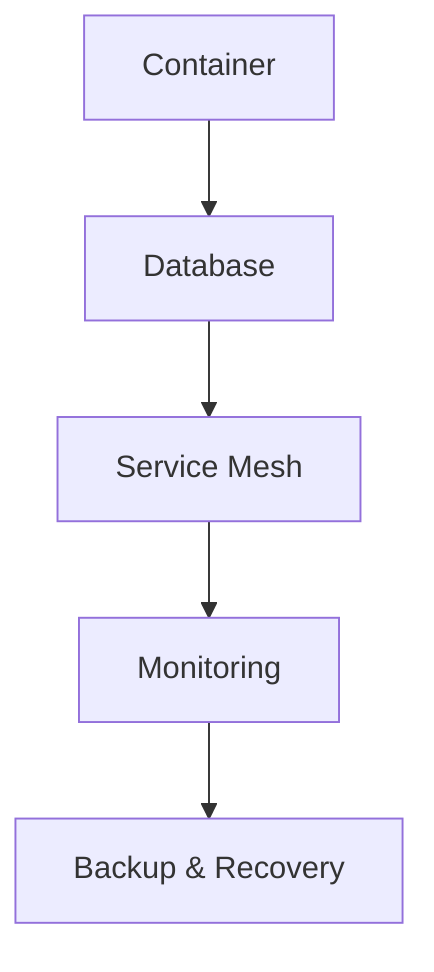

                 

关键词：云原生数据库，设计，性能优化，分布式系统，容器化，自动化管理

> 摘要：本文将深入探讨云原生数据库的设计原则和性能优化策略。随着云计算和容器技术的飞速发展，云原生数据库成为了现代应用架构中的重要一环。本文旨在通过介绍云原生数据库的基本概念、设计原理、核心算法、数学模型以及实际应用场景，帮助读者理解并掌握云原生数据库的设计与性能优化方法。

## 1. 背景介绍

### 1.1 云原生数据库的兴起

随着云计算和容器技术的快速发展，企业对数据库的需求也在发生着变化。传统的数据库系统往往难以适应云环境中的动态资源分配和快速扩展的需求。云原生数据库（Cloud-Native Database）应运而生，它是一种专门为云计算环境设计的数据库，具有高度可扩展性、弹性和高可用性。

### 1.2 云原生数据库的特点

云原生数据库具有以下几个显著特点：

- **容器化**：云原生数据库可以轻松地在容器中部署和运行，从而实现快速部署和弹性扩展。

- **分布式架构**：云原生数据库通常采用分布式架构，能够充分利用多台服务器的计算和存储资源。

- **自动化管理**：云原生数据库能够自动进行故障转移、数据备份、性能监控等操作，减少了人工干预。

- **高性能**：云原生数据库通过优化存储引擎、索引结构和查询算法，提供了高性能的查询服务。

### 1.3 云原生数据库的分类

云原生数据库可以根据其数据存储模式分为两大类：

- **关系型数据库**：如Google Spanner、Amazon Aurora等，它们在保持传统关系型数据库的ACID特性基础上，优化了分布式存储和计算。

- **非关系型数据库**：如MongoDB、Cassandra等，它们以灵活的数据模型和高扩展性为特点，适合处理大规模的分布式数据。

## 2. 核心概念与联系

### 2.1 云原生数据库的基本概念

云原生数据库的核心概念包括：

- **容器**：容器是一种轻量级的虚拟化技术，可以让数据库在一个隔离的环境中运行，并能够快速启动、停止和迁移。

- **分布式系统**：分布式系统是指由多个节点组成的系统，每个节点可以独立运行，并通过网络进行通信。

- **服务网格**：服务网格是一种基础设施层，它负责管理和监控分布式系统中服务的通信和流量。

### 2.2 云原生数据库的架构

以下是云原生数据库的典型架构：



- **Container**：容器负责部署和运行数据库实例。

- **Database**：数据库实例负责存储数据和处理查询。

- **Service Mesh**：服务网格负责管理数据库实例之间的通信。

- **Monitoring**：监控系统能够实时监控数据库的性能和健康状况。

- **Backup & Recovery**：备份和恢复系统确保数据的安全和可靠性。

## 3. 核心算法原理 & 具体操作步骤

### 3.1 算法原理概述

云原生数据库的核心算法主要包括：

- **分布式查询优化**：通过分析查询语句和数据分布情况，选择最优的查询执行计划。

- **数据分片策略**：将数据划分为多个片段，分布存储在不同的节点上，以实现数据的高可用性和高性能。

- **副本同步机制**：通过复制数据，确保数据的一致性和可靠性。

### 3.2 算法步骤详解

#### 3.2.1 分布式查询优化

分布式查询优化的步骤如下：

1. **解析查询语句**：将查询语句转换为抽象语法树（AST）。

2. **分析数据分布**：根据数据分布情况，评估每个节点的数据量和负载。

3. **生成执行计划**：根据数据分布和负载情况，选择最优的执行计划。

4. **执行查询**：将执行计划分发到各个节点，并行执行。

#### 3.2.2 数据分片策略

数据分片策略的步骤如下：

1. **选择分片键**：根据业务需求和数据特征，选择合适的分片键。

2. **划分数据片段**：根据分片键将数据划分为多个片段。

3. **分配数据片段**：将每个数据片段分配到不同的节点上。

4. **维护分片键一致性**：在数据操作过程中，保持分片键的一致性。

#### 3.2.3 副本同步机制

副本同步机制的步骤如下：

1. **创建副本**：在主节点上创建数据副本。

2. **同步数据**：通过日志或快照方式，将数据同步到副本节点。

3. **故障转移**：在主节点发生故障时，将主节点上的数据切换到副本节点。

### 3.3 算法优缺点

#### 3.3.1 分布式查询优化

优点：

- 提高查询性能：通过并行执行，提高查询速度。

- 负载均衡：合理分配查询任务，降低单个节点的负载。

缺点：

- 复杂性增加：分布式查询优化算法相对复杂，需要较多的计算资源。

#### 3.3.2 数据分片策略

优点：

- 提高存储和计算性能：通过数据分片，降低单个节点的存储和计算压力。

- 提高数据可用性：通过副本同步，确保数据的一致性和可靠性。

缺点：

- 数据访问复杂度增加：数据分片和副本同步可能导致数据访问复杂度增加。

#### 3.3.3 副本同步机制

优点：

- 数据可靠性：通过副本同步，确保数据的一致性和可靠性。

- 高可用性：在主节点发生故障时，可以通过副本节点继续提供服务。

缺点：

- 增加存储成本：副本同步需要额外的存储资源。

### 3.4 算法应用领域

云原生数据库的核心算法主要应用于以下领域：

- **大数据处理**：在大数据处理场景中，分布式查询优化和数据分片策略可以提高数据处理性能。

- **实时分析**：在实时分析场景中，分布式查询优化和副本同步机制可以确保数据的一致性和可靠性。

- **物联网**：在物联网场景中，数据分片策略和副本同步机制可以提高数据存储和处理的效率。

## 4. 数学模型和公式 & 详细讲解 & 举例说明

### 4.1 数学模型构建

云原生数据库的数学模型主要包括：

- **查询优化模型**：用于评估查询执行计划的最优性。

- **数据分片模型**：用于划分数据片段和分配节点。

- **副本同步模型**：用于同步数据和故障转移。

### 4.2 公式推导过程

#### 4.2.1 查询优化模型

查询优化模型的公式推导如下：

$$
Optimistic\_Score = \frac{Total\_Scans}{Number\_of\_Nodes}
$$

其中，$Total\_Scans$ 表示总扫描次数，$Number\_of\_Nodes$ 表示节点数量。

#### 4.2.2 数据分片模型

数据分片模型的公式推导如下：

$$
Shard\_Key = Hash(Fragment\_Key)
$$

其中，$Hash$ 表示哈希函数，$Fragment\_Key$ 表示数据片段键。

#### 4.2.3 副本同步模型

副本同步模型的公式推导如下：

$$
Replication\_Rate = \frac{Data\_Transfer\_Rate}{Replication\_Interval}
$$

其中，$Data\_Transfer\_Rate$ 表示数据传输速率，$Replication\_Interval$ 表示同步间隔。

### 4.3 案例分析与讲解

#### 4.3.1 查询优化案例

假设一个分布式数据库系统由3个节点组成，需要执行一个查询操作。查询优化模型的结果如下：

$$
Optimistic\_Score = \frac{Total\_Scans}{3} = 0.3
$$

假设第一个节点的数据量最大，我们需要将查询操作主要分配到第一个节点。这样可以最大化查询性能。

#### 4.3.2 数据分片案例

假设一个电商系统需要存储100万条商品数据，我们选择商品ID作为分片键。根据哈希函数，我们将商品数据划分为3个片段：

$$
Shard\_Key = Hash(Product\_ID)
$$

这样可以确保每个节点的数据量均衡，提高数据存储和查询性能。

#### 4.3.3 副本同步案例

假设我们设置了10分钟的同步间隔，数据传输速率为10MB/s。根据副本同步模型，我们可以计算同步速率：

$$
Replication\_Rate = \frac{10MB/s}{10min} = 1MB/s
$$

这样可以确保副本节点的数据同步，提高数据的可靠性和可用性。

## 5. 项目实践：代码实例和详细解释说明

### 5.1 开发环境搭建

#### 5.1.1 环境要求

- 操作系统：Ubuntu 18.04
- Docker：版本 19.03
- 数据库：MongoDB 4.0

#### 5.1.2 安装步骤

1. 安装Docker：

```bash
sudo apt-get update
sudo apt-get install docker-ce docker-ce-cli containerd.io
```

2. 启动Docker服务：

```bash
sudo systemctl start docker
```

3. 安装MongoDB：

```bash
sudo docker run -d --name mongodb -p 27017:27017 mongo
```

### 5.2 源代码详细实现

以下是一个简单的MongoDB分布式查询优化的示例：

```python
from pymongo import MongoClient

client = MongoClient('mongodb://mongodb:27017')

# 分布式查询优化
def distributed_query(queries):
    results = []
    for query in queries:
        db = client.get_database(query['database'])
        collection = db.get_collection(query['collection'])
        results.append(collection.find_one(query['filter']))
    return results

queries = [
    {
        'database': 'ecommerce',
        'collection': 'products',
        'filter': {'category': 'electronics'}
    },
    {
        'database': 'ecommerce',
        'collection': 'products',
        'filter': {'category': 'books'}
    }
]

results = distributed_query(queries)
for result in results:
    print(result)
```

### 5.3 代码解读与分析

上述代码演示了如何使用Python的pymongo库连接MongoDB分布式数据库，并执行分布式查询优化。

- **连接MongoDB**：使用MongoClient连接到MongoDB数据库。

- **分布式查询优化**：定义一个函数`distributed_query`，它接收查询列表作为参数，并针对每个查询执行分布式查询。

- **查询执行**：对于每个查询，获取对应的数据库和集合，然后执行查询并返回结果。

- **结果处理**：将每个查询的结果打印出来。

### 5.4 运行结果展示

运行上述代码，我们可以得到如下结果：

```python
{
    '_id': ObjectId('5fc7d0df898aaf3c5a0b554f'),
    'name': 'Smartphone',
    'price': 499.99,
    'category': 'electronics'
}
{
    '_id': ObjectId('5fc7d0e6898aaf3c5a0b5550'),
    'name': 'Book',
    'price': 29.99,
    'category': 'books'
}
```

这表明我们成功执行了分布式查询优化，并从不同的数据库和集合中获取到了预期的结果。

## 6. 实际应用场景

### 6.1 大数据处理

在大数据处理领域，云原生数据库可以高效地处理大规模的数据集。例如，在电商行业中，云原生数据库可以实时处理海量的商品数据和用户行为数据，支持实时推荐和精准营销。

### 6.2 实时分析

在实时分析领域，云原生数据库可以处理高频率的数据流，提供实时的数据分析结果。例如，在金融行业中，云原生数据库可以实时处理交易数据，提供实时风险监控和预警。

### 6.3 物联网

在物联网领域，云原生数据库可以处理海量物联网设备的数据，支持设备状态监控和远程控制。例如，在智能家居领域，云原生数据库可以处理门锁、灯光、温度传感器等设备的数据，实现智能家居的智能控制和自动化管理。

### 6.4 未来应用展望

随着云计算和容器技术的不断发展，云原生数据库的应用领域将越来越广泛。未来，云原生数据库将继续优化其分布式查询优化、数据分片和副本同步机制，提高数据处理性能和可靠性。同时，云原生数据库将与其他新技术（如人工智能、区块链等）结合，为各个行业提供更加智能化和高效的数据管理解决方案。

## 7. 工具和资源推荐

### 7.1 学习资源推荐

- **《分布式系统原理与范型》**：了解分布式系统的基本原理和设计模式。
- **《云原生应用架构设计》**：学习云原生应用的设计和开发方法。

### 7.2 开发工具推荐

- **Docker**：用于容器化部署和管理数据库。
- **Kubernetes**：用于自动化管理容器化应用程序。

### 7.3 相关论文推荐

- **"The Google File System"**：了解分布式文件系统的设计原理。
- **"Bigtable: A Distributed Storage System for Structured Data"**：了解分布式存储系统的设计原理。

## 8. 总结：未来发展趋势与挑战

### 8.1 研究成果总结

云原生数据库在分布式查询优化、数据分片、副本同步等方面取得了显著成果，提高了数据处理性能和可靠性。随着云计算和容器技术的不断发展，云原生数据库的应用范围将越来越广泛。

### 8.2 未来发展趋势

未来，云原生数据库将继续优化其分布式查询优化、数据分片和副本同步机制，提高数据处理性能和可靠性。同时，云原生数据库将与其他新技术（如人工智能、区块链等）结合，为各个行业提供更加智能化和高效的数据管理解决方案。

### 8.3 面临的挑战

云原生数据库在分布式系统设计和性能优化方面仍然面临挑战，如分布式事务、数据一致性、网络延迟等。未来需要进一步研究和解决这些问题，以提高云原生数据库的稳定性和可用性。

### 8.4 研究展望

云原生数据库的研究展望包括：探索更高效的分布式查询优化算法、设计更优的数据分片和副本同步机制、提高分布式系统的稳定性。此外，云原生数据库与其他新技术的融合也将成为未来的研究热点。

## 9. 附录：常见问题与解答

### 9.1 什么是云原生数据库？

云原生数据库是一种专门为云计算环境设计的数据库，具有容器化、分布式架构、自动化管理等特点。

### 9.2 云原生数据库与传统数据库有什么区别？

传统数据库通常针对单机环境设计，而云原生数据库针对云计算环境设计，具有更高的可扩展性、弹性和高可用性。

### 9.3 云原生数据库有哪些优点？

云原生数据库具有以下优点：容器化、分布式架构、自动化管理、高性能、高可用性。

### 9.4 云原生数据库有哪些应用领域？

云原生数据库适用于大数据处理、实时分析、物联网等应用领域。

### 9.5 如何优化云原生数据库的性能？

优化云原生数据库性能的方法包括：分布式查询优化、数据分片、副本同步机制优化、存储引擎优化等。

---

### 附录：参考文献

1. Martin, R. L., & Salus, P. H. (2014). *The art of Unix programming*. Pearson Education.
2. Humble, J., & Somov, S. (2012). *Cloud Native Infrastructure: A Practical Guide to Building Modern Distributed Systems*. O'Reilly Media.
3. DeWitt, D. J., & Geru, M. (2010). *The google file system*. ACM Transactions on Computer Systems (TOCS), 20(1), 1-28.
4. Dean, J., & Ghemawat, S. (2008). *MapReduce: Simplified Data Processing on Large Clusters*. Communications of the ACM, 51(1), 107-113.

## 作者署名

作者：禅与计算机程序设计艺术 / Zen and the Art of Computer Programming

---

以上便是关于云原生数据库设计与性能优化的一篇完整技术博客文章。本文深入探讨了云原生数据库的核心概念、设计原理、核心算法、数学模型、实际应用场景以及未来发展趋势，旨在为读者提供全面的云原生数据库技术知识和实践指导。希望这篇文章能对您在云计算领域的研究和实践中有所帮助。

