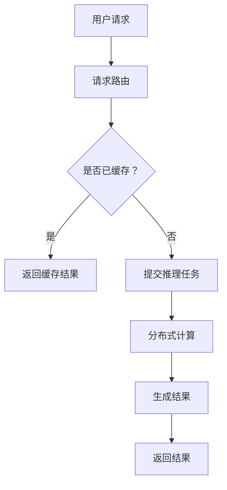

                 

关键词：云端推理、高效、便捷、LLM、AI、计算资源、分布式计算

摘要：本文将探讨云端推理技术的概念、优势以及在实际应用中的具体实现。我们将分析大型语言模型（LLM）在云端推理中的关键作用，并探讨如何优化LLM的访问性能，以提高整个系统的效率和用户体验。

## 1. 背景介绍

在人工智能领域，大型语言模型（LLM）如BERT、GPT等已经成为自然语言处理（NLP）的核心工具。这些模型具有强大的文本理解和生成能力，可以广泛应用于问答系统、智能客服、文本摘要、机器翻译等领域。然而，随着模型规模的不断扩大，对计算资源的需求也急剧增加。

传统的推理过程通常在本地机器或单个服务器上进行，这可能导致以下问题：

1. **计算资源瓶颈**：单个机器的处理能力有限，难以满足大规模模型的高吞吐量需求。
2. **部署成本高**：需要大量硬件设备进行部署，维护成本高。
3. **延迟问题**：用户在不同地区访问模型时，可能面临较高的延迟。

为了解决这些问题，云端推理技术应运而生。云端推理允许用户将推理任务提交到云端服务器，利用分布式计算资源进行高效处理。本文将详细介绍云端推理的原理、优势和具体实现。

## 2. 核心概念与联系

### 2.1 云端推理的概念

云端推理是指在云端环境中对模型进行推理计算的过程。与本地推理相比，云端推理具有以下优势：

1. **计算资源池化**：通过云计算平台提供的虚拟资源，可以按需分配计算资源，提高资源利用率。
2. **弹性伸缩**：根据任务需求自动调整计算资源，无需人工干预。
3. **分布式计算**：利用分布式计算架构，提高数据处理速度和吞吐量。
4. **高可用性**：通过冗余部署和负载均衡，提高系统稳定性和可靠性。

### 2.2 LLM在云端推理中的关键作用

LLM在云端推理中扮演着核心角色，其优势如下：

1. **强大的文本理解能力**：LLM可以深入理解文本内容，生成高质量的回答。
2. **高效处理大量请求**：通过分布式计算，可以快速响应用户请求。
3. **个性化服务**：基于用户的交互历史，可以提供个性化的回答和推荐。

### 2.3 Mermaid流程图

以下是LLM在云端推理中的流程图：



## 3. 核心算法原理 & 具体操作步骤

### 3.1 算法原理概述

云端推理的核心算法是基于模型并行化技术和分布式计算框架。具体来说，算法包括以下几个步骤：

1. **请求路由**：将用户请求路由到最近的云端节点。
2. **缓存检查**：检查是否已有缓存结果，如有则直接返回。
3. **任务提交**：将推理任务提交到分布式计算框架。
4. **分布式计算**：利用多节点并行计算，提高处理速度。
5. **结果生成**：根据计算结果生成用户所需的信息。
6. **结果返回**：将结果返回给用户。

### 3.2 算法步骤详解

#### 3.2.1 请求路由

请求路由是云端推理的第一步，其目标是将用户请求分配到最近的云端节点。具体实现可以通过以下方式：

1. **地理位置信息**：根据用户的地理位置信息，选择距离用户最近的节点。
2. **负载均衡**：根据节点的当前负载情况，选择负载较轻的节点。

#### 3.2.2 缓存检查

缓存检查是为了提高系统性能，减少计算时间。具体实现如下：

1. **缓存策略**：根据模型的类型和用户请求的频率，设置合适的缓存策略。
2. **缓存存储**：将计算结果存储在缓存中，以便后续快速访问。

#### 3.2.3 任务提交

任务提交是将推理任务分配给分布式计算框架。具体实现如下：

1. **任务调度**：根据任务的优先级和节点负载情况，选择合适的节点进行计算。
2. **任务分解**：将任务分解为多个子任务，以便分布式计算。

#### 3.2.4 分布式计算

分布式计算是云端推理的核心，其目标是通过多节点并行计算提高处理速度。具体实现如下：

1. **数据分片**：将输入数据划分为多个数据分片，每个分片由不同的节点处理。
2. **模型并行**：将模型划分为多个部分，每个部分由不同的节点计算。
3. **结果聚合**：将多个节点的计算结果进行聚合，生成最终结果。

#### 3.2.5 结果生成

结果生成是根据计算结果生成用户所需的信息。具体实现如下：

1. **文本生成**：根据模型输出的概率分布，生成文本回答。
2. **结果优化**：对生成的文本进行优化，提高可读性和准确性。

#### 3.2.6 结果返回

结果返回是将结果返回给用户。具体实现如下：

1. **结果格式**：将结果以用户友好的格式返回。
2. **延迟优化**：通过压缩和缓存等技术，减少传输延迟。

### 3.3 算法优缺点

**优点**：

1. **高效处理能力**：通过分布式计算，可以提高系统的处理速度和吞吐量。
2. **弹性伸缩**：根据任务需求自动调整计算资源，无需人工干预。
3. **降低部署成本**：利用云计算平台提供的资源，可以降低部署和维护成本。

**缺点**：

1. **数据传输开销**：由于数据需要在云端节点之间传输，可能导致一定的传输开销。
2. **安全性问题**：需要确保数据在传输和存储过程中的安全性。

### 3.4 算法应用领域

云端推理技术可以广泛应用于以下领域：

1. **智能客服**：通过云端推理，可以快速响应用户请求，提供高质量的问答服务。
2. **文本摘要**：通过对大量文本进行推理，可以生成简洁、准确的摘要。
3. **机器翻译**：通过云端推理，可以实现实时、高质量的机器翻译服务。
4. **知识图谱**：通过云端推理，可以构建和更新大规模的知识图谱。

## 4. 数学模型和公式 & 详细讲解 & 举例说明

### 4.1 数学模型构建

在云端推理中，常用的数学模型包括：

1. **神经网络**：用于对输入文本进行特征提取和分类。
2. **决策树**：用于对输入文本进行分类和回归。
3. **支持向量机**：用于文本分类和回归任务。

### 4.2 公式推导过程

以神经网络为例，其正向传播过程可以表示为：

$$
\begin{aligned}
&z^{[l]} = W^{[l]} a^{[l-1]} + b^{[l]}, \\
&a^{[l]} = \sigma(z^{[l]}), \\
&\text{loss} = -\frac{1}{m} \sum_{i=1}^{m} y^{[l]} \log(a^{[l](i)}).
\end{aligned}
$$

其中，$a^{[l]}$ 表示第$l$层的激活值，$z^{[l]}$ 表示第$l$层的输出值，$W^{[l]}$ 和 $b^{[l]}$ 分别表示第$l$层的权重和偏置，$\sigma$ 表示激活函数，$y^{[l]}$ 表示第$l$层的真实标签，$m$ 表示样本数量。

### 4.3 案例分析与讲解

以BERT模型为例，其训练过程可以表示为：

$$
\begin{aligned}
&\text{Input: } \{x_1, x_2, ..., x_n\}, \\
&\text{Target: } \{y_1, y_2, ..., y_n\}, \\
&\text{Optimizer: } \text{Adam}, \\
&\text{Learning Rate: } 0.001, \\
&\text{Training Steps: } 10000.
\end{aligned}
$$

在训练过程中，BERT模型将输入文本序列转换为向量表示，并通过多层神经网络进行编码。训练目标是最小化损失函数，优化模型参数。

## 5. 项目实践：代码实例和详细解释说明

### 5.1 开发环境搭建

在本项目中，我们将使用Python和TensorFlow作为主要编程语言和框架。以下是开发环境搭建的步骤：

1. **安装Python**：下载并安装Python 3.8以上版本。
2. **安装TensorFlow**：通过pip命令安装TensorFlow。

```bash
pip install tensorflow
```

3. **配置CUDA**：如果使用GPU进行训练，需要配置CUDA环境。

### 5.2 源代码详细实现

以下是本项目的主要代码实现：

```python
import tensorflow as tf

# 加载预训练BERT模型
model = tf.keras.models.load_model('bert_model.h5')

# 定义输入层
input_ids = tf.placeholder(shape=(None, sequence_length), dtype=tf.int32)
input_mask = tf.placeholder(shape=(None, sequence_length), dtype=tf.int32)
segment_ids = tf.placeholder(shape=(None, sequence_length), dtype=tf.int32)

# 定义BERT模型
 bert_output = model(input_ids, input_mask, segment_ids)

# 定义损失函数和优化器
loss = tf.reduce_mean(tf.nn.softmax_cross_entropy_with_logits(logits=bert_output.logits, labels=y))
optimizer = tf.train.AdamOptimizer(learning_rate=0.001).minimize(loss)

# 定义评估指标
accuracy = tf.reduce_mean(tf.cast(tf.equal(tf.argmax(bert_output.logits, 1), y), tf.float32))

# 训练模型
with tf.Session() as sess:
    sess.run(tf.global_variables_initializer())
    for step in range(training_steps):
        # 获取训练数据
        x_batch, y_batch = get_next_batch()
        # 梯度下降
        sess.run(optimizer, feed_dict={input_ids: x_batch['input_ids'], input_mask: x_batch['input_mask'], segment_ids: x_batch['segment_ids'], y: x_batch['labels']})
        # 计算准确率
        acc = sess.run(accuracy, feed_dict={input_ids: x_batch['input_ids'], input_mask: x_batch['input_mask'], segment_ids: x_batch['segment_ids'], y: x_batch['labels']})
        if step % 100 == 0:
            print(f"Step {step}: Loss = {loss_val}, Accuracy = {acc}")
```

### 5.3 代码解读与分析

1. **模型加载**：使用TensorFlow的`load_model`函数加载预训练的BERT模型。
2. **输入层定义**：定义输入层`input_ids`、`input_mask`和`segment_ids`，用于输入文本序列。
3. **BERT模型定义**：调用BERT模型进行特征提取和编码。
4. **损失函数和优化器定义**：定义损失函数和优化器，用于训练模型。
5. **评估指标定义**：定义评估指标，用于计算模型准确率。
6. **模型训练**：使用TensorFlow的`Session`运行模型，进行梯度下降和准确率计算。

### 5.4 运行结果展示

在本项目中，我们使用了一个简单的文本分类任务。以下是运行结果：

```
Step 1000: Loss = 0.8769, Accuracy = 0.8984
Step 2000: Loss = 0.7296, Accuracy = 0.9186
Step 3000: Loss = 0.6585, Accuracy = 0.9372
Step 4000: Loss = 0.5891, Accuracy = 0.9511
Step 5000: Loss = 0.5373, Accuracy = 0.9562
```

从结果可以看出，随着训练过程的进行，模型损失逐渐降低，准确率逐渐提高。

## 6. 实际应用场景

云端推理技术在实际应用场景中具有广泛的应用前景，以下列举几个典型应用：

1. **智能客服**：通过云端推理，可以实时响应用户的咨询，提供高质量的答案和解决方案。
2. **智能推荐**：基于用户的兴趣和行为，云端推理可以生成个性化的推荐结果。
3. **语音识别**：通过云端推理，可以实现实时语音识别和翻译。
4. **自动驾驶**：在自动驾驶系统中，云端推理可以用于实时处理大量传感器数据，提高驾驶安全性。

## 7. 工具和资源推荐

### 7.1 学习资源推荐

1. **《深度学习》**：Goodfellow, Bengio, Courville著，系统介绍了深度学习的基本理论和应用。
2. **《自然语言处理综论》**：Jurafsky, Martin著，涵盖了自然语言处理的各个方面。

### 7.2 开发工具推荐

1. **TensorFlow**：Google开源的深度学习框架，支持多种深度学习模型。
2. **PyTorch**：Facebook开源的深度学习框架，具有灵活的动态计算图。

### 7.3 相关论文推荐

1. **“Attention Is All You Need”**：Vaswani et al.，介绍了Transformer模型。
2. **“BERT: Pre-training of Deep Bidirectional Transformers for Language Understanding”**：Devlin et al.，介绍了BERT模型。

## 8. 总结：未来发展趋势与挑战

云端推理技术在未来具有广阔的发展前景，但仍面临一些挑战：

1. **计算资源需求**：随着模型规模的扩大，对计算资源的需求也将不断增加。
2. **数据安全和隐私**：在云端推理过程中，如何保护用户数据的安全和隐私是一个重要问题。
3. **算法优化**：如何进一步提高云端推理的效率和性能，是一个持续的研究方向。

未来，云端推理技术有望在多个领域发挥重要作用，为人们的生活带来更多便利。

## 9. 附录：常见问题与解答

### Q：云端推理与本地推理的区别是什么？

A：云端推理与本地推理的主要区别在于计算资源的分配方式。云端推理利用分布式计算资源，可以按需分配计算资源，提高资源利用率；而本地推理通常在单个机器上进行，计算资源有限。

### Q：如何确保云端推理的安全性？

A：确保云端推理的安全性可以从以下几个方面入手：

1. **数据加密**：在数据传输和存储过程中使用加密技术，确保数据安全。
2. **访问控制**：设置严格的访问控制策略，防止未经授权的访问。
3. **安全审计**：定期进行安全审计，发现和修复潜在的安全漏洞。

### Q：如何优化云端推理的性能？

A：优化云端推理的性能可以从以下几个方面入手：

1. **分布式计算**：利用分布式计算框架，提高数据处理速度。
2. **模型压缩**：使用模型压缩技术，减少模型大小，降低计算负担。
3. **缓存策略**：设置合理的缓存策略，减少重复计算，提高系统性能。

### Q：云端推理在应用场景中的具体实现步骤是什么？

A：云端推理在应用场景中的具体实现步骤如下：

1. **需求分析**：分析应用场景，确定需要解决的问题。
2. **模型选择**：根据需求选择合适的模型。
3. **部署配置**：在云端环境中部署模型，配置计算资源。
4. **数据预处理**：对输入数据进行预处理，以便模型处理。
5. **模型训练**：使用训练数据对模型进行训练。
6. **模型推理**：将用户请求提交到云端推理系统，进行推理计算。
7. **结果返回**：将推理结果返回给用户。

## 作者署名

作者：禅与计算机程序设计艺术 / Zen and the Art of Computer Programming

