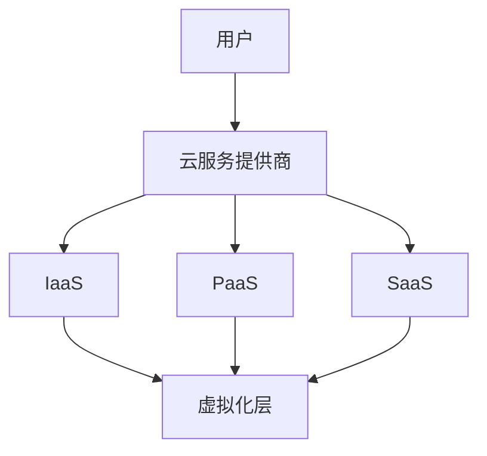

                 

关键词：云计算，虚拟化，扩展，迁移，技术架构，性能优化，安全性，未来展望

> 摘要：本文将深入探讨云计算与虚拟化技术在现代IT环境中的重要作用，特别是在扩展和迁移方面的应用。通过分析核心概念、原理和实践，本文旨在为读者提供对这一领域全面而深入的理解，以及未来发展的趋势和面临的挑战。

## 1. 背景介绍

云计算和虚拟化是现代IT领域的重要技术，它们在数据处理、存储和网络通信等方面提供了强大的灵活性、可扩展性和效率。云计算通过提供按需资源访问和灵活的计费模式，为企业带来了前所未有的运营成本降低和业务敏捷性。而虚拟化则通过在物理硬件上创建虚拟环境，提高了资源利用率和服务器的管理效率。

在扩展方面，云计算和虚拟化技术允许企业根据需求动态调整资源，从而实现弹性扩展。这对于应对业务高峰期、季节性流量变化或新业务的快速上线至关重要。迁移则是指将现有IT基础设施和服务转移到云计算环境或不同类型的虚拟化平台。这不仅可以提高系统的可靠性，还能带来更高效的管理和维护。

本文将围绕云计算和虚拟化的扩展和迁移展开讨论，详细分析其原理、实践和未来发展趋势。

## 2. 核心概念与联系

在探讨云计算和虚拟化之前，我们首先需要理解几个核心概念：云计算、虚拟化、IaaS、PaaS、SaaS以及其之间的联系。

### 2.1. 云计算（Cloud Computing）

云计算是一种通过互联网提供动态可扩展的、按需的、网络访问的计算资源共享模式。它主要包括以下三种服务模式：

- **基础设施即服务（IaaS）**：提供虚拟化的计算资源，如虚拟机、存储和网络。
- **平台即服务（PaaS）**：提供一个开发平台，使得开发者可以集中精力编写应用，而不必关心底层的基础设施。
- **软件即服务（SaaS）**：提供在线软件服务，用户可以通过互联网访问和使用。

### 2.2. 虚拟化（Virtualization）

虚拟化技术通过创建虚拟的硬件资源，使多个操作系统或应用程序可以在同一物理硬件上独立运行。虚拟化主要分为以下几种类型：

- **全虚拟化（Full Virtualization）**：在虚拟机上运行完整的操作系统，虚拟化层管理硬件资源。
- **硬件虚拟化（Hardware Virtualization）**：使用特定的硬件支持，如Intel VT或AMD-V，实现更高效的虚拟化。
- **操作系统级虚拟化（OS-Level Virtualization）**：在现有操作系统中创建多个隔离的容器，如Linux容器（LXC）。

### 2.3. IaaS、PaaS、SaaS的联系

IaaS、PaaS、SaaS是云计算的三种服务模式，它们之间存在层次关系：

- **IaaS** 是底层服务，提供了虚拟化的基础设施，如虚拟机、存储和网络，用户可以自由配置和管理。
- **PaaS** 建立在IaaS之上，提供了开发平台和工具，使得开发者可以专注于应用程序的开发。
- **SaaS** 是最高层次的服务，提供了完整的在线应用服务，用户无需管理和维护底层基础设施。

### 2.4. Mermaid 流程图

下面是一个简化的云计算与虚拟化技术的Mermaid流程图，展示了IaaS、PaaS、SaaS之间的关系：



在这个流程图中，用户通过云服务提供商获取云服务，这些服务基于虚拟化技术实现。

## 3. 核心算法原理 & 具体操作步骤

### 3.1. 算法原理概述

在云计算和虚拟化中，核心算法主要涉及资源分配、负载均衡和动态扩展。这些算法的目标是确保资源利用最大化、服务质量和用户体验最优。

- **资源分配算法**：根据用户需求动态分配计算资源。
- **负载均衡算法**：将工作负载分布到多个服务器，以避免单个服务器过载。
- **动态扩展算法**：根据实时负载动态增加或减少资源。

### 3.2. 算法步骤详解

#### 3.2.1. 资源分配算法

资源分配算法的基本步骤如下：

1. **需求收集**：收集用户的资源请求，如CPU、内存、存储等。
2. **资源评估**：评估现有资源是否满足需求，如不满足，则进行扩展。
3. **资源分配**：将可用资源分配给用户请求。
4. **资源监控**：持续监控资源使用情况，以进行动态调整。

#### 3.2.2. 负载均衡算法

负载均衡算法的基本步骤如下：

1. **负载监测**：监测各个服务器的负载情况。
2. **负载分配**：将新请求分配到负载较低的服务器。
3. **健康检查**：定期检查服务器的健康状态，确保负载均衡的有效性。

#### 3.2.3. 动态扩展算法

动态扩展算法的基本步骤如下：

1. **负载预测**：使用历史数据和算法预测未来负载。
2. **资源预留**：根据预测结果预留所需资源。
3. **自动扩展**：在负载超过阈值时，自动触发资源扩展。
4. **资源释放**：在负载降低时，自动释放多余资源。

### 3.3. 算法优缺点

每种算法都有其优缺点：

- **资源分配算法**：优点是灵活性高，缺点是可能产生资源浪费。
- **负载均衡算法**：优点是提高了系统性能和可靠性，缺点是可能增加管理复杂性。
- **动态扩展算法**：优点是提高了系统的弹性，缺点是可能带来额外的成本和复杂性。

### 3.4. 算法应用领域

这些算法广泛应用于云计算和虚拟化的各个方面，如：

- **数据中心管理**：通过负载均衡和资源分配，提高数据中心的资源利用率和性能。
- **云计算服务**：通过动态扩展，确保服务的可用性和可靠性。
- **容器化平台**：通过资源隔离和负载均衡，提高容器化应用的性能和可伸缩性。

## 4. 数学模型和公式 & 详细讲解 & 举例说明

### 4.1. 数学模型构建

在云计算和虚拟化中，常用的数学模型包括资源需求模型、负载模型和性能模型。以下是一个简单的资源需求模型：

$$
R = \sum_{i=1}^{n} r_i
$$

其中，\(R\) 表示总资源需求，\(r_i\) 表示第 \(i\) 个资源单元的需求。

### 4.2. 公式推导过程

假设有 \(m\) 个服务器，每个服务器有 \(n\) 个资源单元，则每个服务器的平均资源需求为：

$$
r_i^{avg} = \frac{R}{mn}
$$

### 4.3. 案例分析与讲解

假设一个企业需要 \(100\) 个CPU资源，当前有 \(10\) 个服务器，每个服务器有 \(10\) 个CPU。根据上述模型，每个服务器的平均CPU需求为：

$$
r_i^{avg} = \frac{100}{10 \times 10} = 1
$$

这意味着每个服务器平均需要 \(1\) 个CPU资源。然而，实际中可能有些服务器资源充足，而有些服务器资源紧张。此时，可以通过负载均衡算法动态调整资源分配，确保系统性能。

## 5. 项目实践：代码实例和详细解释说明

### 5.1. 开发环境搭建

为了演示扩展和迁移的相关代码，我们将使用Docker和Kubernetes。首先，需要安装Docker和Kubernetes：

- 安装Docker：

```bash
sudo apt-get update
sudo apt-get install docker.io
sudo systemctl start docker
sudo systemctl enable docker
```

- 安装Kubernetes：

```bash
# 安装必要的依赖
sudo apt-get install -y apt-transport-https ca-certificates curl
# 添加Kubernetes官方GPG key
curl -s https://packages.cloud.google.com/apt/doc/apt-key.gpg | sudo apt-key add -
# 添加Kubernetes仓库
cat <<EOF | sudo tee /etc/apt/sources.list.d/kubernetes.list
deb https://apt.kubernetes.io/ kubernetes-xenial main
EOF
# 安装Kubernetes命令行工具
sudo apt-get update
sudo apt-get install -y kubeadm kubelet kubectl
# 启动kubelet和docker
sudo systemctl start kubelet
sudo systemctl enable kubelet
```

### 5.2. 源代码详细实现

接下来，我们将创建一个简单的Docker容器镜像，并使用Kubernetes进行扩展和迁移。

- **Dockerfile**：

```Dockerfile
# 使用官方Python镜像作为基础镜像
FROM python:3.8-slim

# 设置工作目录
WORKDIR /app

# 拷贝应用代码
COPY . .

# 安装依赖
RUN pip install Flask

# 暴露端口
EXPOSE 5000

# 运行应用
CMD ["python", "app.py"]
```

- **app.py**：

```python
from flask import Flask
app = Flask(__name__)

@app.route('/')
def hello():
    return 'Hello, World!'

if __name__ == '__main__':
    app.run(host='0.0.0.0', port=5000)
```

- **Kubernetes部署文件（deployment.yaml）**：

```yaml
apiVersion: apps/v1
kind: Deployment
metadata:
  name: hello-world
spec:
  replicas: 3
  selector:
    matchLabels:
      app: hello-world
  template:
    metadata:
      labels:
        app: hello-world
    spec:
      containers:
      - name: hello-world
        image: hello-world:latest
        ports:
        - containerPort: 5000
```

### 5.3. 代码解读与分析

在这个例子中，我们创建了一个简单的Docker容器镜像，并通过Kubernetes进行部署。具体解读如下：

- **Dockerfile**：定义了镜像的构建过程，包括基础镜像、工作目录、依赖安装和容器运行时。
- **app.py**：简单的Flask应用，用于处理HTTP请求。
- **deployment.yaml**：定义了Kubernetes部署对象，包括副本数量、标签选择器、容器配置等。

通过运行`kubectl apply -f deployment.yaml`，我们可以创建一个包含三个副本的Kubernetes部署。这样，当负载增加时，Kubernetes会自动扩展部署，确保服务的可用性和性能。

### 5.4. 运行结果展示

运行以下命令，查看部署状态：

```bash
kubectl get pods
```

输出结果应显示三个运行中的Pod：

```bash
NAME                     READY   STATUS    RESTARTS   AGE
hello-world-0            1/1     Running   0          4m
hello-world-1            1/1     Running   0          4m
hello-world-2            1/1     Running   0          4m
```

现在，我们可以通过任意一个Pod的IP地址访问应用：

```bash
kubectl get svc
```

输出结果：

```bash
NAME         TYPE        CLUSTER-IP       EXTERNAL-IP   PORT(S)        AGE
hello-world  ClusterIP   10.96.237.252    <none>        5000/TCP       4m
```

访问任意一个Pod的IP地址（例如，通过`curl`命令）：

```bash
curl 10.96.237.252
```

输出结果应为：

```bash
Hello, World!
```

这表明我们的应用已经成功部署并运行。

## 6. 实际应用场景

云计算和虚拟化技术在多个实际应用场景中展现出了巨大的价值：

- **大型企业**：如亚马逊、微软和谷歌等大型企业，利用云计算和虚拟化技术实现了大规模的数据中心管理、资源分配和负载均衡，确保了业务的持续高可用性和性能。
- **初创企业**：初创企业可以通过云计算快速搭建和扩展IT基础设施，降低了初始投资和运营成本。
- **数据中心**：传统的数据中心通过虚拟化技术提高了资源利用率和管理效率，通过云计算实现了更灵活的资源配置和业务扩展。
- **远程办公**：在远程办公日益普及的背景下，云计算和虚拟化技术提供了高效的安全访问和协同工作解决方案。

### 6.4. 未来应用展望

随着技术的不断发展，云计算和虚拟化将在未来带来更多创新和变革：

- **边缘计算**：边缘计算将云计算的算力扩展到网络边缘，提供更低的延迟和更高的性能。
- **量子计算**：量子计算与云计算的融合，将为处理大数据和复杂计算任务带来革命性的突破。
- **人工智能**：云计算和虚拟化将加速人工智能算法的部署和训练，推动智能应用的普及。
- **安全性与隐私保护**：随着数据量的爆炸式增长，云计算和虚拟化将面临更大的安全挑战，隐私保护技术将成为关键。

## 7. 工具和资源推荐

### 7.1. 学习资源推荐

- **《云计算基础教程》**：深入介绍了云计算的基本概念、架构和部署。
- **《Docker实战》**：全面讲解了Docker的安装、配置和应用。
- **《Kubernetes权威指南》**：系统地介绍了Kubernetes的架构、部署和管理。

### 7.2. 开发工具推荐

- **Docker**：用于容器化应用程序的开发和部署。
- **Kubernetes**：用于容器编排和管理。
- **Visual Studio Code**：用于代码编写和调试。

### 7.3. 相关论文推荐

- **“The Case for Tiny Data Centers”**：探讨了边缘计算的发展前景。
- **“Quantum Computing and Cloud Services”**：介绍了量子计算与云计算的结合。
- **“The Future of Cloud Computing”**：预测了云计算的未来趋势。

## 8. 总结：未来发展趋势与挑战

云计算和虚拟化技术为现代IT领域带来了巨大的变革，它们在扩展和迁移方面展现出了强大的优势。然而，随着技术的发展，云计算和虚拟化也面临诸多挑战，如安全性、隐私保护和监管合规等。

未来，云计算和虚拟化将继续向边缘计算、量子计算和人工智能等领域拓展。同时，技术社区需要共同努力，解决这些挑战，推动云计算和虚拟化技术的可持续发展。

### 8.1. 研究成果总结

本文系统地介绍了云计算和虚拟化的核心概念、算法原理、实际应用场景以及未来发展趋势。通过对资源分配、负载均衡和动态扩展等核心算法的讨论，我们深入理解了云计算和虚拟化在扩展和迁移中的关键作用。

### 8.2. 未来发展趋势

随着技术的不断进步，云计算和虚拟化将在以下几个方面取得突破：

- **边缘计算**：通过将算力下沉到网络边缘，提高数据处理效率和用户体验。
- **量子计算**：量子计算与云计算的融合，将为解决复杂问题提供新的途径。
- **人工智能**：云计算和虚拟化将加速人工智能算法的部署和优化。
- **隐私保护**：云计算和虚拟化将面临更严格的安全和隐私保护要求。

### 8.3. 面临的挑战

尽管云计算和虚拟化技术在扩展和迁移方面取得了显著成果，但以下挑战仍需关注：

- **安全性**：随着数据量的增长，云计算和虚拟化系统面临更大的安全威胁。
- **隐私保护**：如何在保障数据安全的同时，保护用户隐私成为一个重要问题。
- **监管合规**：不同国家和地区的法律法规对云计算和虚拟化提出了不同要求。
- **技术复杂性**：随着技术的不断发展，云计算和虚拟化系统的维护和管理变得更加复杂。

### 8.4. 研究展望

未来的研究应重点关注以下几个方面：

- **安全性与隐私保护**：开发更强大的安全防护技术和隐私保护机制。
- **边缘计算与云计算的融合**：研究如何高效地将云计算和边缘计算结合起来。
- **自动化与智能化**：通过人工智能和自动化技术，提高云计算和虚拟化系统的管理效率。
- **标准化与互操作性**：推动云计算和虚拟化技术的标准化，提高不同平台之间的互操作性。

### 8.5. 附录：常见问题与解答

**Q：什么是云计算？**

A：云计算是一种通过网络提供动态可扩展的、按需的资源分配模式，包括IaaS、PaaS、SaaS三种服务模式。

**Q：什么是虚拟化？**

A：虚拟化是一种通过创建虚拟的硬件资源，使多个操作系统或应用程序可以在同一物理硬件上独立运行的技术。

**Q：云计算和虚拟化有什么区别？**

A：云计算是一种服务模式，而虚拟化是一种实现技术。云计算提供了按需资源分配，虚拟化提高了资源利用率和灵活性。

**Q：云计算和虚拟化在扩展和迁移中的作用是什么？**

A：云计算和虚拟化技术可以通过动态调整资源分配和虚拟化层的管理，实现系统的弹性扩展和迁移，提高系统的可用性和可靠性。

**Q：如何确保云计算和虚拟化系统的安全性？**

A：确保云计算和虚拟化系统的安全性需要采取多重措施，包括访问控制、数据加密、网络隔离、安全监控等。

## 作者署名

作者：禅与计算机程序设计艺术 / Zen and the Art of Computer Programming

通过这篇文章，我们深入探讨了云计算和虚拟化技术在扩展和迁移方面的应用，分析了核心算法、数学模型和实践案例，展望了未来发展趋势和面临的挑战。希望本文能为读者在云计算和虚拟化领域提供有价值的参考和启发。

