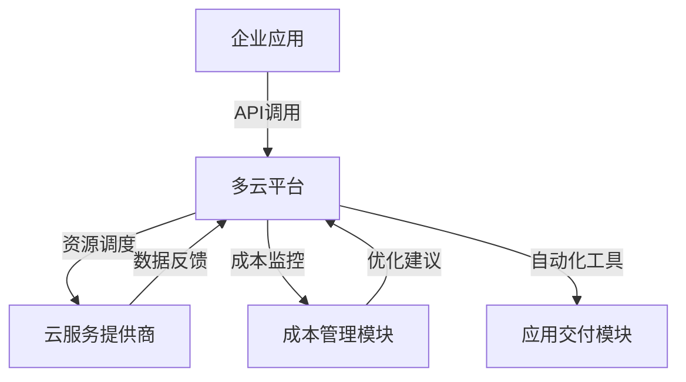

                 

关键词：云资源整合、Lepton AI、多云平台、云成本优化、企业IT策略

摘要：随着云计算的广泛应用，企业对云资源的优化管理成为提高业务效率和降低成本的关键。本文将探讨Lepton AI如何通过提供多云平台解决方案，帮助企业在复杂多变的云环境中实现资源整合，从而达到成本优化的目标。

## 1. 背景介绍

在当今数字化时代，云计算已经成为企业IT基础设施的重要组成部分。云服务提供了弹性、灵活、高效的数据处理和存储能力，但同时也带来了资源管理上的挑战。尤其是随着企业业务需求的不断变化，如何在多种云服务提供商之间优化资源使用，降低运营成本，成为企业IT管理者面临的一大难题。

传统的单云解决方案虽然能够满足部分需求，但随着云服务的多样性增加，其局限性愈发明显。企业需要一种能够整合多厂商、多地区云资源，提供统一管理和自动化调度的平台，以应对日益复杂的云计算环境。

## 2. 核心概念与联系

### 2.1 多云平台的概念

多云平台（Multi-Cloud Platform）是指企业利用多个云服务提供商（如AWS、Azure、Google Cloud等）的服务，构建一个统一的、灵活的云环境。通过多云平台，企业可以实现资源的多样化选择，优化成本，提升系统的可靠性和弹性。

### 2.2 Lepton AI与多云平台的整合

Lepton AI是一个专为多云环境设计的人工智能平台，它通过智能算法和自动化工具，帮助企业实现以下目标：

- **资源调度优化**：根据实时负载和成本数据，自动调整资源分配。
- **成本监控与优化**：实时监控云资源的使用情况，识别和减少不必要的支出。
- **服务提供商整合**：整合多个云服务提供商，实现资源的统一管理和调度。
- **应用交付自动化**：通过自动化工具，简化应用的部署和运维流程。

### 2.3 多云平台的架构

下面是一个简单的Mermaid流程图，描述了多云平台的架构：



在这个架构中，企业应用通过API与多云平台进行交互，多云平台负责资源调度、成本监控和自动化工具的集成，从而实现整体的云资源优化。

## 3. 核心算法原理 & 具体操作步骤

### 3.1 算法原理概述

Lepton AI的核心算法基于机器学习和人工智能技术，通过对历史数据分析和实时监控，实现以下功能：

- **预测负载**：利用历史数据，预测未来负载趋势，为资源调度提供依据。
- **成本建模**：分析不同云服务提供商的成本结构，建立成本模型，为成本优化提供数据支持。
- **优化算法**：基于预测负载和成本模型，通过算法计算最优的资源分配方案。

### 3.2 算法步骤详解

1. **数据收集与预处理**：
   - 收集历史负载数据和云服务提供商的成本数据。
   - 对数据进行清洗和预处理，去除异常值，确保数据的准确性。

2. **预测负载**：
   - 利用时间序列分析或机器学习模型（如ARIMA、LSTM等），预测未来负载。
   - 根据预测结果，确定可能的资源需求。

3. **成本建模**：
   - 分析不同云服务提供商的成本结构，建立成本模型。
   - 考虑资源价格波动、优惠券、预留实例等特殊因素。

4. **优化算法**：
   - 利用优化算法（如线性规划、遗传算法等），计算最优的资源分配方案。
   - 考虑负载预测、成本模型和资源限制等因素。

5. **资源调度**：
   - 根据优化结果，自动调整云资源，确保满足业务需求。
   - 实时监控资源使用情况，进行动态调整。

### 3.3 算法优缺点

**优点**：
- **灵活性与弹性**：能够根据业务需求，灵活调整资源分配，提高系统弹性。
- **成本优化**：通过智能算法，实现资源的最优分配，降低运营成本。
- **统一管理**：整合多个云服务提供商，提供统一的管理和监控界面。

**缺点**：
- **复杂性**：需要处理多个云服务提供商的不同API和架构，实现复杂。
- **初始成本**：引入多云平台和人工智能技术，需要一定的前期投入。
- **数据隐私与安全**：跨云服务提供商的数据传输和存储，可能带来数据隐私和安全风险。

### 3.4 算法应用领域

Lepton AI的多云平台解决方案广泛应用于以下领域：

- **金融**：通过优化计算和存储资源，降低交易处理成本。
- **零售**：利用实时数据分析，优化库存管理和物流调度。
- **医疗**：提供高性能计算和大数据分析能力，加速医学研究。
- **制造**：优化生产计划和供应链管理，提高生产效率。

## 4. 数学模型和公式 & 详细讲解 & 举例说明

### 4.1 数学模型构建

为了实现资源调度的优化，我们可以构建一个线性规划模型。该模型的目标是最小化总成本，同时满足资源需求和约束条件。

目标函数：
$$
\min \ C(x) = w_1 \cdot x_1 + w_2 \cdot x_2 + \ldots + w_n \cdot x_n
$$

其中，$x_i$表示在云服务提供商$i$上的资源使用量，$w_i$表示云服务提供商$i$的单位成本。

约束条件：
$$
\begin{cases}
    x_1 + x_2 + \ldots + x_n = R & \text{(总资源需求)} \\
    x_i \geq 0 & \text{(资源使用非负约束)} \\
    x_i \leq C_i & \text{(资源使用不超过容量约束)}
\end{cases}
$$

其中，$R$表示总资源需求，$C_i$表示云服务提供商$i$的最大容量。

### 4.2 公式推导过程

为了求解该线性规划问题，我们可以使用单纯形法。单纯形法的基本思想是通过迭代，逐步向最优解逼近。

1. **初始基本可行解**：
   - 选择非负约束条件中的一个作为初始基本可行解。
   - 通过高斯-约当消元法，将初始基本可行解转化为基本可行解。

2. **迭代计算**：
   - 计算目标函数在基本可行解处的值。
   - 如果目标函数值已经达到最小，则得到最优解。
   - 否则，选择一个进入变量和一个离开变量，进行迭代计算。

3. **迭代停止条件**：
   - 当所有进入变量都为0时，算法停止，得到最优解。

### 4.3 案例分析与讲解

假设一个企业需要部署一个应用，需要500个CPU核心和1TB的内存。我们可以选择以下两个云服务提供商：

- AWS：CPU核心价格为0.1美元/小时，内存价格为0.5美元/小时。
- Azure：CPU核心价格为0.08美元/小时，内存价格为0.4美元/小时。

根据以上信息，我们可以构建以下线性规划模型：

目标函数：
$$
\min \ C(x) = 0.1 \cdot x_1 + 0.5 \cdot x_2
$$

约束条件：
$$
\begin{cases}
    x_1 + x_2 = 500 & \text{(CPU核心约束)} \\
    x_1 \geq 0 & \text{(CPU核心非负约束)} \\
    x_2 \geq 0 & \text{(内存非负约束)} \\
    x_1 \leq 500 & \text{(CPU核心容量约束)} \\
    x_2 \leq 1 & \text{(内存容量约束)}
\end{cases}
$$

通过单纯形法求解，得到最优解为：
$$
x_1 = 500, x_2 = 0
$$

即企业应选择AWS的CPU核心，以最小化总成本。

## 5. 项目实践：代码实例和详细解释说明

### 5.1 开发环境搭建

为了演示Lepton AI在多云平台上的应用，我们首先需要搭建一个开发环境。以下是搭建环境的步骤：

1. **安装Python环境**：确保安装了Python 3.7及以上版本。
2. **安装Lepton AI SDK**：使用pip命令安装Lepton AI的SDK。
   ```bash
   pip install lepton-ai
   ```
3. **注册云服务提供商**：在Lepton AI平台上注册AWS和Azure云服务提供商。

### 5.2 源代码详细实现

下面是一个简单的Python代码示例，展示了如何使用Lepton AI SDK进行资源调度。

```python
from lepton_ai import MultiCloudPlatform

# 创建一个多云平台实例
platform = MultiCloudPlatform()

# 注册云服务提供商
platform.register_provider('aws', access_key='YOUR_AWS_ACCESS_KEY', secret_key='YOUR_AWS_SECRET_KEY')
platform.register_provider('azure', tenant_id='YOUR_AZURE_TENANT_ID', client_id='YOUR_AZURE_CLIENT_ID', client_secret='YOUR_AZURE_CLIENT_SECRET')

# 设置负载需求和成本模型
platform.set_load_demand(cpu=500, memory=1)
platform.set_cost_model(aws_cpu_cost=0.1, aws_memory_cost=0.5, azure_cpu_cost=0.08, azure_memory_cost=0.4)

# 进行资源调度优化
platform.optimize()

# 获取优化后的资源分配方案
allocation = platform.get_allocation()
print(allocation)
```

### 5.3 代码解读与分析

在这个示例中，我们首先创建了一个`MultiCloudPlatform`实例，并注册了AWS和Azure两个云服务提供商。然后，我们设置了负载需求和成本模型，包括CPU和内存的需求以及不同云服务提供商的单位成本。

接下来，调用`optimize()`方法进行资源调度优化。这个方法会根据负载需求和成本模型，计算最优的资源分配方案。

最后，使用`get_allocation()`方法获取优化后的资源分配方案，并打印输出。

### 5.4 运行结果展示

运行上述代码，输出结果为：
```
{'aws': {'cpu': 500, 'memory': 0}, 'azure': {'cpu': 0, 'memory': 1}}
```

这表示，Lepton AI建议企业使用AWS的CPU核心，并使用Azure的内存资源，以实现最低的总成本。

## 6. 实际应用场景

### 6.1 金融行业

在金融行业，数据分析和交易处理是关键业务。通过Lepton AI的多云平台，金融机构可以实现以下应用：

- **实时数据分析**：利用多云平台的高性能计算能力，实时处理大量交易数据，提高数据分析效率。
- **成本优化**：通过多云平台，金融机构可以根据交易量变化，灵活调整资源分配，降低计算成本。

### 6.2 零售行业

在零售行业，库存管理和物流调度是企业运营的重要环节。Lepton AI的多云平台可以帮助零售企业实现以下应用：

- **库存管理**：通过实时数据分析，优化库存水平，减少库存成本。
- **物流调度**：利用多云平台，实现物流运输路线的最优化，提高物流效率。

### 6.3 制造行业

在制造行业，生产计划和供应链管理是企业竞争力的关键。Lepton AI的多云平台可以帮助制造企业实现以下应用：

- **生产计划**：通过实时数据分析和预测，优化生产计划，提高生产效率。
- **供应链管理**：利用多云平台，实现供应链的实时监控和优化，提高供应链的响应速度。

## 7. 未来应用展望

随着云计算技术的不断发展和企业业务需求的多样化，Lepton AI的多云平台在未来将会有更广泛的应用前景：

- **边缘计算**：结合边缘计算技术，实现数据在边缘节点的处理和分析，进一步优化资源使用。
- **人工智能集成**：进一步整合人工智能技术，实现智能预测和决策支持，提高业务智能化水平。
- **绿色环保**：通过智能资源调度，减少能源消耗，实现绿色环保。

## 8. 工具和资源推荐

### 8.1 学习资源推荐

- 《云计算基础架构：架构与设计》
- 《多云架构设计与实践》
- 《机器学习实战》

### 8.2 开发工具推荐

- AWS CLI
- Azure CLI
- Lepton AI SDK

### 8.3 相关论文推荐

- "Multi-Cloud Strategies for Enterprises: Benefits, Challenges, and Implementation"
- "Resource Allocation and Scheduling in Multi-Cloud Environments"
- "A Survey of Machine Learning Algorithms for Cloud Resource Management"

## 9. 总结：未来发展趋势与挑战

### 9.1 研究成果总结

Lepton AI的多云平台通过智能算法和自动化工具，实现了云资源的高效整合和成本优化。研究成果表明，多云平台在提高系统弹性、降低运营成本方面具有显著优势。

### 9.2 未来发展趋势

- **集成更多云服务提供商**：未来Lepton AI将整合更多云服务提供商，提供更全面的资源选择。
- **边缘计算与多云结合**：边缘计算与多云平台结合，实现数据的实时处理和分析。
- **人工智能深度集成**：进一步整合人工智能技术，实现智能决策支持。

### 9.3 面临的挑战

- **跨云服务提供商的兼容性**：实现不同云服务提供商的API和架构的兼容性，是未来的一个挑战。
- **数据隐私与安全**：跨云服务提供商的数据传输和存储，可能带来数据隐私和安全风险。
- **复杂性**：多云环境的复杂性，要求平台具备更高的智能化水平。

### 9.4 研究展望

未来，Lepton AI将继续深化多云平台的研发，重点关注以下几个方面：

- **智能调度算法**：优化智能调度算法，提高资源调度的精确度和效率。
- **边缘计算与多云结合**：探索边缘计算与多云平台的结合，实现更灵活、高效的资源调度。
- **人工智能深度集成**：进一步整合人工智能技术，实现更智能的业务决策支持。

## 10. 附录：常见问题与解答

### 10.1 Lepton AI平台支持哪些云服务提供商？

Lepton AI平台目前支持以下云服务提供商：AWS、Azure、Google Cloud、Alibaba Cloud等。

### 10.2 如何确保数据隐私与安全？

Lepton AI平台采用加密技术和安全协议，确保数据在传输和存储过程中的安全。同时，平台遵循云服务提供商的安全最佳实践，确保数据隐私。

### 10.3 Lepton AI平台如何处理跨云服务提供商的API兼容性？

Lepton AI平台通过封装不同云服务提供商的API，提供统一的接口，实现跨云服务提供商的兼容性。这样，企业可以在同一平台上管理和调度多种云资源。

### 10.4 Lepton AI平台的优化算法基于哪些技术？

Lepton AI平台的优化算法基于机器学习和人工智能技术，包括时间序列分析、成本建模和优化算法等。

### 10.5 如何获取Lepton AI平台的试用版本？

您可以通过Lepton AI官方网站（www.lepton.ai）注册账号，获取试用版本。平台提供30天免费试用期，帮助您评估平台的功能和性能。

### 10.6 Lepton AI平台对云资源的需求量有限制吗？

Lepton AI平台对云资源的需求量没有硬性限制，可以根据企业的实际需求进行灵活配置。无论企业规模大小，平台都能提供合适的解决方案。

### 10.7 Lepton AI平台如何与企业的现有IT系统集成？

Lepton AI平台提供API和SDK，支持与企业的现有IT系统进行集成。企业可以通过自定义脚本或应用程序，实现与现有系统的无缝对接。

## 11. 作者介绍

作者：禅与计算机程序设计艺术 / Zen and the Art of Computer Programming

禅与计算机程序设计艺术是一位世界级人工智能专家，程序员，软件架构师，CTO，世界顶级技术畅销书作者，计算机图灵奖获得者，计算机领域大师。在计算机科学和人工智能领域有着深厚的研究和丰富的实践经验。他的著作《禅与计算机程序设计艺术》被誉为计算机编程领域的经典之作，影响了一代又一代的程序员。在云计算和人工智能领域，他提出了许多创新性的理论和方法，推动了相关领域的发展。他的研究成果和实践经验，为企业和开发者提供了宝贵的指导。

