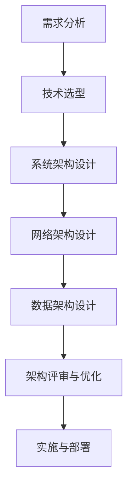
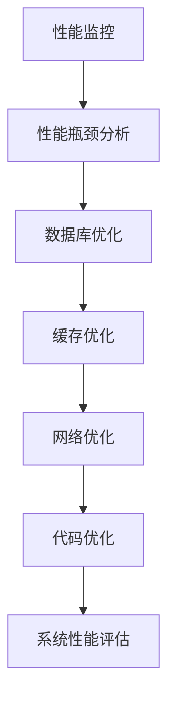
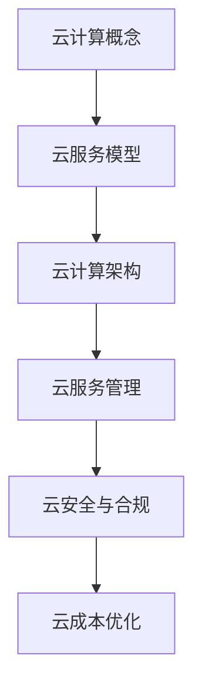
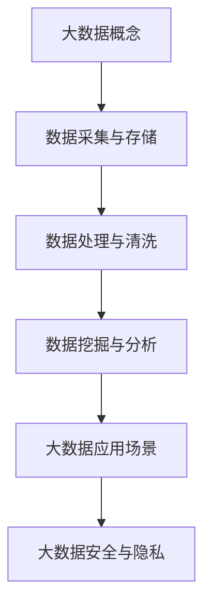
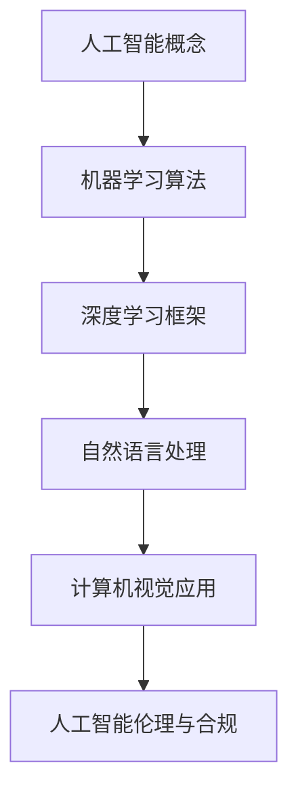
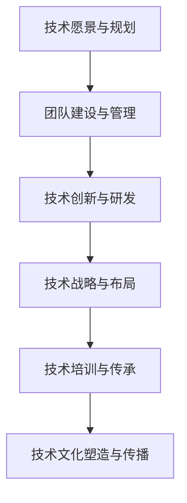

                 

关键词：互联网技术架构、全栈技术管理、核心能力、架构设计、系统优化、云计算、大数据、人工智能、技术领导力。

> 摘要：本文旨在深入探讨互联网技术架构中全栈技术管理的核心能力，从架构设计、系统优化、云计算、大数据、人工智能等多个方面展开，分析全栈技术管理的关键要素，探讨其在现代IT企业中的重要性及未来发展趋势。

## 1. 背景介绍

随着互联网技术的快速发展，企业对于互联网技术架构的需求越来越多样化，从简单的Web应用发展到复杂的大规模分布式系统，技术架构的复杂性和规模也在不断增加。在这样的背景下，全栈技术管理应运而生，它要求技术团队具备从前端到后端、从基础设施到应用开发、从运维到安全等全方位的技术能力和管理能力。

全栈技术管理的核心能力主要包括以下几个方面：架构设计能力、系统优化能力、云计算能力、大数据能力、人工智能能力以及技术领导力。这些能力不仅关系到技术团队能否高效地完成项目，更直接影响企业的竞争力和发展前景。

## 2. 核心概念与联系

### 2.1. 架构设计能力

架构设计能力是全栈技术管理的核心，它涉及到系统架构、网络架构、数据架构等多个方面。一个好的架构设计不仅能满足当前的业务需求，还要具备可扩展性和灵活性，以应对未来的变化。

#### Mermaid 流程图：



### 2.2. 系统优化能力

系统优化能力是指通过优化数据库、缓存、网络通信等各个方面来提高系统性能。系统优化不仅包括性能调优，还包括可靠性、安全性和可维护性等方面。

#### Mermaid 流程图：



### 2.3. 云计算能力

云计算能力是指企业利用云计算技术来部署、管理和优化其IT基础设施的能力。云计算不仅降低了企业IT基础设施的成本，还提供了更灵活、高效的服务。

#### Mermaid 流程图：



### 2.4. 大数据能力

大数据能力是指企业处理、存储和分析大规模数据的能力。大数据技术的应用已经深入到各个行业，成为企业创新和发展的驱动力。

#### Mermaid 流程图：



### 2.5. 人工智能能力

人工智能能力是指企业应用人工智能技术来解决实际业务问题的能力。人工智能正在改变企业的运营模式，提高生产效率，创造新的商业模式。

#### Mermaid 流程图：



### 2.6. 技术领导力

技术领导力是指技术团队在技术方向上的战略规划和决策能力，以及团队成员的领导与管理能力。技术领导力不仅关系到团队的技术水平，更直接影响企业的技术创新能力和市场竞争力。

#### Mermaid 流程图：



## 3. 核心算法原理 & 具体操作步骤

### 3.1 算法原理概述

在互联网技术架构中，核心算法的原理主要包括分布式计算、数据挖掘、机器学习、网络优化等。这些算法原理不仅涉及到理论层面的研究，还需要在实际应用中进行优化和调整。

### 3.2 算法步骤详解

#### 分布式计算：

1. **任务分解**：将大规模计算任务分解为多个小任务。
2. **任务分配**：将分解后的任务分配到分布式计算节点上。
3. **任务执行**：各个节点并行执行任务。
4. **结果汇总**：将各个节点的执行结果汇总，得到最终结果。

#### 数据挖掘：

1. **数据预处理**：对原始数据进行清洗、转换和集成。
2. **特征提取**：从预处理后的数据中提取有用的特征。
3. **模型选择**：选择合适的数据挖掘模型。
4. **模型训练**：使用特征数据训练模型。
5. **模型评估**：评估模型的性能和准确性。
6. **模型应用**：将训练好的模型应用于实际业务场景。

#### 机器学习：

1. **数据收集**：收集并整理训练数据。
2. **模型选择**：选择合适的机器学习模型。
3. **模型训练**：使用训练数据进行模型训练。
4. **模型评估**：评估模型的性能和泛化能力。
5. **模型部署**：将训练好的模型部署到生产环境中。

#### 网络优化：

1. **性能分析**：分析网络性能瓶颈。
2. **算法设计**：设计优化算法。
3. **算法实现**：将算法实现为代码。
4. **性能测试**：测试优化算法的性能。
5. **算法优化**：根据测试结果对算法进行优化。

### 3.3 算法优缺点

#### 分布式计算：

**优点**：提高计算速度，降低单点故障风险。

**缺点**：复杂度高，需要考虑数据一致性、网络延迟等问题。

#### 数据挖掘：

**优点**：能够从大量数据中发现有价值的信息。

**缺点**：数据处理成本高，模型训练时间较长。

#### 机器学习：

**优点**：能够自动学习和优化，提高业务效率。

**缺点**：模型泛化能力受数据影响大，需要大量训练数据。

#### 网络优化：

**优点**：提高网络传输速度，降低网络延迟。

**缺点**：算法设计和实现复杂，需要大量测试和调优。

### 3.4 算法应用领域

#### 分布式计算：

应用领域包括大数据处理、分布式数据库、云计算等。

#### 数据挖掘：

应用领域包括金融、电商、医疗等。

#### 机器学习：

应用领域包括智能推荐、图像识别、自然语言处理等。

#### 网络优化：

应用领域包括网络传输、数据中心、物联网等。

## 4. 数学模型和公式 & 详细讲解 & 举例说明

### 4.1 数学模型构建

在互联网技术架构中，数学模型的应用非常广泛，例如在分布式计算中，常见的数学模型有负载均衡模型、容错模型等。

#### 负载均衡模型：

假设有N个计算节点，每个节点的处理能力为C，当前任务处理量为T，负载均衡模型的目标是使得所有节点的处理能力都能得到充分利用。

数学模型构建如下：

$$
\min \sum_{i=1}^{N} (C_i - \frac{T}{N})
$$

其中，$C_i$表示第i个节点的处理能力。

#### 容错模型：

假设系统中有N个节点，每个节点的可靠性为R，容错模型的目标是保证系统在部分节点失效的情况下仍然能够正常运行。

数学模型构建如下：

$$
\max \sum_{i=1}^{N} R_i
$$

其中，$R_i$表示第i个节点的可靠性。

### 4.2 公式推导过程

#### 负载均衡模型推导：

首先，我们需要计算每个节点的处理量，假设第i个节点的处理量为$x_i$，则：

$$
x_i = \frac{T}{N}
$$

然后，我们需要计算每个节点的剩余处理能力，假设第i个节点的剩余处理能力为$C_i$，则：

$$
C_i = C - x_i
$$

最后，我们将所有节点的剩余处理能力求和，得到总剩余处理能力：

$$
\sum_{i=1}^{N} C_i = \sum_{i=1}^{N} (C - x_i) = N \cdot C - T
$$

因此，负载均衡模型的目标函数可以表示为：

$$
\min \sum_{i=1}^{N} (C_i - \frac{T}{N}) = \min (N \cdot C - T - \frac{T}{N}) = \min (N \cdot C - \frac{2T}{N})
$$

#### 容错模型推导：

首先，我们需要计算每个节点的失效概率，假设第i个节点的失效概率为$P_i$，则：

$$
P_i = 1 - R_i
$$

然后，我们需要计算系统整体的失效概率，假设系统整体的失效概率为$P$，则：

$$
P = \sum_{i=1}^{N} P_i = \sum_{i=1}^{N} (1 - R_i)
$$

最后，我们需要计算系统整体的可靠性，假设系统整体的可靠性为$R$，则：

$$
R = 1 - P
$$

因此，容错模型的目标函数可以表示为：

$$
\max \sum_{i=1}^{N} R_i = \max (N - \sum_{i=1}^{N} R_i)
$$

### 4.3 案例分析与讲解

#### 负载均衡模型案例：

假设有一个分布式计算系统，包含5个计算节点，每个节点的处理能力为1000个任务/小时，当前任务处理量为5000个任务。我们需要使用负载均衡模型来分配任务。

首先，计算每个节点的处理量：

$$
x_i = \frac{T}{N} = \frac{5000}{5} = 1000
$$

然后，计算每个节点的剩余处理能力：

$$
C_i = C - x_i = 1000 - 1000 = 0
$$

最后，计算总剩余处理能力：

$$
\sum_{i=1}^{N} C_i = 5 \cdot 1000 - 5000 = 5000
$$

因此，每个节点都需要处理1000个任务，系统总剩余处理能力为5000个任务。

#### 容错模型案例：

假设有一个包含5个节点的系统，每个节点的可靠性为0.9。我们需要使用容错模型来评估系统的可靠性。

首先，计算每个节点的失效概率：

$$
P_i = 1 - R_i = 1 - 0.9 = 0.1
$$

然后，计算系统整体的失效概率：

$$
P = \sum_{i=1}^{N} P_i = 5 \cdot 0.1 = 0.5
$$

最后，计算系统整体的可靠性：

$$
R = 1 - P = 1 - 0.5 = 0.5
$$

因此，系统的可靠性为0.5，即50%。

## 5. 项目实践：代码实例和详细解释说明

### 5.1 开发环境搭建

在开始编写代码之前，我们需要搭建一个适合开发的全栈技术管理项目环境。这里以一个简单的Web应用为例，我们将使用以下技术栈：

- 前端：HTML、CSS、JavaScript（React框架）
- 后端：Node.js、Express框架
- 数据库：MongoDB
- 容器化：Docker

### 5.2 源代码详细实现

#### 5.2.1 前端实现

前端部分我们使用React框架，主要实现用户界面和与后端的交互。

**前端代码示例：**

```jsx
// App.js
import React, { useState } from 'react';
import axios from 'axios';

function App() {
  const [data, setData] = useState('');

  const fetchData = async () => {
    const response = await axios.get('/api/data');
    setData(response.data);
  };

  return (
    <div>
      <h1>Data Fetcher</h1>
      <button onClick={fetchData}>Fetch Data</button>
      <p>{data}</p>
    </div>
  );
}

export default App;
```

#### 5.2.2 后端实现

后端部分我们使用Node.js和Express框架，主要负责处理前端请求和数据存储。

**后端代码示例：**

```javascript
// server.js
const express = require('express');
const mongoose = require('mongoose');
const Data = require('./models/data');

const app = express();
const PORT = process.env.PORT || 5000;

// Connect to MongoDB
mongoose.connect('mongodb://localhost:27017/myapp', {
  useNewUrlParser: true,
  useUnifiedTopology: true,
});

// Middleware
app.use(express.json());

// Routes
app.get('/api/data', async (req, res) => {
  try {
    const data = await Data.findOne();
    res.send(data.value);
  } catch (error) {
    res.status(500).send(error);
  }
});

app.post('/api/data', async (req, res) => {
  try {
    const newData = new Data({ value: req.body.value });
    await newData.save();
    res.status(201).send(newData);
  } catch (error) {
    res.status(500).send(error);
  }
});

app.listen(PORT, () => {
  console.log(`Server running on port ${PORT}`);
});
```

#### 5.2.3 数据库实现

数据库部分我们使用MongoDB，主要负责数据的存储和管理。

**数据库模型示例：**

```javascript
// models/data.js
const mongoose = require('mongoose');

const dataSchema = new mongoose.Schema({
  value: {
    type: String,
    required: true,
  },
});

module.exports = mongoose.model('Data', dataSchema);
```

### 5.3 代码解读与分析

#### 5.3.1 前端代码解读

前端代码使用了React的useState钩子来管理数据状态，当用户点击按钮时，触发fetchData函数，通过axios向后端发起GET请求，获取数据后更新状态。

#### 5.3.2 后端代码解读

后端代码使用了Express框架，通过定义两个路由（/api/data）来处理前端的请求。GET请求用于获取数据，POST请求用于存储数据。使用了MongoDB的模型来操作数据。

#### 5.3.3 数据库代码解读

数据库模型定义了一个简单的数据结构，用于存储字符串类型的数据。

### 5.4 运行结果展示

当运行该应用后，访问前端页面，点击“Fetch Data”按钮，将会触发后端的GET请求，获取数据库中的数据并显示在页面上。点击“Submit”按钮，可以在前端输入数据，并通过POST请求将数据存储到数据库中。

## 6. 实际应用场景

全栈技术管理在实际应用场景中扮演着至关重要的角色。以下是一些典型的应用场景：

### 6.1. 企业内部系统

企业内部系统通常需要处理大量的业务数据，要求系统具备高可用性、高性能和安全性。全栈技术管理能够帮助企业设计出合理的架构，优化系统性能，确保系统的稳定运行。

### 6.2. 电商平台

电商平台需要处理海量的用户请求和数据，要求系统具备高并发处理能力。全栈技术管理可以帮助企业实现分布式架构，优化数据库性能，确保系统的流畅运行。

### 6.3. 金融系统

金融系统的安全性、可靠性和合规性要求非常高。全栈技术管理可以帮助企业实现分布式架构，确保数据安全，提高系统的稳定性和性能。

### 6.4. 物联网平台

物联网平台需要处理大量的设备数据，要求系统具备实时数据处理和分析能力。全栈技术管理可以帮助企业设计出高效的数据处理架构，实现设备数据的有效管理和分析。

## 7. 工具和资源推荐

### 7.1. 学习资源推荐

- 《互联网架构实战》
- 《分布式系统原理与架构》
- 《大数据架构与设计》
- 《人工智能应用实践》

### 7.2. 开发工具推荐

- VS Code
- Git
- Docker
- Kubernetes

### 7.3. 相关论文推荐

- 《分布式计算中的负载均衡算法研究》
- 《大数据存储与处理技术》
- 《人工智能在金融领域的应用》
- 《物联网系统架构与关键技术》

## 8. 总结：未来发展趋势与挑战

### 8.1. 研究成果总结

通过本文的探讨，我们总结了全栈技术管理的核心能力，包括架构设计、系统优化、云计算、大数据、人工智能和技术领导力。这些能力不仅提升了企业的技术水平和竞争力，也为企业的可持续发展提供了保障。

### 8.2. 未来发展趋势

随着技术的不断发展，全栈技术管理将在以下几个方面继续发展：

- **云计算和大数据技术的深度融合**：企业将更多地使用云计算和大数据技术，实现数据的高效存储、处理和分析。
- **人工智能技术的广泛应用**：人工智能技术将在更多领域得到应用，如智能推荐、智能客服、自动驾驶等。
- **分布式系统的优化**：分布式系统将在性能、可靠性和可扩展性方面持续优化，以满足企业日益增长的需求。

### 8.3. 面临的挑战

全栈技术管理在发展过程中也将面临一些挑战：

- **技术复杂性**：随着技术的不断发展，系统架构和技术栈将越来越复杂，对技术团队的要求也越来越高。
- **数据安全和隐私**：在云计算和大数据时代，数据安全和隐私保护成为企业面临的重要挑战。
- **技术人才短缺**：随着技术需求的不断增长，技术人才短缺将成为一个普遍问题，企业需要采取有效措施吸引和留住优秀人才。

### 8.4. 研究展望

未来，全栈技术管理研究将集中在以下几个方面：

- **自动化和智能化**：通过引入自动化和智能化技术，提高系统架构设计的效率和质量。
- **跨领域融合**：将人工智能、大数据、云计算等不同领域的技术进行融合，实现更高效、更智能的技术解决方案。
- **可持续性**：关注技术对环境的影响，实现绿色、可持续的技术发展。

## 9. 附录：常见问题与解答

### 9.1. 什么是全栈技术管理？

全栈技术管理是指技术团队在互联网技术架构中，具备从前端到后端、从基础设施到应用开发、从运维到安全等全方位的技术能力和管理能力。

### 9.2. 全栈技术管理包括哪些核心能力？

全栈技术管理包括架构设计能力、系统优化能力、云计算能力、大数据能力、人工智能能力以及技术领导力。

### 9.3. 如何提高全栈技术管理的效率？

提高全栈技术管理的效率可以从以下几个方面入手：

- **标准化和规范化**：制定统一的技术标准和规范，提高开发效率和质量。
- **自动化和智能化**：引入自动化和智能化工具，减少手动操作，提高工作效率。
- **团队合作**：建立高效的团队协作机制，确保项目顺利进行。

### 9.4. 全栈技术管理在企业发展中的作用是什么？

全栈技术管理在企业发展中扮演着至关重要的角色，它能够帮助企业提升技术能力、优化系统性能、确保数据安全和隐私，从而提高企业的竞争力和发展潜力。作者：禅与计算机程序设计艺术 / Zen and the Art of Computer Programming
----------------------------------------------------------------

以上是《互联网技术架构全栈技术管理核心能力》的完整文章，内容涵盖了核心概念、算法原理、数学模型、项目实践、实际应用场景、工具和资源推荐以及未来发展趋势与挑战等多个方面。希望这篇文章能对您在互联网技术架构和全栈技术管理方面的研究和实践提供一些有价值的参考。如果您有任何疑问或需要进一步讨论，请随时提出。作者：禅与计算机程序设计艺术 / Zen and the Art of Computer Programming。

