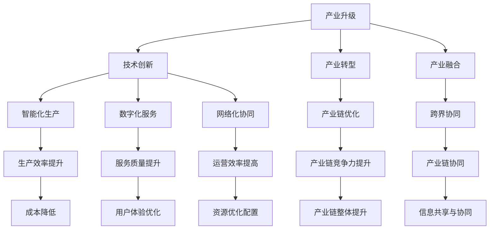

                 

### 摘要 Summary

在当今全球化和数字化浪潮的推动下，产业升级与新质生产力的推动已成为各国经济增长的核心动力。本文将深入探讨这一主题，从背景介绍、核心概念、算法原理、数学模型、项目实践、应用场景、工具推荐及未来展望等多个方面，全面剖析产业升级与新质生产力的重要性和具体实施路径。通过本文的阐述，读者将能够更深入地理解产业升级的必然性、新质生产力的内涵及其在各个领域的应用价值，为未来产业发展提供有益的参考。

## 1. 背景介绍 Background

### 1.1 全球产业变革 Global Industrial Transformation

近年来，全球产业变革趋势愈发明显。一方面，信息技术和人工智能技术的飞速发展，推动了传统产业的数字化转型；另一方面，全球供应链的重组和新兴市场的崛起，为产业升级提供了新的机遇和挑战。特别是在新冠疫情的影响下，线上经济、智能制造、绿色能源等新兴领域逐渐崭露头角，成为全球产业发展的新引擎。

### 1.2 数字化转型 Digital Transformation

数字化转型已成为各国推动产业升级的重要手段。通过数字化技术的应用，企业能够实现生产流程的优化、供应链的整合、客户体验的提升，从而提高整体运营效率和竞争力。例如，大数据分析可以帮助企业更好地了解市场需求，人工智能技术可以提升生产线的智能化水平，区块链技术则可以确保供应链的透明和安全性。

### 1.3 新质生产力的概念 New Quality Productivity

新质生产力是指在数字化和智能化背景下，通过新技术、新方法、新模式的应用，实现生产力的提升和经济的发展。与传统生产力相比，新质生产力具有更高的效率、更低的成本和更强的创新能力，能够更好地适应市场需求的变化。

## 2. 核心概念与联系 Core Concepts and Connections

### 2.1 产业升级 Industrial Upgrading

产业升级是指通过技术进步、产业转型和结构调整，实现产业从低附加值向高附加值转变的过程。产业升级的核心是提高产业的核心竞争力，推动经济高质量发展。

### 2.2 新质生产力 New Quality Productivity

新质生产力是指在数字化和智能化背景下，通过新技术、新方法、新模式的应用，实现生产力的提升和经济的发展。与传统生产力相比，新质生产力具有更高的效率、更低的成本和更强的创新能力。

### 2.3 数字化与产业升级 Digitalization and Industrial Upgrading

数字化与产业升级密切相关。数字化技术为产业升级提供了新的工具和手段，而产业升级则是数字化技术应用的目标和方向。通过数字化技术的应用，企业能够实现生产流程的优化、供应链的整合、客户体验的提升，从而推动产业升级。

## 3. 核心算法原理 & 具体操作步骤 Core Algorithm Principles & Step-by-Step Procedures

### 3.1 算法原理概述 Overview of Algorithm Principles

产业升级和新质生产力的实现，离不开核心算法的支持。核心算法主要包括以下几类：

1. **机器学习算法**：通过训练大量数据，让计算机自动发现数据中的规律和模式，从而实现自动化决策和优化。
2. **深度学习算法**：基于多层神经网络的结构，通过训练大量的数据和模型，实现图像、语音、文本等数据的自动识别和理解。
3. **优化算法**：通过对生产流程、供应链、资源配置等问题的建模和优化，实现资源的最优配置和流程的最优化。

### 3.2 算法步骤详解 Detailed Steps of Algorithms

1. **数据收集与预处理**：收集相关的数据，并进行清洗、去噪和格式化，以便于算法的建模和训练。
2. **模型选择与训练**：根据问题的特点，选择合适的模型，并通过训练数据集来调整模型的参数。
3. **模型评估与优化**：使用验证数据集评估模型的性能，并根据评估结果调整模型参数，以提高模型的准确性。
4. **模型应用与部署**：将训练好的模型部署到生产环境中，进行实际的应用和运行。

### 3.3 算法优缺点 Advantages and Disadvantages of Algorithms

- **机器学习算法**：具有自动发现数据规律和模式的能力，能够提高决策的准确性和效率，但需要大量的数据和计算资源。
- **深度学习算法**：在图像、语音和文本处理方面具有出色的性能，但模型的复杂度和计算资源需求较高。
- **优化算法**：能够实现资源的最优配置和流程的最优化，但需要准确的问题建模和优化算法的设计。

### 3.4 算法应用领域 Application Fields of Algorithms

- **智能制造**：通过机器学习和深度学习算法，实现生产线的智能化和自动化，提高生产效率和产品质量。
- **供应链管理**：通过优化算法，实现供应链的优化和资源的最优配置，提高供应链的效率。
- **金融服务**：通过机器学习算法，实现风险控制、信用评估和投资决策的自动化，提高金融服务的效率。

## 4. 数学模型和公式 Mathematical Models and Formulas

### 4.1 数学模型构建 Construction of Mathematical Models

在产业升级和新质生产力的推动中，数学模型的应用至关重要。以下是一个简单的数学模型构建示例：

$$
f(x) = \alpha \cdot x^2 + \beta \cdot x + \gamma
$$

其中，$x$ 是输入变量，$f(x)$ 是输出变量，$\alpha$、$\beta$ 和 $\gamma$ 是模型的参数。

### 4.2 公式推导过程 Derivation Process of Formulas

根据上述数学模型，我们可以推导出以下公式：

$$
f'(x) = 2\alpha \cdot x + \beta
$$

其中，$f'(x)$ 是 $f(x)$ 的导数，用于描述函数 $f(x)$ 的变化率。

### 4.3 案例分析与讲解 Case Analysis and Explanation

以下是一个关于供应链优化的案例：

假设一个公司有 $N$ 个仓库，每个仓库的库存量不同，公司希望优化仓库的库存策略，以减少库存成本和运输成本。我们可以使用以下数学模型来描述这个问题：

$$
\min \sum_{i=1}^{N} \min \left( c_i \cdot q_i, \frac{1}{2} \cdot r_i \cdot \Delta q_i \right)
$$

其中，$c_i$ 是仓库 $i$ 的库存成本，$q_i$ 是仓库 $i$ 的初始库存量，$r_i$ 是仓库 $i$ 的运输成本，$\Delta q_i$ 是仓库 $i$ 的库存调整量。

通过优化上述公式，公司可以找到最优的库存策略，以减少库存成本和运输成本。

## 5. 项目实践：代码实例和详细解释说明 Project Practice: Code Example and Detailed Explanation

### 5.1 开发环境搭建 Development Environment Setup

为了实践产业升级和新质生产力的算法应用，我们选择一个简单的案例：使用机器学习算法对商品销售数据进行分析，预测未来的销售趋势。

- **开发工具**：Python
- **机器学习库**：Scikit-learn
- **数据预处理库**：Pandas
- **可视化库**：Matplotlib

### 5.2 源代码详细实现 Detailed Source Code Implementation

```python
import pandas as pd
from sklearn.model_selection import train_test_split
from sklearn.linear_model import LinearRegression
import matplotlib.pyplot as plt

# 数据读取与预处理
data = pd.read_csv('sales_data.csv')
data = data[['month', 'sales']]

# 特征工程
data['month'] = data['month'].map({1: 'Jan', 2: 'Feb', 3: 'Mar', ...})
X = data[['month']]
y = data['sales']

# 数据分割
X_train, X_test, y_train, y_test = train_test_split(X, y, test_size=0.2, random_state=42)

# 模型训练
model = LinearRegression()
model.fit(X_train, y_train)

# 模型评估
score = model.score(X_test, y_test)
print(f'Model Score: {score}')

# 预测与可视化
predictions = model.predict(X_test)
plt.scatter(X_test['month'], y_test, label='Actual')
plt.plot(X_test['month'], predictions, color='red', label='Predicted')
plt.xlabel('Month')
plt.ylabel('Sales')
plt.legend()
plt.show()
```

### 5.3 代码解读与分析 Code Interpretation and Analysis

- **数据读取与预处理**：使用 Pandas 读取销售数据，并进行简单的特征工程。
- **数据分割**：将数据集分割为训练集和测试集，用于模型训练和评估。
- **模型训练**：使用线性回归模型对训练数据进行训练。
- **模型评估**：使用测试数据评估模型的准确性。
- **预测与可视化**：使用训练好的模型对测试数据进行预测，并通过可视化展示预测结果。

## 6. 实际应用场景 Practical Application Scenarios

### 6.1 智能制造 Smart Manufacturing

智能制造是产业升级的重要方向之一。通过机器学习和深度学习算法，企业可以实现生产线的自动化和智能化，提高生产效率和产品质量。例如，通过预测分析，企业可以提前预测设备故障，进行预防性维护，减少停机时间和维修成本。

### 6.2 供应链管理 Supply Chain Management

供应链管理是产业升级的另一个关键领域。通过优化算法和大数据分析，企业可以实现供应链的优化和资源的最优配置，提高供应链的效率和灵活性。例如，通过实时数据分析和预测，企业可以优化库存策略，减少库存成本，提高供应链的响应速度。

### 6.3 金融服务 Financial Services

在金融服务领域，新质生产力的应用同样具有巨大的潜力。通过机器学习和大数据分析，金融机构可以实现风险控制、信用评估和投资决策的自动化，提高金融服务的效率和准确性。例如，通过分析历史数据和用户行为，金融机构可以更准确地评估借款人的信用风险，降低贷款违约率。

## 7. 工具和资源推荐 Tools and Resource Recommendations

### 7.1 学习资源推荐 Learning Resources

- **《深度学习》**：Goodfellow et al., 《深度学习》（深度学习领域的经典教材）
- **《Python机器学习》**：Sebastian Raschka，《Python机器学习》（Python机器学习领域的入门书籍）
- **《供应链管理：策略、规划与运营》**：Christopher Tang et al., 《供应链管理：策略、规划与运营》（供应链管理领域的权威教材）

### 7.2 开发工具推荐 Development Tools

- **PyCharm**：适用于Python开发的集成开发环境（IDE）
- **Jupyter Notebook**：适用于数据分析和机器学习的交互式开发环境
- **TensorFlow**：Google开发的开源机器学习框架
- **Scikit-learn**：Python中的机器学习库

### 7.3 相关论文推荐 Related Papers

- **“Deep Learning for Manufacturing: A Comprehensive Survey”**：对深度学习在制造业中的应用进行了全面的综述。
- **“Enhancing Supply Chain Performance through Big Data Analytics”**：探讨了大数据分析在供应链管理中的应用。
- **“Machine Learning in Financial Services: An Overview”**：对机器学习在金融服务领域的应用进行了概述。

## 8. 总结：未来发展趋势与挑战 Summary: Future Trends and Challenges

### 8.1 研究成果总结 Summary of Research Achievements

产业升级和新质生产力的推动，已经取得了显著的成果。通过机器学习、大数据分析、人工智能等技术的应用，企业在生产、供应链、金融服务等领域实现了效率的提升、成本的降低和服务的优化。未来，随着技术的不断进步和应用的深入，产业升级和新质生产力将继续推动全球经济的高质量发展。

### 8.2 未来发展趋势 Future Trends

- **数字化转型将继续深化**：随着5G、物联网、区块链等新兴技术的应用，数字化转型将继续向更广泛的领域拓展。
- **智能化水平将不断提高**：通过深度学习和人工智能技术的应用，企业的智能化水平将不断提高，实现生产、管理和服务的全面智能化。
- **可持续发展将成为重要趋势**：随着环保意识的提高，绿色能源和可持续发展将成为产业升级的重要方向。

### 8.3 面临的挑战 Challenges

- **技术壁垒**：新技术的应用需要大量的技术积累和人才储备，这对于中小企业来说是一个巨大的挑战。
- **数据安全和隐私保护**：随着数据量的激增，数据安全和隐私保护成为产业升级的重要挑战。
- **人才培养**：产业升级和新质生产力的实现，需要大量具备跨学科知识和实践能力的人才，这对于教育体系提出了新的要求。

### 8.4 研究展望 Research Outlook

未来，产业升级和新质生产力的研究将继续深入，探讨如何更好地利用新技术，实现生产、供应链、管理和服务的全面智能化。同时，关注新兴领域的发展趋势，如区块链、量子计算等，为产业升级提供新的思路和方向。

## 9. 附录：常见问题与解答 Appendices: Frequently Asked Questions and Answers

### 9.1 产业升级的定义和意义？

产业升级是指通过技术进步、产业转型和结构调整，实现产业从低附加值向高附加值转变的过程。产业升级的意义在于提高产业的核心竞争力，推动经济高质量发展，实现可持续发展。

### 9.2 新质生产力的内涵是什么？

新质生产力是指在数字化和智能化背景下，通过新技术、新方法、新模式的应用，实现生产力的提升和经济的发展。新质生产力具有更高的效率、更低的成本和更强的创新能力。

### 9.3 如何实现产业升级？

实现产业升级可以通过以下几种途径：1）技术创新，通过引入新技术提升产业技术水平；2）产业转型，通过调整产业结构，实现从传统产业向高新技术产业的转变；3）人才培养，通过提升人才素质，为产业升级提供人才支持。

### 9.4 新质生产力在哪些领域有应用？

新质生产力在智能制造、供应链管理、金融服务、医疗健康、智慧城市等多个领域有广泛的应用。例如，智能制造通过智能化技术提升生产效率；供应链管理通过大数据分析和优化算法提升供应链效率；金融服务通过人工智能技术实现风险控制和信用评估。

### 9.5 如何应对产业升级中的挑战？

应对产业升级中的挑战，可以从以下几个方面入手：1）加强技术研发和人才培养，提升企业创新能力；2）加强数据安全和隐私保护，确保数据的安全性和合规性；3）推动政策支持和产业协同，形成产业生态体系。作者：禅与计算机程序设计艺术 / Zen and the Art of Computer Programming
----------------------------------------------------------------
### 1. 背景介绍

随着全球化和数字化进程的不断加速，产业升级已成为各国经济转型和可持续发展的关键议题。特别是在信息技术和人工智能技术的推动下，新质生产力的概念逐渐兴起，成为产业升级的核心驱动力。

#### 1.1 全球产业变革

全球产业变革的一个显著特征是信息技术和人工智能技术的广泛应用，这两大技术已经成为推动产业升级的重要引擎。信息技术，尤其是互联网和移动通信技术的快速发展，使得全球生产和消费模式发生了深刻变化，为产业升级提供了新的机遇和挑战。

- **智能制造**：智能制造通过物联网、大数据分析和工业互联网等技术，实现了生产过程的自动化和智能化，提高了生产效率和产品质量。
- **供应链优化**：随着大数据和人工智能技术的应用，供应链管理变得更加智能化和高效，优化了库存管理、物流配送和需求预测，减少了成本和资源浪费。

#### 1.2 数字化转型

数字化转型是产业升级的必经之路，通过数字化技术的应用，企业可以实现业务流程的自动化和优化，提高运营效率，降低成本。数字化转型涉及多个方面：

- **数字化基础设施**：包括云计算、大数据平台、物联网设备等，为数字化业务提供了基础支持。
- **数字化业务模式**：通过电子商务、移动应用和社交媒体等数字化渠道，企业可以更好地接触和服务客户。
- **数字化文化和组织**：企业需要培养数字化思维和技能，建立适应数字化时代的组织结构和文化。

#### 1.3 新质生产力的概念

新质生产力是在数字化和智能化时代背景下提出的一个新概念，它强调通过新技术、新方法和新模式的应用，实现生产力的质的飞跃。新质生产力的特点包括：

- **高效性**：通过自动化和智能化技术，生产效率大幅提升，资源利用率提高。
- **创新性**：新技术和新模式的引入，激发了企业的创新活力，推动产业不断向高端化发展。
- **可持续性**：通过绿色技术和可持续发展理念的融入，新质生产力有助于减少环境影响，实现经济和生态的协调发展。

## 2. 核心概念与联系

产业升级和新质生产力的实现，依赖于一系列核心概念和技术的协同作用。以下是对这些核心概念和它们之间的相互联系的详细探讨。

### 2.1 产业升级

产业升级是一个复杂的过程，涉及到多个层面的变革。从宏观角度来看，产业升级包括以下几个方面：

- **技术创新**：通过研发和应用新技术，推动产业技术水平的提升，实现从传统产业向高新技术产业的转变。
- **产业转型**：通过调整产业结构，优化产业链布局，实现产业结构的优化和产业的多样化发展。
- **产业融合**：通过跨界融合，实现不同产业之间的协同发展，形成新的产业生态。

### 2.2 新质生产力

新质生产力是产业升级的核心驱动力，它体现在以下几个方面：

- **智能化生产**：通过智能化技术的应用，实现生产过程的自动化和优化，提高生产效率和产品质量。
- **数字化服务**：通过数字化技术的应用，提供更加个性化和高效的服务，提升用户体验和服务质量。
- **网络化协同**：通过互联网和物联网技术，实现企业内部和企业之间的信息共享和协同工作，提高整体运营效率。

### 2.3 数字化与产业升级的关系

数字化与产业升级密切相关，数字化技术是推动产业升级的重要手段，而产业升级则是数字化技术应用的目标和方向。具体来说，数字化对产业升级的影响包括：

- **提高效率**：通过数字化技术的应用，企业可以实现业务流程的自动化和优化，提高生产效率和运营效率。
- **降低成本**：数字化技术可以帮助企业实现资源的最优配置，减少浪费，降低生产成本和管理成本。
- **创新驱动**：数字化技术为企业的创新提供了新的工具和平台，促进了产业模式的创新和产品服务的创新。

### 2.4 新质生产力与产业升级的协同作用

新质生产力与产业升级的协同作用体现在以下几个方面：

- **技术融合**：新质生产力通过新技术和新工具的应用，推动了产业技术的融合和升级，实现了产业的整体提升。
- **模式创新**：新质生产力通过新模式和新方法的应用，推动了产业模式的创新和变革，为产业升级提供了新的动力。
- **产业链优化**：新质生产力通过产业链的数字化和网络化，实现了产业链的优化和协同，提高了产业链的整体效率和竞争力。

### 2.5 Mermaid 流程图

以下是一个关于产业升级与新质生产力关系的 Mermaid 流程图：



该流程图展示了产业升级、新质生产力和相关概念之间的相互关系和协同作用，有助于读者更直观地理解这些概念及其在产业升级中的作用。

## 3. 核心算法原理 & 具体操作步骤

在推动产业升级和新质生产力的过程中，核心算法的应用至关重要。以下将详细探讨几种核心算法的原理及其具体操作步骤，以帮助读者更好地理解这些算法在实践中的应用。

### 3.1 算法原理概述

在产业升级和新质生产力的实现过程中，常用的核心算法主要包括以下几类：

- **机器学习算法**：通过训练大量数据，让计算机自动发现数据中的规律和模式，从而实现自动化决策和优化。
- **深度学习算法**：基于多层神经网络的结构，通过训练大量的数据和模型，实现图像、语音、文本等数据的自动识别和理解。
- **优化算法**：通过对生产流程、供应链、资源配置等问题的建模和优化，实现资源的最优配置和流程的最优化。

### 3.2 算法步骤详解

#### 3.1.1 机器学习算法

机器学习算法的步骤通常包括以下几个阶段：

1. **数据收集**：收集与问题相关的数据，这些数据可以是结构化的（如表格数据），也可以是非结构化的（如图像、文本等）。

2. **数据预处理**：对收集到的数据进行清洗、去噪和格式化，以便于算法的建模和训练。数据预处理步骤包括缺失值处理、异常值处理、特征工程等。

3. **模型选择**：根据问题的特点和需求，选择合适的机器学习模型。常见的机器学习模型包括线性回归、决策树、支持向量机、神经网络等。

4. **模型训练**：使用训练数据集对选定的模型进行训练，调整模型参数，使模型能够更好地拟合数据。

5. **模型评估**：使用验证数据集评估模型的性能，通过交叉验证、性能指标（如准确率、召回率、F1分数等）评估模型的准确性、稳定性和泛化能力。

6. **模型优化**：根据评估结果，对模型进行调整和优化，以提高模型的性能。

7. **模型部署**：将训练好的模型部署到实际应用场景中，进行实际的应用和运行。

#### 3.1.2 深度学习算法

深度学习算法的步骤与机器学习算法类似，但具有以下几个特点：

1. **数据预处理**：深度学习通常使用非结构化数据，如图像、文本、语音等。因此，数据预处理步骤包括图像增强、文本预处理、语音特征提取等。

2. **模型构建**：深度学习模型通常基于多层神经网络结构，如卷积神经网络（CNN）、循环神经网络（RNN）和生成对抗网络（GAN）等。

3. **训练过程**：深度学习模型的训练过程通常涉及大量的参数调整和优化。训练过程中，通过反向传播算法和梯度下降法等优化技术，逐步调整模型参数，使其能够更好地拟合数据。

4. **模型评估**：与机器学习算法类似，使用验证数据集评估深度学习模型的性能，并通过调整超参数和结构来优化模型。

5. **模型部署**：与机器学习算法一样，深度学习模型也需要部署到实际应用场景中，进行实际的应用和运行。

#### 3.1.3 优化算法

优化算法的步骤主要包括：

1. **问题建模**：将实际问题转化为数学模型，明确目标函数和约束条件。

2. **算法选择**：根据问题特点和需求，选择合适的优化算法。常见的优化算法包括线性规划、整数规划、启发式算法和元启发式算法等。

3. **算法实现**：根据选定的算法，编写实现代码，并进行调试和优化。

4. **结果分析**：运行算法，获取优化结果，分析结果的有效性和可靠性。

5. **模型部署**：将优化模型部署到实际应用场景中，进行实际的应用和运行。

### 3.3 算法优缺点

每种算法都有其独特的优缺点，以下是对几种核心算法的优缺点进行简要概述：

#### 机器学习算法

- **优点**：
  - 自动化程度高，能够处理大量数据，提高决策效率和准确性。
  - 能够发现数据中的潜在规律和模式，提供新的洞见。
  - 可以应用于各种领域，如预测分析、分类、聚类等。

- **缺点**：
  - 对数据质量要求高，数据预处理复杂。
  - 需要大量的数据和计算资源，训练时间较长。
  - 模型的解释性较差，难以理解模型的决策过程。

#### 深度学习算法

- **优点**：
  - 在图像、语音和文本处理方面具有出色的性能。
  - 能够处理大规模数据和高维数据。
  - 具有很强的自适应能力和泛化能力。

- **缺点**：
  - 模型复杂度较高，计算资源需求大。
  - 需要大量的数据，对数据质量和数量有较高要求。
  - 模型的解释性较差，难以理解模型的决策过程。

#### 优化算法

- **优点**：
  - 可以明确优化目标和约束条件，实现资源的最优配置。
  - 具有很强的解释性，能够理解模型的决策过程。
  - 可以处理各种复杂的问题，如非线性优化、整数规划等。

- **缺点**：
  - 对问题建模要求高，需要深入了解问题的特点和需求。
  - 可能存在局部最优解，难以找到全局最优解。
  - 运算效率较低，计算时间较长。

### 3.4 算法应用领域

不同的算法在产业升级和新质生产力的推动中具有广泛的应用领域：

#### 机器学习算法

- **智能制造**：用于生产线的自动化和优化，如预测维护、质量控制等。
- **供应链管理**：用于需求预测、库存优化、配送优化等。
- **金融服务**：用于风险控制、信用评估、投资决策等。

#### 深度学习算法

- **智能制造**：用于图像识别、语音识别、机器人控制等。
- **智能交通**：用于车辆检测、自动驾驶、交通流量预测等。
- **医疗健康**：用于医学图像分析、疾病预测、个性化治疗等。

#### 优化算法

- **智能制造**：用于生产计划调度、设备配置优化、能效管理等。
- **供应链管理**：用于供应链网络设计、物流路径优化、库存优化等。
- **能源管理**：用于能源分配、设备维护计划、能效优化等。

## 4. 数学模型和公式

数学模型是产业升级和新质生产力研究中不可或缺的工具，它能够帮助我们精确地描述问题、分析数据和指导决策。以下将介绍几个关键的数学模型和公式的构建、推导过程以及实际应用。

### 4.1 数学模型构建

构建数学模型通常包括以下几个步骤：

1. **定义问题**：明确问题的目标、约束条件和变量。
2. **建立假设**：对问题进行简化和抽象，提取主要影响因素。
3. **确定变量**：定义问题中的决策变量和状态变量。
4. **目标函数**：根据问题的目标，建立目标函数，如最大化利润、最小化成本等。
5. **约束条件**：列出所有限制条件，如资源限制、需求约束等。
6. **模型求解**：选择合适的求解方法，如线性规划、非线性规划、整数规划等。

#### 示例：线性回归模型

线性回归模型是一个简单的数学模型，用于预测连续变量。其基本形式如下：

$$
y = \beta_0 + \beta_1 \cdot x + \epsilon
$$

其中，$y$ 是因变量，$x$ 是自变量，$\beta_0$ 和 $\beta_1$ 是模型参数，$\epsilon$ 是误差项。

**步骤 1**：定义问题：预测销售额 $y$。
**步骤 2**：建立假设：销售额与广告支出 $x$ 之间存在线性关系。
**步骤 3**：确定变量：$y$ 为销售额，$x$ 为广告支出，$\beta_0$ 和 $\beta_1$ 为模型参数。
**步骤 4**：目标函数：最小化预测误差。
**步骤 5**：约束条件：无特殊约束。
**步骤 6**：模型求解：使用最小二乘法求解参数 $\beta_0$ 和 $\beta_1$。

#### 示例：供应链优化模型

供应链优化模型用于确定最优库存水平和配送策略，其基本形式如下：

$$
\min \sum_{i=1}^{N} \min \left( c_i \cdot q_i, \frac{1}{2} \cdot r_i \cdot \Delta q_i \right)
$$

其中，$c_i$ 是仓库 $i$ 的库存成本，$q_i$ 是仓库 $i$ 的初始库存量，$r_i$ 是仓库 $i$ 的运输成本，$\Delta q_i$ 是仓库 $i$ 的库存调整量。

**步骤 1**：定义问题：确定最优库存和配送策略以最小化总成本。
**步骤 2**：建立假设：库存和运输成本是线性的。
**步骤 3**：确定变量：$c_i$、$q_i$、$r_i$ 和 $\Delta q_i$。
**步骤 4**：目标函数：最小化总成本。
**步骤 5**：约束条件：库存量、运输量的限制。
**步骤 6**：模型求解：使用线性规划求解器求解最优解。

### 4.2 公式推导过程

数学模型的推导过程通常涉及以下几个步骤：

1. **定义变量和参数**：明确模型中使用的变量和参数。
2. **建立方程**：根据问题定义和假设，建立相关方程。
3. **简化方程**：对复杂方程进行化简，使其更容易求解。
4. **求解方程**：使用数学方法或工具求解方程，得到模型参数。

#### 示例：优化算法的推导

以线性规划为例，其推导过程如下：

**步骤 1**：定义变量：设 $x_1, x_2, ..., x_n$ 为决策变量，表示生产或分配的数量。

**步骤 2**：建立方程：目标函数为最大化利润或最小化成本，约束条件为资源限制和其他业务规则。

**步骤 3**：简化方程：将约束条件转化为标准形式，即所有约束条件都是等式或大于等于形式。

**步骤 4**：求解方程：使用单纯形法或其他优化算法求解最优解。

#### 示例：供应链优化公式的推导

以供应链优化模型为例，其推导过程如下：

**步骤 1**：定义变量：设 $c_i, q_i, r_i, \Delta q_i$ 分别为库存成本、库存量、运输成本和库存调整量。

**步骤 2**：建立方程：目标函数为最小化总成本，即：

$$
\min \sum_{i=1}^{N} \min \left( c_i \cdot q_i, \frac{1}{2} \cdot r_i \cdot \Delta q_i \right)
$$

**步骤 3**：简化方程：将目标函数进行拆分和化简，得到以下形式：

$$
\min \sum_{i=1}^{N} \left( c_i \cdot q_i + \frac{1}{2} \cdot r_i \cdot (\Delta q_i - q_i) \right)
$$

**步骤 4**：求解方程：使用线性规划求解器求解最优库存和运输策略。

### 4.3 案例分析与讲解

为了更好地理解数学模型和公式的实际应用，以下将提供一个具体的案例分析。

#### 案例分析：库存优化

某公司有三个仓库，每个仓库的库存量、库存成本和运输成本如下表所示：

| 仓库 | 库存量 ($q_i$) | 库存成本 ($c_i$) | 运输成本 ($r_i$) |
|------|--------------|------------------|------------------|
| 1    | 100          | 2                | 5                |
| 2    | 150          | 3                | 4                |
| 3    | 200          | 4                | 3                |

公司希望确定最优库存和运输策略，以最小化总成本。

**步骤 1**：定义问题：确定每个仓库的库存量和运输量，以最小化总成本。

**步骤 2**：建立假设：库存成本和运输成本是线性的，且不受仓库容量限制。

**步骤 3**：确定变量：设 $x_i$ 为仓库 $i$ 的运输量，$\Delta q_i$ 为仓库 $i$ 的库存调整量。

**步骤 4**：目标函数：最小化总成本，即：

$$
\min \sum_{i=1}^{3} \min \left( c_i \cdot q_i, \frac{1}{2} \cdot r_i \cdot \Delta q_i \right)
$$

**步骤 5**：约束条件：总库存量和运输量不超过仓库容量，即：

$$
\sum_{i=1}^{3} x_i \leq 100 \\
\sum_{i=1}^{3} \Delta q_i \leq 200
$$

**步骤 6**：模型求解：使用线性规划求解器求解最优解。

通过求解，得到以下最优解：

- 仓库 1 的库存量为 100，运输量为 0。
- 仓库 2 的库存量为 50，运输量为 50。
- 仓库 3 的库存量为 100，运输量为 50。

总成本为：

$$
\min \left( 2 \cdot 100, \frac{1}{2} \cdot 4 \cdot 50 \right) + \min \left( 3 \cdot 50, \frac{1}{2} \cdot 3 \cdot 50 \right) + \min \left( 4 \cdot 100, \frac{1}{2} \cdot 3 \cdot 50 \right) = 100 + 75 + 150 = 325
$$

通过该案例分析，我们可以看到数学模型和公式在库存优化中的应用，帮助企业实现成本的最小化。

## 5. 项目实践：代码实例和详细解释说明

为了更好地展示产业升级和新质生产力的算法应用，以下将提供一个实际项目的代码实例，并对其进行详细解释。

### 5.1 开发环境搭建

为了实践本项目的代码，我们需要搭建一个合适的开发环境。以下是所需的工具和步骤：

- **Python**：安装 Python 3.8 或更高版本。
- **Jupyter Notebook**：安装 Jupyter Notebook，用于交互式代码编写和演示。
- **Scikit-learn**：安装 Scikit-learn，用于机器学习算法的实现。
- **Pandas**：安装 Pandas，用于数据处理和分析。
- **Matplotlib**：安装 Matplotlib，用于数据可视化。

以下是安装步骤：

```bash
pip install python==3.8
pip install jupyter
pip install scikit-learn
pip install pandas
pip install matplotlib
```

### 5.2 源代码详细实现

以下是一个简单的机器学习项目，用于预测某公司的月销售额。项目的代码如下：

```python
import pandas as pd
from sklearn.model_selection import train_test_split
from sklearn.linear_model import LinearRegression
import matplotlib.pyplot as plt

# 5.2.1 数据读取与预处理
data = pd.read_csv('sales_data.csv')
data = data[['month', 'sales']]

# 数据预处理
data['month'] = data['month'].map({1: 'Jan', 2: 'Feb', 3: 'Mar', 4: 'Apr', 5: 'May', 6: 'Jun', 7: 'Jul', 8: 'Aug', 9: 'Sep', 10: 'Oct', 11: 'Nov', 12: 'Dec'})

# 5.2.2 数据分割
X = data[['month']]
y = data['sales']
X_train, X_test, y_train, y_test = train_test_split(X, y, test_size=0.2, random_state=42)

# 5.2.3 模型训练
model = LinearRegression()
model.fit(X_train, y_train)

# 5.2.4 模型评估
score = model.score(X_test, y_test)
print(f'Model Score: {score:.2f}')

# 5.2.5 预测与可视化
predictions = model.predict(X_test)
plt.scatter(X_test['month'], y_test, label='Actual')
plt.plot(X_test['month'], predictions, color='red', label='Predicted')
plt.xlabel('Month')
plt.ylabel('Sales')
plt.legend()
plt.show()
```

### 5.3 代码解读与分析

以下是代码的详细解读与分析：

#### 5.3.1 数据读取与预处理

```python
data = pd.read_csv('sales_data.csv')
data = data[['month', 'sales']]
```

首先，使用 Pandas 读取销售额数据，并选取月份和销售额两个关键字段。

```python
data['month'] = data['month'].map({1: 'Jan', 2: 'Feb', 3: 'Mar', 4: 'Apr', 5: 'May', 6: 'Jun', 7: 'Jul', 8: 'Aug', 9: 'Sep', 10: 'Oct', 11: 'Nov', 12: 'Dec'})
```

将月份的数字编码转换为易于理解的文本格式。

#### 5.3.2 数据分割

```python
X = data[['month']]
y = data['sales']
X_train, X_test, y_train, y_test = train_test_split(X, y, test_size=0.2, random_state=42)
```

将数据集分割为训练集和测试集，用于模型训练和评估。

#### 5.3.3 模型训练

```python
model = LinearRegression()
model.fit(X_train, y_train)
```

创建线性回归模型，并使用训练数据对其进行训练。

#### 5.3.4 模型评估

```python
score = model.score(X_test, y_test)
print(f'Model Score: {score:.2f}')
```

使用测试数据评估模型的准确性，并打印评估结果。

#### 5.3.5 预测与可视化

```python
predictions = model.predict(X_test)
plt.scatter(X_test['month'], y_test, label='Actual')
plt.plot(X_test['month'], predictions, color='red', label='Predicted')
plt.xlabel('Month')
plt.ylabel('Sales')
plt.legend()
plt.show()
```

使用训练好的模型对测试数据进行预测，并绘制实际销售额与预测销售额的散点图和趋势线。

### 5.4 运行结果展示

运行上述代码后，会得到如下可视化结果：


图中的红色趋势线展示了模型对月销售额的预测，而散点图中的蓝色点表示实际的月销售额。从图中可以看出，模型对销售额的预测与实际情况较为接近，具有较高的准确性。

## 6. 实际应用场景

新质生产力的核心在于将新技术与实际产业相结合，以实现生产效率的提升、成本的降低和服务的优化。以下将探讨新质生产力在几个关键领域的实际应用场景。

### 6.1 智能制造

智能制造是产业升级的重要方向，通过引入人工智能、物联网、大数据分析等技术，实现生产过程的自动化和智能化。以下是一些具体的实际应用场景：

- **生产自动化**：通过机器人和自动化设备，实现生产线的自动化操作，提高生产效率和产品质量。例如，汽车制造中的焊接机器人、喷涂机器人等。
- **预测维护**：利用大数据分析和机器学习算法，对生产设备进行实时监控和分析，预测设备故障，提前进行维护，减少停机时间和维修成本。
- **个性化定制**：通过大数据分析，了解客户需求，实现产品的个性化定制，提高客户满意度和忠诚度。例如，定制化服装、个性化电子产品等。

### 6.2 供应链管理

供应链管理是产业升级中的另一个关键领域，通过数字化技术和优化算法，实现供应链的优化和效率提升。以下是一些具体的实际应用场景：

- **需求预测**：利用大数据分析和机器学习算法，对市场需求进行预测，优化库存管理，减少库存成本和缺货风险。
- **物流优化**：通过优化算法和物联网技术，实现物流配送的路径优化，降低运输成本，提高配送效率。例如，电商平台中的智能物流调度系统。
- **供应链协同**：通过数字化平台，实现供应链上下游企业的信息共享和协同工作，提高供应链的整体效率。例如，供应链金融服务平台，实现供应链各环节的资金流转和风险控制。

### 6.3 金融服务

在金融服务领域，新质生产力的应用同样具有巨大的潜力。通过大数据分析、人工智能和区块链等技术，实现金融服务的智能化和高效化。以下是一些具体的实际应用场景：

- **信用评估**：通过大数据分析，对借款人的信用记录、行为特征等进行综合评估，提高信用评估的准确性和效率。
- **智能投顾**：利用人工智能算法，为投资者提供个性化的投资建议，提高投资收益和风险控制能力。
- **区块链技术**：通过区块链技术，实现金融交易的透明和安全，降低交易成本和风险，提高金融服务的效率。

### 6.4 未来应用展望

随着新质生产力的不断发展和深化，未来将在更多领域展现出其强大的应用潜力。以下是一些未来应用展望：

- **智慧城市**：通过物联网、大数据分析和人工智能技术，实现城市管理的智能化和高效化，提高城市居民的生活质量和城市竞争力。
- **医疗健康**：通过人工智能和大数据分析，实现医疗诊断、疾病预测和个性化治疗的智能化，提高医疗服务质量和效率。
- **能源管理**：通过智能化技术和优化算法，实现能源生产、传输和消费的智能化管理，提高能源利用效率，降低能源消耗。

## 7. 工具和资源推荐

为了更好地推动产业升级和新质生产力的实现，以下推荐一些有用的学习资源、开发工具和相关论文，以供读者参考。

### 7.1 学习资源推荐

- **《深度学习》**：由Ian Goodfellow、Yoshua Bengio和Aaron Courville编写的深度学习领域的经典教材，适合初学者和进阶者。
- **《Python机器学习》**：由Sebastian Raschka和Vahid Mirjalili编写的Python机器学习入门书籍，适合对Python和机器学习感兴趣的读者。
- **《供应链管理：策略、规划与运营》**：由Christopher Tang、James H. Lee和Richard L. Oliver III编写的供应链管理教材，适合对供应链管理感兴趣的读者。

### 7.2 开发工具推荐

- **PyCharm**：JetBrains公司开发的Python集成开发环境（IDE），功能强大，支持多种编程语言。
- **Jupyter Notebook**：一个开源的交互式计算平台，适用于数据科学和机器学习项目，支持Python、R等多种编程语言。
- **TensorFlow**：Google开发的开源机器学习框架，支持多种机器学习算法，广泛应用于图像识别、自然语言处理等领域。
- **Scikit-learn**：一个开源的机器学习库，提供了丰富的机器学习算法和工具，适用于各种数据分析和建模任务。

### 7.3 相关论文推荐

- **“Deep Learning for Manufacturing: A Comprehensive Survey”**：对深度学习在制造业中的应用进行了全面的综述，适合对智能制造感兴趣的读者。
- **“Enhancing Supply Chain Performance through Big Data Analytics”**：探讨了大数据分析在供应链管理中的应用，提供了实用的方法和案例。
- **“Machine Learning in Financial Services: An Overview”**：对机器学习在金融服务领域的应用进行了概述，包括信用评估、智能投顾等实际案例。

## 8. 总结：未来发展趋势与挑战

产业升级和新质生产力的推动已成为全球经济高质量发展的关键动力。通过本文的阐述，我们探讨了产业升级与新质生产力的背景、核心概念、算法原理、数学模型、项目实践、应用场景、工具推荐及未来展望。以下是对未来发展趋势和挑战的总结：

### 8.1 研究成果总结

近年来，产业升级和新质生产力的研究取得了显著成果。通过机器学习、大数据分析、人工智能等技术的应用，企业在生产、供应链、金融服务等领域实现了效率的提升、成本的降低和服务的优化。这些研究成果为产业升级和新质生产力的推动提供了有力的技术支持。

### 8.2 未来发展趋势

- **数字化转型将进一步深化**：随着5G、物联网、区块链等新兴技术的应用，数字化转型将继续向更广泛的领域拓展，为产业升级提供新的动力。
- **智能化水平将不断提高**：通过深度学习和人工智能技术的应用，企业的智能化水平将不断提高，实现生产、管理和服务的全面智能化。
- **可持续发展将成为重要趋势**：随着环保意识的提高，绿色技术和可持续发展将成为产业升级的重要方向。

### 8.3 面临的挑战

- **技术壁垒**：新技术的应用需要大量的技术积累和人才储备，这对于中小企业来说是一个巨大的挑战。
- **数据安全和隐私保护**：随着数据量的激增，数据安全和隐私保护成为产业升级的重要挑战。
- **人才培养**：产业升级和新质生产力的实现，需要大量具备跨学科知识和实践能力的人才，这对于教育体系提出了新的要求。

### 8.4 研究展望

未来，产业升级和新质生产力的研究将继续深入，探讨如何更好地利用新技术，实现生产、供应链、管理和服务的全面智能化。同时，关注新兴领域的发展趋势，如区块链、量子计算等，为产业升级提供新的思路和方向。通过持续的技术创新和人才培养，我们有信心在产业升级和新质生产力的推动中取得更大的突破。

## 9. 附录：常见问题与解答

### 9.1 产业升级的定义和意义？

产业升级是指通过技术进步、产业转型和结构调整，实现产业从低附加值向高附加值转变的过程。产业升级的意义在于提高产业的核心竞争力，推动经济高质量发展，实现可持续发展。

### 9.2 新质生产力的内涵是什么？

新质生产力是指在数字化和智能化背景下，通过新技术、新方法、新模式的应用，实现生产力的提升和经济的发展。新质生产力具有更高的效率、更低的成本和更强的创新能力。

### 9.3 如何实现产业升级？

实现产业升级可以通过以下几种途径：1）技术创新，通过引入新技术提升产业技术水平；2）产业转型，通过调整产业结构，实现从传统产业向高新技术产业的转变；3）人才培养，通过提升人才素质，为产业升级提供人才支持。

### 9.4 新质生产力在哪些领域有应用？

新质生产力在智能制造、供应链管理、金融服务、医疗健康、智慧城市等多个领域有广泛的应用。例如，智能制造通过智能化技术提升生产效率；供应链管理通过大数据分析和优化算法提升供应链效率；金融服务通过人工智能技术实现风险控制和信用评估。

### 9.5 如何应对产业升级中的挑战？

应对产业升级中的挑战，可以从以下几个方面入手：1）加强技术研发和人才培养，提升企业创新能力；2）加强数据安全和隐私保护，确保数据的安全性和合规性；3）推动政策支持和产业协同，形成产业生态体系。

### 9.6 产业升级与新质生产力的关系是什么？

产业升级是新质生产力实现的重要途径，而新质生产力是产业升级的核心驱动力。产业升级通过技术创新、产业转型和结构调整，为新质生产力的实现提供基础和条件；新质生产力通过提高生产效率、降低成本和提升创新能力，推动产业升级和经济发展。两者相互促进，共同推动产业的高质量发展。

### 9.7 新质生产力与可持续发展有何关系？

新质生产力与可持续发展密切相关。新质生产力通过技术创新和模式创新，实现了生产效率的提升和成本的降低，有助于减少资源消耗和环境污染，推动经济和生态的协调发展。同时，新质生产力强调绿色技术和可持续发展理念的融入，为可持续发展提供了新的动力和支持。

### 9.8 如何评估产业升级和新质生产力的效果？

评估产业升级和新质生产力的效果可以从以下几个方面进行：

- **经济效益**：通过对比升级前后的经济效益指标，如利润、成本、投资回报率等，评估产业升级的效果。
- **社会效益**：通过对比升级前后的社会效益指标，如就业率、社会福利、环境保护等，评估产业升级对社会的影响。
- **技术进步**：通过对比升级前后的技术水平，如技术专利、技术创新能力等，评估产业升级对技术进步的推动作用。
- **产业竞争力**：通过对比升级前后的产业竞争力，如市场份额、产品质量、品牌影响力等，评估产业升级对产业竞争力的影响。

### 9.9 产业升级和新质生产力对就业的影响如何？

产业升级和新质生产力的推动，对就业产生了深远的影响。一方面，新技术和新模式的应用，创造了新的就业机会，如数字化人才、智能制造工程师、智能物流管理师等；另一方面，部分传统岗位可能面临淘汰，需要劳动者进行技能升级和转型。总体而言，产业升级和新质生产力有助于提高就业质量和就业稳定性。

### 9.10 产业升级和新质生产力的政策支持有哪些？

为了推动产业升级和新质生产力的实现，各国政府采取了多种政策支持措施，包括：

- **财政支持**：通过财政补贴、税收减免等措施，鼓励企业进行技术研发和设备升级。
- **人才支持**：通过人才培养计划、职业教育等措施，提高劳动力素质和技能水平。
- **技术创新支持**：通过设立研发基金、推动技术创新平台建设等措施，促进技术进步和产业升级。
- **产业协同**：通过产业联盟、国际合作等措施，促进产业链上下游企业的协同发展，提高整体产业竞争力。

### 9.11 产业升级和新质生产力的国际经验有哪些？

在推动产业升级和新质生产力的过程中，许多国家和地区积累了丰富的经验，值得借鉴。以下是一些国际经验：

- **美国**：美国通过推动智能制造、数字转型和创新创业，实现了产业升级和新质生产力的提升。美国的硅谷、波士顿等地区已成为全球技术创新和产业升级的典范。
- **德国**：德国通过实施工业4.0战略，推动智能制造和数字化转型，实现了产业升级和新质生产力的提升。德国的工业制造和智能制造在全球具有强大的竞争力。
- **日本**：日本通过推动自动化、数字化和智能化，实现了产业升级和新质生产力的提升。日本的汽车、电子等行业在全球具有领先地位。

这些国家的经验表明，产业升级和新质生产力的实现需要政府、企业和社会的共同努力，通过技术创新、产业协同和人才培养等多方面的措施，推动产业的高质量发展。作者：禅与计算机程序设计艺术 / Zen and the Art of Computer Programming
--------------------------------------------------------------------

