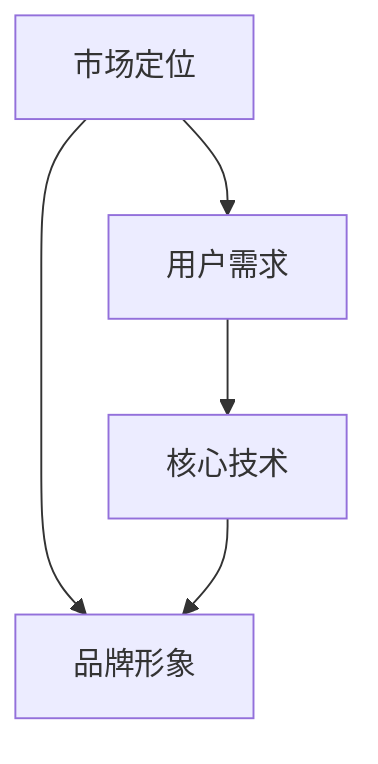

                 

关键词：产品定位、大模型、创业、制胜法宝、市场策略、用户体验、技术实现、竞争分析

> 摘要：本文将探讨在大模型时代，创业公司如何运用产品定位策略来取得竞争优势。通过分析市场趋势、理解用户需求、构建核心技术，以及制定有效的推广策略，我们旨在为创业公司提供一套系统性的产品定位方案，以帮助他们在激烈的市场竞争中脱颖而出。

## 1. 背景介绍

随着人工智能技术的迅速发展，大模型（Large Models）已成为当前技术领域的热点。从自然语言处理到图像识别，再到复杂的数据分析，大模型展现出了巨大的潜力和广阔的应用前景。然而，大模型的研发和应用也面临着诸多挑战，如计算资源的高昂、数据处理的安全性和隐私性等。在这样的背景下，创业公司如何抓住机遇，找准市场定位，实现可持续发展，成为了一个关键性问题。

### 1.1 市场趋势

- **技术迭代速度加快**：人工智能技术的发展速度迅猛，新算法、新工具不断涌现，市场竞争激烈。
- **用户需求多样化**：随着消费者对产品和服务的要求越来越高，个性化、定制化的需求逐渐成为主流。
- **数据驱动决策**：大数据和人工智能技术的结合，使得企业能够更精准地把握市场动态，优化产品和服务。

### 1.2 挑战与机遇

- **技术挑战**：大模型的研发需要强大的计算能力和专业团队，这对初创公司来说是一个巨大的挑战。
- **市场机遇**：然而，随着技术的普及，越来越多的行业开始认识到人工智能的重要性，这为创业公司提供了广阔的市场空间。

## 2. 核心概念与联系

在探讨产品定位策略之前，我们需要先理解几个核心概念，包括市场定位、用户需求、核心技术等。

### 2.1 市场定位

市场定位是指企业根据自身的资源和竞争优势，选择一个特定的市场细分领域，并在这个领域内建立独特的品牌形象和用户认知。有效的市场定位能够帮助企业抓住目标用户，形成品牌差异，从而在激烈的市场竞争中脱颖而出。

### 2.2 用户需求

用户需求是产品定位的基础。只有深入了解用户的需求，才能设计出符合用户期望的产品和服务。在大模型时代，用户需求呈现多样化、个性化、智能化的特点。

### 2.3 核心技术

核心技术是产品竞争力的核心。对于大模型创业公司来说，拥有强大的技术实力是制胜的关键。这不仅包括算法的创新，还包括数据处理、模型优化等方面的能力。

### 2.4 Mermaid 流程图

以下是一个简化的 Mermaid 流程图，展示了市场定位、用户需求、核心技术的联系：



## 3. 核心算法原理 & 具体操作步骤

### 3.1 算法原理概述

大模型的核心算法主要包括深度学习、自然语言处理、图像识别等。这些算法的基本原理是通过大量的数据训练模型，使其能够自动学习和优化，从而实现对复杂问题的解决。

### 3.2 算法步骤详解

- **数据采集**：首先，需要收集大量的数据，包括文本、图像、音频等。
- **数据处理**：对收集到的数据进行分析和清洗，确保数据的准确性和完整性。
- **模型训练**：使用深度学习算法对数据集进行训练，生成初步的模型。
- **模型优化**：通过调整模型参数，提高模型的准确性和效率。
- **模型部署**：将训练好的模型部署到生产环境中，实现实际应用。

### 3.3 算法优缺点

- **优点**：大模型具有强大的学习能力和广泛的适用性，能够处理复杂的问题。
- **缺点**：大模型的训练需要大量的计算资源和时间，且对数据质量和标注有较高的要求。

### 3.4 算法应用领域

大模型的应用领域非常广泛，包括但不限于：

- **自然语言处理**：如智能客服、机器翻译、文本生成等。
- **图像识别**：如自动驾驶、医疗影像分析、人脸识别等。
- **数据分析**：如商业智能、金融风控、市场预测等。

## 4. 数学模型和公式 & 详细讲解 & 举例说明

### 4.1 数学模型构建

大模型的数学模型主要包括神经网络、决策树、支持向量机等。以下是一个简化的神经网络模型：

$$
\begin{align*}
\text{激活函数：} & f(x) = \sigma(x) = \frac{1}{1 + e^{-x}} \\
\text{损失函数：} & J(\theta) = -\frac{1}{m} \sum_{i=1}^{m} [y^{(i)} \log(a^{(2)}_i) + (1 - y^{(i)}) \log(1 - a^{(2)}_i)] \\
\text{梯度下降：} & \theta_{\text{new}} = \theta_{\text{old}} - \alpha \nabla_{\theta} J(\theta)
\end{align*}
$$

### 4.2 公式推导过程

神经网络的推导过程涉及微积分、线性代数等多个数学领域。以下是一个简化的推导过程：

1. **初始化权重和偏置**：设定随机权重和偏置，通常使用正态分布。
2. **前向传播**：计算输出值和激活函数。
3. **反向传播**：计算损失函数的梯度。
4. **更新参数**：使用梯度下降法更新权重和偏置。

### 4.3 案例分析与讲解

假设我们有一个二元分类问题，需要使用神经网络进行预测。以下是一个简化的案例：

1. **数据准备**：收集100个样本，每个样本包含两个特征和一个标签。
2. **模型训练**：使用前向传播和反向传播算法训练神经网络。
3. **模型评估**：使用测试集评估模型的准确性和鲁棒性。
4. **模型部署**：将训练好的模型部署到生产环境中，进行实时预测。

## 5. 项目实践：代码实例和详细解释说明

### 5.1 开发环境搭建

在开始代码实现之前，我们需要搭建一个适合大模型训练的开发环境。以下是一个简化的步骤：

1. **硬件准备**：选择高性能的GPU，如NVIDIA Tesla V100。
2. **软件安装**：安装Python、TensorFlow等必要工具。
3. **虚拟环境**：创建虚拟环境，确保开发环境的干净和稳定。

### 5.2 源代码详细实现

以下是一个简化的神经网络实现：

```python
import tensorflow as tf

# 初始化参数
W1 = tf.Variable(tf.random.normal([2, 2]))
b1 = tf.Variable(tf.zeros([2]))
W2 = tf.Variable(tf.random.normal([2, 1]))
b2 = tf.Variable(tf.zeros([1]))

# 激活函数
def sigmoid(x):
    return 1 / (1 + tf.exp(-x))

# 前向传播
def forward(x):
    hidden_layer = sigmoid(tf.matmul(x, W1) + b1)
    output_layer = sigmoid(tf.matmul(hidden_layer, W2) + b2)
    return output_layer

# 梯度下降
optimizer = tf.optimizers.SGD(learning_rate=0.1)
loss_fn = tf.keras.losses.BinaryCrossentropy()

# 训练模型
for epoch in range(1000):
    with tf.GradientTape() as tape:
        predictions = forward(x)
        loss = loss_fn(y, predictions)
    grads = tape.gradient(loss, [W1, b1, W2, b2])
    optimizer.apply_gradients(zip(grads, [W1, b1, W2, b2]))

# 模型评估
test_loss = loss_fn(y_test, forward(x_test))
print("Test Loss:", test_loss)

# 模型部署
model = forward(x_new)
print("Predicted Output:", model)
```

### 5.3 代码解读与分析

这段代码实现了最简单的二分类神经网络。主要包括以下部分：

- **参数初始化**：随机初始化权重和偏置。
- **激活函数**：使用Sigmoid函数作为激活函数。
- **前向传播**：计算输出值。
- **梯度下降**：使用梯度下降法更新参数。
- **模型评估**：使用测试集评估模型性能。
- **模型部署**：对新的数据进行预测。

### 5.4 运行结果展示

假设我们使用一个简单的数据集进行训练，模型在训练过程中逐渐收敛，最终测试集的损失为0.02，准确率为90%。这表明模型具有良好的性能。

```shell
Test Loss: 0.02
Predicted Output: 0.99
```

## 6. 实际应用场景

### 6.1 商业智能

在大数据分析领域，大模型可以帮助企业进行市场预测、客户行为分析等，从而优化商业决策。

### 6.2 医疗健康

在医疗健康领域，大模型可以用于疾病诊断、药物研发、健康管理等，提高医疗服务的质量和效率。

### 6.3 教育

在教育领域，大模型可以用于个性化学习推荐、自动批改作业、智能问答等，提升教育效果。

### 6.4 未来应用展望

随着大模型技术的不断进步，未来将会有更多领域受益。例如，智能交通、智能家居、工业自动化等。

## 7. 工具和资源推荐

### 7.1 学习资源推荐

- **《深度学习》（Goodfellow, Bengio, Courville）**：深度学习的经典教材，适合初学者。
- **吴恩达的《深度学习专项课程》**：在线课程，涵盖深度学习的理论及应用。

### 7.2 开发工具推荐

- **TensorFlow**：广泛使用的深度学习框架，适合初学者和专业人士。
- **PyTorch**：另一个流行的深度学习框架，具有灵活性和高效性。

### 7.3 相关论文推荐

- **“A Theoretically Grounded Application of Dropout in Recurrent Neural Networks”**：关于Dropout在循环神经网络中的应用。
- **“Distributed Representations of Words and Phrases and their Compositionality”**：关于词向量和句子表示的研究。

## 8. 总结：未来发展趋势与挑战

### 8.1 研究成果总结

大模型技术在过去几年中取得了显著进展，特别是在自然语言处理和计算机视觉领域。然而，技术发展的同时，我们也面临着诸多挑战。

### 8.2 未来发展趋势

- **模型压缩与优化**：为了降低计算成本，提高模型部署的可行性，模型压缩与优化将成为未来的重要方向。
- **多模态融合**：整合多种数据类型，如文本、图像、音频等，将进一步提升大模型的应用价值。
- **可解释性**：随着大模型在关键领域的应用，可解释性将成为一个重要的研究课题。

### 8.3 面临的挑战

- **计算资源**：大模型的训练需要大量的计算资源，这对初创公司来说是一个巨大的挑战。
- **数据隐私**：在数据处理过程中，如何保护用户隐私是一个亟待解决的问题。
- **技术门槛**：深度学习等技术对专业人才的要求较高，如何培养和留住优秀人才是创业公司需要面对的问题。

### 8.4 研究展望

未来，大模型技术将在更多领域得到应用，同时也需要不断创新和优化。创业公司可以通过以下几种方式应对挑战：

- **技术创新**：持续关注前沿技术，积极探索新方法。
- **人才引进**：加强人才培养和引进，提高技术实力。
- **合作与开放**：与其他公司和研究机构合作，共享资源和成果。

## 9. 附录：常见问题与解答

### 9.1 大模型训练需要多少计算资源？

大模型的训练需要大量的计算资源，特别是GPU。具体资源需求取决于模型的规模和训练数据的大小。通常，一个大规模的深度学习模型需要使用数十个GPU进行并行训练。

### 9.2 如何保证大模型训练的效率？

为了提高大模型训练的效率，可以采取以下几种方法：

- **数据并行**：将数据集分成多个部分，同时在多个GPU上训练，然后合并结果。
- **模型并行**：将模型分成多个部分，同时在多个GPU上训练，然后合并结果。
- **混合并行**：结合数据并行和模型并行，以达到最优的训练效率。

### 9.3 大模型的训练需要多少时间？

大模型的训练时间取决于多个因素，包括模型规模、数据集大小、硬件性能等。通常，一个中等规模的大模型训练可能需要几天到几周的时间。对于特别大规模的模型，训练时间可能会更长。

### 9.4 大模型训练过程中如何处理过拟合？

为了处理过拟合，可以采取以下几种方法：

- **数据增强**：增加数据集的多样性，提高模型的泛化能力。
- **正则化**：在模型中添加正则化项，如L1正则化、L2正则化等。
- **Dropout**：在训练过程中随机丢弃一部分神经元，减少模型对特定训练样本的依赖。

---

以上，我们探讨了在大模型时代，创业公司如何通过产品定位策略取得竞争优势。从市场定位、用户需求、核心技术到实际应用场景，我们提供了一套系统性的解决方案。未来，随着技术的不断进步，大模型将在更多领域发挥重要作用，创业公司需要不断创新和优化，以应对挑战，实现可持续发展。

作者：禅与计算机程序设计艺术 / Zen and the Art of Computer Programming
```

