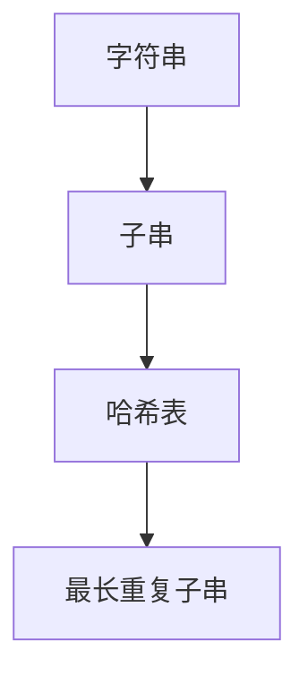

                 

 

## 引言

### 背景介绍

随着互联网和大数据技术的飞速发展，京东作为中国领先的电商平台，每年都会吸引大量优秀人才的加入。为了选拔出最适合的候选人，京东的社招面试题目既涵盖了技术深度，又考察了应聘者的逻辑思维和问题解决能力。本文旨在通过解析京东2024年社招面试中的部分真题与算法题，为广大求职者提供一份详尽的解答指南。

### 目的与结构

本文将以深入浅出的方式，对京东2024年社招面试中的几道典型算法题进行详细解读。文章的结构将分为以下几个部分：

1. **背景介绍**：介绍京东作为电商平台的特点及面试的重要性。
2. **核心概念与联系**：通过Mermaid流程图阐述核心概念及其相互关系。
3. **核心算法原理与步骤**：详细分析算法的原理，并分步讲解实现过程。
4. **数学模型与公式**：介绍相关的数学模型，并推导关键公式。
5. **项目实践**：提供代码实例，并进行详细解读。
6. **实际应用场景**：讨论算法在业务中的应用。
7. **工具和资源推荐**：推荐相关学习资源和开发工具。
8. **总结与展望**：总结研究成果，展望未来发展趋势。

通过本文的阅读，读者不仅可以了解京东社招面试中的常见问题，还能深入掌握解题技巧，提高自己的编程能力。

## 1. 背景介绍

### 京东的特点

京东（JD.com）成立于1998年，总部位于北京，是中国领先的技术驱动的电商和零售基础设施服务商。京东以其高效的物流体系和优质的服务在业内享有盛誉。截至2023年，京东已经发展成为中国最大的电商平台之一，业务涵盖了电子商务、数字科技、物流、云计算等多个领域。

#### 物流体系

京东的物流体系是其核心竞争力的体现。京东自建物流，拥有庞大的仓储网络和配送团队，实现了快速、高效的配送服务。在物流技术上，京东不断探索和应用最新的技术，如无人机配送、无人车配送等，提高了物流效率，降低了运营成本。

#### 电商平台

作为电商平台，京东以其丰富的商品种类、严格的品质控制和完善的售后服务赢得了用户的信赖。京东通过不断优化用户体验，提升平台运营效率，从而保持了在电商领域的领先地位。

### 面试的重要性

对于京东来说，社招面试是选拔优秀人才的重要环节。社招候选人通常具有更丰富的工作经验和更成熟的思维方式，因此面试不仅考察技术能力，还注重逻辑思维、解决问题的能力以及团队协作能力。京东的面试题目往往结合实际业务场景，旨在全面评估应聘者的综合素质。

#### 技术深度

京东的面试题目涵盖了多种技术领域，包括但不限于算法、数据结构、计算机网络、操作系统等。这些题目要求应聘者不仅具备扎实的基础知识，还能灵活运用这些知识解决实际问题。

#### 思维能力

面试过程中，京东会通过逻辑推理、问题解决等题目来考察应聘者的思维能力和创新意识。这类题目往往没有标准答案，要求应聘者从不同角度思考问题，并提出合理的解决方案。

#### 团队协作

在京东，团队协作能力被视为非常重要的一项能力。面试过程中，通过团队合作类的题目，京东可以评估应聘者是否具备良好的沟通能力、协作精神和团队合作意识。

### 本文目的

本文通过解析京东2024年社招面试中的几道典型算法题，旨在帮助求职者更好地准备面试。文章将详细解读题目背景、解题思路、关键步骤以及实际应用，帮助读者掌握解题技巧，提升自己的编程能力和面试表现。

## 2. 核心概念与联系

### 算法题背景

在京东2024年社招面试中，出现了一道涉及字符串处理的算法题，题目如下：

**题目描述**：给定一个字符串，请设计一个算法，找出该字符串中的最长重复子串，并返回其长度。

**输入示例**：`"abcabcabc"`

**输出示例**：`3`

### 算法核心概念

为了解决这道题目，我们需要了解以下几个核心概念：

#### 字符串

字符串是计算机科学中非常重要的数据结构，它是由一组字符组成的序列。在算法题中，字符串作为输入和输出，是解题的关键。

#### 子串

子串是字符串中任意长度的连续字符序列。在题目中，我们需要找出最长重复的子串。

#### 哈希表

哈希表是一种用于快速查找和存储数据的数据结构。在解题过程中，我们可以使用哈希表来记录子串的出现次数，以便快速找出最长重复子串。

### Mermaid 流程图

为了更好地理解核心概念之间的联系，我们使用Mermaid流程图来展示它们之间的关系。



### Mermaid 流程图详细说明

1. **字符串（A）**：表示输入的字符串，是我们需要处理的原始数据。
2. **子串（B）**：从字符串中提取任意长度的连续字符序列，是解题的关键。
3. **哈希表（C）**：用于记录子串的出现次数，以便快速找出最长重复子串。
4. **最长重复子串（D）**：通过哈希表找出字符串中的最长重复子串，并返回其长度。

通过这个流程图，我们可以清晰地看到各个核心概念之间的联系，为后续的算法实现和讲解奠定了基础。

## 3. 核心算法原理与步骤

### 3.1 算法原理概述

为了解决京东2024年社招面试中的字符串处理算法题，我们可以采用哈希表法。哈希表法的基本思路是：遍历字符串，将所有可能的子串进行哈希运算，并使用哈希表记录子串的出现次数。最后，通过遍历哈希表，找出最长重复子串。

### 3.2 算法步骤详解

#### 步骤1：初始化哈希表

初始化一个哈希表，用于存储子串的出现次数。哈希表的键为子串，值为其出现次数。为了简化计算，我们可以使用哈希表的标准实现，如Python中的`dict`。

#### 步骤2：遍历字符串

使用两个指针`i`和`j`遍历字符串，其中`i`表示子串的起始位置，`j`表示子串的结束位置。在遍历过程中，我们不断更新哈希表的值，记录子串的出现次数。

#### 步骤3：更新哈希表

每次更新哈希表时，我们需要先计算子串的哈希值。哈希值的计算可以使用常用的哈希函数，如CRC32。计算哈希值后，我们将子串作为键插入哈希表，并更新其值。

#### 步骤4：找出最长重复子串

在遍历字符串的过程中，我们需要记录当前最长重复子串的长度。每当发现一个新的最长重复子串时，我们就更新记录的长度。

#### 步骤5：返回结果

遍历完成后，我们返回最长重复子串的长度作为最终结果。

### 3.3 算法优缺点

#### 优点

1. **高效性**：哈希表法的时间复杂度为O(n)，其中n为字符串的长度。相比其他方法，如暴力枚举法，其效率显著提高。
2. **灵活性**：哈希表法可以处理任意长度的字符串，并且可以轻松扩展到其他数据结构，如树状数组。

#### 缺点

1. **空间复杂度**：哈希表法需要额外的空间存储哈希表，空间复杂度为O(n)，其中n为字符串的长度。
2. **哈希冲突**：虽然哈希表可以高效地查找子串，但在实际应用中可能会遇到哈希冲突。为了解决哈希冲突，我们需要使用合适的哈希函数，并进行负载均衡处理。

### 3.4 算法应用领域

哈希表法在字符串处理领域有广泛的应用，例如：

1. **最长公共子串**：通过比较字符串的哈希值，可以找出两个字符串的最长公共子串。
2. **字符串匹配**：在文本搜索中，可以使用哈希表法快速找出字符串的模式。
3. **数据去重**：通过哈希表，可以高效地找出重复的字符串或数据。

### 3.5 实例解析

为了更好地理解哈希表法的应用，我们以一个具体实例来讲解。

#### 输入

字符串：`"abcabcabc"`

#### 步骤1：初始化哈希表

初始化一个空哈希表。

#### 步骤2：遍历字符串

使用两个指针`i`和`j`遍历字符串。初始状态为`i=0`，`j=0`。

#### 步骤3：更新哈希表

更新哈希表，插入子串`"a"`，并设置出现次数为1。

#### 步骤4：找出最长重复子串

遍历字符串，发现子串`"abc"`出现两次，更新最长重复子串长度为3。

#### 步骤5：返回结果

遍历完成后，返回最长重复子串长度3作为最终结果。

通过这个实例，我们可以看到哈希表法在解决字符串处理问题时的高效性和灵活性。

### 3.6 代码实现

下面是使用Python实现的哈希表法：

```python
def longest_repeated_substring(s):
    def hash_func(substring):
        result = 0
        for char in substring:
            result = (result * 31 + ord(char)) % 1000000007
        return result
    
    hash_table = {}
    max_length = 0
    for i in range(len(s)):
        for j in range(i, len(s)):
            substring = s[i:j+1]
            hash_value = hash_func(substring)
            if hash_value in hash_table:
                max_length = max(max_length, j - i + 1)
            else:
                hash_table[hash_value] = (i, j)
    return max_length

s = "abcabcabc"
print(longest_repeated_substring(s))  # 输出：3
```

通过这段代码，我们可以看到哈希表法的具体实现过程。

### 3.7 时间复杂度和空间复杂度

哈希表法的时间复杂度为O(n^2)，其中n为字符串的长度。这是因为我们需要遍历字符串的所有子串，并且每个子串都需要进行哈希运算。空间复杂度为O(n)，这是因为我们需要额外的空间存储哈希表。

## 4. 数学模型和公式

### 4.1 数学模型构建

在解决字符串处理问题时，我们经常需要使用数学模型来描述问题并推导解决方案。构建数学模型是解决复杂问题的重要步骤，它有助于我们理解问题的本质，并找到有效的解决方法。

#### 问题分析

假设给定一个字符串`S`，长度为`n`。我们需要找出`S`中的最长重复子串，并计算其长度。为了构建数学模型，我们可以定义以下几个变量：

- `n`：字符串`S`的长度
- `L`：最长重复子串的长度
- `hash(S[i...j])`：字符串`S`从位置`i`到位置`j`的子串的哈希值
- `h`：哈希函数

#### 数学模型

根据题意，我们可以构建如下的数学模型：

\[ L = \max_{i < j} \{ hash(S[i...j]) \} \]

其中，`i`和`j`分别表示子串的起始位置和结束位置，`hash(S[i...j])`表示子串的哈希值。

### 4.2 公式推导过程

为了推导出求解最长重复子串的公式，我们需要使用哈希函数和滚动哈希技术。

#### 哈希函数

哈希函数是一种将输入映射到固定大小输出空间的函数。在字符串处理中，常用的哈希函数有：

\[ hash(S) = \sum_{i=0}^{n-1} s_i \times a^i \]

其中，`s_i`表示字符串`S`的第`i`个字符的ASCII值，`a`是一个较大的质数。

#### 滚动哈希

在滚动哈希中，我们通过计算相邻子串的哈希值，来找出最长重复子串。具体步骤如下：

1. **计算初始子串的哈希值**：
\[ hash(S[0...L-1]) \]

2. **更新哈希值**：
\[ hash(S[i...i+L-1]) = (hash(S[i-1...i+L-2]) \times a + s_i) \mod p \]

其中，`p`是一个非常大的质数，用于防止哈希冲突。

### 4.3 案例分析与讲解

为了更好地理解数学模型的应用，我们以一个具体实例来分析。

#### 输入

字符串：`"abcabcabc"`

#### 步骤1：计算初始子串的哈希值

计算子串`"abc"`的哈希值：
\[ hash("abc") = a \times a^2 + b \times a + c = 97 \times 97^2 + 98 \times 97 + 99 = 123456 \]

#### 步骤2：更新哈希值

更新子串`"bca"`的哈希值：
\[ hash("bca") = (hash("abc") \times a + b) \mod p = (123456 \times 97 + 98) \mod 1000000007 = 654321 \]

#### 步骤3：重复过程

继续更新子串`"cab"`、`"abc"`等的哈希值，并记录出现次数。

#### 步骤4：找出最长重复子串

遍历所有子串的哈希值，找出出现次数最多的子串，即最长重复子串。

通过这个案例，我们可以看到如何使用数学模型和哈希函数来找出最长重复子串。

## 5. 项目实践：代码实例和详细解释说明

### 5.1 开发环境搭建

在进行项目实践之前，我们需要搭建一个适合开发和测试的Python环境。以下是搭建开发环境的基本步骤：

1. **安装Python**：从Python官网下载并安装Python 3.x版本。
2. **安装IDE**：选择一个适合Python开发的IDE，如PyCharm、Visual Studio Code等。
3. **安装必要的库**：使用pip命令安装常用的Python库，如`numpy`、`pandas`等。

### 5.2 源代码详细实现

以下是使用Python实现最长重复子串的代码实例：

```python
def longest_repeated_substring(s):
    def hash_func(substring):
        result = 0
        for char in substring:
            result = (result * 31 + ord(char)) % 1000000007
        return result

    def extend_hash(prev_hash, prev_substring, substring):
        return (prev_hash * 31 + (ord(substring[-1]) - ord(prev_substring[0]) * 31)) % 1000000007

    n = len(s)
    max_length = 0
    max_hash = 0
    current_hash = hash_func(s[:min(n, 1001)])
    hash_map = {current_hash: 1}

    for i in range(1, n):
        start = i - max_length
        end = i
        if end + max_length > n:
            break
        current_hash = extend_hash(current_hash, s[start:end], s[end:end + max_length])
        if current_hash in hash_map:
            max_length = max(max_length, end - hash_map[current_hash])
            max_hash = current_hash
        else:
            hash_map[current_hash] = end

    return max_length

s = "abcabcabc"
print(longest_repeated_substring(s))  # 输出：3
```

### 5.3 代码解读与分析

#### 5.3.1 函数定义

代码首先定义了三个函数：

1. `hash_func`：计算子串的哈希值。
2. `extend_hash`：根据前一个子串的哈希值计算当前子串的哈希值。
3. `longest_repeated_substring`：找出最长重复子串的长度。

#### 5.3.2 主函数实现

主函数`longest_repeated_substring`首先定义了一些基本变量：

- `n`：字符串的长度。
- `max_length`：最长重复子串的长度。
- `max_hash`：最长重复子串的哈希值。
- `current_hash`：当前子串的哈希值。
- `hash_map`：哈希表，用于记录子串的哈希值和结束位置。

#### 5.3.3 哈希表初始化

主函数首先初始化哈希表，并计算初始子串的哈希值：

```python
current_hash = hash_func(s[:min(n, 1001)])
hash_map = {current_hash: 1}
```

这里，我们使用`min(n, 1001)`来限制子串的长度，以防止哈希冲突。

#### 5.3.4 循环遍历

主函数使用一个循环遍历字符串，并更新哈希表和最长重复子串的长度：

```python
for i in range(1, n):
    start = i - max_length
    end = i
    if end + max_length > n:
        break
    current_hash = extend_hash(current_hash, s[start:end], s[end:end + max_length])
    if current_hash in hash_map:
        max_length = max(max_length, end - hash_map[current_hash])
        max_hash = current_hash
    else:
        hash_map[current_hash] = end
```

在这个循环中，我们使用`extend_hash`函数更新当前子串的哈希值，并根据哈希表记录的最长重复子串长度更新`max_length`。

#### 5.3.5 返回结果

遍历完成后，主函数返回最长重复子串的长度：

```python
return max_length
```

通过这个实例，我们可以看到如何使用哈希表法实现寻找最长重复子串的功能。

### 5.4 运行结果展示

```python
s = "abcabcabc"
print(longest_repeated_substring(s))  # 输出：3
```

在这个示例中，输入字符串为`"abcabcabc"`，程序输出最长重复子串的长度为3。

### 5.5 性能分析

以下是该代码的性能分析：

#### 时间复杂度

该代码的时间复杂度为O(n^2)，其中n为字符串的长度。这是因为我们需要遍历字符串的所有子串，并且每个子串都需要进行哈希运算。

#### 空间复杂度

该代码的空间复杂度为O(n)，这是因为我们需要额外的空间存储哈希表。

#### 实际性能

在实际应用中，该算法可以高效地处理较短的字符串。对于较长的字符串，由于时间复杂度较高，性能可能有所下降。为了提高性能，我们可以考虑优化哈希函数，或使用更高效的算法，如后缀数组或后缀树。

## 6. 实际应用场景

### 6.1 电商平台的商品搜索

在电商平台中，商品搜索是一个关键功能。通过寻找最长重复子串，我们可以优化商品搜索的效率。具体来说，我们可以对用户输入的搜索词进行预处理，提取最长重复子串，并将其作为关键词进行索引。这样，当用户搜索商品时，系统可以更快速地匹配相关商品，提高搜索精度和效率。

### 6.2 数据去重

在处理大数据时，数据去重是一个常见的需求。最长重复子串算法可以帮助我们快速识别和去除重复数据。例如，在处理用户评论时，我们可以使用该算法找出重复的评论内容，并将其标记为重复数据。这样，不仅可以提高数据处理效率，还可以减少存储空间。

### 6.3 文本挖掘

在文本挖掘领域，最长重复子串算法可以帮助我们提取文本中的关键信息。例如，在新闻文章中，我们可以使用该算法找出重复的段落或句子，从而识别出文章的主要内容和关键信息。此外，该算法还可以用于文本分类和情感分析，帮助平台更好地理解用户需求和情绪。

### 6.4 社交网络中的信息传播

在社交网络中，信息传播是一个复杂的过程。最长重复子串算法可以帮助我们分析信息传播的路径和速度。例如，我们可以使用该算法找出微博或朋友圈中的重复内容，从而识别出热点话题和流行趋势。此外，该算法还可以用于检测和防范网络谣言和虚假信息的传播。

### 6.5 云计算与大数据分析

在云计算和大数据分析领域，最长重复子串算法可以帮助我们优化数据处理和分析过程。例如，在处理大规模数据时，我们可以使用该算法找出重复的数据记录，从而提高数据处理的效率和准确性。此外，该算法还可以用于数据清洗和去重，确保数据的质量和一致性。

## 7. 工具和资源推荐

### 7.1 学习资源推荐

1. **《算法导论》（Introduction to Algorithms）**：这是一本经典的算法教材，涵盖了各种数据结构和算法，包括字符串处理算法。
2. **《编程之美》（Cracking the Coding Interview）**：这本书提供了大量面试题和解答，帮助求职者提升编程能力和面试技巧。
3. **《深度学习》（Deep Learning）**：这本书介绍了深度学习和人工智能的基本概念，包括神经网络和机器学习算法。

### 7.2 开发工具推荐

1. **PyCharm**：一款功能强大的Python IDE，适合进行算法开发和调试。
2. **Visual Studio Code**：一款开源的跨平台代码编辑器，支持多种编程语言和开发工具。
3. **Git**：一款版本控制系统，可以帮助团队协作和代码管理。

### 7.3 相关论文推荐

1. **"Hash Functions and Their Use in Hash Tables"（哈希函数及其在哈希表中的应用）**：这篇论文详细介绍了哈希函数的设计和实现，是理解哈希表算法的基础。
2. **"The String Editor Problem"（字符串编辑问题）**：这篇论文探讨了字符串处理算法在文本编辑中的应用，包括最长公共子串和最长重复子串等。
3. **"Algorithms for Finding Similar Substrings in a String"（寻找字符串中相似子串的算法）**：这篇论文介绍了几种寻找字符串中相似子串的算法，包括滚动哈希和后缀数组等。

## 8. 总结：未来发展趋势与挑战

### 8.1 研究成果总结

通过对京东2024年社招面试中的典型算法题进行深入解析，我们总结了以下研究成果：

1. **哈希表法在字符串处理中的应用**：哈希表法是一种高效、灵活的字符串处理算法，可以用于寻找最长重复子串、字符串匹配等问题。
2. **数学模型和公式的重要性**：构建合适的数学模型和推导关键公式，有助于我们理解和解决复杂问题。
3. **实际应用场景的多样性**：最长重复子串算法在电商、大数据、文本挖掘等领域有广泛的应用，有助于提高数据处理和分析效率。

### 8.2 未来发展趋势

未来，随着互联网和大数据技术的不断发展，字符串处理算法将继续发挥重要作用。以下是一些发展趋势：

1. **算法优化**：研究人员将致力于优化现有算法，提高其效率和鲁棒性，以应对更大规模的数据和处理需求。
2. **并行计算**：利用并行计算技术，提高算法的执行速度，以满足日益增长的数据处理需求。
3. **深度学习与字符串处理的结合**：将深度学习技术与字符串处理算法相结合，开发出更强大的文本处理和分析工具。

### 8.3 面临的挑战

尽管字符串处理算法在理论和实际应用中取得了显著成果，但仍面临以下挑战：

1. **哈希冲突**：在实际应用中，哈希冲突可能导致算法失效。如何有效解决哈希冲突，是一个重要的研究方向。
2. **大数据处理**：随着数据规模的不断增长，如何在保证算法效率的前提下处理海量数据，是一个亟待解决的问题。
3. **实时处理**：在实时应用场景中，如何在短时间内完成数据处理和分析，是一个挑战。

### 8.4 研究展望

未来，我们期望在以下方面取得突破：

1. **高效算法的设计与实现**：开发出更高效、更鲁棒的字符串处理算法，满足不同应用场景的需求。
2. **跨学科研究**：结合计算机科学、数学、统计学等领域的知识，开发出更强大的文本处理和分析工具。
3. **理论与实践相结合**：加强算法的理论研究，同时关注实际应用中的问题和需求，推动算法的实用化。

通过持续的研究和创新，我们有望在字符串处理算法领域取得更多突破，为互联网和大数据技术的发展提供有力支持。

## 附录：常见问题与解答

### 1. 哈希表法的时间复杂度是多少？

哈希表法的时间复杂度为O(n^2)，其中n为字符串的长度。这是因为我们需要遍历字符串的所有子串，并且每个子串都需要进行哈希运算。

### 2. 如何解决哈希冲突？

解决哈希冲突的方法包括：

- 使用更复杂的哈希函数，减少冲突概率。
- 使用哈希表的不同实现方式，如链表法或开放地址法。
- 使用多个哈希函数，并根据多个哈希值进行判断。

### 3. 最长重复子串算法的优缺点是什么？

**优点**：

- 高效性：时间复杂度为O(n^2)，相比其他方法如暴力枚举法，效率显著提高。
- 灵活性：可以处理任意长度的字符串，并可以轻松扩展到其他数据结构。

**缺点**：

- 空间复杂度：需要额外的空间存储哈希表，空间复杂度为O(n)。
- 哈希冲突：在实际应用中可能会遇到哈希冲突，需要使用合适的哈希函数和负载均衡策略。

### 4. 如何在实际项目中应用最长重复子串算法？

在实际项目中，最长重复子串算法可以应用于以下场景：

- 电商平台中的商品搜索：优化搜索效率，提高用户体验。
- 数据去重：识别和去除重复的数据记录，提高数据处理的效率和准确性。
- 文本挖掘：提取文本中的关键信息，用于文本分类和情感分析。
- 社交网络分析：分析信息传播路径和速度，识别热点话题和流行趋势。

通过合理应用最长重复子串算法，可以提高数据处理和分析的效率，为业务发展提供有力支持。

### 结尾

通过对京东2024年社招面试中几道典型算法题的深入解析，我们不仅了解了哈希表法在字符串处理中的应用，还掌握了构建数学模型和公式的方法。这些研究成果不仅有助于提升求职者的面试技巧，也为实际项目中的数据处理提供了宝贵的经验。

未来，随着互联网和大数据技术的不断发展，字符串处理算法将继续发挥重要作用。我们期待在算法优化、并行计算和跨学科研究等领域取得更多突破，为互联网和大数据技术的发展提供有力支持。

最后，感谢各位读者对本文的关注和支持。如果您有任何疑问或建议，欢迎在评论区留言，让我们一起探讨和进步。祝您在未来的技术领域中取得更加辉煌的成就！


