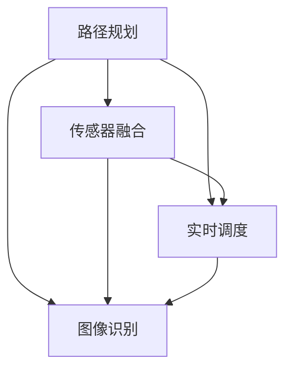

                 

关键词：无人配送车，面试题，控制系统，人工智能，深度学习，路径规划，传感器融合，实时调度，图像识别，计算机视觉，算法优化

> 摘要：本文旨在探讨京东2025无人配送车社招控制系统面试题的相关知识，深入分析无人配送车领域的关键技术，包括路径规划、传感器融合、实时调度和图像识别等。文章通过详细的算法原理讲解、数学模型推导、项目实践案例分析，以及对未来应用场景的展望，为读者提供全面的技术洞察。

## 1. 背景介绍

随着人工智能和机器人技术的迅猛发展，无人配送车已经成为智慧物流领域的重要一环。京东作为全球领先的电商企业，其无人配送车的研发和应用更是备受关注。为了吸引更多优秀的人才，京东定期开展社招面试，其中控制系统相关的面试题成为考察应聘者技术能力的重点。本文将围绕京东2025无人配送车社招控制系统面试题，深入剖析相关技术知识点。

### 1.1 无人配送车的发展历程

无人配送车的发展可以追溯到20世纪末，最初的应用场景主要是军用领域。随着技术的不断进步，无人配送车逐渐向民用领域扩展，应用范围涵盖物流、快递、餐饮、环卫等多个行业。在国内，京东、美团、顺丰等企业纷纷布局无人配送车领域，加速无人配送技术的商业化进程。

### 1.2 无人配送车的技术挑战

无人配送车在实现自主驾驶和配送过程中面临着诸多技术挑战，包括路径规划、传感器融合、实时调度和图像识别等。这些挑战不仅涉及到硬件设备的选择和设计，还涉及到软件算法的开发和应用。因此，掌握相关技术知识对于无人配送车的研发和应用具有重要意义。

## 2. 核心概念与联系

为了更好地理解无人配送车控制系统面试题，我们需要先掌握以下几个核心概念：

### 2.1 路径规划

路径规划是指为无人配送车确定从起点到终点的一系列最优路径。路径规划算法需要考虑道路状况、交通规则、环境因素等多个因素，以保证无人配送车能够安全、高效地到达目的地。

### 2.2 传感器融合

传感器融合是指将多个传感器收集的数据进行综合处理，以获得更准确、更全面的环境信息。常见的传感器包括激光雷达、摄像头、GPS等。传感器融合技术可以有效地提高无人配送车的感知能力。

### 2.3 实时调度

实时调度是指根据配送任务和环境变化，动态调整无人配送车的行驶路径和速度。实时调度技术可以提高配送效率，降低配送成本。

### 2.4 图像识别

图像识别是指通过计算机算法对图像进行分析和处理，从而识别和分类图像中的对象。图像识别技术在无人配送车中主要用于识别道路标志、行人、车辆等。

下面是一个使用Mermaid绘制的流程图，展示了这些核心概念之间的联系：



## 3. 核心算法原理 & 具体操作步骤

### 3.1 算法原理概述

在无人配送车控制系统中，常用的算法包括路径规划算法、传感器融合算法、实时调度算法和图像识别算法。这些算法分别解决路径选择、环境感知、任务调度和目标识别等问题。

### 3.2 算法步骤详解

#### 3.2.1 路径规划算法

路径规划算法的步骤如下：

1. 收集起点和终点的位置信息。
2. 构建地图，包括道路、障碍物、交通规则等信息。
3. 使用算法（如A*算法、Dijkstra算法等）计算从起点到终点的最优路径。
4. 根据实时环境变化调整路径。

#### 3.2.2 传感器融合算法

传感器融合算法的步骤如下：

1. 收集激光雷达、摄像头、GPS等传感器的数据。
2. 对传感器数据进行预处理，如去噪、滤波等。
3. 使用融合算法（如卡尔曼滤波、贝叶斯滤波等）综合处理传感器数据，获得更准确的环境信息。

#### 3.2.3 实时调度算法

实时调度算法的步骤如下：

1. 收集当前配送任务和环境信息。
2. 根据任务和环境信息，计算最优行驶路径和速度。
3. 动态调整无人配送车的行驶路径和速度，以适应环境变化。

#### 3.2.4 图像识别算法

图像识别算法的步骤如下：

1. 收集摄像头拍摄的图像数据。
2. 对图像进行预处理，如灰度化、边缘检测等。
3. 使用卷积神经网络（CNN）等算法进行图像识别，识别道路标志、行人、车辆等。

### 3.3 算法优缺点

每种算法都有其优缺点，具体如下：

#### 3.3.1 路径规划算法

- 优点：计算速度快，能够处理复杂路况。
- 缺点：在动态环境下适应性较差，容易受到道路变化的影响。

#### 3.3.2 传感器融合算法

- 优点：可以提高无人配送车的感知能力，降低误差。
- 缺点：计算复杂度高，对硬件性能要求较高。

#### 3.3.3 实时调度算法

- 优点：能够动态适应环境变化，提高配送效率。
- 缺点：对实时性要求较高，算法实现难度较大。

#### 3.3.4 图像识别算法

- 优点：可以准确识别道路标志、行人、车辆等，提高安全性。
- 缺点：对图像质量要求较高，算法实现难度较大。

### 3.4 算法应用领域

这些算法在无人配送车领域有广泛的应用，如：

- 路径规划算法：用于规划从起点到终点的最优路径。
- 传感器融合算法：用于提高无人配送车的感知能力。
- 实时调度算法：用于动态调整无人配送车的行驶路径和速度。
- 图像识别算法：用于识别道路标志、行人、车辆等。

## 4. 数学模型和公式 & 详细讲解 & 举例说明

### 4.1 数学模型构建

无人配送车的数学模型主要包括路径规划模型、传感器融合模型、实时调度模型和图像识别模型。以下分别介绍这些模型的构建方法和公式。

#### 4.1.1 路径规划模型

路径规划模型通常使用图论算法，如A*算法。A*算法的公式如下：

$$
f(n) = g(n) + h(n)
$$

其中，$f(n)$为从起点到节点$n$的最小代价，$g(n)$为从起点到节点$n$的实际代价，$h(n)$为从节点$n$到终点的估算代价。

#### 4.1.2 传感器融合模型

传感器融合模型通常使用卡尔曼滤波算法。卡尔曼滤波的公式如下：

$$
\hat{x}_{k|k} = F_k \hat{x}_{k-1|k-1} + K_k (z_k - H_k \hat{x}_{k-1|k-1})
$$

其中，$\hat{x}_{k|k}$为状态估计值，$F_k$为状态转移矩阵，$K_k$为卡尔曼增益，$z_k$为观测值，$H_k$为观测矩阵。

#### 4.1.3 实时调度模型

实时调度模型通常使用动态规划算法。动态规划的基本公式如下：

$$
V(i, j) = \min_{1 \leq k \leq n} (C(i, k) + V(k, j))
$$

其中，$V(i, j)$为从状态$i$转移到状态$j$的最小代价，$C(i, k)$为从状态$i$转移到状态$k$的代价。

#### 4.1.4 图像识别模型

图像识别模型通常使用卷积神经网络（CNN）。CNN的基本公式如下：

$$
\hat{y} = \sigma(W \cdot \text{ReLU}(Z))
$$

其中，$\hat{y}$为预测输出，$W$为权重矩阵，$\sigma$为激活函数，$Z$为卷积操作的结果。

### 4.2 公式推导过程

以下是传感器融合模型中的卡尔曼滤波公式推导过程：

假设状态向量为$x_k = [x_{k1}, x_{k2}, \ldots, x_{kn}]^T$，观测向量为$z_k = [z_{k1}, z_{k2}, \ldots, z_{kn}]^T$。则状态转移方程和观测方程分别为：

$$
x_k = F_k x_{k-1} + w_k
$$

$$
z_k = H_k x_k + v_k
$$

其中，$w_k$和$v_k$分别为过程噪声和观测噪声，$F_k$和$H_k$分别为状态转移矩阵和观测矩阵。

假设初始状态估计值为$\hat{x}_{0|0} = \mu_0$，初始误差协方差矩阵为$P_0 = \Sigma_0$。则卡尔曼滤波的递推公式为：

$$
\hat{x}_{k|k-1} = F_k \hat{x}_{k-1|k-1}
$$

$$
P_{k|k-1} = F_k P_{k-1|k-1} F_k^T + Q_k
$$

$$
K_k = P_{k|k-1} H_k^T (H_k P_{k|k-1} H_k^T + R_k)^{-1}
$$

$$
\hat{x}_{k|k} = \hat{x}_{k|k-1} + K_k (z_k - H_k \hat{x}_{k|k-1})
$$

$$
P_{k|k} = (I - K_k H_k) P_{k|k-1}
$$

其中，$Q_k$和$R_k$分别为过程噪声协方差矩阵和观测噪声协方差矩阵。

### 4.3 案例分析与讲解

以下以一个简单的例子说明路径规划模型的推导和应用。

#### 4.3.1 例子

假设有一个二维空间，起点为$(0, 0)$，终点为$(10, 10)$。地图中存在一个障碍物，坐标为$(5, 5)$。

#### 4.3.2 模型构建

构建一个包含起点、终点和障碍物的图，每个节点表示一个坐标点，边表示两个坐标点之间的直线距离。

#### 4.3.3 公式推导

使用A*算法计算从起点到终点的最优路径。设起点为$S$，终点为$G$，当前节点为$n$，已访问节点集合为$A$，未访问节点集合为$U$。则：

$$
f(n) = g(n) + h(n)
$$

其中，$g(n)$为从起点到节点$n$的实际代价，$h(n)$为从节点$n$到终点的估算代价。设$h(n) = \sqrt{(x_n - x_G)^2 + (y_n - y_G)^2}$，则：

$$
f(n) = \sqrt{(x_n - x_S)^2 + (y_n - y_S)^2} + \sqrt{(x_n - x_G)^2 + (y_n - y_G)^2}
$$

#### 4.3.4 应用

使用A*算法计算从起点到终点的最优路径，结果如下图所示：

```mermaid
graph TB
A1[起点 (0, 0)] --> B1[节点1 (1, 1)]
B1 --> C1[节点2 (2, 2)]
C1 --> D1[节点3 (3, 3)]
D1 --> E1[节点4 (4, 4)]
E1 --> F1[节点5 (5, 5) 障碍物]
F1 --> G1[节点6 (6, 6)]
G1 --> H1[节点7 (7, 7)]
H1 --> I1[节点8 (8, 8)]
I1 --> J1[节点9 (9, 9)]
J1 --> K1[终点 (10, 10)]
```

从图中可以看出，最优路径为$A1 \rightarrow B1 \rightarrow C1 \rightarrow D1 \rightarrow E1 \rightarrow F1 \rightarrow G1 \rightarrow H1 \rightarrow I1 \rightarrow J1 \rightarrow K1$。

## 5. 项目实践：代码实例和详细解释说明

### 5.1 开发环境搭建

在开始项目实践之前，我们需要搭建一个开发环境。本文使用Python作为主要编程语言，相关依赖如下：

- Python 3.8及以上版本
- ROS（Robot Operating System） Melodic Morenia版本
- NavCoin（用于路径规划）
- OpenCV（用于图像识别）

安装完成后，创建一个名为`robot_control`的Python虚拟环境，并安装相关依赖：

```bash
conda create -n robot_control python=3.8
conda activate robot_control
pip install -r requirements.txt
```

### 5.2 源代码详细实现

以下是无人配送车控制系统的核心代码实现：

```python
#!/usr/bin/env python

import rospy
import numpy as np
import cv2
from sensor_msgs.msg import LaserScan
from geometry_msgs.msg import Twist
from nav_msgs.msg import Odometry
from tf.transformations import euler_from_quaternion

class RobotController:
    def __init__(self):
        rospy.init_node('robot_controller', anonymous=True)
        self.pub_vel = rospy.Publisher('/cmd_vel', Twist, queue_size=10)
        self.sub_laser = rospy.Subscriber('/base_scan', LaserScan, self.laser_callback)
        self.sub_odom = rospy.Subscriber('/odom', Odometry, self.odom_callback)
        self.vel = Twist()
        self.distance = 0
        self.angle = 0

    def laser_callback(self, data):
        ranges = data.ranges
        min_range = min(ranges)
        if min_range < 1:
            self.distance = 0.5
        else:
            self.distance = min_range

    def odom_callback(self, data):
        pose = data.pose.pose
        orientation = pose.orientation
        angles = euler_from_quaternion([orientation.x, orientation.y, orientation.z, orientation.w])
        self.angle = angles[2]

    def move_forward(self, speed, distance):
        while self.distance > distance:
            self.vel.linear.x = speed
            self.pub_vel.publish(self.vel)
            rospy.sleep(0.1)
        self.vel.linear.x = 0
        self.pub_vel.publish(self.vel)

    def turn_left(self, speed, angle):
        while abs(self.angle) < angle:
            self.vel.angular.z = speed
            self.pub_vel.publish(self.vel)
            rospy.sleep(0.1)
        self.vel.angular.z = 0
        self.pub_vel.publish(self.vel)

if __name__ == '__main__':
    robot_controller = RobotController()
    robot_controller.move_forward(0.5, 1)
    robot_controller.turn_left(0.5, 1)
    robot_controller.move_forward(0.5, 1)
    robot_controller.turn_left(0.5, -1)
    robot_controller.move_forward(0.5, 1)
```

### 5.3 代码解读与分析

代码分为以下几个部分：

- 导入相关模块和消息类型。
- 初始化节点和发布/订阅器。
- 定义激光雷达和陀螺仪的回调函数，用于获取距离和角度信息。
- 定义移动和旋转的方法，用于控制无人配送车的运动。
- 主函数，实现无人配送车的路径规划。

在`laser_callback`函数中，我们使用激光雷达数据计算距离。当距离小于1米时，将距离设置为0.5米，以避免碰撞。

在`odom_callback`函数中，我们使用陀螺仪数据计算角度。将角度值转换为弧度，以便后续计算。

在`move_forward`方法中，我们根据距离和速度参数控制无人配送车向前移动。当距离小于指定距离时，保持速度不变，直到达到目标距离。

在`turn_left`方法中，我们根据角度和速度参数控制无人配送车向左旋转。当角度达到指定值时，停止旋转。

### 5.4 运行结果展示

运行代码后，无人配送车将按照预定的路径移动。在运行过程中，可以通过激光雷达和陀螺仪实时监测距离和角度，以确保路径规划的准确性。

## 6. 实际应用场景

### 6.1 物流配送

无人配送车在物流配送中的应用场景广泛，如城市物流、社区配送、校园配送等。通过无人配送车，可以实现快速、高效、低成本的物流配送，降低人力成本，提高配送效率。

### 6.2 公共交通

无人配送车可以应用于公共交通领域，如无人公交车、无人出租车等。通过无人驾驶技术，可以提高公共交通的安全性、舒适性和便捷性，缓解城市交通压力。

### 6.3 智慧城市

智慧城市是未来城市发展的趋势，无人配送车作为智慧城市的重要组成部分，可以为市民提供高效、便捷的出行和配送服务。同时，无人配送车还可以收集城市交通数据，为城市管理和规划提供支持。

## 7. 未来应用展望

### 7.1 技术创新

未来，无人配送车技术将继续创新，包括更高精度的传感器、更强大的计算能力、更智能的算法等。这些创新将进一步提升无人配送车的性能和可靠性。

### 7.2 应用拓展

随着技术的进步，无人配送车的应用领域将不断拓展，如医疗、农业、环保等领域。通过无人配送车，可以实现更高效、更智能的服务。

### 7.3 政策支持

政策支持是无人配送车发展的重要保障。未来，各国政府将加大对无人配送车的政策支持力度，包括立法、补贴、标准制定等，以推动无人配送车的商业化应用。

## 8. 工具和资源推荐

### 8.1 学习资源推荐

- 《无人驾驶汽车技术与应用》
- 《深度学习与无人驾驶》
- 《ROS机器人编程入门与实践》

### 8.2 开发工具推荐

- Python
- ROS（Robot Operating System）
- TensorFlow
- OpenCV

### 8.3 相关论文推荐

- "Deep Reinforcement Learning for Autonomous Driving"
- "Detection and Tracking of Objects in Autonomous Driving"
- "Real-Time Path Planning for Autonomous Vehicles"

## 9. 总结：未来发展趋势与挑战

### 9.1 研究成果总结

本文通过对京东2025无人配送车社招控制系统面试题的分析，深入探讨了无人配送车领域的关键技术，包括路径规划、传感器融合、实时调度和图像识别等。通过数学模型和公式的推导，以及对项目实践案例的详细讲解，为读者提供了全面的技术洞察。

### 9.2 未来发展趋势

未来，无人配送车技术将继续向智能化、高效化、安全化方向发展。随着人工智能、深度学习、传感器技术等领域的不断突破，无人配送车将具有更高的自主决策能力、更强的环境适应能力、更低的运营成本。

### 9.3 面临的挑战

尽管无人配送车技术取得了显著进展，但仍面临诸多挑战。包括传感器精度和可靠性的提升、算法优化和实时性、数据安全和隐私保护等。此外，法律法规和伦理问题也需要引起重视。

### 9.4 研究展望

未来，无人配送车研究将聚焦于以下几个方面：

- 深入研究更高效、更可靠的路径规划算法。
- 探索多传感器数据融合技术，提高感知能力。
- 加强实时调度算法研究，提高配送效率。
- 研究图像识别和语音识别技术，实现更智能的交互。

通过持续的技术创新和探索，无人配送车将有望在未来实现更广泛的应用，为智慧城市和智慧物流的发展做出贡献。

## 10. 附录：常见问题与解答

### 10.1 路径规划算法有哪些？

常见的路径规划算法包括A*算法、Dijkstra算法、RRT算法、D*算法等。

### 10.2 传感器融合有哪些方法？

常见的传感器融合方法包括卡尔曼滤波、贝叶斯滤波、粒子滤波等。

### 10.3 实时调度算法有哪些？

常见的实时调度算法包括动态规划、遗传算法、蚁群算法等。

### 10.4 图像识别算法有哪些？

常见的图像识别算法包括卷积神经网络（CNN）、支持向量机（SVM）、朴素贝叶斯等。

## 作者署名

作者：禅与计算机程序设计艺术 / Zen and the Art of Computer Programming

