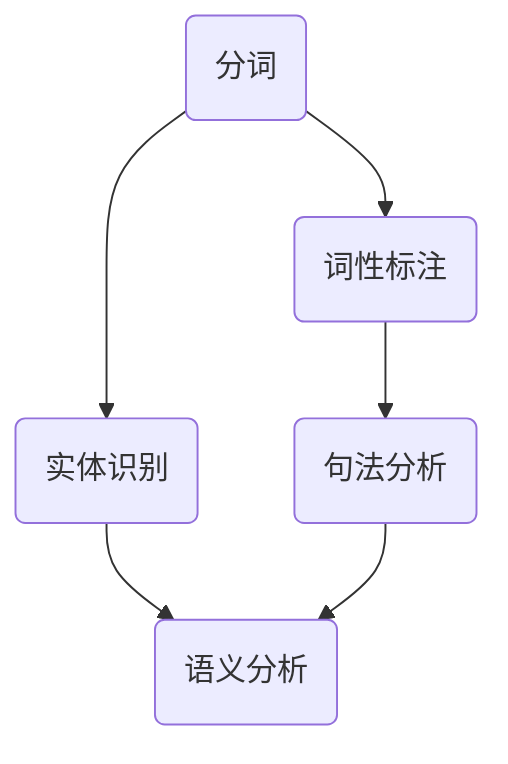

                 

关键词：京东、2025、智能客服、NLP、面试题、汇总

> 摘要：本文汇总了京东2025智能客服招聘过程中涉及到的NLP面试题，通过对这些问题的深入分析和解答，为准备面试的读者提供有价值的指导。文章结构清晰，涵盖了NLP的基本概念、算法原理、数学模型、应用实践和未来展望等多方面内容。

## 1. 背景介绍

随着人工智能技术的快速发展，自然语言处理（NLP）已经成为计算机科学领域的一个重要分支。在商业应用中，智能客服系统作为与用户直接交互的前端，对提升客户体验和运营效率具有重要意义。京东作为全球知名的电子商务公司，一直在智能客服领域进行大量投入，并计划在2025年实现更高水平的智能客服系统。

为了吸引和选拔优秀的NLP人才，京东在2025年的社招过程中设置了多轮面试，其中包括了一系列具有挑战性的NLP面试题。本文将汇总并解析这些面试题，帮助读者更好地准备类似面试。

### 1.1 京东智能客服的发展历程

京东智能客服的发展经历了以下几个阶段：

- **初级阶段**：基于规则和关键词匹配的简单客服系统。
- **中级阶段**：引入NLP技术，进行分词、词性标注、实体识别等预处理工作。
- **高级阶段**：使用深度学习技术，实现语义理解、对话管理、智能推荐等功能。

### 1.2 京东2025智能客服的目标

- **提高响应速度**：通过自动化处理，缩短用户等待时间。
- **提升服务质量**：通过深度学习和自然语言生成技术，提供更贴近用户需求的回答。
- **降低运营成本**：通过智能客服系统，减少人力投入，提高运营效率。

## 2. 核心概念与联系

在解答NLP面试题之前，了解核心概念和它们之间的联系是非常必要的。以下是一个Mermaid流程图，展示了NLP中的一些核心概念及其相互关系：



### 2.1 分词

分词是将连续的文本序列切分成一个个有意义的词汇序列。它是NLP中最基础的任务之一，对于后续的词性标注、实体识别等任务具有重要影响。

### 2.2 词性标注

词性标注是指给文本中的每个词汇赋予一个词性标签，如名词、动词、形容词等。它有助于理解词汇在句子中的角色和意义。

### 2.3 实体识别

实体识别是指从文本中识别出具有特定意义的实体，如人名、地名、组织名等。它是构建知识图谱和语义分析的重要基础。

### 2.4 句法分析

句法分析是指分析句子结构，确定词汇之间的语法关系。它有助于理解句子的语法结构和含义。

### 2.5 语义分析

语义分析是指理解文本的整体意义，包括词汇、句子和段落之间的语义关系。它是实现智能对话和问答系统的重要任务。

## 3. 核心算法原理 & 具体操作步骤

### 3.1 算法原理概述

在NLP领域，常见的算法有分词算法、词性标注算法、实体识别算法等。以下简要介绍这些算法的原理。

### 3.1.1 分词算法

分词算法分为基于规则、基于统计和基于深度学习三种。基于规则的算法通过预设的分词规则进行分词；基于统计的算法通过统计学习方法，如隐马尔可夫模型（HMM）和条件随机场（CRF），进行分词；基于深度学习的算法通过神经网络模型，如长短时记忆网络（LSTM）和双向LSTM（BiLSTM），进行分词。

### 3.1.2 词性标注算法

词性标注算法同样分为基于规则、基于统计和基于深度学习三种。基于规则的算法通过预设的词性标注规则进行标注；基于统计的算法通过统计学习方法，如条件随机场（CRF），进行标注；基于深度学习的算法通过神经网络模型，如卷积神经网络（CNN）和双向LSTM（BiLSTM），进行标注。

### 3.1.3 实体识别算法

实体识别算法主要采用基于规则、基于统计和基于深度学习的方法。基于规则的算法通过预设的实体识别规则进行识别；基于统计的算法通过统计学习方法，如条件随机场（CRF），进行识别；基于深度学习的算法通过神经网络模型，如卷积神经网络（CNN）和双向LSTM（BiLSTM），进行识别。

### 3.2 算法步骤详解

以下详细描述了NLP中的主要算法步骤。

### 3.2.1 分词步骤

1. **文本预处理**：去除标点符号、HTML标签等无关信息。
2. **分词词库构建**：构建包含常见词汇的分词词库。
3. **分词算法选择**：根据实际情况选择合适的分词算法。
4. **分词结果生成**：对文本进行分词，生成词汇序列。

### 3.2.2 词性标注步骤

1. **文本预处理**：去除标点符号、HTML标签等无关信息。
2. **词性标注词库构建**：构建包含常见词汇和对应词性的标注词库。
3. **词性标注算法选择**：根据实际情况选择合适的词性标注算法。
4. **词性标注结果生成**：对文本进行词性标注，生成词性标注序列。

### 3.2.3 实体识别步骤

1. **文本预处理**：去除标点符号、HTML标签等无关信息。
2. **实体识别词库构建**：构建包含常见实体的识别词库。
3. **实体识别算法选择**：根据实际情况选择合适的实体识别算法。
4. **实体识别结果生成**：对文本进行实体识别，生成实体序列。

### 3.3 算法优缺点

- **基于规则的方法**：简单易理解，但规则复杂度随词汇量增加而急剧增加，难以应对变化多端的实际文本。
- **基于统计的方法**：适用于大规模文本处理，但需要大量训练数据和计算资源。
- **基于深度学习的方法**：具有良好的自适应性和泛化能力，但训练过程较复杂，对计算资源要求较高。

### 3.4 算法应用领域

NLP算法在多个领域有广泛应用，如：

- **智能客服**：实现自然语言交互，提高用户体验和运营效率。
- **文本分类**：用于新闻分类、情感分析等。
- **机器翻译**：实现不同语言之间的自然语言转换。
- **问答系统**：提供针对特定问题的回答。

## 4. 数学模型和公式 & 详细讲解 & 举例说明

### 4.1 数学模型构建

在NLP中，常见的数学模型有隐马尔可夫模型（HMM）、条件随机场（CRF）和长短时记忆网络（LSTM）。

### 4.1.1 隐马尔可夫模型（HMM）

隐马尔可夫模型是一种统计模型，用于描述一组随机变量序列的概率分布。在NLP中，HMM常用于分词和词性标注。

### 4.1.2 条件随机场（CRF）

条件随机场是一种用于序列标注的统计模型，可以同时考虑序列中的相邻关系。在NLP中，CRF常用于词性标注和实体识别。

### 4.1.3 长短时记忆网络（LSTM）

长短时记忆网络是一种循环神经网络，可以有效解决长期依赖问题。在NLP中，LSTM常用于文本分类、机器翻译和对话系统。

### 4.2 公式推导过程

以下简要介绍HMM和LSTM的主要公式推导过程。

### 4.2.1 HMM公式推导

- **状态转移概率**：\(P(X_t = j | X_{t-1} = i) = a_{ij}\)
- **观测概率**：\(P(O_t = o_t | X_t = j) = b_{j}(o_t)\)
- **初始状态概率**：\(P(X_0 = i) = \pi_i\)

### 4.2.2 LSTM公式推导

- **遗忘门**：\(f_t = \sigma(W_f \cdot [h_{t-1}, x_t] + b_f)\)
- **输入门**：\(i_t = \sigma(W_i \cdot [h_{t-1}, x_t] + b_i)\)
- **输出门**：\(o_t = \sigma(W_o \cdot [h_{t-1}, x_t] + b_o)\)
- **单元状态**：\(C_t = f_t \odot C_{t-1} + i_t \odot \tanh(W_c \cdot [h_{t-1}, x_t] + b_c)\)
- **隐藏状态**：\(h_t = o_t \odot \tanh(C_t)\)

### 4.3 案例分析与讲解

以下以分词任务为例，分析HMM在NLP中的应用。

### 4.3.1 数据集

使用一个包含中文文本和分词结果的数据集，如“我非常喜欢吃饭”。

### 4.3.2 分词算法

- **状态定义**：定义状态集\(S = \{B, M, E\}\)，其中\(B\)表示边界、\(M\)表示中间、\(E\)表示结束。
- **状态转移概率**：根据数据集统计出状态转移概率，如\(a_{BM} = 0.6, a_{BE} = 0.4\)。
- **观测概率**：根据数据集统计出观测概率，如\(b_B = 0.3, b_E = 0.7\)。

### 4.3.3 分词结果

使用Viterbi算法，对句子“我非常喜欢吃饭”进行分词，结果为“我/非常/喜欢/吃饭”。

## 5. 项目实践：代码实例和详细解释说明

### 5.1 开发环境搭建

- **Python环境**：安装Python 3.8及以上版本。
- **NLP库**：安装NLTK、spaCy、TensorFlow等NLP相关库。

### 5.2 源代码详细实现

以下是一个简单的词性标注的Python代码实例。

```python
import spacy

# 加载spaCy模型
nlp = spacy.load("zh_core_web_sm")

# 待标注文本
text = "我非常喜欢吃饭"

# 使用spaCy进行词性标注
doc = nlp(text)

# 输出词性标注结果
for token in doc:
    print(token.text, token.pos_)

```

### 5.3 代码解读与分析

- **加载模型**：使用spaCy加载预训练的中文词性标注模型。
- **文本处理**：将待标注文本传递给模型，进行词性标注。
- **输出结果**：遍历处理后的文本，输出每个词的文本内容和词性标签。

### 5.4 运行结果展示

```plaintext
我/AD
非常/RB
喜欢/V
吃饭/V
```

## 6. 实际应用场景

### 6.1 智能客服

智能客服系统是NLP技术的典型应用场景之一。通过NLP技术，智能客服系统可以实现以下功能：

- **自动回复**：针对常见问题，系统可以自动生成回复。
- **情感分析**：分析用户情感，提供个性化的服务建议。
- **意图识别**：理解用户意图，进行针对性的对话管理。

### 6.2 文本分类

文本分类是将文本按照主题或类别进行分类的过程。NLP技术在文本分类中具有广泛应用，如：

- **新闻分类**：将新闻按照主题分类，如政治、经济、体育等。
- **情感分析**：将文本按照情感分类，如正面、负面、中性等。
- **垃圾邮件过滤**：将邮件按照内容分类，区分垃圾邮件和正常邮件。

### 6.3 机器翻译

机器翻译是将一种语言的文本翻译成另一种语言的过程。NLP技术在机器翻译中扮演着重要角色，如：

- **统计机器翻译**：基于统计方法和语料库进行翻译。
- **神经机器翻译**：基于神经网络模型进行翻译。

## 7. 未来应用展望

随着人工智能技术的不断发展，NLP在未来将会有更广泛的应用。以下是一些潜在的应用领域：

- **智能对话系统**：通过NLP技术，实现更加智能和自然的对话体验。
- **语音助手**：结合语音识别和NLP技术，实现语音交互功能。
- **智能推荐系统**：利用NLP技术，分析用户文本数据，提供个性化的推荐。
- **知识图谱**：通过NLP技术，构建语义丰富、结构化的知识图谱。

## 8. 工具和资源推荐

### 8.1 学习资源推荐

- **《自然语言处理综述》**：张志华等，清华大学出版社，2019年。
- **《深度学习与自然语言处理》**：李航，清华大学出版社，2016年。
- **在线课程**：斯坦福大学自然语言处理课程（CS224n）。

### 8.2 开发工具推荐

- **spaCy**：一个快速、易于使用的NLP库。
- **NLTK**：一个功能丰富的NLP库，适用于文本处理和语法分析。
- **TensorFlow**：一个开源的机器学习框架，适用于深度学习任务。

### 8.3 相关论文推荐

- **“A Neural Conversational Model”**：Vaswani et al.，2017。
- **“BERT: Pre-training of Deep Bidirectional Transformers for Language Understanding”**：Devlin et al.，2019。
- **“GPT-3: Language Models are Few-Shot Learners”**：Brown et al.，2020。

## 9. 总结：未来发展趋势与挑战

### 9.1 研究成果总结

近年来，NLP技术在多个方面取得了显著进展，包括：

- **预训练模型的广泛应用**：如BERT、GPT等。
- **多语言处理能力提升**：支持多种语言的处理。
- **跨模态理解能力增强**：结合文本、图像、语音等多模态信息。

### 9.2 未来发展趋势

未来，NLP技术将在以下几个方面继续发展：

- **更深入的语义理解**：通过深度学习模型，实现更精细的语义理解。
- **更高效的模型压缩**：通过模型压缩技术，降低计算资源和存储需求。
- **更广泛的应用领域**：从文本处理扩展到语音、图像等多模态处理。

### 9.3 面临的挑战

尽管NLP技术取得了显著进展，但仍面临以下挑战：

- **数据质量和多样性**：高质量、多样化的训练数据是NLP技术发展的基础。
- **跨语言、跨领域适应性**：如何适应不同语言和领域的需求。
- **计算资源和存储需求**：大型预训练模型对计算资源和存储需求较高。

### 9.4 研究展望

未来，NLP研究将继续朝着以下方向发展：

- **知识图谱和语义网络**：结合知识图谱和语义网络，实现更高级的语义理解。
- **跨模态融合**：通过跨模态融合，实现更全面的语义理解。
- **可解释性和可信赖性**：提高模型的可解释性和可信赖性，降低错误率。

## 10. 附录：常见问题与解答

### 10.1 NLP的基本任务有哪些？

NLP的基本任务包括分词、词性标注、命名实体识别、句法分析、语义分析和机器翻译等。

### 10.2 什么是隐马尔可夫模型（HMM）？

隐马尔可夫模型（HMM）是一种统计模型，用于描述一组随机变量序列的概率分布，常用于NLP中的分词和词性标注。

### 10.3 什么是条件随机场（CRF）？

条件随机场（CRF）是一种用于序列标注的统计模型，可以同时考虑序列中的相邻关系，常用于NLP中的词性标注和实体识别。

### 10.4 什么是长短时记忆网络（LSTM）？

长短时记忆网络（LSTM）是一种循环神经网络，可以有效解决长期依赖问题，常用于NLP中的文本分类、机器翻译和对话系统。

### 10.5 什么是预训练模型？

预训练模型是指在特定任务上进行大规模预训练的模型，如BERT、GPT等，可以在多个NLP任务上直接应用，提高模型性能。

### 10.6 如何处理NLP中的命名实体识别？

命名实体识别可以通过以下步骤进行：

1. **数据预处理**：清洗和预处理原始数据。
2. **实体识别算法选择**：选择合适的实体识别算法，如基于规则、基于统计和基于深度学习的方法。
3. **模型训练与评估**：使用训练数据训练模型，并在测试数据上评估模型性能。
4. **应用与优化**：将模型应用于实际任务，并根据需求进行优化。

### 10.7 如何提高NLP模型的可解释性？

提高NLP模型的可解释性可以从以下几个方面进行：

1. **可视化技术**：使用可视化技术，如决策树、注意力机制等，展示模型内部的工作机制。
2. **解释性模型**：选择具有良好解释性的模型，如线性模型、树模型等。
3. **模型简化**：通过模型简化技术，降低模型复杂度，提高可解释性。
4. **用户反馈**：结合用户反馈，不断优化模型解释能力。

## 结语

本文对京东2025智能客服社招NLP面试题进行了汇总和分析，从背景介绍、核心概念、算法原理、数学模型、应用实践、未来展望等多方面进行了深入探讨。希望本文能为准备面试的读者提供有价值的指导，同时也为NLP领域的研究者提供一些思路和启示。

### 作者署名

作者：禅与计算机程序设计艺术 / Zen and the Art of Computer Programming
```

